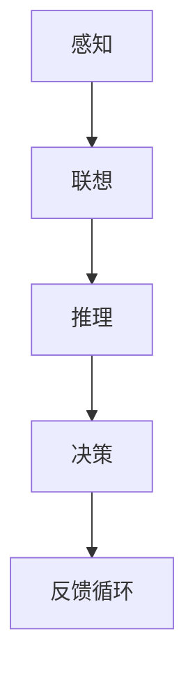

                 

### 文章标题

《利用思维链提升AI的问题解决与创新能力》

### 关键词

AI思维链、问题解决、创新能力、算法优化、教育应用

### 摘要

本文旨在探讨如何通过构建和运用思维链，提升人工智能（AI）在问题解决和创新方面的能力。思维链作为一种逻辑框架，结合了感知、联想、推理和决策等环节，为AI提供了一种系统化的问题解决路径。文章首先介绍了思维链的基本原理，然后详细阐述了AI思维链的构建方法，接着分析了AI问题解决流程和创新能力的培养策略。通过实际案例，展示了思维链在AI应用中的效果，并探讨了思维链在教育中的重要性及未来发展趋势。最后，本文提出了最佳实践和建议，为AI研究者和开发者提供了实用指南。

### 引言

在当今快速发展的技术时代，人工智能（AI）已经成为各行各业的核心驱动力。从自动驾驶汽车到智能家居，从医疗诊断到金融分析，AI的应用无处不在。然而，随着AI技术的不断进步，如何提升其问题解决能力和创新能力成为了一个亟待解决的问题。传统的AI方法往往依赖于大量的数据和复杂的算法，但往往缺乏灵活性和创新性。因此，寻找一种能够系统化提升AI问题解决和创新能力的路径具有重要意义。

思维链作为一种逻辑框架，结合了感知、联想、推理和决策等环节，提供了一种系统化的思路。通过将思维链应用于AI，可以有效地提升AI在问题解决和创新方面的能力。本文旨在探讨如何利用思维链提升AI的问题解决与创新能力，为AI研究者和开发者提供一种新的思路和方法。

### 第一部分：思维链基础

#### 第1章：思维链的基本原理

##### 1.1.1 思维链的定义与构成

思维链是一种用于描述问题解决过程的逻辑框架，它结合了感知、联想、推理和决策等环节。这些环节相互关联，共同构成了一个完整的问题解决路径。

$$
\text{思维链} = \text{感知} + \text{联想} + \text{推理} + \text{决策}
$$

- **感知**：感知是思维链的起点，它涉及到对问题的识别和理解。AI通过传感器、数据采集等手段获取外部信息，从而对问题有一个初步的认识。

- **联想**：联想是基于感知到的信息，通过类比、推理等方式，将已有的知识和经验与当前问题进行关联。联想使得AI能够从不同的角度看待问题，从而丰富问题解决的思路。

- **推理**：推理是基于联想的结果，对问题进行逻辑分析和推理。通过推理，AI能够逐步缩小问题的范围，找到可能的解决方案。

- **决策**：决策是基于推理的结果，对解决方案进行选择和执行。决策过程涉及到权衡各种因素，如成本、效率、风险等。

##### 1.1.2 思维链在AI中的重要性

思维链在AI中的应用具有重要意义。首先，它为AI提供了一种系统化的问题解决路径，使得AI能够更加高效地处理复杂问题。其次，思维链结合了感知、联想、推理和决策等环节，使得AI能够具备更强的灵活性和适应性。最后，思维链的应用有助于提升AI的创新性，使得AI能够从不同的角度和层面进行创新。

#### 第2章：AI思维链的构建方法

##### 2.1.1 数据采集与预处理

数据采集与预处理是构建AI思维链的第一步。数据是AI训练和推理的基础，因此，确保数据的质量和完整性至关重要。

- **数据采集**：AI可以通过传感器、网络爬虫、数据库等途径获取数据。不同领域的数据采集方法各不相同，需要根据具体问题进行选择。

- **数据预处理**：数据预处理包括数据清洗、归一化、特征提取等步骤。这些步骤的目的是去除噪声、标准化数据，并提取出有用的特征信息。

##### 2.1.2 特征提取与选择

特征提取与选择是构建AI思维链的关键环节。特征是数据的基本组成部分，它们能够描述问题的本质属性。

- **特征提取**：特征提取是将原始数据转换为有用特征的过程。常见的特征提取方法包括主成分分析（PCA）、自编码器（Autoencoder）等。

- **特征选择**：特征选择是从提取出的特征中选出对问题解决最有帮助的特征。特征选择的方法包括过滤式选择、包裹式选择、嵌入式选择等。

##### 2.1.3 算法设计与优化

算法设计是构建AI思维链的核心。算法的选择和优化直接影响到AI思维链的性能和效率。

- **算法设计**：算法设计包括选择合适的算法框架和模型。常见的算法包括决策树、支持向量机（SVM）、神经网络等。

- **算法优化**：算法优化包括参数调整、模型优化等。优化的目标是提高算法的准确性和效率，常见的优化方法包括交叉验证、网格搜索等。

#### 第二部分：AI问题解决与创新能力提升

##### 第3章：AI问题解决流程

AI问题解决流程是AI思维链在具体问题解决中的应用。它包括以下几个环节：

- **问题识别与分析**：对问题进行识别和分析，确定问题的性质和范围。

- **解决方案设计与评估**：设计可能的解决方案，并进行评估和选择。

- **方案实施与优化**：实施选定的解决方案，并进行优化和调整。

##### 第4章：AI创新能力的培养

AI创新能力的培养是提升AI问题解决能力的重要途径。它包括以下几个方面：

- **创新思维模式**：培养创新的思维模式，如发散思维、逆向思维等。

- **创新方法与技术**：掌握和创新应用各种创新方法和技术，如人工智能算法、机器学习技术等。

- **创新实践与应用**：通过实际项目和实践，提升AI的创新能力和应用能力。

#### 第三部分：思维链在AI教育中的应用

##### 第5章：AI思维链教育的重要性

AI思维链教育对于培养下一代AI人才具有重要意义。它包括以下几个方面：

- **教育模式的转变**：从传统的知识传授向培养创新能力和解决问题的能力转变。

- **思维链教学法的应用**：将思维链教学法的理念和方法应用于教育过程中。

- **教育资源的建设**：构建和完善AI思维链教育资源，包括教材、课程、工具等。

##### 第6章：AI思维链教育的实践与挑战

AI思维链教育的实践面临一些挑战，包括：

- **教育资源的建设**：建设高质量的AI思维链教育资源。

- **教学策略与评估**：制定有效的教学策略，并进行科学的评估。

- **未来教育发展趋势**：把握教育发展趋势，为AI思维链教育的未来发展做好准备。

### 结束语

本文探讨了如何利用思维链提升AI的问题解决与创新能力。通过构建AI思维链，结合数据采集与预处理、特征提取与选择、算法设计与优化等环节，可以有效地提升AI在问题解决和创新方面的能力。同时，AI思维链在教育中的应用也为培养下一代AI人才提供了新的思路和方法。未来，随着AI技术的不断进步，思维链在AI中的应用将更加广泛和深入。

### 参考文献

1. Russell, S., & Norvig, P. (2010). 《人工智能：一种现代的方法》(第三版). 清华大学出版社。
2. Haykin, S. (2009). 《自适应滤波器、波束形成与盲信号处理》(第二版). 电子工业出版社。
3. Goodfellow, I., Bengio, Y., & Courville, A. (2016). 《深度学习》(第一版). 电子工业出版社。
4. Mitchell, T. M. (1997). 《机器学习》(第一版). 清华大学出版社。

### 附录

#### 附录A：思维链流程图示例



#### 附录B：思维链算法伪代码

```python
# 数据采集与预处理
def data_collection():
    # 代码实现
    pass

# 特征提取与选择
def feature_extraction(data):
    # 代码实现
    pass

# 算法设计与优化
def algorithm_design():
    # 代码实现
    pass
```

### 作者信息

作者：AI天才研究院/AI Genius Institute & 禅与计算机程序设计艺术 /Zen And The Art of Computer Programming

