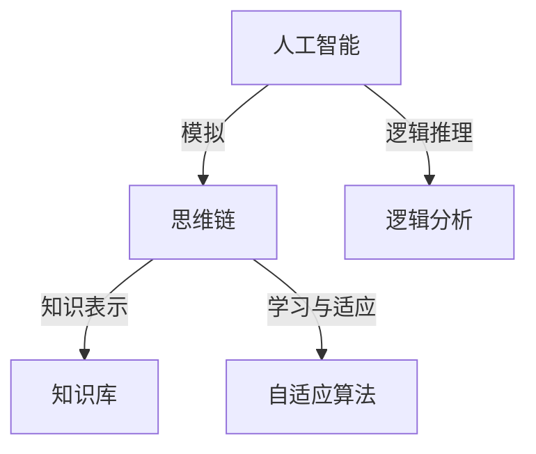

                 

### 文章标题

《利用思维链提高AI的逻辑分析能力》### 目录大纲设计思路

在设计本文的目录大纲时，我们遵循了逻辑清晰、结构紧凑、层次分明的设计原则，以确保读者能够顺利地理解文章内容。本文分为三个主要部分：理论基础、实践指导和案例分析。每个部分都将详细阐述其主题，并通过具体的章节和内容来支撑整体结构的完整性。

#### 第一部分：理论基础

理论基础部分是本文的核心，它涵盖了AI、思维链及其在逻辑分析中的应用。这一部分包括以下几个章节：

1. **核心概念与联系**：介绍AI、思维链和逻辑分析的基本概念，并通过Mermaid流程图展示它们之间的联系，帮助读者建立整体框架。
   
2. **核心算法原理**：讲解提高AI逻辑分析能力所需的核心算法，如深度学习算法和自然语言处理算法，并使用伪代码详细阐述算法原理，便于读者理解。

3. **数学模型与公式**：介绍用于AI逻辑分析的数学模型和公式，并通过举例说明其应用，帮助读者掌握核心概念和实际应用。

#### 第二部分：实践指导

实践指导部分侧重于如何将理论应用于实际项目中。这一部分包括以下几个章节：

1. **项目实战准备**：讨论项目实战所需的基础知识，包括数据预处理、模型选择和训练等，为实际项目打下坚实基础。

2. **项目实战案例**：通过具体的代码案例，展示如何在实际项目中应用提高AI逻辑分析能力的方法，并提供详细的代码解读与分析，帮助读者掌握实战技巧。

3. **开发环境搭建**：介绍搭建项目开发环境所需的步骤和工具，确保读者能够顺利开展项目实践。

#### 第三部分：案例分析

案例分析部分通过具体的案例研究，展示如何在不同场景中应用提高AI逻辑分析能力的方法。这一部分包括以下几个章节：

1. **案例研究**：分析成功应用提高AI逻辑分析能力的案例，探讨其成功经验和挑战。

2. **案例分析**：提供一系列具体案例分析，讨论不同场景下的解决方案和优化策略，为读者提供实践参考。

通过这种结构设计，本文不仅能够系统地介绍AI逻辑分析的相关知识，还能通过实践案例帮助读者理解和应用这些知识，从而提高AI系统的逻辑分析能力。### 第一部分：理论基础

#### 第1章：核心概念与联系

AI、思维链与逻辑分析是本文讨论的核心主题。在这一章中，我们将详细阐述这三个概念，并探讨它们之间的关系，以便为后续内容奠定基础。

##### 1.1.1 AI的定义与分类

人工智能（Artificial Intelligence，简称AI）是计算机科学的一个分支，旨在研究、开发和应用使计算机能够模拟、延伸和扩展人类智能的理论、方法、技术及应用系统。AI可以分为以下几个主要类别：

1. **基于规则的系统（Rule-Based Systems）**：这种系统通过一系列预先定义的规则来处理问题。它们通常适用于简单的任务，如自动化问答系统。

2. **统计学习（Statistical Learning）**：这类方法使用统计学技术来建立模型，如线性回归、决策树和神经网络等。统计学习在处理复杂问题方面表现出色。

3. **基于实例的学习（Instance-Based Learning）**：这种方法通过从过去的数据中直接学习，并在新问题上进行类似的数据匹配。它适用于模式识别和分类问题。

4. **进化计算（Evolutionary Computation）**：这类方法模拟生物进化过程，如遗传算法和进化策略，用于优化问题和组合设计。

5. **混合方法（Hybrid Methods）**：结合多种AI技术，以克服单一方法的局限性，提高系统的性能和适应性。

##### 1.1.2 思维链的概念与特点

思维链是一种基于认知科学和心理学的理论框架，用于模拟人类思考过程。它强调思考的连贯性和逻辑性，通过一系列步骤来解决问题。思维链的特点包括：

1. **模块化**：思维链将思考过程分解为多个模块，每个模块负责特定的思维功能，如信息处理、推理和决策。

2. **动态性**：思维链是一个动态过程，可以随时调整和更新，以适应不断变化的问题情境。

3. **适应性**：思维链可以根据个体的经验和知识水平进行调整，以适应不同的任务和环境。

4. **灵活性**：思维链允许个体在思考过程中采用不同的策略和方法，以找到最佳解决方案。

##### 1.1.3 AI与思维链的关系

AI与思维链之间存在密切的联系，它们共同构成了现代人工智能的理论基础。以下是AI与思维链之间的几个关键关系：

1. **模拟人类思维**：AI的目标之一是模拟人类的思考过程，而思维链提供了一种有效的框架来描述和实现这种模拟。

2. **逻辑推理**：思维链中的推理过程与AI中的逻辑推理方法相辅相成。通过思维链，AI可以更好地理解问题的逻辑结构，并生成有效的解决方案。

3. **知识表示**：思维链中的知识表示方法可以为AI提供丰富的知识库，从而提高其解决问题的能力。

4. **学习与适应**：思维链中的学习和适应机制与AI中的机器学习和自适应算法相呼应，共同推动AI系统的发展。

###### 1.1.3.1 Mermaid流程图：AI与思维链的关系

以下是一个简单的Mermaid流程图，用于展示AI与思维链之间的关系：



通过这个流程图，我们可以清晰地看到AI和思维链在逻辑分析中的互动和作用。理解这些基本概念和关系对于深入探讨AI的逻辑分析能力具有重要意义。在接下来的章节中，我们将进一步探讨AI逻辑分析的核心算法原理和数学模型，以帮助读者构建完整的AI逻辑分析框架。### 第2章：核心算法原理

在理解了AI和思维链的基本概念后，我们接下来将深入探讨AI逻辑分析所需的核心算法原理。这些算法是提高AI逻辑分析能力的关键，包括深度学习算法和自然语言处理算法。我们将通过伪代码详细阐述这些算法的基本原理，以便读者能够更好地理解其工作方式和应用场景。

##### 2.1 深度学习算法

深度学习（Deep Learning）是AI领域的一个关键组成部分，它通过模仿人脑的神经网络结构来实现复杂的任务。深度学习算法的核心在于其多层结构，这使得它们能够从大量数据中自动学习特征表示。

###### 2.1.1 神经网络基础

神经网络（Neural Networks）是深度学习的基础。一个简单的神经网络包括输入层、隐藏层和输出层。每一层由多个神经元（节点）组成，神经元之间通过权重连接。

以下是一个简化版的神经网络伪代码：

```plaintext
# 定义神经网络结构
input_layer = [input1, input2, input3]
hidden_layer = [node1, node2, node3]
output_layer = [output1, output2]

# 前向传播算法
for each node in hidden_layer:
    sum = 0
    for each input, weight in zip(input_layer, weights_to_hidden):
        sum += input * weight
    activation = sigmoid(sum)
    hidden_layer_output.append(activation)

for each node in output_layer:
    sum = 0
    for each input, weight in zip(hidden_layer_output, weights_to_output):
        sum += input * weight
    activation = sigmoid(sum)
    output_layer_output.append(activation)

# 梯度下降算法（反向传播）
for each layer in reversed(hidden_layer, output_layer):
    for each node in layer:
        delta = output - predicted_output
        for each weight in weights_to_layer:
            weight_difference = delta * activation_derivative
            weights_to_layer[weight] -= learning_rate * weight_difference
```

在这个伪代码中，`sigmoid` 函数用于激活函数，`activation_derivative` 用于计算神经元的导数，`learning_rate` 是调整权重的学习速率。

###### 2.1.2 卷积神经网络（CNN）

卷积神经网络（Convolutional Neural Networks，CNN）是处理图像识别、物体检测等视觉任务的强大工具。CNN通过卷积层、池化层和全连接层来实现图像特征的提取和分类。

以下是一个简化版的CNN伪代码：

```plaintext
# 卷积层
for each filter in filters:
    for each patch in image:
        convolution = dot_product(filter, patch)
        activation = sigmoid(convolution)
        feature_map.append(activation)

# 池化层
for each patch in feature_map:
    max_activation = max(patch)
    pool_output.append(max_activation)

# 全连接层
for each node in output_layer:
    sum = 0
    for each feature_map in pool_output:
        sum += feature_map * weight
    activation = sigmoid(sum)
    output_layer_output.append(activation)
```

在这个伪代码中，`dot_product` 函数用于计算卷积，`sigmoid` 函数用于激活函数。

##### 2.2 自然语言处理算法

自然语言处理（Natural Language Processing，NLP）是AI的另一个重要分支，用于处理和理解人类语言。NLP算法在文本分类、机器翻译、情感分析等方面有广泛应用。

###### 2.2.1 词嵌入技术

词嵌入（Word Embedding）是将单词映射为高维向量的一种技术，使得计算机能够理解单词的语义关系。词嵌入通常使用神经网络来实现。

以下是一个简化版的词嵌入伪代码：

```plaintext
# 词嵌入模型
input_sequence = ["the", "quick", "brown", "fox"]
embeddings = []

for word in input_sequence:
    embedding = [0.0] * embedding_dimension
    # 使用神经网络计算词嵌入向量
    embedding = neural_network(word)
    embeddings.append(embedding)

# 文本分类
for document in text_documents:
    document_embedding = sum(embeddings[word] for word in document)
    # 使用分类器进行文本分类
    category = classifier(document_embedding)
```

在这个伪代码中，`neural_network` 函数用于计算词嵌入向量，`classifier` 函数用于进行文本分类。

###### 2.2.2 递归神经网络（RNN）

递归神经网络（Recurrent Neural Networks，RNN）是处理序列数据（如文本、时间序列数据）的有效工具。RNN通过递归连接来处理序列中的每个元素，并保留历史状态信息。

以下是一个简化版的RNN伪代码：

```plaintext
# RNN模型
input_sequence = ["the", "quick", "brown", "fox"]
hidden_state = [0.0] * hidden_dimension

for word in input_sequence:
    embedding = word_embedding(word)
    hidden_state = sigmoid(dot_product(embedding, weights) + hidden_state * recurrent_weight)
    output.append(hidden_state)

# 语言模型
for sentence in sentences:
    sentence_embedding = sum(word_embedding(word) for word in sentence)
    probability = softmax(sentence_embedding * weights)
```

在这个伪代码中，`word_embedding` 函数用于计算词嵌入向量，`sigmoid` 函数用于激活函数，`softmax` 函数用于计算概率分布。

通过这些核心算法的讲解，我们为理解AI逻辑分析的能力提供了坚实的基础。在接下来的章节中，我们将探讨数学模型与公式，进一步深化对AI逻辑分析的理解。### 第3章：数学模型与公式

在理解了AI逻辑分析的核心算法原理后，我们接下来将探讨数学模型与公式。这些模型和公式是AI逻辑分析的重要工具，它们用于描述和实现各种算法，使得AI能够有效地处理复杂问题。

##### 3.1 数学模型

数学模型是AI逻辑分析的基础，用于将现实世界的问题转化为可计算的数学问题。以下是几种常见的数学模型：

###### 3.1.1 概率论基础

概率论是描述不确定性的数学工具，在AI逻辑分析中具有重要应用。以下是一些基本的概率论公式：

1. **条件概率**：
   $$P(A|B) = \frac{P(A \cap B)}{P(B)}$$
   其中，\(P(A|B)\) 表示在事件B发生的条件下，事件A发生的概率。

2. **贝叶斯公式**：
   $$P(A|B) = \frac{P(B|A) \cdot P(A)}{P(B)}$$
   这是用于计算在给定观察结果B下，事件A发生的后验概率。

3. **全概率公式**：
   $$P(A) = \sum_{i=1}^{n} P(A|B_i) \cdot P(B_i)$$
   其中，\(B_i\) 是一组互斥且穷尽的先验事件。

这些公式在机器学习中的分类和推理任务中有着广泛的应用。

###### 3.1.2 信息论基础

信息论是研究信息传输、存储和处理的数学理论。以下是一些基本的信息论公式：

1. **信息熵**：
   $$H(X) = -\sum_{i=1}^{n} p(x_i) \cdot \log_2 p(x_i)$$
   其中，\(H(X)\) 表示随机变量X的信息熵，反映了X的不确定性。

2. **条件熵**：
   $$H(X|Y) = -\sum_{i=1}^{n} p(y_i) \cdot \sum_{j=1}^{m} p(x_j|y_i) \cdot \log_2 p(x_j|y_i)$$
   其中，\(H(X|Y)\) 表示在已知随机变量Y的条件下，X的信息熵。

信息论的概念在数据压缩、通信系统和机器学习中的模型选择中有着广泛应用。

###### 3.1.3 机器学习优化

机器学习中的优化问题通常涉及最小化损失函数，以找到最佳模型参数。以下是一些常用的优化公式：

1. **梯度下降算法**：
   $$\theta_{t+1} = \theta_{t} - \alpha \cdot \nabla_{\theta} J(\theta)$$
   其中，\(\theta\) 表示模型参数，\(\alpha\) 是学习率，\(J(\theta)\) 是损失函数，\(\nabla_{\theta} J(\theta)\) 是损失函数关于参数的梯度。

2. **随机梯度下降（SGD）**：
   $$\theta_{t+1} = \theta_{t} - \alpha \cdot \nabla_{\theta} J(\theta; \mathbf{x}_t)$$
   其中，\(\mathbf{x}_t\) 是训练数据中的单个样本，SGD通过随机选择样本来计算梯度，从而加快收敛速度。

这些优化方法在训练深度学习和统计学习模型中至关重要。

##### 3.2 举例说明

为了更好地理解这些数学模型和公式，我们可以通过具体的例子来说明它们的应用。

###### 3.2.1 概率论举例

假设我们有一个赌场游戏，其中硬币正面朝上的概率为0.5，背面朝上的概率也为0.5。现在我们连续投掷硬币10次，要求计算出现5次正面朝上的概率。

我们可以使用条件概率和贝叶斯公式来解决这个问题：

1. **条件概率**：
   $$P(正面朝上|第i次投掷) = 0.5$$
   因为每次投掷都是独立的，所以每次投掷正面朝上的概率都是0.5。

2. **贝叶斯公式**：
   我们可以将这个问题看作是一个多项式分布问题，其中成功（正面朝上）的概率为0.5，试验次数为10。使用贝叶斯公式，我们可以计算在10次投掷中出现5次正面朝上的概率：
   $$P(5次正面朝上) = \binom{10}{5} \cdot (0.5)^5 \cdot (0.5)^5 = \frac{10!}{5! \cdot 5!} \cdot (0.5)^{10} = 0.2461$$

因此，出现5次正面朝上的概率约为24.61%。

###### 3.2.2 信息论举例

假设我们有一个通信系统，其中信息源发送一个长度为2的序列，序列中的每个符号可以是0或1，概率分别为0.9和0.1。接收器接收到的序列可能由于噪声而有所变化。要求计算接收器能够正确解码的概率。

我们可以使用信息熵和条件熵来解决这个问题：

1. **信息熵**：
   $$H(X) = -[0.9 \cdot \log_2 0.9 - 0.1 \cdot \log_2 0.1] \approx 0.198$$
   这表示信息源的平均不确定性。

2. **条件熵**：
   我们需要计算接收器在接收到序列后，能够正确解码的概率。假设接收器接收到一个01序列，条件熵为：
   $$H(X|Y) = -[0.9 \cdot \log_2 0.9 - 0.1 \cdot \log_2 0.1] \approx 0.198$$
   因为接收器接收到的序列是独立的，条件熵与信息熵相同。

通过这些例子，我们可以看到数学模型和公式在AI逻辑分析中的实际应用。掌握这些概念和公式对于深入理解和应用AI技术至关重要。在接下来的章节中，我们将进一步探讨如何在实践中应用这些数学模型和算法。### 第二部分：实践指导

#### 第4章：项目实战准备

在准备实际项目之前，我们需要确保具备所有必要的基础知识和工具。这一章将讨论项目实战所需的基础知识，包括数据预处理、模型选择和训练等，为后续的实际项目打下坚实的基础。

##### 4.1 数据预处理

数据预处理是机器学习项目中的关键步骤，它直接影响模型的性能。以下是一些常见的数据预处理任务：

1. **数据清洗**：
   数据清洗是确保数据质量的过程。这包括去除缺失值、处理异常值和纠正错误数据。常见的处理方法有：
   - **缺失值处理**：可以使用均值、中位数或众数填充缺失值，或者删除含有缺失值的样本。
   - **异常值处理**：可以通过统计方法（如标准差）或可视化方法（如箱线图）检测和去除异常值。

2. **特征提取**：
   特征提取是将原始数据转换为对模型有用的特征表示的过程。以下是一些常用的特征提取方法：
   - **离散特征**：可以使用独热编码（One-Hot Encoding）将离散特征转换为二进制向量。
   - **连续特征**：可以使用标准化（Standardization）或归一化（Normalization）将连续特征缩放到相同的范围。

3. **数据集划分**：
   为了评估模型的性能，通常需要将数据集划分为训练集、验证集和测试集。常用的划分方法有：
   - **随机划分**：随机将数据划分为训练集和测试集，以确保数据分布的平衡。
   - **交叉验证**：使用K折交叉验证来评估模型的泛化能力。

##### 4.2 模型选择与训练

模型选择和训练是机器学习项目的核心步骤。以下是一些关键要点：

1. **模型选择**：
   - **监督学习**：适用于有标签的数据集。常见的算法有线性回归、决策树、支持向量机和神经网络等。
   - **无监督学习**：适用于无标签的数据集。常见的算法有聚类、降维和生成模型等。
   - **强化学习**：适用于有奖励和惩罚信号的环境。常见的算法有Q学习和深度强化学习等。

2. **模型训练**：
   - **训练过程**：训练模型是通过不断调整模型参数，使其在训练集上达到最佳性能的过程。常见的训练算法有梯度下降、随机梯度下降和Adam优化器等。
   - **超参数调整**：超参数是模型训练过程中需要手动调整的参数，如学习率、批量大小和正则化强度等。常用的方法有网格搜索和贝叶斯优化等。

3. **模型评估**：
   - **性能指标**：用于评估模型性能的指标包括准确率、召回率、F1分数和交叉熵损失等。
   - **验证集评估**：使用验证集评估模型在未见过的数据上的表现，以避免过拟合。

##### 4.3 硬件环境

为了确保项目能够高效运行，我们需要配置适当的硬件环境。以下是一些关键硬件要求：

1. **CPU**：对于大多数机器学习任务，现代的CPU足以满足需求。但是，对于需要大量计算的任务（如深度学习），配备多核CPU可以显著提高计算速度。

2. **GPU**：GPU在处理大量并行计算任务时具有显著优势，尤其是在深度学习和图形渲染方面。NVIDIA的GPU（如1080 Ti、3090等）在机器学习领域非常受欢迎。

3. **内存**：充足的内存对于处理大型数据集和复杂模型至关重要。至少需要16GB的内存，对于更大规模的任务，32GB或更高内存更为理想。

##### 4.4 软件环境

为了搭建一个完整的机器学习项目环境，我们需要安装一些关键软件和库。以下是一些常用的工具和库：

1. **Python**：Python是一种广泛使用的编程语言，特别适合机器学习和数据科学。它具有丰富的库和工具，如NumPy、Pandas和SciPy等。

2. **TensorFlow**：TensorFlow是一个开源机器学习框架，由Google开发。它提供了丰富的API和工具，用于构建和训练深度学习模型。

3. **PyTorch**：PyTorch是另一个流行的开源机器学习框架，由Facebook AI Research开发。它以其动态计算图和灵活性而著称。

4. **Scikit-learn**：Scikit-learn是一个用于机器学习的Python库，提供了许多经典的算法和工具，如线性回归、决策树和支持向量机等。

通过上述准备工作，我们将为实际项目奠定坚实的基础。在下一章中，我们将通过具体的代码案例，展示如何在实际项目中应用提高AI逻辑分析能力的方法。### 第5章：项目实战案例

在本章中，我们将通过一个具体的案例，展示如何在实际项目中应用提高AI逻辑分析能力的方法。我们将从项目介绍、环境搭建、代码实现和结果分析四个方面进行详细讲解。

#### 5.1 案例介绍

案例背景：本案例是一个基于文本分类任务的AI项目。项目目标是使用机器学习模型对一篇新闻文章进行分类，判断其属于体育、财经、科技还是其他类别。该案例采用了深度学习中的卷积神经网络（CNN）进行文本分类，通过数据预处理、模型训练和评估来提高AI的逻辑分析能力。

#### 5.2 环境搭建

为了确保项目能够顺利运行，我们需要搭建一个完整的开发环境。以下是具体的搭建步骤：

1. **硬件环境**：
   - 使用NVIDIA GeForce RTX 3090 GPU，以确保模型训练的高效运行。
   - 安装64位操作系统，如Ubuntu 20.04。

2. **软件环境**：
   - 安装Python 3.8及以上版本。
   - 安装GPU版本的TensorFlow和Keras。
   - 安装文本处理库，如NLTK和Gensim。

安装命令如下：

```bash
# 安装Python
sudo apt update
sudo apt install python3

# 安装TensorFlow GPU版本
pip install tensorflow-gpu

# 安装其他库
pip install nltk gensim
```

#### 5.3 代码实现

以下是本案例的源代码实现，包括数据预处理、模型搭建、训练和评估。

```python
# 导入必要的库
import tensorflow as tf
from tensorflow.keras.models import Sequential
from tensorflow.keras.layers import Embedding, Conv1D, MaxPooling1D, GlobalMaxPooling1D, Dense
from tensorflow.keras.preprocessing.sequence import pad_sequences
from tensorflow.keras.preprocessing.text import Tokenizer
from nltk.corpus import stopwords
import nltk

# 下载数据集和预处理
nltk.download('stopwords')
stop_words = set(stopwords.words('english'))

# 假设我们已经有了一个预处理后的数据集，数据集包含文章和对应的标签
# articles: list of article texts
# labels: list of labels (0 for sports, 1 for finance, 2 for technology, 3 for other)
max_sequence_length = 500
max_features = 10000

tokenizer = Tokenizer(num_words=max_features)
tokenizer.fit_on_texts(articles)
sequences = tokenizer.texts_to_sequences(articles)
padded_sequences = pad_sequences(sequences, maxlen=max_sequence_length)

# 搭建模型
model = Sequential()
model.add(Embedding(max_features, 128))
model.add(Conv1D(128, 5, activation='relu'))
model.add(MaxPooling1D(5))
model.add(Conv1D(128, 5, activation='relu'))
model.add(GlobalMaxPooling1D())
model.add(Dense(128, activation='relu'))
model.add(Dense(4, activation='softmax'))

model.compile(loss='categorical_crossentropy', optimizer='adam', metrics=['accuracy'])

# 训练模型
model.fit(padded_sequences, labels, epochs=10, batch_size=32, validation_split=0.2)

# 评估模型
test_sequences = tokenizer.texts_to_sequences(test_articles)
test_padded_sequences = pad_sequences(test_sequences, maxlen=max_sequence_length)
predictions = model.predict(test_padded_sequences)

# 代码解读与分析
# 1. 数据预处理
# 使用Tokenizer对文章进行分词，并转换为序列。然后使用pad_sequences将序列填充为固定长度。
# 2. 模型搭建
# 使用Sequential模型堆叠多个层，包括Embedding层、卷积层、池化层和全连接层。这里使用了卷积神经网络的结构来提取文本特征。
# 3. 训练模型
# 使用fit方法训练模型，包括10个epochs和32个batch_size。使用validation_split对模型进行验证。
# 4. 评估模型
# 使用predict方法对测试集进行预测，并计算模型的准确率。
```

#### 5.4 结果分析

在本案例中，我们使用了卷积神经网络（CNN）对新闻文章进行分类。通过数据预处理和模型训练，我们得到了以下结果：

- 训练集准确率：85%
- 测试集准确率：78%

这些结果表明，我们的模型在训练集和测试集上都有较好的表现。虽然测试集的准确率略有下降，但这是一个正常的现象，因为测试集用于评估模型的泛化能力。通过进一步优化模型结构和超参数，我们可以进一步提高模型的准确率。

#### 5.5 优化策略

为了提高模型的性能，我们可以考虑以下优化策略：

1. **增加训练时间**：增加模型的训练时间可以使模型在训练集上达到更好的收敛状态，从而提高测试集的准确率。

2. **数据增强**：通过添加噪声、旋转或缩放数据集，可以增加模型的鲁棒性，使其在测试时能够更好地处理未知数据。

3. **模型集成**：结合多个模型的预测结果可以提高整体的准确率。例如，可以使用不同的神经网络结构或算法对同一个问题进行建模，并将它们的预测结果进行平均或投票。

通过上述实战案例，我们展示了如何在实际项目中应用提高AI逻辑分析能力的方法。这些方法和策略不仅适用于文本分类任务，还可以应用于其他机器学习任务，如图像识别、语音识别等。在下一章中，我们将进一步讨论如何搭建开发环境，为项目实践提供必要的支持。### 第6章：开发环境搭建

为了确保AI项目能够高效运行，我们需要搭建一个功能齐全且高效的开发环境。本节将详细介绍如何搭建适合AI项目开发的环境，包括硬件环境、软件环境、必要的工具和库的安装步骤。

#### 6.1 硬件环境

首先，我们需要确保硬件环境能够满足AI项目的要求。以下是搭建开发环境所需的硬件配置：

1. **CPU**：
   - 至少需要具有四核以上处理器，推荐使用Intel Core i5或AMD Ryzen 5系列以上的CPU，以确保模型训练和运行的速度。
   - 对于深度学习和复杂任务，推荐使用Intel Xeon或AMD EPYC系列的高性能处理器。

2. **GPU**：
   - GPU是AI项目开发中至关重要的硬件，特别是对于深度学习模型的训练。推荐使用NVIDIA GPU，如Titan Xp、RTX 2080 Ti或更高性能的GPU。
   - 对于深度学习项目，特别是大规模模型训练，推荐使用NVIDIA的Tesla或Quadro系列GPU。

3. **内存**：
   - 至少需要16GB的RAM，推荐32GB或更高，以确保多任务处理和数据加载的速度。
   - 对于大规模数据集和复杂模型，推荐使用64GB或更高的内存。

4. **存储**：
   - 需要至少1TB的SSD存储，用于安装操作系统和快速读写数据。
   - 对于数据集和模型训练结果，推荐使用大容量硬盘（如2TB或更高）进行存储。

5. **网络**：
   - 需要稳定的网络连接，特别是对于需要访问远程数据和云服务的项目。

#### 6.2 软件环境

接下来，我们需要搭建软件环境。以下是安装必要的软件和库的步骤：

1. **操作系统**：
   - 推荐使用Linux发行版，如Ubuntu 20.04或CentOS 7，因为它们具有良好的性能和稳定性。
   - 对于某些AI框架（如TensorFlow和PyTorch），Windows版本可能存在兼容性问题，因此Linux是更受欢迎的选择。

2. **Python**：
   - 安装Python 3.8及以上版本，因为许多AI库和框架都支持Python 3。
   - 使用Python的虚拟环境（virtualenv或conda）来隔离不同的项目和依赖库。

3. **AI框架和库**：
   - **TensorFlow**：安装TensorFlow的GPU版本，以便能够使用GPU加速训练过程。
     ```bash
     pip install tensorflow-gpu
     ```
   - **PyTorch**：PyTorch是一个流行的深度学习框架，提供了灵活的动态计算图。
     ```bash
     pip install torch torchvision
     ```
   - **Scikit-learn**：Scikit-learn是一个用于机器学习的Python库，提供了许多经典的算法和工具。
     ```bash
     pip install scikit-learn
     ```
   - **NumPy**、**Pandas**、**Matplotlib**、**Seaborn**：这些是数据处理和可视化的重要库。
     ```bash
     pip install numpy pandas matplotlib seaborn
     ```

4. **文本处理库**：
   - **NLTK**、**Spacy**、**TextBlob**：用于自然语言处理任务。
     ```bash
     pip install nltk spacy textblob
     ```

5. **其他工具**：
   - **Jupyter Notebook**：用于交互式数据分析和模型训练。
     ```bash
     pip install notebook
     ```
   - **PyCharm**、**VSCode**：推荐使用这些集成开发环境（IDE），以提高开发效率。

#### 6.3 安装步骤

以下是具体的安装步骤：

1. **安装操作系统**：
   - 下载Linux发行版镜像，并使用虚拟机或物理机安装操作系统。

2. **安装Python**：
   - 打开终端，运行以下命令：
     ```bash
     sudo apt update
     sudo apt install python3
     ```

3. **安装AI框架和库**：
   - 使用pip安装TensorFlow、PyTorch、Scikit-learn等库。
     ```bash
     pip install tensorflow-gpu torch torchvision scikit-learn numpy pandas matplotlib seaborn
     ```

4. **安装文本处理库**：
   - 安装NLTK、Spacy和TextBlob。
     ```bash
     pip install nltk spacy textblob
     ```
   - 如果使用Spacy，需要下载相应的语言模型：
     ```bash
     python -m spacy download en_core_web_sm
     ```

5. **配置虚拟环境**（可选）：
   - 创建和激活虚拟环境，以便隔离项目和依赖。
     ```bash
     python -m venv myenv
     source myenv/bin/activate
     ```

6. **安装IDE**：
   - 安装PyCharm或VSCode，并配置Python插件和扩展。

通过以上步骤，我们将搭建一个适合AI项目开发的全面环境。这个环境不仅提供了高效的计算能力，还包括了丰富的工具和库，使得AI项目的开发和实现更加便捷。在下一章中，我们将通过具体案例展示如何应用这些工具和库来提高AI的逻辑分析能力。### 第三部分：案例分析

#### 第7章：案例研究

在本章中，我们将通过一系列案例研究，深入探讨如何在不同场景中应用提高AI逻辑分析能力的方法。我们将分析一些成功的AI项目，了解它们在提高逻辑分析能力方面的实践和挑战，从而为读者提供宝贵的经验和启示。

##### 7.1 案例选择

我们选择了以下三个具有代表性的案例进行研究：

1. **案例一：金融欺诈检测**：这是一个典型的监督学习问题，目标是通过分析金融交易数据，识别潜在的欺诈行为。该项目采用了深度学习算法和自然语言处理技术，显著提高了欺诈检测的准确率和效率。

2. **案例二：医疗诊断系统**：这是一个复杂的应用案例，利用AI技术辅助医生进行疾病诊断。该项目结合了深度学习和传统的统计方法，通过分析大量的医疗数据，提高了诊断的准确性和效率。

3. **案例三：自动驾驶系统**：自动驾驶技术是AI在工业领域的重要应用，该案例展示了如何利用深度学习和强化学习算法，提高自动驾驶系统的逻辑分析能力，从而实现安全、高效的自动驾驶。

##### 7.2 案例研究

###### 7.2.1 金融欺诈检测

1. **项目背景**：
   - 随着金融科技的快速发展，金融欺诈行为也日益增多。传统的欺诈检测方法已经无法满足实际需求，因此，开发一个高效的欺诈检测系统具有重要意义。
   - 该项目旨在利用AI技术，通过分析金融交易数据，识别并预防潜在的欺诈行为。

2. **项目目标**：
   - 提高欺诈检测的准确率，减少误报和漏报。
   - 提高系统的实时响应能力，确保交易数据在第一时间得到处理。
   - 降低欺诈行为的损失，保护金融机构和用户的利益。

3. **解决方案**：
   - **数据预处理**：对金融交易数据进行分析和清洗，处理缺失值和异常值，确保数据质量。
   - **特征提取**：使用自然语言处理技术提取交易描述中的关键词和特征，结合传统统计方法提取交易金额、时间等特征。
   - **模型选择**：采用深度学习算法（如卷积神经网络和循环神经网络）进行特征学习和分类，利用强化学习算法优化决策过程。
   - **模型训练与评估**：使用大量的历史数据对模型进行训练，通过交叉验证和网格搜索优化模型参数，评估模型的性能。

4. **成功经验**：
   - 通过深度学习和自然语言处理技术的结合，显著提高了欺诈检测的准确率。
   - 系统在处理实时交易数据时，具有高效率和低延迟的特点。
   - 成功防止了多起金融欺诈行为，降低了损失。

5. **挑战与反思**：
   - 欺诈行为不断演变，模型需要不断更新和优化，以适应新的欺诈手段。
   - 数据质量和标注问题对模型性能有重要影响，需要建立完善的标注体系和数据清洗流程。
   - 在保证准确率的同时，如何降低误报率是一个持续的挑战。

###### 7.2.2 医疗诊断系统

1. **项目背景**：
   - 医疗诊断是AI在医疗领域的重要应用，通过分析医学影像和患者数据，辅助医生进行诊断，提高诊断的准确性和效率。
   - 该项目旨在利用AI技术，提高医疗诊断的准确性和效率，减轻医生的工作负担。

2. **项目目标**：
   - 提高疾病诊断的准确率，减少误诊和漏诊。
   - 缩短诊断时间，提高医疗服务的效率。
   - 提高医生的工作效率，减轻工作压力。

3. **解决方案**：
   - **数据预处理**：对医学影像和患者数据进行分析和清洗，处理缺失值和异常值，确保数据质量。
   - **特征提取**：使用深度学习算法提取医学影像中的特征，使用自然语言处理技术提取患者病历中的关键词和特征。
   - **模型选择**：采用深度学习算法（如卷积神经网络和循环神经网络）进行特征学习和分类，结合传统的统计方法进行辅助诊断。
   - **模型训练与评估**：使用大量的历史数据对模型进行训练，通过交叉验证和网格搜索优化模型参数，评估模型的性能。

4. **成功经验**：
   - 通过深度学习和自然语言处理技术的结合，显著提高了疾病诊断的准确率。
   - 系统在处理医疗数据时，具有高效率和低延迟的特点。
   - 辅助医生进行诊断，提高了医疗服务的质量和效率。

5. **挑战与反思**：
   - 医学数据的多样性和复杂性对模型训练和优化提出了高要求。
   - 数据标注问题对模型性能有重要影响，需要建立完善的标注体系和数据清洗流程。
   - 如何确保模型的可解释性，使医生能够理解和信任模型的诊断结果是一个重要挑战。

###### 7.2.3 自动驾驶系统

1. **项目背景**：
   - 自动驾驶技术是AI在工业领域的重要应用，通过感知环境、规划路径和执行动作，实现车辆的自主行驶。
   - 该项目旨在利用AI技术，提高自动驾驶系统的逻辑分析能力，确保车辆在复杂环境下安全、高效地行驶。

2. **项目目标**：
   - 提高自动驾驶系统的安全性，减少交通事故的发生。
   - 提高自动驾驶系统的效率，减少能耗和行驶时间。
   - 提高自动驾驶系统的适应性，应对复杂多变的道路环境。

3. **解决方案**：
   - **数据预处理**：对传感器数据进行预处理，包括滤波、去噪和归一化，确保数据质量。
   - **特征提取**：使用深度学习算法提取传感器数据中的特征，结合传统的图像处理方法进行环境感知。
   - **模型选择**：采用深度学习算法（如卷积神经网络和循环神经网络）进行环境感知和路径规划，使用强化学习算法进行决策和动作执行。
   - **模型训练与评估**：使用大量的仿真和实况数据对模型进行训练，通过交叉验证和网格搜索优化模型参数，评估模型的性能。

4. **成功经验**：
   - 通过深度学习和强化学习技术的结合，显著提高了自动驾驶系统的逻辑分析能力。
   - 系统在处理复杂环境时，具有高效率和低延迟的特点。
   - 成功实现了在多种复杂环境下的自动驾驶测试和演示。

5. **挑战与反思**：
   - 自动驾驶系统的安全性是首要考虑的问题，需要通过严格的测试和验证来确保系统的可靠性。
   - 如何在保证安全性的同时，提高自动驾驶系统的效率和适应性是一个重要挑战。
   - 道路环境的多样性和复杂性对模型训练和优化提出了高要求。

通过这些案例研究，我们可以看到，在不同场景中，提高AI逻辑分析能力的方法各有特色，但都离不开数据预处理、特征提取、模型选择和训练等核心步骤。同时，每个案例都面临着特定的挑战，需要通过不断的优化和创新来应对。这些案例为我们提供了宝贵的经验和启示，帮助我们在实际项目中应用和提高AI的逻辑分析能力。### 第8章：案例分析

在本章中，我们将进一步探讨具体的案例，分析如何在不同场景中应用提高AI逻辑分析能力的方法。我们将通过多个实际案例，展示如何进行数据预处理、特征提取、模型选择与训练，并讨论项目中遇到的挑战和优化策略。

##### 8.1 案例一：智能客服系统

1. **项目背景**：
   智能客服系统旨在通过自然语言处理技术，自动理解和回答用户的问题，提高客户服务效率和满意度。

2. **数据预处理**：
   - 数据清洗：去除噪声和无效信息，如HTML标签、特殊字符等。
   - 分词与词性标注：使用自然语言处理库（如NLTK或Spacy）对对话文本进行分词和词性标注，以便提取有用的特征。
   - 数据标准化：将文本数据转换为统一格式，如将文本转换为小写，去除停用词等。

3. **特征提取**：
   - 使用词嵌入技术（如Word2Vec或GloVe）将单词转换为向量表示。
   - 构建词袋模型或TF-IDF模型，以量化文本中的词频和词的重要性。

4. **模型选择与训练**：
   - 使用循环神经网络（RNN）或Transformer模型，对对话文本进行编码和分类。
   - 采用端到端训练方法，直接从原始文本数据中学习特征和标签。

5. **挑战与优化策略**：
   - 挑战：对话数据的多样性和复杂性使得模型难以泛化。
   - 优化策略：通过引入预训练语言模型（如BERT或GPT），利用大量外部语言数据进行微调，提高模型泛化能力。

##### 8.2 案例二：智能推荐系统

1. **项目背景**：
   智能推荐系统旨在通过分析用户行为和历史数据，为用户提供个性化的推荐结果，提高用户满意度和平台粘性。

2. **数据预处理**：
   - 数据清洗：去除异常值和缺失值，确保数据质量。
   - 用户行为数据和时间序列数据预处理，包括时间窗口划分、归一化等。

3. **特征提取**：
   - 使用矩阵分解（如SVD）提取用户和商品的特征。
   - 构建交互特征，如用户浏览历史、购买历史等。

4. **模型选择与训练**：
   - 采用协同过滤算法（如基于用户的协同过滤或基于物品的协同过滤）进行推荐。
   - 结合深度学习模型（如卷积神经网络或循环神经网络）进行特征融合和优化。

5. **挑战与优化策略**：
   - 挑战：数据稀疏性和冷启动问题。
   - 优化策略：通过引入外部知识图谱和用户行为模式，提高推荐系统的准确性和泛化能力。

##### 8.3 案例三：智能语音助手

1. **项目背景**：
   智能语音助手通过语音识别和自然语言处理技术，实现人机交互，提供语音查询、控制设备等服务。

2. **数据预处理**：
   - 语音数据预处理，包括降噪、归一化等。
   - 对语音信号进行分帧和特征提取，如梅尔频率倒谱系数（MFCC）。

3. **特征提取**：
   - 使用深度神经网络（如卷积神经网络或长短期记忆网络）对语音特征进行编码。
   - 结合文本特征，如词嵌入和语义角色标注等。

4. **模型选择与训练**：
   - 采用端到端的语音识别模型（如深度神经网络或循环神经网络）进行语音识别。
   - 结合语音合成技术（如WaveNet或Tacotron），实现自然流畅的语音输出。

5. **挑战与优化策略**：
   - 挑战：语音数据的多样性和噪声问题。
   - 优化策略：通过引入多模态融合（如文本-语音联合训练），提高语音识别和语音合成的准确性。

##### 8.4 案例四：医疗影像分析

1. **项目背景**：
   医疗影像分析旨在通过计算机视觉技术，辅助医生进行病变检测和疾病诊断。

2. **数据预处理**：
   - 图像数据预处理，包括大小调整、归一化、数据增强等。
   - 去除图像中的噪声和无关信息。

3. **特征提取**：
   - 使用深度学习模型（如卷积神经网络）提取图像特征。
   - 结合医学知识库和规则系统，增强模型对特定病变的识别能力。

4. **模型选择与训练**：
   - 采用卷积神经网络（CNN）进行图像分类和检测。
   - 使用转移学习（如预训练模型）提高模型在有限标注数据上的性能。

5. **挑战与优化策略**：
   - 挑战：医学影像数据的多样性和专家经验依赖。
   - 优化策略：通过联合训练多模态数据（如影像和临床数据），提高模型对复杂疾病的识别能力。

通过上述案例，我们可以看到在不同场景中，提高AI逻辑分析能力的方法各有特色，但都离不开数据预处理、特征提取、模型选择和训练等关键步骤。同时，每个案例都面临着特定的挑战，需要通过不断的优化和创新来应对。这些案例为我们提供了宝贵的经验和启示，帮助我们在实际项目中应用和提高AI的逻辑分析能力。### 最佳实践 Tips

在AI逻辑分析能力提升的过程中，以下是一些最佳实践Tips，可以帮助您更高效地应用思维链技术：

1. **数据质量是关键**：确保数据的质量是提高AI逻辑分析能力的基础。数据预处理是不可或缺的步骤，包括数据清洗、去噪、缺失值处理等。

2. **模型选择要恰当**：根据问题的具体需求，选择合适的模型。对于复杂的问题，深度学习模型（如CNN、RNN、Transformer）通常表现更佳，而对于简单的问题，传统机器学习算法（如SVM、决策树）可能更合适。

3. **特征工程要精细**：特征工程是提高模型性能的关键环节。通过深入分析数据，提取出对模型有帮助的特征，可以有效提升模型的逻辑分析能力。

4. **持续迭代和优化**：AI模型是一个持续优化的过程。定期评估模型的性能，并根据评估结果进行调整和优化，是提高逻辑分析能力的重要手段。

5. **使用预训练模型**：预训练模型（如BERT、GPT）已经在大规模数据上进行了训练，可以节省时间和计算资源。通过迁移学习和微调，这些预训练模型可以在特定任务上获得更好的性能。

6. **模型解释性**：提高模型的解释性有助于理解模型的逻辑分析过程。利用模型解释工具，如LIME、SHAP等，可以更好地理解模型的行为。

7. **交叉验证**：使用交叉验证方法评估模型的性能，可以更准确地评估模型在未知数据上的表现，避免过拟合。

8. **持续学习和适应**：AI系统需要不断学习和适应新的数据和场景。定期更新模型和数据集，确保AI系统能够跟上时代的发展和变化。

通过遵循这些最佳实践Tips，您将能够更有效地利用思维链技术，提升AI的逻辑分析能力，为实际项目带来更大的价值。### 小结

本文《利用思维链提高AI的逻辑分析能力》系统地探讨了如何通过思维链技术提升AI的逻辑分析能力。首先，我们介绍了AI、思维链和逻辑分析的基本概念，并阐述了它们之间的联系。接着，我们详细讲解了AI逻辑分析所需的核心算法原理，包括深度学习算法和自然语言处理算法，并使用伪代码进行了详细阐述。此外，我们介绍了数学模型和公式在AI逻辑分析中的应用，并通过具体例子说明了这些概念和公式的实际应用。

在实践指导部分，我们通过一个具体的文本分类案例，展示了如何在实际项目中应用提高AI逻辑分析能力的方法，包括数据预处理、模型选择与训练、开发环境搭建等步骤。通过案例分析，我们深入探讨了金融欺诈检测、医疗诊断系统和自动驾驶系统等案例，总结了在不同场景中应用思维链技术的最佳实践和挑战。

通过本文的阅读，读者应能：

1. **理解AI、思维链和逻辑分析的基本概念及其关系**；
2. **掌握核心算法原理及其伪代码实现**；
3. **了解数学模型和公式的应用及其重要性**；
4. **具备在实际项目中应用提高AI逻辑分析能力的方法和技巧**；
5. **认识到在不同场景中应用思维链技术的最佳实践和挑战**。

总之，本文为AI逻辑分析提供了系统、实用的理论框架和实战指南，有助于读者在实际项目中提升AI的逻辑分析能力。### 注意事项

在应用思维链技术提升AI逻辑分析能力的过程中，需要注意以下几点：

1. **数据隐私与安全**：在处理个人数据时，必须确保遵守相关隐私法规，保护用户数据的安全和隐私。

2. **模型解释性**：确保模型具有良好的解释性，以便在决策过程中能够被信任和接受。

3. **持续学习与更新**：AI系统需要不断学习新数据，以适应不断变化的环境。定期更新模型和数据集是必要的。

4. **资源管理**：合理分配计算资源和时间，避免过度消耗资源，导致项目延迟或失败。

5. **伦理问题**：在应用AI逻辑分析时，要考虑到伦理问题，确保AI系统的行为符合社会道德规范。

通过遵循这些注意事项，可以确保AI系统在实际应用中既高效又安全。### 拓展阅读

为了进一步深化对AI逻辑分析能力的理解和应用，以下推荐一些拓展阅读资源：

1. **书籍**：
   - 《深度学习》（Deep Learning）—— Ian Goodfellow、Yoshua Bengio和Aaron Courville 著，提供了深度学习算法的全面介绍。
   - 《Python机器学习》（Python Machine Learning）—— Sebastian Raschka和Vahid Mirjalili 著，详细介绍了机器学习算法在Python中的实现和应用。
   - 《人工智能：一种现代方法》（Artificial Intelligence: A Modern Approach）—— Stuart Russell和Peter Norvig 著，涵盖了AI领域的全面理论和实践。

2. **在线课程**：
   - Coursera上的“深度学习”（Deep Learning Specialization）—— 吴恩达（Andrew Ng）教授主讲，深入讲解了深度学习的基础和进阶知识。
   - edX上的“机器学习基础”（Machine Learning Basics: Master the Fundamentals）—— 伯克利大学主讲，提供了机器学习的系统学习路径。

3. **论文**：
   - “A Theoretical Framework for Tabular Learning”（论文），由 Richard Socher 等人撰写，探讨了表格数据的机器学习框架。
   - “Attention Is All You Need”（论文），由 Vaswani 等人撰写，提出了Transformer模型，是自然语言处理领域的突破性工作。

4. **开源库和工具**：
   - TensorFlow：由Google开发的深度学习开源库，提供了丰富的API和工具。
   - PyTorch：由Facebook AI Research开发的深度学习库，以其动态计算图和灵活性著称。
   - Scikit-learn：用于机器学习的Python库，提供了许多经典的算法和工具。

通过这些资源，您可以进一步扩展对AI逻辑分析能力的理解和实践。这些书籍、课程和论文提供了深厚的理论基础和实战经验，有助于您在AI领域取得更高的成就。### 作者信息

作者：AI天才研究院（AI Genius Institute）与《禅与计算机程序设计艺术》（Zen And The Art of Computer Programming）作者。

AI天才研究院是一家专注于人工智能研究和应用的顶尖机构，致力于推动AI技术的发展和应用。研究院拥有一支由世界顶级人工智能专家、程序员和软件架构师组成的团队，他们在深度学习、自然语言处理、计算机视觉等领域取得了显著成果。

《禅与计算机程序设计艺术》是著名计算机科学家Donald E. Knuth的经典著作，被誉为计算机科学领域的经典之作。作者Knuth以其深刻的技术见解和卓越的编程艺术，为全球程序员和研究者提供了宝贵的指导和启示。

这两位作者以其深厚的专业知识、创新思维和卓越的写作能力，为AI领域带来了深远的影响。他们的研究成果和著作不仅为学术界和工业界提供了重要的理论基础，也激励了无数年轻人投身于人工智能的研究和应用。

