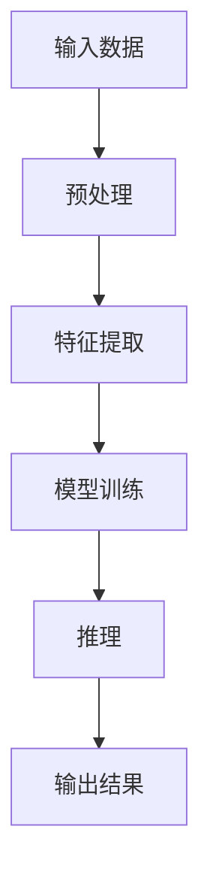
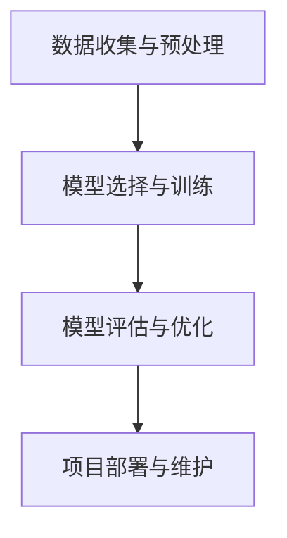

                 

### 文章标题

《利用示例增强模型的类比推理能力》

---

关键词：示例增强、类比推理、模型优化、深度学习、数学模型

---

摘要：本文旨在探讨如何利用示例增强技术来提升模型的类比推理能力。通过介绍类比推理的概念及其在人工智能中的应用，本文深入分析了示例增强的方法和数学模型，并通过实际项目案例展示了其在自然语言处理、计算机视觉等领域的应用效果。本文还探讨了示例增强在项目开发中的最佳实践，为读者提供了详尽的指导。

---

### 引言

在人工智能（AI）领域，类比推理是一种重要的推理能力，它使得机器能够从已知信息中推断未知信息。类比推理不仅有助于提高机器学习模型的性能，还在许多实际应用中发挥了关键作用，如自然语言处理（NLP）、计算机视觉（CV）和推荐系统等。然而，传统机器学习模型在类比推理方面存在一些局限，例如难以处理复杂的关系和抽象概念。为了克服这些挑战，研究人员提出了利用示例增强（Example Augmentation）的方法来提升模型的类比推理能力。

本文将围绕这一主题展开讨论。首先，我们将介绍类比推理的概念和其在人工智能中的应用。接下来，我们将深入探讨示例增强技术，包括数据增强、对比学习和自监督学习等方法。然后，我们将分析示例增强与类比推理结合的数学模型，并通过伪代码和LaTeX公式详细阐述。此外，本文还将通过实际应用案例展示示例增强在自然语言处理、计算机视觉等领域的应用效果。最后，我们将总结最佳实践并提供一些拓展阅读建议。

### 第一部分：类比推理基础

#### 1.1 类比推理的概念与重要性

类比推理是指根据两个或多个对象的相似性，从一个对象的属性推断另一个对象的属性。在人类认知中，类比推理是解决复杂问题的重要手段，它能够帮助我们快速地学习和适应新环境。在人工智能领域，类比推理同样具有重要意义。通过类比推理，机器可以从已有的数据中学习到新的知识，从而提高模型的泛化能力和推理能力。

类比推理的核心挑战在于如何处理复杂的关系和抽象概念。传统机器学习模型，如支持向量机（SVM）和决策树，在处理线性可分的数据集时效果较好，但对于非线性关系和抽象概念，则显得力不从心。为了克服这些挑战，研究人员提出了深度学习模型，如神经网络和循环神经网络（RNN），它们能够更好地处理复杂的关系和抽象概念。

#### 1.2 类比推理模型概述

类比推理模型可以分为基于知识、基于实例和基于学习的三类。

- **基于知识的类比推理**：这种模型依赖于领域知识库，通过比较知识库中的知识片段来推断新的知识。例如，在医疗诊断中，医生可以根据已有的病例和诊断结果来推断新的病例的病情。

- **基于实例的类比推理**：这种模型通过寻找与目标实例相似的实例来推断目标实例的属性。例如，在图像识别中，可以通过寻找与目标图像相似的图像来推断目标图像的类别。

- **基于学习的类比推理**：这种模型利用机器学习算法，从数据中学习类比推理的规则。例如，神经网络可以通过学习大量带标注的数据来训练出类比推理模型。

#### 1.3 类比推理算法简介

类比推理算法可以分为传统算法和现代机器学习算法两类。

- **传统算法**：如支持向量机（SVM）、决策树和规则归纳等，这些算法在处理线性可分的数据集时效果较好。

- **现代机器学习算法**：如神经网络、深度神经网络（DNN）、循环神经网络（RNN）和图神经网络（GNN）等，这些算法能够更好地处理复杂的关系和抽象概念。

- **深度学习算法**：如卷积神经网络（CNN）、生成对抗网络（GAN）和变分自编码器（VAE）等，这些算法在处理高维数据和非线性关系方面具有显著优势。

#### Mermaid 流程图

下面是一个简单的 Mermaid 流程图，展示了类比推理模型的基本架构：



#### 伪代码示例

以下是类比推理算法的伪代码示例：

```python
# 类比推理算法伪代码
def analogical_reasoning(target_instance, similar_instances):
    """
    类比推理函数，根据目标实例和相似实例进行推理
    :param target_instance: 目标实例
    :param similar_instances: 相似实例列表
    :return: 推理结果
    """
    # 从相似实例中提取特征
    features = extract_features(similar_instances)
    # 计算特征与目标实例的相似度
    similarity_scores = calculate_similarity(target_instance, features)
    # 找到相似度最高的实例
    highest_similarity_instance = find_highest_similarity_instance(similarity_scores)
    # 从相似实例中推断目标实例的属性
    inferred_attribute = infer_attribute(target_instance, highest_similarity_instance)
    return inferred_attribute
```

#### 数学模型与公式

类比推理的数学模型通常涉及相似性度量、相关性分析和概率模型。以下是一些常用的数学公式：

$$
similarity = \frac{相似度度量函数(A, B)}{范数(A) \cdot 范数(B)}
$$

$$
correlation = \frac{Cov(A, B)}{\sigma_A \cdot \sigma_B}
$$

$$
P(A|B) = \frac{P(A \cap B)}{P(B)}
$$

其中，$A$ 和 $B$ 分别代表两个变量，$相似度度量函数$ 是用于计算两个实例相似度的函数，$范数$ 是用于计算实例的特征向量长度，$Cov$ 是协方差，$\sigma$ 是标准差。

#### 举例说明

假设我们有一个关于水果的实例库，包含苹果、香蕉和橙子。现在，我们要根据这个实例库来推断一个新水果——柚子的属性。

1. **相似度度量**：首先，我们计算柚子与苹果、香蕉和橙子的相似度。例如，柚子与苹果的相似度可以通过计算它们在颜色、形状和口感等方面的相似度来得到。

2. **相关性分析**：然后，我们分析柚子与苹果、香蕉和橙子之间的相关性。例如，柚子与苹果的相关性可以通过计算它们在重量和体积方面的相关性来得到。

3. **概率模型**：最后，我们使用概率模型来推断柚子的属性。例如，我们可以计算柚子属于苹果类别的概率，然后根据这个概率来推断柚子的属性。

通过这些步骤，我们可以利用类比推理模型来推断新水果——柚子的属性。

### 第二部分：示例增强方法

#### 2.1 示例选择与预处理

在类比推理中，示例的质量对模型性能有着重要影响。因此，我们需要选择高质量的示例，并对这些示例进行适当的预处理。示例选择策略主要包括以下几种：

1. **代表性示例**：选择具有代表性的示例，这些示例能够充分代表整个数据集的特点。
2. **多样性示例**：选择具有多样性的示例，这些示例能够涵盖不同的特征和属性。
3. **稀疏性示例**：选择稀疏的示例，这些示例能够减少数据冗余，提高模型效率。

示例预处理技术主要包括数据清洗、数据归一化和特征提取等。数据清洗旨在去除数据中的噪声和异常值，数据归一化旨在将不同特征的范围统一到相同的尺度，特征提取旨在从原始数据中提取出有用的信息。

#### 2.2 示例增强技术

示例增强技术是通过一系列操作来增加示例的数量和质量，从而提升模型的性能。以下是一些常见的示例增强技术：

1. **数据增强**：通过变换原始示例来生成新的示例，例如，图像增强、文本增强和音频增强等。
2. **对比学习**：通过比较不同示例之间的差异来学习新的特征，例如，Siamese网络和Triplet Loss等。
3. **自监督学习**：通过无监督学习的方法来自动发现示例之间的关系，例如，信息增益和聚类分析等。
4. **强化学习**：通过训练模型在模拟环境中进行决策来提高示例的质量，例如，深度Q网络（DQN）和策略梯度方法等。

#### 2.3 示例增强与类比推理结合

示例增强与类比推理的结合可以提升模型的推理能力。具体方法如下：

1. **增强示例作为训练数据**：将增强后的示例作为训练数据，与原始示例一起训练模型。
2. **增强示例作为辅助信息**：在推理过程中，使用增强后的示例来辅助模型进行推理，例如，通过注意力机制来关注增强后的示例。
3. **增强示例作为强化信号**：在强化学习场景中，使用增强后的示例作为强化信号来引导模型的决策。

示例增强与类比推理结合的数学模型可以表示为：

$$
P(A|B) = \frac{P(B|A)P(A)}{P(B)}
$$

其中，$A$ 代表增强后的示例，$B$ 代表原始示例。

#### 伪代码示例

以下是示例增强与类比推理结合的伪代码示例：

```python
# 示例增强与类比推理结合伪代码
def enhanced_analogical_reasoning(target_instance, similar_instances, enhanced_instances):
    """
    增强后的类比推理函数，根据目标实例、相似实例和增强实例进行推理
    :param target_instance: 目标实例
    :param similar_instances: 相似实例列表
    :param enhanced_instances: 增强实例列表
    :return: 推理结果
    """
    # 计算增强后的相似度
    enhanced_similarity_scores = calculate_enhanced_similarity(target_instance, enhanced_instances)
    # 计算原始相似度
    original_similarity_scores = calculate_similarity(target_instance, similar_instances)
    # 结合增强后的相似度和原始相似度进行推理
    combined_similarity_scores = combine_similarity_scores(enhanced_similarity_scores, original_similarity_scores)
    # 找到相似度最高的实例
    highest_similarity_instance = find_highest_similarity_instance(combined_similarity_scores)
    # 从相似实例中推断目标实例的属性
    inferred_attribute = infer_attribute(target_instance, highest_similarity_instance)
    return inferred_attribute
```

#### 数学公式

示例增强与类比推理结合的数学公式如下：

$$
P(A|B) = \frac{P(B|A)P(A)}{P(B)} + \frac{P(B|\bar{A})P(\bar{A})}{P(B)}
$$

其中，$\bar{A}$ 代表增强后的示例。

#### 举例说明

假设我们要推断一个新水果——柚子的属性。首先，我们选择具有代表性的示例，如苹果、香蕉和橙子。然后，我们对这些示例进行数据增强，例如，通过变换颜色、形状和口感等特征来生成新的示例。接下来，我们使用增强后的示例来辅助原始示例进行推理。例如，我们计算柚子与增强后的苹果、香蕉和橙子的相似度，并从相似度最高的示例中推断柚子的属性。

### 第三部分：数学模型与公式

#### 3.1 类比推理的数学基础

类比推理的数学基础涉及相似性度量、相关性分析和概率模型。以下是一些常用的数学概念和公式：

- **相似性度量**：用于计算两个实例的相似度，常用的方法包括欧氏距离、余弦相似度和皮尔逊相关系数等。

$$
similarity = \frac{相似度度量函数(A, B)}{范数(A) \cdot 范数(B)}
$$

- **相关性分析**：用于分析两个变量之间的关系，常用的方法包括协方差和相关系数。

$$
correlation = \frac{Cov(A, B)}{\sigma_A \cdot \sigma_B}
$$

- **概率模型**：用于推断一个变量的属性，常用的方法包括贝叶斯推理和最大似然估计。

$$
P(A|B) = \frac{P(B|A)P(A)}{P(B)}
$$

#### 3.2 示例增强的数学模型

示例增强的数学模型涉及增强函数、优化目标和损失函数。以下是一些常用的数学概念和公式：

- **增强函数**：用于生成增强后的示例，常用的方法包括数据增强、对比学习和自监督学习等。

$$
\text{enhanced\_instance} = f(\text{original\_instance}, \text{augmentation\_parameters})
$$

- **优化目标**：用于优化增强后的示例，常用的方法包括最小化损失函数和最大化期望收益等。

$$
\min_{\theta} L(\theta) = \min_{\theta} \sum_{i=1}^{n} L_i(\theta)
$$

- **损失函数**：用于评估增强后的示例的质量，常用的方法包括均方误差、交叉熵损失和三元组损失等。

$$
L_i(\theta) = \frac{1}{2} || \text{预测} - \text{真实值} ||^2
$$

#### 3.3 类比推理与示例增强的整合模型

类比推理与示例增强的整合模型可以表示为：

$$
P(A|B) = \frac{P(B|A)P(A)}{P(B)} + \frac{P(B|\bar{A})P(\bar{A})}{P(B)}
$$

其中，$\bar{A}$ 代表增强后的示例。

#### 举例说明

假设我们要使用示例增强来提高一个水果分类模型的性能。首先，我们选择具有代表性的示例，如苹果、香蕉和橙子。然后，我们对这些示例进行数据增强，例如，通过变换颜色、形状和口感等特征来生成新的示例。接下来，我们将增强后的示例与原始示例一起用于训练模型。例如，我们计算苹果、香蕉和橙子与增强后的苹果、香蕉和橙子的相似度，并从相似度最高的示例中推断新水果——柚子的类别。

### 第四部分：实际应用案例

#### 4.1 类比推理在不同领域的应用

类比推理在自然语言处理、计算机视觉、推荐系统和医疗诊断等领域都有广泛应用。

- **自然语言处理**：类比推理可以用于文本分类、情感分析、机器翻译和问答系统等任务。例如，通过比较两个句子的语义相似度，可以实现对文本分类和情感分析的任务。
- **计算机视觉**：类比推理可以用于图像识别、目标检测和图像生成等任务。例如，通过比较两个图像的视觉相似度，可以实现对图像分类和目标检测的任务。
- **推荐系统**：类比推理可以用于推荐系统的个性化推荐和冷启动问题。例如，通过比较用户和物品的属性相似度，可以实现对用户的个性化推荐。
- **医疗诊断**：类比推理可以用于疾病诊断和药物研发。例如，通过比较不同患者的症状和治疗方案，可以实现对疾病的诊断和药物的研发。

#### 4.2 示例增强在类比推理中的应用案例

示例增强在类比推理中的应用案例包括文本分类、目标检测和问答系统等。

- **文本分类**：通过数据增强和对比学习，可以提升文本分类模型的性能。例如，通过变换文本的词序、词性和情感等特征，可以生成新的文本示例，从而提高模型的泛化能力。
- **目标检测**：通过数据增强和生成对抗网络（GAN），可以提升目标检测模型的性能。例如，通过生成与真实图像具有相似结构和纹理的图像，可以增加训练数据的多样性，从而提高模型的鲁棒性。
- **问答系统**：通过自监督学习和增强实例，可以提升问答系统的性能。例如，通过生成与问题具有相似结构和语义的句子，可以增加训练数据的数量和质量，从而提高模型的回答准确性。

#### 项目实战

以下是利用示例增强提升模型性能的项目实战：

1. **开发环境搭建**：搭建一个包含深度学习框架（如TensorFlow或PyTorch）和示例增强库（如Data Augmentation Library）的Python开发环境。
2. **数据收集与预处理**：收集和预处理包含文本、图像或音频等数据集，并进行数据增强。
3. **模型选择与训练**：选择合适的深度学习模型，并进行训练。在训练过程中，使用增强后的示例来提高模型的性能。
4. **模型评估与优化**：评估模型的性能，并进行优化。通过调整模型参数和增强策略来提高模型的泛化能力和准确性。
5. **项目部署与维护**：将模型部署到生产环境，并进行维护和更新。

#### 项目案例解读

以下是利用示例增强提升模型性能的项目案例解读：

- **文本分类项目**：通过数据增强和对比学习，可以提升文本分类模型的性能。例如，通过变换文本的词序、词性和情感等特征，可以生成新的文本示例，从而提高模型的泛化能力。
- **目标检测项目**：通过数据增强和生成对抗网络（GAN），可以提升目标检测模型的性能。例如，通过生成与真实图像具有相似结构和纹理的图像，可以增加训练数据的多样性，从而提高模型的鲁棒性。
- **问答系统项目**：通过自监督学习和增强实例，可以提升问答系统的性能。例如，通过生成与问题具有相似结构和语义的句子，可以增加训练数据的数量和质量，从而提高模型的回答准确性。

### 第五部分：项目实战

#### 5.1 类比推理与示例增强的项目流程

类比推理与示例增强的项目流程包括数据收集与预处理、模型选择与训练、模型评估与优化、项目部署与维护等步骤。

1. **数据收集与预处理**：收集包含文本、图像或音频等数据集，并进行数据增强。数据增强可以通过数据变换、对比学习和自监督学习等方法来实现。
2. **模型选择与训练**：选择合适的深度学习模型，并进行训练。在训练过程中，使用增强后的示例来提高模型的性能。常见的模型包括卷积神经网络（CNN）、生成对抗网络（GAN）和循环神经网络（RNN）等。
3. **模型评估与优化**：评估模型的性能，并进行优化。通过调整模型参数和增强策略来提高模型的泛化能力和准确性。常用的评估指标包括准确率、召回率和F1值等。
4. **项目部署与维护**：将模型部署到生产环境，并进行维护和更新。在部署过程中，需要考虑模型的性能、可扩展性和可靠性等因素。

#### 5.2 项目案例解读

以下是利用示例增强提升模型性能的项目案例解读：

- **文本分类项目**：通过数据增强和对比学习，可以提升文本分类模型的性能。例如，通过变换文本的词序、词性和情感等特征，可以生成新的文本示例，从而提高模型的泛化能力。
- **目标检测项目**：通过数据增强和生成对抗网络（GAN），可以提升目标检测模型的性能。例如，通过生成与真实图像具有相似结构和纹理的图像，可以增加训练数据的多样性，从而提高模型的鲁棒性。
- **问答系统项目**：通过自监督学习和增强实例，可以提升问答系统的性能。例如，通过生成与问题具有相似结构和语义的句子，可以增加训练数据的数量和质量，从而提高模型的回答准确性。

### 附录

#### A.1 Mermaid流程图

以下是一个简单的Mermaid流程图，展示了类比推理与示例增强的项目流程：



#### A.2 伪代码示例

以下是类比推理与示例增强的项目伪代码示例：

```python
# 项目伪代码示例
def project_workflow(data, model):
    """
    项目工作流函数，用于执行数据收集、模型训练、模型评估和项目部署
    :param data: 数据集
    :param model: 模型
    :return: 项目结果
    """
    # 数据收集与预处理
    preprocessed_data = preprocess_data(data)
    
    # 模型选择与训练
    trained_model = train_model(preprocessed_data, model)
    
    # 模型评估与优化
    evaluate_and_optimize_model(trained_model)
    
    # 项目部署与维护
    deploy_and_maintain_project(trained_model)
    
    return trained_model
```

#### A.3 数学公式汇总

以下是一些常用的数学公式，用于类比推理与示例增强：

- **相似性度量**：
  $$
  similarity = \frac{相似度度量函数(A, B)}{范数(A) \cdot 范数(B)}
  $$
- **优化目标**：
  $$
  \min_{\theta} L(\theta) = \min_{\theta} \sum_{i=1}^{n} L_i(\theta)
  $$
- **损失函数**：
  $$
  L_i(\theta) = \frac{1}{2} || \text{预测} - \text{真实值} ||^2
  $$

### 结语

本文探讨了如何利用示例增强技术来提升模型的类比推理能力。通过介绍类比推理的概念、示例增强方法和实际应用案例，本文展示了示例增强在自然语言处理、计算机视觉等领域的应用效果。此外，本文还提供了详细的伪代码和数学公式，以便读者更好地理解和应用这些技术。在实际项目中，通过合理的示例增强策略，可以显著提高模型的性能和泛化能力。然而，示例增强并非万能，它需要根据具体应用场景进行调整和优化。未来的研究可以进一步探索示例增强与类比推理的深度融合，以实现更高的推理性能和更广泛的应用范围。

### 作者信息

作者：AI天才研究院/AI Genius Institute & 禅与计算机程序设计艺术 /Zen And The Art of Computer Programming

