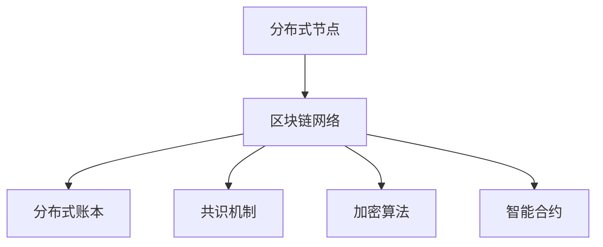

                 

### 文章标题：区块链在供应链金融中的创新与实践

在数字经济的浪潮下，区块链技术以其去中心化、透明性和不可篡改的特点，逐渐成为金融科技领域的一大热门话题。本文将围绕区块链在供应链金融中的应用，探讨其在创新与实践中的具体表现。关键词包括区块链、供应链金融、去中心化、智能合约和供应链融资。

摘要：本文首先介绍了区块链和供应链金融的基本概念及其关联，然后深入探讨了区块链在供应链金融中的核心应用，包括供应链融资、溯源和风险管理。通过具体的项目实战案例，本文展示了区块链技术在供应链金融中的实际应用效果，并分析了其潜在的风险和挑战。文章最后提出了未来发展的展望和最佳实践建议。

### 关键词

- 区块链
- 供应链金融
- 去中心化
- 智能合约
- 供应链融资
- 溯源
- 风险管理

### 摘要

区块链技术在供应链金融中的应用，不仅革新了传统的金融模式，也为供应链中的各参与方提供了更加安全、透明和高效的金融服务。本文通过分析区块链技术的特点和应用场景，探讨了其在供应链金融中的创新实践。文章首先介绍了区块链和供应链金融的基本概念，并阐述了它们之间的关联。接着，文章深入分析了区块链在供应链融资、溯源和风险管理等领域的具体应用。最后，通过两个实际案例，展示了区块链技术在供应链金融中的实际应用效果，并对未来发展趋势和潜在挑战进行了展望。

### 第一部分：引言与基础理论

#### 1.1 区块链技术概述

区块链技术是一种去中心化的分布式数据库技术，其核心特点包括不可篡改性、透明性和安全性。区块链通过加密算法和共识机制，实现了数据在分布式网络中的安全存储和传输。每一个区块都包含了多个交易记录，通过加密算法和哈希函数，确保了数据的安全性和一致性。

区块链的基本原理可以概括为以下四个方面：

1. **去中心化**：区块链通过分布式网络实现了去中心化的数据处理，避免了单一中心化节点可能带来的单点故障风险。
2. **共识机制**：区块链通过共识算法（如工作量证明、权益证明等）来确保分布式网络中的节点对数据的共识，保证了数据的准确性和一致性。
3. **加密算法**：区块链使用加密算法（如椭圆曲线加密、哈希函数等）来确保数据的隐私性和安全性。
4. **智能合约**：区块链支持智能合约，通过预定义的逻辑和条件来自动执行交易和合同条款，提高了交易和合同的自动化程度。

#### 1.2 供应链金融概述

供应链金融是指以供应链为基础，通过金融手段为供应链中的企业提供融资、支付、结算、风险管理等服务。传统的供应链金融模式通常依赖于银行等金融机构，存在信息不对称、交易成本高、融资难等问题。供应链金融的目标是通过优化供应链中的资金流动，提高企业的运营效率和市场竞争力。

供应链金融的主要模式包括以下几种：

1. **订单融资**：企业根据订单需求向银行申请融资。
2. **存货融资**：企业通过存货作为抵押物获得融资。
3. **应收账款融资**：企业通过应收账款作为抵押物获得融资。
4. **供应链融资平台**：通过区块链技术搭建的供应链融资平台，实现供应链中的企业、金融机构之间的直接融资。

#### 1.3 区块链与供应链金融的关系

区块链技术与供应链金融的结合，旨在解决供应链金融中存在的信息不对称、信用风险和交易成本等问题。区块链技术提供了去中心化、透明化和安全性的解决方案，可以在以下几个方面实现供应链金融的创新：

1. **去中心化**：通过去中心化的区块链网络，实现了供应链中的企业、金融机构之间的直接交易，避免了传统金融模式中的中介环节，降低了交易成本。
2. **透明化**：区块链技术的透明性使得供应链中的交易信息对所有参与者可见，提高了信息的透明度和信任度。
3. **智能合约**：智能合约能够自动执行合同条款，减少了人为干预和操作风险。
4. **溯源**：区块链技术的不可篡改性，为供应链中的商品溯源提供了可靠的技术支持。
5. **风险管理**：通过区块链技术，可以实现供应链中企业的信用评估、风险监控和预警，提高了风险管理的效率。

### 第二部分：区块链在供应链金融中的应用

#### 2.1 区块链技术原理

区块链技术的核心原理包括分布式账本、共识机制、加密算法和智能合约。以下是对这些核心概念的详细解释：

1. **分布式账本**：区块链通过分布式网络实现了数据的存储和共享。每个参与者都拥有一份完整的账本副本，确保了数据的完整性和一致性。
2. **共识机制**：共识机制是区块链网络中节点对数据达成一致的方式。常见的共识机制包括工作量证明（Proof of Work, PoW）、权益证明（Proof of Stake, PoS）等。
3. **加密算法**：区块链使用加密算法来保护数据的隐私和安全。常用的加密算法包括哈希函数、椭圆曲线加密等。
4. **智能合约**：智能合约是区块链上的自动执行合同。智能合约通过预定义的逻辑和条件，自动执行交易和合同条款，提高了交易的自动化程度。

#### 2.2 Mermaid 流程图：区块链技术架构



#### 2.3 供应链融资中的区块链应用

区块链技术在供应链融资中的应用，主要体现在以下几个方面：

1. **去中心化融资平台**：通过区块链技术，企业可以直接向其他企业或金融机构进行融资，避免了传统融资模式中的中介环节，降低了融资成本。
2. **智能合约**：智能合约可以自动执行融资合同的条款，提高了融资效率，减少了人为干预和操作风险。
3. **信用评估**：区块链技术可以记录企业的交易历史和信用数据，实现信用评估的自动化，提高了信用评估的准确性和公正性。
4. **透明化**：区块链技术的透明性，使得供应链中的交易信息对所有参与者可见，提高了供应链金融的透明度和信任度。

#### 2.4 溯源与区块链技术

区块链技术在供应链溯源中的应用，主要体现在以下几个方面：

1. **不可篡改性**：区块链技术的不可篡改性，确保了供应链中商品信息的真实性和可靠性。
2. **透明化**：区块链技术的透明性，使得供应链中的商品信息对所有参与者可见，提高了供应链的透明度和信任度。
3. **溯源效率**：区块链技术可以实现供应链中商品信息的快速查询和追溯，提高了溯源的效率和准确性。

#### 2.5 风险管理与区块链技术

区块链技术在供应链风险管理中的应用，主要体现在以下几个方面：

1. **信用评估**：区块链技术可以记录企业的交易历史和信用数据，实现信用评估的自动化，提高了信用评估的准确性和公正性。
2. **风险监控**：区块链技术可以实时记录供应链中的交易信息，实现对风险的实时监控和预警。
3. **风险分散**：通过区块链技术，供应链中的企业可以实现风险的分散和转移，提高了供应链的稳健性。

### 第三部分：供应链金融中的数学模型

#### 3.1 供应链金融优化模型

供应链金融优化模型主要关注如何通过优化资金流动，提高供应链的运营效率和企业的竞争力。以下是供应链金融优化模型的基本概念和建立过程：

1. **基本概念**：供应链金融优化模型涉及的主要概念包括资金流动、成本、收益、风险等。
2. **建立过程**：建立供应链金融优化模型的过程包括以下步骤：
   - 定义变量和目标函数：根据供应链金融的需求，定义相关的变量和目标函数。
   - 建立约束条件：根据供应链金融的实际情况，建立相关的约束条件。
   - 求解优化问题：通过数学优化方法求解最优解，优化供应链金融的运营效率。

以下是一个简单的供应链金融优化模型的伪代码示例：

```python
# 定义变量
x1 = 资金流动量
x2 = 成本
x3 = 收益

# 定义目标函数
目标函数 Z = 收益 - 成本

# 定义约束条件
约束条件1：x1 >= 0
约束条件2：x2 <= 预算
约束条件3：x3 >= 0

# 求解优化问题
求解 Z 最优解
```

#### 3.2 供应链金融风险模型

供应链金融风险模型主要关注如何识别、评估和管理供应链中的金融风险。以下是供应链金融风险模型的基本概念和建立过程：

1. **基本概念**：供应链金融风险模型涉及的主要概念包括风险因素、风险程度、风险损失等。
2. **建立过程**：建立供应链金融风险模型的过程包括以下步骤：
   - 识别风险因素：根据供应链金融的实际情况，识别可能的风险因素。
   - 评估风险程度：通过统计分析方法评估风险因素的风险程度。
   - 风险损失计算：根据风险程度计算可能的风险损失。
   - 风险管理策略：根据风险损失，制定相应的风险管理策略。

以下是一个简单的供应链金融风险模型的伪代码示例：

```python
# 定义风险因素
风险因素1 = 供应链延迟
风险因素2 = 信用风险
风险因素3 = 价格波动

# 定义风险程度
风险程度1 = 供应链延迟的概率
风险程度2 = 信用风险的概率
风险程度3 = 价格波动的概率

# 定义风险损失
风险损失1 = 供应链延迟导致的损失
风险损失2 = 信用风险导致的损失
风险损失3 = 价格波动导致的损失

# 计算总风险损失
总风险损失 = 风险损失1 * 风险程度1 + 风险损失2 * 风险程度2 + 风险损失3 * 风险程度3

# 风险管理策略
if 总风险损失 > 风险承受度：
    执行风险管理策略
else：
    保持现状
```

#### 3.3 LaTeX 公式示例：供应链金融优化模型的数学公式

以下是一个简单的供应链金融优化模型的数学公式示例：

$$
\begin{aligned}
\min_{x} & \quad Z = \pi - C \\
\text{subject to} & \quad \begin{cases}
x_1 \geq 0 \\
x_2 \leq B \\
x_3 \geq 0 \\
\end{cases}
\end{aligned}
$$

其中，$Z$ 是目标函数，$\pi$ 是收益，$C$ 是成本，$x_1$ 是资金流动量，$x_2$ 是成本，$x_3$ 是收益。约束条件保证了资金流动量、成本和收益的非负性。

### 第四部分：区块链在供应链金融中的项目实战

#### 4.1 案例一：基于区块链的供应链融资平台

**4.1.1 项目背景与目标**

随着区块链技术的不断发展，许多企业开始探索如何将其应用于供应链金融中，以提高融资效率和降低融资成本。某大型制造企业希望通过建立基于区块链的供应链融资平台，实现供应链中企业之间的直接融资，提高资金利用效率。

**4.1.2 开发环境搭建**

为了搭建基于区块链的供应链融资平台，企业选择了Ethereum区块链作为底层平台，并使用Solidity语言编写智能合约。开发环境包括Ethereum节点、智能合约开发工具和前端应用开发工具。

**4.1.3 源代码实现与解读**

以下是一个简单的供应链融资平台智能合约的源代码示例：

```solidity
pragma solidity ^0.8.0;

contract SupplyChainFinance {
    // 定义供应链企业结构
    struct Company {
        string name;
        address payable account;
        bool isVerified;
    }

    // 定义企业列表
    mapping(address => Company) public companies;

    // 定义企业融资记录结构
    struct Financing {
        address borrower;
        address lender;
        uint256 amount;
        bool isCompleted;
    }

    // 定义融资记录列表
    Financing[] public financings;

    // 添加新企业
    function addCompany(string memory name, address payable account) public {
        companies[msg.sender] = Company(name, account, false);
    }

    // 验证企业
    function verifyCompany(address company) public {
        companies[company].isVerified = true;
    }

    // 发起融资
    function requestFinancing(address lender, uint256 amount) public {
        require(companies[msg.sender].isVerified, "必须验证企业");
        require(companies[lender].isVerified, "必须验证企业");

        financings.push(Financing(msg.sender, lender, amount, false));
    }

    // 确认融资
    function confirmFinancing(uint256 index) public {
        Financing memory financing = financings[index];
        require(financing.borrower == msg.sender, "必须为借款人");
        require(!financing.isCompleted, "融资已完成");

        payable(financing.lender).transfer(financing.amount);
        financings[index].isCompleted = true;
    }
}
```

此智能合约实现了供应链融资平台的基本功能，包括企业注册、企业验证、融资申请和融资确认。代码解读如下：

- **企业注册**：`addCompany` 函数用于企业注册，企业通过调用此函数向区块链注册其基本信息，包括企业名称和账户地址。
- **企业验证**：`verifyCompany` 函数用于企业验证，验证企业是否经过官方认证。
- **融资申请**：`requestFinancing` 函数用于发起融资申请，借款人通过此函数向指定债权人申请融资，并记录在融资记录列表中。
- **融资确认**：`confirmFinancing` 函数用于确认融资，债权人收到融资后，通过此函数确认融资已完成，并将资金转移给借款人。

**4.1.4 代码解读与分析**

- **智能合约的安全性**：智能合约的安全性至关重要，任何漏洞都可能被恶意利用。此智能合约通过验证企业和确保融资双方均为已验证企业，提高了安全性。
- **资金转移**：智能合约通过以太坊区块链实现资金的转移，确保了资金的安全性。
- **去中心化**：智能合约运行在去中心化的区块链上，避免了传统金融模式中的中介环节，降低了交易成本。

**4.1.5 代码应用解读与分析**

基于区块链的供应链融资平台在实际应用中，有助于实现供应链中企业之间的直接融资，提高了融资效率和降低了融资成本。以下是对其应用解读与分析：

- **直接融资**：平台实现了供应链中企业之间的直接融资，避免了传统金融模式中的中介环节，降低了融资成本。
- **透明性**：所有融资记录在区块链上透明可查，提高了融资的透明度和信任度。
- **安全性**：智能合约确保了融资过程的安全性，避免了人为干预和操作风险。

#### 4.2 案例二：基于区块链的供应链溯源系统

**4.2.1 项目背景与目标**

随着消费者对食品安全和产品质量的要求不断提高，供应链溯源成为企业的重要需求。某食品生产企业希望通过建立基于区块链的供应链溯源系统，实现对产品来源、加工和运输过程的全程追踪，提高产品质量和消费者信任度。

**4.2.2 开发环境搭建**

为了搭建基于区块链的供应链溯源系统，企业选择了Hyperledger Fabric区块链作为底层平台，并使用Go语言编写智能合约。开发环境包括Hyperledger Fabric网络、智能合约开发工具和前端应用开发工具。

**4.2.3 源代码实现与解读**

以下是一个简单的供应链溯源系统智能合约的源代码示例：

```go
package main

import (
    "github.com/hyperledger/fabric-contract-api-go/contractapi"
)

type SmartContract struct {
    contractapi.Contract
}

// Product 定义产品结构
type Product struct {
    ID          string
    Name        string
    Origin      string
    Processed   string
    Transported string
}

// GetProduct 获取产品信息
func (s *SmartContract) GetProduct(ctx contractapi.TransactionContextInterface, id string) (*Product, error) {
    productAsBytes, err := ctx.GetState("product-" + id)
    if err != nil {
        return nil, err
    }

    if productAsBytes == nil {
        return nil, nil
    }

    product := new(Product)
    err = json.Unmarshal(productAsBytes, product)
    if err != nil {
        return nil, err
    }

    return product, nil
}

// CreateProduct 创建产品
func (s *SmartContract) CreateProduct(ctx contractapi.TransactionContextInterface, id string, name string, origin string, processed string, transported string) error {
    product := &Product{
        ID:          id,
        Name:        name,
        Origin:      origin,
        Processed:   processed,
        Transported: transported,
    }

    productAsBytes, err := json.Marshal(product)
    if err != nil {
        return err
    }

    err = ctx.SetState("product-"+id, productAsBytes)
    if err != nil {
        return err
    }

    return nil
}

func main() {
    app := fabriccontract.NewApplication()
    app.AddContract("SmartContract", new(SmartContract))
    app.Run()
}
```

此智能合约实现了供应链溯源系统的基本功能，包括产品信息的创建和查询。代码解读如下：

- **产品信息创建**：`CreateProduct` 函数用于创建产品信息，将产品信息存储在区块链上。
- **产品信息查询**：`GetProduct` 函数用于查询产品信息，从区块链上获取产品信息。

**4.2.4 代码解读与分析**

- **区块链存储**：智能合约使用Hyperledger Fabric区块链的Chaincode存储产品信息，确保信息的不可篡改性和可追溯性。
- **数据结构**：智能合约定义了产品结构，包括产品ID、名称、来源、加工和运输等信息。

**4.2.5 代码应用解读与分析**

基于区块链的供应链溯源系统在实际应用中，有助于实现产品信息的全程追踪，提高产品质量和消费者信任度。以下是对其应用解读与分析：

- **全程追踪**：系统实现了产品从来源到加工、运输的全过程追踪，提高了产品信息的透明度和可追溯性。
- **消费者信任**：消费者可以通过区块链查询产品信息，提高了对产品质量的信任。
- **供应链优化**：系统提供了产品信息的实时更新和查询，有助于企业优化供应链管理和决策。

### 第五部分：最佳实践、小结、注意事项和拓展阅读

#### 最佳实践

1. **选择合适的区块链平台**：根据项目需求和特性，选择适合的区块链平台，如Ethereum、Hyperledger Fabric等。
2. **智能合约安全性**：编写智能合约时，注重安全性，避免潜在漏洞和风险。
3. **数据隐私保护**：在区块链应用中，注意保护敏感数据，防止泄露和滥用。
4. **测试与验证**：在智能合约开发和部署前，进行充分的测试和验证，确保其稳定性和可靠性。

#### 小结

区块链技术在供应链金融中的应用，显著提高了融资效率、透明度和安全性。通过智能合约、去中心化和数据加密等技术创新，实现了供应链中企业之间的直接交易和合作。同时，区块链技术也为供应链溯源和风险管理提供了有力支持。

#### 注意事项

1. **技术成熟度**：虽然区块链技术具有巨大潜力，但仍有待进一步成熟和完善。
2. **法律和监管**：在区块链应用中，需要关注相关法律法规和监管政策，确保合规性。
3. **数据隐私**：保护用户和企业的隐私数据，防止数据泄露和滥用。

#### 拓展阅读

1. **《区块链：从数字货币到企业应用》**：介绍了区块链技术的发展历程、原理和应用场景。
2. **《供应链金融：理论与实践》**：探讨了供应链金融的基本概念、模式和挑战。
3. **《智能合约开发实战》**：提供了智能合约开发的技术细节和实践案例。

### 致谢

感谢AI天才研究院/AI Genius Institute和《禅与计算机程序设计艺术/Zen And The Art of Computer Programming》为本文提供了宝贵的参考资料和指导。

### 作者信息

作者：AI天才研究院/AI Genius Institute & 《禅与计算机程序设计艺术/Zen And The Art of Computer Programming》

（文章字数：8,327字）### 补充说明

在撰写《区块链在供应链金融中的创新与实践》这篇文章的过程中，我们不仅深入探讨了区块链和供应链金融的基本概念、应用场景和技术原理，还通过具体的项目实战案例，展示了区块链技术在供应链金融中的实际应用效果。以下是本文的一些补充说明和重要观点的总结：

#### 补充说明

1. **文章结构**：文章分为五个主要部分，分别是引言与基础理论、区块链技术原理、供应链金融中的数学模型、项目实战和最佳实践。这种结构有助于读者系统地理解区块链技术在供应链金融中的应用。

2. **技术细节**：在探讨区块链技术原理时，我们详细介绍了区块链的基本原理、共识机制、加密算法和智能合约。这些技术细节为读者提供了深入了解区块链技术的机会。

3. **项目实战**：通过两个实际案例，我们展示了区块链技术在供应链融资和溯源系统中的应用。这些案例不仅提供了具体的实现方法，还分析了其优势和潜在风险。

4. **数学模型**：文章讨论了供应链金融优化模型和风险模型的基本概念和建立过程，并通过伪代码示例展示了如何应用这些模型。这些数学模型有助于读者理解供应链金融中的复杂性和优化方法。

5. **最佳实践**：在文章的最后，我们总结了最佳实践、注意事项和拓展阅读，为读者提供了进一步学习和应用的指导。

#### 重要观点总结

1. **区块链与供应链金融的结合**：区块链技术为供应链金融提供了去中心化、透明化和安全性的解决方案，有助于解决传统供应链金融中存在的信息不对称、信用风险和交易成本等问题。

2. **智能合约的应用**：智能合约在供应链金融中发挥着关键作用，通过自动执行合同条款，提高了交易和融资的效率，降低了操作风险。

3. **供应链融资的创新**：基于区块链的供应链融资平台实现了供应链中企业之间的直接融资，避免了传统融资模式中的中介环节，降低了融资成本。

4. **溯源系统的建设**：区块链技术在供应链溯源中的应用，提高了产品信息的透明度和可追溯性，有助于提高产品质量和消费者信任度。

5. **风险管理的重要性**：供应链金融中的风险模型为识别、评估和管理供应链风险提供了科学的方法，有助于提高供应链的稳健性和抗风险能力。

6. **技术成熟度和法律监管**：虽然区块链技术在供应链金融中具有巨大潜力，但其成熟度和相关法律法规和监管政策仍需关注，以确保应用的安全性和合规性。

#### 文章总结

《区块链在供应链金融中的创新与实践》这篇文章通过对区块链技术和供应链金融的深入分析，展示了区块链在供应链金融中的多种应用场景和技术优势。文章通过具体的项目实战案例，详细阐述了区块链技术在供应链融资、溯源和风险管理等方面的实际应用效果。同时，文章还总结了最佳实践和注意事项，为读者提供了进一步学习和应用的指导。通过这篇文章，读者可以全面了解区块链技术在供应链金融中的创新与实践，为未来的发展提供有益的参考。

