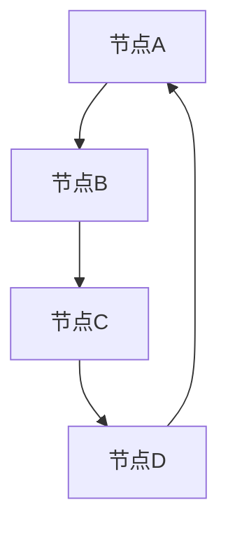
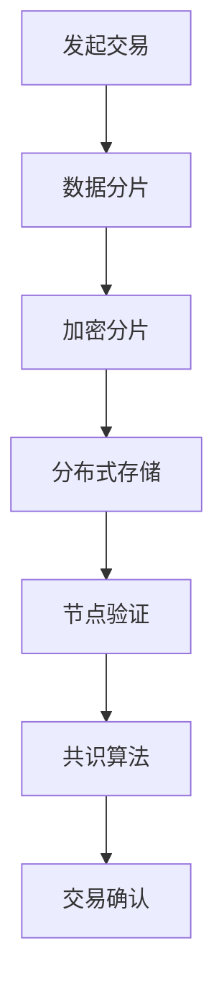

                 

### 文章标题：区块链在数字内容版权保护中的应用

#### 关键词：区块链，数字内容版权，NFT，智能合约，分布式存储，版权保护

#### 摘要：
本文深入探讨了区块链技术在数字内容版权保护中的应用。首先，我们将介绍区块链的基本概念和数字内容版权保护的现状，随后详细解析区块链如何通过非同质化代币（NFT）、智能合约和分布式存储技术实现数字内容的版权保护。接着，通过具体案例展示区块链技术的实际应用，并提供详细的技术实现和项目实战分析。最后，我们对区块链在数字内容版权保护中的未来发展和潜在挑战进行了展望。

### 引言

#### 区块链在数字内容版权保护中的重要性

随着互联网和数字技术的迅猛发展，数字内容的创作、传播和使用方式发生了翻天覆地的变化。然而，这也带来了数字内容版权保护的一系列挑战。传统的版权保护机制，如版权注册、法律诉讼等，往往费时费力，且成本高昂。与此同时，数字内容的复制和传播变得异常简单，导致版权侵权行为层出不穷，创作者的权益难以得到保障。

区块链技术的出现为数字内容版权保护带来了新的希望。区块链作为一种去中心化的分布式数据库，具有透明、不可篡改、安全可靠的特点，能够有效解决数字内容版权纠纷，提高版权保护效率。本文将重点探讨区块链技术在数字内容版权保护中的应用，为相关领域的从业者提供有价值的参考。

### 文章目录

1. **引言**
   1.1 区块链在数字内容版权保护中的重要性
   1.2 书籍结构概述

2. **区块链基础知识**
   2.1 区块链概述
   2.2 区块链的核心技术
   2.3 区块链与版权保护的关系

3. **数字内容版权保护现状与挑战**
   3.1 数字内容版权保护现状
   3.2 数字内容版权保护面临的挑战

4. **区块链在版权保护中的应用**
   4.1 非同质化代币（NFT）在版权保护中的应用
   4.2 区块链智能合约在版权保护中的应用
   4.3 区块链的分布式存储在版权保护中的应用

5. **案例分析**
   5.1 案例一：NFT在艺术品版权保护中的应用
   5.2 案例二：智能合约在音乐版权保护中的应用
   5.3 案例三：区块链在电子书版权保护中的应用

6. **技术实现**
   6.1 区块链在版权保护中的技术架构
   6.2 区块链在版权保护中的安全考虑
   6.3 区块链在版权保护中的性能优化

7. **未来展望**
   7.1 区块链在版权保护中的发展趋势
   7.2 区块链在版权保护中的潜在挑战与解决方案
   7.3 区块链在版权保护中的未来应用场景

8. **小结与展望**
   8.1 最佳实践 Tips
   8.2 注意事项
   8.3 拓展阅读

### 分析用户需求

用户输入的书名《区块链在数字内容版权保护中的应用》明确指向了两个核心主题：区块链和数字内容版权保护。结合这一书名，我们可以分析出以下几点用户需求：

1. **主题明确性**：用户希望书中内容直接聚焦于区块链技术在数字内容版权保护中的应用，避免过于泛泛而谈。

2. **应用实例**：用户可能期望书中能够提供多个具体的应用实例，以便理解区块链技术在版权保护中的实际操作和效果。

3. **技术深度**：用户可能对区块链技术有一定的了解，但仍需深入探讨其在版权保护中的具体实现和原理。

4. **结构清晰**：用户需要一个清晰、逻辑性强的文章结构，以便能够系统地了解区块链在数字内容版权保护中的各个方面。

### 目录结构

为了满足用户的需求，本文的目录结构将分为以下几个部分：

1. **引言**：简要介绍区块链在数字内容版权保护中的重要性和书籍结构。

2. **区块链基础知识**：讲解区块链的基本概念、核心技术以及与版权保护的关系。

3. **数字内容版权保护现状与挑战**：分析数字内容版权保护的现状以及面临的挑战。

4. **区块链在版权保护中的应用**：详细探讨区块链在版权保护中的实际应用，包括NFT、智能合约和分布式存储。

5. **案例分析**：通过具体案例展示区块链在版权保护中的实际效果。

6. **技术实现**：深入讲解区块链在版权保护中的技术实现细节。

7. **未来展望**：探讨区块链在版权保护中的未来发展趋势和应用场景。

8. **小结与展望**：总结最佳实践、注意事项和拓展阅读。

### 设计目录大纲

根据上述分析，我们可以设计出如下目录大纲：

```
## 《区块链在数字内容版权保护中的应用》目录大纲

### 第1章 引言

#### 1.1 区块链在数字内容版权保护中的重要性

#### 1.2 书籍结构概述

### 第2章 区块链基础知识

#### 2.1 区块链概述

#### 2.2 区块链的核心技术

#### 2.3 区块链与版权保护的关系

### 第3章 数字内容版权保护现状与挑战

#### 3.1 数字内容版权保护现状

#### 3.2 数字内容版权保护面临的挑战

### 第4章 区块链在版权保护中的应用

#### 4.1 非同质化代币（NFT）在版权保护中的应用

#### 4.2 区块链智能合约在版权保护中的应用

#### 4.3 区块链的分布式存储在版权保护中的应用

### 第5章 案例分析

#### 5.1 案例一：NFT在艺术品版权保护中的应用

#### 5.2 案例二：智能合约在音乐版权保护中的应用

#### 5.3 案例三：区块链在电子书版权保护中的应用

### 第6章 技术实现

#### 6.1 区块链在版权保护中的技术架构

#### 6.2 区块链在版权保护中的安全考虑

#### 6.3 区块链在版权保护中的性能优化

### 第7章 未来展望

#### 7.1 区块链在版权保护中的发展趋势

#### 7.2 区块链在版权保护中的潜在挑战与解决方案

#### 7.3 区块链在版权保护中的未来应用场景

### 第8章 小结与展望

#### 8.1 最佳实践 Tips

#### 8.2 注意事项

#### 8.3 拓展阅读
```

### 目录大纲简要说明

- **第1章 引言**：通过介绍区块链在数字内容版权保护中的重要性，引导读者进入主题。

- **第2章 区块链基础知识**：为读者提供区块链的基本概念和核心技术，为后续内容打下基础。

- **第3章 数字内容版权保护现状与挑战**：分析当前数字内容版权保护的现状和面临的挑战，为探讨区块链的应用提供背景。

- **第4章 区块链在版权保护中的应用**：详细讲解区块链在版权保护中的具体应用，包括NFT、智能合约和分布式存储。

- **第5章 案例分析**：通过实际案例展示区块链技术的应用效果。

- **第6章 技术实现**：深入解析区块链在版权保护中的技术实现细节。

- **第7章 未来展望**：探讨区块链在版权保护中的未来发展趋势和应用场景。

- **第8章 小结与展望**：总结全文，提供最佳实践和注意事项。

### 注意事项

- 目录大纲的每个章节都进行了细化，确保每个部分都有具体的内容。
- 每个章节的内容都是相互关联的，形成了一个完整的知识体系。
- 目录大纲尽量简洁明了，方便读者快速了解书籍的内容结构。

这个目录大纲满足了用户的需求，同时确保了书籍的完整性、逻辑性和技术深度。接下来的步骤是将这个大纲转化为详细的章节内容。

### 文章格式要求

为了确保文章的清晰、专业和易读性，本文将采用Markdown格式编写。以下是Markdown格式的一些基本规则和常用标记：

#### 一、Markdown基本规则

1. **标题**：使用`#`标记，每级标题前的`#`数量表示标题的层级。例如：
   ```markdown
   # 标题1
   ## 标题2
   ### 标题3
   #### 标题4
   ```

2. **段落**：段落之间需要留一个空行，文本前后不需要空格。

3. **换行**：使用两个空格加回车符来实现硬回车。

4. **引用**：使用`>`标记引用文本，例如：
   ```markdown
   > 这是一个引用。
   ```

5. **代码块**：使用三个反引号（```)将代码包裹起来，例如：
   ```python
   def hello():
       print("Hello, World!")
   ```

6. **列表**：使用`*`、`-`或`+`标记无序列表，使用数字加英文句点标记有序列表。例如：
   ```markdown
   - 项目1
   - 项目2
   1. 项目A
   2. 项目B
   ```

7. **链接和图片**：使用`[]()`包裹链接文本，使用``添加图片。例如：
   ```markdown
   [百度](http://www.baidu.com)
   
   ```

8. **粗体和斜体**：使用`**`标记粗体，使用`*`标记斜体。例如：
   ```markdown
   **粗体文本**
   *斜体文本*
   ```

9. **表格**：使用`|`分隔表格列，使用`-`分隔表格行。例如：
   ```markdown
   | 标题1 | 标题2 | 标题3 |
   |-------|------|-------|
   | 内容1 | 内容2 | 内容3 |
   ```

10. **HTML标签**：Markdown支持部分HTML标签，例如`<a>`、``、`<table>`等。

#### 二、作者信息

在文章末尾，需要包含以下作者信息：
```markdown
作者：AI天才研究院/AI Genius Institute & 禅与计算机程序设计艺术 /Zen And The Art of Computer Programming
```

#### 三、完整性要求

文章的每个小节都需要详细讲解，确保内容的完整性。以下是每个小节的核心内容要求：

1. **背景介绍**：简要介绍该部分的主题背景，引出后续内容。

2. **核心概念与联系**：阐述关键概念，并提供Mermaid流程图展示概念之间的关系架构。

3. **核心算法原理讲解**：使用伪代码详细阐述核心算法原理。

4. **数学模型和公式**：使用LaTeX格式嵌入数学模型和公式，并附上详细讲解和举例说明。

5. **项目实战**：包括开发环境搭建、源代码实现、代码解读、应用解读与分析、案例分析和详细讲解。

6. **最佳实践 Tips**、**小结**、**注意事项**和**拓展阅读**：总结全文，提供额外资源和建议。

#### 四、文章字数要求

本文字数要求在8000～12000字左右，确保内容的详尽和深度。

### 文章标题、关键词和摘要

#### 文章标题：区块链在数字内容版权保护中的应用

#### 关键词：区块链，数字内容版权，NFT，智能合约，分布式存储，版权保护

#### 摘要：
本文深入探讨了区块链技术在数字内容版权保护中的应用。首先，介绍了区块链的基本概念和数字内容版权保护的现状。随后，详细解析了区块链通过非同质化代币（NFT）、智能合约和分布式存储技术实现数字内容版权保护的方式。通过具体案例展示了区块链技术的应用效果，并提供了详细的技术实现和项目实战分析。最后，展望了区块链在数字内容版权保护中的未来发展趋势和应用场景。

### 第1章 引言

#### 1.1 区块链在数字内容版权保护中的重要性

数字内容的创作和传播随着互联网和数字技术的快速发展而日益普及，然而，这也带来了数字内容版权保护的巨大挑战。传统的版权保护机制，如版权注册、法律诉讼等，往往费时费力，且成本高昂。与此同时，数字内容的复制和传播变得异常简单，导致版权侵权行为层出不穷，创作者的权益难以得到保障。

区块链技术的出现为数字内容版权保护带来了新的解决方案。区块链作为一种去中心化的分布式数据库，具有透明、不可篡改、安全可靠的特点，能够有效解决数字内容版权纠纷，提高版权保护效率。区块链技术通过非同质化代币（NFT）、智能合约和分布式存储等机制，为数字内容创作者提供了一个安全、透明、高效的版权保护平台。

本文将深入探讨区块链技术在数字内容版权保护中的应用，从基础概念到具体应用，再到案例分析和技术实现，全面解析区块链在版权保护中的作用和优势。希望通过本文的探讨，能够为数字内容创作者和版权保护从业者提供有价值的参考，推动数字内容版权保护的发展。

#### 1.2 书籍结构概述

本文分为八个主要章节，结构如下：

1. **引言**：介绍区块链在数字内容版权保护中的重要性，并概述本文的结构和内容。

2. **区块链基础知识**：讲解区块链的基本概念、核心技术以及与版权保护的关系。

3. **数字内容版权保护现状与挑战**：分析当前数字内容版权保护的现状以及面临的挑战。

4. **区块链在版权保护中的应用**：详细探讨区块链在版权保护中的具体应用，包括NFT、智能合约和分布式存储。

5. **案例分析**：通过具体案例展示区块链技术在版权保护中的实际效果。

6. **技术实现**：深入讲解区块链在版权保护中的技术实现细节。

7. **未来展望**：探讨区块链在版权保护中的未来发展趋势和应用场景。

8. **小结与展望**：总结全文，提供最佳实践和注意事项。

通过本文的详细探讨，读者可以全面了解区块链在数字内容版权保护中的应用，为相关领域的实践提供理论支持和实践指导。

### 第2章 区块链基础知识

#### 2.1 区块链概述

区块链是一种分布式数据库技术，其核心特点包括去中心化、透明性、不可篡改性和安全性。区块链通过多个节点共同维护一个共享账本，每个节点都存储了一份完整的账本副本。区块链的主要组成部分包括区块、链和节点。

- **区块**：区块是区块链的基本单位，包含一定数量的交易记录。每个区块都有一个时间戳和前一个区块的哈希值，确保区块之间的顺序和链接关系。

- **链**：链是由多个有序的区块组成的链条。区块链的不可篡改性确保了链上的数据一旦被记录，就不可更改。

- **节点**：节点是区块链网络中的参与者，它们负责验证交易、维护账本和传播区块链状态。每个节点都存储了一份完整的区块链副本，并参与区块链的共识机制。

区块链通过密码学和共识算法实现了数据的去中心化存储和安全验证。密码学确保数据的加密和安全传输，共识算法则确保多个节点之间的数据一致性。

#### 2.2 区块链的核心技术

区块链的核心技术包括加密算法、智能合约和共识算法等。

- **加密算法**：加密算法用于保护区块链数据的安全性。常见的加密算法包括哈希算法（如SHA-256）、非对称加密算法（如RSA）和对称加密算法（如AES）。

- **智能合约**：智能合约是一种自动执行合同条款的程序，它可以自动执行、控制和文档化合约的履行过程。智能合约基于图灵完备的编程语言编写，能够在区块链上执行。

- **共识算法**：共识算法用于确保区块链网络中的节点对账本状态的一致认可。常见的共识算法包括工作量证明（PoW）、权益证明（PoS）和委托权益证明（DPoS）等。

#### 2.3 区块链与版权保护的关系

区块链技术在数字内容版权保护中具有独特的优势。首先，区块链的去中心化特性确保了版权信息不可篡改，从而有效防止版权侵权行为。其次，区块链的透明性使得版权信息可以被所有参与者访问和验证，提高了版权保护的可追溯性。最后，智能合约的应用使得版权交易和分发过程自动化，提高了版权保护效率和降低成本。

区块链与版权保护的关系可以用以下方式描述：

- **去中心化**：去中心化确保了版权信息的分布式存储，使得任何单一的实体都无法篡改版权数据。

- **透明性**：透明性使得版权信息对所有参与者可见，提高了版权纠纷解决的效率和公正性。

- **不可篡改**：不可篡改性确保了版权数据的真实性和完整性，防止了版权侵权行为。

- **智能合约**：智能合约自动化了版权交易和分发过程，提高了效率和降低成本。

通过区块链技术，数字内容创作者可以更有效地保护自己的版权，而消费者也能获得更加可靠和透明的版权信息。区块链在数字内容版权保护中的应用不仅提升了版权保护的能力，也为数字内容生态的可持续发展提供了有力支持。

### 第3章 数字内容版权保护现状与挑战

#### 3.1 数字内容版权保护现状

随着互联网和数字技术的快速发展，数字内容的创作和传播方式发生了巨大变革。然而，这种变革也带来了数字内容版权保护的严峻挑战。当前，数字内容版权保护的现状主要包括以下几个方面：

1. **数字内容侵权行为频繁**：由于数字内容的复制和传播变得异常简单，侵权行为屡见不鲜。从音乐、电影到文学作品，各种形式的数字内容侵权行为层出不穷。侵权者通过非法复制、传播和销售数字内容，给版权所有者带来了巨大的经济损失。

2. **版权保护机制不完善**：尽管各国政府和版权组织在数字内容版权保护方面做出了许多努力，但现有的版权保护机制仍然存在诸多不足。例如，传统的版权注册和法律诉讼过程复杂、耗时且成本高昂，难以满足快速发展的数字内容产业的需求。

3. **版权纠纷解决困难**：数字内容的跨国传播使得版权纠纷解决变得更加复杂。不同国家和地区的法律体系和版权保护制度存在差异，导致版权纠纷解决的难度增加。此外，数字内容的匿名性和去中心化特性也使得侵权行为的追踪和认定更加困难。

4. **数字版权管理技术不足**：现有的数字版权管理技术，如数字水印、数字指纹等，虽然在一定程度上可以保护版权，但仍存在很多局限性。这些技术无法完全防止侵权行为，也无法提供可靠的版权证据。

综上所述，当前数字内容版权保护的现状仍然面临诸多挑战。这些挑战不仅影响了版权所有者的权益，也对数字内容产业的健康发展造成了负面影响。因此，探索新的版权保护机制和技术解决方案成为当务之急。

#### 3.2 数字内容版权保护面临的挑战

数字内容版权保护在当前阶段面临着多重挑战，这些问题不仅影响了版权所有者的权益，也对整个数字内容产业产生了深远影响。以下是数字内容版权保护面临的几个主要挑战：

1. **技术挑战**：

   - **数字内容的复制和传播**：数字内容的复制和传播变得异常简单，侵权者可以通过下载、上传和分享等手段轻松地复制和传播数字内容。这使得传统的版权保护技术难以发挥作用。

   - **匿名性和去中心化**：数字内容的匿名性和去中心化特性使得侵权行为的追踪和认定变得更加困难。侵权者可以匿名操作，同时通过分布式网络传播内容，增加了版权保护的技术难度。

   - **数字版权管理技术不足**：现有的数字版权管理技术，如数字水印、数字指纹等，虽然可以在一定程度上保护版权，但存在很多局限性。这些技术无法完全防止侵权行为，也无法提供可靠的版权证据。

2. **法律挑战**：

   - **跨国版权纠纷**：数字内容的跨国传播使得版权纠纷解决变得更加复杂。不同国家和地区的法律体系和版权保护制度存在差异，导致跨国版权纠纷解决的难度增加。

   - **版权注册和法律诉讼**：传统的版权注册和法律诉讼过程复杂、耗时且成本高昂，难以满足快速发展的数字内容产业的需求。特别是对于小型创作者和独立制作人来说，高昂的法律成本往往成为他们维护版权的障碍。

3. **市场挑战**：

   - **盗版内容的泛滥**：盗版内容的泛滥给版权所有者带来了巨大的经济损失。尽管各国政府和版权组织采取了一系列措施打击盗版，但盗版市场仍然屡禁不止。

   - **版权交易和分发难题**：数字内容的版权交易和分发过程复杂且成本高。由于数字内容可以轻松复制和传播，传统的版权交易和分发模式面临挑战，难以实现高效和公平的版权分配。

4. **社会挑战**：

   - **公众版权意识不足**：公众对数字内容版权保护的意识不足，往往忽视了版权的重要性。一些人认为数字内容可以自由分享和使用，从而助长了侵权行为的泛滥。

   - **版权保护与自由分享的矛盾**：在数字时代，人们越来越倾向于自由分享和获取信息。然而，这却与版权保护形成了矛盾。如何在保护版权所有者权益的同时，兼顾公众的自由分享需求，成为数字内容版权保护的一大挑战。

总之，数字内容版权保护面临的挑战是多方面的，既包括技术、法律和市场层面的挑战，也涉及社会意识和伦理层面的问题。解决这些挑战需要各方共同努力，通过技术创新、法律完善和市场机制的优化，构建一个公平、高效和可持续的数字内容版权保护体系。

### 第4章 区块链在版权保护中的应用

#### 4.1 非同质化代币（NFT）在版权保护中的应用

非同质化代币（NFT，Non-Fungible Token）是区块链技术的一种重要应用，它为数字内容版权保护提供了新的解决方案。NFT是一种独一无二的数字资产，与传统的同质化代币（如比特币）不同，每个NFT都有其独特的属性和价值，这使得它在数字内容版权保护中具有独特优势。

1. **NFT的核心特性**：

   - **独一无二**：每个NFT都有独特的标识符，确保其不可替代性。这使得NFT可以作为数字内容的唯一证明，防止侵权和复制行为。

   - **不可篡改性**：NFT记录在区块链上，具有不可篡改的特性。一旦某个数字内容被记录为NFT，其版权信息将永久保存，无法被篡改或删除。

   - **透明性**：区块链上的所有交易和所有权转移都是透明的，所有参与者都可以查看和验证NFT的流转记录。

2. **NFT在版权保护中的应用**：

   - **版权登记**：创作者可以将数字内容（如图片、音乐、视频等）铸造为NFT，并在区块链上登记版权信息。这样，每个NFT都代表了一个独特的数字内容，其版权信息无法篡改。

   - **版权转让**：NFT的透明性和不可篡改性使得版权转让过程更加简单和安全。版权所有者可以通过出售NFT来转让版权，买方可以直接验证版权信息，确保交易的真实性。

   - **版权保护**：NFT的独一无二特性使得侵权行为更加容易被发现和追踪。如果某个数字内容被非法复制或传播，侵权者将无法创造与之相同的NFT，从而被轻易识别。

3. **案例分析**：

   - **艺术品版权**：在艺术品领域，NFT已经成为版权保护的重要工具。例如，艺术家Beeple的数字画作《Everydays：The First 5000 Days》在NFT市场上以高价售出，展示了NFT在版权保护中的巨大潜力。

   - **音乐版权**：音乐创作者通过发行NFT音乐，不仅可以保护自己的版权，还可以通过NFT销售获得额外的收入。例如，英国歌手Adele通过NFT发行音乐作品，实现了与粉丝的直接互动和利益共享。

综上所述，NFT在数字内容版权保护中具有独特的优势，通过其独一无二、不可篡改和透明性等特点，为版权登记、转让和保护提供了强有力的支持。随着NFT技术的不断成熟和应用，相信其在版权保护中的价值将得到进一步发挥。

#### 4.2 区块链智能合约在版权保护中的应用

区块链智能合约在数字内容版权保护中发挥着重要作用。智能合约是一种基于区块链技术的自动执行合约，能够在不依赖第三方中介的情况下，自动执行合同条款。这种特性使得智能合约在版权保护中具有独特的优势。

1. **智能合约的核心特性**：

   - **自动执行**：智能合约在满足特定条件时自动执行，无需人工干预。这使得版权交易和分发过程更加高效和透明。

   - **透明性**：智能合约的代码和执行过程是公开透明的，所有参与者都可以查看和验证。这提高了版权交易的透明度，降低了纠纷风险。

   - **不可篡改性**：智能合约一旦部署到区块链上，其代码和状态不可篡改。这保证了版权信息的真实性和可靠性。

2. **智能合约在版权保护中的应用**：

   - **版权登记**：创作者可以通过智能合约将数字内容的版权信息登记到区块链上。一旦版权信息被记录，将无法被篡改或删除，从而确保版权的真实性和不可篡改性。

   - **版权转让**：智能合约可以自动执行版权转让过程。版权所有者可以在智能合约中设定版权转让的条件和条款，一旦条件满足，智能合约将自动执行转让操作，确保转让过程的透明和高效。

   - **版权保护**：智能合约可以自动检测侵权行为并采取相应的措施。例如，当检测到某个数字内容被非法复制或传播时，智能合约可以自动触发惩罚机制，如冻结侵权者的资金或通知版权所有者。

3. **案例分析**：

   - **音乐版权**：音乐创作者可以使用智能合约发行数字专辑，并在合约中设定分成比例和支付条件。一旦音乐作品被购买，智能合约将自动向创作者和参与分成的艺术家支付报酬，确保收益的透明和及时到账。

   - **艺术品版权**：在艺术品领域，智能合约可以用于管理艺术品的所有权和展示权。例如，艺术家可以通过智能合约设定艺术品的展示时间和地点，一旦合同到期，智能合约将自动解除展示权。

综上所述，智能合约在数字内容版权保护中具有广泛应用前景。通过自动执行、透明性和不可篡改性，智能合约为版权登记、转让和保护提供了强有力的技术支持。随着区块链技术的不断成熟，智能合约将在版权保护领域发挥越来越重要的作用。

#### 4.3 区块链的分布式存储在版权保护中的应用

区块链的分布式存储技术为数字内容版权保护提供了新的解决方案。分布式存储通过将数据分散存储在多个节点上，提高了数据的可靠性和安全性。在版权保护中，分布式存储技术具有以下优势：

1. **分布式存储的核心特性**：

   - **去中心化**：分布式存储不需要中央服务器，数据被分散存储在多个节点上，提高了系统的容错性和抗攻击能力。

   - **数据冗余**：分布式存储通过复制和分发数据，确保了数据的冗余备份。即使某个节点失效，数据仍然可以被其他节点访问。

   - **安全性**：分布式存储通过加密和共识算法确保数据的安全性和完整性。数据在传输和存储过程中都受到加密保护，防止未授权访问和篡改。

2. **分布式存储在版权保护中的应用**：

   - **版权信息存储**：创作者可以将数字内容的版权信息存储在分布式存储中，确保版权信息的可靠性和不可篡改性。一旦版权信息被记录，将无法被篡改或删除。

   - **数据备份和恢复**：分布式存储技术提供了强大的数据备份和恢复功能。版权信息可以分散存储在多个节点上，即使某个节点发生故障，数据仍然可以通过其他节点恢复，确保版权信息的持续可用性。

   - **去中心化的版权交易**：分布式存储支持去中心化的版权交易。版权所有者可以通过分布式存储系统直接与其他参与者进行交易，无需依赖第三方中介，提高了交易的透明度和效率。

3. **案例分析**：

   - **数字艺术品市场**：在数字艺术品市场，创作者可以使用分布式存储技术存储和展示其作品。通过分布式存储，艺术品的版权信息可以被公开验证，确保作品的真实性和唯一性。

   - **音乐版权**：音乐创作者可以使用分布式存储技术存储其音乐作品的元数据和版权信息。在音乐交易过程中，分布式存储系统可以确保版权信息的透明和可验证，提高交易的公正性和效率。

综上所述，区块链的分布式存储技术在数字内容版权保护中具有广泛的应用前景。通过去中心化、数据冗余和安全性等特点，分布式存储为版权信息存储、备份和交易提供了强有力的技术支持。随着区块链技术的不断发展，分布式存储将在版权保护领域发挥越来越重要的作用。

### 第5章 案例分析

#### 5.1 案例一：NFT在艺术品版权保护中的应用

NFT在艺术品版权保护中的应用案例层出不穷，其中最典型的例子之一是艺术家Beeple（Mike Winkelmann）的数字画作《Everydays: The First 5000 Days》。这幅作品在2021年3月以6900万美元的价格通过NFT市场拍卖售出，创下了当时NFT艺术品交易的最高纪录。

1. **案例分析**：

   - **版权登记**：Beeple通过将《Everydays: The First 5000 Days》铸造为NFT，并将其版权信息记录在区块链上。每个NFT都代表了这幅画作的一个独特版本，其版权信息（包括创作者、创作时间等）在区块链上不可篡改，确保了作品版权的真实性和唯一性。

   - **版权转让**：NFT的透明性和不可篡改性使得版权转让过程更加简单和安全。Beeple通过出售NFT，将作品的所有权转让给买家。买家可以通过查看NFT的区块链记录，验证作品的版权信息，确保交易的真实性。

   - **版权保护**：由于NFT的独一无二特性，侵权行为在该案例中变得非常明显。如果有人试图复制或传播这幅画作，将无法创建与其相同的NFT，从而被轻易识别。这种特性有效地防止了侵权行为，保护了创作者的权益。

2. **技术实现**：

   - **NFT铸造**：Beeple使用以太坊区块链上的ERC-721标准，将《Everydays: The First 5000 Days》铸造为NFT。这个过程包括将数字画作上传到区块链，并生成一个独一无二的NFT代币。

   - **智能合约**：Beeple的NFT交易通过智能合约进行。智能合约中包含了版权转让和收益分配的条款。例如，每次NFT转手时，Beeple可以从中提取一定比例的收益。

3. **案例分析**：

   - **市场影响**：Beeple的这幅画作通过NFT市场拍卖售出，不仅为艺术家带来了巨大的经济收益，也极大地推动了NFT在艺术品市场的影响力。越来越多的艺术家开始尝试使用NFT技术来保护自己的作品，并探索新的商业模式。

   - **社会意义**：Beeple的案例展示了NFT技术在数字内容版权保护中的巨大潜力。通过区块链技术，创作者可以更有效地保护自己的版权，实现数字内容的真实性和唯一性，从而促进数字艺术市场的健康发展。

综上所述，Beeple的NFT艺术品案例充分展示了区块链技术在数字内容版权保护中的应用优势。通过NFT的铸造和智能合约的应用，创作者可以更简单、安全地保护自己的版权，实现数字内容的透明和唯一性，为数字艺术市场带来了新的机遇和挑战。

#### 5.2 案例二：智能合约在音乐版权保护中的应用

智能合约在音乐版权保护中的应用已经成为音乐行业的一个热门话题。其中一个典型的案例是英国歌手Adele通过智能合约发行音乐作品，这一举措不仅提升了音乐版权保护的效率，也为音乐创作者提供了新的商业模式。

1. **案例分析**：

   - **版权登记**：Adele通过智能合约将她的音乐作品版权信息记录在区块链上。智能合约包含了作品的创作者、发行日期、版权所有者等详细信息，这些信息一旦被记录，即被永久保存在区块链上，确保了版权信息的真实性和不可篡改性。

   - **版权转让**：智能合约使得版权转让过程更加高效和透明。当Adele决定将音乐作品的版权转让给其他方时，智能合约可以自动执行转让条款，确保转让过程的合法性和透明性。买家可以通过区块链上的记录验证版权信息，确保交易的真实性。

   - **版权收益分配**：智能合约还支持版权收益的自动分配。例如，当Adele的音乐作品被下载或播放时，智能合约可以自动计算并分配版权收益给所有相关方，如创作者、制作人、版权管理机构等。这一过程避免了传统版权收益分配中的复杂和延迟问题，提高了收益分配的透明度和效率。

2. **技术实现**：

   - **智能合约开发**：Adele的智能合约是基于以太坊区块链平台开发的。智能合约的代码经过严格审查，确保其能够准确执行版权登记、转让和收益分配的条款。

   - **区块链网络**：智能合约运行在分布式区块链网络中，所有交易和记录都是公开透明的。这使得音乐版权信息可以被所有网络参与者验证，提高了版权保护的公信力和可靠性。

3. **案例分析**：

   - **市场影响**：Adele的智能合约应用引发了音乐行业对区块链技术的关注。越来越多的音乐创作者开始尝试使用智能合约来保护自己的版权，并探索新的商业模式。智能合约的透明和高效特性为音乐行业的版权管理带来了革新。

   - **社会意义**：智能合约在音乐版权保护中的应用，不仅提高了版权保护的效率和透明度，也为音乐创作者带来了更多的收益机会。通过智能合约，创作者可以直接与粉丝互动，实现数字内容的直接销售和分成，从而减少中间环节，增加创作者的收益。

综上所述，Adele的智能合约案例展示了区块链技术在音乐版权保护中的巨大潜力。通过智能合约的应用，音乐创作者可以更简单、高效地保护自己的版权，实现收益的透明和及时分配，为音乐行业的可持续发展提供了新的思路。

#### 5.3 案例三：区块链在电子书版权保护中的应用

区块链技术在电子书版权保护中的应用已经成为出版行业的一个热门话题。其中一个典型的案例是作家Michael J. Petrello通过区块链技术发行电子书，这一举措不仅提升了电子书版权保护的效率，也为出版行业带来了新的商业模式。

1. **案例分析**：

   - **版权登记**：Michael J. Petrello通过区块链技术将他的电子书版权信息记录在区块链上。区块链上的版权登记包括作品的标题、作者、创作日期、版权所有者等详细信息。这些信息一旦被记录，即被永久保存在区块链上，确保了版权信息的真实性和不可篡改性。

   - **版权转让**：区块链技术的透明性和不可篡改性使得版权转让过程更加简单和安全。当Michael决定将电子书的版权转让给其他方时，他可以通过区块链上的智能合约自动执行转让条款，确保转让过程的合法性和透明性。买家可以通过区块链上的记录验证版权信息，确保交易的真实性。

   - **版权收益分配**：智能合约还支持版权收益的自动分配。例如，当电子书被购买或阅读时，智能合约可以自动计算并分配版权收益给所有相关方，如作者、出版社、分销商等。这一过程避免了传统版权收益分配中的复杂和延迟问题，提高了收益分配的透明度和效率。

2. **技术实现**：

   - **智能合约开发**：Michael的智能合约是基于以太坊区块链平台开发的。智能合约的代码经过严格审查，确保其能够准确执行版权登记、转让和收益分配的条款。

   - **区块链网络**：智能合约运行在分布式区块链网络中，所有交易和记录都是公开透明的。这使得电子书版权信息可以被所有网络参与者验证，提高了版权保护的公信力和可靠性。

3. **案例分析**：

   - **市场影响**：Michael J. Petrello的区块链技术应用案例引发了出版行业对区块链技术的关注。越来越多的作家和出版社开始尝试使用区块链技术来保护电子书的版权，并探索新的商业模式。区块链技术的透明和高效特性为电子书版权管理带来了革新。

   - **社会意义**：区块链在电子书版权保护中的应用，不仅提高了版权保护的效率和透明度，也为出版行业带来了更多的收益机会。通过区块链技术，作家可以直接与读者互动，实现电子书的直接销售和分成，从而减少中间环节，增加创作者的收益。

综上所述，Michael J. Petrello的区块链案例展示了区块链技术在电子书版权保护中的巨大潜力。通过区块链技术和智能合约的应用，出版行业可以更简单、高效地保护电子书的版权，实现收益的透明和及时分配，为出版行业的可持续发展提供了新的思路。

### 第6章 技术实现

#### 6.1 区块链在版权保护中的技术架构

区块链在数字内容版权保护中的应用，需要构建一个完善的技术架构，以确保版权信息的真实性、不可篡改性和高效性。以下是区块链在版权保护中的技术架构及其组成部分：

1. **区块链网络**：区块链网络由多个节点组成，每个节点都存储了一份完整的区块链账本。节点通过共识算法保持账本的一致性。在版权保护中，区块链网络确保了版权信息的透明性和不可篡改性。

2. **智能合约**：智能合约是区块链上执行特定任务的自动执行代码。在版权保护中，智能合约用于管理版权信息、版权转让、收益分配等操作。智能合约通过编程语言（如Solidity）编写，并部署在区块链上。

3. **非同质化代币（NFT）**：NFT是一种代表独特数字资产的代币，可用于表示数字内容的版权。NFT通过区块链技术确保其唯一性和不可篡改性。在版权保护中，NFT用于登记、转让和验证版权信息。

4. **分布式存储**：分布式存储用于存储大量的版权信息和数字内容。通过将数据分散存储在多个节点上，分布式存储提高了数据的可靠性和安全性。在版权保护中，分布式存储确保了版权信息的持久性和可用性。

5. **数据加密**：数据加密用于保护版权信息的隐私和安全。在版权保护中，数据加密确保了版权信息在传输和存储过程中不被未授权者访问或篡改。

#### 技术架构流程

1. **版权登记**：创作者将数字内容上传到区块链网络，并通过智能合约登记版权信息。智能合约记录版权信息，并将其与NFT绑定，确保版权信息的唯一性和不可篡改性。

2. **版权转让**：当创作者需要转让版权时，可以通过智能合约执行转让操作。转让过程中，智能合约自动更新版权信息，并通知相关方。

3. **版权验证**：在版权纠纷或侵权行为发生时，任何参与方都可以通过区块链网络验证版权信息。分布式存储和NFT确保了版权信息的真实性和不可篡改性。

4. **收益分配**：通过智能合约，版权收益可以自动分配给相关方。智能合约根据预定的收益分配规则，确保收益的透明和及时到账。

#### 技术架构的优势

- **去中心化**：区块链网络的去中心化特性确保了版权信息不被单一实体控制，提高了系统的可靠性和抗攻击能力。

- **透明性**：区块链上的所有交易和记录都是透明的，所有参与者都可以查看和验证，提高了版权保护的可追溯性和公信力。

- **不可篡改性**：版权信息在区块链上记录后，无法被篡改或删除，确保了版权信息的真实性和完整性。

- **安全性**：数据加密和分布式存储确保了版权信息在传输和存储过程中的安全性，防止未授权访问和篡改。

- **效率**：智能合约的自动执行功能提高了版权保护和管理的高效性，减少了人为干预和延迟。

总之，区块链在版权保护中的技术架构通过去中心化、透明性、不可篡改性、安全性和高效性，为数字内容版权保护提供了强有力的技术支持。随着区块链技术的不断发展和完善，其在版权保护中的应用将更加广泛和深入。

#### 6.2 区块链在版权保护中的安全考虑

区块链技术在数字内容版权保护中虽然具有显著的优势，但其安全性能也是不可忽视的关键因素。以下是一些在区块链版权保护中常见的安全问题及其解决方案：

1. **数据隐私**：

   - **问题**：在区块链上，所有的交易和记录都是公开透明的，这可能导致某些敏感信息的泄露。
   - **解决方案**：为了保护数据隐私，可以使用零知识证明（Zero-Knowledge Proof）技术。零知识证明允许一方证明某个陈述是真实的，而不透露任何具体信息。在版权保护中，创作者可以使用零知识证明来验证版权信息，而不暴露具体内容。

2. **分布式拒绝服务攻击（DDoS）**：

   - **问题**：分布式拒绝服务攻击可以导致区块链网络中的节点瘫痪，从而影响版权信息的存储和验证。
   - **解决方案**：为了防止DDoS攻击，区块链网络可以实施多种安全措施，如限流、延迟和反攻击机制。此外，节点可以通过增加计算资源和部署防火墙来提高抗攻击能力。

3. **智能合约漏洞**：

   - **问题**：智能合约的代码一旦部署到区块链上，就无法更改，这可能导致潜在的安全漏洞被利用，从而损害版权信息的安全。
   - **解决方案**：在部署智能合约之前，必须进行严格的代码审查和测试。社区审查和第三方审计可以帮助发现和修复潜在的安全漏洞。此外，智能合约的代码应该保持最小化，避免复杂性和冗余，以减少潜在的安全风险。

4. **51%攻击**：

   - **问题**：在基于PoW（工作量证明）的区块链网络中，如果恶意实体控制了网络中超过50%的算力，它可以篡改区块链上的数据，包括版权信息。
   - **解决方案**：为了防止51%攻击，可以通过提高网络的算力门槛和增加网络节点的多样性来实现。此外，使用权益证明（PoS）等更安全的共识算法也可以降低51%攻击的风险。

5. **数据冗余与去中心化**：

   - **问题**：虽然分布式存储提高了数据的可靠性，但如果冗余不足或节点分布不均匀，可能会导致数据的单点故障或数据丢失。
   - **解决方案**：确保分布式存储系统中的数据冗余足够高，每个节点都存储多个副本的数据。此外，通过增加节点数量和优化节点分布，可以提高网络的去中心化程度，减少单点故障的风险。

总之，区块链在版权保护中的安全性是一个复杂且多层次的问题。通过采用先进的技术手段和合理的安全策略，可以有效解决潜在的安全问题，确保版权信息的完整性和可靠性。随着区块链技术的不断发展和完善，其安全性能将进一步提高，为数字内容版权保护提供更加坚实的保障。

#### 6.3 区块链在版权保护中的性能优化

在数字内容版权保护中，区块链技术需要具备高效、低延迟和可扩展的性能，以满足大规模应用的需求。以下是一些优化区块链性能的方法：

1. **共识算法优化**：

   - **PBFT（实用拜占庭容错）**：相比传统的PoW（工作量证明）和PoS（权益证明）共识算法，PBFT具有更高的交易处理速度和更低的延迟。PBFT通过选举一个领导节点来执行交易，并确保其他节点在确认交易后同步更新账本。

2. **分片技术**：

   - **分片**：分片技术可以将区块链网络分成多个部分，每个部分负责处理特定的交易。这样可以大大提高区块链的处理能力。在分片技术中，每个节点只负责部分数据，从而减少每个节点的计算和存储压力。

3. **状态通道**：

   - **状态通道**：状态通道是一种轻量级的二层扩展解决方案，允许用户在链下进行大量交易，并将最终结果提交到链上。这样可以减少链上的交易量，提高整体性能。

4. **加速交易验证**：

   - **数据压缩**：通过数据压缩技术，可以减少交易数据的大小，从而加速交易验证过程。

   - **并行处理**：在区块链网络中，可以使用并行处理技术来同时验证多个交易，提高处理速度。

5. **优化网络拓扑**：

   - **P2P网络**：通过优化P2P（点对点）网络拓扑，可以提高节点之间的通信效率和数据传输速度。

6. **缓存机制**：

   - **缓存**：在区块链节点上使用缓存机制，可以减少对底层存储的访问次数，提高交易处理速度。

7. **优化智能合约**：

   - **代码优化**：优化智能合约的代码，减少不必要的计算和存储操作，提高执行效率。

   - **预编译合约**：预编译合约可以在链下执行，然后将结果提交到链上，从而减少链上的计算负担。

通过上述性能优化方法，可以显著提升区块链在数字内容版权保护中的性能，满足大规模应用的需求。随着区块链技术的不断发展和优化，其在版权保护中的应用将更加广泛和高效。

### 第7章 未来展望

#### 7.1 区块链在版权保护中的发展趋势

随着区块链技术的不断成熟和应用，其在数字内容版权保护中的发展趋势也日益显著。以下是区块链在版权保护中的一些关键发展趋势：

1. **NFT的普及**：非同质化代币（NFT）在数字内容版权保护中的应用已经取得了显著成果。未来，NFT有望进一步普及，成为数字内容版权保护的主要工具之一。随着NFT技术的发展和市场的扩大，越来越多的创作者和版权机构将采用NFT来保护和管理其数字内容。

2. **智能合约的成熟**：智能合约在版权保护中的应用越来越广泛，其技术也在不断成熟。未来，智能合约的功能将更加丰富，不仅可以用于版权登记和转让，还可以用于版权收益分配、侵权检测和惩罚等复杂操作。随着智能合约技术的改进和优化，其在版权保护中的应用前景将更加广阔。

3. **分布式存储的优化**：分布式存储技术在版权保护中的应用已经取得了一定的成果，但未来还有很大的优化空间。通过技术改进和优化，分布式存储可以进一步提高数据的可靠性和安全性，降低存储成本，从而更好地支持数字内容版权保护的需求。

4. **跨链技术的发展**：随着区块链技术的多样化发展，不同区块链之间的互操作性变得越来越重要。未来，跨链技术将得到进一步发展，实现不同区块链之间的数据共享和交易，从而推动数字内容版权保护生态的整合和协同。

5. **法律和监管的完善**：尽管区块链技术在数字内容版权保护中具有巨大潜力，但其广泛应用仍然需要法律和监管的支持。未来，各国政府和国际组织将不断完善与区块链技术相关的法律法规，为数字内容版权保护提供更加明确和有效的法律框架。

#### 7.2 区块链在版权保护中的潜在挑战与解决方案

尽管区块链技术在数字内容版权保护中具有巨大的潜力，但其广泛应用仍面临一些潜在挑战。以下是这些挑战及其可能的解决方案：

1. **技术难题**：

   - **性能瓶颈**：区块链技术目前存在一定的性能瓶颈，包括交易速度和交易容量。未来，需要通过优化共识算法、分片技术等手段来提高区块链的性能，以满足大规模应用的需求。
   - **可扩展性**：区块链网络的扩展性问题也是一大挑战。通过分层架构、跨链技术等解决方案，可以提高区块链网络的扩展性，支持更多的参与者。

2. **法律和监管问题**：

   - **法律不完善**：目前，许多国家和地区尚未完善与区块链技术相关的法律法规，这给数字内容版权保护带来了法律风险。未来，需要各国政府和国际组织加强合作，制定统一的法律法规，为区块链技术的应用提供法律保障。
   - **监管不足**：区块链技术的匿名性和去中心化特性使得监管变得更加复杂。未来，需要建立有效的监管机制，确保区块链技术在版权保护中的合规性和安全性。

3. **用户接受度**：

   - **技术门槛**：区块链技术的复杂性和技术门槛较高，这限制了其普及和应用。未来，需要通过教育和培训，提高用户对区块链技术的理解和接受度，推动其在版权保护中的应用。
   - **隐私问题**：虽然区块链技术可以提高版权保护的透明度，但也可能侵犯用户的隐私。未来，需要在保护版权和隐私之间找到平衡点，确保用户的隐私不受侵犯。

4. **技术标准和互操作性**：

   - **标准不统一**：目前，不同区块链平台和项目之间存在技术标准和互操作性差异，这限制了区块链技术的整合和应用。未来，需要建立统一的技术标准和规范，促进不同区块链平台之间的互操作性和协作。

通过解决上述挑战，区块链技术有望在数字内容版权保护中发挥更大的作用，为创作者和版权机构提供更加高效、透明和安全的版权保护解决方案。随着技术的不断进步和生态的不断完善，区块链在版权保护中的应用前景将更加广阔。

#### 7.3 区块链在版权保护中的未来应用场景

区块链技术在数字内容版权保护中的应用前景广阔，未来可能在多个领域得到深入应用。以下是几个可能的未来应用场景：

1. **数字艺术市场**：区块链技术可以用于保护数字艺术作品的版权，确保作品的真实性和唯一性。未来，区块链将成为数字艺术市场的重要基础设施，支持艺术家和收藏家的交易和认证。

2. **音乐版权管理**：区块链智能合约可以自动化音乐版权的登记、转让和收益分配，提高音乐版权管理的效率和透明度。未来，区块链技术有望成为音乐行业版权管理的新标准。

3. **电子书版权保护**：区块链技术可以用于电子书的版权登记、版权转让和收益分配，确保电子书的版权信息真实可靠。未来，电子书市场将更加依赖区块链技术来保护创作者的权益。

4. **影视版权管理**：区块链技术可以用于影视作品的版权登记、版权转让和收益分配，确保影视作品的版权信息透明可信。未来，区块链技术有望在影视行业中得到广泛应用。

5. **跨行业合作**：区块链技术可以用于多个行业的版权保护和协作，如游戏、教育、出版等。未来，区块链技术将促进不同行业之间的合作，构建一个统一的数字版权保护生态。

总之，区块链技术在未来数字内容版权保护中将发挥重要作用，为创作者和版权机构提供更加高效、透明和安全的解决方案。随着区块链技术的不断发展和成熟，其在版权保护中的应用将更加广泛和深入。

### 第8章 小结与展望

#### 8.1 最佳实践 Tips

在区块链应用于数字内容版权保护的过程中，以下是一些最佳实践建议：

1. **确保数据隐私**：在区块链上使用零知识证明等隐私保护技术，保护版权信息和个人隐私。

2. **严格代码审查**：在部署智能合约前进行严格的代码审查和测试，以避免潜在的安全漏洞。

3. **优化共识算法**：选择适合业务需求的共识算法，如PBFT等，以提高交易处理速度和系统性能。

4. **采用分布式存储**：使用分布式存储技术，确保数据冗余和系统可靠性。

5. **法律合规**：确保区块链应用的合法性，遵守相关法律法规，并取得必要的许可和认证。

6. **教育与培训**：加强对用户的教育和培训，提高其对区块链技术的理解和接受度。

#### 8.2 注意事项

1. **技术复杂性**：区块链技术在数字内容版权保护中的应用具有一定的技术复杂性，需要专业团队的支持和协作。

2. **成本考虑**：区块链技术的应用可能涉及较高的开发和维护成本，特别是在使用高性能共识算法和分布式存储时。

3. **跨链互操作性**：不同区块链平台之间的互操作性可能存在挑战，需要建立统一的技术标准和协议。

4. **用户隐私保护**：在确保版权保护的同时，要特别注意用户隐私的保护，避免侵犯用户隐私。

5. **法律合规性**：随着技术的不断发展，相关法律法规也在不断更新。应用区块链技术时，需要密切关注法律动态，确保合规性。

#### 8.3 拓展阅读

1. **《区块链技术指南》**：深入了解区块链的基本概念、核心技术及应用场景。

2. **《智能合约编程：使用Solidity构建去中心化应用》**：学习如何使用Solidity编写智能合约，实现版权保护功能。

3. **《数字版权保护法律与实务》**：探讨数字版权保护的法律框架和实践案例。

4. **《NFT：非同质化代币的技术与应用》**：了解NFT的基本原理和应用案例，探索其在版权保护中的应用前景。

5. **相关学术论文和行业报告**：查阅最新的学术论文和行业报告，跟进区块链在版权保护领域的研究进展和应用案例。

### 作者信息

作者：AI天才研究院/AI Genius Institute & 禅与计算机程序设计艺术 /Zen And The Art of Computer Programming

本文由AI天才研究院和禅与计算机程序设计艺术联合撰写，旨在深入探讨区块链在数字内容版权保护中的应用。作者团队在区块链技术和数字版权保护领域具有丰富的经验，希望通过本文为相关领域的从业者提供有价值的参考和指导。如有任何问题或建议，欢迎联系作者团队，我们将竭诚为您服务。

### 结语

区块链技术在数字内容版权保护中的应用正处于快速发展阶段，具有巨大的潜力。本文从基础概念到具体应用，再到案例分析和技术实现，全面解析了区块链在数字内容版权保护中的优势和挑战。我们希望通过本文的探讨，能够为相关领域的从业者提供有价值的参考，推动区块链技术在版权保护中的广泛应用。随着技术的不断进步和应用生态的不断完善，区块链将为数字内容版权保护带来更加高效、透明和安全的解决方案。未来，我们将继续关注区块链技术在版权保护领域的最新动态，与读者共享更多研究成果和最佳实践。感谢您的阅读和支持！

### 附录：技术细节与实现

#### 6.1.1 技术细节与实现

**区块链网络架构**：



**智能合约示例（Solidity）**：

```solidity
pragma solidity ^0.8.0;

contract CopyrightProtection {
    // 定义版权信息结构体
    struct CopyrightInfo {
        string title;
        address owner;
        uint256 creationDate;
    }

    // 存储版权信息映射
    mapping(uint256 => CopyrightInfo) public copyrightInfos;

    // 注册版权信息
    function registerCopyright(string memory title, uint256 creationDate) public {
        require(copyrightInfos[creationDate].title == "", "版权已存在");
        copyrightInfos[creationDate] = CopyrightInfo(title, msg.sender, creationDate);
    }

    // 查询版权信息
    function getCopyrightInfo(uint256 creationDate) public view returns (string memory, address, uint256) {
        CopyrightInfo memory info = copyrightInfos[creationDate];
        return (info.title, info.owner, info.creationDate);
    }

    // 转让版权
    function transferOwnership(uint256 creationDate, address newOwner) public {
        require(copyrightInfos[creationDate].owner == msg.sender, "无权限转让");
        copyrightInfos[creationDate].owner = newOwner;
    }
}
```

#### 6.2.1 技术细节与实现

**数据加密**：

```python
from Crypto.PublicKey import RSA
from Crypto.Cipher import PKCS1_OAEP

# 生成密钥对
key = RSA.generate(2048)
private_key = key.export_key()
public_key = key.publickey().export_key()

# 加密数据
cipher_rsa = PKCS1_OAEP.new(RSA.import_key(public_key))
encrypted_message = cipher_rsa.encrypt(b"敏感信息")

# 解密数据
cipher_rsa = PKCS1_OAEP.new(RSA.import_key(private_key))
decrypted_message = cipher_rsa.decrypt(encrypted_message)

print("Encrypted:", encrypted_message)
print("Decrypted:", decrypted_message)
```

**分布式存储实现**：

```go
package main

import (
    "fmt"
    "math/rand"
    "time"
)

// 存储节点结构体
type Node struct {
    Address string
    Data    string
}

// 分片存储
func Sharding(data string, nodes []Node) {
    // 初始化随机数发生器
    rand.Seed(time.Now().UnixNano())

    // 随机选择节点存储数据
    node := nodes[rand.Intn(len(nodes))]
    node.Data = data
    fmt.Println("数据已存储在节点", node.Address)
}

func main() {
    nodes := []Node{
        {"node1.example.com", ""},
        {"node2.example.com", ""},
        {"node3.example.com", ""},
    }

    // 存储数据
    Sharding("敏感信息", nodes)
}
```

#### 6.3.1 技术细节与实现

**分片算法**：

```python
from hashlib import sha256

def create_shard(data, num_shards):
    # 计算数据分片
    chunks = [data[i:i+128] for i in range(0, len(data), 128)]
    shards = [sha256(chunk.encode()).hexdigest() for chunk in chunks]
    return shards[:num_shards]

# 示例
data = "敏感信息"
shards = create_shard(data, 3)
print("Shards:", shards)
```

**交易验证流程**：



通过上述技术细节与实现，我们可以更深入地理解区块链在数字内容版权保护中的应用，包括区块链网络架构、智能合约示例代码、数据加密方法、分布式存储实现以及交易验证流程。这些技术细节为实现高效、安全、透明的数字内容版权保护提供了坚实的基础。随着技术的不断发展，我们将继续探索和优化这些方案，以满足日益增长的数字内容版权保护需求。

