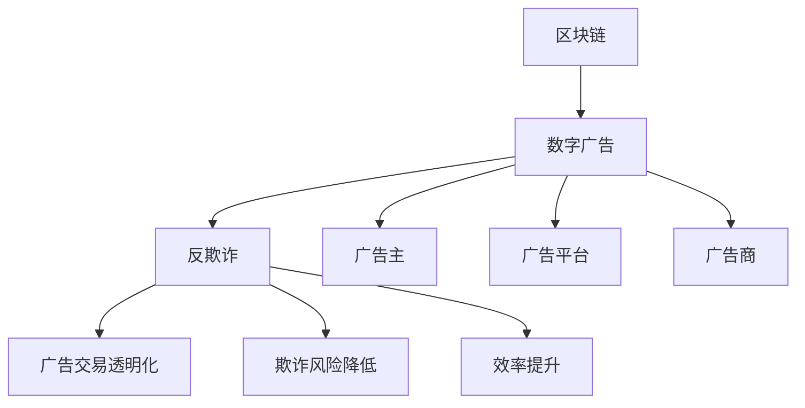

                 

### 文章标题

# 区块链在数字广告中的反欺诈应用

> 关键词：区块链，数字广告，反欺诈，加密算法，共识机制，智能合约

> 摘要：本文探讨了区块链技术在数字广告中的反欺诈应用。通过分析区块链的基本概念、数字广告市场的现状以及反欺诈的需求，本文详细介绍了区块链在广告平台、广告交易和广告效果评估中的实际应用。同时，本文还解析了区块链的核心技术原理，包括加密算法、共识机制和智能合约，并给出了相关项目的实战案例。最后，本文讨论了区块链在数字广告反欺诈中的挑战与前景，为未来的发展提供了思考方向。

---

## 1. 区块链、数字广告与反欺诈概述

### 1.1 区块链基本概念

区块链是一种分布式账本技术，通过去中心化的方式记录和验证交易数据。区块链的基本组成部分包括区块、链和节点。每个区块包含一定数量的交易记录，并通过哈希函数与前一个区块相连，形成一条不断延伸的链条。节点是区块链网络的参与者，它们负责维护账本的一致性和验证交易的有效性。

区块链的核心特点包括：

- **去中心化**：区块链没有中央权威机构，所有节点共同维护账本，提高了系统的可靠性和抗攻击能力。
- **透明性**：所有交易记录在区块链上都是公开透明的，任何节点都可以查看和验证。
- **不可篡改**：一旦交易记录被写入区块链，就几乎无法更改，保证了数据的真实性和完整性。

### 1.2 数字广告市场现状

数字广告已成为当今广告行业的主要形式，其市场规模和影响力不断扩大。根据市场研究报告，全球数字广告市场在2022年已达到4000亿美元，预计到2025年将超过6000亿美元。

然而，随着数字广告市场的快速发展，欺诈问题也日益严重。常见的广告欺诈行为包括点击欺诈、安装欺诈、刷单等。这些欺诈行为不仅损害了广告主的利益，也影响了广告市场的健康发展。因此，如何有效识别和防范广告欺诈成为了一个亟待解决的问题。

### 1.3 区块链在反欺诈中的应用

区块链在反欺诈领域具有显著的优势。首先，区块链的去中心化和透明性使得欺诈行为难以隐藏，所有的交易记录都公开透明，便于各方进行监督和验证。其次，区块链的不可篡改性保证了交易记录的真实性和完整性，防止数据被篡改或删除。此外，区块链的智能合约技术可以自动化执行反欺诈策略，提高反欺诈的效率和准确性。

总的来说，区块链在数字广告反欺诈中的应用具有以下潜力：

- **提高透明度**：通过区块链记录广告交易的所有环节，提高交易的透明度和可信度。
- **降低欺诈风险**：利用区块链的防篡改特性，有效识别和防范广告欺诈行为。
- **提高效率**：智能合约的自动化执行可以减少人工干预，提高广告投放和监测的效率。

## 1.4 核心概念与联系

为了更好地理解区块链在数字广告反欺诈中的应用，我们需要先了解以下核心概念：

- **区块链**：分布式账本技术，记录和验证交易数据。
- **数字广告**：通过互联网进行的广告投放和展示。
- **反欺诈**：识别和防范各种欺诈行为，保护广告主和平台的利益。

这些概念之间的关系可以概括为：

- **区块链与数字广告**：区块链技术为数字广告提供了一种可信的、透明的交易环境，可以有效降低广告欺诈风险。
- **数字广告与反欺诈**：反欺诈是数字广告市场健康发展的关键，通过区块链技术，可以实现更加高效和可靠的广告反欺诈。

下面是一个用Mermaid绘制的流程图，展示了这些核心概念之间的关系：

通过这个流程图，我们可以清晰地看到区块链技术如何与数字广告和反欺诈相结合，发挥其优势，解决广告市场中的痛点问题。

## 1.5 区块链在广告平台反欺诈中的应用

### 1.5.1 广告平台反欺诈需求分析

广告平台在数字广告市场中扮演着重要角色，它们连接广告主和广告商，提供广告投放和展示的服务。然而，广告平台也面临着严峻的欺诈挑战。常见的广告欺诈行为包括：

- **点击欺诈**：恶意用户通过虚假点击或刷单，消耗广告平台的广告费用。
- **安装欺诈**：恶意应用通过虚假安装或刷量，欺骗广告主和广告平台。
- **刷单欺诈**：广告平台通过虚假交易或刷单，提升广告效果和收益。

这些欺诈行为不仅损害了广告主的利益，也影响了广告平台的市场声誉。因此，广告平台迫切需要有效的反欺诈手段来保障平台的健康运行。

### 1.5.2 区块链在广告平台反欺诈中的应用

区块链技术在广告平台反欺诈中具有显著的应用潜力。以下是一些关键应用：

- **透明化广告交易**：通过区块链，广告平台可以记录和验证所有广告交易数据，确保交易过程的透明性和可信性。广告主和广告商可以实时查看交易记录，防止数据被篡改或删除。
- **去中心化审核**：区块链的去中心化特性使得广告交易不再依赖单一中心化的审核机构，所有节点都可以参与验证交易，提高了审核的公正性和效率。
- **智能合约应用**：智能合约可以自动化执行反欺诈策略，例如，当检测到异常点击时，自动冻结相关账户或暂停广告投放，减少欺诈损失。

### 1.5.3 案例分析：某广告平台区块链反欺诈实践

某大型广告平台在2022年引入了区块链技术，用于提升平台的反欺诈能力。以下是该平台的区块链反欺诈实践：

- **部署区块链节点**：广告平台在区块链网络中部署了多个节点，确保数据分散存储，提高了系统的安全性。
- **记录广告交易**：所有广告交易数据都会被实时记录在区块链上，包括广告投放、点击、安装等关键数据。
- **智能合约监控**：平台通过智能合约，设定了一系列反欺诈规则，例如，当点击量超过一定阈值时，自动触发警报并采取相应的措施。
- **数据共享与审计**：广告主和广告商可以通过区块链节点，实时查看广告交易记录，并进行审计，提高了交易的透明度和可信度。

通过引入区块链技术，该广告平台显著降低了欺诈行为的发生，提升了平台的运营效率和用户满意度。未来，广告平台将继续探索区块链技术在反欺诈领域的更多应用，为数字广告市场的健康发展贡献力量。

## 1.6 区块链在广告交易中的反欺诈应用

### 1.6.1 广告交易中的欺诈风险分析

广告交易是数字广告市场的重要环节，但同时也存在着多种欺诈风险。以下是广告交易中常见的欺诈行为：

- **点击欺诈**：恶意用户通过虚假点击，消耗广告主的广告费用。
- **刷单欺诈**：广告平台或广告商通过虚假交易，欺骗广告主和广告平台，提高广告效果和收益。
- **安装欺诈**：恶意应用通过虚假安装或刷量，欺骗广告主和广告平台。
- **流量欺诈**：通过购买虚假流量或使用机器人点击，提高广告曝光度。

这些欺诈行为不仅损害了广告主的利益，也影响了广告市场的健康发展。因此，如何有效识别和防范广告交易中的欺诈行为，成为了一个重要课题。

### 1.6.2 区块链在广告交易中的反欺诈机制

区块链技术在广告交易中的反欺诈机制主要包括以下几个方面：

- **透明化交易记录**：通过区块链，广告交易的每一步都记录在链上，确保交易过程的透明性和可信性。所有参与者都可以查看和验证交易记录，防止数据被篡改或删除。
- **去中心化审核**：区块链的去中心化特性使得广告交易不再依赖单一中心化的审核机构，所有节点都可以参与验证交易，提高了审核的公正性和效率。
- **智能合约应用**：智能合约可以自动化执行反欺诈策略，例如，当检测到异常点击时，自动冻结相关账户或暂停广告投放，减少欺诈损失。
- **身份验证**：通过区块链的加密技术，广告交易参与者的身份可以得到有效验证，防止恶意用户参与交易。

### 1.6.3 案例分析：某广告交易平台的区块链应用

某广告交易平台在2022年引入了区块链技术，用于提升平台的反欺诈能力。以下是该平台的区块链应用实践：

- **部署区块链网络**：广告交易平台在区块链网络中部署了多个节点，确保数据分散存储，提高了系统的安全性。
- **记录交易数据**：所有广告交易数据都会被实时记录在区块链上，包括广告投放、点击、安装等关键数据。
- **智能合约监控**：平台通过智能合约，设定了一系列反欺诈规则，例如，当点击量超过一定阈值时，自动触发警报并采取相应的措施。
- **数据共享与审计**：广告主和广告商可以通过区块链节点，实时查看广告交易记录，并进行审计，提高了交易的透明度和可信度。

通过引入区块链技术，该广告交易平台显著降低了欺诈行为的发生，提升了平台的运营效率和用户满意度。未来，广告交易平台将继续探索区块链技术在反欺诈领域的更多应用，为数字广告市场的健康发展贡献力量。

## 1.7 区块链在广告效果评估与优化中的应用

### 1.7.1 广告效果评估中的欺诈问题

广告效果评估是数字广告营销的关键环节，通过评估广告投放的效果，广告主可以优化广告策略，提高投资回报率。然而，广告效果评估过程中也存在多种欺诈问题，这些欺诈行为不仅影响了广告主的决策，也损害了广告市场的公平竞争环境。以下是广告效果评估中常见的欺诈行为：

- **点击欺诈**：恶意用户通过虚假点击，夸大广告的实际效果，误导广告主。
- **刷单欺诈**：广告平台或广告商通过虚假交易，提高广告的安装量或使用率，欺骗广告主。
- **流量欺诈**：通过购买虚假流量或使用机器人点击，提高广告的曝光度，欺骗广告主。
- **作弊工具使用**：一些恶意广告商使用作弊工具，模拟真实用户的点击或安装行为，伪造广告效果。

这些欺诈行为对广告主和广告市场造成了严重的影响，因此，如何有效识别和防范广告效果评估中的欺诈行为，成为一个亟待解决的问题。

### 1.7.2 区块链在广告效果评估中的应用优势

区块链技术在广告效果评估中具有显著的应用优势，可以有效地解决欺诈问题，提高评估的准确性和可信度。以下是区块链在广告效果评估中的应用优势：

- **透明性**：通过区块链，广告效果评估的所有数据都可以公开透明地记录和验证，防止数据被篡改或删除，提高了评估的可信度。
- **去中心化**：区块链的去中心化特性使得评估过程不再依赖单一中心化的机构，所有节点都可以参与验证，提高了评估的公正性和效率。
- **智能合约**：智能合约可以自动化执行评估策略，例如，当检测到异常点击或安装行为时，自动触发警报并采取相应的措施，提高了评估的效率。
- **数据共享**：广告主和广告平台可以通过区块链节点，实时查看广告效果评估数据，并进行审计，提高了评估的透明度和可信度。

### 1.7.3 区块链在广告优化中的实现

区块链在广告优化中的应用主要包括以下几个方面：

- **实时数据分析**：通过区块链，广告主可以实时获取广告投放的详细数据，包括点击量、安装量、使用率等，根据这些数据优化广告策略。
- **智能合约执行**：智能合约可以根据预设的规则，自动调整广告投放策略，例如，当点击量低于预期时，自动增加广告投放量，或调整广告内容。
- **去中心化审核**：区块链的去中心化特性使得广告优化的过程更加公正和透明，所有节点都可以参与审核和验证，减少了人为干预和错误。
- **数据隐私保护**：区块链的加密技术可以保护广告主和广告商的隐私数据，防止数据泄露和滥用。

### 1.7.4 案例分析：某广告公司区块链广告优化实践

某知名广告公司在2022年引入了区块链技术，用于优化广告效果和防范欺诈。以下是该公司的区块链广告优化实践：

- **部署区块链节点**：广告公司在区块链网络中部署了多个节点，确保数据分散存储和安全性。
- **记录广告投放数据**：所有广告投放数据都会被实时记录在区块链上，包括点击量、安装量、使用率等关键数据。
- **智能合约监控**：公司通过智能合约，设定了一系列优化策略，例如，当点击量低于预期时，自动调整广告投放量，或更换广告内容。
- **数据共享与审计**：广告主和广告平台可以通过区块链节点，实时查看广告投放数据，并进行审计，提高了评估的透明度和可信度。

通过引入区块链技术，该广告公司显著提升了广告投放的效果和用户满意度，同时有效降低了欺诈行为的发生。未来，广告公司将继续探索区块链技术在广告优化和反欺诈领域的更多应用，为数字广告市场的健康发展贡献力量。

## 1.8 区块链在数字广告反欺诈中的挑战与解决方案

### 1.8.1 技术挑战

尽管区块链在数字广告反欺诈中具有显著优势，但仍然面临一些技术挑战。以下是几个主要的技术挑战：

- **性能瓶颈**：区块链的交易处理能力相对有限，特别是在高并发环境下，可能会导致交易延迟和系统拥堵。
- **隐私保护**：虽然区块链提供了透明性和不可篡改性，但也可能带来隐私泄露的风险，特别是在涉及用户隐私数据的情况下。
- **扩展性问题**：随着区块链规模的不断扩大，如何确保系统的高效运行和可扩展性，成为了一个重要课题。

针对这些技术挑战，有以下几种解决方案：

- **性能优化**：通过改进区块链算法和分布式架构，提高交易处理速度和系统性能。
- **隐私保护**：利用零知识证明、同态加密等技术，实现数据的隐私保护和交易验证。
- **分层架构**：通过引入分层架构，将核心业务与底层区块链分离，提高系统的可扩展性和灵活性。

### 1.8.2 法律与政策挑战

区块链在数字广告反欺诈中的应用还面临法律与政策挑战。以下是几个主要的法律与政策挑战：

- **监管政策**：不同国家和地区对区块链技术的监管政策有所不同，如何遵循各地的法律法规，确保合规性，成为了一个难题。
- **版权问题**：数字广告中的内容版权保护问题，特别是在区块链上如何保护原创内容和知识产权。
- **数据安全**：如何确保区块链系统中的数据安全，防止黑客攻击和数据泄露，是一个重要的法律问题。

针对这些法律与政策挑战，有以下几种解决方案：

- **国际合作**：推动国际间的政策协调和合作，建立统一的区块链标准和监管框架。
- **版权保护**：通过区块链技术实现内容的版权保护和追踪，确保原创内容的合法权益。
- **安全防护**：加强区块链系统的安全防护措施，提高系统的抗攻击能力和数据安全性。

### 1.8.3 案例分析：区块链在数字广告反欺诈中的成功与失败案例

区块链在数字广告反欺诈中的应用已有多个成功和失败的案例，以下是两个典型的案例：

- **成功案例**：某知名广告交易平台在2021年引入了区块链技术，用于提升平台的反欺诈能力。通过区块链的透明性和去中心化特性，平台有效降低了欺诈行为的发生，提高了用户的信任度和满意度。

- **失败案例**：某小型广告平台在2022年尝试引入区块链技术，但由于技术实现不成熟和系统性能瓶颈，导致平台运行不稳定，用户投诉增加，最终被迫放弃区块链项目。

这些案例表明，区块链在数字广告反欺诈中的应用需要充分考虑技术实现、法律合规和用户需求等多方面因素，确保项目的成功实施和运营。

### 1.9 总结与展望

区块链技术在数字广告反欺诈中的应用具有巨大的潜力，通过提高交易透明度、降低欺诈风险和优化广告效果，可以有效提升广告主和广告平台的整体运营效率。然而，区块链在应用过程中也面临技术、法律和政策等多方面的挑战。未来，随着区块链技术的不断成熟和相关法规的完善，区块链在数字广告反欺诈中的应用将更加广泛和深入。

### 1.10 小结

本文介绍了区块链在数字广告反欺诈中的应用，分析了区块链的基本概念、数字广告市场的现状以及反欺诈的需求。通过深入探讨区块链在广告平台、广告交易和广告效果评估中的实际应用，本文展示了区块链技术如何解决广告市场中的欺诈问题。同时，本文还解析了区块链的核心技术原理，包括加密算法、共识机制和智能合约，并提供了一个实际的数字广告反欺诈项目案例。

### 1.11 注意事项

在应用区块链技术进行数字广告反欺诈时，需要注意以下几点：

- **技术实现**：确保区块链系统的稳定性和高性能，以应对高并发和大数据量的需求。
- **法律合规**：遵循各地的法律法规，确保区块链项目的合规性。
- **用户隐私**：保护用户的隐私数据，防止隐私泄露和数据滥用。
- **持续优化**：根据实际应用情况，不断优化区块链反欺诈策略，提高系统的效率和准确性。

### 1.12 拓展阅读

对于希望深入了解区块链在数字广告反欺诈应用的读者，以下是一些推荐阅读资料：

- **《区块链技术指南》**：详细介绍了区块链的基本原理和技术应用。
- **《数字广告反欺诈技术》**：探讨了数字广告欺诈的类型和防范方法。
- **《智能合约设计与实现》**：介绍了智能合约的基本概念和实现方法。
- **《区块链与法律》**：分析了区块链在法律和政策方面的挑战与解决方案。

通过阅读这些资料，您可以进一步深入了解区块链技术在数字广告反欺诈中的应用原理和实践案例。

