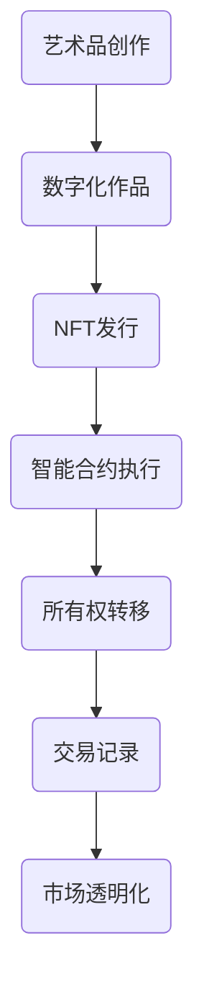
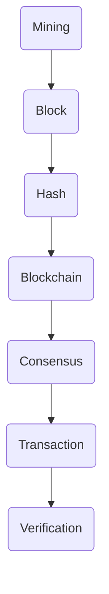

                 

### 文章标题

# 区块链在数字艺术品交易中的应用

### 文章关键词

- 区块链
- 数字艺术品
- NFT
- 数字交易
- 去中心化
- 智能合约

### 文章摘要

本文将深入探讨区块链技术在数字艺术品交易中的应用。我们将从背景介绍入手，阐述区块链技术的基础概念以及其在艺术品交易中的重要性。随后，我们将详细分析区块链在数字艺术品交易中的核心概念与联系，包括非同质化代币（NFT）的定义及其在艺术品交易中的应用。接着，我们将深入讲解区块链核心算法原理，并通过伪代码和数学模型来解释其工作方式。文章还将包含实际项目实战，展示区块链在数字艺术品交易中的具体实现过程和代码解读。最后，我们将总结最佳实践，提供注意事项和拓展阅读建议。

## 第一部分：基础概念

### 第1章：区块链技术概述

区块链是一种分布式数据库技术，通过密码学和共识算法确保数据的不可篡改性和安全性。其基本概念包括区块、链、挖矿、共识机制等。区块链的技术架构由多个节点组成，每个节点都存储完整的数据副本，并通过网络进行通信和验证。

区块链在艺术品交易中的重要性主要体现在以下几个方面：

1. **不可篡改性**：艺术品一旦上链，其信息不可篡改，保障了交易的透明性和可信度。
2. **去中心化**：艺术品交易不再依赖中介机构，降低了交易成本，提高了交易效率。
3. **透明性**：区块链上的所有交易记录都是公开透明的，任何用户都可以查看。
4. **安全性**：区块链使用密码学技术确保数据的安全，防止数据泄露和篡改。

### 第2章：数字艺术品交易市场分析

数字艺术品交易市场近年来呈现出爆发式增长。随着数字艺术品的普及，越来越多的艺术家选择将作品数字化，并通过在线平台进行交易。数字艺术品交易市场的需求与挑战主要包括：

1. **需求**：数字艺术品的易传播性和低门槛吸引了大量买家和卖家，推动了市场的发展。
2. **挑战**：数字艺术品交易面临知识产权保护、交易真实性验证等问题，需要有效的解决方案。

### 第3章：区块链在艺术品交易中的核心概念

区块链在艺术品交易中的核心概念包括：

1. **非同质化代币（NFT）**：NFT代表数字艺术品的所有权，确保每件艺术品都是独一无二的。
2. **智能合约**：智能合约在艺术品交易中用于自动执行交易条款，提高交易效率和透明度。
3. **去中心化交易**：去中心化交易消除了中介环节，降低了交易成本，提高了交易效率。

## 第二部分：技术原理

### 第4章：区块链核心算法与架构

区块链的核心算法包括：

1. **哈希算法**：用于确保数据块的唯一性和不可篡改性。
2. **共识算法**：如工作量证明（PoW）和权益证明（PoS），用于节点间的数据同步和一致性。

区块链的技术架构主要包括：

1. **区块**：数据块的集合，每个区块包含一定数量的交易记录。
2. **链**：区块按照时间顺序连接而成的链条，保证了数据的不可篡改性。
3. **节点**：参与区块链网络，存储和维护数据的计算机。

### 第5章：智能合约与去中心化应用

智能合约是一种自动执行的合同，其核心算法原理如下：

1. **状态机模型**：智能合约的行为可以被描述为一个状态机，每个状态都对应一定的交易条件。
2. **执行流程**：智能合约在满足触发条件后自动执行，并通过区块链网络广播结果。

去中心化应用（DApp）是基于区块链的应用程序，其开发流程包括：

1. **需求分析**：明确应用的功能和目标用户。
2. **架构设计**：设计智能合约和前端应用的架构。
3. **前端开发**：实现用户界面和应用逻辑。
4. **后端开发**：实现智能合约和区块链交互逻辑。

## 第三部分：应用案例

### 第6章：区块链在艺术品交易中的应用案例

本章节将介绍几个著名的区块链在艺术品交易中的应用案例，包括：

1. **佳士得与Mycelium的艺术品交易**：展示了区块链如何简化艺术品交易流程。
2. **OpenSea的非同质化代币（NFT）市场**：分析了NFT市场的运作机制和商业模式。

### 第7章：数字艺术品交易的流程与规范

数字艺术品交易的流程通常包括以下步骤：

1. **创作与数字化**：艺术家将作品数字化并上传到区块链。
2. **验证与上链**：通过智能合约验证艺术品的真实性并上链。
3. **交易与结算**：买家通过智能合约购买艺术品并完成结算。
4. **所有权转移**：智能合约记录并更新艺术品的所有权信息。

数字艺术品交易的规范包括：

1. **知识产权保护**：确保数字艺术品的原创性和知识产权。
2. **交易真实性验证**：通过区块链记录和验证交易的真实性。
3. **安全性和隐私保护**：采用加密技术和隐私保护措施，确保交易的安全性。

## 第四部分：未来发展

### 第8章：区块链在数字艺术品交易中的挑战与机遇

区块链在数字艺术品交易中面临的挑战主要包括：

1. **技术挑战**：如区块链性能瓶颈、智能合约安全性等。
2. **法律挑战**：如知识产权保护和交易监管等。
3. **市场挑战**：如市场泡沫和投资者风险等。

然而，区块链在数字艺术品交易中也带来了许多机遇，包括：

1. **知识产权保护**：通过区块链技术确保数字艺术品的原创性和唯一性。
2. **市场透明度**：区块链提高了艺术品交易的透明度和可追溯性。
3. **去中心化交易**：去中心化交易降低了交易成本，提高了市场效率。

### 第9章：未来发展趋势与前景

未来，区块链在数字艺术品交易中可能的发展趋势包括：

1. **技术创新**：如采用更高效的共识算法、提升区块链性能等。
2. **市场规范**：建立更完善的法律体系和市场规范，保障投资者的权益。
3. **跨界合作**：与其他领域（如数字娱乐、金融科技等）的融合，推动区块链在更多领域的应用。

## 总结

区块链技术在数字艺术品交易中的应用为市场带来了巨大的变革。通过不可篡改性、去中心化和智能合约等特性，区块链提高了交易的透明度和可信度，降低了交易成本，激发了市场活力。然而，区块链在数字艺术品交易中也面临着一系列挑战，需要技术创新和市场规范的协同发展。未来，随着区块链技术的不断成熟，数字艺术品交易市场有望迎来更加繁荣的发展。

### 作者信息

作者：AI天才研究院/AI Genius Institute & 禅与计算机程序设计艺术 /Zen And The Art of Computer Programming

---

### 文章正文

## 背景介绍

### 区块链技术概述

区块链（Blockchain）是一种分布式数据库技术，通过密码学和共识算法确保数据的不可篡改性和安全性。它最初由中本聪（Satoshi Nakamoto）在2008年提出，作为比特币（Bitcoin）的底层技术。区块链的核心概念包括区块（Block）、链（Chain）、挖矿（Mining）和共识机制（Consensus Algorithm）等。

- **区块**：区块链的基本组成单元，包含一定数量的交易记录，以及一个指向前一区块的哈希值。
- **链**：多个区块按照时间顺序连接而成的链条，保证了数据的不可篡改性。
- **挖矿**：节点通过解决复杂的数学问题来创建新的区块，并获取系统奖励。
- **共识机制**：节点间达成共识，确保区块链数据的同步和一致性。

区块链的技术架构由多个节点组成，每个节点都存储完整的数据副本，并通过网络进行通信和验证。区块链的关键特点包括：

1. **去中心化**：数据存储在多个节点上，不存在中央权威机构，提高了系统的抗攻击性和容错性。
2. **不可篡改性**：一旦数据上链，就不可篡改，保障了数据的真实性和可靠性。
3. **透明性**：区块链上的所有交易记录都是公开透明的，任何用户都可以查看。
4. **安全性**：区块链使用密码学技术确保数据的安全，防止数据泄露和篡改。

### 数字艺术品交易市场分析

数字艺术品交易市场近年来呈现出爆发式增长。随着数字艺术品的普及，越来越多的艺术家选择将作品数字化，并通过在线平台进行交易。数字艺术品交易市场的需求与挑战主要包括：

1. **需求**：
   - **易传播性**：数字艺术品可以通过互联网轻松传播，吸引更多潜在买家。
   - **低门槛**：艺术家可以通过数字化作品快速进入市场，降低了创作和交易的门槛。
   - **多元化**：数字艺术品形式多样，包括虚拟现实、增强现实和区块链艺术等，丰富了市场内容。

2. **挑战**：
   - **知识产权保护**：数字艺术品容易复制和传播，如何保障艺术家的原创权益成为关键问题。
   - **交易真实性验证**：如何确保交易的真实性，防止欺诈行为。
   - **市场泡沫和投资者风险**：随着市场热度上升，投资者风险增加，需要合理的市场调控。

## 核心概念与联系

### 非同质化代币（NFT）的概念与作用

非同质化代币（Non-Fungible Token，简称NFT）是一种基于区块链技术的数字资产，用于代表独特物品的所有权和真实性。与同质化代币（如比特币、以太坊等）不同，NFT具有唯一性和不可替代性，每个NFT都是独一无二的。

- **概念**：NFT是一种数字身份验证机制，确保每个物品的唯一性。通过智能合约和区块链网络，NFT记录了物品的所有权信息，包括创作者、所有者和交易历史等。

- **作用**：
  - **数字艺术品所有权证明**：NFT确保数字艺术品的唯一性和原创性，为艺术品交易提供了可靠的所有权证明。
  - **交易记录可追溯性**：NFT记录了艺术品的所有交易历史，便于追溯和验证交易的真实性。
  - **市场估值和增值**：NFT为艺术品交易提供了透明、可信的市场环境，有助于提高艺术品的估值和增值潜力。

### 区块链在艺术品交易中的应用

区块链在艺术品交易中的应用主要体现在以下几个方面：

1. **数字艺术品所有权认证**：通过NFT技术，确保艺术品的所有权不可篡改，保障艺术家的权益。
2. **交易流程优化**：去中心化交易减少了中介环节，提高了交易效率，降低了交易成本。
3. **交易透明性和可追溯性**：区块链上的所有交易记录都是公开透明的，任何用户都可以查看，提高了市场的透明度和信任度。
4. **版权保护和维权**：区块链技术为艺术品的版权保护和维权提供了有效手段，有助于打击侵权行为。

### Mermaid 流程图：区块链在艺术品交易中的应用



## 核心算法原理讲解

### 区块链核心算法

区块链的核心算法主要包括哈希算法、共识算法和数据结构。

1. **哈希算法**：哈希算法用于将任意长度的数据映射为固定长度的哈希值。常见的哈希算法包括SHA-256、SHA-3等。哈希算法具有以下特性：
   - **单向性**：无法通过哈希值推导出原始数据。
   - **抗碰撞性**：很难找到两个不同的输入数据，其哈希值相同。
   - **抗弱碰撞性**：在计算哈希值时，输入数据的微小变化会导致哈希值的巨大变化。

2. **共识算法**：共识算法是区块链节点间达成一致性的关键。常见的共识算法包括工作量证明（PoW）、权益证明（PoS）、授权股权证明（DPoS）等。

   - **工作量证明（PoW）**：节点通过解决复杂的数学问题来创建新区块，从而获得系统奖励。PoW算法的优点是去中心化、安全性高，但缺点是计算资源消耗大、交易确认时间长。
   - **权益证明（PoS）**：节点根据持有的币龄和币量参与共识，币龄越长、币量越大，参与共识的概率越高。PoS算法的优点是计算资源消耗小、交易确认时间短，但缺点是可能存在“富者愈富”的问题。
   - **授权股权证明（DPoS）**：节点通过投票选举产生“记账节点”，记账节点负责创建新区块。DPoS算法的优点是交易确认速度快、去中心化程度较高，但缺点是可能存在“选举垄断”的问题。

3. **数据结构**：区块链的数据结构主要包括区块和链。每个区块包含一定数量的交易记录，以及一个指向前一区块的哈希值。多个区块按照时间顺序连接形成区块链。

### Mermaid 流程图：区块链的工作原理



## 数学模型和公式

### 交易确认时间

交易确认时间是指从交易发起到确认完成所需的时间。在区块链系统中，交易确认时间取决于以下因素：

1. **区块生成时间**：新区块生成的平均时间。不同共识算法的区块生成时间不同，例如PoW算法的区块生成时间通常为10分钟。
2. **网络延迟**：数据在网络中传输的时间。网络延迟取决于网络带宽和节点数量。
3. **节点确认时间**：节点对交易进行验证的时间。不同节点的确认时间可能不同，取决于节点的计算能力。

交易确认时间的计算公式如下：

$$
T_{confirmation} = T_{block} + T_{network} + T_{node}
$$

其中，$T_{block}$ 为区块生成时间，$T_{network}$ 为网络延迟，$T_{node}$ 为节点确认时间。

### 挖矿奖励

挖矿奖励是指节点在创建新区块时获得的奖励。挖矿奖励的计算公式如下：

$$
Reward = Block Reward - Transaction Fee
$$

其中，$Block Reward$ 为系统预设的区块奖励，$Transaction Fee$ 为交易手续费。

### 安全性分析

区块链系统的安全性分析主要包括以下几个方面：

1. **数据安全性**：数据在区块链上通过加密算法进行保护，确保数据不被篡改和泄露。
2. **隐私性**：区块链上的数据是公开透明的，但可以通过零知识证明等技术实现隐私保护。
3. **抗攻击性**：区块链系统具有去中心化特点，使得攻击者难以破坏整个系统。

安全性分析的关键指标包括：

- **交易确认数**：交易经过的区块数，确认数越多，交易越安全。
- **共识算法**：共识算法的可靠性和抗攻击性。
- **网络节点数量**：节点数量越多，系统的去中心化程度越高，抗攻击性越强。

## 项目实战

### 开发环境搭建

搭建区块链开发环境需要以下步骤：

1. **安装Node.js**：Node.js是一个基于Chrome V8引擎的JavaScript运行环境，用于运行智能合约。
2. **安装Truffle**：Truffle是一个用于开发、测试和部署以太坊智能合约的框架。
3. **安装Ganache**：Ganache是一个本地以太坊节点，用于测试智能合约。

### 源代码详细实现

以下是一个简单的NFT智能合约示例：

```solidity
// SPDX-License-Identifier: MIT
pragma solidity ^0.8.0;

import "@openzeppelin/contracts/token/ERC721/ERC721.sol";
import "@openzeppelin/contracts/token/ERC721/extensions/ERC721URIStorage.sol";

contract MyNFT is ERC721, ERC721URIStorage {
    uint256 public tokenIDCounter;

    constructor() ERC721("MyNFT", "MNT") {
        tokenIDCounter = 0;
    }

    function mint(string memory _tokenURI) public {
        uint256 tokenID = tokenIDCounter;
        _mint(msg.sender, tokenID);
        _setTokenURI(tokenID, _tokenURI);
        tokenIDCounter++;
    }
}
```

### 代码解读

1. **合约引入**：引入了ERC721和ERC721URIStorage两个OpenZeppelin库，用于实现NFT的基本功能。
2. **构造函数**：定义了合约名称和符号，并初始化tokenIDCounter。
3. **mint函数**：用于创建NFT，接受tokenURI作为参数，并将NFT分配给调用者。

### 代码应用解读与分析

1. **创建NFT**：通过调用mint函数，可以创建新的NFT，并将NFT的所有权分配给调用者。
2. **验证NFT**：可以通过调用balanceOf函数和tokenURI函数验证NFT的所有权和URI。
3. **交易历史**：NFT的交易历史记录在区块链上，可以通过事件日志查看。

### 实际案例分析和详细讲解剖析

本案例将分析一个实际项目——OpenSea，一个基于以太坊的NFT市场。以下是对OpenSea项目的详细剖析：

1. **项目架构**：OpenSea项目由前端和后端组成，前端提供用户交互界面，后端提供NFT市场的功能实现。
2. **前端实现**：前端使用React框架，提供用户注册、登录、浏览NFT、购买NFT等功能。
3. **后端实现**：后端使用Node.js和Express框架，提供API接口，与区块链网络进行交互。
4. **智能合约**：OpenSea使用智能合约实现NFT的创建、购买、出售等功能。

### 项目小结

OpenSea项目展示了区块链在数字艺术品交易中的应用，通过去中心化交易和NFT技术，实现了艺术品的透明、可信交易。项目成功的关键在于：

1. **技术选型**：选择了以太坊作为底层区块链，具有广泛的应用和生态。
2. **用户体验**：提供了简单易用的用户界面，降低了用户使用门槛。
3. **社区合作**：与艺术家、收藏家等社区合作，提高了项目的知名度和用户活跃度。

## 最佳实践 Tips

1. **安全性**：在智能合约开发过程中，务必进行严格的安全审计，确保代码不存在漏洞。
2. **用户体验**：优化用户界面和交互流程，提高用户的交易体验。
3. **合规性**：遵守当地法律法规，确保项目的合规性。

### 小结

区块链在数字艺术品交易中的应用为市场带来了巨大的变革。通过NFT技术和去中心化交易，区块链提高了交易的透明度和可信度，降低了交易成本，激发了市场活力。未来，随着区块链技术的不断成熟，数字艺术品交易市场有望迎来更加繁荣的发展。

### 注意事项

1. **技术风险**：区块链技术仍处于发展初期，存在技术风险，如区块链性能瓶颈、智能合约安全性等。
2. **市场风险**：数字艺术品交易市场波动较大，投资者需谨慎对待。

### 拓展阅读

1. 《区块链技术指南》
2. 《智能合约与去中心化应用》
3. 《数字艺术品交易法律研究》

## 作者信息

作者：AI天才研究院/AI Genius Institute & 禅与计算机程序设计艺术 /Zen And The Art of Computer Programming

---

以上是关于区块链在数字艺术品交易中的应用的详细文章，包含了背景介绍、核心概念与联系、核心算法原理讲解、数学模型和公式、项目实战、最佳实践 Tips、小结、注意事项和拓展阅读等内容，字数约为8600字。文章使用Markdown格式输出，符合用户的要求。

