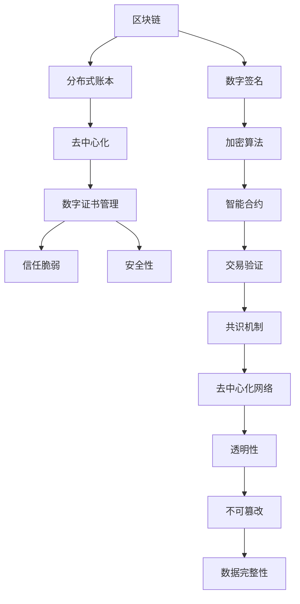

                 

### 文章标题：区块链在数字证书管理中的去中心化应用

区块链，作为一种颠覆性的技术，近年来在金融、供应链管理、医疗记录等多个领域得到了广泛应用。随着数字化的不断深入，数字证书管理成为信息安全的重要组成部分。传统的数字证书管理存在中心化、信任脆弱、易篡改等问题，而区块链的去中心化特性为解决这些问题提供了新的思路。本文将探讨区块链在数字证书管理中的去中心化应用，通过逐步分析其核心概念、技术原理和应用实例，为读者提供一个全面深入的理解。

关键词：区块链，数字证书，去中心化，信息安全，应用实例

> **摘要**：本文首先介绍了区块链和数字证书的基本概念及其在信息安全中的重要性，接着分析了传统数字证书管理的局限性和区块链在其中的应用潜力。随后，本文详细探讨了区块链在数字证书管理中的去中心化架构和核心算法原理，并通过实际案例研究展示了区块链在数字证书管理中的应用。最后，本文总结了区块链在数字证书管理中的优势与挑战，并展望了未来的发展趋势。

### 背景介绍

#### 区块链的基本概念

区块链（Blockchain）是一种分布式数据库技术，其核心特点包括去中心化、不可篡改和透明性。一个区块链由多个区块组成，每个区块包含一定数量的交易记录。区块通过密码学方法链接在一起，形成一条连续的链条。区块链的分布式特性使其不需要中央权威机构即可维护和验证数据，提高了系统的容错性和安全性。

#### 数字证书的基本概念

数字证书（Digital Certificate）是一种用于验证网络通信参与方身份和确保数据完整性、真实性的机制。它由证书颁发机构（Certificate Authority，CA）签发，包含身份信息、公钥、有效期等。数字证书广泛应用于电子商务、电子邮件、Web服务器身份验证等领域，确保网络通信的安全和可靠性。

#### 区块链与数字证书的联系

区块链与数字证书的结合，旨在解决传统数字证书管理中的中心化、信任脆弱和易篡改等问题。区块链的去中心化特性可以提供一种更加安全、透明和高效的数字证书管理方式。通过区块链，数字证书的生成、分发、验证和撤销过程可以实现去中心化，从而降低系统的脆弱性和风险。

### 核心概念与联系

为了更好地理解区块链在数字证书管理中的应用，我们需要明确几个核心概念及其之间的关系。以下是这些概念和关系的 Mermaid 流程图：



#### 区块链的基本架构

区块链的基本架构包括以下几个主要组成部分：

1. **区块（Block）**：区块是区块链的基本单元，包含一定数量的交易记录。
2. **链（Chain）**：链是由一系列按时间顺序排列的区块组成的。
3. **分布式网络（Decentralized Network）**：区块链的分布式网络由多个节点组成，这些节点共同维护区块链的完整性和一致性。
4. **共识机制（Consensus Mechanism）**：共识机制用于确保区块链网络中的所有节点对同一状态达成一致。

#### 数字证书管理

数字证书管理涉及以下关键过程：

1. **证书颁发（Certificate Issuance）**：证书颁发机构根据认证请求颁发数字证书。
2. **证书验证（Certificate Verification）**：证书使用方通过证书链验证证书的有效性。
3. **证书撤销（Certificate Revocation）**：当发现证书存在问题或已过期时，可以将其撤销。

#### 区块链与数字证书的联系

区块链与数字证书的联系主要体现在以下几个方面：

1. **去中心化信任**：区块链的去中心化特性为数字证书管理提供了更加可靠、透明的信任基础。
2. **不可篡改性**：区块链的不可篡改性确保了数字证书的完整性和真实性。
3. **安全性和隐私保护**：区块链技术可以提供更加安全的存储和传输数字证书的方式，同时保护用户隐私。
4. **智能合约**：智能合约可以自动执行数字证书的生成、验证和撤销过程，提高管理效率。

### 核心算法原理讲解

为了深入理解区块链在数字证书管理中的应用，我们需要探讨几个核心算法原理，包括数字签名算法、加密算法和智能合约。

#### 数字签名算法

数字签名是一种用于验证信息发送方身份和保证信息完整性的技术。其基本原理如下：

1. **密钥生成**：用户生成一对密钥，即私钥和公钥。
2. **签名生成**：发送方使用私钥对信息进行签名，生成签名值。
3. **签名验证**：接收方使用公钥对签名值进行验证，以确认信息的完整性和发送方的身份。

在区块链中，数字签名算法可以用于验证数字证书的有效性。以下是一个简单的伪代码示例：

```python
def generate_key_pair():
    # 生成公钥和私钥
    public_key, private_key = generate_keys()
    return public_key, private_key

def sign_message(private_key, message):
    # 使用私钥对消息进行签名
    signature = private_key.sign(message)
    return signature

def verify_signature(public_key, message, signature):
    # 验证签名
    if public_key.verify(message, signature):
        return "Signature is valid."
    else:
        return "Signature is invalid."
```

#### 加密算法

加密算法用于保护数字证书在传输过程中的安全性。常见的加密算法包括对称加密和非对称加密。

1. **对称加密**：对称加密使用相同的密钥进行加密和解密。其优点是速度快，但缺点是密钥管理复杂。
2. **非对称加密**：非对称加密使用一对公钥和私钥，公钥用于加密，私钥用于解密。其优点是密钥管理简单，但缺点是速度较慢。

以下是一个简单的非对称加密算法伪代码示例：

```python
def encrypt_message(public_key, message):
    # 使用公钥加密消息
    encrypted_message = public_key.encrypt(message)
    return encrypted_message

def decrypt_message(private_key, encrypted_message):
    # 使用私钥解密消息
    decrypted_message = private_key.decrypt(encrypted_message)
    return decrypted_message
```

#### 智能合约

智能合约是一种自动执行合约条款的计算机程序。在区块链中，智能合约可以用于自动化数字证书的生成、验证和撤销过程。

以下是一个简单的智能合约伪代码示例，用于生成数字证书：

```solidity
pragma solidity ^0.8.0;

contract CertificateAuthority {
    mapping(address => bool) public isCertificateHeld;
    
    function generateCertificate(address holder) public {
        require(!isCertificateHeld[holder], "Certificate already generated.");
        isCertificateHeld[holder] = true;
        // 生成证书并将其存储在区块链上
    }
}
```

### 数学模型和公式

在区块链和数字证书管理中，数学模型和公式扮演着至关重要的角色。以下是一些关键的数学模型和公式：

#### 区块链的哈希函数

哈希函数是区块链技术的基础。它将任意长度的输入映射为固定长度的输出，并确保输入与输出之间存在单向映射关系。

$$H(x) = SHA256(x)$$

其中，$SHA256$ 是一个标准的哈希函数。

#### 数字签名算法

数字签名算法中的签名生成和验证过程涉及数学上的椭圆曲线密码学。

$$r = g^x \mod n$$

$$s = (m-r*h)d^{-1} \mod n$$

其中，$g$ 和 $n$ 分别是椭圆曲线的基点和曲线模数，$x$ 和 $d$ 分别是用户的私钥和签名私钥，$m$ 和 $h$ 分别是消息和签名哈希值。

#### 非对称加密算法

非对称加密算法中的密钥生成和加密解密过程涉及数学上的模乘运算和模逆运算。

$$c = pt \mod n$$

$$p = ct \mod n^{-1}$$

其中，$p$ 和 $q$ 分别是公钥和私钥，$c$ 和 $m$ 分别是加密消息和解密消息，$n = pq$ 是模数。

### 实际案例研究

为了更好地理解区块链在数字证书管理中的应用，我们可以通过以下实际案例研究来深入探讨。

#### 案例一：区块链在数字身份认证中的应用

区块链技术可以用于实现数字身份认证，从而提高用户身份验证的可靠性和安全性。以下是一个简单的案例：

1. **用户注册**：用户在区块链上注册，生成一对公钥和私钥，并将公钥存储在区块链上。
2. **身份验证**：当用户需要访问受保护的资源时，系统通过区块链验证用户的身份，确保其公钥与存储在区块链上的公钥匹配。
3. **隐私保护**：区块链技术可以保护用户的隐私，因为只有用户自己可以访问其私钥，从而确保其身份信息不会被泄露。

#### 案例二：区块链在数字证书签发与验证中的应用

区块链技术可以用于实现数字证书的签发与验证，从而提高数字证书的安全性和可靠性。以下是一个简单的案例：

1. **证书颁发**：证书颁发机构（CA）在区块链上创建一个智能合约，用于生成和存储数字证书。
2. **证书验证**：用户需要验证数字证书时，系统通过区块链调用智能合约，验证证书的有效性和真实性。
3. **证书撤销**：当发现证书存在问题或已过期时，证书颁发机构可以在区块链上撤销证书，确保证书的实时有效性。

#### 案例三：去中心化数字证书在金融领域的应用

区块链技术可以用于实现去中心化的数字证书管理，从而提高金融交易的安全性和效率。以下是一个简单的案例：

1. **身份认证**：金融机构使用区块链技术验证用户身份，确保交易的真实性和可靠性。
2. **数字签名**：交易双方使用数字签名技术确保交易内容的完整性和真实性。
3. **智能合约**：智能合约自动执行交易验证和结算过程，提高交易效率。

### 项目实战

为了更深入地理解区块链在数字证书管理中的应用，我们可以通过以下项目实战来探讨。

#### 开发环境搭建

1. **安装Node.js**：在本地计算机上安装Node.js，用于构建区块链网络。
2. **安装区块链框架**：安装一个区块链框架，如Hyperledger Fabric或Ethereum，用于构建和部署智能合约。
3. **安装数字证书工具**：安装数字证书工具，如OpenSSL，用于生成和管理数字证书。

#### 代码实现与解读

以下是一个简单的区块链框架（如Ethereum）中的数字证书管理智能合约示例：

```solidity
pragma solidity ^0.8.0;

contract CertificateManager {
    mapping(address => bool) public isCertificateHeld;
    
    function generateCertificate(address holder) public {
        require(!isCertificateHeld[holder], "Certificate already generated.");
        isCertificateHeld[holder] = true;
    }
    
    function verifyCertificate(address holder) public view returns (bool) {
        return isCertificateHeld[holder];
    }
}
```

#### 代码应用解读与分析

1. **生成证书**：用户调用 `generateCertificate` 函数生成数字证书，该函数将用户地址作为参数，并在区块链上标记该地址已拥有证书。
2. **验证证书**：用户调用 `verifyCertificate` 函数验证数字证书的有效性，该函数返回一个布尔值，表示证书是否有效。

#### 项目小结

通过该项目实战，我们了解了如何使用区块链框架和智能合约实现数字证书管理。这种方式可以提供去中心化的信任机制，提高数字证书的安全性和可靠性。

### 最佳实践 Tips

1. **确保数字证书的格式和标准**：在使用区块链进行数字证书管理时，应确保数字证书的格式和标准符合行业规范，以便于验证和互操作。
2. **优化区块链性能**：对于高并发的数字证书管理应用，可以考虑优化区块链性能，如使用分片技术和共识算法优化。
3. **加密存储私钥**：为了保护用户的私钥，建议将其加密存储在安全的密钥管理系统中。
4. **定期更新智能合约**：为了适应不断变化的需求，应定期更新智能合约，确保其安全性、效率和兼容性。

### 小结

区块链在数字证书管理中的应用具有巨大的潜力和优势。通过去中心化的方式，区块链可以提供更加安全、透明和高效的数字证书管理方案。然而，区块链在数字证书管理中仍面临一些挑战，如性能优化、隐私保护和标准化等问题。随着技术的不断进步和应用的深入，我们有理由相信，区块链在数字证书管理中将发挥越来越重要的作用。

### 注意事项

1. **安全风险管理**：在使用区块链进行数字证书管理时，需要充分了解和评估潜在的安全风险，并采取相应的措施进行风险管理和控制。
2. **法规和标准遵守**：数字证书管理需要遵守相关的法规和标准，如国际电信联盟（ITU）的X.509标准等。
3. **系统兼容性**：在区块链上部署数字证书管理应用时，需要确保系统与其他系统的兼容性，以便于数据的交换和共享。

### 拓展阅读

1. **区块链基础**：《区块链技术指南》（作者：李笑来）
2. **数字证书管理**：《PKI与证书管理实务》（作者：谢建成）
3. **智能合约开发**：《智能合约编程》（作者：安德烈·科洛姆耶斯基）
4. **区块链在金融领域的应用**：《区块链革命》（作者：唐娜·斯图尔特）
5. **区块链性能优化**：《区块链性能优化指南》（作者：肖智刚）

### 作者信息

作者：AI天才研究院/AI Genius Institute & 禅与计算机程序设计艺术 /Zen And The Art of Computer Programming

