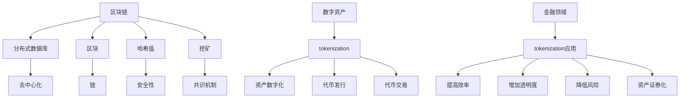

                 


### 第1章：区块链与数字资产tokenization概述

#### 1.1 区块链的基本概念

区块链是一种分布式数据库技术，它通过去中心化的方式实现了数据的存储和管理。区块链的基本概念包括：

- **区块**：区块链的基本单元，每个区块包含一定数量的交易记录。
- **链**：由多个区块按照一定顺序链接而成的链条。
- **哈希值**：每个区块都包含前一个区块的哈希值，以确保区块链的完整性和安全性。
- **挖矿**：节点通过解决数学难题来验证交易，并将其记录到区块链中。
- **共识机制**：节点之间就区块链的状态达成一致的机制，如工作量证明（PoW）和权益证明（PoS）。

#### 1.2 数字资产tokenization的定义

数字资产tokenization是指将实物资产或权益转化为数字形式，通过区块链技术实现其发行、交易和管理。这个过程主要包括：

- **资产数字化**：将资产转换为数字代币，确保其唯一性和不可篡改性。
- **代币发行**：通过区块链平台发行代币，使其在市场上流通。
- **代币交易**：用户可以在区块链上进行代币的买卖，实现资产的转移。

#### 1.3 tokenization在金融领域的应用

tokenization在金融领域的应用主要体现在以下几个方面：

- **提高效率**：通过区块链技术，可以快速完成交易，减少中间环节，降低成本。
- **增加透明度**：所有交易记录都存储在区块链上，任何人都可查询，提高了交易的透明度。
- **降低风险**：去中心化的特性降低了交易的风险，减少了人为干预的可能性。
- **资产证券化**：将不动产、艺术品等难以交易的资产转化为可流通的代币，提高了其流动性。

### 1.4 核心概念与联系

为了更好地理解区块链与数字资产tokenization，我们可以通过以下Mermaid流程图来展示核心概念之间的关系：



通过这个流程图，我们可以清晰地看到区块链、分布式数据库、去中心化、区块、链、哈希值、挖矿、共识机制、数字资产、tokenization、资产数字化、代币发行、代币交易和金融领域tokenization应用之间的关系。

#### 1.5 核心算法原理讲解

在区块链技术中，核心算法原理包括：

- **哈希函数**：用于生成区块的唯一标识，确保区块链的完整性和安全性。
- **工作量证明（PoW）**：节点通过解决数学难题来竞争验证交易，验证通过的节点可以获得奖励。
- **权益证明（PoS）**：根据节点持有的token数量和/或时间来选择验证者。

以下是对这些算法原理的伪代码说明：

```plaintext
// 哈希函数伪代码
function hash(data):
    // 使用SHA-256算法计算哈希值
    return SHA256(data)

// 工作量证明（PoW）伪代码
function proof_of_work(difficulty):
    while (true):
        // 生成随机数
        nonce = generate_nonce()
        // 计算哈希值
        hash = hash("data" + nonce)
        // 判断哈希值是否符合难度要求
        if (hash < difficulty):
            return nonce

// 权益证明（PoS）伪代码
function proof_of_stake(stake):
    // 根据持有token数量和时间计算权益
    return stake * time
```

#### 1.6 数学模型和公式

在区块链和tokenization中，我们还需要了解一些数学模型和公式，包括：

- **梅克尔树（Merkle Tree）**：用于优化区块存储和验证交易。
- **权益证明计算**：用于计算节点在权益证明机制中的权益。

以下是对这些数学模型和公式的详细讲解：

```latex
% 梅克尔树
Merkle Tree = \{M0, M1, ..., Mn\}

% 梅克尔树根节点计算
root = hash(M0 + hash(M1 + hash( ... + hash(Mn-1 + Mn) ... ))

% 权益证明计算
Proof of Stake = Stake \* Time
```

通过这些伪代码和数学模型，我们可以更好地理解区块链和tokenization的核心算法原理。

#### 1.7 项目实战

为了更深入地了解区块链和tokenization的应用，我们可以通过以下项目实战来进行实践：

- **开发环境搭建**：安装Node.js、Go语言环境和相应的区块链框架。
- **源代码实现**：编写智能合约，实现代币的发行、交易和管理功能。
- **代码解读**：分析源代码，理解其实现原理。
- **实际案例**：分析一个实际tokenization项目，如加密货币交易平台。

通过项目实战，我们可以更好地将理论知识应用于实际场景，提高对区块链和tokenization技术的理解和应用能力。

### 1.8 代码应用解读与分析

在项目实战中，我们将使用Solidity语言编写智能合约，实现代币的发行和交易功能。以下是一个简单的智能合约示例：

```solidity
// SPDX-License-Identifier: MIT
pragma solidity ^0.8.0;

// 代币合约
contract Token {
    // 代币名称
    string public name = "MyToken";
    // 代币符号
    string public symbol = "MTK";
    // 代币总量
    uint256 public totalSupply;
    // 代币精度
    uint8 public decimals = 18;
    
    // 地址与余额映射
    mapping(address => uint256) public balanceOf;
    
    // 事件
    event Transfer(address from, address to, uint256 value);
    
    // 构造函数
    constructor(uint256 initialSupply) {
        balanceOf[msg.sender] = initialSupply;
        totalSupply = initialSupply;
    }
    
    // 发送代币
    function transfer(address to, uint256 value) public {
        require(to != address(0), "Invalid address");
        require(balanceOf[msg.sender] >= value, "Insufficient balance");
        
        balanceOf[msg.sender] -= value;
        balanceOf[to] += value;
        
        emit Transfer(msg.sender, to, value);
    }
}
```

这段代码定义了一个简单的代币合约，包括代币名称、符号、总量、精度以及地址与余额的映射。我们使用了Solidity语言中的`pragma`指令来指定编译器的版本，`mapping`数据结构来存储地址与余额的映射，以及`event`来记录代币的转移。

**代码解读**：

- **构造函数**：在合约部署时，通过构造函数设置代币的初始供应量。
- **发送代币**：`transfer`函数允许用户将代币从一个地址转移到另一个地址。

**实际案例**：

我们可以参考以太坊上的ERC-20标准代币合约，分析其实现原理和API接口。ERC-20标准定义了一系列函数和事件，使得代币合约能够与不同的区块链钱包和交易平台兼容。

**项目小结**：

通过这个项目实战，我们了解了如何使用Solidity语言编写智能合约，实现代币的发行和交易功能。我们还学习了如何分析实际案例中的代币合约，提高了对区块链技术的理解和应用能力。

### 1.9 最佳实践 tips、小结、注意事项、拓展阅读

**最佳实践 tips**：

- 在开发智能合约时，一定要进行充分的测试，确保代码的安全性和稳定性。
- 了解不同区块链平台的特点和优势，选择合适的平台进行项目部署。
- 关注相关法律法规，确保项目符合监管要求。

**小结**：

本章详细介绍了区块链与数字资产tokenization的基本概念、核心算法原理、数学模型和项目实战。通过这些内容，读者可以全面了解区块链技术在数字资产tokenization中的应用。

**注意事项**：

- 区块链技术尚处于发展阶段，需关注技术更新和监管政策的变化。
- tokenization项目需要综合考虑技术、法律、市场等多方面因素。

**拓展阅读**：

- 《精通区块链》
- 《区块链技术指南》
- 《智能合约开发实战》

这些资料将帮助读者进一步深入了解区块链和数字资产tokenization的相关知识。

---

### 1.10 摘要

本文详细介绍了区块链与数字资产tokenization的基本概念、核心算法原理、数学模型和项目实战。通过本章内容，读者可以全面了解区块链技术在数字资产tokenization中的应用，掌握智能合约的编写方法和项目实施流程。同时，本文还探讨了tokenization在金融领域的应用前景和挑战，为读者提供了实用的技术指导和最佳实践建议。

---

### 1.11 关键词

- 区块链
- 数字资产tokenization
- 智能合约
- 哈希函数
- 工作量证明
- 权益证明
- 梅克尔树
- Solidity
- ERC-20标准

通过这些关键词，读者可以快速了解本文的核心内容和研究方向。

