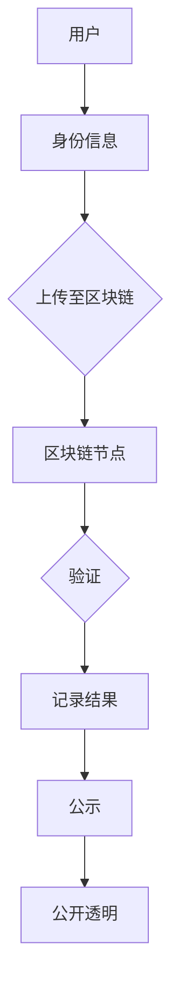
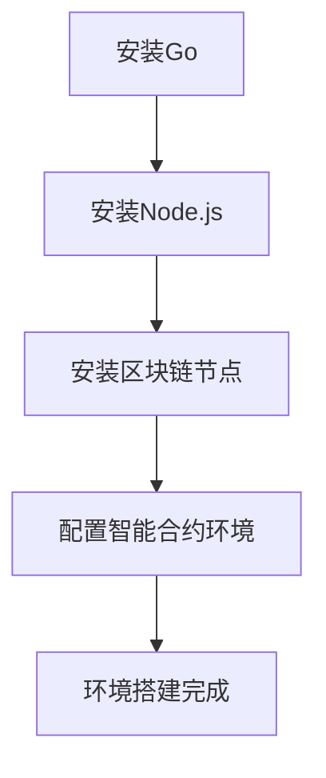

                 


### 文章标题

区块链在数字身份认证中的去中心化应用

> 关键词：区块链、数字身份认证、去中心化、加密算法、智能合约、安全性

> 摘要：
本文将深入探讨区块链技术在数字身份认证中的应用，尤其是其去中心化的特性如何解决了传统身份认证系统中的诸多问题。我们将逐步解析区块链的基本概念，数字身份认证的需求，区块链的核心算法原理，数学模型和公式，以及区块链在数字身份认证中的实际项目案例，最后讨论未来的发展趋势和潜在挑战。

### 目录

1. **背景介绍**
   1.1 **区块链的基本概念**
   1.2 **数字身份认证的需求**
   1.3 **区块链与数字身份认证的结合**

2. **核心概念与联系**
   2.1 **区块链与数字身份认证的架构**
   2.2 **区块链加密算法与身份认证**

3. **核心算法原理讲解**
   3.1 **哈希算法与区块链**
   3.2 **加密算法与数字签名**
   3.3 **智能合约在身份认证中的应用**

4. **数学模型和数学公式**
   4.1 **数学模型的基本概念**
   4.2 **身份认证的数学公式**
   4.3 **举例说明**

5. **项目实战**
   5.1 **开发环境搭建**
   5.2 **源代码详细实现和代码解读**
   5.3 **代码应用解读与分析**
   5.4 **实际案例分析和详细讲解剖析**
   5.5 **项目小结**

6. **最佳实践 Tips、小结、注意事项、拓展阅读**

### 背景介绍

#### 1.1 区块链的基本概念

区块链是一种分布式数据库技术，其特点是去中心化、透明性、不可篡改和安全性。区块链通过将数据记录在多个节点上，形成一个不可篡改的分布式账本，从而实现信息的共享和传递。

区块链的基本组件包括：

- **区块**：区块是区块链的基本单位，包含了交易信息、时间戳、难度目标等。
- **链**：链是由多个区块按照时间顺序连接而成，每个区块都包含了一个指向前一个区块的哈希值，形成一个链式结构。
- **节点**：节点是区块链网络中的计算机，负责维护区块链的状态、验证交易和参与共识过程。

#### 1.2 数字身份认证的需求

数字身份认证是为了在网络环境中确认个体的身份，确保只有授权用户可以访问受保护的资源和数据。随着互联网的普及，数字身份认证的需求日益增长。然而，传统身份认证系统存在以下几个问题：

- **中心化**：传统身份认证系统通常依赖于中心化的机构进行身份验证，容易成为黑客攻击的目标。
- **单点故障**：中心化系统一旦遭受攻击或发生故障，整个系统将瘫痪。
- **数据泄露**：中心化系统中用户数据集中在少数几个机构，一旦发生数据泄露，后果严重。
- **互操作性**：不同系统之间的身份认证标准不统一，难以实现互操作。

#### 1.3 区块链与数字身份认证的结合

区块链技术的去中心化和不可篡改特性为解决上述问题提供了可能。区块链可以将身份认证过程去中心化，使得每个节点都可以参与身份验证，提高系统的容错性和安全性。同时，区块链的透明性和公开性也使得身份认证过程更加可信。

区块链在数字身份认证中的应用主要体现在以下几个方面：

- **分布式身份验证**：通过区块链网络中的多个节点共同验证用户身份，减少对中心化机构的依赖。
- **智能合约**：利用智能合约自动执行身份验证流程，提高效率。
- **加密技术**：使用加密算法保护用户身份信息，防止数据泄露。
- **透明性**：区块链上的所有交易和身份认证信息都是公开透明的，提高了系统的可信度。

### 核心概念与联系

区块链与数字身份认证的结合具有以下核心概念和联系：

1. **分布式身份验证**：区块链通过去中心化的方式实现了身份验证，每个节点都参与验证过程，减少了单点故障的风险。节点之间通过共识算法达成一致，保证了验证结果的正确性。

2. **加密算法**：区块链使用加密算法保护用户身份信息和交易数据，防止未经授权的访问和篡改。常见的加密算法包括哈希算法、公钥加密和数字签名。

3. **智能合约**：智能合约是自动执行身份验证流程的计算机程序，可以嵌入到区块链中。通过智能合约，身份认证过程可以自动执行，提高了效率。

4. **链上身份信息**：区块链上的身份信息是公开透明的，但通过加密算法保护了用户的隐私。用户可以通过私钥来证明自己的身份，而无需公开敏感信息。

下面我们使用 Mermaid 流程图来展示区块链与数字身份认证的架构：



### 核心算法原理讲解

#### 3.1 哈希算法与区块链

哈希算法是区块链技术中的核心组成部分，其作用是将任意长度的数据映射为固定长度的哈希值。在区块链中，哈希算法用于确保数据的完整性和不可篡改性。

常见的哈希算法包括 SHA-256、SHA-3 等。以下是一个简单的 SHA-256 哈希算法的伪代码实现：

```python
def sha256_hash(data):
    # 将数据转换为字节序列
    data_bytes = data.encode('utf-8')
    # 计算哈希值
    hash_value = hashlib.sha256(data_bytes).hexdigest()
    return hash_value
```

在区块链中，每个区块都包含了一个时间戳和一个前一个区块的哈希值。这种链式结构保证了区块链数据的不可篡改性。以下是一个简化的区块链节点的伪代码实现：

```python
class Block:
    def __init__(self, index, timestamp, data, previous_hash):
        self.index = index
        self.timestamp = timestamp
        self.data = data
        self.previous_hash = previous_hash
        self.hash = self.compute_hash()

    def compute_hash(self):
        block_string = f"{self.index}{self.timestamp}{self.data}{self.previous_hash}"
        return sha256_hash(block_string)
```

#### 3.2 加密算法与数字签名

加密算法是保护区块链上数据隐私的重要手段。公钥加密和数字签名是两种常见的加密算法。

公钥加密使用一对密钥（公钥和私钥）进行加密和解密。公钥可以公开，私钥必须保密。以下是一个简单的 RSA 公钥加密的伪代码实现：

```python
from Crypto.PublicKey import RSA

def generate_keypair():
    key = RSA.generate(2048)
    private_key = key.export_key()
    public_key = key.publickey().export_key()
    return private_key, public_key

def encrypt_message(public_key, message):
    public_key = RSA.import_key(public_key)
    encrypted_message = public_key.encrypt(message, 32)
    return encrypted_message

def decrypt_message(private_key, encrypted_message):
    private_key = RSA.import_key(private_key)
    decrypted_message = private_key.decrypt(encrypted_message)
    return decrypted_message
```

数字签名用于验证消息的完整性和来源。发送方使用私钥对消息进行签名，接收方使用公钥验证签名。以下是一个简单的数字签名的伪代码实现：

```python
from Crypto.Signature import pkcs1_15
from Crypto.Hash import SHA256

def generate_signature(private_key, message):
    private_key = RSA.import_key(private_key)
    hash_message = SHA256.new(message.encode('utf-8'))
    signature = pkcs1_15.new(private_key).sign(hash_message)
    return signature

def verify_signature(public_key, message, signature):
    public_key = RSA.import_key(public_key)
    hash_message = SHA256.new(message.encode('utf-8'))
    try:
        pkcs1_15.new(public_key).verify(hash_message, signature)
        return True
    except (ValueError, TypeError):
        return False
```

#### 3.3 智能合约在身份认证中的应用

智能合约是自动执行身份验证流程的计算机程序。在区块链上，智能合约可以在无需第三方中介的情况下执行合同条款。以下是一个简单的智能合约的伪代码实现，用于身份验证：

```solidity
pragma solidity ^0.8.0;

contract IdentityVerification {
    mapping(address => bool) public isVerified;

    function verifyIdentity(address userAddress) public {
        // 身份验证逻辑
        // 假设通过验证
        isVerified[userAddress] = true;
    }

    function getVerificationStatus(address userAddress) public view returns (bool) {
        return isVerified[userAddress];
    }
}
```

### 数学模型和数学公式

在区块链数字身份认证中，数学模型和数学公式起着至关重要的作用。以下是几个关键的数学模型和公式：

#### 4.1 数学模型的基本概念

1. **哈希函数**：哈希函数是将输入映射到固定长度输出值的函数，具有单向性和抗碰撞性。哈希函数的数学模型通常表示为：

   \( H(x) = \text{Hash}(x) \)

2. **加密函数**：加密函数是将明文映射到密文的函数，通常依赖于密钥。加密函数的数学模型表示为：

   \( C = E_K(P) \)

   其中，\( C \) 是密文，\( P \) 是明文，\( K \) 是密钥。

3. **数字签名**：数字签名用于验证消息的完整性和来源，由哈希函数和加密函数组成。数字签名的数学模型表示为：

   \( S = E_K(H(M)) \)

   其中，\( S \) 是签名，\( M \) 是消息，\( H \) 是哈希函数，\( K \) 是私钥。

#### 4.2 身份认证的数学公式

1. **身份认证的信任度计算**：

   \( Trust = \frac{验证次数}{总次数} \)

   其中，\( Trust \) 是信任度，\( 验证次数 \) 是通过验证的次数，\( 总次数 \) 是总的验证次数。

2. **风险评估模型**：

   \( Risk = \frac{损失概率}{收益概率} \)

   其中，\( Risk \) 是风险评估，\( 损失概率 \) 是损失发生的概率，\( 收益概率 \) 是收益发生的概率。

3. **身份认证的效率分析**：

   \( Efficiency = \frac{验证速度}{处理速度} \)

   其中，\( Efficiency \) 是效率，\( 验证速度 \) 是验证过程的速度，\( 处理速度 \) 是处理事务的速度。

#### 4.3 举例说明

假设一个系统中有 100 个用户进行身份认证，其中 90 个用户通过验证，10 个用户未通过验证。根据上述数学模型和公式，我们可以计算信任度、风险评估和效率：

1. **信任度计算**：

   \( Trust = \frac{90}{100} = 0.9 \)

   信任度为 90%。

2. **风险评估模型**：

   如果每个用户成功验证后可以得到 10 个积分，而未通过验证会导致损失 5 个积分，则风险评估为：

   \( Risk = \frac{0.1 \times 5}{0.9 \times 10} = \frac{0.5}{9} \approx 0.056 \)

   风险评估约为 5.6%。

3. **效率分析**：

   如果验证过程需要 1 秒钟，而处理事务需要 10 秒钟，则效率为：

   \( Efficiency = \frac{1}{10} = 0.1 \)

   效率为 10%。

### 项目实战

#### 5.1 开发环境搭建

在进行区块链数字身份认证项目的开发之前，我们需要搭建一个适合开发、测试和部署的环境。以下是搭建开发环境的基本步骤：

1. **安装Go语言**：区块链应用通常使用Go语言开发，因此需要安装Go语言环境。
2. **安装Node.js**：Node.js 用于智能合约的开发和部署，需要安装 Node.js 环境。
3. **安装区块链节点**：选择一个适合的区块链平台，如Ethereum，安装区块链节点。
4. **配置智能合约开发环境**：安装Truffle、Ganache等工具，用于智能合约的开发和部署。

以下是一个简单的 Mermaid 流程图，展示开发环境的搭建流程：



#### 5.2 源代码详细实现和代码解读

在这个项目中，我们将使用Ethereum平台和Solidity语言开发一个简单的数字身份认证智能合约。以下是源代码及其解读：

```solidity
pragma solidity ^0.8.0;

contract IdentityVerification {
    mapping(address => bool) public isVerified;

    function verifyIdentity(address userAddress) public {
        require(!isVerified[userAddress], "Identity already verified");
        isVerified[userAddress] = true;
    }

    function getVerificationStatus(address userAddress) public view returns (bool) {
        return isVerified[userAddress];
    }
}
```

**代码解读**：

- **pragma**：指定编译器版本。
- **mapping**：用于存储用户身份验证状态。
- **require**：条件语句，确保用户身份未被验证。
- **verifyIdentity**：用于验证用户身份。
- **getVerificationStatus**：用于查询用户身份验证状态。

#### 5.3 代码应用解读与分析

在智能合约部署之后，我们需要通过前端应用程序与合约交互，实现用户身份的验证。以下是前端应用程序的简单示例：

```javascript
const ethers = require('ethers');

async function verifyUserIdentity(userAddress) {
    // 连接到区块链节点
    const provider = new ethers.providers.JsonRpcProvider('http://localhost:8545');
    const contract = new ethers.Contract(contractAddress, contractAbi, provider);

    // 验证用户身份
    const isVerified = await contract.getVerificationStatus(userAddress);

    console.log(`User ${userAddress} is Verified: ${isVerified}`);
}

// 示例：验证地址为0x1234567890123456789012345678901234567890的用户身份
verifyUserIdentity('0x1234567890123456789012345678901234567890');
```

**代码分析**：

- **连接区块链节点**：使用Ethers.js库连接到区块链节点。
- **创建合约实例**：通过合约地址和ABI创建合约实例。
- **验证用户身份**：调用合约的`getVerificationStatus`方法，查询用户身份验证状态。

#### 5.4 实际案例分析和详细讲解剖析

在这个案例中，我们将分析一个实际的应用场景，即使用区块链技术实现高校学生的在线身份认证。

**背景**：

某高校计划开发一个在线教育平台，学生需要在平台上进行课程学习、考试和成绩查询。为了确保平台的安全性，高校决定使用区块链技术进行学生身份认证。

**实现**：

1. **学生身份注册**：
   - 学生在平台注册时，需要上传身份证明材料（如学生证、身份证等）。
   - 平台管理员使用智能合约验证学生身份证明，并将验证结果记录在区块链上。

2. **课程学习与考试**：
   - 学生在完成课程学习后，需要进行考试。
   - 考试结果和成绩记录在区块链上，确保数据的透明性和不可篡改性。

3. **成绩查询**：
   - 学生可以查询自己的考试成绩和历史记录。
   - 平台管理员可以查看所有学生的成绩和考试记录。

**案例分析**：

- **安全性**：区块链技术确保了学生身份和成绩的不可篡改性，提高了平台的安全性。
- **透明性**：区块链上的所有交易和记录都是公开透明的，增强了学生对平台信任。
- **去中心化**：区块链的去中心化特性降低了平台管理的风险，提高了平台的容错性。

**详细讲解剖析**：

1. **智能合约设计**：
   - 智能合约包括身份注册、课程学习、考试和成绩记录等功能。
   - 每个功能都使用区块链的加密算法和哈希函数进行保护。

2. **前端应用程序**：
   - 前端应用程序用于学生与平台交互，包括身份注册、成绩查询等功能。
   - 应用程序使用Ethers.js库与区块链节点交互。

3. **后端服务器**：
   - 后端服务器负责处理用户请求，与智能合约交互，并将结果返回给前端。

#### 5.5 项目小结

通过该项目，我们展示了区块链技术在数字身份认证中的应用。区块链的去中心化、透明性和不可篡改性为数字身份认证提供了强有力的支持。在实际项目中，智能合约的设计和前端应用程序的开发是实现区块链数字身份认证的关键。

### 最佳实践 Tips、小结、注意事项、拓展阅读

#### 最佳实践 Tips

1. **选择合适的区块链平台**：不同的区块链平台具有不同的性能和特性，选择适合自己项目的平台是关键。
2. **加密算法的选择**：选择合适的加密算法是保护用户隐私和安全的关键，需要根据实际需求进行选择。
3. **智能合约的测试**：智能合约在部署之前需要进行严格的测试，确保其功能和安全性。

#### 小结

本文通过深入探讨区块链在数字身份认证中的去中心化应用，详细讲解了区块链的基本概念、核心算法原理、数学模型以及实际项目案例。区块链技术在数字身份认证中具有显著的优势，但同时也面临一些挑战，如安全性问题和互操作性。

#### 注意事项

1. **数据隐私保护**：在区块链数字身份认证中，需要特别注意保护用户隐私，避免敏感信息泄露。
2. **法律法规遵守**：在区块链应用过程中，需要遵守相关法律法规，确保合规性。

#### 拓展阅读

1. **《区块链技术原理与应用》**：详细介绍了区块链的基本原理和应用场景。
2. **《区块链与数字货币》**：探讨了区块链技术在数字货币和金融领域的应用。
3. **《智能合约设计与开发》**：介绍了智能合约的基本概念和开发方法。

