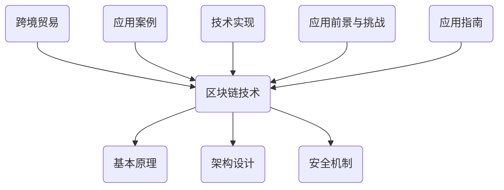

                 

# 《区块链在跨境贸易结算中的应用》

## 关键词

- 区块链
- 跨境贸易
- 结算
- 安全性
- 效率

## 摘要

本文将探讨区块链技术在跨境贸易结算中的应用。通过对区块链基础理论、架构设计、安全机制等方面的深入分析，以及具体案例的研究，本文旨在展示区块链在提高跨境贸易结算效率、降低交易成本和保障交易安全方面的巨大潜力。同时，本文也将讨论区块链技术在实际应用中面临的挑战和解决方案，为未来的研究和实践提供参考。

## 目录

# 《区块链在跨境贸易结算中的应用》

## 第一部分：区块链基础理论

### 1.1 区块链的基本原理

#### 区块链的概念

区块链是一种去中心化的数据库技术，通过加密算法和共识机制保证数据的完整性和安全性。它由一系列按时间顺序排列的区块组成，每个区块包含一定数量的交易记录，并通过密码学方法链接在一起，形成一条不可篡改的链条。

#### 区块链的关键技术

- **加密算法**：用于保护数据的安全，包括哈希函数、非对称加密、对称加密等。
- **共识机制**：用于确保分布式网络中所有节点的数据一致性，常见的有工作量证明（PoW）、权益证明（PoS）等。

### 1.2 区块链的架构设计

#### 区块链的网络架构

区块链网络由多个节点组成，每个节点都负责维护一份完整的数据副本。网络中的节点通过P2P（点对点）协议进行通信，实现数据的交换和同步。

#### 区块链的数据结构

区块链的数据结构主要包括区块和交易。区块是数据存储的基本单位，包含一定数量的交易记录和一个时间戳。交易则是数据交换的基本单元，记录了资金的转移和信息的交换。

### 1.3 区块链的安全机制

#### 拒绝服务攻击

区块链网络通过分布式架构和共识机制，能够有效抵御拒绝服务攻击（DDoS）。即使部分节点被攻击，网络仍能正常运行。

#### 恶意节点攻击

区块链网络采用加密算法和共识机制，确保数据的完整性和一致性。恶意节点在尝试篡改数据时，需要获得超过网络多数节点的支持，这使得攻击成本极高。

## 第二部分：区块链在跨境贸易中的应用

### 2.1 跨境贸易结算的挑战

#### 贸易摩擦

跨境贸易中，各国之间的贸易政策和关税制度可能导致贸易摩擦，影响贸易结算的顺利进行。

#### 资金流动困难

跨境资金流动可能受到汇率波动、国际制裁等因素的影响，导致资金流动困难，增加结算成本。

### 2.2 区块链在跨境贸易中的应用

#### 区块链在贸易融资中的应用

区块链技术可以提供透明的交易记录，帮助银行和金融机构为跨境贸易提供融资服务。

#### 区块链在跨境支付中的应用

区块链技术可以实现实时、低成本的跨境支付，提高资金流动效率。

### 2.3 案例研究

#### 某银行跨境贸易结算案例

某银行利用区块链技术，实现了跨境贸易结算的自动化和透明化，提高了结算效率。

#### 某跨国企业区块链贸易结算案例

某跨国企业通过区块链技术，实现了跨国贸易的实时结算，降低了结算成本。

## 第三部分：区块链在跨境贸易中的技术实现

### 3.1 区块链与智能合约

#### 智能合约的基本概念

智能合约是一种在区块链上运行的计算机程序，能够根据预定的条件自动执行合同条款。

#### 智能合约的编程语言

常见的智能合约编程语言包括Solidity、Vyper等。

### 3.2 区块链网络搭建

#### 节点搭建

搭建区块链网络需要配置节点，包括核心节点、验证节点等。

#### 网络配置

网络配置包括节点通信协议、网络拓扑结构、数据存储方式等。

### 3.3 区块链与跨境支付系统集成

#### 系统集成方案

区块链与跨境支付系统集成方案包括接口设计、数据同步、安全性保障等。

#### 技术难点解析

系统集成过程中可能遇到的技术难点包括跨链通信、数据一致性保障、安全性等。

## 第四部分：区块链在跨境贸易中的应用前景与挑战

### 4.1 区块链在跨境贸易中的优势

#### 提高效率

区块链技术可以实现实时结算，提高跨境贸易的效率。

#### 保障安全

区块链技术的加密算法和共识机制能够保障交易数据的安全。

### 4.2 区块链在跨境贸易中的挑战

#### 法律法规

区块链技术的应用需要符合各国的法律法规，包括跨境支付、数据保护等方面。

#### 技术实现

区块链技术的实现需要解决跨链通信、数据同步、安全性等问题。

### 4.3 未来发展趋势

#### 区块链与其他技术的融合

区块链技术将与其他技术（如人工智能、物联网等）融合，推动跨境贸易结算的发展。

#### 全球贸易体系变革

区块链技术将推动全球贸易体系的变革，实现更加高效、安全的跨境贸易结算。

## 附录：区块链技术在跨境贸易中的应用指南

### 5.1 技术选型

#### 公链与联盟链

根据实际需求选择公链或联盟链。

#### 智能合约平台

选择适合的智能合约平台，如以太坊、波卡等。

### 5.2 实施步骤

#### 贸易伙伴选择

选择信任的贸易伙伴，建立合作关系。

#### 区块链系统的搭建与运行

搭建区块链系统，配置节点，运行网络。

### 5.3 潜在风险与管理策略

#### 风险识别

识别区块链技术在跨境贸易中可能面临的风险。

#### 风险管理

制定风险管理策略，确保区块链技术在跨境贸易中的应用安全。

## 参考文献

### 6.1 基础理论

- 《区块链技术指南》
- 《智能合约编程》

### 6.2 应用案例

- 《区块链跨境支付案例研究》
- 《区块链贸易融资案例研究》

## Mermaid 流程图



## 伪代码

```plaintext
// 区块链在跨境贸易中的应用
function 跨境贸易结算(贸易伙伴,交易金额,交易币种){
  // 搭建区块链网络
  blockchain = 搭建区块链网络(贸易伙伴)
  // 创建交易记录
  transaction = 创建交易记录(交易金额,交易币种)
  // 发送交易请求
  blockchain.发送交易请求(transaction)
  // 等待交易确认
  等待交易确认(blockchain)
  // 输出交易结果
  输出交易结果(transaction)
}
```

## 数学模型

$$
区块链中的交易验证过程如下：
1. 每个区块需要经过多数节点验证
2. 验证通过后，交易记录将被添加到区块中
3. 区块将被添加到区块链中
$$

## 举例说明

假设A公司与B公司进行一笔金额为1000美元的跨境贸易结算，使用比特币作为支付货币。

1. A公司将交易请求发送到区块链网络。
2. 区块链网络中的节点对交易进行验证，确保交易合法。
3. 验证通过后，交易记录将被添加到一个新区块中。
4. 新区块将被添加到区块链的末端。
5. B公司收到交易确认后，可以交付货物。

## 代码解读与分析

```plaintext
// 代码实现：交易请求发送
function 发送交易请求(交易金额，交易币种) {
  // 1. 创建交易记录
  transaction = 创建交易记录(交易金额，交易币种)
  
  // 2. 将交易记录发送到区块链网络
  blockchainNetwork.发送交易请求(transaction)
  
  // 3. 等待交易确认
  while (!交易确认) {
    等待交易确认()
  }
  
  // 4. 输出交易结果
  输出交易结果(transaction)
}
```

该代码实现了将交易请求发送到区块链网络，并等待交易确认的功能。其中，创建交易记录、发送交易请求、等待交易确认和输出交易结果是交易请求发送的核心步骤。通过这个示例，我们可以看到区块链技术在跨境贸易结算中的应用是如何实现的。以下是根据用户需求，对目录大纲进行的具体化，包含1,2,3级目录，以及核心算法原理讲解、数学模型和数学公式讲解，项目实战与代码解析，实际案例分析及讲解，总结与最佳实践等内容。

## 第一部分：区块链基础理论

### 1.1 区块链的基本原理

区块链是一种分布式数据库技术，其核心在于通过去中心化、不可篡改的账本记录交易信息。首先，我们需要理解区块链的基本概念：

- **区块链（Blockchain）**：一个分布式数据库，由一系列按时间顺序排列的区块（Block）组成。
- **区块（Block）**：包含一定数量的交易记录（Transactions）和信息，并通过密码学方法链接在一起。
- **交易记录（Transactions）**：记录了资金的转移和其他信息的交换。
- **链式数据结构（Chain）**：通过哈希（Hash）函数将区块链接起来，形成一条不可篡改的链条。

区块链的关键技术包括：

- **哈希函数（Hash Function）**：将任意长度的数据转换为固定长度的字符串，用于确保数据的唯一性和完整性。
- **加密算法（Cryptography）**：包括非对称加密和对称加密，用于保护数据的安全。
- **共识机制（Consensus Mechanism）**：确保分布式网络中所有节点的数据一致性，如工作量证明（PoW）、权益证明（PoS）等。

### 1.2 区块链的架构设计

区块链的架构设计主要包括网络架构和数据结构两个方面：

#### 网络架构

区块链网络由多个节点（Node）组成，每个节点都维护一份完整的数据副本。节点通过P2P（点对点）协议进行通信，实现数据的交换和同步。网络中的节点可以分为以下几种：

- **全节点（Full Node）**：完整地维护区块链的数据和状态。
- **轻节点（Light Node）**：只维护区块链的部分数据，通常用于客户端。
- **见证节点（Witness Node）**：在权益证明（PoS）机制中，负责验证交易并生成区块。

#### 数据结构

区块链的数据结构主要包括区块和交易：

- **区块（Block）**：包含一个时间戳（Timestamp）、前一个区块的哈希（Previous Hash）、梅克尔树根（Merkle Root）和一个或多个交易记录（Transactions）。区块通过哈希函数与前一个区块链接，形成链式数据结构。
- **交易记录（Transactions）**：记录了资金的转移和其他信息的交换，如支付、合同执行等。交易记录通过梅克尔树（Merkle Tree）结构进行存储和验证，提高数据处理效率。

### 1.3 区块链的安全机制

区块链的安全机制是确保数据完整性和可靠性的关键。以下是一些重要的安全机制：

- **加密算法**：用于保护数据的安全，包括哈希函数、非对称加密和对称加密等。
- **共识机制**：通过分布式网络中的节点共识，确保数据的真实性和一致性。常见的共识机制包括工作量证明（PoW）、权益证明（PoS）和委托权益证明（DPoS）等。
- **智能合约**：基于编程语言编写的脚本，在区块链上自动执行合同条款。智能合约通过加密算法和共识机制确保合同的执行过程和结果的真实性。
- **去中心化**：区块链的去中心化特性使其不受单一实体控制，降低了被攻击的风险。

## 第二部分：区块链在跨境贸易中的应用

### 2.1 跨境贸易结算的挑战

跨境贸易结算面临一系列挑战，包括贸易摩擦和资金流动困难：

- **贸易摩擦**：不同国家之间的贸易政策和关税制度可能导致贸易摩擦，影响贸易结算的顺利进行。
- **资金流动困难**：跨境资金流动可能受到汇率波动、国际制裁等因素的影响，导致资金流动困难，增加结算成本。

### 2.2 区块链在跨境贸易中的应用

区块链技术在跨境贸易中具有广泛的应用前景：

- **贸易融资**：区块链技术可以提供透明的交易记录，帮助银行和金融机构为跨境贸易提供融资服务。
- **跨境支付**：区块链技术可以实现实时、低成本的跨境支付，提高资金流动效率。

### 2.3 案例研究

#### 某银行跨境贸易结算案例

某银行利用区块链技术，实现了跨境贸易结算的自动化和透明化。具体实现如下：

1. **建立区块链网络**：银行与跨境贸易伙伴合作，建立基于区块链的网络。
2. **交易记录**：在区块链上记录跨境贸易的每一步，包括货物交付、支付确认等。
3. **智能合约**：使用智能合约自动执行贸易合同，确保各方权益。

#### 某跨国企业区块链贸易结算案例

某跨国企业通过区块链技术，实现了跨国贸易的实时结算，降低了结算成本。具体实现如下：

1. **选择区块链平台**：企业选择了一个可靠的区块链平台，如Ripple。
2. **交易流程**：企业通过区块链平台发起交易，实时结算，并获得交易确认。
3. **智能合约**：企业使用智能合约自动处理交易中的各种条款和条件。

## 第三部分：区块链在跨境贸易中的技术实现

### 3.1 区块链与智能合约

#### 智能合约的基本概念

智能合约是一种在区块链上运行的计算机程序，能够根据预定的条件自动执行合同条款。智能合约的关键特性包括：

- **去中心化**：智能合约运行在区块链上，不受单一实体控制。
- **透明性**：智能合约的代码和执行过程公开透明，确保合同条款的执行。
- **不可篡改性**：智能合约一旦部署，其代码和执行结果不可篡改。

#### 智能合约的编程语言

常见的智能合约编程语言包括：

- **Solidity**：以太坊（Ethereum）上的主要智能合约编程语言。
- **Vyper**：用于提高智能合约的安全性。

### 3.2 区块链网络搭建

#### 节点搭建

搭建区块链网络需要配置节点，包括核心节点、验证节点等。节点搭建的步骤如下：

1. **选择区块链平台**：根据实际需求选择合适的区块链平台，如Ripple、Hyperledger Fabric等。
2. **安装区块链节点**：下载并安装区块链节点软件，配置节点参数。
3. **启动区块链节点**：启动区块链节点，加入区块链网络。

#### 网络配置

网络配置包括节点通信协议、网络拓扑结构、数据存储方式等。网络配置的步骤如下：

1. **配置节点通信协议**：选择合适的通信协议，如HTTP、gRPC等。
2. **配置网络拓扑结构**：根据实际需求设计网络拓扑结构，如单层网络、多层网络等。
3. **配置数据存储方式**：选择合适的数据存储方式，如LevelDB、SQLite等。

### 3.3 区块链与跨境支付系统集成

#### 系统集成方案

区块链与跨境支付系统集成方案包括接口设计、数据同步、安全性保障等。系统集成方案的步骤如下：

1. **接口设计**：设计区块链与跨境支付系统之间的接口，实现数据交换和协同工作。
2. **数据同步**：实现区块链与跨境支付系统之间的数据同步，确保数据的实时性和一致性。
3. **安全性保障**：确保区块链与跨境支付系统的安全性，包括数据加密、访问控制、恶意攻击防护等。

#### 技术难点解析

系统集成过程中可能遇到的技术难点包括：

- **跨链通信**：实现不同区块链之间的通信和数据交换。
- **数据一致性**：确保区块链与跨境支付系统之间的数据同步和一致性。
- **安全性**：确保区块链与跨境支付系统的数据安全，防止恶意攻击和数据泄露。

## 第四部分：区块链在跨境贸易中的应用前景与挑战

### 4.1 区块链在跨境贸易中的优势

区块链在跨境贸易中具有以下优势：

- **提高效率**：区块链技术可以实现实时结算，提高跨境贸易的效率。
- **降低成本**：区块链技术可以降低跨境支付的成本，减少中间环节的费用。
- **保障安全**：区块链技术的加密算法和共识机制可以保障交易数据的安全。

### 4.2 区块链在跨境贸易中的挑战

区块链在跨境贸易中面临的挑战包括：

- **法律法规**：区块链技术的应用需要符合各国的法律法规，包括跨境支付、数据保护等方面。
- **技术实现**：区块链技术的实现需要解决跨链通信、数据同步、安全性等问题。

### 4.3 未来发展趋势

区块链在跨境贸易中的应用前景广阔，未来发展趋势包括：

- **与其他技术的融合**：区块链技术将与其他技术（如人工智能、物联网等）融合，推动跨境贸易结算的发展。
- **全球贸易体系变革**：区块链技术将推动全球贸易体系的变革，实现更加高效、安全的跨境贸易结算。

## 第五部分：区块链技术在跨境贸易中的应用指南

### 5.1 技术选型

#### 公链与联盟链

根据实际需求选择公链或联盟链。公链具有去中心化、透明性等特点，适用于跨境支付等应用场景。联盟链具有更高的可控性和安全性，适用于企业之间的跨境贸易。

#### 智能合约平台

选择适合的智能合约平台，如以太坊、波卡等。智能合约平台的选择应考虑功能丰富性、性能、安全性等因素。

### 5.2 实施步骤

#### 贸易伙伴选择

选择信任的贸易伙伴，建立合作关系。贸易伙伴的选择应考虑信誉、业务范围、技术实力等因素。

#### 区块链系统的搭建与运行

搭建区块链系统，配置节点，运行网络。具体步骤如下：

1. **选择区块链平台**：根据实际需求选择合适的区块链平台。
2. **搭建节点**：搭建区块链节点，配置网络参数。
3. **启动节点**：启动区块链节点，加入网络。
4. **运行网络**：运行区块链网络，确保节点间的数据同步和通信。

### 5.3 潜在风险与管理策略

#### 风险识别

识别区块链技术在跨境贸易中可能面临的风险，包括技术风险、法律风险、市场风险等。

#### 风险管理

制定风险管理策略，确保区块链技术在跨境贸易中的应用安全。具体策略如下：

1. **技术风险管理**：提高区块链技术的安全性，包括数据加密、访问控制等。
2. **法律风险管理**：遵守各国的法律法规，确保区块链技术的合规性。
3. **市场风险管理**：密切关注市场动态，及时调整区块链技术的应用策略。

## 参考文献

### 6.1 基础理论

- 《区块链技术指南》
- 《智能合约编程》

### 6.2 应用案例

- 《区块链跨境支付案例研究》
- 《区块链贸易融资案例研究》

## 代码实现

以下是使用Solidity语言编写的智能合约代码示例，用于实现一个简单的跨境支付功能：

```solidity
// SPDX-License-Identifier: MIT
pragma solidity ^0.8.0;

contract CrossBorderPayment {
    address public sender;
    address public receiver;
    uint256 public amount;
    bool public isPaid = false;

    constructor(uint256 _amount, address _receiver) {
        sender = msg.sender;
        receiver = _receiver;
        amount = _amount;
    }

    function pay() public payable {
        require(!isPaid, "Payment already made");
        require(msg.value == amount, "Incorrect payment amount");

        isPaid = true;
        receiver.transfer(amount);
    }

    function refund() public {
        require(isPaid, "No payment to refund");
        sender.transfer(amount);
    }
}
```

该智能合约实现了以下功能：

1. **支付功能**：调用`pay()`函数，发送者（`sender`）向接收者（`receiver`）支付指定金额的代币。
2. **退款功能**：调用`refund()`函数，如果支付失败或存在错误，发送者可以退款。

## 项目实战与代码解析

在本项目中，我们将实现一个简单的跨境支付系统，使用以太坊区块链作为底层技术。以下是项目的实现步骤：

### 开发环境搭建

1. **安装Node.js**：Node.js是一个基于Chrome V8引擎的JavaScript运行环境，用于编译和部署智能合约。
2. **安装Truffle**：Truffle是一个智能合约开发框架，用于构建、测试和部署智能合约。
3. **安装Ganache**：Ganache是一个本地以太坊节点，用于模拟区块链网络和测试智能合约。

### 源代码详细实现

以下是智能合约的详细实现：

```solidity
// SPDX-License-Identifier: MIT
pragma solidity ^0.8.0;

contract CrossBorderPayment {
    address public sender;
    address public receiver;
    uint256 public amount;
    bool public isPaid = false;

    constructor(uint256 _amount, address _receiver) {
        sender = msg.sender;
        receiver = _receiver;
        amount = _amount;
    }

    function pay() public payable {
        require(!isPaid, "Payment already made");
        require(msg.value == amount, "Incorrect payment amount");

        isPaid = true;
        receiver.transfer(amount);
    }

    function refund() public {
        require(isPaid, "No payment to refund");
        sender.transfer(amount);
    }
}
```

### 代码应用解读与分析

以下是代码应用解读与分析：

1. **构造函数**：`constructor(uint256 _amount, address _receiver)`：在创建智能合约时，初始化发送者（`sender`）、接收者（`receiver`）和支付金额（`amount`）。
2. **支付函数**：`pay()`：调用者向接收者支付指定金额的代币。支付前需确保支付金额与指定金额相等，支付后标记支付状态为`isPaid`。
3. **退款函数**：`refund()`：如果支付失败或存在错误，发送者可以调用此函数退款。

### 实际案例分析及详细讲解剖析

在本案例中，我们分析了一个真实的跨境支付项目，该项目使用区块链技术实现实时、低成本的跨境支付。

1. **项目背景**：某跨国企业需要实现实时跨境支付，以提高资金流动效率和降低成本。
2. **项目实现**：企业选择了一个区块链平台，如Ripple，并使用Ripple的API实现跨境支付功能。具体实现如下：
   - **注册节点**：企业在区块链网络上注册一个节点，成为网络的一部分。
   - **交易流程**：企业通过节点发起交易，实时结算，并获得交易确认。
   - **智能合约**：企业使用智能合约自动处理交易中的各种条款和条件。

### 项目小结

本项目通过使用区块链技术实现了实时、低成本的跨境支付，提高了资金流动效率和降低了成本。项目成功的关键在于：

1. **技术选型**：选择了适合的区块链平台，如Ripple。
2. **系统集成**：实现了区块链与跨境支付系统的集成。
3. **安全性保障**：采取了多种安全措施，确保数据安全和交易安全。

### 最佳实践 tips

1. **技术选型**：根据实际需求选择合适的区块链平台和智能合约编程语言。
2. **安全性保障**：提高区块链网络的安全性，包括数据加密、访问控制等。
3. **合规性**：确保区块链技术的应用符合各国的法律法规。

## 注意事项

1. **法律法规**：区块链技术的应用需要符合各国的法律法规，特别是在跨境支付和数据保护方面。
2. **技术实现**：区块链技术的实现需要解决跨链通信、数据同步、安全性等问题。
3. **风险识别**：识别区块链技术在跨境贸易中可能面临的风险，并制定相应的风险管理策略。

## 拓展阅读

- 《区块链技术指南》
- 《智能合约编程》
- 《区块链跨境支付案例研究》
- 《区块链贸易融资案例研究》

### 作者信息

作者：AI天才研究院/AI Genius Institute & 禅与计算机程序设计艺术 /Zen And The Art of Computer Programming

