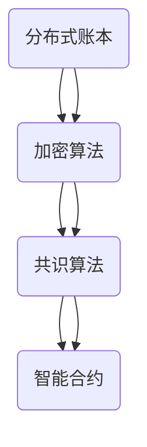

                 

### 文章标题

# 区块链在食品溯源中的透明化应用

> 关键词：区块链、食品溯源、透明化、安全性、智能合约、分布式账本

> 摘要：本文深入探讨了区块链技术在食品溯源中的应用，分析了区块链如何通过其不可篡改和透明化的特性，提高食品供应链的透明度和安全性。文章首先介绍了区块链和食品溯源的基本概念，然后详细阐述了区块链在食品溯源中的应用场景、技术原理和案例分析，最后提出了区块链在食品溯源中面临的挑战及其解决方案，并对未来发展趋势进行了展望。

---

### 引言

#### 区块链技术的背景与发展

区块链技术是一种分布式数据库技术，其核心特点是数据的不可篡改性和透明性。区块链的起源可以追溯到2008年，当时一位名为中本聪的匿名人物发表了比特币的白皮书，提出了区块链的概念。随着比特币的成功，区块链技术逐渐受到关注，并在金融、医疗、供应链等多个领域得到了广泛应用。

区块链的基本原理是通过加密算法和分布式网络技术，将数据分散存储在多个节点上，形成一个不可篡改的分布式账本。每个区块包含一定数量的交易信息，并通过密码学方法与前面的区块链接起来，形成一个链式结构。

#### 食品溯源的重要性与现状

食品溯源是指通过记录食品生产、加工、运输等环节的信息，实现对食品来源的追踪和验证。食品安全问题频发，使得食品溯源的重要性日益凸显。消费者对食品的安全性和质量有更高的要求，而企业则需要通过溯源系统来增强消费者信任，提高市场竞争力。

目前，食品溯源主要依赖于传统的数据库技术和条码扫描系统，但这些方法存在数据篡改风险、信息孤岛和透明度不足等问题。区块链技术的出现为解决这些问题提供了一种新的思路。

#### 研究目的与内容概述

本文旨在探讨区块链技术在食品溯源中的应用，通过分析区块链在食品溯源中的具体实践和案例，揭示其如何提高食品供应链的透明度和安全性。本文将分为以下几个部分：

1. **区块链技术基础**：介绍区块链的基本原理和关键技术。
2. **食品溯源中的区块链应用**：分析区块链在食品溯源中的应用场景和具体实践。
3. **食品安全透明化**：探讨区块链如何提升食品安全的透明度。
4. **案例分析**：分析具体的食品溯源区块链应用案例。
5. **技术挑战与解决方案**：讨论区块链在食品溯源中面临的技术挑战及解决方案。
6. **未来发展趋势**：预测区块链在食品溯源领域的发展趋势。
7. **总结与展望**：对全书内容进行总结，并对未来研究方向进行展望。

### 区块链技术基础

#### 区块链的基本原理

区块链的基本原理包括以下几个关键部分：

1. **分布式账本**：区块链的核心是分布式账本技术，它将数据分散存储在多个节点上，每个节点都保存完整的账本副本。这种分布式结构保证了数据的安全性和不可篡改性。
   
2. **加密算法**：区块链使用各种加密算法来保护数据的隐私和安全。常用的加密算法包括哈希函数、非对称加密和数字签名等。

3. **共识算法**：共识算法是区块链节点之间达成一致的关键机制。常见的共识算法包括工作量证明（PoW）、权益证明（PoS）和委托权益证明（DPoS）等。

4. **智能合约**：智能合约是区块链上的一种自执行合约，它通过代码定义了一组规则和条件，当条件满足时，智能合约自动执行相应的操作。

#### 区块链的关键技术

1. **分布式账本技术**：分布式账本技术使得区块链上的数据透明且不可篡改。每个节点都保存完整的账本副本，任何对数据的修改都需要所有节点的同意，从而保证了数据的真实性和一致性。

2. **加密技术**：加密技术用于保护区块链上的数据隐私和安全。通过加密算法，区块链上的数据只能在授权的情况下进行访问和解读，从而防止未授权的访问和篡改。

3. **智能合约技术**：智能合约技术使得区块链不仅用于数据的存储和传输，还可以实现自动化合约执行。智能合约通过代码定义了合同条款和执行逻辑，当触发条件满足时，智能合约自动执行，从而提高了交易的效率。

#### Mermaid流程图

以下是一个简单的Mermaid流程图，展示了区块链的基本原理和关键技术之间的关系：

### 食品溯源中的区块链应用

#### 区块链在食品溯源中的应用场景

区块链技术在食品溯源中的应用场景主要包括以下几个方面：

1. **供应链管理**：通过区块链技术，可以实现对食品从生产到消费的全过程进行追踪和管理，确保每个环节的信息透明和可追溯。

2. **质量与安全监控**：区块链技术可以记录食品生产、加工、运输等环节的关键信息，如温度、湿度、添加剂等，从而实现对食品质量和安全的监控。

3. **食品召回管理**：区块链技术可以迅速定位问题食品的来源和流向，提高食品召回的效率和准确性。

4. **消费者信息查询**：区块链技术可以提供透明的食品信息查询服务，消费者可以通过扫描二维码或输入食品条形码，查询食品的详细信息。

#### 区块链在食品溯源中的具体实践

1. **IBM Food Trust**：IBM Food Trust 是一个基于区块链的食品溯源平台，它通过将食品信息记录在区块链上，实现了从农场到超市的全程可追溯。平台上的参与方包括农场主、加工商、运输商、分销商和零售商，每个参与方都可以查看和验证食品信息。

2. **海思链**：海思链是中国的一个区块链食品溯源平台，它通过将食品信息上链，实现了食品从生产到销售的全过程可追溯。平台上的食品信息包括生产日期、产地、加工工艺、运输温度等，消费者可以通过手机APP查询食品的详细信息。

#### 区块链在食品溯源中的应用案例

1. **某大型食品公司的区块链溯源实践**：某大型食品公司通过引入区块链技术，实现了其产品的全程可追溯。从原料采购、生产加工、运输存储到终端销售，每个环节的信息都被记录在区块链上，消费者可以通过扫描产品包装上的二维码，查看产品的详细信息。

2. **某农场到餐桌项目的区块链溯源应用**：某农场到餐桌项目通过区块链技术，实现了农产品的全程追溯。农场主将农产品的生长环境、施肥情况、采摘时间等信息记录在区块链上，消费者可以通过手机APP查询农产品的详细信息，确保农产品的质量和安全。

### 食品安全透明化

#### 区块链如何提升食品安全透明度

区块链技术通过其不可篡改和透明化的特性，可以有效提升食品安全的透明度：

1. **数据不可篡改**：区块链上的数据一旦被记录，就无法被篡改。这保证了食品信息的历史真实性和完整性，消费者可以放心地查询和验证食品信息。

2. **透明信息共享**：区块链上的数据是公开透明的，所有参与方都可以查看和验证食品信息。这有助于建立信任，提高消费者对食品的信任度。

3. **智能合约自动执行**：区块链上的智能合约可以自动执行合同条款，确保食品生产和销售过程的合法性和合规性。

#### 区块链在食品安全监管中的应用

区块链技术可以应用于食品安全监管，提高监管效率和透明度：

1. **监管数据记录**：监管部门可以将监管数据记录在区块链上，确保数据真实性和可追溯性。

2. **智能合约自动监管**：通过智能合约，监管部门可以自动执行监管任务，如检查食品质量、监测食品运输条件等。

3. **透明公开**：区块链上的监管数据是公开透明的，消费者和媒体可以随时查询和监督食品安全。

### 技术挑战与解决方案

#### 数据隐私保护

区块链技术虽然保证了数据的不可篡改性和透明性，但同时也带来了数据隐私保护的问题。在食品溯源中，如何保护敏感信息成为了一个挑战。

1. **解决方案**：可以使用零知识证明（Zero-Knowledge Proof）技术，确保数据的隐私性和透明性。零知识证明允许一方在不透露任何信息的情况下，证明某个陈述是正确的。

2. **案例分析**：某区块链食品溯源平台使用了零知识证明技术，实现了数据隐私保护和透明性的平衡。平台上的消费者可以查询食品信息，但无法获取具体的个人隐私数据。

#### 系统性能优化

区块链技术在处理大量数据时，可能会面临性能瓶颈。如何优化系统性能是一个关键挑战。

1. **解决方案**：可以采用分片技术（Sharding），将区块链网络分成多个 shard，每个 shard 处理部分数据。这样可以提高系统吞吐量和处理速度。

2. **案例分析**：某区块链平台通过引入分片技术，实现了数据存储和处理的高效化，提高了系统的性能和可扩展性。

### 未来发展趋势

#### 技术进步

随着区块链技术的不断发展和成熟，未来有望出现更多的创新和突破，如量子区块链、联邦学习等，这些新技术将进一步提升区块链在食品溯源中的应用效果。

#### 政策环境

政府政策的支持对区块链技术的发展至关重要。未来，各国政府可能会出台更多鼓励区块链技术发展的政策，推动区块链在食品溯源等领域的应用。

#### 市场需求

随着消费者对食品安全要求的提高，以及企业对透明化和可信度的需求增加，区块链在食品溯源领域的市场需求将不断增长。

### 总结与展望

#### 区块链在食品溯源中的重要性

区块链技术在食品溯源中的应用具有显著的优势，如数据不可篡改、透明性高、安全性强等，可以有效提升食品供应链的透明度和安全性。

#### 技术与挑战

虽然区块链技术在食品溯源中具有巨大潜力，但也面临着数据隐私保护、系统性能优化等技术挑战。通过不断创新和改进，这些问题有望得到解决。

#### 应用前景

随着区块链技术的不断发展，其在食品溯源领域的应用前景广阔。未来，区块链有望成为食品安全保障的重要工具，为消费者提供更安全、更透明的食品信息。

#### 未来研究方向

未来的研究方向包括但不限于：

1. **隐私保护技术**：进一步研究和开发高效、安全的隐私保护技术，以解决区块链在食品溯源中的数据隐私问题。

2. **跨链技术**：研究跨链技术，实现不同区块链之间的互操作性和数据共享，提高区块链网络的效率和可扩展性。

3. **智能合约优化**：研究和开发更高效、更安全的智能合约技术，提高区块链在食品溯源中的应用效果。

### 作者信息

作者：AI天才研究院/AI Genius Institute & 禅与计算机程序设计艺术 /Zen And The Art of Computer Programming

### 附录

#### 拓展阅读

1. **《区块链：从数字货币到智能合约》**：详细介绍区块链技术的原理和应用。
2. **《食品安全溯源技术与应用》**：探讨食品安全溯源技术的发展和应用。
3. **《区块链技术指南》**：全面介绍区块链技术的各个方面，包括原理、应用和开发实践。

