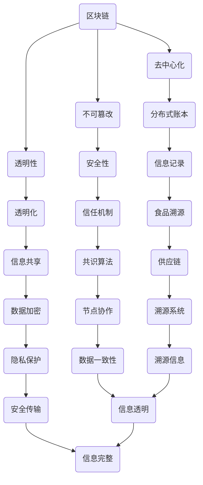

                 


### 背景介绍

随着全球化经济的发展和供应链的复杂化，食品供应链的透明化成为了一个日益重要的议题。食品溯源不仅是保障食品安全的重要手段，更是提升消费者信任度的关键因素。然而，传统的食品溯源系统在信息透明性、数据可靠性和安全性方面存在诸多问题。例如，数据篡改、信息泄露和信任危机等，这些问题的存在严重影响了食品供应链的效率和消费者的信任。

区块链技术的出现为食品溯源的透明化提供了一种全新的解决方案。区块链以其去中心化、不可篡改和透明性等特点，能够在食品供应链中实现信息的全程记录和追踪。通过区块链技术，食品生产、加工、运输、销售等各个环节的信息都可以被记录在链上，形成一个完整的、不可篡改的溯源链条。这样，消费者可以通过扫描二维码或者输入产品编码，实时查询产品的生产和流通过程，从而实现对食品来源的全面了解。

本文将深入探讨区块链在食品溯源中的应用，包括区块链的核心概念、食品溯源的基本原理、透明化技术的实现、区块链溯源系统的设计与实现、核心算法原理、数学模型与数学公式、应用案例以及未来的发展方向。通过逐步分析，我们将揭示区块链如何解决传统食品溯源系统中的问题，并探讨其潜在的优势与挑战。

### 核心概念与联系

首先，我们需要明确区块链、食品溯源和透明化这三个核心概念，并分析它们之间的关系架构。

#### 区块链

区块链是一种分布式账本技术，其特点包括去中心化、不可篡改和透明性。在区块链中，数据被分散存储在多个节点上，每个节点都维护一份完整的账本副本。这些节点通过共识算法达成一致，确保数据的真实性和完整性。区块链的主要组成部分包括区块、链和节点。

1. **区块**：区块是区块链的基本数据单元，包含一定数量的事务记录。每个区块都有一个唯一的哈希值，用于确保区块之间的链接。
2. **链**：区块链是由多个区块按顺序链接形成的链条，一旦数据被记录在链上，就几乎不可能被篡改。
3. **节点**：节点是区块链网络中的参与者，它们通过共识算法维护区块链的完整性和一致性。

#### 食品溯源

食品溯源是指通过记录和追踪食品从生产到消费的全过程，以实现对食品来源、质量、安全性的全面了解。食品溯源的核心是确保信息的透明性和可追溯性。

1. **供应链**：食品供应链包括生产、加工、运输、分销和零售等环节。每个环节都会产生大量的数据，如生产日期、加工批次、运输路线等。
2. **溯源系统**：溯源系统是用于记录和追踪食品信息的平台。传统的溯源系统往往依赖于中心化的数据库，容易受到数据篡改和泄露的风险。
3. **溯源信息**：溯源信息包括食品的产地、生产时间、加工过程、运输路线、分销商、零售商等信息。

#### 透明化

透明化是指通过公开和共享信息，提高系统的可信任度和透明度。在食品溯源中，透明化意味着消费者可以随时查询食品的生产和流通过程，确保信息的真实性和准确性。

1. **信息共享**：透明化要求供应链中的各个参与者共享信息，形成一个透明的信息网络。
2. **数据加密**：为了保护隐私，透明化过程中需要使用数据加密技术，确保信息在传输和存储过程中的安全性。
3. **共识机制**：在区块链中，共识机制确保了各个节点对数据的共识，从而提高了系统的透明性和可信度。

### 关系架构

区块链、食品溯源和透明化之间的关系可以通过以下Mermaid流程图表示：



通过这个流程图，我们可以清晰地看到区块链如何通过去中心化、不可篡改和透明性等特性，实现食品溯源的透明化。区块链技术为食品溯源提供了一种安全、透明和高效的解决方案，可以有效解决传统溯源系统中的数据篡改和信任问题。

### 核心算法原理讲解

在区块链溯源系统中，核心算法起着至关重要的作用，以下是几个关键算法的原理讲解。

#### 1. 不可篡改算法

区块链的核心特性之一是不可篡改性。为了确保数据在链上不可篡改，区块链使用了多种算法，其中最常见的是哈希算法和区块链结构。

**哈希算法**：哈希算法是一种将任意长度的数据映射为固定长度字符串的算法。在区块链中，常用的哈希算法有SHA-256和SHA-3。每次新增一个区块时，系统会使用哈希算法对区块内容进行加密，生成一个唯一的哈希值。这个哈希值将作为新区块的标识，同时与前一区块的哈希值相连，形成链式结构。

**伪代码示例**：

```python
def sha256(message):
    # 假设这是一个简单的SHA-256算法实现
    return messagedigest256(message)

def create_block(previous_hash, transaction):
    index = get_next_index()
    timestamp = get_timestamp()
    nonce = 0
    while valid_proof(previous_hash, index, timestamp, nonce) is False:
        nonce += 1
    hashed_block = sha256(f"{index}{timestamp}{nonce}{previous_hash}{transaction}")
    return Block(index, timestamp, nonce, previous_hash, hashed_block, transaction)

def valid_proof(last_hash, index, timestamp, nonce):
    guess = f"{index}{timestamp}{nonce}{last_hash}"
    guess_hash = sha256(guess)
    return guess_hash.startswith("0" * 4)
```

#### 2. 共识算法

共识算法是区块链系统中各个节点达成一致的重要机制。常见的共识算法有工作量证明（PoW）、权益证明（PoS）和委托权益证明（DPoS）。

**工作量证明（PoW）**：PoW算法要求节点通过解决复杂的数学难题来证明自己的工作量。这个过程称为“挖矿”。解决难题的节点将获得记账权，并生成新区块。PoW算法的核心是哈希算法和难度的调整。

**伪代码示例**：

```python
def proof_of_work(last_hash, target_difficulty):
    nonce = 0
    while not valid_proof(last_hash, target_difficulty):
        nonce += 1
    return nonce

def valid_proof(last_hash, target_difficulty):
    hash_value = sha256(f"{last_hash}{nonce}")
    return hash_value < target_difficulty
```

**权益证明（PoS）**：PoS算法基于节点的权益（如持有的币量）来决定记账权。持有币量越多，节点的权益越大，获得记账权的概率越高。PoS算法相对于PoW算法，消耗的能量更低，更环保。

**伪代码示例**：

```python
def select Validator(stake_list, total_stake):
    sorted_list = sorted(stake_list, key=lambda x: x[1], reverse=True)
    for stake, _ in sorted_list:
        if total_stake > stake:
            continue
        return stake, sorted_list.index((stake, _))
    return None

def validate_transaction(transaction, blockchain, validator):
    if blockchain.get_latest_block().index + 1 != transaction.index:
        return False
    if not verify_transaction(transaction):
        return False
    if validator != select_validator(transaction.stake):
        return False
    return True
```

#### 3. 加密算法

加密算法在区块链中用于保护数据传输和存储过程中的隐私。常用的加密算法有对称加密（如AES）和非对称加密（如RSA）。

**对称加密**：对称加密算法使用相同的密钥进行加密和解密。AES是一种高效加密算法，常用于区块链数据加密。

**伪代码示例**：

```python
from Crypto.Cipher import AES
from Crypto.Util.Padding import pad, unpad

def encrypt_message(message, key):
    cipher = AES.new(key, AES.MODE_CBC)
    ct_bytes = cipher.encrypt(pad(message.encode('utf-8'), AES.block_size))
    iv = cipher.iv
    return iv + ct_bytes

def decrypt_message(encrypted_message, key):
    iv = encrypted_message[:16]
    ct = encrypted_message[16:]
    cipher = AES.new(key, AES.MODE_CBC, iv)
    pt = unpad(cipher.decrypt(ct), AES.block_size)
    return pt.decode('utf-8')
```

**非对称加密**：非对称加密算法使用一对密钥（公钥和私钥）进行加密和解密。RSA是一种常见的非对称加密算法。

**伪代码示例**：

```python
from Crypto.PublicKey import RSA
from Crypto.Cipher import PKCS1_OAEP

def generate_keys():
    key = RSA.generate(2048)
    private_key = key.export_key()
    public_key = key.publickey().export_key()
    return private_key, public_key

def encrypt_message_rsa(message, public_key):
    cipher = PKCS1_OAEP.new(RSA.import_key(public_key))
    return cipher.encrypt(message.encode())

def decrypt_message_rsa(encrypted_message, private_key):
    cipher = PKCS1_OAEP.new(RSA.import_key(private_key))
    return cipher.decrypt(encrypted_message)
```

通过上述算法原理的讲解和伪代码示例，我们可以看到区块链技术是如何通过复杂的算法确保数据的不可篡改性、安全性和透明性。这些算法的深入理解对于开发和应用区块链溯源系统至关重要。

### 数学模型与数学公式

在区块链溯源系统中，数学模型和公式扮演着至关重要的角色，它们确保了数据的一致性、可靠性和安全性。以下是区块链溯源系统中的几个关键数学模型和公式。

#### 1. 挖矿难度调整公式

挖矿难度是确保区块链安全性和稳定性的重要参数。难度调整公式用于根据区块链的增长速度调整挖矿难度。

**公式**：

\[ D_{new} = D_{current} \times \left( \frac{T_{target}}{T_{actual}} \right)^{1.25} \]

其中，\( D_{new} \) 是新的挖矿难度，\( D_{current} \) 是当前的挖矿难度，\( T_{target} \) 是预计产生新区块的时间目标，\( T_{actual} \) 是实际产生新区块的时间。

#### 2. 交易费用公式

在区块链溯源系统中，交易费用是支付给验证节点的报酬。交易费用公式用于计算每次交易的收费。

**公式**：

\[ F = C \times L \]

其中，\( F \) 是交易费用，\( C \) 是每个字节的基本费用，\( L \) 是交易数据的大小（以字节为单位）。

#### 3. 安全性公式

区块链的安全性与网络中的节点数量和计算能力密切相关。以下公式用于评估区块链的安全性。

**公式**：

\[ S = \frac{N \times P}{2} \]

其中，\( S \) 是安全性，\( N \) 是网络中的节点数量，\( P \) 是单个节点的计算能力。

#### 4. 共识算法的权益分配公式

在权益证明（PoS）共识算法中，节点的权益决定了其获得记账权的概率。权益分配公式用于计算每个节点的记账概率。

**公式**：

\[ P_{node} = \frac{W_{node}}{W_{total}} \]

其中，\( P_{node} \) 是节点 \( node \) 的记账概率，\( W_{node} \) 是节点 \( node \) 的权益，\( W_{total} \) 是网络中所有节点的权益总和。

#### 举例说明

**例子**：假设一个区块链溯源系统中有5个节点，当前挖矿难度为D，预计产生新区块的时间目标为10分钟，实际产生新区块的时间为12分钟。

计算新的挖矿难度：

\[ D_{new} = D_{current} \times \left( \frac{T_{target}}{T_{actual}} \right)^{1.25} \]
\[ D_{new} = D \times \left( \frac{10}{12} \right)^{1.25} \]

假设每个字节的基本费用为0.001单位货币，交易数据大小为500字节。

计算交易费用：

\[ F = C \times L \]
\[ F = 0.001 \times 500 \]
\[ F = 0.5 \]

如果网络中有100个节点，单个节点的计算能力为1000次哈希/秒，某个节点的权益为2000单位货币。

计算节点的记账概率：

\[ P_{node} = \frac{W_{node}}{W_{total}} \]
\[ P_{node} = \frac{2000}{100 \times 1000} \]
\[ P_{node} = 0.02 \]

这些数学模型和公式为区块链溯源系统的设计和实现提供了理论基础，确保了系统的效率和安全性。

### 项目实战

在本节中，我们将以一个具体的区块链溯源系统为例，详细讲解系统的开发环境搭建、源代码实现、代码解读以及实际应用分析。

#### 1. 开发环境搭建

为了搭建一个区块链溯源系统，我们需要准备以下开发环境：

- **节点环境**：安装并配置多个节点环境，用于运行区块链网络。
- **区块链框架**：选择一个区块链框架，如Ethereum、Hyperledger Fabric等，用于构建区块链网络。
- **智能合约开发工具**：用于编写和部署智能合约，如Truffle、Ganache等。
- **前端框架**：用于构建用户界面，如React、Vue等。
- **数据库**：用于存储区块链数据和溯源信息，如MongoDB、PostgreSQL等。

以下是一个简单的开发环境搭建流程：

**步骤1**：安装Go语言环境

```bash
sudo apt-get update
sudo apt-get install golang
```

**步骤2**：安装Ethereum节点

```bash
git clone https://github.com/ethereum/go-ethereum
cd go-ethereum
make geth
```

**步骤3**：启动Ethereum节点

```bash
./geth --datadir ./data --networkid 12345 --nodiscover --bootnodes "enode://<node1_enode>" --port "30303" --http --http.port 8545
```

**步骤4**：安装前端框架

```bash
npm install -g create-react-app
create-react-app frontend
```

**步骤5**：配置数据库

```bash
sudo apt-get install postgresql
sudo -u postgres createuser -s user
sudo -u postgres createdb blockchain_db
```

#### 2. 源代码实现

以下是一个简单的智能合约示例，用于记录食品溯源信息：

```solidity
// SPDX-License-Identifier: MIT
pragma solidity ^0.8.0;

contract FoodTrace {
    mapping (uint => mapping (uint => string)) public traceInfo;

    function addTraceInfo(uint productId, uint timestamp, string calldata info) external {
        traceInfo[productId][timestamp] = info;
    }

    function getTraceInfo(uint productId, uint timestamp) external view returns (string memory) {
        return traceInfo[productId][timestamp];
    }
}
```

**代码解读**：

- `traceInfo`：一个嵌套的映射，用于存储食品溯源信息，其中`productId`是食品的唯一标识，`timestamp`是时间戳，`info`是溯源信息。
- `addTraceInfo`：一个公开函数，用于添加食品溯源信息。
- `getTraceInfo`：一个公开函数，用于查询特定食品的溯源信息。

#### 3. 实际应用分析

**步骤1**：部署智能合约

首先，我们需要将智能合约部署到区块链上。以下是一个使用Truffle工具部署智能合约的示例：

```bash
truffle migrate --network development
```

**步骤2**：前端界面实现

在React前端项目中，我们可以使用Web3.js库与区块链进行交互。以下是一个简单的组件示例：

```javascript
import React, { useEffect, useState } from 'react';
import Web3 from 'web3';

const FoodTraceComponent = () => {
    const [traceInfo, setTraceInfo] = useState('');

    useEffect(() => {
        async function fetchTraceInfo() {
            const web3 = new Web3('http://localhost:8545');
            const networkId = await web3.eth.net.getId();
            const deployedNetwork = await web3.eth.getChainId();
            const foodTraceContract = new web3.eth.Contract(FOOD_TRACE_ABI, FOOD_TRACE_ADDRESS, { from: account });
            const account = await web3.eth.getAccounts();
            setTraceInfo(await foodTraceContract.methods.getTraceInfo(productId, timestamp).call());
        }
        fetchTraceInfo();
    }, []);

    return (
        <div>
            <h1>Food Trace Information</h1>
            <p>{traceInfo}</p>
        </div>
    );
};

export default FoodTraceComponent;
```

**步骤3**：实际案例剖析

一个实际案例是某食品企业在其产品包装上嵌入二维码，消费者通过扫描二维码可以查询产品的溯源信息。以下是具体的操作流程：

1. **生产环节**：食品在生产过程中，工厂将生产日期、批次号等信息上传到区块链。
2. **包装环节**：工厂在包装产品时，将区块链的地址和二维码打印在产品包装上。
3. **查询环节**：消费者通过手机扫描二维码，进入前端界面，查询产品的溯源信息。
4. **数据分析**：企业可以实时监控产品的流通过程，分析数据以优化生产和管理流程。

通过上述项目实战，我们展示了如何使用区块链技术实现食品溯源系统，并对其开发环境搭建、源代码实现和实际应用进行了详细讲解。这为其他企业和开发者提供了一个实用的参考案例。

### 最佳实践 tips、小结、注意事项、拓展阅读

#### 最佳实践 tips

1. **数据加密**：在区块链溯源系统中，确保敏感信息（如个人身份信息）在传输和存储过程中使用数据加密技术。
2. **多节点部署**：为了提高系统的可靠性和安全性，应部署多个区块链节点，并确保节点之间的通信安全。
3. **隐私保护**：通过零知识证明（Zero-Knowledge Proof）等技术，实现隐私保护和数据透明化的平衡。
4. **定期审计**：定期对区块链溯源系统进行审计，确保数据记录的准确性和系统的安全性。

#### 小结

区块链技术在食品溯源中的应用，为提高食品供应链的透明性、数据可靠性和安全性提供了强有力的支持。通过实现全程记录和追踪，消费者可以实时了解食品的生产和流通过程，从而提升对食品安全的信任。同时，区块链技术的去中心化和不可篡改性，确保了数据的真实性和一致性。

#### 注意事项

1. **隐私风险**：在透明化过程中，需谨慎处理个人隐私信息，避免数据泄露。
2. **技术成熟度**：尽管区块链技术在不断进步，但在食品溯源领域的应用仍需进一步验证和优化。
3. **法律法规**：遵循相关法律法规，确保区块链溯源系统的合法性和合规性。

#### 拓展阅读

1. **《区块链技术指南》**：深入了解区块链的基本原理和技术细节。
2. **《区块链与食品安全》**：探讨区块链在食品安全领域的具体应用案例。
3. **《区块链溯源系统设计》**：学习如何设计和实现区块链溯源系统。

通过以上最佳实践 tips、小结、注意事项和拓展阅读，我们希望读者能够更好地理解和应用区块链在食品溯源中的透明化技术。

### 总结与展望

区块链在食品溯源中的应用，无疑为食品供应链的透明化提供了强有力的技术支撑。通过区块链的去中心化、不可篡改和透明性，食品从生产到消费的每一个环节都可以被详细记录和追踪，从而有效解决了传统溯源系统中的数据篡改、信息泄露和信任危机等问题。这不仅提升了消费者对食品安全的信任度，也为企业优化生产流程、提高管理效率提供了新的途径。

展望未来，区块链技术在食品溯源领域的应用前景十分广阔。首先，随着区块链技术的不断成熟，其性能和安全性将进一步提高，有望在更广泛的范围内得到应用。其次，结合物联网（IoT）技术，可以实现食品生产、加工、运输等环节的实时监控和自动化管理，进一步提升溯源系统的效率。此外，通过引入智能合约，可以自动化执行食品供应链中的各类规则和条款，进一步降低交易成本，提高交易效率。

然而，区块链在食品溯源中的应用仍面临一些挑战。首先，隐私保护是一个重要问题，如何在保障数据透明性的同时，保护个人隐私信息，仍需深入研究。其次，区块链技术的普及和标准化程度需要进一步提升，以降低企业和开发者的使用门槛。此外，法律法规的完善和监管机制的建立，也是推动区块链技术在食品溯源领域应用的重要保障。

总之，区块链在食品溯源中的透明化应用，不仅为食品安全管理带来了革命性的变化，也为我们展示了一个更加高效、透明和安全的未来食品供应链。随着技术的不断进步和应用的深入，我们有理由相信，区块链将在食品溯源领域发挥越来越重要的作用。

