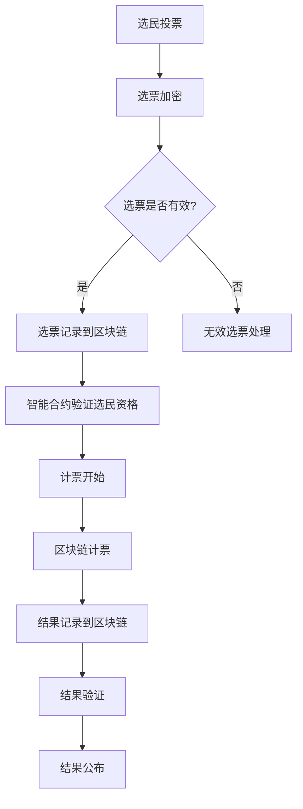

                 

### 文章标题：区块链技术在数字选举系统中的应用

> 关键词：区块链，数字选举，安全，透明，去中心化，智能合约

> 摘要：本文旨在探讨区块链技术在数字选举系统中的应用，分析其在提升选举过程透明性、安全性以及去中心化方面的优势。通过对区块链技术基本原理的阐述，以及数字选举系统面临的挑战和需求，本文将详细解析区块链技术在投票、计票和结果验证中的具体应用，并探讨其面临的挑战与未来发展趋势。

### 引言与背景

区块链技术作为一种分布式数据库技术，自2008年由中本聪（Satoshi Nakamoto）首次提出以来，迅速在金融领域引发了广泛关注。区块链的去中心化、安全性、不可篡改性等特点使其在诸多领域具有广泛的应用前景。近年来，随着数字技术的发展，区块链技术在数字选举系统中的应用逐渐成为研究热点。

数字选举系统是指利用计算机技术和互联网平台，实现选举过程电子化、自动化的一种新型选举模式。相较于传统选举方式，数字选举系统具有效率高、成本低、易于统计等优势，但也面临着安全性、隐私保护、选举欺诈等问题。

在数字选举系统中，区块链技术因其独特的特点，可以为选举过程提供透明、安全、去中心化的解决方案。本文将详细探讨区块链技术在数字选举系统中的应用，分析其在提升选举过程透明性、安全性以及去中心化方面的优势。

### 区块链技术概述

#### 区块链的基本原理

区块链是一种分布式数据库技术，其核心思想是去中心化。区块链通过多个节点共同维护一个共享的账本，账本中的数据以区块的形式存储。每个区块都包含一定数量的交易记录，区块之间通过加密算法和时间戳进行链接，形成一条不可篡改的区块链。

区块链的基本原理包括以下三个方面：

1. **分布式存储**：区块链的数据存储在多个节点上，每个节点都拥有完整的账本副本。这种分布式存储方式使得数据不会被单一节点控制，提高了系统的安全性。
2. **加密算法**：区块链使用加密算法来保护数据的完整性和隐私。通过哈希函数和数字签名技术，区块链可以确保数据的不可篡改性和身份验证。
3. **共识算法**：区块链通过共识算法来达成节点之间的共识。常见的共识算法包括工作量证明（Proof of Work，PoW）、权益证明（Proof of Stake，PoS）等。

#### 区块链的组成部分

区块链主要由以下四个组成部分构成：

1. **区块**：区块是区块链的基本单元，包含一定数量的交易记录。每个区块都有一个唯一的标识，通过时间戳和前一个区块的哈希值进行链接。
2. **链**：链是由多个区块按照一定顺序链接而成的数据结构。区块链的长度反映了区块链的发展历史。
3. **节点**：节点是区块链网络中的参与方，可以是个人、组织或计算机。节点通过参与共识算法来维护区块链的完整性。
4. **智能合约**：智能合约是区块链上的可编程合约，可以在满足特定条件时自动执行。智能合约使得区块链可以应用于各种场景，如数字选举、金融交易等。

#### 区块链技术的优势

区块链技术具有以下优势：

1. **去中心化**：区块链的去中心化特性使其不受单一机构或个人控制，提高了系统的透明性和抗攻击能力。
2. **安全性**：区块链使用加密算法保护数据，确保数据的完整性和隐私。此外，区块链的共识算法使得攻击者难以篡改数据。
3. **不可篡改性**：区块链的数据一旦写入，便不可篡改。这保证了区块链记录的数据的真实性和可靠性。
4. **透明性**：区块链上的数据是公开透明的，所有节点都可以访问和验证数据。这提高了系统的透明度和可信度。
5. **自动化**：智能合约使得区块链上的交易和流程可以自动化执行，提高了效率。

### 数字选举系统简介

#### 传统选举系统的挑战

传统选举系统在实施过程中面临诸多挑战：

1. **效率低**：传统选举需要大量的人力和物力投入，投票和计票过程耗时较长。
2. **安全性差**：传统选举系统易受到黑客攻击，选举结果可能被篡改。
3. **选举欺诈**：传统选举过程中存在选举欺诈的风险，如选票伪造、舞弊等。
4. **透明性低**：传统选举系统的过程不透明，公众难以验证选举结果的公正性。

#### 数字选举系统的需求

为了解决传统选举系统的挑战，数字选举系统应具备以下需求：

1. **高效率**：数字选举系统应能够快速、准确地处理大量投票数据。
2. **安全性**：数字选举系统应具备强大的安全防护能力，防止黑客攻击和选举欺诈。
3. **透明性**：数字选举系统应实现数据公开透明，确保选举结果的公正性和可信度。
4. **去中心化**：数字选举系统应具备去中心化特性，避免单一机构或个人控制选举过程。

#### 数字选举系统的目标

数字选举系统的目标包括：

1. **简化流程**：通过数字化手段简化选举流程，提高选举效率。
2. **提高公正性**：通过透明、安全的手段提高选举结果的公正性。
3. **增强参与度**：通过便捷的投票方式，提高公民的选举参与度。
4. **降低成本**：通过数字化手段降低选举系统的建设和维护成本。

### 区块链在数字选举中的应用背景

#### 区块链技术对选举的影响

区块链技术对数字选举系统具有深远的影响，主要体现在以下几个方面：

1. **提高透明性**：区块链技术的透明性使得选举过程和结果对所有参与者公开可见，从而提高了选举的透明度和可信度。
2. **增强安全性**：区块链技术的加密算法和共识算法确保了选举数据的安全性和完整性，有效防止黑客攻击和选举欺诈。
3. **去中心化**：区块链技术的去中心化特性使得选举过程不再依赖于单一机构或个人，从而避免了权力集中和腐败的风险。
4. **自动化**：区块链技术可以通过智能合约实现选举过程的自动化，提高选举效率和准确性。

#### 区块链在选举中的潜在应用场景

区块链技术可以在以下选举场景中发挥重要作用：

1. **投票过程**：区块链可以记录和验证每个选民的投票，确保选票的真实性和唯一性。
2. **计票过程**：区块链可以自动、透明地计票，防止人为篡改选举结果。
3. **选举结果验证**：区块链可以提供选举结果的不可篡改性和可验证性，提高选举结果的公信力。
4. **选举数据管理**：区块链可以存储和管理选举数据，确保数据的长期保存和安全性。

#### 区块链在数字选举中的优势

区块链技术为数字选举系统带来了以下优势：

1. **高安全性**：区块链的加密算法和共识算法确保了选举数据的安全性和完整性。
2. **透明性**：区块链的数据公开透明，所有参与者可以随时查询和验证选举数据。
3. **去中心化**：区块链的去中心化特性避免了权力集中和腐败的风险。
4. **高效性**：区块链的自动化特性提高了选举效率和准确性。
5. **不可篡改性**：区块链的数据一旦写入，便不可篡改，保证了选举结果的真实性和可靠性。

### 核心概念与联系

#### 区块链与数字选举的联系

区块链技术与数字选举系统的结合，旨在解决数字选举过程中存在的安全性、透明性和去中心化等问题。区块链技术通过以下几个方面与数字选举系统建立紧密联系：

1. **投票记录**：区块链可以记录每个选民的投票信息，确保投票的唯一性和真实性。
2. **计票过程**：区块链可以自动、透明地计算选票，防止人为篡改选举结果。
3. **结果验证**：区块链可以提供选举结果的不可篡改性和可验证性，提高选举结果的公信力。
4. **数据管理**：区块链可以存储和管理选举数据，确保数据的长期保存和安全性。

#### 区块链技术在数字选举系统中的应用

区块链技术可以在数字选举系统中发挥以下作用：

1. **投票过程**：区块链技术可以用于记录和验证选民的投票，确保选票的真实性和唯一性。具体实现可以通过以下方式：
   - **选票加密**：选民在投票时，对选票进行加密处理，确保选票在传输和存储过程中的安全性。
   - **分布式记录**：选票数据被分散记录在区块链网络中的多个节点上，防止单一节点篡改选票。
   - **智能合约**：使用智能合约自动验证选票的有效性，确保每个选民只能投一次票。

2. **计票过程**：区块链技术可以自动、透明地计算选票，防止人为篡改选举结果。具体实现可以通过以下方式：
   - **区块链账本**：将所有选票记录在区块链的账本上，每个区块都包含一定数量的选票数据。
   - **共识算法**：区块链网络中的节点通过共识算法对选票进行统计和验证，确保计票过程的透明性和公正性。
   - **智能合约**：智能合约在满足特定条件时自动执行，如选民资格验证、计票等。

3. **结果验证**：区块链技术可以提供选举结果的不可篡改性和可验证性，提高选举结果的公信力。具体实现可以通过以下方式：
   - **区块链数据查询**：任何人都可以通过区块链的公共节点查询选举结果，确保结果的真实性。
   - **数字签名**：使用数字签名技术确保区块链数据的真实性和完整性。
   - **智能合约**：智能合约可以自动执行选举结果的验证过程，确保结果的公正性和可信度。

#### 区块链与数字选举的关系架构 Mermaid 流程图

下面是一个简单的 Mermaid 流程图，展示了区块链在数字选举系统中的应用架构：



在这个流程图中，选民投票、选票加密、选票记录到区块链、智能合约验证选民资格、计票开始、区块链计票、结果记录到区块链、结果验证和结果公布等步骤共同构成了一个完整的区块链数字选举系统。

### 核心算法原理讲解

#### 共识算法

共识算法是区块链技术的核心组成部分，用于确保区块链网络中的所有节点能够达成共识。共识算法决定了区块链的扩展性、安全性和去中心化程度。以下是一些常见的共识算法：

1. **工作量证明（Proof of Work，PoW）**：
   - **原理**：节点通过解决复杂的数学问题来竞争记账权，首先解决问题的节点将获得记账权并生成新的区块。
   - **优点**：保证了区块链的安全性，去中心化程度高。
   - **缺点**：计算资源消耗大，效率低。

2. **权益证明（Proof of Stake，PoS）**：
   - **原理**：根据节点持有的代币数量和质押金额来决定记账权，持有代币数量越多、质押金额越高的节点优先记账。
   - **优点**：相比 PoW，资源消耗更低，效率更高。
   - **缺点**：可能导致富者愈富，去中心化程度较低。

3. **委托权益证明（Delegated Proof of Stake，DPoS）**：
   - **原理**：节点通过投票选举出代表，代表负责记账，持币量大的节点更容易被选为代表。
   - **优点**：记账速度快，效率高，去中心化程度适中。
   - **缺点**：选举过程可能导致权力集中。

4. **实用拜占庭容错算法（Practical Byzantine Fault Tolerance，PBFT）**：
   - **原理**：基于 Byzantine General's Problem 的解决方案，确保即使部分节点失效，系统仍能正常运行。
   - **优点**：安全性高，去中心化程度高，效率高。
   - **缺点**：需要较大的系统信任，不适合完全去中心化的系统。

伪代码示例：

```python
# 工作量证明（PoW）算法伪代码

def proof_of_work(target_difficulty):
    while not valid_proof(target_difficulty):
        nonce = generate_nonce()
        new_proof = calculate_new_proof(nonce, previous_proof)
        if valid_proof(target_difficulty):
            return nonce, new_proof

def valid_proof(target_difficulty, nonce, previous_proof):
    hash_result = hash_function(nonce, previous_proof)
    return hash_result.startswith('0' * target_difficulty)

def calculate_new_proof(nonce, previous_proof):
    return previous_proof + nonce
```

#### 加密算法

加密算法是区块链技术的重要组成部分，用于保护区块链网络中的数据传输和存储。以下是一些常见的加密算法：

1. **哈希算法（Hash Function）**：
   - **原理**：将任意长度的输入数据转换成固定长度的哈希值。
   - **优点**：不可逆、固定长度、抗碰撞性好。
   - **缺点**：无法反向推导原始数据。

2. **非对称加密（Asymmetric Encryption）**：
   - **原理**：使用一对密钥（公钥和私钥）进行加密和解密，公钥加密，私钥解密。
   - **优点**：安全性高、身份验证能力强。
   - **缺点**：计算复杂度高、加密解密速度慢。

3. **对称加密（Symmetric Encryption）**：
   - **原理**：使用同一密钥进行加密和解密。
   - **优点**：加密解密速度快、计算复杂度低。
   - **缺点**：密钥管理复杂、安全性相对较低。

伪代码示例：

```python
# 非对称加密（RSA）算法伪代码

from Crypto.PublicKey import RSA
from Crypto.Cipher import PKCS1_OAEP

def generate_keys():
    key = RSA.generate(2048)
    private_key = key.export_key()
    public_key = key.publickey().export_key()
    return private_key, public_key

def encrypt_message(public_key, message):
    cipher = PKCS1_OAEP.new(public_key)
    encrypted_message = cipher.encrypt(message)
    return encrypted_message

def decrypt_message(private_key, encrypted_message):
    cipher = PKCS1_OAEP.new(private_key)
    decrypted_message = cipher.decrypt(encrypted_message)
    return decrypted_message
```

#### 智能合约编写基础

智能合约是区块链上的一种可编程合约，用于自动化执行特定的操作。智能合约的编写基础主要包括以下内容：

1. **智能合约编程语言**：
   - **Solidity**：目前最流行的智能合约编程语言，用于编写以太坊上的智能合约。
   - **Vyper**：用于编写以太坊上的智能合约，相较于 Solidity 更为简洁和易读。

2. **智能合约结构**：
   - **合约声明**：定义合约的名称、版本和作者等信息。
   - **变量声明**：定义合约中的变量，包括状态变量和局部变量。
   - **函数声明**：定义合约中的函数，包括构造函数和公共函数。

3. **事件声明**：定义合约中可触发的事件，用于通知合约外的监听器。

伪代码示例（Solidity）：

```solidity
pragma solidity ^0.8.0;

contract Election {
    address public owner;
    mapping (address => bool) public voters;
    uint public candidateCount;
    mapping (uint => Candidate) public candidates;

    event votedFor(uint indexed candidateId);

    struct Candidate {
        uint id;
        string name;
        uint voteCount;
    }

    constructor() {
        owner = msg.sender;
    }

    function addCandidate(string memory _name) public {
        require(msg.sender == owner);
        require(candidates.length < 10);
        uint id = candidates.length;
        candidates[id] = Candidate(id, _name, 0);
        candidateCount++;
    }

    function vote(uint _candidateId) public {
        require(!voters[msg.sender]);
        require(_candidateId > 0 && _candidateId <= candidateCount);
        voters[msg.sender] = true;
        candidates[_candidateId].voteCount++;
        emit votedFor(_candidateId);
    }
}
```

### 应用案例

#### 某国数字选举系统的实践

近年来，某国政府开始尝试将区块链技术应用于数字选举系统。该系统的目标是通过区块链技术提高选举过程的透明性和安全性，减少选举欺诈和舞弊。

该数字选举系统的工作流程如下：

1. **选民注册**：选民在系统中注册，并生成唯一身份标识（如数字身份证书）。
2. **选票生成**：选民在投票时，系统使用区块链技术生成加密选票，并存储在区块链上。
3. **选票记录**：选票被记录在区块链上，所有节点都可以验证选票的真实性和唯一性。
4. **计票过程**：选票被自动计算，并记录在区块链上。
5. **结果公布**：选举结果通过区块链公开，任何人都可以查询和验证结果。

该数字选举系统在实践中取得了显著效果，选民对选举的信任度明显提高，选举欺诈和舞弊事件大幅减少。

#### 某地区区块链投票实验

某地区政府开展了区块链投票实验，旨在验证区块链技术在选举中的应用效果。该实验的流程如下：

1. **选民注册**：选民在实验平台上注册，并生成唯一数字身份。
2. **投票过程**：选民通过区块链平台进行投票，选票被加密并记录在区块链上。
3. **计票过程**：选票数据被自动计算，并记录在区块链上。
4. **结果验证**：实验参与者可以随时查询和验证选举结果，确保结果的公正性和可信度。

该实验结果表明，区块链技术在提高选举透明性、安全性和去中心化方面具有显著优势，为数字选举系统提供了可行的解决方案。

### 案例分析与启示

#### 成功因素

1. **技术成熟度**：区块链技术在近年来得到了快速发展，技术成熟度较高，能够满足数字选举系统的需求。
2. **政策支持**：政府政策支持为区块链技术在选举中的应用提供了有力保障。
3. **公众信任**：通过提高选举过程的透明性和安全性，区块链技术增强了公众对选举的信任。

#### 面临的挑战

1. **技术门槛**：区块链技术的应用需要较高的技术门槛，对参与者的技术能力要求较高。
2. **系统稳定性**：区块链系统需要确保高稳定性，以应对高并发访问和潜在的网络攻击。
3. **法律法规**：法律法规的完善程度会影响区块链技术在选举中的应用，需要政府制定相应的法律法规。

#### 对未来选举的启示

1. **技术升级**：随着区块链技术的不断发展，未来选举系统需要不断升级，以应对新的挑战。
2. **公众参与**：提高公众对区块链技术的认知和信任，鼓励公众参与数字选举系统的建设和管理。
3. **跨部门合作**：政府各部门需要加强合作，共同推动区块链技术在选举中的应用，提高选举效率和公正性。

### 安全性与挑战

#### 区块链技术在数字选举中的安全性分析

区块链技术为数字选举系统提供了高度的安全性，主要体现在以下几个方面：

1. **数据安全性**：区块链采用加密算法保护数据，确保数据在传输和存储过程中的安全性。
2. **系统安全性**：区块链网络通过共识算法确保系统的稳定性，防止恶意攻击和数据篡改。
3. **身份验证**：区块链技术可以实现有效的身份验证，确保选民身份的真实性和唯一性。
4. **透明性**：区块链上的数据公开透明，所有参与者都可以查询和验证数据，提高了系统的可信度。

#### 数字选举中面临的安全挑战

尽管区块链技术为数字选举系统提供了较高的安全性，但在实际应用过程中仍面临以下安全挑战：

1. **拒绝服务攻击（DDoS）**：攻击者通过大量无效请求占用系统资源，导致系统无法正常响应合法请求。
2. **51%攻击**：攻击者控制区块链网络中超过50%的算力，从而篡改数据或拒绝验证合法交易。
3. **选举欺诈**：攻击者通过伪造选票、篡改选举结果等手段进行欺诈。
4. **隐私泄露**：区块链上的数据是公开的，存在隐私泄露的风险。

#### 解决方案与建议

针对数字选举中面临的安全挑战，以下是一些可能的解决方案和建议：

1. **防御DDoS攻击**：采用分布式拒绝服务防御（DDoS Protection）技术，如流量清洗、黑洞路由等，确保系统稳定运行。
2. **防范51%攻击**：采用权益证明（PoS）等安全的共识算法，降低攻击成本和风险。
3. **防止选举欺诈**：使用多重身份验证和加密技术，确保选民身份的真实性和唯一性。
4. **保护隐私**：采用零知识证明（Zero-Knowledge Proof）等技术，实现数据的隐私保护。

### 未来趋势

#### 区块链技术在数字选举中的未来发展

随着区块链技术的不断发展，未来数字选举系统将呈现以下发展趋势：

1. **技术升级**：区块链技术将持续升级，提供更高效、更安全的解决方案，满足数字选举系统的需求。
2. **跨领域应用**：区块链技术在金融、医疗、物流等领域的成功应用将推动其在数字选举系统中的广泛应用。
3. **监管政策**：政府将加强对区块链技术的监管，制定相关法律法规，规范数字选举系统的建设和管理。

#### 数字选举系统的优化方向

未来数字选举系统可以从以下几个方面进行优化：

1. **用户体验**：优化用户界面和交互设计，提高用户友好性和易用性。
2. **系统效率**：提高区块链网络的传输速度和处理能力，确保系统的高效运行。
3. **应用场景扩展**：探索区块链技术在选举以外的其他应用场景，如公民身份验证、社会福利发放等。

#### 区块链技术对民主制度的影响

区块链技术在数字选举中的应用将对民主制度产生深远影响：

1. **透明度和可信度**：区块链技术的透明性提高了选举过程的公开性和可信度，增强了公众对选举的信任。
2. **公民参与**：区块链技术的便捷性和安全性鼓励公民参与选举，提高民主制度的参与度。
3. **社会治理**：区块链技术的应用将促进社会治理的透明化和高效化，提高政府的服务质量和公信力。

### 结论

区块链技术在数字选举系统中的应用具有巨大的潜力，能够提升选举过程的透明性、安全性和去中心化程度。然而，在实际应用过程中，仍面临诸多挑战，需要不断完善和优化。随着区块链技术的不断发展，我们有理由相信，区块链技术将在未来数字选举系统中发挥更为重要的作用，推动民主制度的进步和发展。

