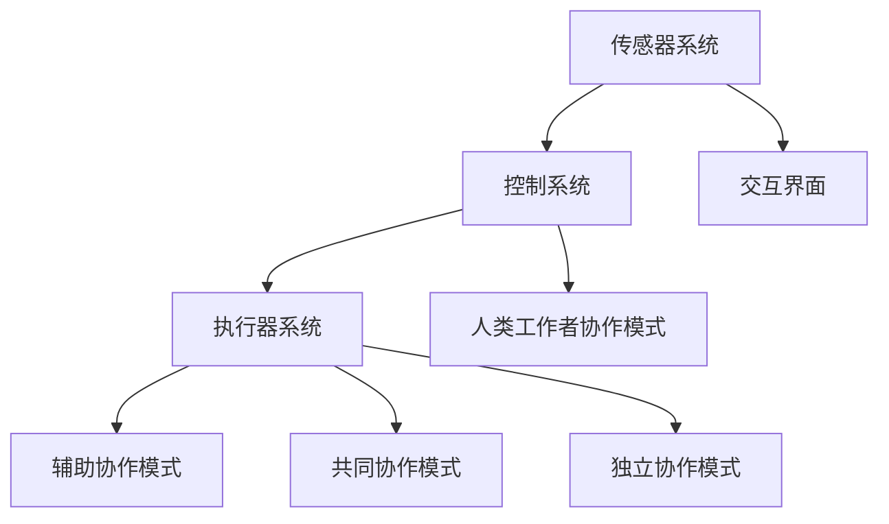

                 

# 协作机器人：多功能机器人在工作场所的普及

## 关键词
- 协作机器人
- 工作场所
- 制造业
- 物流
- 医疗
- 教育行业
- 技术挑战
- 未来趋势

## 摘要
随着科技的快速发展，协作机器人作为一种多功能、高灵活性的机器人系统，正在逐渐普及到各种工作场所。本文将详细介绍协作机器人的核心概念、架构、应用场景、技术挑战以及未来发展趋势。通过分析制造业、物流、医疗和教育行业的具体案例，我们将探讨协作机器人在这些领域的应用及其带来的变革。

### 引言

在数字化和自动化浪潮的推动下，机器人技术正迅速发展，从传统的工业机器人到现代的协作机器人，机器人的应用范围不断扩大。协作机器人（Collaborative Robots，简称Cobots）是一种专门为与人类工作者协同工作而设计的机器人。它们具有高灵活性、易于编程、安全可靠等特点，能够有效地提高工作效率、降低成本，并带来工作环境的变革。本文将围绕协作机器人的核心概念、架构、应用场景、技术挑战和未来发展趋势展开讨论，旨在为读者提供一个全面了解协作机器人及其在工作场所普及的视角。

### 协作机器人的核心概念与架构

#### 1. 定义与历史背景

协作机器人（Cobots）是指一种专门设计用于与人类共同工作、无需安全围栏的机器人。它们通常具有高度的可编程性、灵活的移动能力和先进的传感器技术，能够感知周围环境和人类工作者的位置，确保在共同工作时的安全性和效率。

协作机器人技术的发展可以追溯到20世纪80年代。早期的工业机器人主要在工厂环境中执行重复性和危险的任务，但它们与人类工作者的协作性较差，通常需要通过安全围栏进行隔离。随着机器人技术的进步，特别是感知技术和控制系统的提升，协作机器人应运而生。

#### 2. 技术核心与架构

协作机器人的技术核心包括以下几个关键组成部分：

1. **传感器系统**：传感器系统用于感知周围环境和人类工作者的位置，确保协作过程中的安全性和精确性。常见的传感器包括力觉传感器、视觉传感器、红外传感器等。

2. **控制系统**：控制系统负责协调机器人的运动和控制逻辑，确保机器人能够准确、高效地执行任务。通常，协作机器人使用嵌入式控制器或计算机进行控制，具备实时响应能力。

3. **执行器系统**：执行器系统包括电机、液压和气压系统等，用于驱动机器人的运动和执行任务。协作机器人的执行器系统通常设计为柔软和稳定，以减少对人类工作者的冲击。

4. **交互界面**：交互界面用于人类工作者与机器人之间的沟通和协作。协作机器人通常配备触摸屏、语音识别和手势控制等交互方式，方便人类工作者进行操作和指令输入。

#### 3. 协作模式

协作机器人通过以下几种模式与人类工作者进行协作：

1. **辅助协作**：协作机器人作为人类工作者的辅助工具，执行特定的任务或操作，以提高工作效率。例如，在制造过程中，协作机器人可以协助人类工作者进行组装或搬运工作。

2. **共同协作**：协作机器人和人类工作者共同参与一个任务，各自发挥各自的优势。例如，在医疗领域，协作机器人可以帮助医生进行手术，提高手术的准确性和成功率。

3. **独立协作**：协作机器人能够在没有人类工作者干预的情况下独立完成特定任务。这种模式通常用于重复性和危险的任务，如物流和清洁工作。

#### 4. 协作机器人架构的Mermaid流程图



### 协作机器人在不同工作场所的应用

#### 1. 制造业中的协作机器人

在制造业中，协作机器人已经成为提高生产效率、降低成本和确保安全的重要工具。以下是一些具体应用案例：

1. **组装与搬运**：协作机器人可以协助人类工作者进行组装操作，如电子设备的装配、汽车零部件的安装等。同时，它们还可以进行搬运工作，如将原材料或成品从一个地点搬运到另一个地点。

2. **质量检测**：协作机器人配备高精度的传感器和视觉系统，可以执行各种质量检测任务，如检测零件的尺寸、外观和表面缺陷等。

3. **包装与配送**：在包装和配送环节，协作机器人可以自动完成包装操作，并将包装好的产品搬运到仓库或配送中心。

#### 2. 物流领域的协作机器人

物流行业是协作机器人应用的重要领域之一。协作机器人可以显著提高物流效率，降低人工成本。以下是一些应用案例：

1. **仓库管理**：协作机器人可以执行仓库内部的物品分类、搬运和存储任务，如自动识别和搬运货架上的货物。

2. **运输与配送**：在运输和配送环节，协作机器人可以用于仓库内部的搬运、仓库到配送中心的运输，以及配送中心到最终用户的配送。

3. **最后一公里配送**：协作机器人可以用于最后一公里配送，如送餐机器人、快递机器人等，这些机器人可以在人行道、广场等公共区域自主行驶，将物品直接交付给用户。

#### 3. 医疗和教育行业的协作机器人

协作机器人正在逐步渗透到医疗和教育行业，带来新的应用场景和机会。

1. **医疗领域**：协作机器人可以用于手术辅助、康复训练、药物配送等任务。例如，手术机器人可以帮助医生进行精细手术操作，康复机器人可以帮助患者进行康复训练。

2. **教育领域**：协作机器人可以用于课堂教学、学生辅导、实验室教学等任务。例如，教育机器人可以协助教师进行教学演示，为学生提供个性化的学习辅导。

### 协作机器人的技术挑战与未来趋势

#### 1. 技术挑战

尽管协作机器人在工作场所的普及取得了显著进展，但仍然面临一些技术挑战：

1. **感知与交互技术**：协作机器人需要具备高度的环境感知和交互能力，以实现与人类工作者的安全、高效协作。然而，复杂的动态环境和多变的交互需求使得这一挑战变得尤为严峻。

2. **自主性与决策能力**：协作机器人需要具备自主决策能力，以应对不断变化的工作环境和任务需求。这要求机器人具备强大的算法和数据处理能力。

3. **安全性与伦理问题**：协作机器人在工作场所的普及引发了一系列安全性和伦理问题，如机器人的行为规范、隐私保护、责任归属等。

4. **系统集成与维护**：协作机器人需要与其他系统（如控制系统、传感器系统、执行器系统等）进行有效集成，确保整体系统的稳定性和可靠性。此外，协作机器人的维护和升级也是一个重要挑战。

#### 2. 未来趋势

随着技术的不断进步，协作机器人在未来有望实现更广泛的应用和发展：

1. **智能化与自主学习**：未来的协作机器人将具备更高的智能化和自主学习能力，能够通过机器学习和深度学习技术，自适应地应对复杂的工作环境和任务需求。

2. **多模态感知与交互**：协作机器人将采用多种传感器和交互方式，如视觉、听觉、触觉等，实现更丰富、更自然的交互体验。

3. **安全性与伦理合规**：随着相关法规和标准的完善，协作机器人的安全性和伦理问题将得到更好解决，进一步推动其在工作场所的普及。

4. **跨领域应用**：协作机器人的应用将不再局限于特定行业或领域，而是实现跨领域、跨行业的融合应用，为各行各业带来更多创新和机遇。

### 协作机器人的开发与维护

#### 1. 开发流程

协作机器人的开发涉及多个环节，包括需求分析、系统设计、编码实现、测试与优化等。以下是一个典型的开发流程：

1. **需求分析**：明确协作机器人的应用场景和任务需求，制定详细的开发计划。

2. **系统设计**：设计协作机器人的硬件和软件架构，包括传感器系统、控制系统、执行器系统等。

3. **编码实现**：根据系统设计，编写机器人的控制程序、传感器数据处理程序等。

4. **测试与优化**：对机器人进行功能测试、性能测试和安全测试，确保其满足需求并具备良好的稳定性。

#### 2. 维护策略

协作机器人的维护策略包括定期检查、故障诊断、升级更新等：

1. **定期检查**：定期对机器人的硬件和软件进行检查，确保其正常工作。

2. **故障诊断**：当机器人出现故障时，进行快速诊断和修复，确保机器人的持续运行。

3. **升级更新**：随着技术的进步，定期对机器人的软件和硬件进行升级更新，以保持其性能和功能的先进性。

### 案例研究

#### 1. 某制造业协作机器人应用

某制造企业引入了协作机器人，用于组装电子产品。协作机器人通过视觉传感器和力觉传感器，实现了与人类工作者的无缝协作。以下是对该案例的分析：

1. **开发环境搭建**：该企业使用了工业PC作为控制平台，配合协作机器人专用的软件开发工具，快速实现了机器人系统的开发。

2. **源代码实现与解读**：机器人的控制程序使用了C++语言，实现了对传感器数据的实时处理和机器人的运动控制。以下是一个简单的伪代码示例：

```cpp
// 伪代码：协作机器人控制程序
while (true) {
    // 读取传感器数据
    readSensorData();
    // 处理传感器数据
    processSensorData();
    // 控制机器人运动
    controlRobotMotion();
    // 等待下一个循环
    waitForNextCycle();
}
```

3. **代码应用解读与分析**：该案例中的协作机器人通过实时读取传感器数据，处理并生成控制指令，驱动电机进行运动。这种设计实现了机器人与人类工作者的实时协作，提高了生产效率和安全性。

4. **实际案例分析和详细讲解剖析**：在实际应用中，该企业的协作机器人能够有效地辅助人类工人完成组装任务，减少了人工操作的错误率，并提高了生产效率。

5. **项目小结**：通过该案例，我们可以看到协作机器人在制造业中的应用潜力。合理的开发环境和源代码实现，结合实际应用案例的分析，为其他企业的协作机器人应用提供了有益的参考。

### 总结与展望

协作机器人作为一种多功能、高灵活性的机器人系统，正逐渐普及到各种工作场所。本文详细介绍了协作机器人的核心概念、架构、应用场景、技术挑战和未来发展趋势。通过分析制造业、物流、医疗和教育行业的具体案例，我们探讨了协作机器人在这

