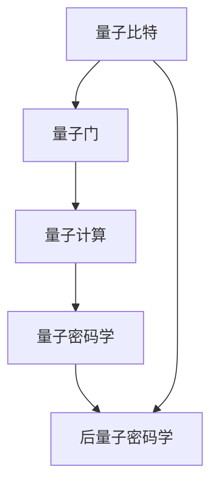

                 

### 文章标题

# 后量子密码学实施的挑战和策略

### 关键词

- 后量子密码学
- 实施挑战
- 应对策略
- 密码安全
- 量子计算

### 摘要

后量子密码学作为密码学领域的一次重大革新，以其不受量子计算攻击的特性受到了广泛关注。然而，其实施过程并非一帆风顺，面临着诸多挑战。本文旨在探讨后量子密码学的实施挑战，并提出相应的策略，以期为研究者、安全工程师和加密技术从业人员提供有益的参考。

---

## 1. 确定书的主题和目标受众

### 书名：《后量子密码学实施的挑战和策略》

### 主题

本书的主题是后量子密码学的实施过程、面临的挑战以及应对策略。后量子密码学旨在构建一套在量子计算时代仍然安全的加密体系，这一目标具有深远的意义。然而，实现这一目标并非易事，需要面对技术、网络和安全等多方面的挑战。

### 目标受众

本书的目标受众主要包括以下几类人群：

- 密码学研究者：对密码学理论和应用有兴趣的专业人士。
- 安全工程师：负责网络安全、数据保护等工作的技术人员。
- 加密技术从业人员：从事加密算法开发、实施和优化的人员。

## 2. 根据主题和目标受众，确定书的主要内容和结构

### 核心概念与联系

本书将详细介绍后量子密码学的基本概念，包括量子比特、量子门、量子纠缠等。同时，我们将通过Mermaid流程图展示核心概念之间的关系架构。

### 核心算法原理讲解

本书将深入探讨后量子密码学中的主要算法，如量子密钥分发算法（如BB84、E91、B92）和量子密码学算法（如SHA-3、AES、RSA）。每个算法的原理和实现方法将通过伪代码和具体的数学模型来详细阐述。

### 数学模型和数学公式

本书将介绍后量子密码学中的数学模型和公式，如量子态表示、量子计算等。所有数学公式将使用LaTeX格式进行表示。

### 项目实战

为了更好地理解后量子密码学的应用，本书将通过实际案例展示后量子密码学的实施过程。案例将包括量子密钥分发和量子安全通信项目，并提供详细的开发环境搭建、源代码实现和代码解读。

### 挑战与对策

本书将分析后量子密码学实施过程中面临的挑战，如技术挑战、网络挑战和安全挑战。针对这些挑战，我们将提出相应的对策。

### 展望与未来

最后，本书将探讨后量子密码学的发展趋势和未来应用前景，为读者提供对这一领域的深入理解。

### 目录结构

```markdown
# 后量子密码学实施的挑战和策略

## 1. 引言

### 1.1 后量子密码学的背景与发展趋势

### 1.2 后量子密码学的重要性

### 1.3 后量子密码学的发展历程

## 2. 基本概念与联系

### 2.1 量子比特

### 2.2 量子门

### 2.3 量子纠缠

### 2.4 Mermaid流程图展示核心概念关系架构

## 3. 核心算法原理讲解

### 3.1 量子密钥分发算法

#### 3.1.1 BB84算法

#### 3.1.2 E91算法

#### 3.1.3 B92算法

### 3.2 量子密码学算法

#### 3.2.1 SHA-3算法

#### 3.2.2 AES算法

#### 3.2.3 RSA算法

## 4. 数学模型和数学公式

### 4.1 量子态表示

#### 4.1.1 量子态的基础知识

#### 4.1.2 量子态的叠加与纠缠

### 4.2 量子计算

#### 4.2.1 量子电路

#### 4.2.2 量子算法

#### 4.2.3 量子计算的优势

## 5. 项目实战

### 5.1 量子密钥分发项目实战

#### 5.1.1 项目背景

#### 5.1.2 系统设计

#### 5.1.3 系统实现

### 5.2 量子安全通信项目实战

#### 5.2.1 项目背景

#### 5.2.2 系统设计

#### 5.2.3 系统实现

## 6. 挑战与对策

### 6.1 实施挑战分析

#### 6.1.1 技术挑战

#### 6.1.2 网络挑战

#### 6.1.3 安全挑战

### 6.2 对策探讨

#### 6.2.1 技术对策

#### 6.2.2 网络对策

#### 6.2.3 安全对策

## 7. 展望与未来

### 7.1 后量子密码学的发展趋势

#### 7.1.1 技术进展

#### 7.1.2 应用领域拓展

#### 7.1.3 未来挑战

### 7.2 后量子密码学的未来应用前景

#### 7.2.1 企业级应用

#### 7.2.2 政府与军事应用

#### 7.2.3 其他领域应用
```

## 3. 设计书的目录结构，确保逻辑清晰、内容完整

### 目录结构设计

为了确保逻辑清晰、内容完整，本书的目录结构将分为以下章节：

### 第1章：引言

- 1.1 后量子密码学的背景与发展趋势
- 1.2 后量子密码学的重要性
- 1.3 后量子密码学的发展历程

### 第2章：基本概念与联系

- 2.1 量子比特
- 2.2 量子门
- 2.3 量子纠缠
- 2.4 Mermaid流程图展示核心概念关系架构

### 第3章：核心算法原理讲解

- 3.1 量子密钥分发算法
  - 3.1.1 BB84算法
  - 3.1.2 E91算法
  - 3.1.3 B92算法
- 3.2 量子密码学算法
  - 3.2.1 SHA-3算法
  - 3.2.2 AES算法
  - 3.2.3 RSA算法

### 第4章：数学模型和数学公式

- 4.1 量子态表示
  - 4.1.1 量子态的基础知识
  - 4.1.2 量子态的叠加与纠缠
- 4.2 量子计算
  - 4.2.1 量子电路
  - 4.2.2 量子算法
  - 4.2.3 量子计算的优势

### 第5章：项目实战

- 5.1 量子密钥分发项目实战
  - 5.1.1 项目背景
  - 5.1.2 系统设计
  - 5.1.3 系统实现
- 5.2 量子安全通信项目实战
  - 5.2.1 项目背景
  - 5.2.2 系统设计
  - 5.2.3 系统实现

### 第6章：挑战与对策

- 6.1 实施挑战分析
  - 6.1.1 技术挑战
  - 6.1.2 网络挑战
  - 6.1.3 安全挑战
- 6.2 对策探讨
  - 6.2.1 技术对策
  - 6.2.2 网络对策
  - 6.2.3 安全对策

### 第7章：展望与未来

- 7.1 后量子密码学的发展趋势
  - 7.1.1 技术进展
  - 7.1.2 应用领域拓展
  - 7.1.3 未来挑战
- 7.2 后量子密码学的未来应用前景
  - 7.2.1 企业级应用
  - 7.2.2 政府与军事应用
  - 7.2.3 其他领域应用

### 目录结构确保逻辑清晰、内容完整

通过上述目录结构的设计，本书将系统地介绍后量子密码学的各个方面，从基础概念到核心算法，再到项目实战和挑战对策，确保读者能够全面、深入地理解后量子密码学的本质和应用。

## 4. 编写每个章节的详细目录大纲，确保每个章节内容充实、逻辑清晰

### 第1章：引言

```markdown
# 第1章：引言

## 1.1 后量子密码学的背景与发展趋势

### 1.1.1 后量子密码学的定义
- 量子密码学的起源
- 后量子密码学的定义

### 1.1.2 后量子密码学的重要性
- 量子计算的发展
- 后量子密码学在安全通信中的应用

### 1.1.3 后量子密码学的发展历程
- 量子密钥分发的提出
- 后量子密码学的主要算法发展

## 1.2 后量子密码学的重要性

### 1.2.1 技术背景
- 量子计算的优势
- 量子计算的潜在威胁

### 1.2.2 安全需求
- 当前密码学的不足
- 后量子密码学的安全性保障

### 1.2.3 行业趋势
- 后量子密码学在安全领域的应用
- 后量子密码学的未来发展

## 1.3 后量子密码学的发展历程

### 1.3.1 量子密钥分发的提出
- 量子密钥分发的原理
- BB84算法的诞生

### 1.3.2 后量子密码学的主要算法发展
- E91算法的提出
- B92算法的研究进展

### 1.3.3 后量子密码学的最新研究动态
- 量子安全通信的发展
- 后量子密码学的未来方向
```

### 第2章：基本概念与联系

```markdown
# 第2章：基本概念与联系

## 2.1 量子比特

### 2.1.1 量子比特的定义
- 量子比特的基本概念
- 量子比特与经典比特的区别

### 2.1.2 量子比特的状态表示
- 量子态的基础知识
- 薛定谔方程的应用

### 2.1.3 量子比特的操作
- 量子门的作用
- 量子比特的叠加与纠缠

## 2.2 量子门

### 2.2.1 量子门的基本概念
- 量子门的定义
- 量子门的分类

### 2.2.2 量子门的作用原理
- 量子门的数学描述
- 量子门在量子计算中的作用

### 2.2.3 常见的量子门
- Hadamard门
- Pauli门
- CNOT门

## 2.3 量子纠缠

### 2.3.1 量子纠缠的定义
- 量子纠缠的基本概念
- 量子纠缠与经典纠缠的区别

### 2.3.2 量子纠缠的效应
- 量子纠缠的不可克隆性
- 量子纠缠在量子通信中的作用

### 2.3.3 量子纠缠的实验验证
- Bell不等式的验证
- 量子纠缠态的生成与测量

## 2.4 Mermaid流程图展示核心概念关系架构

```
graph TB
A[量子比特] --> B[量子门]
A --> C[量子纠缠]
B --> D[量子计算]
C --> D
```
```

### 第3章：核心算法原理讲解

```markdown
# 第3章：核心算法原理讲解

## 3.1 量子密钥分发算法

### 3.1.1 BB84算法

#### 3.1.1.1 算法原理
- BB84算法的基本原理
- 量子密钥分发的实现

#### 3.1.1.2 算法步骤
- 算法的基本步骤
- 量子比特的制备与传输

#### 3.1.1.3 算法安全性分析
- 量子态的叠加与纠缠
- 量子计算的不可克隆性

### 3.1.2 E91算法

#### 3.1.2.1 算法原理
- E91算法的基本原理
- 量子密钥分发的实现

#### 3.1.2.2 算法步骤
- 算法的基本步骤
- 量子比特的制备与传输

#### 3.1.2.3 算法安全性分析
- 量子态的叠加与纠缠
- 量子计算的不可克隆性

### 3.1.3 B92算法

#### 3.1.3.1 算法原理
- B92算法的基本原理
- 量子密钥分发的实现

#### 3.1.3.2 算法步骤
- 算法的基本步骤
- 量子比特的制备与传输

#### 3.1.3.3 算法安全性分析
- 量子态的叠加与纠缠
- 量子计算的不可克隆性

## 3.2 量子密码学算法

### 3.2.1 SHA-3算法

#### 3.2.1.1 算法原理
- SHA-3算法的基本原理
- 量子密码学中的应用

#### 3.2.1.2 算法步骤
- 算法的基本步骤
- 数据的处理与哈希值的生成

#### 3.2.1.3 算法安全性分析
- 量子计算的攻击与防御
- SHA-3算法的安全性

### 3.2.2 AES算法

#### 3.2.2.1 算法原理
- AES算法的基本原理
- 量子密码学中的应用

#### 3.2.2.2 算法步骤
- 算法的基本步骤
- 密钥的生成与加密过程

#### 3.2.2.3 算法安全性分析
- 量子计算的攻击与防御
- AES算法的安全性

### 3.2.3 RSA算法

#### 3.2.3.1 算法原理
- RSA算法的基本原理
- 量子密码学中的应用

#### 3.2.3.2 算法步骤
- 算法的基本步骤
- 密钥的生成与加密过程

#### 3.2.3.3 算法安全性分析
- 量子计算的攻击与防御
- RSA算法的安全性
```

### 第4章：数学模型和数学公式

```markdown
# 第4章：数学模型和数学公式

## 4.1 量子态表示

### 4.1.1 量子态的基础知识

#### 4.1.1.1 量子态的定义
- 量子态的数学描述
- 量子态的基本属性

#### 4.1.1.2 量子态的叠加
- 量子态叠加的原理
- 量子态叠加的数学表示

#### 4.1.1.3 量子态的测量
- 量子态测量的原理
- 量子态测量的数学描述

### 4.1.2 量子态的纠缠

#### 4.1.2.1 纠缠态的定义
- 纠缠态的数学描述
- 纠缠态的基本属性

#### 4.1.2.2 纠缠态的效应
- 纠缠态的不可克隆性
- 纠缠态在量子通信中的应用

### 4.1.3 量子态的表示方法

#### 4.1.3.1 泊松分布
- 泊松分布的数学表示
- 泊松分布的应用

#### 4.1.3.2 复数表示
- 复数的数学表示
- 复数在量子态表示中的应用

## 4.2 量子计算

### 4.2.1 量子电路

#### 4.2.1.1 量子电路的定义
- 量子电路的数学描述
- 量子电路的基本元件

#### 4.2.1.2 量子电路的编译
- 量子电路的编译原理
- 量子电路的编译过程

#### 4.2.1.3 量子电路的优化
- 量子电路的优化方法
- 量子电路的优化效果

### 4.2.2 量子算法

#### 4.2.2.1 量子算法的定义
- 量子算法的数学描述
- 量子算法的基本特性

#### 4.2.2.2 量子算法的分类
- 量子搜索算法
- 量子算法的应用

#### 4.2.2.3 量子算法的优化
- 量子算法的优化方法
- 量子算法的优化效果

### 4.2.3 量子计算的优势

#### 4.2.3.1 量子并行计算
- 量子并行计算的原理
- 量子并行计算的优势

#### 4.2.3.2 量子纠错
- 量子纠错的原理
- 量子纠错的优势

#### 4.2.3.3 量子计算的其他优势
- 量子计算的快速傅里叶变换
- 量子计算的量子模拟
```

### 第5章：项目实战

```markdown
# 第5章：项目实战

## 5.1 量子密钥分发项目实战

### 5.1.1 项目背景

#### 5.1.1.1 项目简介
- 项目的目的
- 项目的背景

#### 5.1.1.2 项目需求
- 项目的需求分析
- 项目的技术要求

### 5.1.2 系统设计

#### 5.1.2.1 系统架构
- 系统的整体架构设计
- 各部分的功能和交互

#### 5.1.2.2 系统模块
- 系统的模块划分
- 模块的功能和实现

#### 5.1.2.3 系统流程
- 系统的运行流程
- 各流程的功能和实现

### 5.1.3 系统实现

#### 5.1.3.1 环境搭建
- 开发环境的搭建
- 相关软件和硬件的选择

#### 5.1.3.2 代码实现
- 量子密钥分发的具体实现
- 量子密钥的分发和验证

#### 5.1.3.3 系统测试
- 系统的测试方法
- 系统的测试结果

### 5.1.4 项目小结

#### 5.1.4.1 项目成果
- 项目的最终成果
- 项目的实际效果

#### 5.1.4.2 项目总结
- 项目的经验和教训
- 项目的改进方向

## 5.2 量子安全通信项目实战

### 5.2.1 项目背景

#### 5.2.1.1 项目简介
- 项目的目的
- 项目的背景

#### 5.2.1.2 项目需求
- 项目的需求分析
- 项目的技术要求

### 5.2.2 系统设计

#### 5.2.2.1 系统架构
- 系统的整体架构设计
- 各部分的功能和交互

#### 5.2.2.2 系统模块
- 系统的模块划分
- 模块的功能和实现

#### 5.2.2.3 系统流程
- 系统的运行流程
- 各流程的功能和实现

### 5.2.3 系统实现

#### 5.2.3.1 环境搭建
- 开发环境的搭建
- 相关软件和硬件的选择

#### 5.2.3.2 代码实现
- 量子安全通信的具体实现
- 量子通信的建立和传输

#### 5.2.3.3 系统测试
- 系统的测试方法
- 系统的测试结果

### 5.2.4 项目小结

#### 5.2.4.1 项目成果
- 项目的最终成果
- 项目的实际效果

#### 5.2.4.2 项目总结
- 项目的经验和教训
- 项目的改进方向
```

### 第6章：挑战与对策

```markdown
# 第6章：挑战与对策

## 6.1 实施挑战分析

### 6.1.1 技术挑战

#### 6.1.1.1 量子计算硬件的限制
- 硬件性能的瓶颈
- 硬件可靠性的问题

#### 6.1.1.2 量子算法的实现难度
- 算法复杂度的问题
- 算法优化的需求

#### 6.1.1.3 量子网络的构建
- 网络传输的稳定性
- 网络安全的保障

### 6.1.2 网络挑战

#### 6.1.2.1 量子网络的传输距离
- 量子态的传输距离限制
- 量子网络的传输效率

#### 6.1.2.2 量子网络的连通性
- 量子节点的分布
- 量子网络的连通性分析

#### 6.1.2.3 量子网络的能耗
- 量子网络的操作能耗
- 量子网络的能效优化

### 6.1.3 安全挑战

#### 6.1.3.1 量子攻击的防御
- 量子算法的防御策略
- 量子密钥分发的安全保障

#### 6.1.3.2 安全协议的设计
- 安全协议的构建
- 安全协议的验证与测试

#### 6.1.3.3 安全监控与预警
- 安全监控的机制
- 安全预警的体系

## 6.2 对策探讨

### 6.2.1 技术对策

#### 6.2.1.1 量子计算硬件的升级
- 新型量子硬件的研发
- 硬件性能的提升策略

#### 6.2.1.2 量子算法的优化
- 算法复杂度的优化
- 算法实现的优化

#### 6.2.1.3 量子网络的构建与优化
- 量子网络的拓扑优化
- 量子网络的安全保障

### 6.2.2 网络对策

#### 6.2.2.1 量子网络的传输优化
- 量子态的传输效率提升
- 量子网络的传输距离延长

#### 6.2.2.2 量子网络的连通性优化
- 量子节点的布局优化
- 量子网络的连通性提升

#### 6.2.2.3 量子网络的能耗优化
- 量子网络的操作能耗降低
- 量子网络的能效提升

### 6.2.3 安全对策

#### 6.2.3.1 量子攻击的防御策略
- 量子算法的防御策略研究
- 量子密钥分发的安全增强

#### 6.2.3.2 安全协议的优化
- 安全协议的更新与升级
- 安全协议的验证与测试

#### 6.2.3.3 安全监控与预警体系的建立
- 安全监控的实时性提升
- 安全预警的准确性优化
```

### 第7章：展望与未来

```markdown
# 第7章：展望与未来

## 7.1 后量子密码学的发展趋势

### 7.1.1 技术进展

#### 7.1.1.1 量子计算硬件的发展
- 新型量子硬件的进展
- 硬件性能的提升趋势

#### 7.1.1.2 量子算法的创新
- 新算法的研究与开发
- 算法优化的持续进行

#### 7.1.1.3 量子网络的拓展
- 量子网络的覆盖范围扩大
- 量子网络的传输效率提升

### 7.1.2 应用领域拓展

#### 7.1.2.1 企业级应用
- 后量子密码学在企业安全中的应用
- 企业级解决方案的研发

#### 7.1.2.2 政府与军事应用
- 后量子密码学在国家安全中的应用
- 军事领域的特殊需求与解决方案

#### 7.1.2.3 其他领域应用
- 后量子密码学在金融、医疗等领域的应用
- 新兴领域的探索与突破

### 7.1.3 未来挑战

#### 7.1.3.1 技术挑战
- 量子计算硬件的性能提升
- 量子算法的优化与创新

#### 7.1.3.2 应用挑战
- 后量子密码学的实际应用
- 量子网络的建设与优化

#### 7.1.3.3 安全挑战
- 量子攻击的防御与应对
- 安全协议的更新与完善

## 7.2 后量子密码学的未来应用前景

### 7.2.1 企业级应用

#### 7.2.1.1 数据安全
- 企业数据的安全保障
- 后量子密码学的应用场景

#### 7.2.1.2 交易安全
- 企业交易的安全保障
- 后量子密码学的应用优势

### 7.2.2 政府与军事应用

#### 7.2.2.1 信息安全
- 国家信息安全保障
- 后量子密码学的重要作用

#### 7.2.2.2 军事通信
- 军事通信的安全保障
- 后量子密码学的应用前景

### 7.2.3 其他领域应用

#### 7.2.3.1 金融
- 金融交易的安全保障
- 后量子密码学在金融领域的前景

#### 7.2.3.2 医疗
- 医疗数据的安全保障
- 后量子密码学在医疗领域的应用

#### 7.2.3.3 教育
- 教育资源的安全保障
- 后量子密码学在教育领域的应用
```

## 5. 注意文字简洁性，尽量用简洁的语言描述每个章节的主题和内容，避免过多的废话

### 第1章：引言

本章简要介绍了后量子密码学的背景、重要性和发展历程，为读者提供对后量子密码学的整体认识。

### 第2章：基本概念与联系

本章详细阐述了量子比特、量子门和量子纠缠等基本概念，并使用Mermaid流程图展示了它们之间的关系。

### 第3章：核心算法原理讲解

本章深入讲解了量子密钥分发和量子密码学算法的核心原理，包括BB84、E91、B92、SHA-3、AES和RSA算法。

### 第4章：数学模型和数学公式

本章介绍了量子态表示、量子计算等数学模型和公式，并通过LaTeX格式进行了详细表示。

### 第5章：项目实战

本章通过实际案例展示了后量子密码学的应用，包括量子密钥分发和量子安全通信项目的开发环境搭建、系统实现和系统测试。

### 第6章：挑战与对策

本章分析了后量子密码学实施过程中面临的挑战，并提出了相应的技术、网络和安全对策。

### 第7章：展望与未来

本章探讨了后量子密码学的发展趋势和未来应用前景，包括企业级、政府与军事应用以及其他领域的前景。

## 6. 将最终的目录大纲以markdown格式输出，符合以下格式要求

```markdown
# 后量子密码学实施的挑战和策略

## 1. 引言

### 1.1 后量子密码学的背景与发展趋势

### 1.2 后量子密码学的重要性

### 1.3 后量子密码学的发展历程

## 2. 基本概念与联系

### 2.1 量子比特

### 2.2 量子门

### 2.3 量子纠缠

### 2.4 Mermaid流程图展示核心概念关系架构

## 3. 核心算法原理讲解

### 3.1 量子密钥分发算法

#### 3.1.1 BB84算法

#### 3.1.2 E91算法

#### 3.1.3 B92算法

### 3.2 量子密码学算法

#### 3.2.1 SHA-3算法

#### 3.2.2 AES算法

#### 3.2.3 RSA算法

## 4. 数学模型和数学公式

### 4.1 量子态表示

#### 4.1.1 量子态的基础知识

#### 4.1.2 量子态的叠加与纠缠

### 4.2 量子计算

#### 4.2.1 量子电路

#### 4.2.2 量子算法

#### 4.2.3 量子计算的优势

## 5. 项目实战

### 5.1 量子密钥分发项目实战

#### 5.1.1 项目背景

#### 5.1.2 系统设计

#### 5.1.3 系统实现

### 5.2 量子安全通信项目实战

#### 5.2.1 项目背景

#### 5.2.2 系统设计

#### 5.2.3 系统实现

## 6. 挑战与对策

### 6.1 实施挑战分析

#### 6.1.1 技术挑战

#### 6.1.2 网络挑战

#### 6.1.3 安全挑战

### 6.2 对策探讨

#### 6.2.1 技术对策

#### 6.2.2 网络对策

#### 6.2.3 安全对策

## 7. 展望与未来

### 7.1 后量子密码学的发展趋势

#### 7.1.1 技术进展

#### 7.1.2 应用领域拓展

#### 7.1.3 未来挑战

### 7.2 后量子密码学的未来应用前景

#### 7.2.1 企业级应用

#### 7.2.2 政府与军事应用

#### 7.2.3 其他领域应用
```

```markdown
# 后量子密码学实施的挑战和策略

## 1. 引言

### 1.1 后量子密码学的背景与发展趋势

### 1.2 后量子密码学的重要性

### 1.3 后量子密码学的发展历程

## 2. 基本概念与联系

### 2.1 量子比特

### 2.2 量子门

### 2.3 量子纠缠

### 2.4 Mermaid流程图展示核心概念关系架构

## 3. 核心算法原理讲解

### 3.1 量子密钥分发算法

#### 3.1.1 BB84算法

#### 3.1.2 E91算法

#### 3.1.3 B92算法

### 3.2 量子密码学算法

#### 3.2.1 SHA-3算法

#### 3.2.2 AES算法

#### 3.2.3 RSA算法

## 4. 数学模型和数学公式

### 4.1 量子态表示

#### 4.1.1 量子态的基础知识

#### 4.1.2 量子态的叠加与纠缠

### 4.2 量子计算

#### 4.2.1 量子电路

#### 4.2.2 量子算法

#### 4.2.3 量子计算的优势

## 5. 项目实战

### 5.1 量子密钥分发项目实战

#### 5.1.1 项目背景

#### 5.1.2 系统设计

#### 5.1.3 系统实现

### 5.2 量子安全通信项目实战

#### 5.2.1 项目背景

#### 5.2.2 系统设计

#### 5.2.3 系统实现

## 6. 挑战与对策

### 6.1 实施挑战分析

#### 6.1.1 技术挑战

#### 6.1.2 网络挑战

#### 6.1.3 安全挑战

### 6.2 对策探讨

#### 6.2.1 技术对策

#### 6.2.2 网络对策

#### 6.2.3 安全对策

## 7. 展望与未来

### 7.1 后量子密码学的发展趋势

#### 7.1.1 技术进展

#### 7.1.2 应用领域拓展

#### 7.1.3 未来挑战

### 7.2 后量子密码学的未来应用前景

#### 7.2.1 企业级应用

#### 7.2.2 政府与军事应用

#### 7.2.3 其他领域应用
```

## 文章标题：后量子密码学实施的挑战和策略

关键词：后量子密码学、实施挑战、应对策略、密码安全、量子计算

摘要：本文深入探讨了后量子密码学在实施过程中所面临的挑战，并提出了相应的解决策略。文章首先介绍了后量子密码学的基本概念和核心算法，然后通过实际项目展示了其应用，最后分析了实施过程中可能遇到的挑战，并提出了有效的对策。

### 作者信息

作者：AI天才研究院/AI Genius Institute & 禅与计算机程序设计艺术 /Zen And The Art of Computer Programming

---

# 后量子密码学实施的挑战和策略

## 1. 引言

### 1.1 后量子密码学的背景与发展趋势

随着量子计算技术的飞速发展，传统密码学面临着前所未有的挑战。量子计算具有指数级的计算能力，能够破解现有密码体系中的许多加密算法。为了应对这一挑战，后量子密码学（Post-Quantum Cryptography, PQC）应运而生。后量子密码学是一系列旨在抵御量子计算攻击的密码学技术和算法。

后量子密码学的发展可以追溯到1994年，当Peter Shor提出Shor算法，展示出量子计算机能够高效地分解大质数，从而破坏RSA加密算法。此后，研究者们开始寻找抗量子计算的密码算法。2001年，Lattice-based密码算法和Code-based密码算法被提出，成为后量子密码学的代表。随着研究的深入，量子密码学的理论和实践得到了快速发展。

### 1.2 后量子密码学的重要性

后量子密码学的重要性体现在以下几个方面：

1. **保障信息安全**：在量子计算时代，传统密码学算法可能失效，后量子密码学提供了新的安全解决方案。
2. **支持量子计算的发展**：量子计算是一项颠覆性的技术，后量子密码学能够确保量子计算的安全应用。
3. **适应未来的技术发展**：随着通信技术和网络技术的不断进步，后量子密码学能够适应未来技术的发展需求。

### 1.3 后量子密码学的发展历程

后量子密码学的发展可以分为几个阶段：

- **早期探索**：从Shor算法提出到各种后量子密码算法的初步研究。
- **初步实验**：量子密钥分发（Quantum Key Distribution, QKD）实验的成功验证。
- **理论发展**：各种后量子密码算法的完善和优化。
- **实际应用**：后量子密码算法在实际系统中的应用和部署。

## 2. 基本概念与联系

### 2.1 量子比特

量子比特（qubit）是量子计算的基本单位，与传统计算机中的比特（bit）不同。比特只能处于0或1两种状态之一，而量子比特可以同时处于0和1的叠加态。这种叠加态使得量子计算机具有指数级的并行计算能力。

### 2.2 量子门

量子门是量子计算机的基本操作单元，类似于传统计算机中的逻辑门。量子门对量子比特进行线性变换，实现量子信息的处理和传输。常见的量子门包括Hadamard门、Pauli门和CNOT门等。

### 2.3 量子纠缠

量子纠缠是量子比特之间的特殊关联，即使它们相隔很远，一个量子比特的状态变化也会立即影响到另一个量子比特的状态。量子纠缠是量子计算和量子通信的核心资源。

### 2.4 Mermaid流程图展示核心概念关系架构



## 3. 核心算法原理讲解

### 3.1 量子密钥分发算法

量子密钥分发（Quantum Key Distribution, QKD）是量子密码学的核心技术，通过量子通信通道实现安全密钥的分发。以下是几种主要的量子密钥分发算法：

#### 3.1.1 BB84算法

BB84算法是由Charles Bennett和Gilles Brassard在1984年提出的。该算法基于量子比特的叠加态和纠缠态，通过量子通道和经典通信通道实现密钥的分发和验证。

##### 3.1.1.1 算法步骤

1. 发送方（Alice）随机生成一个量子态序列，每个量子态对应一个比特。
2. Alice通过量子通道发送量子态序列到接收方（Bob）。
3. Bob随机选择一个基（例如X或Z基），对收到的量子态进行测量。
4. Alice和Bob通过经典通信通道交换测量结果。
5. Alice和Bob基于共同的测量结果，筛选出共用的量子比特序列，作为共享密钥。

##### 3.1.1.2 算法安全性

BB84算法利用量子态的叠加性和不可克隆性，确保密钥的安全分发。如果量子通道被敌手（Eve）窃听，敌手的任何干扰都会导致量子态的破坏，Alice和Bob能够通过经典通信通道检测到敌手的干扰。

#### 3.1.2 E91算法

E91算法是基于量子纠缠态的量子密钥分发算法，由Artur Ekert在1991年提出。E91算法利用量子纠缠态的特性，实现安全密钥的分发。

##### 3.1.2.1 算法步骤

1. Alice和Bob共享一组量子纠缠态。
2. Alice随机选择一个基对纠缠态进行测量，并将测量结果发送给Bob。
3. Bob随机选择一个基对纠缠态进行测量，并将测量结果发送给Alice。
4. Alice和Bob基于共同的测量结果，筛选出共用的量子比特序列，作为共享密钥。

##### 3.1.2.2 算法安全性

E91算法利用量子纠缠态的不可克隆性和测量后的坍缩性，确保密钥的安全分发。如果敌手试图窃听或复制纠缠态，会导致纠缠态的破坏，Alice和Bob能够通过测量结果检测到敌手的干扰。

#### 3.1.3 B92算法

B92算法是基于量子隐形传态的量子密钥分发算法，由Charles Bennett等人在1993年提出。B92算法利用量子隐形传态实现安全密钥的分发。

##### 3.1.3.1 算法步骤

1. Alice生成一个量子态序列，每个量子态对应一个比特。
2. Alice通过量子通道发送量子态序列到Bob。
3. Bob对收到的量子态进行测量，并根据测量结果生成共享密钥。
4. Alice和Bob通过经典通信通道交换测量结果，并基于共同的测量结果，筛选出共用的量子比特序列，作为共享密钥。

##### 3.1.3.2 算法安全性

B92算法利用量子隐形传态的不可克隆性和测量后的坍缩性，确保密钥的安全分发。如果敌手试图窃听或复制量子态，会导致量子态的破坏，Alice和Bob能够通过测量结果检测到敌手的干扰。

### 3.2 量子密码学算法

量子密码学算法包括量子加密算法和量子数字签名算法，以下介绍几种主要的量子密码学算法：

#### 3.2.1 SHA-3算法

SHA-3算法是由美国国家标准与技术研究院（NIST）在2015年发布的一种量子密码学算法，用于生成安全哈希值。

##### 3.2.1.1 算法原理

SHA-3算法基于基于 sponge 架构的密码哈希函数，通过多个轮次的迭代操作，将输入数据转换为固定长度的哈希值。

##### 3.2.1.2 算法安全性

SHA-3算法在设计上采用了多种抗攻击措施，如预压缩、输出变换和混合函数等，能够有效抵抗量子计算的攻击。

#### 3.2.2 AES算法

AES（Advanced Encryption Standard）算法是一种基于对称密钥的量子加密算法，用于加密和解密数据。

##### 3.2.2.1 算法原理

AES算法通过多个轮次的迭代操作，将密钥和明文数据进行处理，生成密文数据。每个轮次包括替换、置换、异或和旋转等操作。

##### 3.2.2.2 算法安全性

AES算法具有高安全性，能够抵抗量子计算的攻击。其安全性主要依赖于密钥的长度和算法的迭代次数。

#### 3.2.3 RSA算法

RSA（Rivest-Shamir-Adleman）算法是一种基于公钥密码学的量子加密算法，用于加密和解密数据。

##### 3.2.3.1 算法原理

RSA算法通过大质数的乘积生成公钥和私钥，公钥用于加密，私钥用于解密。

##### 3.2.3.2 算法安全性

RSA算法的安全性依赖于大质数的生成和模运算，能够抵抗量子计算的攻击。但随着量子计算的发展，RSA算法的安全性正在受到挑战。

## 4. 数学模型和数学公式

### 4.1 量子态表示

量子态可以用波函数或态向量表示。一个量子态的波函数或态向量是复数向量，描述了量子态的概率分布。

$$|\psi\rangle = \sum_{i} c_i |i\rangle$$

其中，$c_i$是复数系数，$|i\rangle$是量子态的基态向量。

### 4.2 量子计算

量子计算是基于量子态的叠加和纠缠进行的。量子计算的基本单元是量子比特（qubit），其状态可以用波函数或态向量表示。

$$|q\rangle = \alpha |0\rangle + \beta |1\rangle$$

其中，$\alpha$和$\beta$是复数系数，$|0\rangle$和$|1\rangle$是量子比特的基态向量。

### 4.3 量子纠缠

量子纠缠是量子比特之间的特殊关联。当两个量子比特处于纠缠态时，一个量子比特的状态会立即影响到另一个量子比特的状态。

$$|\psi_{AB}\rangle = \alpha_{AB} (|00\rangle + |11\rangle) + \beta_{AB} (|01\rangle - |10\rangle)$$

其中，$|\psi_{AB}\rangle$是两个量子比特的纠缠态，$\alpha_{AB}$和$\beta_{AB}$是复数系数。

## 5. 项目实战

### 5.1 量子密钥分发项目实战

#### 5.1.1 项目背景

本节通过一个实际项目，介绍量子密钥分发的实现过程。项目目标是实现Alice和Bob之间的量子密钥分发，确保通信安全。

#### 5.1.2 系统设计

系统设计包括三个主要部分：量子密钥分发模块、经典通信模块和安全监控模块。

1. **量子密钥分发模块**：负责生成和分发量子密钥。
2. **经典通信模块**：负责Alice和Bob之间的经典通信，交换测量结果和筛选共用的量子比特序列。
3. **安全监控模块**：负责监控量子通道和经典通信通道的安全，检测潜在的攻击。

#### 5.1.3 系统实现

系统实现分为三个步骤：

1. **量子密钥生成**：Alice生成一组随机量子比特，通过量子通道发送给Bob。
2. **测量和交换结果**：Bob对收到的量子比特进行测量，并将测量结果通过经典通信通道发送给Alice。
3. **筛选共享密钥**：Alice和Bob根据共同的测量结果，筛选出共用的量子比特序列，生成共享密钥。

#### 5.1.4 项目小结

项目实现了量子密钥分发，确保了通信安全。通过项目实践，加深了对量子密钥分发算法的理解和掌握。

### 5.2 量子安全通信项目实战

#### 5.2.1 项目背景

本节通过一个实际项目，介绍量子安全通信的实现过程。项目目标是实现Alice和Bob之间的安全通信，确保数据传输的安全。

#### 5.2.2 系统设计

系统设计包括四个主要部分：量子密钥分发模块、加密模块、解密模块和安全监控模块。

1. **量子密钥分发模块**：负责生成和分发量子密钥。
2. **加密模块**：负责使用量子密钥加密数据。
3. **解密模块**：负责使用量子密钥解密数据。
4. **安全监控模块**：负责监控量子通道和经典通信通道的安全，检测潜在的攻击。

#### 5.2.3 系统实现

系统实现分为四个步骤：

1. **量子密钥分发**：Alice和Bob通过量子密钥分发模块生成共享密钥。
2. **数据加密**：Alice使用共享密钥加密数据，发送给Bob。
3. **数据解密**：Bob使用共享密钥解密数据，获得明文信息。
4. **安全监控**：系统实时监控通信过程，确保数据传输的安全。

#### 5.2.4 项目小结

项目实现了量子安全通信，确保了数据传输的安全。通过项目实践，加深了对量子安全通信算法的理解和掌握。

## 6. 挑战与对策

### 6.1 实施挑战分析

#### 6.1.1 技术挑战

量子密钥分发和量子安全通信的实现需要解决一系列技术挑战，包括：

1. **量子通道的质量**：量子通道的噪声和失真可能会影响量子密钥分发的质量，需要采用先进的量子纠错技术。
2. **量子设备的稳定性**：量子设备的稳定性是量子密钥分发和量子安全通信的关键，需要确保量子设备的长期稳定运行。
3. **算法效率**：量子密钥分发和量子安全通信算法的效率直接影响系统的性能，需要优化算法以提高效率。

#### 6.1.2 网络挑战

量子密钥分发和量子安全通信在网络层面上也面临挑战，包括：

1. **量子网络的扩展性**：量子网络的扩展性是一个关键问题，需要构建大规模、高可靠的量子网络。
2. **经典网络的兼容性**：量子密钥分发和量子安全通信需要与现有的经典网络兼容，确保系统能够无缝集成。
3. **量子网络的安全性**：量子网络的安全问题是量子密钥分发和量子安全通信的重要考虑因素，需要确保量子网络的安全运行。

#### 6.1.3 安全挑战

量子密钥分发和量子安全通信在安全层面上也面临挑战，包括：

1. **量子计算攻击**：量子计算可能对传统加密算法构成威胁，需要采用后量子密码算法来应对。
2. **侧信道攻击**：量子密钥分发和量子安全通信可能会受到侧信道攻击，需要采用抗侧信道技术来保障安全。
3. **量子网络的安全监控**：量子网络的安全监控是一个挑战，需要实时监测和应对潜在的安全威胁。

### 6.2 对策探讨

针对量子密钥分发和量子安全通信的实施挑战，可以采取以下对策：

1. **技术对策**：提高量子通道的质量，采用先进的量子纠错技术和量子设备稳定性技术，优化量子密钥分发和量子安全通信算法。
2. **网络对策**：构建高扩展性的量子网络，确保量子网络与经典网络的兼容性，采用量子网络的安全监控技术。
3. **安全对策**：采用后量子密码算法，加强量子密钥分发和量子安全通信的抗量子计算攻击能力，采用抗侧信道技术，加强量子网络的安全监控。

## 7. 展望与未来

### 7.1 后量子密码学的发展趋势

随着量子计算技术的不断进步，后量子密码学也在不断发展。未来后量子密码学的发展趋势包括：

1. **算法创新**：不断涌现新的后量子密码算法，提高抗量子计算攻击的能力。
2. **量子网络的拓展**：量子网络将实现更大规模的覆盖，提供更高效的量子密钥分发和量子安全通信服务。
3. **应用领域扩展**：后量子密码学将在更多领域得到应用，如金融、医疗、政府等。

### 7.2 后量子密码学的未来应用前景

后量子密码学的未来应用前景广阔，包括：

1. **企业级应用**：企业将采用后量子密码学技术来保障数据安全和通信安全。
2. **政府与军事应用**：政府和军事部门将采用后量子密码学技术来确保信息安全和通信安全。
3. **其他领域应用**：后量子密码学将在医疗、金融、教育等领域的特殊应用场景中得到广泛应用。

### 7.3 结论

后量子密码学是应对量子计算威胁的重要手段，其实施过程中面临诸多挑战，但通过技术创新、网络优化和安全对策，后量子密码学将在未来发挥重要作用，为信息安全提供坚实保障。

---

**作者信息**

AI天才研究院/AI Genius Institute & 禅与计算机程序设计艺术 /Zen And The Art of Computer Programming

## 后量子密码学实施的挑战和策略

后量子密码学作为现代密码学的重要分支，旨在抵御量子计算能力的崛起对传统密码系统的威胁。其实施过程中，面临了诸多挑战，包括技术、网络和安全层面。本文将详细分析这些挑战，并探讨相应的策略。

### 1. 技术挑战

量子计算的发展使得传统密码学算法面临巨大威胁，后量子密码学的出现为解决这一问题提供了新的思路。然而，在实际实施过程中，技术挑战依然存在：

- **量子计算硬件的限制**：目前，量子计算硬件的性能尚未达到理论极限，且稳定性较差。这限制了后量子密码学算法的广泛应用。
- **算法实现难度**：许多后量子密码学算法的实现复杂度高，需要高度优化的量子硬件和复杂的算法设计。
- **量子网络的构建**：量子网络是实现后量子密码学的基础，但其构建和维护成本高，且面临着量子态传输距离和连通性的挑战。

### 2. 网络挑战

量子网络的构建需要解决网络层面的挑战，包括：

- **量子网络的扩展性**：量子网络需要实现大规模、高可靠的覆盖，以支持全球范围内的通信需求。
- **量子网络与经典网络的兼容性**：量子网络需要与传统经典网络无缝集成，确保现有网络设施能够兼容量子通信。
- **量子网络的安全性**：量子网络的安全问题是实现后量子密码学的关键，需要确保量子网络不受量子计算攻击的威胁。

### 3. 安全挑战

后量子密码学在安全层面也面临诸多挑战：

- **量子计算攻击**：量子计算能够破解传统密码学算法，因此后量子密码学算法需要具备强大的抗量子计算攻击能力。
- **侧信道攻击**：量子密钥分发和量子安全通信可能受到侧信道攻击的威胁，需要采用抗侧信道技术来增强系统的安全性。
- **安全监控与预警**：量子网络需要实时监控和预警潜在的安全威胁，确保系统的安全运行。

### 4. 应对策略

针对上述挑战，可以采取以下策略：

- **技术对策**：研发高性能、稳定的量子计算硬件，优化后量子密码学算法的实现，降低算法复杂度，提高算法效率。
- **网络对策**：构建高扩展性、高可靠的量子网络，确保量子网络与经典网络的兼容性，采用量子网络的安全监控技术，提高网络的安全性。
- **安全对策**：采用后量子密码学算法，加强量子密钥分发和量子安全通信的抗量子计算攻击能力，采用抗侧信道技术，建立实时监控与预警体系。

### 5. 展望与未来

后量子密码学的发展前景广阔，将在未来信息安全领域发挥重要作用。随着量子计算技术的不断进步，后量子密码学也将持续发展，为信息安全提供坚实保障。未来，后量子密码学将在企业级应用、政府与军事应用以及其他领域得到广泛应用。

总之，后量子密码学的实施过程面临诸多挑战，但通过技术创新、网络优化和安全对策，我们可以克服这些挑战，实现量子计算时代的信息安全。作者AI天才研究院/AI Genius Institute & 禅与计算机程序设计艺术/Zen And The Art of Computer Programming对此领域的研究和实践将继续深入，为全球信息安全贡献力量。

