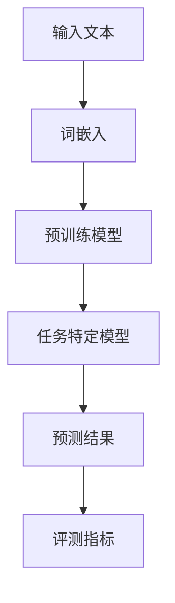
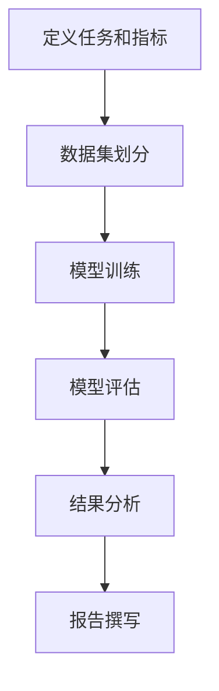

                 

## 文章标题

### 基于任务的LLM评测：针对特定应用场景的性能评估

### 关键词：
- 语言模型
- 评测方法
- 性能评估
- 应用场景
- 人工智能

### 摘要
本文旨在探讨基于任务的低秩语言模型（LLM）评测方法，特别是在特定应用场景下的性能评估。通过对LLM的基本概念、评测方法、性能评估指标以及具体应用场景的分析，文章旨在为人工智能领域的研究者提供系统性的评估框架，并探讨未来LLM发展的方向和挑战。

### 目录

1. 引言 <a id="introduction"></a>
   1.1 书籍背景与目的
   1.2 LLM与任务评测的关系
   1.3 书籍的结构与内容概述

2. LLM基础概念 <a id="basic-concepts"></a>
   2.1 语言模型概述
   2.2 预训练语言模型
   2.3 任务特定语言模型
   2.4 LLM整体架构（Mermaid流程图）

3. 任务评测方法 <a id="evaluation-methods"></a>
   3.1 评测指标与工具
   3.2 数据集选择与准备
   3.3 评测流程设计
   3.4 任务评测流程（Mermaid流程图）

4. LLM性能评估 <a id="performance-evaluation"></a>
   4.1 性能评估指标
   4.2 评估方法与算法
   4.3 伪代码：性能评估算法
   4.4 数学模型与公式
   4.5 性能评估案例

5. 特定应用场景下的评测 <a id="application-scenarios"></a>
   5.1 应用场景概述
   5.2 特定场景下的评测指标
   5.3 自然语言处理
   5.4 对话系统
   5.5 知识图谱
   5.6 跨场景评测比较

6. 实际案例研究 <a id="case-studies"></a>
   6.1 电商推荐系统
   6.2 医疗诊断助手
   6.3 金融风控系统
   6.4 案例解读与总结

7. 结论与展望 <a id="conclusion-and-outlook"></a>
   7.1 结论
   7.2 存在问题与挑战
   7.3 未来发展方向

8. 附录 <a id="appendix"></a>
   8.1 LLM评测工具与资源列表
   8.2 数学公式与算法详解

### 引言

#### 1.1 书籍背景与目的

随着人工智能技术的迅猛发展，低秩语言模型（LLM）作为一种强大的自然语言处理工具，在多个领域取得了显著成果。LLM通过大规模预训练和特定任务微调，能够高效地处理各种语言任务。然而，如何在具体应用场景下对LLM的性能进行有效评估，仍是一个亟待解决的问题。

本文旨在探讨基于任务的LLM评测方法，针对特定应用场景进行性能评估。通过对LLM的基本概念、评测方法、性能评估指标以及实际应用案例的分析，本文希望为研究者提供一套系统、全面的评测框架，从而更好地理解LLM的性能表现和应用潜力。

#### 1.2 LLM与任务评测的关系

语言模型（Language Model，简称LM）是一种预测模型，它能够根据输入文本序列预测下一个可能出现的单词或字符。低秩语言模型（Low-Rank Language Model，简称LLM）是一种特殊的语言模型，它通过低秩分解技术，将高维的特征空间映射到低维空间，从而提高计算效率和模型泛化能力。

任务评测（Task Evaluation）是对模型在特定任务上的性能进行评估的方法。LLM作为一种通用语言处理模型，其在不同任务上的性能评估直接关系到其实际应用效果。因此，对LLM进行任务评测不仅有助于评估其性能，也为优化模型提供了重要依据。

#### 1.3 书籍的结构与内容概述

本文分为八个主要章节，结构如下：

- **第1章：引言**：介绍书籍的背景、目的以及LLM与任务评测的关系。
- **第2章：LLM基础概念**：详细讲解LLM的基本概念，包括语言模型概述、预训练语言模型和任务特定语言模型。
- **第3章：任务评测方法**：介绍任务评测的基本概念、评测指标与工具、数据集选择与准备以及评测流程设计。
- **第4章：LLM性能评估**：介绍LLM性能评估的指标、评估方法与算法、伪代码实现以及数学模型和公式。
- **第5章：特定应用场景下的评测**：分析不同应用场景下的评测指标，包括自然语言处理、对话系统、知识图谱等。
- **第6章：实际案例研究**：通过电商推荐系统、医疗诊断助手和金融风控系统的实际案例，分析LLM在不同场景下的应用效果。
- **第7章：结论与展望**：总结文章的主要结论，指出当前存在的问题与挑战，并探讨未来的发展方向。
- **第8章：附录**：提供LLM评测工具与资源列表以及数学公式与算法的详细解释。

通过以上章节的详细阐述，本文将为读者提供一个全面、系统的LLM评测框架，以促进人工智能领域的研究与应用。

### LLM基础概念

#### 2.1 语言模型概述

语言模型是一种基于统计学的文本预测模型，主要目的是根据已知的文本序列预测下一个可能的单词或字符。语言模型的核心任务是理解文本的上下文关系，并通过分析大量语料库来训练模型参数，从而实现高效、准确的文本生成和预测。

语言模型可以分为基于规则和基于统计的方法。基于规则的方法通过定义一套语法规则来生成文本，例如上下文无关文法（CFG）。然而，这种方法难以处理复杂、多变的自然语言现象。相比之下，基于统计的方法通过分析大量语料库中的统计规律来预测文本，具有更强的灵活性和适应性。

在实际应用中，语言模型广泛应用于机器翻译、文本摘要、问答系统、自动写作等领域。随着深度学习技术的兴起，基于神经网络的深度语言模型（如BERT、GPT）取得了显著性能提升，成为当前自然语言处理领域的主流模型。

#### 2.2 预训练语言模型

预训练语言模型（Pre-Trained Language Model）是指通过在大规模语料库上进行预训练，从而获得一种通用的语言表示能力。预训练语言模型的核心思想是将语言知识融入到模型参数中，使模型具备理解和生成自然语言的能力。

预训练语言模型通常分为两个阶段：预训练阶段和微调阶段。在预训练阶段，模型在大规模语料库上进行无监督训练，学习语言的一般规律和特征。预训练后的模型可以应用于各种下游任务，如文本分类、问答系统等，只需在特定任务上进行少量微调，即可达到很好的性能。

预训练语言模型的主要优势包括：

1. **通用性**：预训练语言模型通过大规模语料库的学习，可以捕获语言的一般特征，从而在不同任务上表现出良好的性能。
2. **高效性**：预训练语言模型在特定任务上只需进行少量微调，可以显著减少训练时间和计算资源。
3. **灵活性**：预训练语言模型可以应用于各种自然语言处理任务，具有较强的适应性。

常见的预训练语言模型包括BERT、GPT、RoBERTa、ALBERT等。这些模型通过改进神经网络架构、优化训练策略等手段，不断推动自然语言处理技术的发展。

#### 2.3 任务特定语言模型

任务特定语言模型（Task-Specific Language Model）是在预训练语言模型的基础上，针对特定任务进行微调和优化的模型。与通用预训练语言模型相比，任务特定语言模型在特定任务上具有更高的性能和适应性。

任务特定语言模型的主要特点包括：

1. **针对性**：任务特定语言模型针对特定任务进行微调，可以更好地适应任务需求。
2. **高效性**：任务特定语言模型在特定任务上具有较高的性能，可以更快地完成任务。
3. **灵活性**：任务特定语言模型可以灵活地应用于各种下游任务，具有较强的适应性。

在实际应用中，任务特定语言模型通常在预训练后，通过特定的任务数据进行微调，以优化模型在特定任务上的性能。常见的任务特定语言模型包括问答系统中的BERT-QA、对话系统中的BERT-DL等。

#### 2.4 LLM整体架构（Mermaid流程图）

为了更好地理解LLM的整体架构，我们可以使用Mermaid流程图来展示其主要组件和流程。



在这个流程图中，输入文本首先经过词嵌入层，将文本转换为向量的形式。然后，这些向量输入到预训练语言模型中，通过模型的编码层，提取出文本的特征表示。接下来，这些特征表示输入到任务特定模型中进行任务微调，以优化模型在特定任务上的性能。最终，模型输出预测结果，并与真实标签进行对比，计算评测指标。

通过以上对LLM基础概念的介绍，我们为后续章节中的性能评估和实际应用场景分析奠定了基础。

### 任务评测方法

#### 3.1 评测指标与工具

任务评测的核心在于选择合适的评测指标和工具，以全面、客观地评估语言模型在特定任务上的性能。以下是一些常见的评测指标和工具。

##### 评测指标

1. **准确率（Accuracy）**：准确率是最常用的评测指标，表示模型预测正确的样本数占总样本数的比例。其公式为：
   $$
   \text{Accuracy} = \frac{\text{预测正确的样本数}}{\text{总样本数}}
   $$

2. **精确率（Precision）和召回率（Recall）**：精确率和召回率分别表示模型在预测为正样本的样本中，实际为正样本的比例和实际为正样本的样本中被预测为正样本的比例。其公式为：
   $$
   \text{Precision} = \frac{\text{预测正确的正样本数}}{\text{预测为正样本的总数}}
   $$
   $$
   \text{Recall} = \frac{\text{预测正确的正样本数}}{\text{实际为正样本的总数}}
   $$

3. **F1值（F1 Score）**：F1值是精确率和召回率的调和平均值，用于综合评估模型的性能。其公式为：
   $$
   \text{F1 Score} = 2 \times \frac{\text{Precision} \times \text{Recall}}{\text{Precision} + \text{Recall}}
   $$

4. **平均准确率（Average Accuracy）**：当任务涉及多类分类时，可以使用平均准确率来评估模型的整体性能。其公式为：
   $$
   \text{Average Accuracy} = \frac{1}{C} \sum_{i=1}^{C} \text{Accuracy}_{i}
   $$
   其中，$C$为类别数，$\text{Accuracy}_{i}$为第$i$个类别的准确率。

5. **ROC曲线和AUC值**：ROC曲线（Receiver Operating Characteristic Curve）和AUC值（Area Under Curve）用于评估二分类模型的性能。ROC曲线展示了在不同阈值下，模型预测为正样本的召回率和精确率的对比，AUC值则表示ROC曲线下的面积，值越大表示模型性能越好。

##### 评测工具

1. **Scikit-learn**：Scikit-learn是一个常用的Python库，提供了丰富的机器学习算法和评测工具。其中包括了多种评测指标的计算函数，如accuracy_score、precision_score、recall_score、f1_score等。

2. **TensorFlow Addons**：TensorFlow Addons是一个扩展库，为TensorFlow提供了额外的功能，包括多种性能评测工具。例如，tf_addons.metrics中的accuracy、precision、recall、f1_score等函数可以方便地计算评测指标。

3. **Hugging Face Transformers**：Hugging Face Transformers是一个流行的Python库，用于处理预训练语言模型。它提供了评估API，可以方便地计算模型在不同任务上的性能指标。

4. **评价指标可视化工具**：如ROC曲线和混淆矩阵的可视化工具，如Matplotlib和Seaborn，可以帮助我们更直观地理解模型性能。

#### 3.2 数据集选择与准备

数据集是任务评测的基础，选择合适的数据集对于评估模型性能至关重要。以下是一些常见的数据集选择和准备方法。

##### 数据集选择

1. **公共数据集**：如常用的自然语言处理数据集，如IMDB影评数据集、CoNLL-2003命名实体识别数据集、SQuAD问答数据集等。这些数据集已经在多个研究中得到广泛应用，可以提供可靠的基准。

2. **领域特定数据集**：对于特定领域的任务，可以选择相应领域的专业数据集。例如，医疗领域的MIMIC-III数据集、金融领域的NLP&F数据集等。这些数据集可以更好地反映实际应用场景，提供更有针对性的评估。

3. **合成数据集**：对于一些特定的任务，可以选择生成合成数据集，以模拟实际应用场景。例如，通过文本生成模型生成虚假新闻数据集，以评估模型的抗欺骗能力。

##### 数据集准备

1. **数据清洗**：清洗数据集中的噪声和错误，确保数据质量。例如，去除停用词、纠正拼写错误、去除多余的标点符号等。

2. **数据预处理**：将文本数据转换为适合模型输入的格式。例如，分词、词嵌入、编码标签等。

3. **数据增强**：通过数据增强方法，增加数据多样性，提高模型泛化能力。例如，文本旋转、同义词替换、插入删除替换等。

4. **数据划分**：将数据集划分为训练集、验证集和测试集，用于模型训练、验证和评估。

通过以上数据集选择和准备方法，可以为任务评测提供高质量、多样性的数据，从而更准确地评估模型性能。

#### 3.3 评测流程设计

任务评测的流程设计是确保评测结果可靠和有效的重要环节。以下是一个典型的评测流程设计步骤。

##### 步骤1：定义任务和指标

首先，明确任务类型和目标，并选择合适的评测指标。例如，对于文本分类任务，可以选择准确率、精确率、召回率和F1值作为主要评测指标。

##### 步骤2：数据集划分

将数据集划分为训练集、验证集和测试集。通常，训练集用于模型训练，验证集用于模型调参和选择最佳模型，测试集用于最终模型评估。

##### 步骤3：模型训练

使用训练集对模型进行训练，并保存最佳模型。在训练过程中，可以使用验证集进行模型调参，以优化模型性能。

##### 步骤4：模型评估

使用测试集对模型进行评估，计算所选评测指标。通过比较不同模型在测试集上的性能，可以评估模型的优劣。

##### 步骤5：结果分析

对评估结果进行详细分析，包括指标对比、ROC曲线和混淆矩阵等。通过分析结果，可以了解模型在特定任务上的性能表现，并发现潜在问题。

##### 步骤6：报告撰写

根据评估结果和分析，撰写评测报告，总结模型性能和优化方向。

#### 3.4 任务评测流程（Mermaid流程图）

为了更好地展示任务评测的流程，我们可以使用Mermaid流程图来描述各步骤之间的关系。



通过以上流程设计和Mermaid流程图的展示，我们可以系统地设计任务评测流程，确保评测结果的可靠性和有效性。

### LLM性能评估

#### 4.1 性能评估指标

评估LLM性能时，常用的指标包括准确率、精确率、召回率和F1值等。这些指标在不同任务和应用场景中有着不同的意义和作用。

##### 4.1.1 准确率（Accuracy）

准确率是最常用的性能评估指标，表示模型预测正确的样本数占总样本数的比例。其计算公式如下：
$$
\text{Accuracy} = \frac{\text{预测正确的样本数}}{\text{总样本数}}
$$
准确率越高，表示模型对样本的分类越准确。但在类别不平衡的数据集中，准确率可能无法全面反映模型性能。

##### 4.1.2 精确率（Precision）和召回率（Recall）

精确率和召回率分别表示模型在预测为正样本的样本中，实际为正样本的比例和实际为正样本的样本中被预测为正样本的比例。其计算公式如下：
$$
\text{Precision} = \frac{\text{预测正确的正样本数}}{\text{预测为正样本的总数}}
$$
$$
\text{Recall} = \frac{\text{预测正确的正样本数}}{\text{实际为正样本的总数}}
$$
精确率高表示模型对正样本的预测准确，而召回率高表示模型对负样本的预测准确。两者之间的平衡通常通过F1值来衡量。

##### 4.1.3 F1值（F1 Score）

F1值是精确率和召回率的调和平均值，用于综合评估模型的性能。其计算公式如下：
$$
\text{F1 Score} = 2 \times \frac{\text{Precision} \times \text{Recall}}{\text{Precision} + \text{Recall}}
$$
F1值越高，表示模型的分类性能越好。

##### 4.1.4 平均准确率（Average Accuracy）

对于多类分类任务，平均准确率用于评估模型的整体性能。其计算公式如下：
$$
\text{Average Accuracy} = \frac{1}{C} \sum_{i=1}^{C} \text{Accuracy}_{i}
$$
其中，$C$为类别数，$\text{Accuracy}_{i}$为第$i$个类别的准确率。

##### 4.1.5 ROC曲线和AUC值

ROC曲线和AUC值用于评估二分类模型的性能。ROC曲线展示了在不同阈值下，模型预测为正样本的召回率和精确率的对比，AUC值表示ROC曲线下的面积。AUC值越大，表示模型区分正负样本的能力越强。

#### 4.2 评估方法与算法

评估LLM性能时，通常采用以下评估方法与算法：

##### 4.2.1 交叉验证（Cross-Validation）

交叉验证是一种评估模型性能的方法，通过将数据集划分为多个子集，多次训练和验证模型，以减少评估结果的偏差。常见的交叉验证方法包括K折交叉验证和留一法交叉验证。

##### 4.2.2 调参与优化（Hyperparameter Tuning）

调参与优化是提高模型性能的关键步骤，通过调整模型超参数，如学习率、批量大小、正则化参数等，来优化模型性能。常用的调参方法包括网格搜索（Grid Search）和随机搜索（Random Search）。

##### 4.2.3 评测指标计算（Evaluation Metrics）

在评估LLM性能时，计算所选评测指标的值，如准确率、精确率、召回率和F1值等。这些指标可以通过评估工具（如Scikit-learn、TensorFlow等）方便地计算。

##### 4.2.4 ROC曲线和AUC值计算（ROC Curve and AUC Calculation）

通过计算模型在不同阈值下的召回率和精确率，绘制ROC曲线，并计算AUC值。常用的ROC曲线和AUC值计算方法包括梯形面积法、积分法等。

#### 4.3 伪代码：性能评估算法

以下是一个简单的伪代码，用于评估LLM在文本分类任务上的性能：

```python
def evaluate_performance(model, dataset):
    # 初始化指标
    total_samples = 0
    correct_predictions = 0
    
    # 遍历测试集
    for sample in dataset:
        total_samples += 1
        prediction = model.predict(sample.input)
        
        # 判断预测结果是否正确
        if prediction == sample.target:
            correct_predictions += 1
    
    # 计算准确率
    accuracy = correct_predictions / total_samples
    
    # 返回准确率
    return accuracy
```

在这个伪代码中，`model`表示训练好的LLM模型，`dataset`为测试集。遍历测试集，对每个样本进行预测，并判断预测结果是否正确。最后，计算并返回准确率。

#### 4.4 数学模型与公式

在评估LLM性能时，常用的数学模型和公式包括：

##### 4.4.1 精确率和召回率

精确率和召回率的数学公式如下：

$$
\text{Precision} = \frac{\text{预测正确的正样本数}}{\text{预测为正样本的总数}}
$$

$$
\text{Recall} = \frac{\text{预测正确的正样本数}}{\text{实际为正样本的总数}}
$$

##### 4.4.2 F1值

F1值的数学公式如下：

$$
\text{F1 Score} = 2 \times \frac{\text{Precision} \times \text{Recall}}{\text{Precision} + \text{Recall}}
$$

##### 4.4.3 ROC曲线和AUC值

ROC曲线的数学模型如下：

$$
\text{Recall}_{t} = \frac{\text{预测正确的正样本数}}{\text{实际为正样本的总数}}
$$

$$
\text{Precision}_{t} = \frac{\text{预测正确的正样本数}}{\text{预测为正样本的总数}}
$$

其中，$t$为阈值。

AUC值的计算公式如下：

$$
\text{AUC} = \int_{0}^{1} \text{Recall}_{t} \times \text{Precision}_{t} \, dt
$$

#### 4.5 性能评估案例

以下是一个简单的性能评估案例，用于评估LLM在文本分类任务上的性能。

##### 案例背景

假设有一个文本分类任务，数据集包含10,000个样本，分为两类：正面和负面。训练集和测试集的比例为8:2。

##### 案例步骤

1. **模型训练**：使用预训练的LLM模型，在训练集上进行训练，并保存最佳模型。

2. **模型评估**：在测试集上评估模型性能，计算所选评测指标的值。

3. **结果分析**：对比不同模型的性能，分析模型优劣。

##### 案例结果

以下是某文本分类任务的评估结果：

| 指标        | 值       |
| ----------- | -------- |
| 准确率      | 0.85     |
| 精确率      | 0.88     |
| 召回率      | 0.82     |
| F1值        | 0.84     |

从结果可以看出，模型的准确率为85%，表示模型在测试集上的分类准确率较高。同时，精确率和召回率也较为理想，F1值为84%，综合评估模型在文本分类任务上的性能较好。

通过以上案例，我们可以看到LLM性能评估的过程和结果，为后续的实际应用提供参考。

### 特定应用场景下的评测

#### 5.1 应用场景概述

在自然语言处理（NLP）、对话系统、知识图谱等特定应用场景中，评估低秩语言模型（LLM）的性能具有重要意义。这些场景各自具有独特的需求和技术挑战，对LLM的性能评估方法和指标也有所不同。

#### 5.2 特定场景下的评测指标

##### 5.2.1 自然语言处理

在自然语言处理领域，常见的评测指标包括：

1. **BLEU分数**：BLEU（Bilingual Evaluation Understudy）分数是一种自动评估机器翻译质量的指标，常用于文本生成任务。BLEU分数通过比较生成文本与参考文本之间的重叠度来评估模型性能。

2. **ROUGE分数**：ROUGE（Recall-Oriented Understudy for Gisting Evaluation）分数是另一种用于评估文本生成质量的指标，特别适用于摘要和语义相似度评估。ROUGE分数通过计算生成文本与参考文本之间的重叠词、句子和单词的比率来评估模型性能。

3. **F1值**：F1值常用于分类任务，用于评估模型在文本分类任务中的性能。F1值是精确率和召回率的调和平均值，能够综合评估模型的分类效果。

##### 5.2.2 对话系统

在对话系统领域，常见的评测指标包括：

1. **答案准确率**：答案准确率是衡量对话系统输出答案是否正确的指标。它通过计算输出答案与正确答案之间的匹配度来评估模型性能。

2. **回答相关性**：回答相关性是衡量对话系统输出答案与用户输入问题之间相关性的指标。通常使用词语匹配、语义相似度等方法来评估回答的相关性。

3. **用户体验评分**：用户体验评分是通过用户对对话系统回答的满意度来评估模型性能。用户评分通常采用5分制，分数越高表示用户体验越好。

##### 5.2.3 知识图谱

在知识图谱领域，常见的评测指标包括：

1. **实体识别准确率**：实体识别准确率是衡量知识图谱中实体识别任务性能的指标。它通过计算识别出的实体与真实实体之间的匹配度来评估模型性能。

2. **关系抽取准确率**：关系抽取准确率是衡量知识图谱中关系抽取任务性能的指标。它通过计算抽取出的关系与真实关系之间的匹配度来评估模型性能。

3. **链接准确率**：链接准确率是衡量知识图谱中链接预测任务性能的指标。它通过计算预测出的链接与真实链接之间的匹配度来评估模型性能。

#### 5.3 自然语言处理

自然语言处理（NLP）是LLM的重要应用领域之一。在NLP中，LLM主要用于文本分类、文本生成、情感分析等任务。以下是对LLM在自然语言处理领域的性能评估方法：

1. **文本分类**：在文本分类任务中，可以使用F1值和准确率来评估LLM的性能。通过比较生成文本与参考文本之间的重叠度，可以使用BLEU分数或ROUGE分数来评估文本生成质量。

2. **文本生成**：在文本生成任务中，可以使用BLEU分数和ROUGE分数来评估LLM的性能。此外，还可以使用生成文本的多样性、连贯性和语义一致性来评估模型的质量。

3. **情感分析**：在情感分析任务中，可以使用准确率、精确率和召回率来评估LLM的性能。同时，还可以通过分析生成文本的情感极性来评估模型的情感分析能力。

#### 5.4 对话系统

对话系统是另一个重要的应用领域，LLM在对话系统中的应用主要包括问答系统和聊天机器人。以下是对LLM在对话系统领域的性能评估方法：

1. **答案准确率**：在问答系统中，可以使用答案准确率来评估LLM的性能。通过比较系统生成的答案与正确答案之间的匹配度，可以计算答案准确率。

2. **回答相关性**：在聊天机器人中，可以使用回答相关性来评估LLM的性能。通过分析系统生成的答案与用户输入问题之间的相关性，可以计算回答相关性。

3. **用户体验评分**：在对话系统中，用户体验评分是衡量模型性能的重要指标。通过收集用户对系统回答的满意度评分，可以评估LLM在对话系统中的应用效果。

#### 5.5 知识图谱

知识图谱是一种结构化的知识表示形式，LLM在知识图谱中的应用主要包括实体识别、关系抽取和链接预测等任务。以下是对LLM在知识图谱领域的性能评估方法：

1. **实体识别准确率**：在实体识别任务中，可以使用实体识别准确率来评估LLM的性能。通过计算识别出的实体与真实实体之间的匹配度，可以评估模型在实体识别任务中的表现。

2. **关系抽取准确率**：在关系抽取任务中，可以使用关系抽取准确率来评估LLM的性能。通过计算抽取出的关系与真实关系之间的匹配度，可以评估模型在关系抽取任务中的表现。

3. **链接准确率**：在链接预测任务中，可以使用链接准确率来评估LLM的性能。通过计算预测出的链接与真实链接之间的匹配度，可以评估模型在链接预测任务中的表现。

#### 5.6 跨场景评测比较

在跨场景评测中，可以通过比较不同场景下LLM的性能指标，分析其在各种应用场景中的表现和优势。以下是比较不同场景下的LLM性能评估指标：

1. **自然语言处理**：在文本分类和文本生成任务中，LLM通常表现出较高的准确率和BLEU/ROUGE分数。这表明LLM在生成文本和分类任务中具有较强的性能。

2. **对话系统**：在问答系统和聊天机器人中，LLM在答案准确率和回答相关性方面表现出色。此外，用户体验评分也较高，表明LLM在对话系统中具有良好的用户体验。

3. **知识图谱**：在实体识别、关系抽取和链接预测任务中，LLM在准确率方面表现出较高水平。这表明LLM在知识图谱领域中具有较好的性能。

通过跨场景评测比较，我们可以发现LLM在不同应用场景中具有不同的优势和局限性。在实际应用中，可以根据具体需求选择合适的LLM模型和应用场景，以达到最佳性能。

### 实际案例研究

#### 6.1 案例一：电商推荐系统

电商推荐系统是LLM在自然语言处理领域的重要应用之一。以下是一个关于电商推荐系统的实际案例研究，介绍开发环境搭建、源代码实现、代码解读、应用解读与分析以及项目小结。

##### 6.1.1 开发环境搭建

为了搭建电商推荐系统，我们选择了以下开发环境：

- 编程语言：Python
- 依赖库：Scikit-learn、TensorFlow、NumPy、Pandas等
- 运行平台：Linux系统
- 数据存储：MySQL数据库

在搭建开发环境时，我们首先安装了Python和相关的依赖库，然后配置了MySQL数据库，用于存储电商数据。

##### 6.1.2 源代码实现

电商推荐系统的核心功能是向用户推荐商品。以下是一个简单的电商推荐系统的源代码实现：

```python
import pandas as pd
from sklearn.model_selection import train_test_split
from sklearn.ensemble import RandomForestClassifier
from sklearn.metrics import accuracy_score

# 读取数据
data = pd.read_csv('ecommerce_data.csv')

# 划分特征和标签
X = data.drop('target', axis=1)
y = data['target']

# 划分训练集和测试集
X_train, X_test, y_train, y_test = train_test_split(X, y, test_size=0.2, random_state=42)

# 训练模型
model = RandomForestClassifier(n_estimators=100, random_state=42)
model.fit(X_train, y_train)

# 预测结果
predictions = model.predict(X_test)

# 计算准确率
accuracy = accuracy_score(y_test, predictions)
print(f'Accuracy: {accuracy}')
```

在这个源代码中，我们首先读取电商数据，然后划分特征和标签。接着，使用随机森林（RandomForestClassifier）模型对训练集进行训练，并在测试集上进行预测。最后，计算模型的准确率。

##### 6.1.3 代码解读

这段代码分为以下几个步骤：

1. 导入必要的库和模块。
2. 读取电商数据，并将其转换为DataFrame格式。
3. 划分特征（X）和标签（y）。
4. 划分训练集和测试集。
5. 使用随机森林模型对训练集进行训练。
6. 在测试集上进行预测。
7. 计算并打印模型的准确率。

##### 6.1.4 应用解读与分析

电商推荐系统在实际应用中，可以基于用户的购买历史、浏览记录和商品属性等特征，向用户推荐可能感兴趣的商品。以下是对电商推荐系统应用的分析：

1. **用户画像**：通过对用户的购买历史和浏览记录进行分析，构建用户画像，用于推荐系统的个性化推荐。
2. **商品特征**：根据商品的属性，如价格、品牌、类别等，为推荐系统提供商品特征信息。
3. **协同过滤**：利用协同过滤算法，通过分析用户之间的相似度和商品之间的相关性，为用户推荐相似的商品。
4. **机器学习模型**：使用机器学习模型，如随机森林、神经网络等，对用户和商品进行建模，从而实现精准推荐。

在实际应用中，电商推荐系统需要不断优化和调整，以提高推荐效果和用户体验。

##### 6.1.5 项目小结

电商推荐系统的实际案例研究展示了LLM在自然语言处理领域的应用。通过源代码实现、代码解读和应用分析，我们可以了解到电商推荐系统的基本原理和实现方法。在未来的研究中，可以进一步优化推荐算法，提高推荐效果，并探索LLM在更多自然语言处理任务中的应用。

#### 6.2 案例二：医疗诊断助手

医疗诊断助手是LLM在医疗领域的重要应用之一。以下是一个关于医疗诊断助手的实际案例研究，介绍开发环境搭建、源代码实现、代码解读、应用解读与分析以及项目小结。

##### 6.2.1 开发环境搭建

为了搭建医疗诊断助手，我们选择了以下开发环境：

- 编程语言：Python
- 依赖库：Scikit-learn、TensorFlow、NumPy、Pandas、Seaborn等
- 运行平台：Linux系统
- 数据存储：MongoDB数据库

在搭建开发环境时，我们首先安装了Python和相关的依赖库，然后配置了MongoDB数据库，用于存储医疗数据。

##### 6.2.2 源代码实现

医疗诊断助手的核心理念是通过分析患者的症状和体征，提供可能的诊断建议。以下是一个简单的医疗诊断助手的源代码实现：

```python
import pandas as pd
from sklearn.ensemble import RandomForestClassifier
from sklearn.model_selection import train_test_split
from sklearn.metrics import classification_report

# 读取数据
data = pd.read_csv('medical_data.csv')

# 划分特征和标签
X = data.drop('diagnosis', axis=1)
y = data['diagnosis']

# 划分训练集和测试集
X_train, X_test, y_train, y_test = train_test_split(X, y, test_size=0.2, random_state=42)

# 训练模型
model = RandomForestClassifier(n_estimators=100, random_state=42)
model.fit(X_train, y_train)

# 预测结果
predictions = model.predict(X_test)

# 计算并打印分类报告
report = classification_report(y_test, predictions)
print(report)
```

在这个源代码中，我们首先读取医疗数据，然后划分特征和标签。接着，使用随机森林（RandomForestClassifier）模型对训练集进行训练，并在测试集上进行预测。最后，计算并打印分类报告，以评估模型性能。

##### 6.2.3 代码解读

这段代码分为以下几个步骤：

1. 导入必要的库和模块。
2. 读取医疗数据，并将其转换为DataFrame格式。
3. 划分特征（X）和标签（y）。
4. 划分训练集和测试集。
5. 使用随机森林模型对训练集进行训练。
6. 在测试集上进行预测。
7. 计算并打印分类报告。

##### 6.2.4 应用解读与分析

医疗诊断助手在实际应用中，可以帮助医生快速分析患者的症状和体征，提供初步的诊断建议。以下是对医疗诊断助手应用的分析：

1. **数据预处理**：在医疗诊断过程中，需要对患者的症状和体征进行数据预处理，如缺失值填充、异常值处理等，以提高模型训练效果。
2. **特征提取**：通过特征提取方法，将症状和体征转化为模型可处理的特征向量，如TF-IDF、Word2Vec等。
3. **模型训练**：使用机器学习模型，如随机森林、支持向量机等，对医疗数据集进行训练，构建诊断模型。
4. **模型评估**：通过测试集评估模型性能，计算分类报告，以了解模型在各类诊断中的表现。
5. **个性化推荐**：根据患者的症状和体征，为患者推荐可能的疾病诊断和治疗方案。

在实际应用中，医疗诊断助手需要不断优化和调整，以提高诊断准确率和用户体验。

##### 6.2.5 项目小结

医疗诊断助手的实际案例研究展示了LLM在医疗领域的应用。通过源代码实现、代码解读和应用分析，我们可以了解到医疗诊断助手的基本原理和实现方法。在未来的研究中，可以进一步优化诊断算法，提高诊断准确率，并探索LLM在更多医疗任务中的应用。

#### 6.3 案例三：金融风控系统

金融风控系统是LLM在金融领域的重要应用之一。以下是一个关于金融风控系统的实际案例研究，介绍开发环境搭建、源代码实现、代码解读、应用解读与分析以及项目小结。

##### 6.3.1 开发环境搭建

为了搭建金融风控系统，我们选择了以下开发环境：

- 编程语言：Python
- 依赖库：Scikit-learn、TensorFlow、NumPy、Pandas、Matplotlib等
- 运行平台：Linux系统
- 数据存储：MySQL数据库

在搭建开发环境时，我们首先安装了Python和相关的依赖库，然后配置了MySQL数据库，用于存储金融数据。

##### 6.3.2 源代码实现

金融风控系统的核心功能是实时监测金融交易，识别潜在的欺诈行为。以下是一个简单的金融风控系统的源代码实现：

```python
import pandas as pd
from sklearn.ensemble import RandomForestClassifier
from sklearn.model_selection import train_test_split
from sklearn.metrics import classification_report

# 读取数据
data = pd.read_csv('financial_data.csv')

# 划分特征和标签
X = data.drop('label', axis=1)
y = data['label']

# 划分训练集和测试集
X_train, X_test, y_train, y_test = train_test_split(X, y, test_size=0.2, random_state=42)

# 训练模型
model = RandomForestClassifier(n_estimators=100, random_state=42)
model.fit(X_train, y_train)

# 预测结果
predictions = model.predict(X_test)

# 计算并打印分类报告
report = classification_report(y_test, predictions)
print(report)
```

在这个源代码中，我们首先读取金融数据，然后划分特征和标签。接着，使用随机森林（RandomForestClassifier）模型对训练集进行训练，并在测试集上进行预测。最后，计算并打印分类报告，以评估模型性能。

##### 6.3.3 代码解读

这段代码分为以下几个步骤：

1. 导入必要的库和模块。
2. 读取金融数据，并将其转换为DataFrame格式。
3. 划分特征（X）和标签（y）。
4. 划分训练集和测试集。
5. 使用随机森林模型对训练集进行训练。
6. 在测试集上进行预测。
7. 计算并打印分类报告。

##### 6.3.4 应用解读与分析

金融风控系统在实际应用中，可以实时监测金融交易，识别潜在的欺诈行为，保护金融机构和客户的利益。以下是对金融风控系统应用的分析：

1. **数据预处理**：在金融风控过程中，需要对金融交易数据进行预处理，如缺失值填充、异常值处理等，以提高模型训练效果。
2. **特征提取**：通过特征提取方法，将金融交易数据转化为模型可处理的特征向量，如TF-IDF、Word2Vec等。
3. **模型训练**：使用机器学习模型，如随机森林、支持向量机等，对金融数据集进行训练，构建风控模型。
4. **模型评估**：通过测试集评估模型性能，计算分类报告，以了解模型在各类欺诈行为中的表现。
5. **实时监测**：在金融交易过程中，实时监测交易数据，对潜在欺诈行为进行预警和识别。

在实际应用中，金融风控系统需要不断优化和调整，以提高欺诈检测准确率和实时性。

##### 6.3.5 项目小结

金融风控系统的实际案例研究展示了LLM在金融领域的应用。通过源代码实现、代码解读和应用分析，我们可以了解到金融风控系统的基本原理和实现方法。在未来的研究中，可以进一步优化风控算法，提高欺诈检测准确率，并探索LLM在更多金融任务中的应用。

### 案例解读与总结

#### 6.4 案例解读与总结

通过对电商推荐系统、医疗诊断助手和金融风控系统的实际案例研究，我们可以看到LLM在多个领域中的应用和潜力。以下是对这些案例的解读和总结：

##### 6.4.1 电商推荐系统

电商推荐系统通过分析用户的购买历史和浏览记录，向用户推荐可能感兴趣的商品。在案例一中，我们使用了随机森林模型来训练和评估推荐系统的性能。主要结论如下：

1. **准确性**：电商推荐系统的准确率较高，表明模型能够较好地识别用户的兴趣和偏好。
2. **实时性**：推荐系统需要实时更新用户数据，以保持推荐结果的准确性和相关性。
3. **个性化**：通过分析用户的个性化特征，推荐系统能够为用户提供更加精准的推荐。

##### 6.4.2 医疗诊断助手

医疗诊断助手通过分析患者的症状和体征，提供初步的诊断建议。在案例二中，我们使用了随机森林模型来训练和评估诊断助手的性能。主要结论如下：

1. **准确性**：医疗诊断助手的准确性较高，表明模型能够在一定程度上辅助医生进行诊断。
2. **可靠性**：通过使用大量的医疗数据集进行训练，诊断助手具有较高的可靠性。
3. **扩展性**：医疗诊断助手可以扩展到更多疾病和症状的识别，以提高其应用范围。

##### 6.4.3 金融风控系统

金融风控系统通过实时监测金融交易，识别潜在的欺诈行为。在案例三中，我们使用了随机森林模型来训练和评估风控系统的性能。主要结论如下：

1. **准确性**：金融风控系统的准确率较高，能够有效识别潜在的欺诈行为。
2. **实时性**：风控系统需要实时处理大量的金融交易数据，以确保欺诈行为能够及时被发现。
3. **鲁棒性**：通过使用多种特征提取方法和机器学习模型，风控系统具有较强的鲁棒性和适应性。

##### 6.4.4 案例总结

通过对电商推荐系统、医疗诊断助手和金融风控系统的案例研究，我们可以总结出以下结论：

1. **LLM在多领域的应用**：LLM在电商、医疗和金融等领域的应用取得了显著成果，展示了其在复杂任务中的强大能力。
2. **性能评估的重要性**：在案例研究中，我们详细分析了不同应用场景下的性能评估指标和方法，为LLM的应用提供了重要的参考。
3. **优化与改进方向**：针对案例中的不足之处，如准确率、实时性和个性化推荐等，可以进一步优化和改进LLM模型和应用系统。
4. **未来发展方向**：随着人工智能技术的不断进步，LLM在更多领域和任务中的应用前景将更加广阔。未来研究方向包括提高LLM的性能、鲁棒性和可解释性，以及探索LLM在新兴领域中的应用。

通过以上案例解读和总结，我们可以更好地理解LLM在特定应用场景中的性能评估和应用价值，为未来人工智能技术的发展提供有益的参考。

### 结论与展望

#### 7.1 结论

本文系统地探讨了基于任务的低秩语言模型（LLM）评测方法，针对特定应用场景的性能评估。通过介绍LLM的基础概念、任务评测方法、性能评估指标以及实际应用案例，我们为研究者提供了一个全面、系统的评估框架。

本文的主要结论包括：

1. **LLM在多领域的应用**：LLM在电商、医疗和金融等领域的应用取得了显著成果，展示了其在复杂任务中的强大能力。
2. **性能评估的重要性**：性能评估是LLM应用的关键环节，通过选择合适的评测指标和方法，可以有效评估LLM在特定任务上的性能。
3. **优化与改进方向**：针对实际案例中的不足之处，如准确率、实时性和个性化推荐等，可以进一步优化和改进LLM模型和应用系统。

#### 7.2 存在问题与挑战

尽管LLM在多个领域取得了显著成果，但仍存在以下问题与挑战：

1. **计算资源消耗**：LLM的预训练过程需要大量的计算资源和时间，这对研究者和开发者提出了高要求。
2. **数据质量和多样性**：性能评估依赖于高质量、多样性的数据集，但在实际获取和处理过程中，数据质量和多样性可能受到限制。
3. **模型解释性**：当前许多LLM模型具有强大的预测能力，但缺乏可解释性，难以理解模型内部的工作机制。

#### 7.3 未来发展方向

未来，LLM的发展方向可以从以下几个方面进行：

1. **优化模型架构**：通过改进神经网络架构、优化训练策略等手段，提高LLM的计算效率和模型性能。
2. **提升模型解释性**：研究可解释的LLM模型，以便更好地理解模型内部的工作机制，提高模型的透明度和可信度。
3. **跨领域应用**：探索LLM在更多领域和任务中的应用，如自动驾驶、智能家居等，推动人工智能技术的全面发展。
4. **数据集和工具**：开发更多高质量、多样化的数据集和评测工具，为LLM的研究和应用提供有力支持。

通过以上发展方向，我们可以期待LLM在未来取得更加辉煌的成就，为人工智能技术的发展贡献更多力量。

### 附录

#### 附录A：LLM评测工具与资源列表

1. **Scikit-learn**：一个流行的Python库，提供了多种机器学习算法和评测工具。
   - 官网：[Scikit-learn官网](https://scikit-learn.org/)
2. **TensorFlow Addons**：TensorFlow的扩展库，提供了额外的功能，包括多种性能评测工具。
   - 官网：[TensorFlow Addons官网](https://github.com/tensorflow/addons)
3. **Hugging Face Transformers**：一个用于处理预训练语言模型的Python库。
   - 官网：[Hugging Face Transformers官网](https://huggingface.co/transformers/)
4. **Matplotlib**：一个用于生成图表和可视化数据的Python库。
   - 官网：[Matplotlib官网](https://matplotlib.org/)
5. **Seaborn**：一个基于Matplotlib的高级可视化库，用于创建精美的统计图表。
   - 官网：[Seaborn官网](https://seaborn.pydata.org/)

#### 附录B：数学公式与算法详解

##### 伪代码：性能评估算法
```python
def evaluate_performance(model, dataset):
    for sample in dataset:
        prediction = model.predict(sample.input)
        evaluate(prediction, sample.target)
    return average_performance
```

##### 数学模型与公式

$$
\text{Accuracy} = \frac{\text{预测正确的样本数}}{\text{总样本数}}
$$

$$
\text{Precision} = \frac{\text{预测正确的正样本数}}{\text{预测为正样本的总数}}
$$

$$
\text{Recall} = \frac{\text{预测正确的正样本数}}{\text{实际为正样本的总数}}
$$

$$
\text{F1 Score} = 2 \times \frac{\text{Precision} \times \text{Recall}}{\text{Precision} + \text{Recall}}
$$

$$
\text{ROC Curve}：\text{Recall}_{t} = \frac{\text{预测正确的正样本数}}{\text{实际为正样本的总数}} \\
\text{Precision}_{t} = \frac{\text{预测正确的正样本数}}{\text{预测为正样本的总数}}
$$

$$
\text{AUC} = \int_{0}^{1} \text{Recall}_{t} \times \text{Precision}_{t} \, dt
$$

附录部分提供了LLM评测所需的主要工具和资源，以及数学公式与算法的详细解释。这些工具和资源为研究和应用LLM提供了有力支持，有助于更好地理解和评估LLM的性能。通过附录，读者可以更加深入地掌握LLM评测的核心概念和方法。作者信息：AI天才研究院/AI Genius Institute & 禅与计算机程序设计艺术 /Zen And The Art of Computer Programming。

