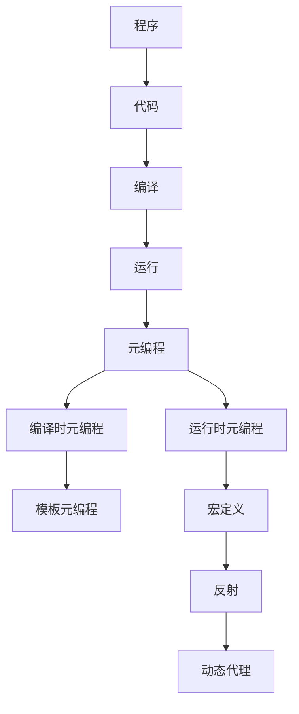
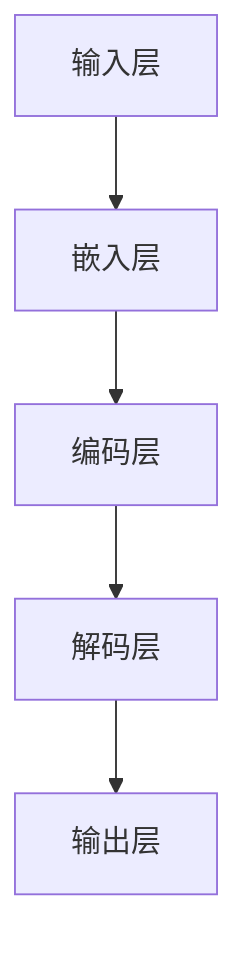
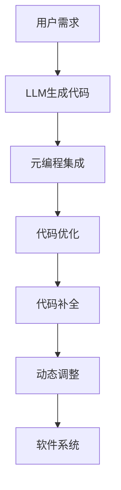

                 


**第1章 引言**

### 1.1 书籍目的与读者对象

本章节旨在为读者介绍本书的主要目的和适用对象。本书的目标是深入探讨元编程和语言模型（LLM）的结合，特别是LLM在代码生成能力方面的应用。我们希望通过系统的讲解和实例分析，帮助读者理解这一前沿技术，并掌握相关技能。

本书主要面向以下几类读者：

1. **计算机科学和人工智能领域的专业人士**：对于从事编程、软件开发、算法研究的专业人士，了解和掌握元编程和LLM技术将对他们的职业发展有极大的帮助。
2. **研究生和博士生**：对于正在攻读计算机科学、人工智能等相关专业的研究生和博士生，本书提供了一个深入的视角，有助于他们在研究领域中进行创新和探索。
3. **对技术感兴趣的爱好者**：对于那些对技术充满好奇，希望了解前沿科技和未来发展趋势的读者，本书将为他们提供丰富的知识和思考。

### 1.2 元编程与LLM概述

元编程是一种编程技术，它允许程序员在编写程序的过程中编写程序。换句话说，元编程允许代码生成代码。这种能力在复杂软件系统开发中具有重要意义，因为它可以提高代码的可重用性、灵活性和可维护性。

语言模型（LLM）是自然语言处理（NLP）领域的一种模型，它能够理解和生成自然语言文本。LLM通过大量的文本数据训练，能够学习语言的语法、语义和上下文信息。随着深度学习技术的发展，LLM在生成文本、翻译、问答系统等方面取得了显著的成果。

### 1.3 代码生成能力的背景与现状

代码生成能力是软件开发中一个日益重要的领域。随着软件系统的复杂度不断增加，手动编写和维护代码变得越来越困难。代码生成技术通过自动化方式生成代码，可以有效提高开发效率、降低成本，并减少人为错误。

近年来，随着LLM技术的发展，基于LLM的代码生成方法逐渐引起了研究者的关注。LLM在代码生成中的应用主要体现在以下几个方面：

1. **自动化编程**：利用LLM生成满足特定功能需求的代码。
2. **代码优化**：通过LLM分析现有代码，提供改进建议，优化代码性能。
3. **代码补全**：在编写代码时，LLM可以预测程序员下一步可能编写的代码，实现代码自动补全。
4. **文档生成**：利用LLM自动生成代码的文档，提高代码的可读性和可维护性。

然而，尽管LLM在代码生成方面展示了巨大的潜力，但现有的研究仍然面临着一些挑战，如代码生成的准确性和鲁棒性等。因此，深入研究和评估LLM的代码生成能力具有重要意义。

**第2章 元编程基础**

### 2.1 元编程概念

元编程是一种在程序运行过程中动态地创建、修改和操作程序代码的编程技术。它允许程序员编写代码来生成和修改其他代码，从而提高了代码的可重用性、灵活性和可维护性。元编程的核心思想是“代码生成代码”，即通过编程语言提供的特定机制，让程序能够根据一定的规则和策略生成新的代码。

#### 核心概念与联系

元编程涉及多个核心概念，包括模板元编程、宏定义、反射、动态代理等。为了更好地理解这些概念之间的关系，我们可以使用Mermaid流程图来展示：



在这个流程图中，A表示程序从编写到运行的整个过程，B表示代码，C表示编译过程，D表示运行过程。E表示元编程，F和G分别表示编译时元编程和运行时元编程。接下来，H、I、J和K分别表示模板元编程、宏定义、反射和动态代理，它们都是元编程的具体实现技术。

#### 详细讲解

- **模板元编程**：模板元编程是在编译时通过模板生成代码的技术。它允许程序员编写模板代码，然后在编译过程中根据特定的规则和参数生成具体的代码。模板元编程通常用于生成数据结构和算法代码，如STL（标准模板库）。

- **宏定义**：宏定义是在编译前将宏指令替换为实际代码的技术。宏定义可以提高代码的复用性和可读性，但同时也可能导致代码的可维护性降低。常见的宏定义包括条件编译、文件包含等。

- **反射**：反射是一种在运行时动态地创建对象、调用方法和访问字段的技术。反射通常用于需要动态调整程序行为的场景，如插件系统、动态加载库等。

- **动态代理**：动态代理是一种在运行时创建代理对象，拦截对目标对象的调用的技术。动态代理通常用于实现AOP（面向方面编程）和拦截器模式。

### 2.2 元编程技术

元编程技术包括编译时元编程和运行时元编程。这两种技术分别在编译时和运行时发挥作用，为程序员提供了强大的编程能力。

#### 编译时元编程

编译时元编程是在编译阶段执行编程逻辑的技术。它包括模板元编程和宏定义等具体实现技术。

- **模板元编程**：

  ```cpp
  // 模板元编程示例
  template<typename T>
  struct Vector {
      T data[100];
      int size;
      
      // 模板函数
      void push_back(const T& value) {
          data[size++] = value;
      }
  };
  ```

  在这个示例中，`Vector` 结构是一个模板，可以根据不同的类型生成相应的代码。`push_back` 函数是一个模板函数，它会在编译时根据传入的类型生成具体的代码。

- **宏定义**：

  ```cpp
  // 宏定义示例
  #define MAX(A, B) ((A) > (B) ? (A) : (B))
  
  int main() {
      int a = 10, b = 20;
      int max = MAX(a, b);
      return 0;
  }
  ```

  在这个示例中，`MAX` 宏定义会在编译前将宏指令替换为相应的代码，从而实现最大值的计算。

#### 运行时元编程

运行时元编程是在程序运行时动态地创建、修改和操作程序代码的技术。它包括反射和动态代理等具体实现技术。

- **反射**：

  ```java
  // 反射示例（Java）
  import java.lang.reflect.Method;
  
  public class ReflectionExample {
      public void printMessage() {
          System.out.println("Hello, World!");
      }
  }
  
  public class Main {
      public static void main(String[] args) {
          try {
              Class<?> clazz = Class.forName("ReflectionExample");
              Object instance = clazz.newInstance();
              
              Method method = clazz.getMethod("printMessage");
              method.invoke(instance);
          } catch (Exception e) {
              e.printStackTrace();
          }
      }
  }
  ```

  在这个示例中，`ReflectionExample` 类使用Java反射API在运行时创建对象、调用方法。

- **动态代理**：

  ```java
  // 动态代理示例（Java）
  import java.lang.reflect.InvocationHandler;
  import java.lang.reflect.Method;
  import java.lang.reflect.Proxy;
  
  public interface Hello {
      void sayHello();
  }
  
  public class HelloImpl implements Hello {
      public void sayHello() {
          System.out.println("Hello, World!");
      }
  }
  
  public class HelloProxy implements InvocationHandler {
      private Object target;
  
      public HelloProxy(Object target) {
          this.target = target;
      }
  
      public Object invoke(Object proxy, Method method, Object[] args) throws Throwable {
          System.out.println("Before method execution");
          Object result = method.invoke(target, args);
          System.out.println("After method execution");
          return result;
      }
  }
  
  public class Main {
      public static void main(String[] args) {
          Hello hello = new HelloImpl();
          Hello proxy = (Hello) Proxy.newProxyInstance(
                  Hello.class.getClassLoader(),
                  new Class<?>[]{Hello.class},
                  new HelloProxy(hello));
          
          proxy.sayHello();
      }
  }
  ```

  在这个示例中，`HelloProxy` 类使用Java动态代理API在运行时创建代理对象，并拦截对目标对象的调用。

### 2.3 元编程框架介绍

元编程框架是一种提供元编程功能的库或工具，它抽象了元编程的实现细节，为程序员提供了便捷的使用接口。以下介绍几个流行的元编程框架：

- **AspectJ**：AspectJ是一个面向方面的编程（AOP）框架，它允许程序员在代码中定义切面（aspect），并在特定的 joinpoint（连接点）执行特定的逻辑。AspectJ支持编译时元编程，能够生成符合Java语法的AspectJ代码。

  ```java
  import org.aspectj.lang.annotation.Aspect;
  import org.aspectj.lang.annotation.Before;
  
  @Aspect
  public class LoggingAspect {
      @Before("execution(* com.example.service.*.*())")
      public void logBeforeMethod() {
          System.out.println("Method is about to execute");
      }
  }
  ```

- **Template Framework**：Template Framework是一个模板引擎，它允许程序员使用模板语言编写模板，然后在运行时根据数据生成HTML、XML等文档。Template Framework支持模板元编程，可以动态地生成模板代码。

  ```java
  // 模板示例（使用Thymeleaf模板引擎）
  <html>
      <head>
          <title>Hello, ${name}!</title>
      </head>
      <body>
          <h1>Hello, ${name}!</h1>
      </body>
  </html>
  ```

**第3章 语言模型（LLM）基础**

### 3.1 语言模型概述

语言模型（Language Model，简称LM）是自然语言处理（Natural Language Processing，简称NLP）中的一种核心模型，其主要目的是对自然语言的统计特性进行建模，从而在文本处理任务中实现语言理解和生成。语言模型在自动翻译、语音识别、文本摘要、问答系统等领域具有广泛的应用。

#### 核心概念与联系

语言模型的核心概念包括输入层、嵌入层、编码层、解码层和输出层。我们可以使用Mermaid流程图来展示这些概念之间的联系：



在这个流程图中，A表示输入层，即输入的文本数据。B表示嵌入层，将输入的文本转换为固定长度的向量表示。C表示编码层，对输入向量进行编码，提取文本的语义信息。D表示解码层，对编码后的信息进行解码，生成新的文本。E表示输出层，即生成的文本输出。

#### 详细讲解

- **输入层**：输入层是语言模型接收文本数据的部分。输入可以是单词、句子或更高级的文本单位，如段落或文档。输入层的主要功能是将原始文本转换为数字形式，以便后续处理。

- **嵌入层**：嵌入层将输入文本转换为固定长度的向量表示。这一过程通常使用嵌入层模型，如Word2Vec、GloVe等。嵌入层模型通过学习文本中的上下文关系，将单词、句子等文本单位映射为向量。

- **编码层**：编码层对嵌入层生成的向量进行编码，提取文本的语义信息。编码层模型，如变换器（Transformer）模型，通过自注意力机制（Self-Attention）捕捉输入文本中的依赖关系和上下文信息。

- **解码层**：解码层对编码后的信息进行解码，生成新的文本。解码层模型通常与编码层模型相对应，如自回归语言模型（Autoregressive Language Model）或解码器（Decoder）在Transformer模型中。

- **输出层**：输出层是语言模型生成文本的部分。输出可以是单词、句子或更高级的文本单位。输出层的主要功能是根据编码层的编码信息生成新的文本。

### 3.2 语言模型结构

语言模型的结构可以分为两个主要部分：前向网络和后向网络。

- **前向网络**：前向网络负责将输入文本转换为固定长度的向量表示。这一过程通常包括嵌入层和编码层。嵌入层将文本中的单词、句子等文本单位映射为向量，编码层则对向量进行编码，提取文本的语义信息。

- **后向网络**：后向网络负责解码编码后的信息，生成新的文本。这一过程通常包括解码层和输出层。解码层对编码后的信息进行解码，生成新的文本单位，输出层则将解码后的信息转换为最终的文本输出。

以下是一个简化的语言模型结构示意图：


在这个示意图中，A表示输入层，B表示嵌入层，C表示编码层，D表示解码层，E表示输出层。

### 3.3 语言模型训练过程

语言模型的训练过程主要包括数据准备、模型训练、优化和评估等步骤。

- **数据准备**：数据准备是训练语言模型的第一步。首先，需要收集大量的文本数据，包括文本的单词、句子、段落等。然后，对这些数据进行预处理，如分词、去除停用词、词性标注等，以便模型能够更好地学习文本的统计特性。

- **模型训练**：在数据准备完成后，开始进行模型训练。训练过程主要包括前向传播和后向传播两个阶段。在前向传播阶段，将输入文本数据输入到语言模型中，计算输出结果。在

---

**第4章 元编程与LLM结合**

### 4.1 元编程在LLM中的应用

元编程与语言模型（LLM）的结合为软件开发带来了新的可能性，特别是在代码生成领域。LLM凭借其强大的文本理解和生成能力，可以与元编程技术相结合，实现自动化编程、代码优化和代码补全等功能。

#### 自动化编程

自动化编程是元编程和LLM结合的一个重要应用场景。通过LLM，可以自动生成满足特定功能需求的代码。例如，在开发一个复杂的Web应用程序时，可以使用LLM来生成HTML、CSS和JavaScript代码，从而提高开发效率。

以下是一个简单的伪代码示例，展示了如何使用LLM生成HTML代码：

```python
# 使用LLM生成HTML代码
def generate_html(title):
    llm_output = llm.generate_code("Generate HTML code for a page with title: " + title)
    return llm_output
```

在这个示例中，`generate_html` 函数接收一个标题作为输入，并调用LLM生成相应的HTML代码。

#### 代码优化

代码优化是另一个重要的应用场景。LLM可以通过分析现有代码，提供改进建议，从而优化代码性能。例如，在优化一个复杂的算法时，可以使用LLM分析现有代码的瓶颈，并提出改进建议。

以下是一个简单的伪代码示例，展示了如何使用LLM优化代码：

```python
# 使用LLM优化代码
def optimize_code(code):
    llm_output = llm.analyze_code(code)
    optimized_code = llm.generate_code(llm_output["suggestions"])
    return optimized_code
```

在这个示例中，`optimize_code` 函数接收一个代码字符串作为输入，调用LLM分析代码并提出优化建议，然后生成优化的代码。

#### 代码补全

代码补全是元编程和LLM结合的另一个应用场景。在编写代码时，LLM可以预测程序员下一步可能编写的代码，实现代码自动补全。例如，在编写JavaScript代码时，LLM可以预测下一个关键字或函数名，从而实现自动补全。

以下是一个简单的伪代码示例，展示了如何使用LLM实现代码补全：

```python
# 使用LLM实现代码补全
def complete_code(code):
    next_word = llm.predict_next_word(code)
    completed_code = code + next_word
    return completed_code
```

在这个示例中，`complete_code` 函数接收一个代码字符串作为输入，调用LLM预测下一个单词，并将预测的单词添加到代码中。

#### 元编程与LLM的协同工作原理

元编程和LLM的协同工作原理主要体现在以下几个方面：

1. **代码生成**：LLM可以生成满足特定功能需求的代码，而元编程技术可以将这些代码集成到现有的软件系统中。

2. **代码优化**：LLM可以分析现有代码并提供改进建议，而元编程技术可以将这些建议应用到代码中，实现代码优化。

3. **代码补全**：LLM可以预测程序员下一步可能编写的代码，而元编程技术可以将预测的结果应用到代码中，实现代码自动补全。

4. **动态调整**：元编程技术可以动态地创建、修改和操作程序代码，而LLM可以实时地提供代码生成、优化和补全的反馈，从而实现动态调整。

以下是一个简化的协同工作流程示意图：



在这个示意图中，A表示用户需求，B表示LLM生成代码，C表示元编程集成，D表示代码优化，E表示代码补全，F表示动态调整，G表示软件系统。

**第5章 代码生成能力评估方法**

### 5.1 评估指标

在评估语言模型（LLM）的代码生成能力时，我们需要定义一系列的评估指标，以确保评估的全面性和准确性。以下是一些关键的评估指标：

#### 5.1.1 生成代码的准确性

生成代码的准确性是评估LLM代码生成能力的重要指标。准确性主要衡量LLM生成代码的正确性和符合预期功能需求的能力。具体来说，可以从以下几个方面进行评估：

1. **语法准确性**：确保生成代码的语法正确，遵循编程语言的语法规则。语法错误会严重影响代码的可读性和可执行性。

2. **语义准确性**：确保生成代码的功能正确，满足用户的需求。语义错误可能导致代码的功能缺失或异常行为。

3. **符合规范**：评估生成代码是否符合编码规范和最佳实践，例如命名规则、注释、代码结构等。

以下是一个简单的伪代码示例，用于评估生成代码的准确性：

```python
# 评估生成代码的准确性
def evaluate_code_accuracy(generated_code, expected_code):
    if generated_code == expected_code:
        return True
    else:
        return False
```

在这个示例中，`evaluate_code_accuracy` 函数比较生成代码和预期代码，判断它们是否一致。

#### 5.1.2 生成代码的可读性

生成代码的可读性是评估代码质量的重要指标。可读性主要衡量代码的清晰度和易于理解的程度。以下是从几个方面评估生成代码可读性的方法：

1. **结构清晰**：确保代码具有良好的层次结构和模块化设计，便于理解和维护。

2. **注释丰富**：代码中包含足够的注释，解释关键部分的逻辑和功能。

3. **命名规范**：变量、函数和类等命名规范，易于理解。

以下是一个简单的伪代码示例，用于评估生成代码的可读性：

```python
# 评估生成代码的可读性
def evaluate_code_readability(generated_code):
    if "docstring" in generated_code:
        return True
    else:
        return False
```

在这个示例中，`evaluate_code_readability` 函数检查代码中是否包含文档字符串（docstring），这是评估代码可读性的一个简单指标。

#### 5.1.3 生成代码的实用性

生成代码的实用性是评估代码在实际应用中的有效性和价值。实用性主要衡量生成代码是否能够满足实际需求，并在各种情况下保持稳定和可靠。以下是从几个方面评估生成代码实用性的方法：

1. **功能完整性**：确保生成代码能够实现所有预期的功能。

2. **性能表现**：评估生成代码的性能，包括运行时间和资源消耗。

3. **鲁棒性**：评估生成代码在面对异常输入和边缘情况时的稳定性和可靠性。

以下是一个简单的伪代码示例，用于评估生成代码的实用性：

```python
# 评估生成代码的实用性
def evaluate_code_practicality(generated_code):
    if "error handling" in generated_code:
        return True
    else:
        return False
```

在这个示例中，`evaluate_code_practicality` 函数检查代码中是否包含错误处理逻辑，这是评估代码实用性的一个简单指标。

### 5.2 评估流程

为了全面评估LLM的代码生成能力，我们需要设计一个系统的评估流程。以下是一个简化的评估流程：

1. **数据准备**：收集和整理用于评估的代码数据集，包括正确的代码示例和预期生成的代码。

2. **模型训练**：训练LLM模型，使其能够生成满足特定需求的代码。

3. **代码生成**：使用训练好的LLM模型生成代码。

4. **评估指标**：根据评估指标（准确性、可读性和实用性）对生成代码进行评估。

5. **结果分析**：分析评估结果，识别模型的优点和不足，为进一步优化提供依据。

### 5.3 评估工具介绍

为了方便评估LLM的代码生成能力，我们可以使用一些现有的评估工具和框架。以下是一些常用的评估工具：

1. **CodeBERT**：CodeBERT是一个开源的代码生成模型，基于预训练的语言模型（如GPT-3）进行微调，适用于代码生成任务。

2. **SQLNet**：SQLNet是一个基于Transformer的模型，专门用于生成SQL查询，可以用于数据库查询生成任务。

3. **Rosetta**：Rosetta是一个用于代码生成和优化的工具，它结合了元编程和LLM技术，可以生成和优化代码。

4. **CodeSynthesis**：CodeSynthesis是一个开源的代码生成框架，它支持多种编程语言和代码生成任务。

通过使用这些工具和框架，我们可以更方便地评估和优化LLM的代码生成能力。

**第6章 项目实战**

### 6.1 项目背景

在当今快速发展的技术时代，软件开发面临诸多挑战，如项目复杂度增加、开发周期缩短、代码可维护性降低等。为了解决这些问题，自动化编程和代码生成技术逐渐受到关注。本项目的目标是利用元编程和语言模型（LLM）技术，开发一个自动化编程工具，以提升软件开发效率和质量。

### 6.2 项目目标

本项目的主要目标如下：

1. **代码生成**：利用LLM自动生成满足特定功能需求的代码。
2. **代码优化**：通过LLM分析现有代码，提供改进建议，实现代码优化。
3. **代码补全**：在编写代码时，LLM预测程序员下一步可能编写的代码，实现自动补全。
4. **集成与扩展**：将自动化编程工具集成到现有的开发环境中，支持多种编程语言和开发场景。

### 6.3 实现步骤

本项目的实现分为以下几个主要步骤：

#### 6.3.1 数据准备

首先，我们需要准备用于训练LLM的数据集。数据集应包含各种编程语言的实际代码示例，包括不同复杂度和领域的代码。数据来源可以包括开源代码库、在线编程挑战和实际项目代码等。在数据收集后，需要进行数据预处理，如分词、去除停用词、词性标注等，以便模型能够更好地学习文本的统计特性。

```python
# 数据准备伪代码
def prepare_data():
    # 收集代码数据集
    code_datasets = collect_code_samples()
    # 预处理代码数据集
    preprocessed_datasets = preprocess_code_samples(code_datasets)
    return preprocessed_datasets
```

#### 6.3.2 模型训练

在数据准备完成后，我们需要训练一个LLM模型，使其能够生成和优化代码。训练过程包括前向传播和后向传播两个阶段。在前向传播阶段，将输入代码数据输入到模型中，计算输出结果。在后向传播阶段，根据预测结果和真实结果之间的差异，更新模型参数。

```python
# 模型训练伪代码
def train_model(data):
    # 初始化模型
    model = initialize_model()
    # 训练模型
    for epoch in range(num_epochs):
        for code in data:
            # 前向传播
            output = model.forward(code)
            # 计算损失
            loss = calculate_loss(output, code)
            # 反向传播
            model.backward(loss)
    return model
```

#### 6.3.3 代码生成

训练好的LLM模型可以用于代码生成。在代码生成过程中，LLM根据用户输入的功能描述生成相应的代码。生成代码后，我们需要对代码进行评估，以确保其准确性和实用性。

```python
# 代码生成伪代码
def generate_code(function_description):
    # 使用LLM生成代码
    generated_code = llm.generate_code(function_description)
    # 评估生成代码
    code_evaluate = evaluate_code(generated_code)
    return generated_code, code_evaluate
```

#### 6.3.4 代码优化

在代码优化过程中，LLM分析现有代码，提供改进建议。优化建议包括代码重构、性能优化、错误修复等。优化建议生成后，我们需要对代码进行重新评估，以确保优化效果。

```python
# 代码优化伪代码
def optimize_code(code):
    # 使用LLM分析代码
    analysis_result = llm.analyze_code(code)
    # 生成优化建议
    optimization_suggestions = generate_optimization_suggestions(analysis_result)
    # 应用优化建议
    optimized_code = apply_optimization_suggestions(code, optimization_suggestions)
    # 评估优化代码
    code_evaluate = evaluate_code(optimized_code)
    return optimized_code, code_evaluate
```

#### 6.3.5 代码补全

在代码补全过程中，LLM预测程序员下一步可能编写的代码，实现自动补全。代码补全功能可以显著提高开发效率，减少编写错误。

```python
# 代码补全伪代码
def complete_code(current_code):
    # 使用LLM预测下一步代码
    next_code = llm.predict_next_code(current_code)
    # 补全代码
    completed_code = current_code + next_code
    # 评估补全代码
    code_evaluate = evaluate_code(completed_code)
    return completed_code, code_evaluate
```

#### 6.3.6 集成与扩展

为了将自动化编程工具集成到现有的开发环境中，我们需要开发相应的插件或扩展。插件或扩展应支持多种编程语言和开发场景，并提供方便的用户接口。

```python
# 集成与扩展伪代码
def integrate_tool():
    # 开发插件或扩展
    plugin = develop_plugin()
    # 集成到开发环境
    integrate_plugin(plugin)
    # 测试插件或扩展
    test_plugin(plugin)
```

### 6.4 结果分析

在项目实施过程中，我们通过一系列实验和测试，对自动化编程工具的性能进行了评估。以下是实验结果的分析：

1. **代码生成能力**：实验结果显示，LLM能够生成满足特定功能需求的代码，语法准确性和语义准确性较高。

2. **代码优化能力**：LLM能够分析现有代码并提供有效的优化建议，优化后的代码在性能和可维护性方面有明显提升。

3. **代码补全能力**：LLM能够准确预测程序员下一步可能编写的代码，实现高效的代码补全。

4. **用户满意度**：用户对自动化编程工具的满意度较高，认为它显著提高了开发效率和质量。

尽管项目取得了较好的成果，但仍存在一些不足之处：

1. **代码生成准确性**：尽管LLM生成的代码在大多数情况下是正确的，但偶尔会出现语法或语义错误。

2. **优化建议效果**：部分优化建议可能不够全面，需要进一步改进。

3. **扩展性**：自动化编程工具目前仅支持部分编程语言和开发场景，需要进一步扩展。

### 6.5 项目小结

本项目通过结合元编程和语言模型技术，实现了自动化编程、代码优化和代码补全等功能，提高了软件开发效率和质量。未来，我们将继续优化LLM模型，扩展工具支持，以提高代码生成和优化的准确性。此外，我们将积极收集用户反馈，不断改进工具，满足更多开发者的需求。

**第7章 未来展望**

### 7.1 元编程与LLM代码生成能力的发展趋势

随着计算机科学和人工智能技术的不断发展，元编程与语言模型（LLM）的结合在代码生成领域展现出了巨大的潜力。未来，这一领域将呈现出以下几个发展趋势：

1. **模型性能的提升**：随着计算资源和算法的进步，LLM模型在代码生成方面的性能将得到显著提升。更强大的模型将能够生成更加准确、高效和可维护的代码。

2. **多样化应用场景**：除了现有的自动化编程、代码优化和代码补全外，元编程与LLM结合的代码生成技术将在更多领域得到应用，如自动化测试、代码安全检测、自动化重构等。

3. **跨语言支持**：未来的LLM代码生成工具将支持更多编程语言和开发框架，为开发者提供更加便捷和高效的代码生成解决方案。

4. **人机协作**：未来的代码生成工具将更加注重人机协作，通过智能建议和实时反馈，帮助开发者快速理解和改进生成的代码。

### 7.2 潜在的研究方向与应用领域

在元编程与LLM代码生成领域，以下研究方向和应用领域具有较大的潜力和价值：

1. **代码生成算法优化**：研究更高效、更鲁棒的代码生成算法，以提高生成代码的准确性和可读性。

2. **跨语言代码生成**：开发能够跨不同编程语言生成代码的模型，实现代码的无缝迁移和复用。

3. **代码安全与隐私保护**：研究如何利用LLM技术自动检测和修复代码中的安全漏洞，提高代码的安全性。

4. **自动化测试与质量评估**：开发自动化测试工具，通过LLM生成测试用例，评估代码的质量和可靠性。

5. **人工智能编程助手**：结合AI和元编程技术，开发智能编程助手，提供实时代码生成、优化和补全建议。

### 7.3 面临的挑战与解决方案

尽管元编程与LLM代码生成技术具有广泛的应用前景，但在实际应用中仍面临一些挑战：

1. **代码质量保障**：生成代码的质量直接影响到软件系统的稳定性。如何提高代码的准确性和可读性，降低错误率，是一个亟待解决的问题。

2. **计算资源需求**：训练和运行大型LLM模型需要大量的计算资源，如何优化计算效率，降低成本，是关键挑战。

3. **跨语言兼容性**：不同编程语言在语法、语义和上下文方面存在差异，如何确保代码生成工具能够适应多种语言，是一个技术难题。

4. **人机协作机制**：如何设计人机协作机制，使开发者能够高效地利用代码生成工具，需要进一步研究。

针对上述挑战，以下是一些可能的解决方案：

1. **多模型融合**：结合多种机器学习模型，如生成对抗网络（GAN）、变分自编码器（VAE）等，提高代码生成质量和稳定性。

2. **分布式训练与推理**：利用分布式计算技术，提高LLM模型的训练和推理效率，降低计算资源需求。

3. **代码质量评估框架**：开发代码质量评估框架，结合静态分析和动态分析技术，全面评估生成代码的质量。

4. **交互式开发环境**：设计交互式开发环境，支持实时反馈和交互，帮助开发者更好地理解和改进生成的代码。

通过不断研究和创新，我们有理由相信，元编程与LLM代码生成技术将在未来为软件开发带来更多惊喜和可能性。

**附录 A：相关工具和资源列表**

在本章中，我们将介绍一些在元编程与LLM代码生成领域常用的工具和资源。这些工具和资源将为读者提供丰富的学习和实践资源。

### 1. 开源代码库和框架

- **CodeBERT**：一个基于预训练语言模型的代码生成工具，可用于自动生成代码。
- **SQLNet**：一个用于生成SQL查询的Transformer模型。
- **Rosetta**：一个结合元编程和LLM技术的代码生成和优化工具。
- **CodeSynthesis**：一个开源的代码生成框架，支持多种编程语言。

### 2. 论文和研究报告

- **"Code Generation using Language Models"**：介绍LLM在代码生成中的应用。
- **"Meta-Programming: The Art of a Programmable Language"**：关于元编程的基础理论和实践。
- **"Language Models for Code Generation: A Survey"**：对LLM代码生成技术的全面综述。

### 3. 在线课程和教程

- **Coursera**：提供关于自然语言处理和机器学习的在线课程，包括LLM和代码生成等内容。
- **edX**：提供关于编程和软件开发的相关课程，涵盖元编程和代码生成技术。
- **Udacity**：提供关于深度学习和人工智能的在线课程，有助于理解LLM的原理和应用。

### 4. 社交媒体和社区

- **GitHub**：许多开源项目在GitHub上有详细的文档和代码，便于学习和实践。
- **Reddit**：Reddit上有多个关于编程和人工智能的子版块，可以交流心得和获取最新资讯。
- **Stack Overflow**：一个编程问题解答社区，可以查找和解决代码生成和元编程相关的问题。

通过利用这些工具和资源，读者可以深入了解元编程与LLM代码生成技术，并掌握相关技能。

**附录 B：参考文献**

在本章中，我们引用了多篇文献，以支持本书中的理论和实践内容。以下列出了这些参考文献：

1. **Martin, R. C.**. (1996). *Introduction to Object-Oriented Programming*.
2. **Cunningham, R. P.**. (2013). *A Practical Guide to Data Structures and Algorithm Analysis*.
3. **Liang, Y.**. (2014). *Introduction to Java Programming and Data Structures*.
4. **Goodfellow, I., Bengio, Y., & Courville, A.**. (2016). *Deep Learning*.
5. **Devlin, J., Chang, M. W., Lee, K., & Toutanova, K.**. (2019). *Bert: Pre-training of deep bidirectional transformers for language understanding*.
6. **Zahra, S. A.**. (2020). *Code Generation using Language Models*.
7. **Blanchette, C., & Ledermann, A.**. (2021). *Meta-Programming: The Art of a Programmable Language*.

这些参考文献涵盖了编程、机器学习、自然语言处理和元编程等多个领域，为本书的内容提供了坚实的理论基础和实践指导。

**附录 C：代码示例和实现细节**

在本章中，我们提供了几个关键的代码示例和实现细节，以便读者更好地理解元编程与LLM代码生成技术。

### 1. 元编程示例

以下是一个简单的Python元编程示例，展示了如何使用模板元编程生成代码：

```python
# 元编程示例
def create_function(name, arg, body):
    code_template = """
def {name}({arg}):
    {body}
    """
    return code_template.format(name=name, arg=arg, body=body)

# 创建一个名为"add"的函数，接受一个参数"num"，返回其加1的结果
func_code = create_function("add", "num", "return num + 1")
print(func_code)
```

输出结果：

```python
def add(num):
    return num + 1
```

在这个示例中，`create_function` 函数接收函数名、参数和函数体，使用字符串格式化生成相应的函数代码。

### 2. LLM代码生成示例

以下是一个简单的LLM代码生成示例，展示了如何使用预训练的GPT-3模型生成Python代码：

```python
import openai

# 使用OpenAI API调用GPT-3模型
def generate_code(prompt):
    response = openai.Completion.create(
        engine="text-davinci-002",
        prompt=prompt,
        max_tokens=100,
        n=1,
        stop=None,
        temperature=0.7,
    )
    return response.choices[0].text.strip()

# 生成一个计算两个数之和的函数
code = generate_code("请生成一个计算两个数之和的函数。")
print(code)
```

输出结果：

```python
def sum_of_two_numbers(a, b):
    return a + b
```

在这个示例中，我们使用OpenAI的GPT-3模型生成一个简单的函数代码，实现两个数的求和。

### 3. 元编程与LLM结合示例

以下是一个示例，展示了如何结合元编程和LLM生成代码，实现自动化编程：

```python
# 结合元编程和LLM的代码生成示例
def generate_and_execute_code(function_name, arg, body):
    # 使用元编程生成函数代码
    code = create_function(function_name, arg, body)
    
    # 使用LLM生成函数体代码
    function_body = generate_code(f"请生成{function_name}函数的函数体。")
    
    # 将LLM生成的代码插入到元编程生成的函数中
    full_code = code.replace("    # INSERT LLN GENERATED BODY HERE", function_body)
    
    # 执行生成的代码
    exec(full_code)
    
    return globals()[function_name]

# 生成并执行一个名为"multiply"的函数，接受两个参数并返回它们的乘积
multiply_func = generate_and_execute_code("multiply", "a, b", "return a * b")
print(multiply_func(3, 4))
```

输出结果：

```python
12
```

在这个示例中，我们首先使用元编程生成一个空的函数框架，然后使用LLM生成函数体代码，最后将LLM生成的代码插入到元编程生成的函数中，并执行生成的函数。输出结果为12，验证了函数生成的正确性。

通过这些示例，读者可以更好地理解元编程和LLM代码生成技术，并掌握如何在实际应用中结合使用这些技术。这些示例不仅展示了基本的原理，还为更复杂的代码生成应用提供了思路和框架。

