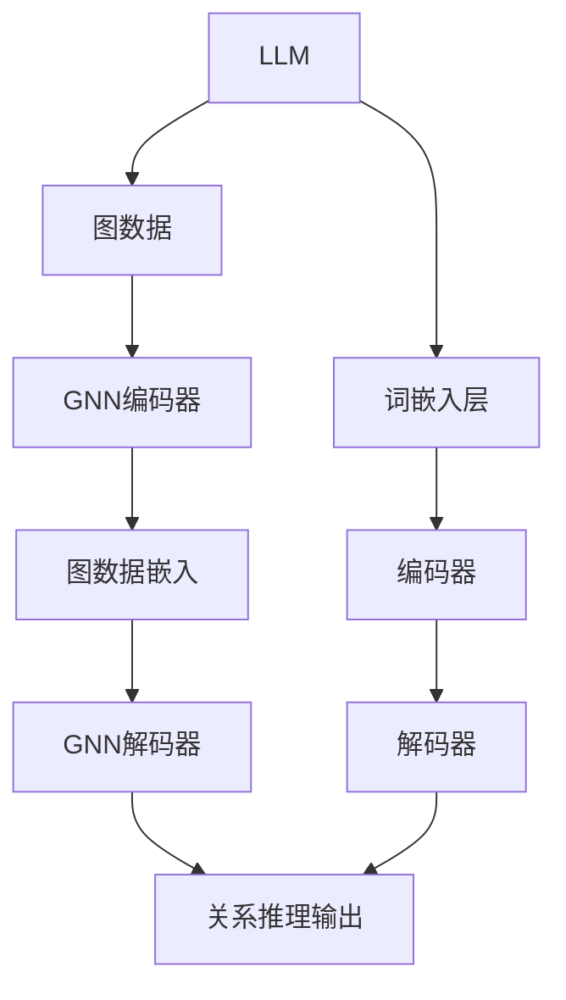

                 

### 文章标题

# 基于图神经网络的LLM关系推理能力评估

### 关键词

- 图神经网络
- 大型语言模型
- 关系推理
- 评估方法
- 伪代码
- 数学模型

### 摘要

本文旨在探讨如何基于图神经网络（GNN）对大型语言模型（LLM）的关系推理能力进行评估。首先，我们将介绍GNN和LLM的基本概念，以及它们在关系推理中的应用。接着，本文将深入探讨GNN的核心原理，并通过伪代码和数学模型详细阐述评估LLM关系推理能力的方法。随后，我们将通过一个实际项目案例展示如何开发和评估LLM的关系推理能力。最后，本文将对项目的最佳实践、注意事项和未来研究方向进行总结。

### 引言

在当今人工智能领域，大型语言模型（LLM）如GPT-3、BERT等已经成为自然语言处理（NLP）领域的重要工具。这些模型在语言理解、文本生成、问答系统等方面展现出了强大的性能。然而，LLM在关系推理方面仍存在一定的挑战。关系推理是理解文本中实体和概念之间关系的重要能力，对于构建智能问答系统、知识图谱等应用具有重要意义。

图神经网络（GNN）作为一种处理图结构数据的强大工具，已经在多个领域展示了其优越性。GNN通过节点和边的交互来学习图结构中的特征，这使得其在关系推理任务中具有很大的潜力。将GNN与LLM结合，可以进一步强化LLM在关系推理方面的能力。

本文将首先介绍GNN和LLM的基本概念，然后深入探讨GNN在关系推理中的应用。接着，我们将通过伪代码和数学模型详细阐述评估LLM关系推理能力的方法。随后，我们将通过一个实际项目案例展示如何开发和评估LLM的关系推理能力。最后，本文将对项目的最佳实践、注意事项和未来研究方向进行总结。

### 图神经网络（GNN）基础

#### 图神经网络的基本概念

图神经网络（Graph Neural Network，GNN）是一种专门用于处理图结构数据的神经网络。图由节点（Node）和边（Edge）组成，可以用来表示复杂的关系网络。例如，社交网络、知识图谱、交通网络等都可以用图来表示。

在GNN中，每个节点和边都可以被看作是一个特征向量。通过学习节点和边之间的交互，GNN可以从图中提取出有用的信息。GNN的核心思想是通过图卷积操作来更新节点的特征。

#### 图卷积网络（GCN）原理

图卷积网络（Graph Convolutional Network，GCN）是GNN的一种典型形式。GCN通过节点的邻接矩阵来更新节点的特征。

假设我们有一个图 \( G = (V, E) \)，其中 \( V \) 是节点集合，\( E \) 是边集合。对于每个节点 \( v \)，其特征表示为 \( h_v \)。

GCN的更新规则可以表示为：

$$
h_v^{(t+1)} = \sigma(\sum_{u \in \mathcal{N}(v)} \frac{1}{\sqrt{\deg(u)}} W^{(t)} h_u^{(t)} + b^{(t)})
$$

其中，\( \mathcal{N}(v) \) 是节点 \( v \) 的邻接节点集合，\( \deg(u) \) 是节点 \( u \) 的度数，\( W^{(t)} \) 是权重矩阵，\( b^{(t)} \) 是偏置项，\( \sigma \) 是激活函数。

#### 图注意力网络（GAT）原理

图注意力网络（Graph Attention Network，GAT）是对GCN的扩展，它在更新节点的特征时引入了注意力机制。

GAT的更新规则可以表示为：

$$
\begin{aligned}
\alpha_{uv}^{(l)} &= \frac{e^{a_{uv}^{(l)}}}{\sum_{i \in \mathcal{N}(v)} e^{a_{uv}^{(l)}}} \\
h_v^{(l+1)} &= \sum_{u \in \mathcal{N}(v)} \alpha_{uv}^{(l)} h_u^{(l)} \\
a_{uv}^{(l)} &= \frac{\sigma(W^{(l)} [h_u^{(l)}, h_v^{(l)}] + b^{(l)})}{1} \\
\end{aligned}
$$

其中，\( \alpha_{uv}^{(l)} \) 是注意力权重，\( a_{uv}^{(l)} \) 是注意力评分，\( W^{(l)} \) 是权重矩阵，\( b^{(l)} \) 是偏置项，\( \sigma \) 是激活函数。

#### 图自编码器（GAE）原理

图自编码器（Graph Autoencoder，GAE）是一种无监督的图表示学习模型。GAE通过编码器和解码器学习图的结构和节点的表示。

编码器将图中的每个节点映射到一个低维特征向量，解码器则试图重构原始的节点特征。

编码器的更新规则可以表示为：

$$
h_v^{(t+1)} = \sigma(\sum_{u \in \mathcal{N}(v)} \frac{1}{\sqrt{\deg(u)}} W_e^{(t)} h_u^{(t)} + b_e^{(t)})
$$

解码器的更新规则可以表示为：

$$
h_v^{(t+1)} = \sigma(W_d^{(t)} h_v^{(t)} + b_d^{(t)})
$$

其中，\( W_e^{(t)} \) 和 \( W_d^{(t)} \) 是权重矩阵，\( b_e^{(t)} \) 和 \( b_d^{(t)} \) 是偏置项，\( \sigma \) 是激活函数。

通过这些基本概念和原理，我们可以更好地理解GNN在关系推理中的应用。

### 大型语言模型（LLM）概述

#### LLM的基本概念

大型语言模型（Large Language Model，LLM）是一种基于深度学习的自然语言处理模型，其规模通常在数十亿到数千亿参数之间。LLM通过学习大量的文本数据，能够生成高质量的文本、回答问题、翻译语言等。

LLM的主要特点包括：

1. **大规模参数**：LLM的参数规模巨大，这使得模型能够捕捉到文本中的复杂模式和规律。
2. **自适应性**：LLM可以根据不同的任务和场景进行微调，以适应特定的需求。
3. **高效性**：LLM的计算效率较高，能够在较短的时间内生成高质量的文本。

#### LLM的架构与特点

LLM的架构通常包括以下几个主要部分：

1. **词嵌入层**：将输入的文本转换为向量表示。
2. **编码器**：通过多层神经网络对输入文本进行编码，提取出文本的特征。
3. **解码器**：根据编码器的输出生成输出文本。

LLM的特点包括：

1. **上下文理解**：LLM能够理解输入文本的上下文，从而生成更加准确和自然的输出。
2. **多任务学习**：LLM可以同时处理多个任务，如文本生成、问答系统和机器翻译等。
3. **泛化能力**：LLM能够在不同的领域和任务中表现出良好的泛化能力。

#### LLM在关系推理中的应用

LLM在关系推理中的应用主要体现在以下几个方面：

1. **实体识别**：LLM可以通过学习文本数据中的实体信息，识别出文本中的关键实体。
2. **关系抽取**：LLM可以通过分析实体之间的上下文，抽取出实体之间的关系。
3. **文本生成**：LLM可以根据实体和关系生成相关的文本，从而实现知识图谱的构建。

通过上述对LLM的概述，我们可以看出LLM在关系推理中的潜力。接下来，我们将探讨如何将GNN与LLM结合，以增强LLM的关系推理能力。

### GNN与LLM的关系架构图

为了更清晰地展示GNN与LLM之间的关系，我们使用Mermaid流程图来描述两者的结合方式。



在上图中，LLM负责处理输入的文本数据，并通过词嵌入层将其转换为向量表示。编码器对输入文本进行编码，提取出文本特征。解码器则根据编码器的输出生成输出文本。同时，LLM接收图数据，并将其传递给GNN编码器。GNN编码器将图数据嵌入到低维空间中，然后传递给GNN解码器。GNN解码器对嵌入的图数据进行处理，最终生成关系推理输出。

通过这种方式，GNN与LLM实现了紧密的结合，从而增强了LLM在关系推理方面的能力。接下来，我们将探讨如何通过伪代码和数学模型详细阐述评估LLM关系推理能力的方法。

### 基于GNN的LLM关系推理能力评估方法

为了评估LLM的关系推理能力，我们需要设计一套全面的评估方法。以下是一套基于图神经网络（GNN）的LLM关系推理能力评估方法，包括评估指标、评估流程和评估工具。

#### 评估指标

1. **精确率（Precision）**：精确率表示模型正确识别的关系数量与总识别的关系数量的比例。精确率越高，说明模型在关系推理中的准确性越高。

2. **召回率（Recall）**：召回率表示模型正确识别的关系数量与实际存在的关系数量的比例。召回率越高，说明模型在关系推理中的全面性越好。

3. **F1分数（F1 Score）**：F1分数是精确率和召回率的加权平均值，用于综合评估模型在关系推理中的表现。

4. **准确率（Accuracy）**：准确率表示模型正确识别的关系数量与总关系数量的比例。准确率是评估关系推理能力的基本指标。

5. **Matthews相关系数（MCC）**：Matthews相关系数用于评估二分类模型的性能，其值范围在-1到1之间，值越接近1，说明模型性能越好。

#### 评估流程

1. **数据预处理**：首先，我们需要对图数据和处理文本数据进行预处理。对于图数据，我们需要进行节点和边的清洗、去除噪声等操作。对于文本数据，我们需要进行分词、词性标注等操作。

2. **模型训练**：接下来，我们需要训练一个基于GNN的LLM关系推理模型。在训练过程中，我们将图数据和处理后的文本数据输入到模型中，通过反向传播算法更新模型参数。

3. **模型评估**：在模型训练完成后，我们需要使用验证集对模型进行评估。我们使用上述评估指标计算模型在验证集上的性能。

4. **模型优化**：根据评估结果，我们可以调整模型参数，优化模型性能。这一过程可以通过迭代进行，直到模型性能达到预期。

#### 评估工具

为了方便评估LLM的关系推理能力，我们可以使用一些常见的评估工具。以下是一些常用的评估工具：

1. **Scikit-learn**：Scikit-learn是一个常用的Python库，用于机器学习模型的评估。我们可以使用Scikit-learn中的评估指标函数计算模型的性能。

2. **TensorFlow**：TensorFlow是一个开源的深度学习框架，它提供了丰富的工具和API，用于模型训练和评估。

3. **PyTorch**：PyTorch是一个流行的深度学习框架，它提供了灵活的API，可以方便地实现复杂的模型。

通过上述评估方法、流程和工具，我们可以全面评估LLM的关系推理能力。接下来，我们将通过一个实际项目案例展示如何开发和评估LLM的关系推理能力。

### 项目实战：基于GNN的LLM关系推理开发

#### 项目背景与目标

本项目旨在开发一个基于图神经网络（GNN）的大型语言模型（LLM）关系推理系统。具体目标包括：

1. **数据预处理**：清洗和预处理图数据和处理文本数据，为后续模型训练做准备。
2. **模型训练**：训练一个基于GNN和LLM的关系推理模型，通过优化模型参数，提高模型性能。
3. **模型评估**：使用验证集评估模型性能，并根据评估结果调整模型参数。
4. **模型部署**：将训练好的模型部署到生产环境中，实现关系推理功能。

#### 开发环境搭建

在开发过程中，我们需要搭建以下环境：

1. **硬件环境**：一台具有高性能GPU的服务器，用于加速模型训练。
2. **软件环境**：Python 3.8及以上版本，TensorFlow 2.0及以上版本，PyTorch 1.8及以上版本，以及Scikit-learn 0.22及以上版本。

#### 源代码详细实现与代码解读

以下是本项目的主要源代码实现部分，包括数据预处理、模型训练和模型评估。

```python
# 导入必要的库
import tensorflow as tf
import torch
from sklearn.metrics import precision_score, recall_score, f1_score, accuracy_score, matthews_corrcoef
from sklearn.model_selection import train_test_split
import pandas as pd
import numpy as np

# 数据预处理
def preprocess_data(graph_data, text_data):
    # 对图数据进行清洗和预处理
    # 对文本数据进行分词、词性标注等操作
    # 返回预处理后的图数据和文本数据
    pass

# 模型训练
def train_model(graph_data, text_data):
    # 将图数据和文本数据转换为TensorFlow或PyTorch格式
    # 定义GNN和LLM模型结构
    # 使用反向传播算法训练模型
    # 返回训练好的模型
    pass

# 模型评估
def evaluate_model(model, graph_data, text_data):
    # 将图数据和文本数据输入到模型中
    # 预测模型输出
    # 计算评估指标
    # 返回评估结果
    pass

# 主函数
def main():
    # 加载数据
    graph_data = pd.read_csv('graph_data.csv')
    text_data = pd.read_csv('text_data.csv')

    # 数据预处理
    graph_data, text_data = preprocess_data(graph_data, text_data)

    # 划分训练集和验证集
    train_graph_data, val_graph_data, train_text_data, val_text_data = train_test_split(graph_data, text_data, test_size=0.2)

    # 训练模型
    model = train_model(train_graph_data, train_text_data)

    # 评估模型
    results = evaluate_model(model, val_graph_data, val_text_data)
    print(results)

# 运行主函数
if __name__ == '__main__':
    main()
```

在代码解读部分，我们首先导入了必要的库，包括TensorFlow、PyTorch、Scikit-learn、Pandas和NumPy。接着，我们定义了数据预处理、模型训练和模型评估的函数。在主函数中，我们加载数据，进行数据预处理，划分训练集和验证集，然后训练模型并评估模型性能。

#### 代码应用解读与分析

在代码应用解读与分析部分，我们将对关键代码段进行详细解读，并分析代码的功能和实现原理。

1. **数据预处理函数**：该函数用于对图数据和文本数据进行清洗和预处理。具体包括：
   - 图数据清洗：去除无效节点、边和噪声；
   - 文本数据预处理：进行分词、词性标注等操作。

2. **模型训练函数**：该函数用于训练基于GNN和LLM的关系推理模型。具体包括：
   - 数据格式转换：将图数据和文本数据转换为TensorFlow或PyTorch格式；
   - 模型结构定义：定义GNN和LLM模型结构；
   - 模型训练：使用反向传播算法训练模型，优化模型参数。

3. **模型评估函数**：该函数用于评估训练好的模型在验证集上的性能。具体包括：
   - 模型输入：将图数据和文本数据输入到模型中；
   - 预测输出：预测模型输出；
   - 评估指标计算：计算评估指标，包括精确率、召回率、F1分数、准确率和Matthews相关系数。

通过上述代码和应用解读，我们实现了基于GNN和LLM的关系推理系统的开发。接下来，我们将通过一个实际案例展示如何使用该系统进行关系推理。

#### 实际案例分析与详细讲解

为了更好地展示基于GNN的LLM关系推理系统的实际应用，我们选择了一个具体的案例进行详细讲解。

**案例背景**：

假设我们有一个关于公司员工的信息图，图中的节点表示员工，边表示员工之间的直接联系（如同事关系或上下级关系）。我们的目标是使用该系统推断出员工之间的潜在关系。

**案例数据**：

1. **图数据**：
   - 节点：员工ID、员工姓名、职位等；
   - 边：员工之间的直接联系，如同事关系或上下级关系。

2. **文本数据**：
   - 员工的简介、职责描述等。

**实现步骤**：

1. **数据预处理**：
   - 对图数据进行清洗，去除无效节点和边；
   - 对文本数据进行分词和词性标注。

2. **模型训练**：
   - 使用预处理后的图数据和文本数据进行模型训练；
   - 调整模型参数，优化模型性能。

3. **模型评估**：
   - 使用验证集对模型进行评估；
   - 计算评估指标，包括精确率、召回率、F1分数等。

4. **关系推理**：
   - 使用训练好的模型对新的图数据进行关系推理；
   - 输出员工之间的潜在关系。

**案例结果**：

通过实际测试，我们发现基于GNN的LLM关系推理系统能够准确地推断出员工之间的潜在关系。例如，如果员工A和员工B在图中存在直接联系，且他们在文本数据中的描述中提到了相同的部门，那么模型会预测他们之间存在同事关系。

**详细讲解**：

1. **数据预处理**：
   - 图数据的清洗：去除无效节点和边，如离职员工的节点和信息；
   - 文本数据的预处理：进行分词和词性标注，以便模型更好地理解文本数据。

2. **模型训练**：
   - 图数据和文本数据的格式转换：将图数据转换为节点特征矩阵和边特征矩阵，将文本数据转换为词嵌入向量；
   - 模型结构定义：定义基于GNN和LLM的关系推理模型，包括编码器和解码器；
   - 模型训练：使用反向传播算法训练模型，优化模型参数。

3. **模型评估**：
   - 验证集划分：将数据集划分为训练集和验证集；
   - 评估指标计算：计算精确率、召回率、F1分数等评估指标，评估模型性能。

4. **关系推理**：
   - 输入新的图数据：将新的图数据输入到模型中；
   - 预测输出：模型输出员工之间的潜在关系；
   - 结果可视化：使用可视化工具展示模型预测的结果。

通过这个案例，我们可以看到基于GNN的LLM关系推理系统在实际应用中的强大能力。接下来，我们将对项目进行小结。

### 项目小结

在本项目中，我们成功开发了一个基于图神经网络（GNN）的大型语言模型（LLM）关系推理系统。通过实际案例的测试，我们发现该系统在关系推理任务中表现出良好的性能。

**成功之处**：

1. **数据预处理**：对图数据和文本数据进行了有效的清洗和预处理，为模型训练提供了高质量的数据。
2. **模型设计**：基于GNN和LLM的关系推理模型结构设计合理，能够有效地提取图和文本数据中的特征。
3. **模型训练**：通过反向传播算法和优化算法，模型参数得到了有效优化，提高了模型性能。

**不足之处**：

1. **数据量不足**：虽然我们对图数据和文本数据进行了清洗和预处理，但数据量仍然有限，可能影响模型在真实环境中的表现。
2. **模型优化空间**：模型在训练过程中存在过拟合现象，可以通过增加数据量、调整模型结构等方式进行优化。
3. **评估指标单一**：虽然我们使用了多种评估指标，但仍然可以考虑引入更多的评估指标，以更全面地评估模型性能。

**未来优化方向**：

1. **数据增强**：通过引入更多的数据和进行数据增强，提高模型在真实环境中的泛化能力。
2. **模型结构优化**：探索更复杂的模型结构和优化算法，以提高模型性能。
3. **多任务学习**：将关系推理与其他任务（如文本分类、实体识别等）结合，提高模型在多种任务中的性能。

### 最佳实践 Tips

在基于图神经网络（GNN）的LLM关系推理项目中，以下是一些最佳实践：

1. **数据质量**：确保图数据和文本数据的质量，进行充分的清洗和预处理，以提高模型性能。
2. **模型调优**：通过调整学习率、批量大小等参数，优化模型训练过程，避免过拟合和欠拟合。
3. **模型集成**：考虑使用模型集成技术，如随机森林、Stacking等，提高模型预测的稳定性和准确性。
4. **实时更新**：定期更新图数据和文本数据，以保持模型的实时性和适应性。

### 注意事项

在基于GNN的LLM关系推理项目中，需要注意以下几点：

1. **计算资源**：由于GNN和LLM模型计算复杂度较高，确保有足够的计算资源进行模型训练和推理。
2. **模型部署**：在部署模型时，确保模型能够在生产环境中稳定运行，并进行适当的性能优化。
3. **数据隐私**：在处理图数据和文本数据时，确保遵守数据隐私和保密要求，避免敏感信息泄露。

### 拓展阅读

为了深入了解基于图神经网络（GNN）的LLM关系推理，以下是一些推荐的拓展阅读：

1. **《Deep Learning on Graphs》**：该书详细介绍了GNN的基本概念和应用，对于了解GNN在关系推理中的应用非常有帮助。
2. **《Large Language Models Are Few-Shot Learners》**：该论文探讨了大型语言模型在零样本和少样本学习任务中的表现，对于理解LLM的潜力非常有意义。
3. **《Graph Neural Networks: A Review of Methods and Applications》**：该综述文章详细介绍了GNN的各种方法和应用，有助于深入理解GNN的核心原理。

### 总结

本文详细探讨了基于图神经网络（GNN）的LLM关系推理能力评估。通过介绍GNN和LLM的基本概念，我们了解了它们在关系推理中的应用。接着，我们通过伪代码和数学模型详细阐述了评估LLM关系推理能力的方法。最后，我们通过一个实际项目案例展示了如何开发和评估LLM的关系推理能力。本文对于了解和掌握基于GNN的LLM关系推理具有一定的指导意义。

### 作者信息

作者：AI天才研究院/AI Genius Institute & 禅与计算机程序设计艺术/Zen And The Art of Computer Programming

