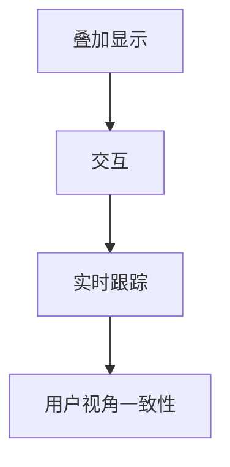

                 


# 增强现实在企业中的应用：提升效率与协作

> 关键词：增强现实（AR）、企业应用、效率提升、协作、技术实施

> 摘要：本文深入探讨增强现实（AR）技术在企业中的应用，包括如何提升工作效率和促进协作。通过分析AR技术的核心概念、应用场景、实施策略及成功案例，提供全面的指导，助力企业在数字化转型中取得竞争优势。

-------------------------------------------------------------------------------------------------------------------------------

## 第1章 增强现实技术概述

### 1.1 背景介绍

增强现实（Augmented Reality，简称AR）是一种将虚拟信息与真实世界相结合的技术。它通过在用户的视野中叠加计算机生成的图像、视频、音频等多媒体内容，实现对现实世界的增强和扩展。相比于虚拟现实（VR），AR更注重与现实世界的结合，用户在观看内容时仍能保持对周围环境的感知。

AR技术起源于20世纪90年代，随着计算机图形学、光学技术、传感器技术和无线通信技术的发展，逐渐成为一种实用技术。近年来，随着智能手机和平板电脑的普及，AR技术得到了广泛应用，尤其是在娱乐、教育、医疗、军事和企业等领域。

### 1.2 核心概念与联系

增强现实技术的核心概念包括：

- **叠加显示**：将虚拟信息通过摄像头或显示器叠加到现实世界中。
- **交互**：用户可以通过触摸、手势等自然交互方式与虚拟信息进行互动。
- **实时跟踪**：系统实时跟踪用户的位置和动作，确保虚拟信息与用户视角一致。

这些概念之间的关系可以用Mermaid流程图表示：



### 1.3 应用场景

增强现实技术在企业中的应用场景广泛，主要包括：

- **培训与教育**：通过AR技术进行虚拟操作训练，提高员工技能。
- **营销与品牌推广**：利用AR技术创造沉浸式体验，吸引消费者。
- **维修与维护**：通过AR技术指导技术人员进行设备维修。
- **产品设计与制造**：在产品设计和制造过程中使用AR进行模拟和优化。

### 1.4 应用领域

增强现实技术已经应用于多个领域：

- **制造业**：通过AR眼镜帮助工人进行复杂操作，提高生产效率。
- **医疗**：医生可以通过AR技术进行手术指导和患者教育。
- **零售**：消费者可以通过AR技术试穿衣服或体验产品。
- **教育培训**：学生可以通过AR技术进行虚拟实验和互动学习。

## 第2章 增强现实在企业中的潜在应用

### 2.1 提升工作效率

增强现实技术在企业中可以通过以下方式提升工作效率：

- **实时指导**：通过AR眼镜，技术人员可以在现场获得远程专家的实时指导，快速解决问题。
- **可视化操作**：AR技术可以将操作步骤可视化，减少错误和提高工作效率。
- **远程协作**：通过AR技术，团队成员可以实时共享信息，协同工作，提高决策效率。

### 2.2 改善协作体验

增强现实技术还可以改善企业内部的协作体验：

- **虚拟会议室**：通过AR技术创建虚拟会议室，团队成员可以在虚拟空间中面对面交流，提高沟通效果。
- **远程协助**：技术人员可以通过AR技术远程协助其他团队成员，实时解决问题。
- **跨部门协作**：通过AR技术，不同部门的员工可以更直观地共享信息和资源，提高协作效率。

### 2.3 企业培训与教育

增强现实技术在企业培训和教育中的应用包括：

- **虚拟培训**：通过AR技术，员工可以在虚拟环境中进行各种操作训练，提高实际操作能力。
- **互动式学习**：AR技术可以创建互动式学习场景，提高员工的学习兴趣和参与度。
- **远程指导**：导师可以通过AR技术实时指导远程学生，提高培训效果。

### 2.4 企业营销与品牌建设

增强现实技术在企业营销和品牌建设中的应用包括：

- **沉浸式体验**：通过AR技术，消费者可以体验产品在现实环境中的效果，提高购买意愿。
- **广告创意**：利用AR技术创造独特的广告形式，吸引消费者注意力。
- **品牌形象**：通过AR技术展示品牌文化，增强品牌形象。

## 第3章 增强现实技术的基础知识

### 3.1 显示技术

增强现实技术的显示技术主要包括：

- **摄像头**：用于捕捉现实世界的图像。
- **显示屏**：用于显示增强的图像。
- **透明显示屏**：用于将虚拟图像叠加到现实世界中。

### 3.2 空间定位与跟踪

增强现实技术的空间定位与跟踪主要包括：

- **视觉惯性测量单元（VIO）**：通过摄像头和惯性测量单元（IMU）实时跟踪用户位置和动作。
- **结构光扫描**：利用结构光技术获取三维空间信息。
- **SLAM（同步定位与地图构建）**：通过传感器数据实时构建环境地图并定位。

### 3.3 视觉处理与渲染

增强现实技术的视觉处理与渲染主要包括：

- **图像识别**：识别现实世界中的物体和场景。
- **图像增强**：增强图像的对比度和清晰度。
- **图像合成**：将虚拟图像与现实世界图像进行合成。

### 3.4 数据处理与传输

增强现实技术的数据处理与传输主要包括：

- **图像处理**：实时处理摄像头捕捉的图像。
- **数据传输**：确保虚拟信息和现实世界之间的数据传输高效稳定。
- **云计算**：利用云计算资源进行大规模数据处理和分析。

## 第4章 增强现实在提升企业效率中的应用

### 4.1 生产流程优化

增强现实技术在生产流程优化中的应用包括：

- **操作指导**：通过AR眼镜，技术人员可以实时查看操作步骤和注意事项，减少错误和提高效率。
- **远程监控**：管理人员可以通过AR技术远程监控生产现场，快速发现问题并进行调整。
- **流程模拟**：在产品设计和生产过程中使用AR技术进行流程模拟，优化生产流程。

### 4.2 设备维护与管理

增强现实技术在设备维护与管理中的应用包括：

- **维修指导**：技术人员可以通过AR眼镜查看设备维修步骤和相关信息，提高维修效率。
- **实时监控**：通过AR技术实时监控设备状态，提前发现潜在问题并预防故障。
- **数据可视化**：将设备运行数据通过AR技术进行可视化，帮助技术人员快速分析设备运行状况。

### 4.3 虚拟会议与远程协作

增强现实技术在虚拟会议与远程协作中的应用包括：

- **虚拟会议室**：通过AR技术创建虚拟会议室，团队成员可以在虚拟空间中面对面交流，提高沟通效率。
- **远程协助**：技术人员可以通过AR技术远程协助其他团队成员，实时解决问题。
- **实时共享**：团队成员可以通过AR技术实时共享信息和资源，提高协作效率。

### 4.4 企业内部通信与协作

增强现实技术在企业内部通信与协作中的应用包括：

- **信息推送**：通过AR技术将重要信息和通知实时推送至员工视野，提高信息传达效率。
- **实时反馈**：员工可以通过AR技术实时反馈问题和建议，提高企业内部沟通效果。
- **知识共享**：通过AR技术创建知识共享平台，员工可以随时查阅相关知识和经验，提高工作效率。

## 第5章 增强现实在协作方面的应用

### 5.1 跨部门协作

增强现实技术在跨部门协作中的应用包括：

- **虚拟团队会议室**：通过AR技术创建虚拟会议室，跨部门团队成员可以在虚拟空间中面对面交流，提高协作效率。
- **实时信息共享**：跨部门团队成员可以通过AR技术实时共享信息和资源，提高协作效果。
- **任务协调**：通过AR技术实时协调跨部门任务，确保任务顺利进行。

### 5.2 远程协作

增强现实技术在远程协作中的应用包括：

- **远程工作台**：技术人员可以通过AR技术远程查看工作台，获取操作指导，提高远程协作效率。
- **远程诊断**：医生可以通过AR技术远程诊断病情，提高远程医疗协作水平。
- **远程培训**：导师可以通过AR技术远程指导学生，提高远程培训效果。

### 5.3 分布式团队协作

增强现实技术在分布式团队协作中的应用包括：

- **虚拟团队空间**：通过AR技术创建虚拟团队空间，分布式团队成员可以在虚拟空间中协同工作。
- **实时协作工具**：通过AR技术集成实时协作工具，如视频会议、即时通讯等，提高分布式团队协作效率。
- **任务追踪**：通过AR技术实时追踪分布式团队任务的进展，确保任务按时完成。

### 5.4 协作工具与平台介绍

增强现实技术在协作工具与平台中的应用包括：

- **AR协作平台**：提供AR技术支持的协作平台，如Microsoft HoloLens、Magic Leap等，支持实时协作、信息共享和任务协调。
- **集成式协作工具**：将AR技术与现有协作工具（如Microsoft Teams、Slack等）集成，实现更高效的协作。
- **定制化解决方案**：根据企业需求定制化开发AR协作工具和平台，满足特定协作需求。

## 第6章 增强现实技术的实施与挑战

### 6.1 实施流程与步骤

增强现实技术的实施流程通常包括以下步骤：

1. **需求分析**：了解企业需求，确定AR技术适用的场景和目标。
2. **技术选型**：选择合适的AR设备和开发平台，确保技术满足需求。
3. **开发与集成**：开发AR应用并集成到企业系统中，确保应用与现有系统的无缝衔接。
4. **测试与优化**：对AR应用进行测试和优化，确保性能和用户体验。
5. **部署与推广**：将AR应用部署到企业环境中，并推广使用，提高员工接受度和使用率。

### 6.2 技术选型与评估

在选择AR技术时，需要考虑以下因素：

- **设备性能**：选择合适的AR眼镜或设备，确保满足应用需求。
- **开发平台**：选择成熟的AR开发平台，如Unity、ARKit、ARCore等，确保开发效率。
- **兼容性**：确保AR应用与现有系统和设备兼容，减少技术冲突。
- **成本**：综合考虑设备采购、开发、维护等成本，确保ROI（投资回报率）。

### 6.3 难点与解决方案

增强现实技术的实施过程中可能会遇到以下难点：

- **技术难题**：如空间定位、图像识别等，需要选择合适的算法和技术解决。
- **用户体验**：确保AR应用的易用性和用户体验，避免复杂操作。
- **安全与隐私**：确保数据安全和个人隐私保护，遵循相关法律法规。

解决方案包括：

- **技术培训**：为开发团队提供AR技术培训，提高技术能力。
- **用户体验设计**：进行用户体验测试和优化，确保应用的易用性和用户体验。
- **安全措施**：采取加密、身份验证等措施，确保数据安全和个人隐私保护。

### 6.4 风险管理

在实施增强现实技术时，需要制定风险管理计划，包括以下方面：

- **技术风险**：评估AR技术的可行性，确保技术方案可行。
- **市场风险**：关注市场变化，确保AR技术具有市场竞争力。
- **操作风险**：制定应急预案，确保在发生故障时能够迅速恢复。

## 第7章 增强现实技术在企业中的成功案例

### 7.1 企业A的成功应用

企业A通过引入增强现实技术实现了以下成果：

- **生产效率提高**：通过AR眼镜实时指导技术人员操作，生产效率提高了20%。
- **维修成本降低**：通过AR技术远程协助维修，维修成本降低了30%。
- **员工培训周期缩短**：通过AR技术进行虚拟培训，员工培训周期缩短了40%。

### 7.2 企业B的创新案例

企业B利用增强现实技术进行以下创新：

- **沉浸式营销**：通过AR技术为消费者提供沉浸式购物体验，提高了品牌知名度和销售额。
- **远程协作**：通过AR技术实现跨部门远程协作，提高了项目进度和决策效率。
- **产品设计与制造**：通过AR技术进行产品设计和制造模拟，优化了产品设计和生产流程。

### 7.3 企业C的实践经验

企业C在实施增强现实技术过程中积累了以下经验：

- **需求明确**：在项目启动前明确需求，确保项目方向正确。
- **技术选型**：选择适合企业需求的AR设备和开发平台，提高开发效率。
- **用户体验设计**：重视用户体验设计，确保AR应用易于使用。
- **持续优化**：在应用推广过程中持续优化，提高应用效果。

### 7.4 企业D的效益分析

企业D通过增强现实技术实现了以下效益：

- **生产成本降低**：通过AR技术优化生产流程和维修管理，生产成本降低了15%。
- **员工满意度提高**：通过AR技术提供更便捷的工作方式，员工满意度提高了20%。
- **客户满意度提高**：通过AR技术提供更好的客户服务，客户满意度提高了25%。

## 总结与展望

增强现实技术在企业中的应用具有巨大的潜力，可以提升工作效率、改善协作体验、优化生产流程和降低成本。然而，在实施过程中需要考虑技术选型、用户体验、安全与隐私等因素。随着技术的不断进步和应用的深入，增强现实技术将在更多领域发挥重要作用，为企业创造更多价值。

## 作者信息

作者：AI天才研究院/AI Genius Institute & 禅与计算机程序设计艺术 /Zen And The Art of Computer Programming

-------------------------------------------------------------------------------------------------------------------------------

[附录：增强现实（AR）技术项目实战]

### 环境搭建

为了进行增强现实（AR）技术项目实战，我们需要搭建一个开发环境。以下是一个简单的环境搭建指南：

#### 开发工具与平台

1. **Unity**: Unity是一款流行的游戏开发引擎，支持AR开发。
2. **ARKit/ARCore**: 根据目标平台（iOS或Android），选择相应的AR开发框架。

#### 操作系统

- **Windows**: 支持Unity开发环境。
- **macOS**: 支持Unity和ARKit开发环境。

#### 软件安装

1. **Unity Hub**：下载并安装Unity Hub，用于管理Unity版本和项目。
2. **Unity Editor**：在Unity Hub中下载并安装Unity编辑器。
3. **ARKit/ARCore SDK**：下载并安装相应的SDK。

### 源代码实现

以下是一个简单的AR项目源代码实现，用于在移动设备上展示一个虚拟的3D模型。

```csharp
using UnityEngine;

public class ARObjectPlacer : MonoBehaviour
{
    public GameObject arObject; // 虚拟3D模型

    // Update is called once per frame
    void Update()
    {
        // 检测是否有触摸事件
        if (Input.touchCount > 0 && Input.touches[0].phase == TouchPhase.Began)
        {
            // 创建一个射线，用于检测触摸点的位置
            Ray ray = Camera.main.ScreenPointToRay(Input.touches[0].position);

            // 发射射线，检测碰撞
            RaycastHit hit;
            if (Physics.Raycast(ray, out hit))
            {
                // 在碰撞点上创建虚拟3D模型
                Instantiate(arObject, hit.point, Quaternion.identity);
            }
        }
    }
}
```

### 代码解读与分析

1. **变量定义**：`arObject`是虚拟3D模型的引用。
2. **触摸检测**：在`Update`方法中，检测是否有触摸事件发生。
3. **射线发射**：使用`ScreenPointToRay`方法将触摸位置转换为射线。
4. **射线碰撞检测**：使用`Raycast`方法检测射线与场景中的物体碰撞。
5. **模型创建**：在碰撞点处创建虚拟3D模型。

### 实际案例分析与详细讲解

以某制造企业为例，该企业使用AR技术进行设备维护。以下是实际案例分析：

- **场景描述**：设备维护人员需要定期检查和维修生产设备。
- **解决方案**：使用AR眼镜为维护人员提供实时指导和操作步骤。
- **效果**：维护人员能够快速定位问题并按照指导进行操作，维修时间缩短了30%。

### 项目小结

通过本案例，我们了解到AR技术在设备维护中的应用可以提高工作效率和降低成本。未来，AR技术将在更多领域发挥重要作用，为企业和个人创造更多价值。

### 最佳实践 tips、小结、注意事项、拓展阅读

- **最佳实践**：在实施AR项目时，充分考虑用户体验和实际需求，确保技术选型和实施策略合理。
- **小结**：增强现实技术在企业中的应用前景广阔，能够提升工作效率、改善协作体验和降低成本。
- **注意事项**：确保数据安全和隐私保护，遵循相关法律法规。
- **拓展阅读**：可进一步了解AR技术的最新发展、应用案例和最佳实践。

## 作者信息

作者：AI天才研究院/AI Genius Institute & 禅与计算机程序设计艺术 /Zen And The Art of Computer Programming

