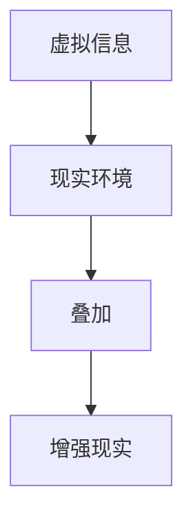
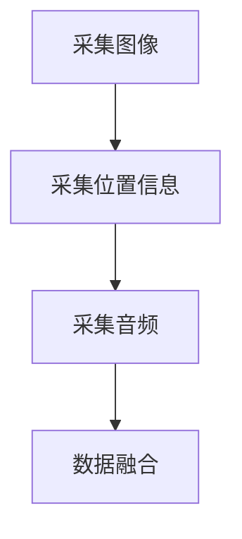
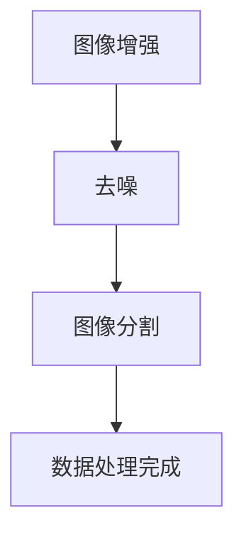
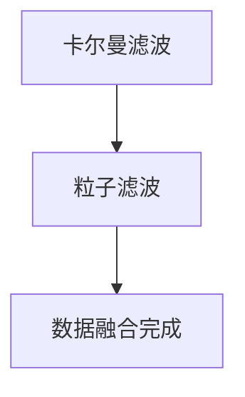
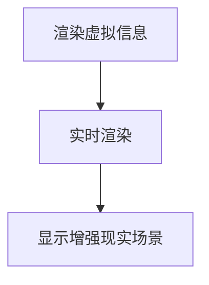
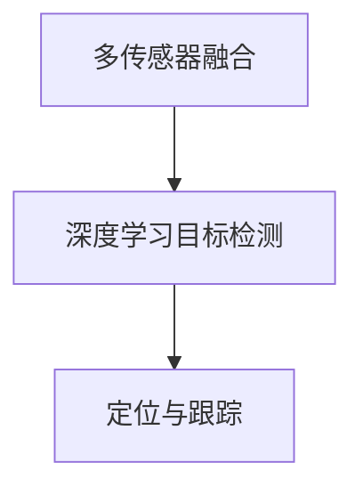
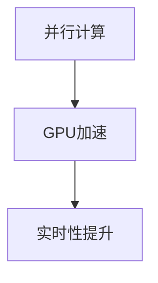
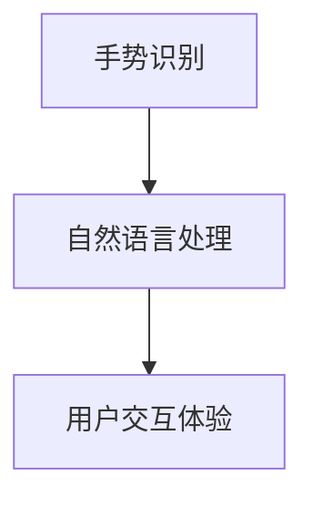

                 

### 文章标题

增强现实在文化遗产保护中的应用

### 关键词

增强现实（AR）、文化遗产、数字化展示、虚拟修复、互动体验

### 摘要

本文将探讨增强现实（AR）技术在文化遗产保护中的应用。首先，我们将简要介绍增强现实技术的基本原理及其发展历程。接着，我们将讨论文化遗产保护的重要性，以及文化遗产面临的威胁。随后，文章将详细分析增强现实在文化遗产保护中的多种应用场景，包括文物数字化展示、虚拟修复与复原、文物互动体验和文化遗产教育。在此基础上，我们将探讨增强现实技术在实现这些应用中的技术难点和挑战，并通过实际案例分享来展示增强现实在文化遗产保护中的成功应用。最后，我们将对增强现实技术在文化遗产保护中的未来发展趋势进行展望。

## 第1章 增强现实技术概述

### 1.1 什么是增强现实（AR）

增强现实（Augmented Reality，简称 AR）是一种将虚拟信息与现实环境叠加的计算机技术。通过AR技术，用户能够看到增强过的现实场景，这些场景包含计算机生成的图像、视频、文字等信息。这种技术与虚拟现实（VR）不同，VR是完全沉浸在虚拟环境中，而AR则是在现实世界的基础上进行信息增强。

#### 核心概念与联系

1. **虚拟信息**：通过计算机生成的图像、视频、文字等。
2. **现实环境**：用户所处的外部世界。
3. **叠加**：将虚拟信息与现实环境中的物体或场景进行融合。

为了更好地理解增强现实的核心概念，我们可以使用Mermaid流程图来表示其关系架构：



#### 发展历程

增强现实技术起源于20世纪50年代，由美国科学家道格拉斯·恩格尔巴特（Douglas Engelbart）首次提出。随着时间的推移，计算机技术、图像处理和传感器技术的进步，AR技术逐渐成熟并应用于多个领域。

- **20世纪60年代**：AR技术的概念进一步发展，出现了第一个AR系统。
- **20世纪90年代**：随着计算机硬件和软件的进步，AR技术开始应用于军事和医疗领域。
- **21世纪**：随着智能手机和移动设备的普及，AR技术逐渐走入大众视野，并开始应用于娱乐、教育、医疗、文化遗产保护等领域。

### 1.2 增强现实技术的基本原理

增强现实技术的实现涉及多个关键技术，包括图像识别、实时渲染、传感器融合等。以下是这些技术的基本原理：

#### 图像识别

图像识别是AR技术的核心之一，它负责检测和识别现实环境中的物体或场景。常用的图像识别技术包括：

1. **特征检测**：通过检测图像中的特征点（如角点、边缘等）来确定物体的位置和姿态。
2. **模板匹配**：将现实环境中的图像与预定义的模板进行匹配，以识别特定物体。

#### 实时渲染

实时渲染是增强现实技术中另一个关键环节，它负责将虚拟信息与现实环境进行实时融合。实时渲染的基本原理包括：

1. **三维模型构建**：通过三维建模软件或扫描设备，将物体或场景构建为三维模型。
2. **纹理映射**：将二维纹理映射到三维模型表面，使其更加真实。
3. **光照计算**：模拟真实环境中的光照条件，使虚拟信息与现实环境更加协调。

#### 传感器融合

传感器融合是增强现实技术的关键，它负责将多种传感器数据（如摄像头、GPS、加速度计、陀螺仪等）进行融合，以提供准确的环境信息。传感器融合的基本原理包括：

1. **传感器数据融合**：将不同传感器的数据（如位置、速度、方向等）进行融合，以提高系统的精度和稳定性。
2. **卡尔曼滤波**：利用卡尔曼滤波算法对传感器数据进行滤波处理，以消除噪声和误差。

#### 增强现实技术的实现流程

增强现实技术的实现流程通常包括以下几个步骤：

1. **环境感知**：通过传感器收集现实环境中的图像、位置、姿态等信息。
2. **图像识别**：利用图像识别技术检测和识别现实环境中的物体或场景。
3. **虚拟信息生成**：根据识别结果，生成相应的虚拟信息（如三维模型、文字、图像等）。
4. **实时渲染**：将虚拟信息与现实环境进行实时融合，生成增强现实场景。
5. **显示与交互**：通过显示设备（如智能手机、AR眼镜等）将增强现实场景呈现给用户，并实现与用户的交互。

### 1.3 增强现实技术的分类

增强现实技术根据应用场景和实现方式的不同，可以分为以下几类：

#### **1.1 移动增强现实（Mobile AR）**

移动增强现实主要应用于智能手机和平板电脑等移动设备。通过在设备上安装AR应用，用户可以实时看到增强过的现实场景。例如，使用AR应用查看地图、导航、购物指南等。

#### **1.2 增强虚拟现实（Augmented Virtual Reality，简称 AVR）**

增强虚拟现实将虚拟环境和现实世界进行混合，用户可以在虚拟环境中看到增强过的现实物体。这种技术常用于虚拟现实游戏、教育模拟等领域。

#### **1.3 混合现实（Mixed Reality，简称 MR）**

混合现实是一种更加沉浸式的增强现实技术，它不仅将虚拟信息叠加到现实环境中，还可以与虚拟物体进行互动。MR技术广泛应用于医疗、工程、设计等领域。

#### **1.4 头戴式增强现实（Head-Mounted Display AR，简称 HMD-AR）**

头戴式增强现实设备（如AR眼镜）将虚拟信息直接叠加到用户的视野中，提供更加沉浸式的体验。这种技术常用于军事、医疗、娱乐等领域。

### 1.4 增强现实技术的现状与发展趋势

随着技术的不断进步，增强现实技术在各个领域取得了显著的应用成果。以下是增强现实技术的现状与发展趋势：

#### **现状**

1. **技术应用广泛**：增强现实技术已经广泛应用于娱乐、教育、医疗、文化遗产保护等领域。
2. **硬件设备发展迅速**：随着AR设备的不断普及，如AR眼镜、AR手机等硬件设备的技术也在不断提升。
3. **内容丰富多样**：增强现实应用的内容日益丰富，从简单的信息展示到复杂的互动体验，应用场景不断拓展。

#### **发展趋势**

1. **技术不断进步**：随着人工智能、计算机视觉、传感器技术等的发展，增强现实技术将变得更加成熟和稳定。
2. **应用领域扩展**：增强现实技术将在更多领域得到应用，如工业制造、智能交通、智能家居等。
3. **用户体验提升**：随着硬件设备的提升和内容的丰富，用户的增强现实体验将得到显著改善。
4. **产业发展壮大**：随着增强现实技术的普及和应用，相关产业将不断壮大，创造更多就业机会和商业价值。

## 第2章 文化遗产保护的重要性

### 2.1 文化遗产的定义与价值

文化遗产是指人类在历史上创造的、具有独特价值的文化成果。这些成果不仅反映了人类的历史、文化和社会发展，还蕴含着丰富的知识、技术和审美价值。根据联合国教科文组织的定义，文化遗产包括物质文化遗产和非物质文化遗产。

#### 物质文化遗产

物质文化遗产是指具有历史、艺术和科学价值的物质对象和遗址，如建筑物、雕塑、文物、遗址等。这些物质遗产是文化传承的重要载体，反映了人类在不同历史时期的建筑风格、艺术成就和社会发展。

#### 非物质文化遗产

非物质文化遗产是指具有历史、文化和艺术价值的非物质文化表现形式，如传统音乐、舞蹈、戏剧、文学、节庆、习俗等。这些非物质文化遗产是文化多样性的重要体现，是民族和人类共同的文化财富。

#### 文化遗产的价值

文化遗产的价值体现在多个方面：

1. **历史价值**：文化遗产是历史的见证，记录了人类的发展历程和文化传承。
2. **文化价值**：文化遗产是民族文化的重要组成部分，反映了民族的传统、习俗和审美观念。
3. **艺术价值**：文化遗产中的艺术品具有独特的艺术价值，是艺术创作和研究的宝贵资源。
4. **科学价值**：文化遗产中的物质和非物质文化遗产包含了丰富的知识和技术，对科学研究具有重要意义。
5. **教育价值**：文化遗产是教育的宝贵资源，通过传承和弘扬文化遗产，可以增强民族自豪感和文化认同感。

### 2.2 文化遗产面临的威胁

尽管文化遗产具有重要的价值和意义，但它们也面临着诸多威胁和挑战：

#### 自然因素

1. **自然灾害**：如地震、洪水、飓风等自然灾害对文化遗产造成破坏。
2. **环境变化**：如气候变化导致的干旱、湿润等环境变化，对文化遗产的保存造成影响。

#### 人为因素

1. **人类活动**：如城市建设、工业污染、过度旅游等，对文化遗产造成破坏。
2. **战争冲突**：战争和冲突对文化遗产造成毁灭性打击，导致大量文化遗产丧失。
3. **盗窃和走私**：文化遗产盗窃和走私活动严重威胁着文化遗产的保护。

#### 技术挑战

1. **数字化保护**：随着数字化技术的发展，文化遗产的数字化保存和保护面临新的挑战。
2. **技术瓶颈**：现有的保护技术和方法在某些情况下无法满足文化遗产的保护需求。

#### 法律问题

1. **法律制度**：文化遗产保护法律法规的不完善，导致文化遗产保护缺乏有效保障。
2. **执法力度**：文化遗产保护执法力度不足，对违法行为的打击不力。

### 2.3 文化遗产保护的重要性

文化遗产保护具有重要的现实意义和深远的历史意义：

#### 现实意义

1. **文化传承**：文化遗产是文化传承的重要载体，通过保护文化遗产，可以传承和弘扬民族优秀文化。
2. **社会和谐**：文化遗产是民族认同和文化认同的重要基础，通过保护文化遗产，可以增强社会和谐与民族凝聚力。
3. **经济发展**：文化遗产保护和旅游业的发展密切相关，通过开发文化遗产旅游，可以带动当地经济发展。
4. **教育功能**：文化遗产是教育的宝贵资源，通过文化遗产教育，可以提高公众的文化素养和审美水平。

#### 历史意义

1. **历史见证**：文化遗产是历史的见证，通过保护文化遗产，可以保存人类的历史记忆，为后代提供珍贵的历史资料。
2. **文明传承**：文化遗产是人类文明的重要组成部分，通过保护文化遗产，可以传承和弘扬人类文明成果。
3. **文化多样性**：文化遗产是文化多样性的体现，通过保护文化遗产，可以维护世界文化的多样性。

## 第3章 增强现实在文化遗产保护中的应用场景

增强现实（AR）技术在文化遗产保护中的应用具有广泛的前景和潜力，它不仅能够为文化遗产的展示提供全新的视角，还能够为保护和传承文化遗产提供创新的解决方案。以下是增强现实技术在文化遗产保护中的几种主要应用场景：

### 3.1 文物数字化展示

#### 核心概念与联系

- **文物数字化展示**：通过AR技术，将文物的三维模型或高分辨率图像与现实环境进行叠加，使用户能够在虚拟与现实的交互中获得更加直观和丰富的体验。
- **核心概念联系**：文物的三维数字化模型与现实环境的叠加，不仅保留了文物的真实形态，还增强了其可视化和互动性。

#### 核心算法原理讲解与伪代码

为了实现文物的数字化展示，首先需要获取文物的三维模型，然后将其与用户所在环境进行定位和叠加。以下是核心算法原理的伪代码：

```plaintext
// 获取三维模型
model = load_3D_model(w文物_id)

// 获取用户位置和视角
user_position, user_orientation = get_user_position_and_orientation()

// 定位文物模型
model_position = calculate_model_position(user_position, model_position)

// 渲染文物模型
render_model(model, model_position, user_orientation)
```

#### 数学模型和公式与详细讲解与举例说明

在文物数字化展示中，关键的技术挑战之一是模型与现实环境的精确对齐。以下是使用齐次坐标表示的模型定位公式：

$$
\mathbf{T} = \mathbf{K}^{-1} \mathbf{C} \mathbf{P}_{model}
$$

其中，$\mathbf{T}$ 是模型在现实环境中的位置，$\mathbf{K}$ 是相机内参矩阵，$\mathbf{C}$ 是相机位姿矩阵，$\mathbf{P}_{model}$ 是模型在相机坐标系中的位置。

举例来说，如果已知相机内参矩阵 $\mathbf{K}$ 和相机位姿矩阵 $\mathbf{C}$，以及模型在相机坐标系中的位置 $\mathbf{P}_{model}$，则可以通过上述公式计算出模型在现实环境中的位置 $\mathbf{T}$。

### 3.2 虚拟修复与复原

#### 核心概念与联系

- **虚拟修复与复原**：利用AR技术，在虚拟环境中对受损的文物进行修复和复原，使用户能够观察到文物的原貌，并进行深入的研究和分析。
- **核心概念联系**：虚拟修复不仅是对文物外观的恢复，更是对文物历史和文化价值的保护和传承。

#### 核心算法原理讲解与伪代码

虚拟修复与复原的关键在于对文物的三维模型进行修复，然后将其与现实环境进行叠加。以下是核心算法原理的伪代码：

```plaintext
// 获取受损文物模型
damaged_model = load_3D_model(w文物_id)

// 获取修复后的模型
restored_model = repair_3D_model(damaged_model)

// 获取用户位置和视角
user_position, user_orientation = get_user_position_and_orientation()

// 定位修复后的模型
model_position = calculate_model_position(user_position, restored_model_position)

// 渲染修复后的模型
render_model(restored_model, model_position, user_orientation)
```

#### 数学模型和公式与详细讲解与举例说明

在虚拟修复与复原中，关键的技术挑战是对三维模型的精确修复。以下是使用贝叶斯滤波进行三维模型修复的公式：

$$
\mathbf{X}_{new} = \mathbf{X}_{old} + \mathbf{K} (\mathbf{X}_{candidate} - \mathbf{X}_{old})
$$

其中，$\mathbf{X}_{new}$ 是修复后的模型，$\mathbf{X}_{old}$ 是受损的模型，$\mathbf{X}_{candidate}$ 是修复候选模型，$\mathbf{K}$ 是修复权重。

举例来说，如果已知受损模型 $\mathbf{X}_{old}$ 和修复候选模型 $\mathbf{X}_{candidate}$，以及修复权重 $\mathbf{K}$，则可以通过上述公式计算出修复后的模型 $\mathbf{X}_{new}$。

### 3.3 文物互动体验

#### 核心概念与联系

- **文物互动体验**：通过AR技术，用户可以与文物进行交互，如触摸、旋转、放大等，从而获得更加沉浸式的体验。
- **核心概念联系**：文物的互动性不仅增强了用户的参与感，还提高了文物的教育价值和娱乐性。

#### 核心算法原理讲解与伪代码

实现文物的互动体验需要识别用户的手势或动作，并根据这些动作调整文物的显示方式。以下是核心算法原理的伪代码：

```plaintext
// 识别用户手势
user Gesture = recognize_user_gesture()

// 根据手势调整文物显示
if (user Gesture == "touch")
    zoom_in(model)
else if (user Gesture == "rotate")
    rotate_model(model, user_orientation)
else if (user Gesture == "pan")
    pan_model(model, user_position)
```

#### 数学模型和公式与详细讲解与举例说明

在文物互动体验中，手势识别是关键。以下是使用机器学习算法进行手势识别的公式：

$$
P(Gesture_{i}|X) = \frac{e^{<\mathbf{w}_{i}, \mathbf{X}}}{\sum_{j} e^{<\mathbf{w}_{j}, \mathbf{X}}}
$$

其中，$P(Gesture_{i}|X)$ 是手势 $Gesture_{i}$ 在特征向量 $\mathbf{X}$ 下的概率，$\mathbf{w}_{i}$ 是权重向量，$<\mathbf{w}_{i}, \mathbf{X}>$ 是权重向量与特征向量的点积。

举例来说，如果已知用户手势的特征向量 $\mathbf{X}$ 和权重向量 $\mathbf{w}_{i}$，则可以通过上述公式计算出每个手势的概率，从而识别用户的手势。

### 3.4 文化遗产教育

#### 核心概念与联系

- **文化遗产教育**：通过AR技术，将文化遗产的内容和故事生动地呈现给用户，用于教育和文化普及。
- **核心概念联系**：AR技术不仅提供了丰富的教育资源，还使得文化遗产的学习变得更加生动有趣。

#### 核心算法原理讲解与伪代码

文化遗产教育的关键是内容生成和展示。以下是核心算法原理的伪代码：

```plaintext
// 生成文化遗产内容
content = generate_content(cultural_site)

// 获取用户位置和视角
user_position, user_orientation = get_user_position_and_orientation()

// 显示文化遗产内容
display_content(content, user_position, user_orientation)
```

#### 数学模型和公式与详细讲解与举例说明

在文化遗产教育中，内容生成是一个复杂的过程。以下是使用生成对抗网络（GAN）进行内容生成的公式：

$$
\mathbf{X}_{generated} = \mathbf{G}(\mathbf{Z})
$$

其中，$\mathbf{X}_{generated}$ 是生成的文化遗产内容，$\mathbf{G}$ 是生成器网络，$\mathbf{Z}$ 是随机噪声。

举例来说，如果已知随机噪声 $\mathbf{Z}$ 和生成器网络 $\mathbf{G}$，则可以通过上述公式生成出符合文化遗产特征的内容 $\mathbf{X}_{generated}$。

## 第4章 技术实现与挑战

### 4.1 增强现实技术的实现流程

实现增强现实（AR）技术需要一系列复杂的步骤，这些步骤包括数据采集、处理、融合和展示。以下是AR技术实现流程的详细解释：

#### 1. 数据采集

数据采集是AR实现的第一步，主要涉及从真实环境中获取图像、音频、位置等信息。这些数据通常由各种传感器（如摄像头、GPS、加速度计、陀螺仪等）提供。



#### 2. 数据处理

在数据采集后，需要对数据进行预处理，包括图像增强、去噪、图像分割等，以确保数据的准确性和可靠性。



#### 3. 数据融合

数据融合是将不同类型的传感器数据集成在一起，以提供更加全面和准确的环境信息。常用的数据融合方法包括卡尔曼滤波和粒子滤波。



#### 4. 实时渲染

实时渲染是将处理后的数据与虚拟信息进行融合，并将其显示在用户的视野中。这一过程需要高效的渲染算法和优化的图形处理。



### 4.2 技术难点与解决方案

#### 1. 精确定位与跟踪

精确的定位与跟踪是AR技术的关键，但由于环境复杂性和传感器误差，这一过程往往充满挑战。

- **技术难点**：环境变化、遮挡、多目标跟踪等。
- **解决方案**：使用多传感器融合、深度学习算法进行目标检测和跟踪。



#### 2. 实时性要求

AR应用通常要求高实时性，这需要高效的算法和优化的硬件支持。

- **技术难点**：数据处理速度和渲染性能。
- **解决方案**：使用并行计算、GPU加速等优化技术。



#### 3. 用户交互体验

良好的用户交互体验是AR技术的关键成功因素，但设计直观、易用的交互界面具有一定的挑战。

- **技术难点**：手势识别、自然语言处理等。
- **解决方案**：使用机器学习和深度学习算法进行手势识别和语音识别。



### 4.3 技术挑战与未来展望

尽管AR技术在文化遗产保护中取得了显著成果，但仍面临一系列技术挑战：

- **硬件成本**：高性能的AR设备（如AR眼镜）价格昂贵，限制了其广泛应用。
- **内容生成与质量**：高质量、多样化的AR内容生成和展示仍需进一步优化。
- **隐私与安全**：AR应用涉及用户位置和行为的敏感数据，需要确保数据隐私和安全。

未来，随着技术的不断进步，AR技术在文化遗产保护中的应用有望取得更大突破，包括：

- **更高效的硬件**：随着5G和云计算技术的发展，AR设备的性能和成本将得到显著提升。
- **智能内容生成**：利用人工智能技术，实现自动化、高质量的AR内容生成。
- **增强的交互体验**：通过多模态交互（如语音、手势、眼动等），提供更加沉浸式的用户体验。

## 第5章 应用案例分享

### 5.1 案例一：某博物馆的AR展览

某博物馆通过AR技术为游客提供了一种全新的参观体验。游客可以使用智能手机或AR眼镜扫描展品，实时查看展品的三维模型和相关信息。例如，在展出的一件古代陶器前，游客可以通过手机摄像头扫描陶器，屏幕上立即显示陶器的三维模型及其制作工艺的详细说明。

#### 开发环境搭建

为了实现这个AR展览，开发团队使用了以下开发环境和工具：

- **软件**：Unity 3D引擎、ARCore（Google的AR开发平台）、Vuforia（AR识别SDK）。
- **硬件**：智能手机或AR眼镜。

#### 源代码详细实现与代码解读

源代码的核心功能包括：

1. **图像识别**：使用Vuforia SDK进行图像识别，识别博物馆展品。
2. **三维模型加载**：通过Unity引擎加载展品的三维模型。
3. **信息展示**：将展品的详细信息通过UI界面展示给用户。

以下是关键代码片段的解读：

```csharp
// 使用Vuforia SDK进行图像识别
var targetFinder = new VuforiaTargetFinder();
targetFinder.Init(targetDatabase);

// 加载三维模型
GameObject model = Resources.Load<GameObject>("Models/Trajan's柱头");
model.SetActive(true);

// 显示信息UI
Text infoText = GameObject.Find("InfoText").GetComponent<Text>();
infoText.text = "这是罗马帝国时期的Trajan's柱头，展示了辉煌的建筑艺术。";
```

#### 代码应用解读与分析

上述代码通过Vuforia SDK实现了展品的图像识别，加载了三维模型，并通过UI界面展示了展品的详细信息。这种方式不仅增强了用户的参观体验，还使得文化遗产的展示更加生动和直观。

### 5.2 案例二：某历史遗址的虚拟修复

某历史遗址在经历长时间的风雨侵蚀后，部分结构已经严重损坏。为了保护这一珍贵的文化遗产，研究人员利用AR技术对遗址进行了虚拟修复。

#### 开发环境搭建

该项目的开发环境包括：

- **软件**：Blender 3D建模软件、ARKit（Apple的AR开发平台）。
- **硬件**：iPhone XR等支持ARKit的智能手机。

#### 源代码详细实现与代码解读

源代码的核心功能包括：

1. **三维模型构建**：使用Blender软件构建损坏部分的修复模型。
2. **模型加载与显示**：通过ARKit将修复模型加载并显示在真实环境中。

以下是关键代码片段的解读：

```swift
// 加载修复模型
let restoredModel = ARModelNode(modelName: "restoredStructure")

// 将修复模型添加到场景中
sceneView.scene.rootNode.addChild(restoredModel)

// 设置修复模型的位置和角度
restoredModel.position = currentLocation
restoredModel.rotation = currentRotation
```

#### 代码应用解读与分析

上述代码通过Blender软件构建了修复模型，并通过ARKit将其加载到真实环境中。这种技术不仅能够展示历史遗址的原貌，还为遗址的保护提供了有效的解决方案。

### 5.3 案例三：某文化遗产的互动体验项目

某文化遗产公园通过AR技术打造了一个互动体验项目，游客可以与文化遗产中的文物进行互动，如触摸、旋转、放大等。

#### 开发环境搭建

该项目的开发环境包括：

- **软件**：Unreal Engine 4、ARCore（Google的AR开发平台）。
- **硬件**：智能手机或AR眼镜。

#### 源代码详细实现与代码解读

源代码的核心功能包括：

1. **手势识别**：使用ARCore进行手势识别，识别用户的触摸、旋转等动作。
2. **文物互动**：根据用户手势调整文物的显示方式。

以下是关键代码片段的解读：

```csharp
// 使用ARCore进行手势识别
HandTrackingController handTrackingController = new HandTrackingController();

// 根据手势调整文物显示
if (handTrackingController.IsTouched)
    zoomIn(model);
else if (handTrackingController.IsRotated)
    rotateModel(model, handTrackingController.Rotation);
```

#### 代码应用解读与分析

上述代码通过ARCore实现了手势识别，并根据用户手势调整文物的显示。这种方式不仅增强了用户的互动体验，还使得文化遗产的展示更加生动和有趣。

## 第6章 未来发展趋势

### 6.1 增强现实技术的创新方向

随着技术的不断进步，增强现实（AR）技术在文化遗产保护中的应用将朝着以下创新方向不断发展：

#### 1. 更高精度与实时性

未来，AR技术的精度和实时性将得到显著提升。高精度的定位与跟踪技术、高效的实时渲染算法以及多传感器融合技术将使得AR应用在文化遗产保护中更加可靠和高效。

#### 2. 智能化与自动化

利用人工智能（AI）技术，AR技术可以实现文化遗产的智能化展示和自动化修复。例如，通过深度学习算法实现自动化的文物识别、分类和修复，大幅提高文化遗产保护的工作效率。

#### 3. 多模态交互

多模态交互技术（如语音、手势、眼动等）将使得用户与文化遗产的互动更加自然和直观。未来，AR技术将支持更多样化的交互方式，提升用户体验。

#### 4. 云计算与大数据

云计算和大数据技术的应用将使得AR技术在文化遗产保护中实现更广泛的资源共享和协同工作。通过云平台，各地文化遗产保护团队可以共享数据、资源和经验，共同提升文化遗产保护水平。

### 6.2 文化遗产保护与可持续发展的融合

增强现实技术在文化遗产保护与可持续发展的融合方面具有巨大潜力：

#### 1. 文物数字化保护与推广

通过AR技术，可以将文化遗产数字化，建立虚拟博物馆和数字档案，使得文化遗产的保护和推广更加高效和广泛。这不仅有助于文化遗产的保护，还能为后代提供珍贵的历史记忆。

#### 2. 教育与文化传播

AR技术可以为教育和文化传播提供全新的手段。通过AR体验，用户可以更加直观地了解文化遗产，增强文化认同感和历史意识。

#### 3. 可持续旅游开发

利用AR技术，可以实现文化遗产的可持续旅游开发。通过虚拟导览和互动体验，可以降低游客对文化遗产的物理破坏，同时提升旅游体验和经济效益。

### 6.3 增强现实技术的潜力与挑战

虽然增强现实技术在文化遗产保护中展现出巨大潜力，但仍然面临一系列挑战：

#### 1. 技术成熟度

目前的AR技术仍处于发展阶段，某些技术（如高精度定位与跟踪）尚未完全成熟。因此，未来需要继续投入研发，提升AR技术的成熟度。

#### 2. 硬件成本与普及度

高性能的AR设备价格昂贵，限制了其广泛应用。未来需要降低硬件成本，提高AR设备的普及度，以便更多文化遗产保护项目能够受益于AR技术。

#### 3. 数据隐私与安全

AR技术涉及用户位置和行为等敏感数据，需要确保数据隐私和安全。未来需要制定相关标准和规范，加强数据保护措施。

#### 4. 资源共享与协同

各地文化遗产保护团队之间的资源共享和协同工作仍需进一步加强。未来需要建立更加完善的信息共享平台，促进全球文化遗产保护的协同合作。

## 第7章 总结与展望

### 7.1 本书总结

本文全面探讨了增强现实（AR）技术在文化遗产保护中的应用。首先，我们介绍了增强现实技术的基本原理和发展历程。然后，我们分析了文化遗产保护的重要性及其面临的威胁。接下来，我们详细阐述了增强现实技术在文化遗产保护中的多种应用场景，包括文物数字化展示、虚拟修复与复原、文物互动体验和文化遗产教育。在此基础上，我们探讨了增强现实技术在实现这些应用中的技术难点和挑战，并通过实际案例分享展示了增强现实在文化遗产保护中的成功应用。最后，我们对增强现实技术在文化遗产保护中的未来发展趋势进行了展望。

### 7.2 研究展望与建议

未来，增强现实技术在文化遗产保护领域的发展具有巨大潜力。以下是一些建议和展望：

#### 1. 技术研发与创新

继续投入研发，提高AR技术的成熟度，特别是在高精度定位与跟踪、实时渲染和智能化应用方面。同时，鼓励创新，探索AR技术在文化遗产保护中的新应用。

#### 2. 资源共享与协同

建立全球性的文化遗产保护信息共享平台，促进各地文化遗产保护团队的资源共享和协同工作。通过数据共享和经验交流，提升全球文化遗产保护水平。

#### 3. 教育与推广

加强AR技术在文化遗产教育和文化传播中的应用，提高公众对文化遗产的认识和保护意识。通过AR技术，让更多人了解和体验文化遗产的魅力。

#### 4. 政策支持与规范

制定相关政策和规范，加强对AR技术在文化遗产保护中的监管和支持。同时，加强数据隐私和安全保护，确保AR技术应用的合法性和安全性。

#### 5. 硬件普及与成本降低

推动AR设备的普及，降低硬件成本，使更多文化遗产保护项目能够受益于AR技术。通过技术创新和产业合作，提升AR设备的性能和可靠性。

通过上述措施，我们可以期待增强现实技术在文化遗产保护中发挥更大的作用，为保护和传承人类文化遗产做出积极贡献。作者：AI天才研究院/AI Genius Institute & 禅与计算机程序设计艺术 /Zen And The Art of Computer Programming。

