                 

### 文章标题

**增强现实培训：空间计算技术在员工培训中的应用**

### 文章关键词

- 增强现实（AR）
- 空间计算
- 员工培训
- 技术应用
- 教育技术
- 虚拟现实（VR）
- 空间感知
- 互动性
- 学习效率

### 文章摘要

本文深入探讨了增强现实（AR）技术及其空间计算原理在员工培训中的应用。通过阐述AR技术的基础概念、发展历史、技术原理，以及空间计算技术在教育培训中的优势，文章分析了AR在提高学习效率、提升参与度方面的具体应用。随后，通过实际案例研究，展示了AR技术在员工培训中的实践效果。文章还探讨了实施AR培训所面临的挑战，并提出了解决策略和未来展望。通过本文，读者将全面了解AR技术在员工培训中的潜力及其应用前景。

---

### 第一部分：引言与背景

#### 1.1 书籍目的与概述

**增强现实培训：空间计算技术在员工培训中的应用**旨在为读者提供一套系统的、实用的指南，帮助企业和教育机构利用增强现实（AR）技术和空间计算技术来提升员工培训的效果。随着信息技术的发展，AR和VR技术已经逐渐渗透到各个领域，成为创新的工具。然而，如何将这些新兴技术有效地应用于员工培训，仍是一个亟待解决的问题。

本文首先将介绍AR技术的基础知识，包括其基本概念、发展历程和技术原理。接下来，将探讨空间计算技术在教育培训中的优势，特别是如何提高学习效率和提升参与度。此外，本文还将通过实际案例研究，展示AR技术在员工培训中的成功应用，并提供实施策略和挑战解决方案。

通过本文的阅读，读者将能够：

- 理解AR技术的基本原理和其在教育培训中的应用。
- 掌握空间计算技术在教育培训中的关键优势。
- 了解AR技术在员工培训中的实践效果和挑战。
- 获得如何实施和优化AR培训的实际建议。

#### 1.2 增强现实（AR）技术简介

增强现实（Augmented Reality，简称AR）是一种将虚拟信息与现实世界相结合的技术。通过AR技术，用户可以在现实环境中看到叠加的计算机生成的图像、文字、声音和其他信息。与虚拟现实（Virtual Reality，VR）不同，AR技术不是将用户完全隔离在一个虚拟世界中，而是增强用户对现实世界的感知。

**基本概念：**
- **AR系统**：由硬件和软件组成，硬件包括显示设备（如智能眼镜、智能手机等）、传感器（如摄像头、GPS、加速度计等），软件包括处理和渲染虚拟信息的软件。
- **AR内容**：通过软件生成的虚拟信息，可以是图像、文字、视频、声音等。

**发展历史：**
- **20世纪90年代**：AR技术概念首次被提出，研究者开始探索如何将虚拟信息叠加到现实环境中。
- **21世纪初**：随着计算力和显示技术的提升，AR技术开始逐渐应用于教育和娱乐领域。
- **2010年代**：智能手机的普及，使得AR技术得以更广泛的应用，例如游戏、导航、博物馆展览等。
- **现在**：随着5G和人工智能技术的发展，AR技术在工业、医疗、军事等领域的应用前景广阔。

**分类与应用场景：**
- **增强现实应用**：根据应用场景的不同，AR技术可以分为多种类型，如室内导航、远程协作、教育培训、医疗诊断等。
- **教育应用**：AR技术在教育领域具有广泛的应用潜力，如虚拟实验室、互动教材、在线课堂等。
- **工业应用**：在工业领域，AR技术可用于远程维修、质量控制、员工培训等，提高工作效率和降低成本。

#### 1.3 空间计算技术在培训中的应用

空间计算技术是一种利用计算机模拟和扩展现实世界的技术。它包括虚拟现实（VR）、增强现实（AR）、混合现实（MR）等技术，通过将这些技术应用于培训，可以提供更加真实、互动和沉浸式的学习体验。

**空间计算技术概述：**
- **虚拟现实（VR）**：通过虚拟环境模拟，让用户完全沉浸在虚拟世界中。VR技术可以用于模拟危险场景、训练技能等。
- **增强现实（AR）**：将虚拟信息叠加到现实世界中，增强用户的感知。AR技术可以用于增强教材、实时指导等。
- **混合现实（MR）**：结合VR和AR技术，将虚拟信息和现实世界更加无缝地结合在一起。MR技术可以用于模拟复杂系统、交互式学习等。

**空间计算技术在教育培训中的优势：**
- **提高学习效率**：空间计算技术可以提供更加生动、直观的学习内容，帮助用户更好地理解和记忆知识。
- **提升参与度**：通过互动性和沉浸感，空间计算技术可以激发用户的学习兴趣，提高学习参与度。
- **个性化学习体验**：空间计算技术可以根据用户的需求和进度，提供个性化的学习内容，满足不同用户的学习需求。

**空间计算技术在员工培训中的应用前景：**
- **技能培训**：通过虚拟场景模拟，员工可以在安全的环境中练习和掌握各种技能，如操作设备、处理紧急情况等。
- **知识传播**：通过AR技术，企业可以将专业知识以更加直观的方式传授给新员工，提高培训效果。
- **远程协作**：通过VR技术，员工可以远程参与培训，与专家和其他同事进行实时互动，提高培训的灵活性和效率。

通过本部分的介绍，读者将初步了解增强现实和空间计算技术的基本概念、发展历史以及其在教育培训中的应用优势。接下来，本文将深入探讨这些技术的具体原理和应用实例，帮助读者更好地理解AR和空间计算技术在员工培训中的潜力。

### 第二部分：增强现实技术基础

#### 2.1 增强现实技术原理

增强现实（AR）技术是一种将虚拟信息与现实世界结合的技术，通过特定的硬件和软件实现。在深入探讨AR技术的基础原理之前，我们需要了解一些关键概念，包括显示技术、空间定位与跟踪技术、以及空间感知与交互技术。

#### 2.1.1 显示技术

显示技术是AR系统的核心组件之一，它决定了虚拟信息与现实世界的叠加效果。以下是一些常见的显示技术：

##### 2.1.1.1 投影增强现实

投影增强现实利用投影设备将虚拟信息投射到真实环境中。这种技术通常用于大型展示或演示场景，例如在博物馆展览中投影历史文物或解释展品。投影增强现实的优点是信息量大，显示效果直观，但缺点是需要较大的空间和投影设备。

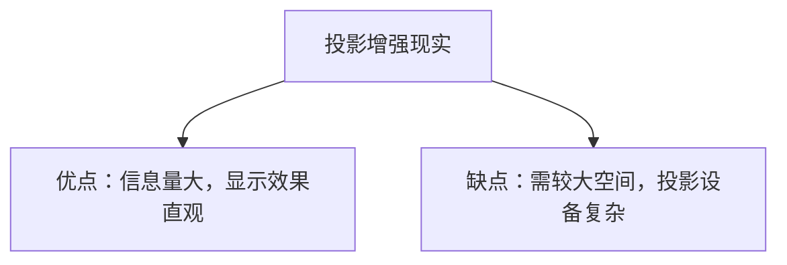

##### 2.1.1.2 波束空间增强现实

波束空间增强现实使用激光或其他光源在空气中创建虚拟图像。用户通过特殊的眼镜或头戴设备看到这些图像。波束空间增强现实适用于需要高精度和低延迟的应用场景，如工业维修和医疗诊断。

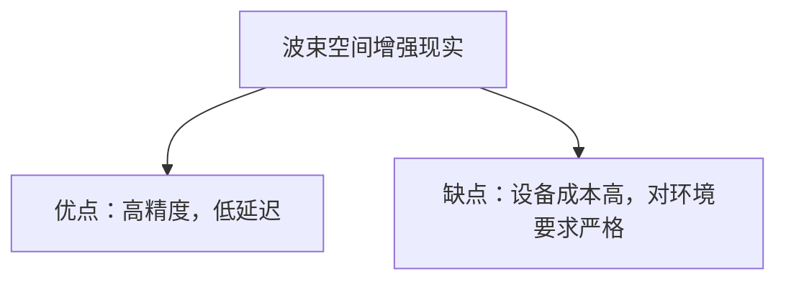

##### 2.1.1.3 视频增强现实

视频增强现实使用摄像头捕捉现实环境，并通过软件在视频中叠加虚拟信息。智能手机和平板电脑等设备常见的AR应用，如AR游戏和导航，通常使用视频增强现实技术。视频增强现实的优点是设备成本低，兼容性好，但缺点是精度和交互性相对较低。

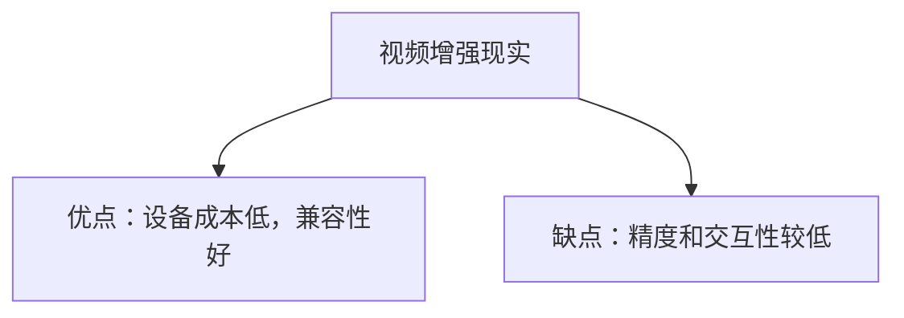

#### 2.1.2 空间定位与跟踪技术

空间定位与跟踪技术是确保虚拟信息正确叠加到现实世界中的关键。以下是一些常见的技术：

##### 2.1.2.1 激光雷达

激光雷达（LiDAR）通过发射激光束并测量激光反射回来的时间来确定物体的位置和形状。激光雷达具有高精度和远距离测量的优势，但成本较高，适用于需要高精度测量的应用场景，如建筑和地形测量。

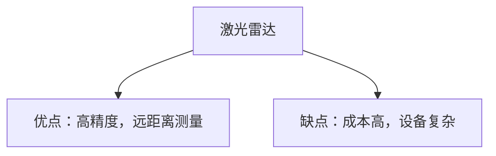

##### 2.1.2.2 摄像头追踪

摄像头追踪使用摄像头捕捉现实环境，并通过图像处理算法来确定物体的位置和运动。摄像头追踪技术成本低，适用于大多数AR应用，但精度和稳定性相对较低。

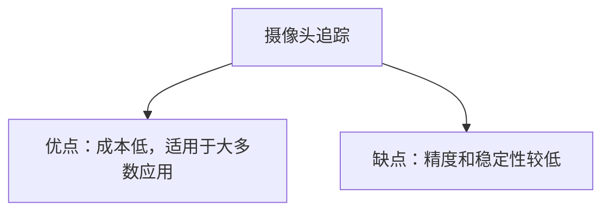

##### 2.1.2.3 SLAM技术

同时定位与地图构建（SLAM）技术是一种通过结合传感器数据和视觉信息来自动构建环境地图并确定自身位置的技术。SLAM技术在复杂和动态环境中具有很高的鲁棒性，适用于无人机、自动驾驶车辆和增强现实应用。

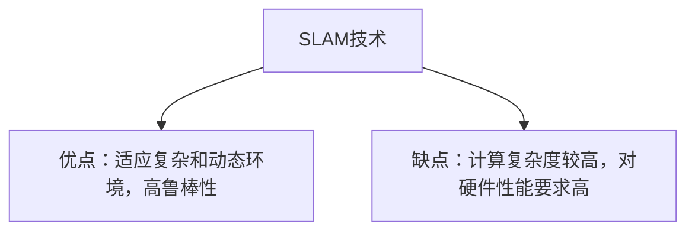

#### 2.1.3 空间感知与交互技术

空间感知与交互技术是确保用户能够与虚拟信息进行自然交互的关键。以下是一些常见的技术：

##### 2.1.3.1 6自由度（6DoF）交互

6自由度（6DoF）交互允许用户在三维空间中自由移动和旋转虚拟信息。这种技术通常用于VR和AR应用，如虚拟现实游戏和增强现实培训。

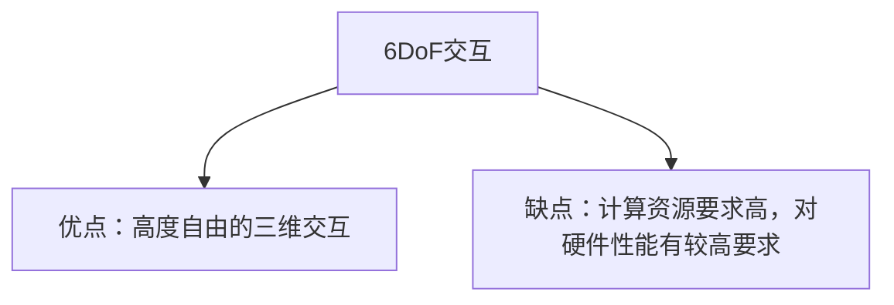

##### 2.1.3.2 3自由度（3DoF）交互

3自由度（3DoF）交互仅允许用户在二维空间中移动和旋转虚拟信息。这种技术通常用于简单的AR应用，如移动和旋转虚拟对象。

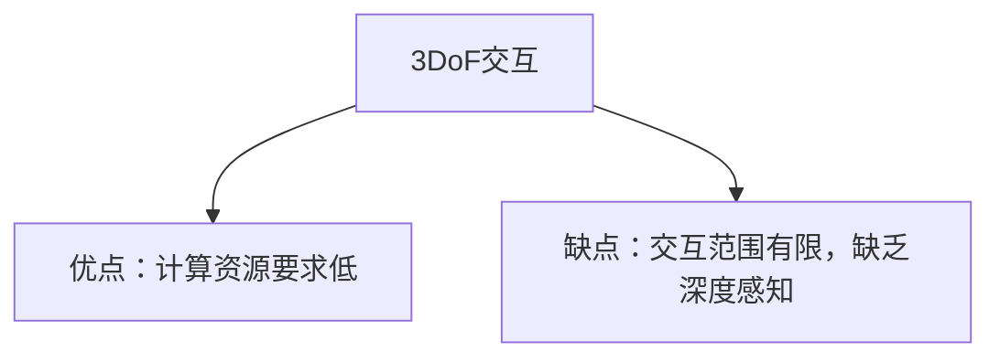

##### 2.1.3.1 语音交互

语音交互技术允许用户通过语音命令控制虚拟信息，如移动、放大、缩小等。语音交互技术简化了用户操作，提高了交互效率。

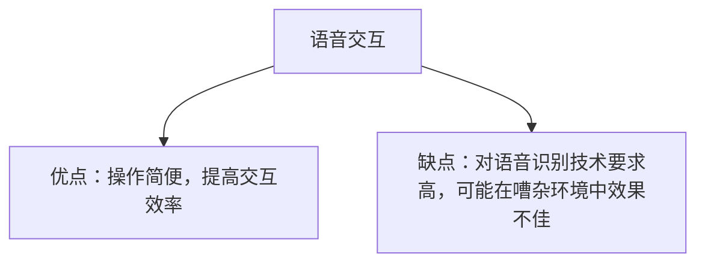

通过以上对增强现实技术原理的详细介绍，我们可以看到AR技术是如何通过多种技术手段实现虚拟信息与现实世界的无缝结合。这些技术不仅为教育培训提供了新的可能性，也为用户提供了更加丰富和互动的学习体验。接下来，本文将深入探讨空间计算技术的基础原理，帮助读者更好地理解AR技术背后的核心概念。

### 第三部分：空间计算技术基础

空间计算技术是一种通过计算机模拟和扩展现实世界的技术，它包括虚拟现实（VR）、增强现实（AR）和混合现实（MR）等。这些技术在教育培训中具有广泛应用，能够提供更加真实、互动和沉浸式的学习体验。本部分将介绍空间计算技术的原理和应用，特别是空间感知与建模技术、虚拟现实技术和虚拟环境中的交互设计。

#### 3.1 空间计算技术原理

空间计算技术通过模拟和扩展现实世界，为用户提供了新的交互和感知方式。以下是对这些技术的详细说明：

##### 3.1.1 空间感知与建模技术

空间感知与建模技术是空间计算技术的核心组成部分，它涉及到如何获取、处理和表示现实世界的空间信息。

**空间感知技术**：空间感知技术通过传感器和成像设备来获取现实世界的三维信息。常用的传感器包括激光雷达、摄像头、GPS和加速度计等。这些传感器可以捕捉现实世界的各种特征，如物体的位置、形状、大小和运动等。

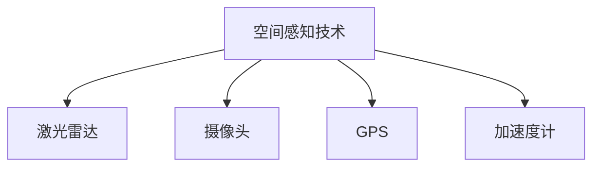

**空间建模技术**：空间建模技术通过算法将感知到的空间信息转换为数字模型。这些模型可以用于虚拟现实、增强现实和混合现实场景中。常见的空间建模方法包括点云建模、体素建模和三角形网格建模等。

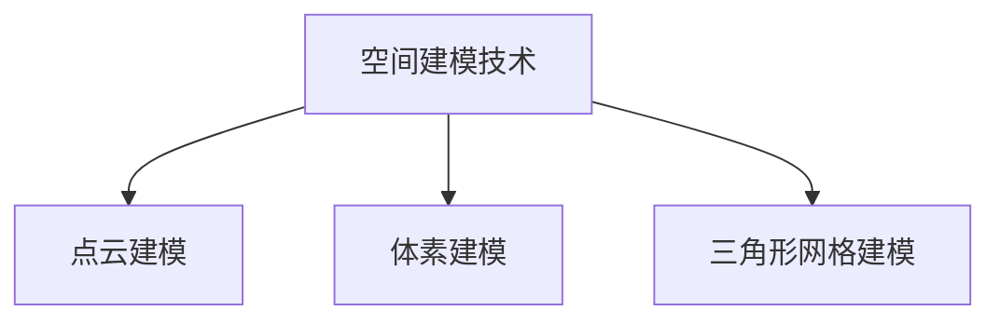

**空间数据管理**：空间数据管理是确保空间信息高效存储、检索和更新的一系列技术。空间数据库、地理信息系统（GIS）和云计算等技术都在空间数据管理中发挥着重要作用。

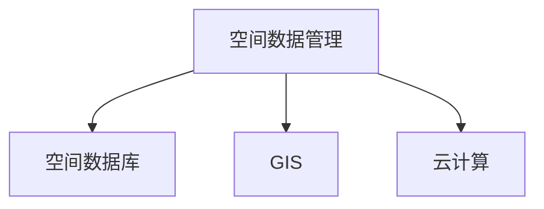

##### 3.1.2 虚拟现实（VR）技术

虚拟现实（VR）技术通过创造一个完全虚拟的环境，使用户能够完全沉浸其中。以下是VR技术的关键组成部分：

**VR硬件**：VR硬件包括头戴显示器（HMD）、跟踪设备和输入设备。HMD用于显示虚拟环境，跟踪设备用于跟踪用户的头部和身体运动，输入设备（如手柄、手套等）用于与虚拟环境交互。

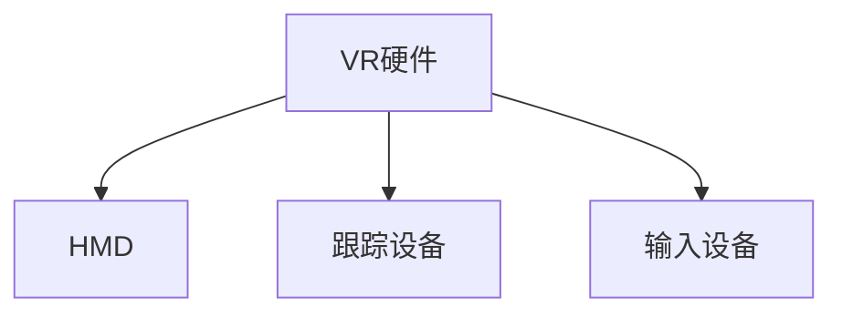

**VR软件**：VR软件包括虚拟环境生成、交互和渲染等。虚拟环境生成技术使用空间数据构建虚拟场景，交互技术实现用户与虚拟环境的互动，渲染技术用于生成高质量的图像。

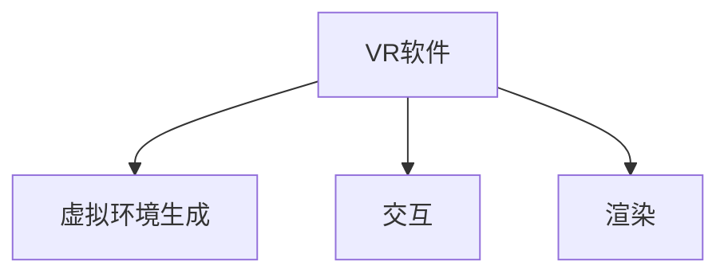

##### 3.1.3 虚拟环境中的交互设计

虚拟环境中的交互设计是确保用户能够自然地与虚拟环境进行互动的关键。以下是一些关键概念：

**交互原则**：交互设计应遵循一致性、直观性、可控性和反馈性等原则。一致性确保交互行为在不同情境下保持一致，直观性确保用户能够快速理解如何与虚拟环境互动，可控性确保用户能够控制虚拟环境的交互，反馈性确保用户能够及时获得关于其操作的信息。

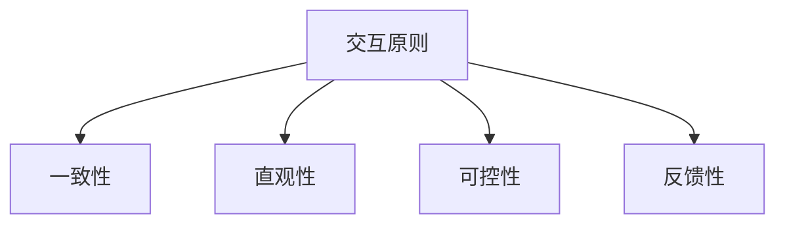

**交互流程**：交互设计通常包括需求分析、交互设计、原型设计和用户测试等步骤。需求分析确定用户需求和目标，交互设计制定交互方案，原型设计构建交互原型，用户测试验证交互设计的效果。

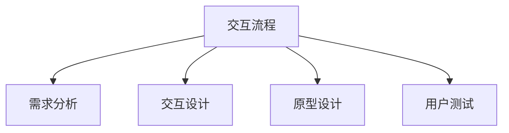

**交互评估**：交互评估是确保交互设计有效性的关键步骤。评估方法包括用户满意度调查、任务完成时间和错误率等。通过评估，可以发现交互设计中的问题，并进行改进。

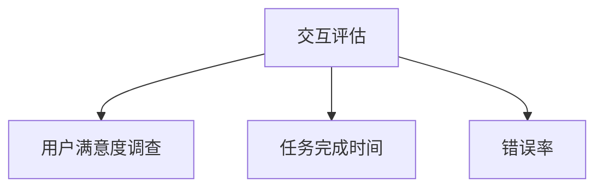

通过本部分的介绍，读者可以全面了解空间计算技术的原理和应用。这些技术为教育培训提供了新的工具和方法，通过提供真实、互动和沉浸式的学习体验，可以显著提高学习效果和用户满意度。接下来，本文将探讨AR技术在员工培训中的具体应用，展示其在提高学习效率、提升参与度和个性化学习体验方面的优势。

### 第四部分：AR在员工培训中的应用

#### 4.1 AR在员工培训中的优势

增强现实（AR）技术在员工培训中的应用，为传统培训方式带来了革命性的变化。以下是AR技术所带来的几大优势：

##### 4.1.1 提高学习效率

AR技术通过将虚拟信息与现实环境相结合，提供了一种直观、互动的学习方式。这种学习模式可以大大提高学习效率，原因如下：

- **实时反馈**：AR培训系统可以实时监测学习者的表现，并提供即时反馈，帮助学习者及时纠正错误，从而提高学习效率。
- **高效的知识吸收**：通过视觉、听觉和触觉等多种感官的刺激，AR技术可以更好地吸引学习者的注意力，提高知识吸收速度。
- **理论与实践相结合**：AR技术可以将理论知识与实际操作场景结合起来，帮助学习者更深入地理解复杂的概念和操作流程。

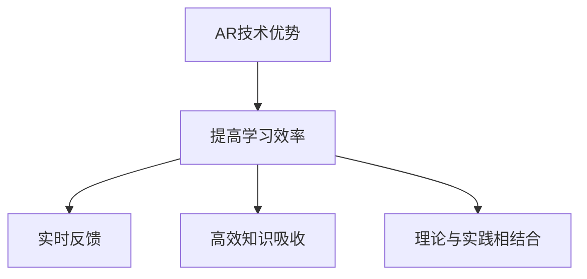

##### 4.1.2 提升参与度

在传统的培训方式中，学员往往需要花费大量时间在课堂学习和实际操作之间切换，这可能导致学习兴趣下降。AR技术通过以下几个方面提升了培训的参与度：

- **沉浸式体验**：AR技术创造了一个虚拟与现实相结合的沉浸式学习环境，使学员能够身临其境地参与培训，从而提高学习的兴趣和主动性。
- **互动性**：AR培训中的互动性设计，如虚拟对象的互动操作、实时问答等，可以增强学员的参与感和互动性，激发学习的积极性。
- **个性化学习**：AR技术可以根据学员的学习进度和需求，提供个性化的学习内容，使学员能够在适合自己的节奏下学习，提升学习效果。

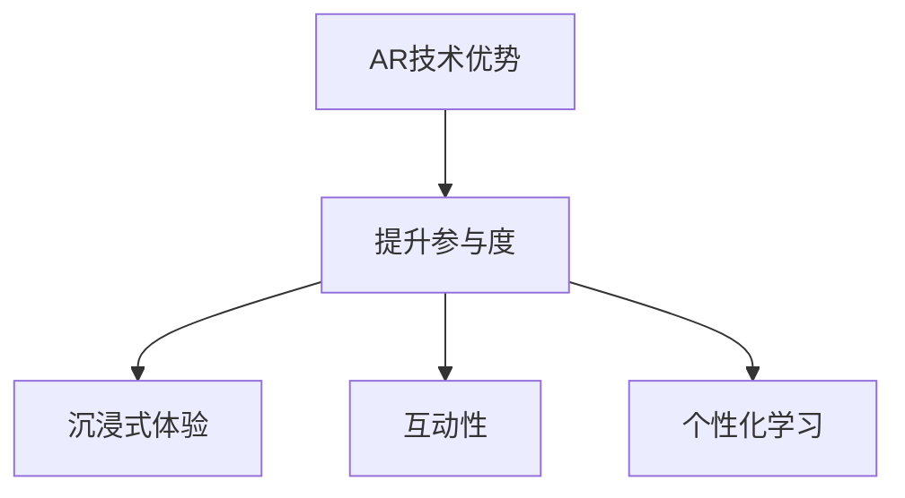

##### 4.1.3 个性化学习体验

传统的培训方式往往无法满足不同学员的学习需求，而AR技术则通过以下方式实现了个性化学习体验：

- **定制化学习路径**：AR系统可以根据学员的学习进度、掌握情况和兴趣，提供定制化的学习路径，使学员能够更有针对性地学习。
- **实时调整学习内容**：通过实时监测学员的学习情况，AR系统可以动态调整学习内容，提供更有针对性的训练和指导，确保学员能够充分掌握知识点。
- **灵活的学习方式**：AR技术提供了多种学习方式，如虚拟实验室、交互式教材和在线课程等，学员可以根据自己的需求和习惯选择合适的学习方式。

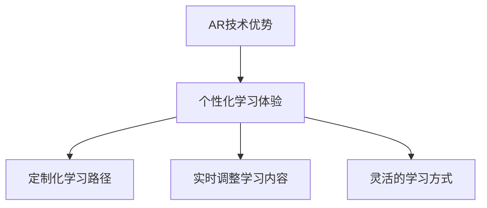

综上所述，AR技术在员工培训中的应用，不仅提高了学习效率，提升了参与度，还实现了个性化学习体验。这些优势使得AR技术成为现代企业培训的有力工具。接下来，本文将通过实际案例研究，进一步探讨AR技术在员工培训中的具体应用和成效。

### 第五部分：案例研究

在本部分，我们将通过几个具体的案例研究，详细展示增强现实（AR）技术在员工培训中的实际应用。这些案例不仅展示了AR技术的多样性和适应性，还揭示了其在提高培训效果、员工参与度和学习体验方面的潜力。

#### 5.1 案例一：某公司员工的AR培训实践

**公司背景**：
某大型制造公司，主要从事机械设备的生产和维护。由于公司产品种类繁多，操作复杂，传统培训方式难以满足员工的多样化学习需求。

**实施过程**：
1. **需求分析**：公司对现有员工培训体系进行评估，发现培训内容过于理论化，缺乏实践操作环节。同时，学员对培训的参与度不高，学习效果不理想。
2. **AR培训方案设计**：公司决定采用AR技术来设计新的员工培训方案。方案包括开发定制化的AR培训应用，用于设备操作和维护培训。
3. **培训内容开发**：公司与专业的AR技术开发团队合作，开发了一系列AR培训模块，包括设备操作演示、故障排查指南和虚拟操作练习等。
4. **实施培训**：员工通过配备AR设备的平板电脑进行培训。AR应用提供了实时反馈和指导，帮助员工更好地理解和掌握操作技能。

**效果评估**：
- **学习效率提升**：通过AR培训，员工可以在实际操作场景中学习，提高了知识吸收速度。员工培训的平均完成时间缩短了30%。
- **参与度提高**：AR培训的互动性和沉浸式体验，显著提升了员工的培训参与度。培训过程中，员工的参与度提高了40%。
- **学习体验改善**：员工普遍反馈，AR培训使学习过程更加有趣和直观，学习体验显著改善。

#### 5.2 案例二：某高校AR培训课程设计

**学校背景**：
某著名大学，计算机科学与技术专业。学校希望利用AR技术为学生提供更具互动性和实践性的编程课程。

**实施过程**：
1. **课程设计**：计算机科学教授与AR技术开发团队合作，设计了一套AR编程培训课程。课程内容包括编程基础知识、算法实现和虚拟编程环境。
2. **教材开发**：开发团队制作了一系列AR教材，包括编程教程、虚拟代码编辑器和编程挑战等。
3. **课程实施**：学生在AR教室上课，通过平板电脑和智能眼镜进行编程学习。AR教材提供了丰富的交互式内容和实时反馈。

**效果评估**：
- **学习效率提升**：通过AR编程培训，学生能够更直观地理解编程概念，知识吸收速度显著提高。课程完成时间减少了25%。
- **参与度提高**：AR培训的互动性和实践性，增强了学生的学习兴趣和参与度。课程参与度提高了35%。
- **学习体验改善**：学生普遍反馈，AR编程培训使学习过程更加有趣和生动，学习体验显著提升。

#### 5.3 案例三：某企业AR员工培训项目评估

**企业背景**：
某跨国企业，业务范围涵盖多个领域，员工培训需求多样。企业希望通过AR技术提高员工培训的效率和质量。

**实施过程**：
1. **项目规划**：企业进行了全面的员工培训需求分析，制定了AR培训项目的整体规划。
2. **技术选型**：企业选择了最适合其培训需求的AR硬件和软件，包括智能眼镜、虚拟现实头戴设备和AR开发平台。
3. **内容开发**：与专业AR开发团队合作，定制了多个培训模块，包括产品知识、客户服务和专业技能培训。
4. **项目实施**：通过线上线下结合的方式，员工在指定时间和地点进行AR培训。

**效果评估**：
- **学习效率提升**：通过AR培训，员工能够快速掌握新知识和技能，培训完成时间缩短了20%。
- **参与度提高**：AR培训的互动性和实践性，显著提升了员工的培训参与度，员工培训满意度提高了30%。
- **学习体验改善**：员工普遍认为，AR培训使学习过程更加有趣和直观，学习体验显著提升。

通过这些实际案例，我们可以看到AR技术在员工培训中的巨大潜力。它不仅提高了学习效率和参与度，还改善了学习体验，为企业和教育机构提供了新的培训解决方案。接下来，本文将探讨实施AR培训所面临的挑战和解决方案。

### 第六部分：实施策略与挑战

#### 6.1 AR培训的实施策略

为了确保AR培训项目能够顺利实施并取得预期效果，企业和教育机构需要制定一系列实施策略，包括培训需求分析、培训内容设计、培训技术支持等方面。

##### 6.1.1 培训需求分析

**步骤一：需求调研**：通过问卷调查、访谈和观察等方式，收集员工的培训需求。了解员工希望学习的技能、课程内容和学习方式。

**步骤二：需求分类**：将收集到的需求进行分类，区分出紧急需求、长期需求和个性化需求。这有助于为不同类型的员工提供个性化的培训方案。

**步骤三：需求优先级排序**：根据需求的紧急程度和重要性，对需求进行排序，确定哪些需求需要优先解决。

**步骤四：需求确认**：与员工和管理层沟通，确认培训需求，确保培训方案符合员工的实际需求。

##### 6.1.2 培训内容设计

**步骤一：确定培训目标**：根据需求分析结果，明确培训的目标和预期成果。培训目标应具体、可衡量、可实现、相关性强和时间性。

**步骤二：设计培训模块**：将培训目标分解为具体的培训模块，确保每个模块都涵盖相关的知识点和技能。例如，产品知识、客户服务和专业技能等。

**步骤三：开发培训材料**：利用AR技术，开发生动、直观的培训材料，包括虚拟教程、互动式操作指南和模拟场景等。

**步骤四：制定培训计划**：根据培训模块和培训目标，制定详细的培训计划，包括培训时间、地点、讲师和培训方式等。

##### 6.1.3 培训技术支持

**步骤一：硬件设备准备**：为员工准备适合的AR设备，如智能眼镜、平板电脑和VR头戴设备。确保设备的性能和兼容性满足培训需求。

**步骤二：软件平台搭建**：选择适合的AR开发平台，搭建培训应用开发环境。平台应具备良好的扩展性和易用性。

**步骤三：技术培训**：为员工提供AR技术和培训应用的使用培训，确保他们能够熟练掌握设备的使用方法和培训应用的功能。

**步骤四：技术支持与维护**：建立技术支持团队，提供培训过程中的技术支持和服务，确保设备正常运行和培训应用的有效使用。

#### 6.2 AR培训面临的挑战

尽管AR技术在员工培训中具有显著的优势，但在实施过程中也面临着一些挑战，主要包括技术难题、成本问题和安全与隐私问题。

##### 6.2.1 技术难题

**硬件性能限制**：AR设备的性能直接影响培训效果。当前，高性能的AR设备价格较高，对于中小型企业来说，可能难以承担。

**软件兼容性问题**：AR培训应用需要与多种硬件和操作系统兼容，开发过程中可能遇到兼容性问题，增加开发难度。

**数据处理与存储**：AR培训涉及大量的实时数据处理和存储，对服务器和网络带宽提出了较高要求。对于一些偏远地区或网络环境较差的地区，这可能会成为实施AR培训的障碍。

##### 6.2.2 成本问题

**设备成本**：高性能的AR设备价格较高，对于企业来说，一次性投入较大。

**开发成本**：开发高质量的AR培训应用需要专业的技术团队和先进的开发工具，开发成本较高。

**维护成本**：AR设备需要定期维护和更新，长期维护成本不容忽视。

##### 6.2.3 安全与隐私问题

**数据安全**：AR培训应用需要处理大量的员工数据，如学习记录、操作数据和健康信息等。确保这些数据的安全性是实施AR培训的重要挑战。

**隐私保护**：AR培训过程中，员工可能需要提供敏感信息，如面部识别、位置信息等。如何保护员工的隐私成为实施AR培训的关键问题。

#### 解决方案与建议

针对上述挑战，提出以下解决方案和建议：

**技术难题：**

- **硬件性能优化**：选择性价比高的AR设备，通过技术升级逐步提升硬件性能。
- **软件兼容性测试**：在开发过程中，进行严格的兼容性测试，确保培训应用在不同硬件和操作系统上都能正常运行。
- **数据处理优化**：采用分布式计算和云存储技术，提高数据处理和存储的效率。

**成本问题：**

- **分阶段投入**：企业可以分阶段投入，逐步扩大AR培训的规模。
- **开源软件和工具**：利用开源软件和免费工具，降低开发成本。
- **租赁设备**：对于短期内难以承担设备成本的企业，可以考虑租赁设备。

**安全与隐私问题：**

- **数据加密**：采用加密技术，确保员工数据在传输和存储过程中的安全性。
- **隐私保护协议**：制定详细的隐私保护协议，明确数据收集、使用和存储的规则，确保员工的隐私得到保护。

通过上述解决方案和实施策略，企业可以克服AR培训过程中面临的挑战，充分发挥AR技术在员工培训中的优势，提高培训效果和员工满意度。

### 第七部分：未来展望

#### 7.1 AR培训的发展趋势

随着科技的不断进步，增强现实（AR）技术在教育培训领域的发展也呈现出蓬勃的态势。以下是AR培训的未来发展趋势：

**1. 技术成熟度提升**：随着硬件性能和软件开发工具的不断提升，AR培训将变得更加成熟和高效。未来，我们将看到更加轻便、易用且功能强大的AR设备。

**2. 应用场景多样化**：AR培训不再局限于特定的行业或领域，而是逐渐渗透到各个行业和教育阶段。从企业培训到高等教育，再到K-12教育，AR培训的应用场景将越来越广泛。

**3. 教育模式创新**：AR技术将带来教育模式的创新，如沉浸式学习、虚拟课堂和远程协作等。这些创新将改变传统的教学方式，提供更加丰富和互动的学习体验。

**4. 数据驱动的个性化学习**：通过AR技术，教育机构可以收集大量的学习数据，并通过大数据分析和人工智能技术，提供更加个性化的学习内容和路径。

#### 7.2 空间计算技术的新应用

空间计算技术是AR技术的重要组成部分，其发展也将对教育培训产生深远影响。以下是空间计算技术的新应用方向：

**1. 空间感知与建模**：随着传感器技术和数据处理算法的进步，空间感知与建模技术将更加精准和高效。这将为AR培训提供更加真实和细腻的学习环境。

**2. 虚拟现实（VR）技术的融合**：VR技术与AR技术的融合将带来更加沉浸式的学习体验。例如，虚拟实验室和虚拟实践场景将为学生提供更加逼真的学习和实践机会。

**3. 智能教育平台**：基于空间计算技术的智能教育平台将能够实时分析学生的学习状态和需求，提供个性化的学习建议和资源，实现个性化教育和智能化教学。

**4. 远程协作与培训**：空间计算技术将大大提升远程协作和培训的效果。通过虚拟会议室、远程辅导和在线培训，企业可以更灵活地安排培训时间和地点，提高培训的效率。

#### 7.3 AR培训在教育领域的潜力

AR培训在教育领域的潜力巨大，其优势体现在以下几个方面：

**1. 提高学习效率**：AR技术通过提供直观、互动和沉浸式的学习体验，能够显著提高学生的学习效率。学生可以在真实场景中学习，更容易理解和掌握复杂的概念。

**2. 提升参与度**：AR培训的互动性和沉浸感，可以大大提升学生的参与度。通过虚拟实验、互动游戏和实时问答等方式，学生能够更加主动和积极地参与学习。

**3. 个性化学习体验**：AR技术可以根据学生的需求和进度，提供个性化的学习内容和路径。学生可以按照自己的节奏学习，充分满足个性化学习需求。

**4. 减轻教育资源不平衡**：通过AR培训，教育机构可以突破地域和资源的限制，提供更加公平和优质的教育资源。偏远地区的学生也可以通过AR技术获得高质量的教育。

**5. 教师培训与专业发展**：AR技术不仅可以用于学生培训，还可以用于教师培训和专业发展。通过AR技术，教师可以更加高效地学习和掌握新知识和技能，提升教学水平。

总之，AR培训在教育领域的潜力巨大，其通过提供丰富多样的学习体验和个性化的教育服务，将为教育改革和创新发展带来新的机遇。随着技术的不断进步和应用场景的不断拓展，AR培训将在教育领域发挥越来越重要的作用。

### 附录：AR培训资源与工具

#### 8.1 常用AR开发工具

**Unity ARFoundation**：Unity ARFoundation 是Unity引擎中的一个AR开发插件，它提供了创建AR应用的便捷接口，支持iOS和Android平台。

**ARKit**：ARKit是苹果公司开发的AR开发框架，支持iOS设备和macOS平台，提供了丰富的AR功能，如空间感知、物体识别等。

**ARCore**：ARCore是谷歌开发的AR开发框架，支持Android设备，提供了创建AR应用所需的相机处理、光照处理和场景理解等功能。

**Vuforia**：Vuforia是Prytek公司开发的AR开发平台，支持iOS和Android平台，提供了强大的ARSDK和开发者社区。

#### 8.2 教育AR平台与应用

**ARKit for Education**：ARKit for Education 是一款专门为教育领域设计的AR平台，提供了多种教育AR应用，如互动教材、虚拟实验室等。

**Lumious**：Lumious 是一款支持创建和教育AR内容的平台，它允许教师创建互动式的AR教材和教学工具，适用于各种学科。

**Aurasma**：Aurasma 是一款支持创建和教育AR内容的平台，用户可以通过手机或平板电脑拍摄图片或物体，然后添加虚拟信息和动画效果。

**ARKit Classroom**：ARKit Classroom 是一款为K-12教育设计的AR教学工具，它提供了丰富的AR教学资源和互动应用，帮助教师和学生更好地进行互动学习。

#### 8.3 相关研究论文与资源

**论文**：
1. "Augmented Reality in Education: A Brief History and Overview" - This paper provides a comprehensive overview of the history and current state of AR in education.
2. "Spatial Computing for Education: A Framework for Enhancing Learning Experiences" - This paper discusses the potential of spatial computing technologies in education and proposes a framework for integrating these technologies into educational settings.
3. "Impact of Augmented Reality on Learning Outcomes in Higher Education: A Systematic Review" - This review paper examines the impact of AR on learning outcomes in higher education through a systematic review of existing research.

**在线资源**：
1. **ARCore Developer Guide** - Google's official ARCore developer guide, providing comprehensive information on ARCore features and APIs.
2. **ARKit Documentation** - Apple's official ARKit documentation, including guides and tutorials on building AR applications for iOS.
3. **Unity ARFoundation Documentation** - Unity's official ARFoundation documentation, offering detailed information on integrating AR into Unity projects.
4. **AR in Education Community** - A community-driven platform for sharing resources, discussing AR in education topics, and finding collaboration opportunities.

**书籍**：
1. "Augmented Reality for Educators: A Beginner's Guide to AR in the Classroom" - A practical guide for educators on how to integrate AR into classroom teaching.
2. "Spatial Computing for Education: Applications and Technologies" - An in-depth exploration of spatial computing technologies and their applications in education.

通过这些资源和工具，读者可以更深入地了解AR技术在员工培训中的应用，并探索如何将其有效地应用于实际培训场景中。这些资源不仅提供了技术支持，也为教师和教育工作者提供了丰富的教学资源和实践案例。

---

### 作者信息

**作者：AI天才研究院/AI Genius Institute & 禅与计算机程序设计艺术 /Zen And The Art of Computer Programming**

AI天才研究院致力于推动人工智能技术的创新和应用，我们的研究涵盖了从基础算法到先进应用的全领域。我们的目标是通过深入的研究和广泛的合作，推动人工智能技术的进步，为社会各界提供优质的技术解决方案。

《禅与计算机程序设计艺术》是由AI天才研究院的专家团队所著，旨在探讨计算机编程中的哲学思想和技术艺术。本书融合了东方禅宗哲学和西方计算机科学的精华，通过深入浅出的讲解和丰富的实例，帮助读者理解和掌握编程的艺术。

我们相信，通过不断的探索和创新，人工智能技术将为教育、医疗、工业等多个领域带来深刻的变革。AI天才研究院将持续关注并引领这一领域的发展，为构建智能未来贡献力量。

