                 

### 增强现实工作流：空间计算重塑企业运营

#### 关键词
- 增强现实（AR）
- 空间计算
- 企业运营
- 工作流
- 整合技术

#### 摘要
随着技术的不断进步，增强现实（AR）正在迅速成为企业运营中的重要工具。通过空间计算，AR技术能够为企业提供全新的工作流和操作方式，从而提高效率、降低成本并增强用户体验。本文将探讨增强现实的工作流设计、空间计算的基础知识、以及AR在企业运营中的广泛应用，旨在为读者提供一个全面的技术概述和实际应用的指导。

## 第一部分：增强现实（AR）基础知识

### 第1章：增强现实概述

#### 1.1 增强现实的定义与历史
增强现实（AR）是一种将虚拟信息叠加到真实环境中的技术。通过计算机视觉和图像处理技术，AR可以在用户的视线中创建出与真实世界相互融合的虚拟图像。其历史可以追溯到1990年代，当时的虚拟现实（VR）和增强现实（AR）技术刚刚萌芽。随着智能手机和平板电脑的普及，AR技术开始广泛应用，并逐步发展出成熟的解决方案。

**核心概念与联系：**
- 增强现实（AR）：一种虚拟信息叠加到现实环境中的技术。
- 虚拟现实（VR）：一种完全沉浸式的虚拟体验。
- 混合现实（MR）：一种结合真实和虚拟环境的沉浸式体验。

**Mermaid 流程图：**
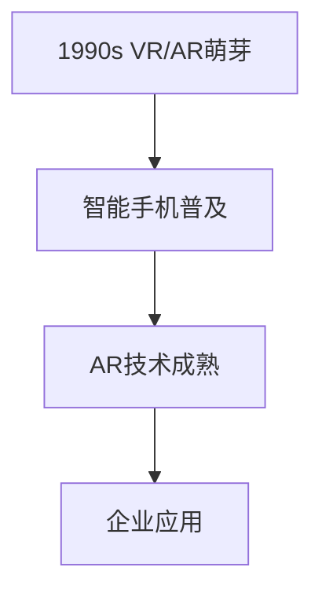

#### 1.2 增强现实的关键技术
增强现实技术的核心包括计算机视觉、图像处理和人机交互。计算机视觉用于识别和跟踪现实环境中的物体和场景，图像处理则用于创建和叠加虚拟图像，人机交互则确保用户能够与虚拟信息进行有效的互动。

**核心概念与联系：**
- 计算机视觉：用于识别和跟踪现实环境。
- 图像处理：用于创建和叠加虚拟图像。
- 人机交互：用于实现用户与虚拟信息的互动。

**Mermaid 流程图：**
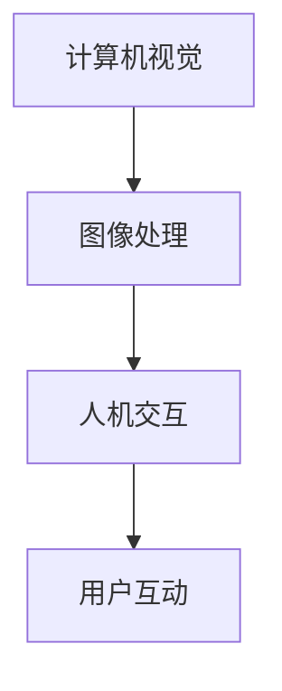

#### 1.3 增强现实的应用领域
增强现实在多个领域都有广泛的应用，包括医疗、教育、零售和娱乐等。例如，在医疗领域，AR可以用于手术指导；在零售领域，AR可以用于虚拟试衣；在教育领域，AR可以提供交互式的学习体验。

**核心概念与联系：**
- 医疗：手术指导、医学教育。
- 教育：交互式学习、虚拟实验室。
- 零售：虚拟试衣、增强现实广告。
- 娱乐：增强现实游戏、主题公园。

**Mermaid 流程图：**
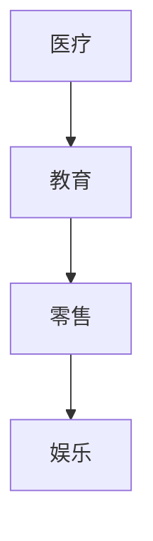

### 第2章：空间计算基础

#### 2.1 空间计算的定义与原理
空间计算是一种将计算与物理空间紧密整合的范式，它强调计算与空间的互动和融合。空间计算的核心原理包括空间感知、空间建模和空间交互。

**核心概念与联系：**
- 空间感知：通过传感器感知物理空间。
- 空间建模：构建数字模型来表示物理空间。
- 空间交互：实现用户与物理空间的互动。

**Mermaid 流程图：**
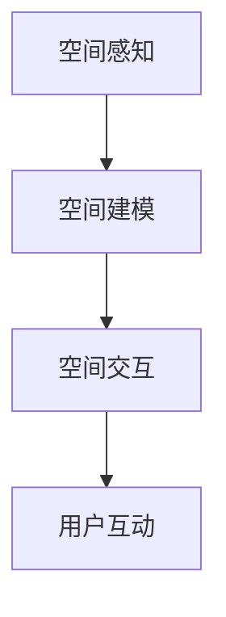

#### 2.2 空间计算的核心组件
空间计算的核心组件包括传感器、计算单元和显示设备。传感器用于捕捉物理空间的信息，计算单元用于处理这些信息，显示设备则用于呈现增强现实体验。

**核心概念与联系：**
- 传感器：用于捕捉物理空间的信息。
- 计算单元：用于处理传感器数据。
- 显示设备：用于呈现增强现实体验。

**Mermaid 流程图：**
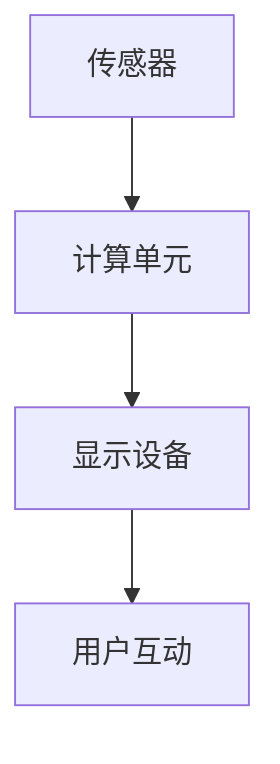

#### 2.3 空间计算的应用场景
空间计算在智能建筑、智能交通、智能城市等领域有广泛的应用。例如，在智能建筑中，空间计算可以用于环境监控和能源管理；在智能交通中，空间计算可以用于交通流量监控和优化。

**核心概念与联系：**
- 智能建筑：环境监控、能源管理。
- 智能交通：交通流量监控、优化。
- 智能城市：城市规划、公共安全。

**Mermaid 流程图：**
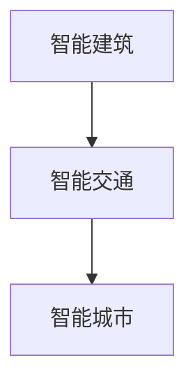

## 第二部分：空间计算与增强现实工作流

### 第3章：增强现实工作流设计

#### 3.1 增强现实工作流概述
增强现实工作流是指从项目启动到部署和维护的一系列过程。它包括需求分析、设计、开发、测试和部署等阶段。每个阶段都需要仔细规划和执行，以确保最终的增强现实应用能够满足业务需求和用户期望。

**核心概念与联系：**
- 需求分析：理解业务需求和用户需求。
- 设计：创建用户界面和用户体验。
- 开发：编写代码并实现功能。
- 测试：确保应用的质量和稳定性。
- 部署：将应用部署到生产环境。

**Mermaid 流程图：**
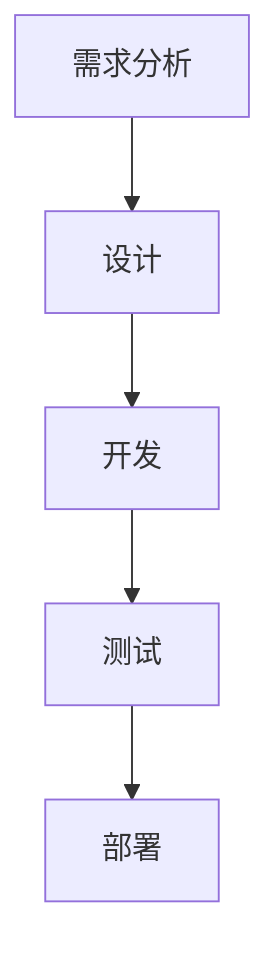

#### 3.2 设计流程与工具
设计流程包括用户研究、原型设计和迭代开发等。工具方面，可以使用Unity、ARKit、ARCore等平台来开发增强现实应用。这些平台提供了丰富的功能库和工具，使得开发者可以快速构建高质量的AR应用。

**核心概念与联系：**
- 用户研究：理解用户需求和行为。
- 原型设计：创建交互式原型。
- 迭代开发：逐步完善应用功能。

**Mermaid 流程图：**
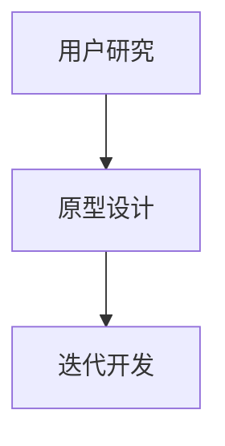

#### 3.3 常见挑战与解决方案
在增强现实工作流中，常见挑战包括用户界面设计、性能优化、隐私和安全等。解决方案可能包括使用最佳实践、新技术和工具来克服这些挑战。

**核心概念与联系：**
- 用户界面设计：确保用户易于使用和理解。
- 性能优化：提高应用的响应速度和稳定性。
- 隐私和安全：确保用户数据的安全和隐私。

**Mermaid 流程图：**
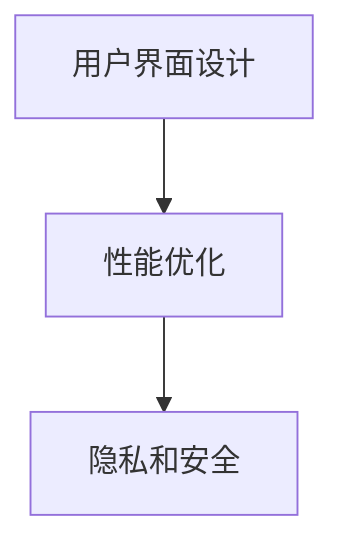

## 第三部分：企业运营中的增强现实应用

### 第4章：增强现实在市场营销中的应用

#### 4.1 增强现实营销策略
增强现实营销策略可以包括虚拟试戴、增强现实广告等。这些策略可以增加用户的参与度，提高品牌的知名度，并最终促进销售。

**核心概念与联系：**
- 虚拟试戴：用户可以在虚拟环境中试穿衣服或试用产品。
- 增强现实广告：通过AR技术创建沉浸式的广告体验。

**Mermaid 流程图：**
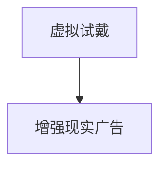

#### 4.2 增强现实在培训中的应用
增强现实在培训中的应用可以提供交互式、沉浸式的学习体验，从而提高学习效果。例如，可以通过AR技术模拟手术过程或提供安全培训。

**核心概念与联系：**
- 交互式学习：通过互动增强学习体验。
- 沉浸式体验：通过虚拟环境提高学习效果。

**Mermaid 流程图：**
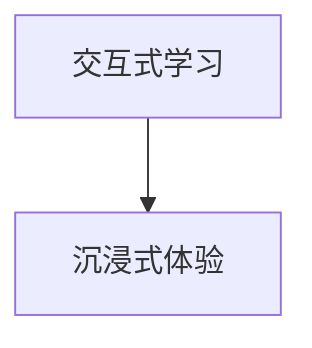

#### 4.3 增强现实在供应链管理中的应用
增强现实可以用于供应链管理的各个环节，包括库存管理、物流追踪和质量管理。通过AR技术，可以实时监控和优化供应链流程，提高效率和准确性。

**核心概念与联系：**
- 库存管理：实时监控库存情况。
- 物流追踪：提高物流效率。
- 质量管理：确保产品质量。

**Mermaid 流程图：**
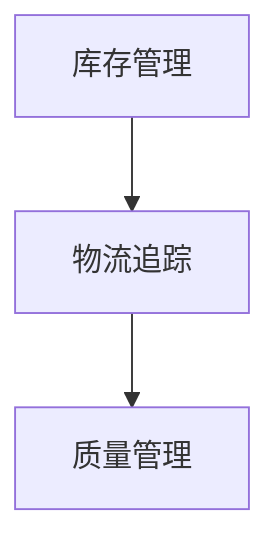

### 第5章：实施增强现实工作流的策略

#### 5.1 确定业务目标和需求
在实施增强现实工作流之前，首先需要明确业务目标和需求。这包括了解企业的战略目标、目标市场、用户需求和期望等。

**核心概念与联系：**
- 业务目标：明确企业希望通过AR技术实现的目标。
- 需求分析：深入了解用户需求和期望。

**Mermaid 流程图：**
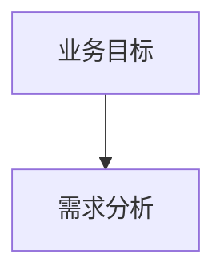

#### 5.2 资源配置和预算规划
实施增强现实工作流需要相应的资源和预算支持。这包括硬件采购、软件开发、人员培训等。合理的资源配置和预算规划是确保项目顺利进行的关键。

**核心概念与联系：**
- 资源配置：确保项目所需的硬件和软件资源。
- 预算规划：合理分配预算，确保项目的可持续性。

**Mermaid 流程图：**
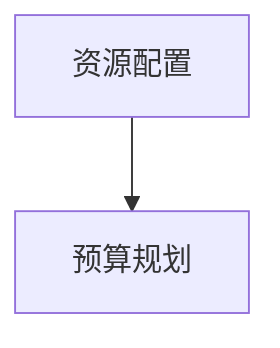

#### 5.3 增强现实工作流的优化与维护
增强现实工作流是一个动态的过程，需要不断优化和维护。这包括性能优化、功能更新、用户体验改进等。通过持续的优化，可以确保增强现实应用始终满足业务需求。

**核心概念与联系：**
- 性能优化：提高应用的响应速度和稳定性。
- 功能更新：根据用户反馈和市场需求更新功能。
- 用户体验改进：不断改进用户体验，提高用户满意度。

**Mermaid 流程图：**
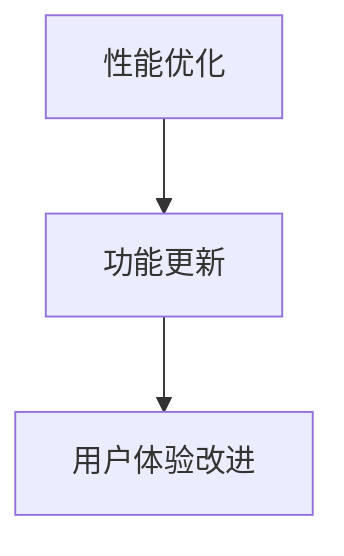

### 第6章：成功案例与经验分享

#### 7.1 成功案例介绍
在本章节中，我们将介绍一些成功的增强现实案例，包括企业如何利用AR技术提高效率、降低成本并提升用户体验。这些案例将提供实际的参考和借鉴。

**核心概念与联系：**
- 案例介绍：提供成功的AR应用实例。
- 实际参考：为企业提供实际应用的参考。

**Mermaid 流程图：**
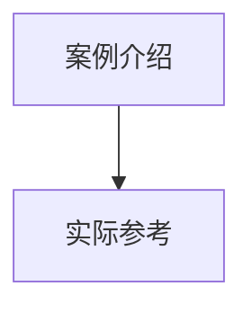

#### 7.2 经验总结
通过对成功案例的分析，我们可以总结出一些关键的经验教训。这些经验对于企业在实施增强现实工作流时具有重要指导意义。

**核心概念与联系：**
- 经验总结：总结成功案例中的关键经验。
- 指导意义：为企业的AR应用提供指导。

**Mermaid 流程图：**
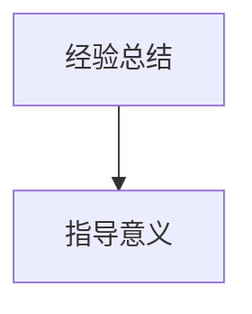

#### 7.3 未来发展趋势预测
随着技术的不断进步，增强现实技术在企业运营中的应用前景广阔。本章节将预测未来的发展趋势，为企业和开发者提供前瞻性的指导。

**核心概念与联系：**
- 发展趋势预测：分析未来AR技术的应用方向。
- 前瞻性指导：为企业和开发者提供未来发展的指导。

**Mermaid 流程图：**
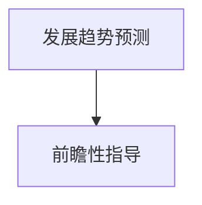

## 附录

### 附录A：增强现实开发工具与资源
在本附录中，我们将介绍一些常用的增强现实开发工具和资源，包括开发平台、库和框架等。这些工具和资源可以帮助开发者更高效地构建AR应用。

**核心概念与联系：**
- 开发平台：提供AR开发的环境和工具。
- 库和框架：提供常用的功能模块和代码库。

**Mermaid 流程图：**
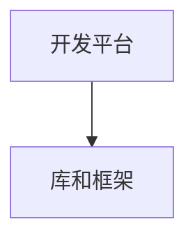

#### A.1 增强现实开发平台介绍
- Unity：一款功能强大的游戏引擎，支持AR开发。
- ARKit：苹果公司开发的AR开发框架。
- ARCore：谷歌开发的AR开发平台。

#### A.2 常用增强现实库与框架
- Vuforia：一款广泛使用的AR库，提供丰富的AR功能。
- AR.js：一款基于Web的AR框架，适用于网页应用。

#### A.3 增强现实社区与资源链接
- AR Community：一个面向AR开发者的社区平台。
- AR Guide：提供AR开发教程和资源。

### 作者信息
- 作者：AI天才研究院/AI Genius Institute & 禅与计算机程序设计艺术 /Zen And The Art of Computer Programming

### 总结
本文详细探讨了增强现实（AR）技术的工作流、空间计算的基础知识以及AR在企业运营中的应用。通过对核心概念、联系、流程图和成功案例的分析，我们提供了全面的技术概述和实际应用的指导。随着技术的不断进步，AR将在未来继续重塑企业运营，带来更多的创新和机遇。希望本文能为读者提供有价值的参考和启发。

