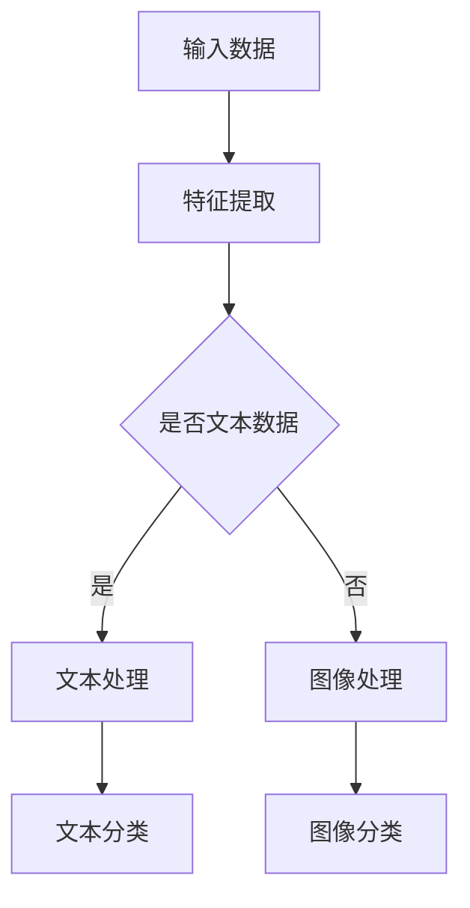
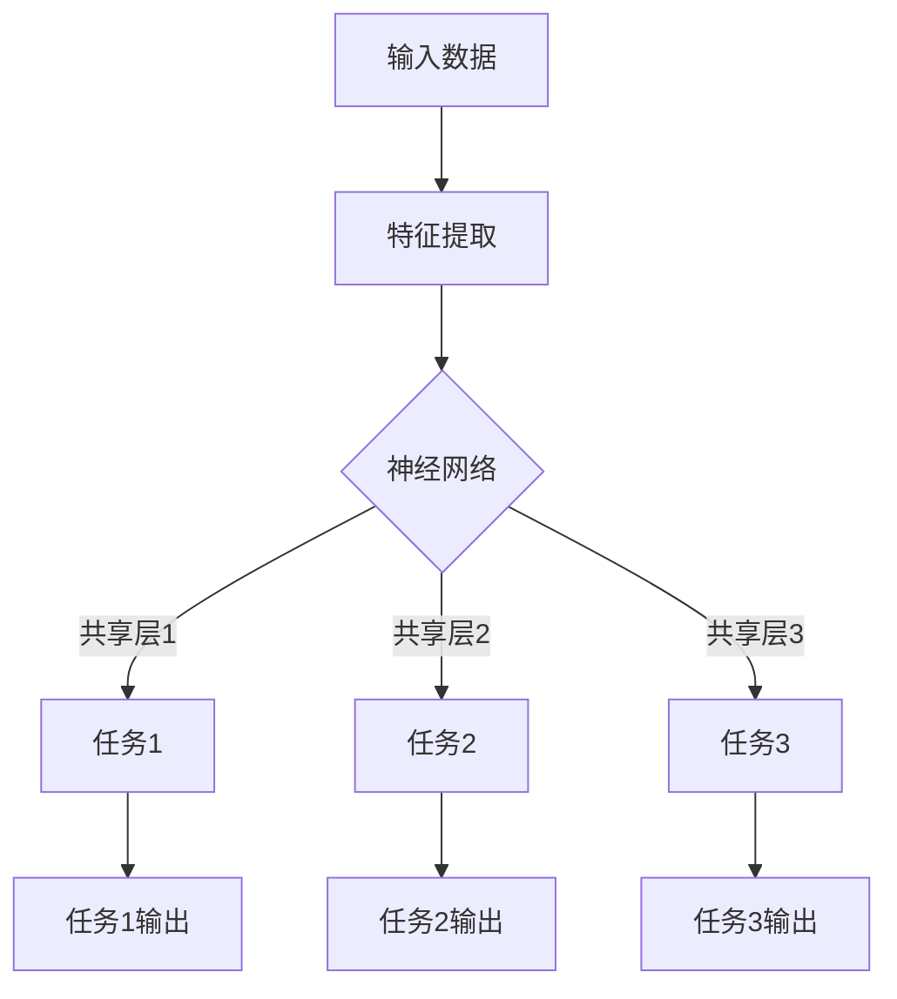
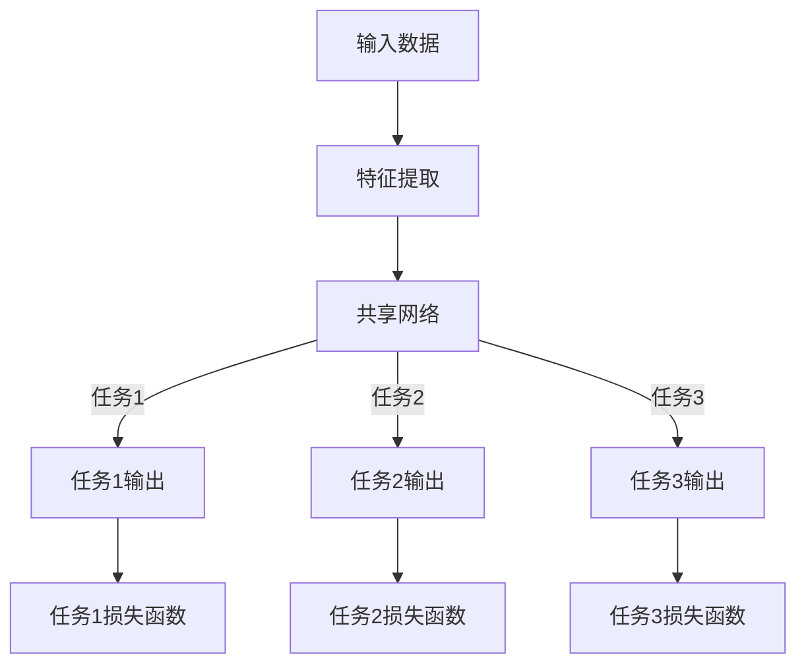
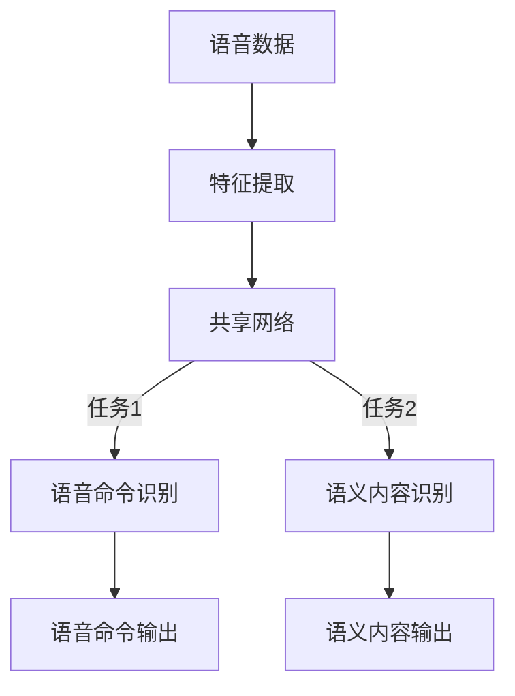
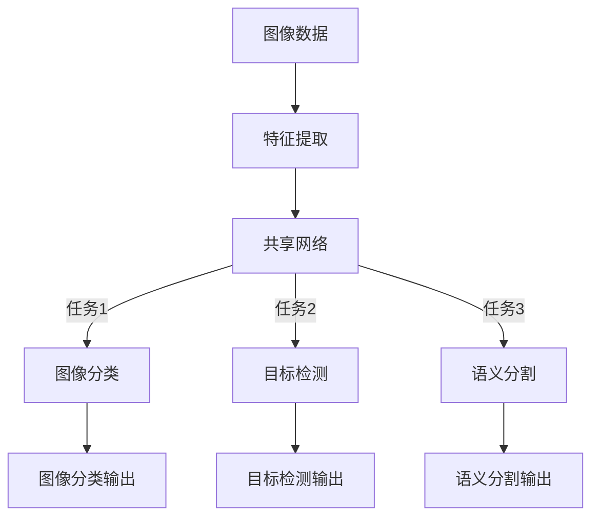
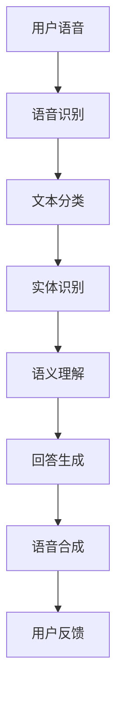
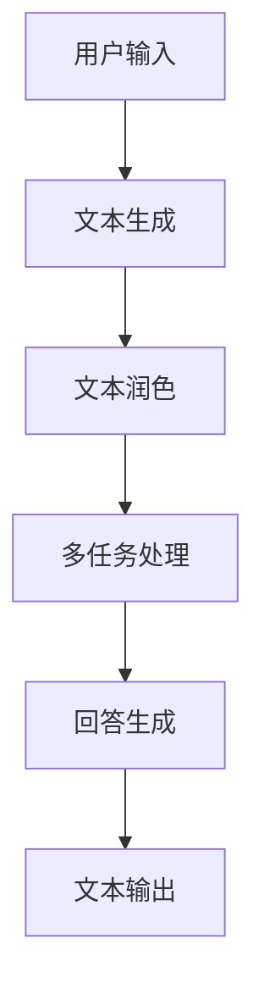

                 

### 文章标题

《多任务学习在AIGC全能型助手中的作用》摘要：
本文将深入探讨多任务学习在AIGC（自适应智能生成内容）全能型助手中的应用。首先，我们将回顾多任务学习的基础理论，包括其定义、背景、发展历史以及核心概念。接着，本文将详细解释多任务学习在AIGC全能型助手中的实现，展示其在多模态数据处理、多任务目标识别和多任务生成与优化等方面的应用。通过分析多任务学习的算法原理和实际案例，我们将探讨多任务学习在提高助手性能、降低计算复杂度和提高助手适应能力方面的优势。最后，本文将展望多任务学习在AIGC助手中的未来发展趋势，并探讨其在教育、医疗、金融等领域的应用前景。### 第一部分：多任务学习基础理论

#### 1. 多任务学习的定义与背景

##### 1.1 多任务学习的定义

多任务学习（Multi-Task Learning，MTL）是一种机器学习方法，旨在同时解决多个相关任务。与传统的单任务学习（Single-Task Learning，STL）不同，多任务学习通过共享表示和知识，提高了模型的泛化能力和效率。

在多任务学习中，每个任务可以看作是输入和输出之间的映射。多个任务共享一部分参数，从而在学习过程中实现任务间的相互协作，提高整体模型的性能。

##### 1.2 多任务学习的背景

多任务学习在机器学习领域具有重要的地位。随着深度学习技术的发展，越来越多的应用场景需要同时处理多个任务。例如，在自然语言处理领域，一个模型需要同时完成文本分类、情感分析和命名实体识别等任务。在计算机视觉领域，一个模型需要同时处理图像分类、目标检测和语义分割等任务。

此外，多任务学习还有助于提高模型的泛化能力和鲁棒性。通过同时学习多个任务，模型可以从不同任务中提取有用的信息，从而在面对新的任务时表现出更好的适应性。

##### 1.3 多任务学习的发展历史

多任务学习的研究可以追溯到上世纪80年代。早期的研究主要集中在如何设计有效的多任务学习算法，以及如何平衡不同任务之间的学习目标。

随着深度学习的兴起，多任务学习得到了进一步的发展。研究人员提出了多种多任务学习框架，如共享权重、共享激活、多任务网络等，以解决多任务学习中的各种挑战。

近年来，随着神经网络和深度学习技术的发展，多任务学习在自然语言处理、计算机视觉、语音识别等领域取得了显著的成果。许多优秀的模型，如BERT、T5、CVPR等，都是基于多任务学习框架构建的。

#### 2. 多任务学习的核心概念

##### 2.1 任务间的关系

在多任务学习中，任务间的关系可以分为协作和竞争两种。

- **协作**：协作关系是指不同任务之间相互促进，共同提高模型性能。例如，在自然语言处理中，文本分类和情感分析可以相互协作，通过共享文本表示来提高两个任务的性能。

- **竞争**：竞争关系是指不同任务之间相互干扰，可能导致模型性能下降。例如，在计算机视觉中，图像分类和目标检测可能会因为共享特征表示而相互竞争，导致模型在其中一个任务上的性能下降。

##### 2.2 多任务学习的方法论

多任务学习的方法论主要包括以下几个方面：

- **分支预测**：分支预测是一种基于决策树的多任务学习方法，通过在不同层次上对任务进行选择，实现任务间的协作和竞争。

- **多任务共享网络**：多任务共享网络是一种基于神经网络的 多任务学习方法，通过共享部分网络层，实现任务间的知识共享和协同工作。

- **多任务学习中的权重共享**：权重共享是一种基于参数共享的多任务学习方法，通过在不同任务之间共享参数，降低模型复杂度和训练时间。

##### 2.3 多任务学习的挑战与解决方案

多任务学习面临以下挑战：

- **训练效率问题**：多任务学习通常需要同时处理多个任务，可能导致训练时间显著增加。

- **模型解释性问题**：多任务学习中的模型可能难以解释，特别是在复杂的多任务场景中。

- **数据分布问题**：多任务学习中的任务数据可能存在不同的分布，导致模型难以平衡不同任务的重要性。

针对上述挑战，研究人员提出了一些解决方案：

- **任务权重调整**：通过动态调整不同任务的权重，平衡模型在不同任务上的性能。

- **模型解释性增强**：通过设计可解释的多任务学习算法，提高模型的可解释性。

- **数据增强与预处理**：通过数据增强和预处理，改善不同任务数据之间的分布，提高模型的泛化能力。

### 3. 多任务学习在AIGC中的应用

#### 3.1 AIGC全能型助手概述

AIGC（自适应智能生成内容）全能型助手是一种基于多任务学习的智能系统，能够同时处理多种类型的任务，如文本生成、图像生成、语音识别等。AIGC助手的核心目标是提供高效、智能的内容生成服务，满足用户在各种场景下的需求。

#### 3.2 多任务学习在AIGC助手中的实现

在AIGC助手中，多任务学习的实现主要涉及以下几个方面：

- **多模态数据处理**：AIGC助手需要处理多种类型的数据，如文本、图像、音频等。通过多任务学习，可以同时处理这些不同类型的数据，提取有用的信息。

- **多任务目标识别**：在图像生成任务中，AIGC助手需要识别图像中的多个目标，并进行生成。通过多任务学习，可以实现同时识别和生成多个目标。

- **多任务生成与优化**：AIGC助手需要生成高质量的内容，满足用户的需求。通过多任务学习，可以同时优化生成过程的多个方面，提高生成质量。

#### 3.3 多任务学习在AIGC助手中的优势

多任务学习在AIGC助手中的应用具有以下优势：

- **提高助手性能**：通过多任务学习，可以同时处理多种任务，提高助手的整体性能。

- **降低计算复杂度**：多任务学习可以共享模型参数和计算资源，降低计算复杂度和训练时间。

- **提高助手适应能力**：多任务学习可以使助手在面对不同任务时表现出更好的适应性，提高助手的泛化能力。

### 总结

多任务学习是一种重要的机器学习方法，在AIGC全能型助手中的应用具有重要意义。通过多任务学习，AIGC助手可以实现高效、智能的内容生成服务，满足用户在各种场景下的需求。在后续内容中，我们将进一步探讨多任务学习的算法原理和实际应用案例。### 第二部分：多任务学习算法详解

#### 4. 多任务学习算法介绍

##### 4.1 分支预测算法

分支预测算法是一种基于决策树的多任务学习方法。其基本思想是在树的每个节点上，根据输入特征选择不同的分支，以解决多个任务。

以下是一个简单的分支预测算法的伪代码：

在分支预测算法中，每个节点代表一个特征提取或任务处理步骤。通过递归地选择不同的分支，算法可以同时解决多个任务。

##### 4.2 多任务共享网络算法

多任务共享网络算法是一种基于神经网络的 多任务学习方法。其核心思想是共享神经网络的部分层，以实现任务间的知识共享。

以下是一个简单的多任务共享网络算法的架构：

在这个架构中，神经网络通过共享层1、共享层2和共享层3，实现了任务1、任务2和任务3之间的知识共享。

##### 4.3 多任务学习中的权重共享算法

权重共享算法是一种基于参数共享的多任务学习方法。其核心思想是在不同任务之间共享参数，以降低模型复杂度和训练时间。

以下是一个简单的权重共享算法的架构：

在这个架构中，特征提取层和共享网络层是共享的，而任务1、任务2和任务3分别有自己的损失函数。

#### 5. 多任务学习算法案例分析

##### 5.1 案例一：多任务语音识别

###### 5.1.1 问题背景

多任务语音识别是一种重要的应用场景，旨在同时识别语音中的多个目标。例如，在语音助手应用中，需要同时识别用户的语音命令和语义内容。

###### 5.1.2 解决方案

为了实现多任务语音识别，可以采用多任务共享网络算法。首先，将语音数据输入到特征提取层，然后通过共享网络层提取有用的信息。接着，将提取到的特征分别送入任务1（语音命令识别）和任务2（语义内容识别）的网络层，最后输出两个任务的识别结果。

以下是一个简单的多任务语音识别算法的架构：

###### 5.1.3 实现细节

在多任务语音识别的实现过程中，需要关注以下几个方面：

1. 特征提取：使用梅尔频率倒谱系数（MFCC）等特征提取方法，将语音信号转换为可用于神经网络处理的数据。

2. 共享网络：设计一个共享网络层，用于提取语音中的共性特征。可以使用卷积神经网络（CNN）或循环神经网络（RNN）等结构。

3. 多任务输出：在共享网络层之后，分别接入两个任务的网络层，进行语音命令和语义内容的识别。

4. 损失函数：使用适当的损失函数，如交叉熵损失函数，同时优化两个任务的模型参数。

##### 5.2 案例二：多任务图像处理

###### 5.2.1 问题背景

多任务图像处理是一种在计算机视觉领域常见的应用，旨在同时完成多个图像处理任务，如图像分类、目标检测和语义分割。

###### 5.2.2 解决方案

为了实现多任务图像处理，可以采用多任务共享网络算法。首先，将图像数据输入到特征提取层，然后通过共享网络层提取有用的信息。接着，将提取到的特征分别送入任务1（图像分类）、任务2（目标检测）和任务3（语义分割）的网络层，最后输出三个任务的识别结果。

以下是一个简单的多任务图像处理算法的架构：

###### 5.2.3 实现细节

在多任务图像处理的实现过程中，需要关注以下几个方面：

1. 特征提取：使用卷积神经网络（CNN）等深度学习模型，提取图像中的特征。

2. 共享网络：设计一个共享网络层，用于提取图像中的共性特征。可以使用卷积神经网络（CNN）或循环神经网络（RNN）等结构。

3. 多任务输出：在共享网络层之后，分别接入三个任务的网络层，进行图像分类、目标检测和语义分割。

4. 损失函数：使用适当的损失函数，如交叉熵损失函数，同时优化三个任务的模型参数。

#### 6. 多任务学习在AIGC助手中的应用实战

##### 6.1 实战一：构建智能客服助手

###### 6.1.1 系统架构设计

构建智能客服助手需要考虑以下几个模块：

1. **语音识别模块**：负责将用户语音转换为文本。

2. **多任务处理模块**：包括文本分类、实体识别、语义理解等，用于处理用户的文本输入。

3. **回答生成模块**：根据多任务处理模块的输出，生成合适的回答。

4. **语音合成模块**：将文本回答转换为语音输出。

以下是一个简单的智能客服助手架构：

###### 6.1.2 数据预处理

在构建智能客服助手时，需要对数据进行预处理，包括：

1. **语音数据预处理**：对语音信号进行降噪、增强、分割等处理。

2. **文本数据预处理**：对文本进行分词、词性标注、实体识别等处理。

3. **标签数据预处理**：对分类标签、实体标签等进行预处理。

###### 6.1.3 模型训练与优化

在构建智能客服助手的过程中，需要对各个模块进行模型训练和优化，包括：

1. **语音识别模型训练**：使用语音信号和对应的文本数据，训练语音识别模型。

2. **多任务处理模型训练**：使用文本数据和对应的标签数据，训练多任务处理模型。

3. **回答生成模型训练**：使用文本数据和对应的回答数据，训练回答生成模型。

4. **模型优化与调参**：通过交叉验证、网格搜索等方法，优化模型参数，提高模型性能。

##### 6.2 实战二：实现智能写作助手

###### 6.2.1 系统架构设计

构建智能写作助手需要考虑以下几个模块：

1. **文本生成模块**：根据用户输入的主题和需求，生成相应的文本内容。

2. **文本润色模块**：对生成的文本进行语法、拼写、风格等优化。

3. **多任务处理模块**：包括文本分类、实体识别、语义理解等，用于处理用户的文本输入。

4. **回答生成模块**：根据多任务处理模块的输出，生成合适的回答。

以下是一个简单的智能写作助手架构：

###### 6.2.2 数据预处理

在构建智能写作助手时，需要对数据进行预处理，包括：

1. **文本数据预处理**：对文本进行分词、词性标注、实体识别等处理。

2. **标签数据预处理**：对分类标签、实体标签等进行预处理。

3. **文本数据增强**：通过增加同义词、改写句子等方法，丰富文本数据。

###### 6.2.3 模型训练与优化

在构建智能写作助手的过程中，需要对各个模块进行模型训练和优化，包括：

1. **文本生成模型训练**：使用文本数据和对应的标签数据，训练文本生成模型。

2. **文本润色模型训练**：使用文本数据和对应的润色数据，训练文本润色模型。

3. **多任务处理模型训练**：使用文本数据和对应的标签数据，训练多任务处理模型。

4. **回答生成模型训练**：使用文本数据和对应的回答数据，训练回答生成模型。

5. **模型优化与调参**：通过交叉验证、网格搜索等方法，优化模型参数，提高模型性能。

### 7. 多任务学习在AIGC助手中的未来展望

随着人工智能技术的不断发展，多任务学习在AIGC助手中的应用前景广阔。未来，多任务学习可能在以下几个方面取得突破：

- **模型压缩与优化**：为了降低模型部署的成本和计算复杂度，研究人员将致力于模型压缩与优化技术，如剪枝、量化、知识蒸馏等。

- **跨模态学习与融合**：随着多模态数据的广泛应用，跨模态学习与融合技术将成为多任务学习的重要研究方向。通过融合不同模态的数据，可以提高模型的泛化能力和性能。

- **智能决策与推理**：多任务学习不仅可以处理静态数据，还可以应用于动态环境中的智能决策与推理。例如，在自动驾驶领域，多任务学习可以同时处理视觉、雷达、GPS等多源数据，实现智能决策和路径规划。

- **应用领域拓展**：多任务学习将在更多领域得到应用，如教育、医疗、金融等。通过解决这些领域中的复杂问题，多任务学习将发挥更大的价值。

- **遵循伦理与规范**：随着人工智能技术的发展，多任务学习在应用过程中将面临伦理和规范问题。研究人员需要关注数据隐私保护、模型可解释性、社会责任与伦理问题，确保人工智能技术的健康发展。

### 8. 附录

#### 8.1 常用工具与资源

- **深度学习框架**：TensorFlow、PyTorch、Keras等。
- **数据集与模型库**：ImageNet、COCO、ACL等。
- **论文与文献资料**：arXiv、Google Scholar等。

#### 8.2 参考文献

[1] Y. Bengio, A. Courville, and P. Vincent. "Representation Learning: A Review and New Perspectives." IEEE Transactions on Pattern Analysis and Machine Intelligence, vol. 35, no. 8, pp. 1798-1828, 2013.

[2] Y. LeCun, Y. Bengio, and G. Hinton. "Deep Learning." Nature, vol. 521, no. 7553, pp. 436-444, 2015.

[3] K. He, X. Zhang, S. Ren, and J. Sun. "Deep Residual Learning for Image Recognition." IEEE Conference on Computer Vision and Pattern Recognition, pp. 770-778, 2016.

[4] T. Devlin, M.-W. Chang, K. Lee, and K. Toutanova. "BERT: Pre-training of Deep Bidirectional Transformers for Language Understanding." arXiv preprint arXiv:1810.04805, 2018.

[5] J. Devlin, M. Chang, K. Lee, and K. Toutanova. "Bert for Sentence Order Prediction." In Proceedings of the 2019 Conference of the North American Chapter of the Association for Computational Linguistics: Human Language Technologies, Volume 1 (Long and Short Papers), pp. 1110-1119, 2019.

### 9. 图表目录

#### 9.1 Mermaid流程图

- **多任务学习框架**
- **多任务学习算法原理**
- **AIGC全能型助手架构**

#### 9.2 算法伪代码

- **分支预测算法**
- **多任务共享网络算法**
- **多任务学习中的权重共享算法**

### 10. 公式目录

#### 10.1 多任务学习相关数学公式

- **损失函数**
- **优化算法**
- **权重共享策略**

#### 10.2 AIGC相关数学公式

- **模型架构**
- **模型训练**
- **模型优化**

