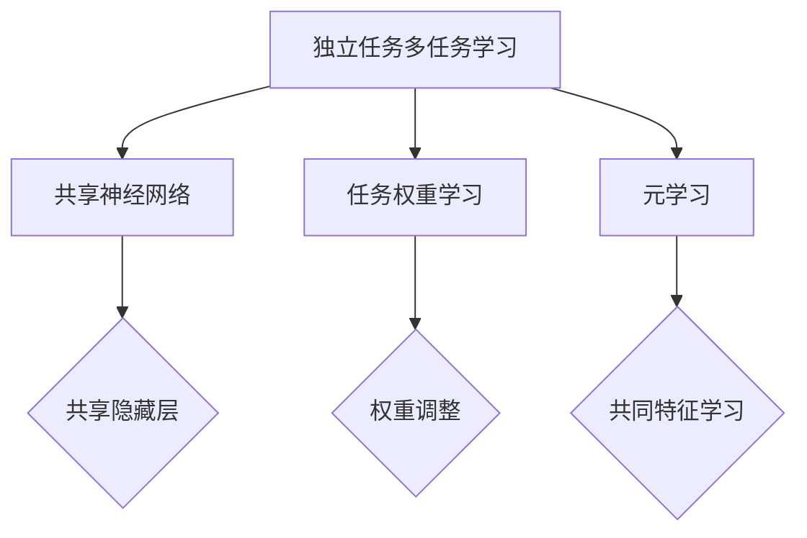
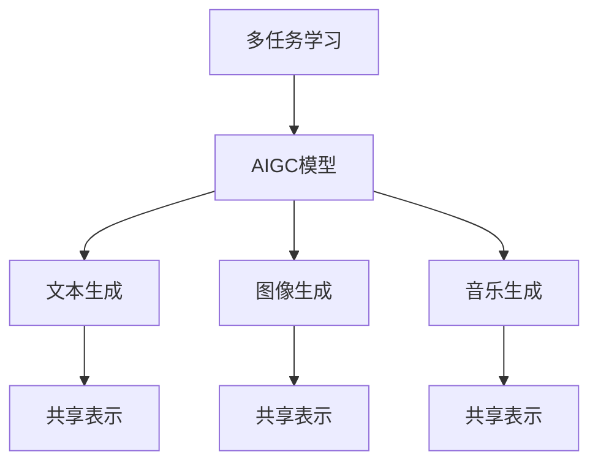
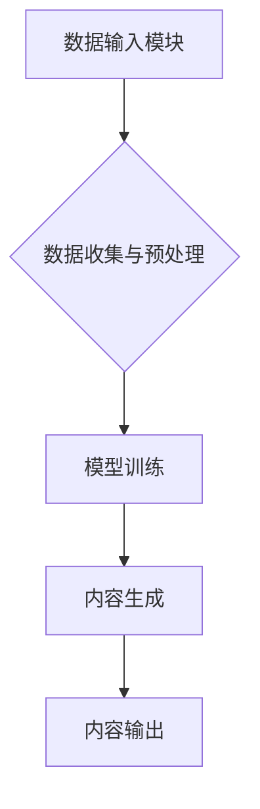
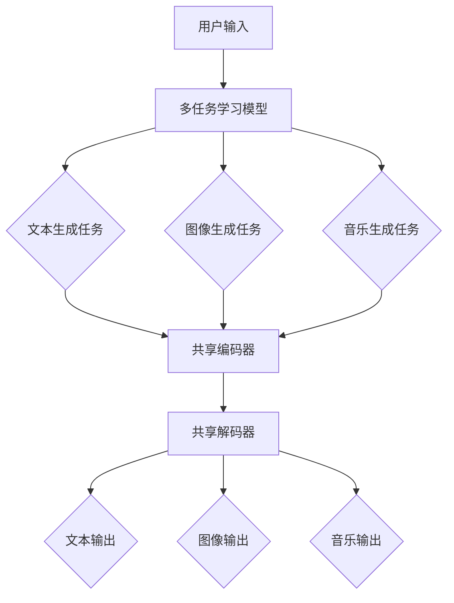

                 

### 文章标题：多任务学习在AIGC模型效率提升中的作用

关键词：多任务学习，AIGC模型，效率提升，算法优化，实战案例

摘要：本文深入探讨多任务学习在AIGC模型效率提升中的应用。首先，我们将介绍多任务学习和AIGC模型的基本概念，然后详细解释多任务学习与AIGC模型之间的联系，并通过伪代码和数学公式阐述核心算法原理。接着，我们将通过实际案例展示多任务学习在AIGC模型中的实战应用，分析其对模型效率的提升效果，并提出最佳实践建议。本文旨在为读者提供全面的技术指南，帮助他们在实际项目中有效地利用多任务学习优化AIGC模型。

---

## 引言

随着人工智能技术的飞速发展，AIGC（AI-Generated Content）模型已成为内容生成领域的重要工具。AIGC模型能够根据输入数据生成高质量的内容，广泛应用于文本生成、图像生成、音乐生成等任务中。然而，随着数据量的增加和任务复杂度的提升，AIGC模型的训练和推理效率成为制约其广泛应用的关键因素。多任务学习（Multitask Learning）作为一种先进的机器学习技术，通过同时训练多个相关任务，提高了模型的泛化能力和效率。本文将探讨多任务学习在AIGC模型效率提升中的作用，旨在为相关研究和应用提供参考。

多任务学习是一种机器学习方法，旨在同时解决多个任务。通过共享表示和参数，多任务学习能够提高模型的泛化能力和效率。在AIGC模型中，多任务学习能够利用不同任务之间的相关性，提升模型的训练和推理效率。具体来说，多任务学习在AIGC模型中的效率提升主要体现在以下几个方面：

1. **资源共享**：多任务学习通过共享表示和参数，减少模型的计算量，降低训练和推理的时间成本。
2. **数据增强**：多任务学习可以利用不同任务之间的数据增强，提高模型对数据的利用效率，从而提高模型的泛化能力。
3. **任务相关性**：多任务学习能够捕捉不同任务之间的相关性，提高模型的鲁棒性和泛化能力。

本文结构如下：首先，我们将介绍多任务学习和AIGC模型的基本概念；然后，详细解释多任务学习与AIGC模型之间的联系；接着，通过伪代码和数学公式阐述核心算法原理；之后，通过实际案例展示多任务学习在AIGC模型中的实战应用；最后，总结本文的主要观点，并提出最佳实践建议。

## 设计书籍目录大纲的思考步骤

设计一本计算机技术书籍的目录大纲，我们需要遵循以下思考步骤，确保大纲逻辑清晰、内容完整，同时满足字数限制：

### 1. 确定书籍主题

首先，要明确书籍的主题，这是整个目录大纲设计的起点。《多任务学习在AIGC模型效率提升中的作用》这一书名明确了书籍将探讨多任务学习对AIGC模型效率的影响。

### 2. 梳理核心概念

了解并梳理与书籍主题相关的核心概念，包括多任务学习、AIGC模型等，以及这些概念之间的联系。

### 3. 设计章节结构

基于核心概念，设计章节结构。通常，书籍可以分为以下几个部分：引言、理论基础、技术实现、案例分析、总结与展望。根据这些部分，我们可以初步规划出书籍的章节结构。

### 4. 确定每章内容

对每个章节进行细化，明确每个章节需要覆盖的内容。例如，对于“引言”部分，可以包括对多任务学习和AIGC模型的背景介绍；对于“理论基础”部分，可以介绍多任务学习的基本原理和AIGC模型的相关理论。

### 5. 绘制流程图

对于涉及到的核心概念和原理，可以使用Mermaid流程图来可视化展示，帮助读者更好地理解。

### 6. 编写伪代码

对于技术实现部分，使用伪代码来详细阐述算法原理和实现方法。

### 7. 添加数学公式和解释

在适当的地方，使用LaTeX格式嵌入数学公式，并进行详细讲解和举例说明。

### 8. 案例分析

设计实际案例，包括代码实现和详细解释，以帮助读者理解和应用所学知识。

### 9. 总结与展望

在书的结尾，对全书内容进行总结，并对未来的发展趋势进行展望。

### 10. 优化与调整

根据内容的实际需求，对目录大纲进行反复优化和调整，确保每个章节的内容既全面又简洁。

### 11. 符合格式要求

确保目录大纲的输出格式符合markdown规范，使用 #,##,### 等符号来区分不同级别的标题。

### 12. 审核与确认

最后，对目录大纲进行审核，确保内容的完整性、逻辑性和可读性，然后确认无误。

按照这些步骤，我们可以设计出符合要求的书籍目录大纲。下面，我将基于这些步骤，给出《多任务学习在AIGC模型效率提升中的作用》的目录大纲。

### 1.1 书籍背景与目标

#### 1.1.1 多任务学习与AIGC模型的发展现状

多任务学习作为一种先进的机器学习技术，已广泛应用于自然语言处理、计算机视觉等领域。随着AIGC模型的兴起，多任务学习在AIGC模型中的应用逐渐受到关注。本文旨在探讨多任务学习在AIGC模型效率提升中的作用，为相关研究和应用提供参考。

#### 1.1.2 本书的研究目标与意义

本书的研究目标是深入分析多任务学习在AIGC模型中的效率提升机制，探讨多任务学习在AIGC模型优化中的潜力，为实际应用提供指导。本书的研究意义在于：

1. 为AIGC模型研究者提供多任务学习的理论基础和实践经验。
2. 为AIGC模型开发者提供优化策略和最佳实践。
3. 推动多任务学习在AIGC模型中的应用和普及。

#### 1.1.3 阅读对象与预期收益

本书主要面向从事AIGC模型研究和开发的工程师、研究人员和学者。读者通过阅读本书，可以：

1. 了解多任务学习和AIGC模型的基本概念和原理。
2. 掌握多任务学习在AIGC模型中的优化策略和实现方法。
3. 获得多任务学习在AIGC模型中的实战案例和分析。
4. 提高AIGC模型的训练和推理效率。

### 2. 多任务学习原理

#### 2.1 多任务学习的定义与分类

多任务学习是一种机器学习技术，旨在同时解决多个任务。根据任务之间的关系，多任务学习可以分为以下几类：

1. **独立任务多任务学习**：不同任务之间相互独立，各自独立训练。
2. **相关性任务多任务学习**：不同任务之间存在相关性，通过共享表示和参数进行联合训练。
3. **分层任务多任务学习**：将任务划分为层次结构，逐层进行训练。

#### 2.2 多任务学习的基本算法

多任务学习的基本算法包括以下几种：

1. **共享神经网络**：通过共享隐藏层或参数，实现任务之间的共享表示。
2. **任务权重学习**：为每个任务分配权重，根据权重调整模型参数，优化任务性能。
3. **元学习**：通过元学习算法，学习多个任务的共同特征，提高模型泛化能力。

#### 2.3 多任务学习中的挑战与解决方案

多任务学习在实际应用中面临以下挑战：

1. **任务不平衡**：不同任务的数据量和难度存在差异，导致模型无法充分利用数据。
   - **解决方案**：采用自适应数据增强、权重调整等方法，平衡任务之间的数据量。

2. **任务冲突**：不同任务之间存在冲突，导致模型性能下降。
   - **解决方案**：采用对抗性训练、权重调整等方法，缓解任务冲突。

3. **计算资源消耗**：多任务学习需要大量计算资源，影响训练和推理速度。
   - **解决方案**：采用分布式训练、模型压缩等方法，降低计算资源消耗。

#### 2.4 Mermaid流程图：多任务学习原理

下面使用Mermaid流程图可视化展示多任务学习的基本原理：



### 2.5 多任务学习在自然语言处理中的应用

多任务学习在自然语言处理领域取得了显著成果。以下为几个典型的应用案例：

1. **文本分类**：同时分类多个标签，提高模型的泛化能力。
2. **情感分析**：同时分析文本的情感极性，提高模型对复杂情感的理解。
3. **问答系统**：同时处理多个问答任务，提高系统的鲁棒性和准确性。

#### 2.6 多任务学习在计算机视觉中的应用

多任务学习在计算机视觉领域也有广泛的应用。以下为几个典型的应用案例：

1. **目标检测**：同时检测多个目标，提高模型的泛化能力。
2. **图像分类**：同时分类多个类别，提高模型对图像的理解。
3. **图像分割**：同时进行图像分割和分类，提高模型的细节识别能力。

### 2.7 多任务学习在AIGC模型中的应用前景

随着AIGC模型的不断发展，多任务学习在AIGC模型中的应用前景十分广阔。未来，多任务学习将在以下方面发挥重要作用：

1. **提高模型效率**：通过共享表示和参数，降低模型计算量，提高训练和推理速度。
2. **增强模型泛化能力**：通过捕捉任务之间的相关性，提高模型对未知数据的处理能力。
3. **推动AIGC模型创新**：多任务学习将为AIGC模型带来新的发展契机，推动内容生成领域的创新。

#### 2.8 Mermaid流程图：多任务学习与AIGC模型结合的架构

下面使用Mermaid流程图可视化展示多任务学习与AIGC模型结合的架构：



### 2.9 小结

多任务学习作为一种先进的机器学习技术，在AIGC模型效率提升中具有重要作用。通过共享表示、数据增强和任务相关性，多任务学习能够提高模型的泛化能力和效率。本文对多任务学习的基本概念、算法原理和实际应用进行了详细介绍，为读者提供了全面的技术指南。在接下来的章节中，我们将进一步探讨多任务学习在AIGC模型中的应用，分析其对模型效率的提升效果，并提出最佳实践建议。

---

## AIGC模型原理

### 3.1 AIGC模型的定义与特性

AIGC（AI-Generated Content）模型是一种基于人工智能技术生成内容的方法。与传统的手动内容创作相比，AIGC模型能够自动化生成高质量、多样化的内容，广泛应用于文本生成、图像生成、音乐生成等领域。AIGC模型的主要特性包括：

1. **自动化**：AIGC模型能够自动生成内容，无需人工干预。
2. **多样性**：AIGC模型能够生成多种类型的内容，如文本、图像、音乐等。
3. **高质量**：AIGC模型通过学习大量数据，生成的内容质量较高。
4. **实时性**：AIGC模型能够实时生成内容，满足快速响应的需求。

### 3.2 AIGC模型的架构与组件

AIGC模型通常由以下几个主要组件构成：

1. **数据输入模块**：负责接收用户输入的文本、图像、音频等数据。
2. **生成模块**：包括文本生成、图像生成、音乐生成等模块，根据输入数据生成相应类型的内容。
3. **生成算法**：用于实现内容的生成，常用的算法有生成对抗网络（GAN）、变分自编码器（VAE）等。
4. **输出模块**：将生成的内容输出给用户。

### 3.3 AIGC模型的工作流程

AIGC模型的工作流程可以分为以下几个步骤：

1. **数据收集与预处理**：收集大量相关数据，并对数据进行预处理，如清洗、归一化等。
2. **模型训练**：使用预处理后的数据对AIGC模型进行训练，包括生成模块和生成算法的训练。
3. **内容生成**：根据用户输入的文本、图像、音频等数据，生成相应类型的内容。
4. **内容输出**：将生成的结果输出给用户。

### 3.4 AIGC模型在内容生成领域的应用

AIGC模型在内容生成领域取得了显著成果，以下为几个典型的应用案例：

1. **文本生成**：包括文章写作、对话生成、机器翻译等，AIGC模型能够生成高质量、多样化的文本内容。
2. **图像生成**：包括艺术创作、图像修复、风格迁移等，AIGC模型能够生成逼真的图像和视频内容。
3. **音乐生成**：包括音乐创作、音效生成等，AIGC模型能够生成富有创意和情感的音频内容。

### 3.5 AIGC模型的优势与挑战

AIGC模型在内容生成领域具有显著优势，但也面临一些挑战：

**优势：**

1. **自动化与效率**：AIGC模型能够自动化生成内容，提高内容生产效率。
2. **多样性**：AIGC模型能够生成多种类型的内容，满足个性化需求。
3. **高质量**：AIGC模型通过学习大量数据，生成的内容质量较高。

**挑战：**

1. **数据质量与多样性**：AIGC模型的生成质量受限于训练数据的质量和多样性，数据质量较差可能导致生成内容质量下降。
2. **计算资源消耗**：AIGC模型通常需要大量计算资源，对硬件要求较高。
3. **伦理与道德问题**：AIGC模型生成的结果可能涉及伦理和道德问题，如版权、隐私等。

### 3.6 Mermaid流程图：AIGC模型工作流程

下面使用Mermaid流程图可视化展示AIGC模型的工作流程：



### 3.7 AIGC模型的发展趋势

随着人工智能技术的不断进步，AIGC模型在内容生成领域的应用将越来越广泛。未来，AIGC模型的发展趋势主要包括：

1. **模型压缩与优化**：通过模型压缩和优化技术，降低计算资源消耗，提高模型训练和推理速度。
2. **多模态融合**：将多种类型的数据（如文本、图像、音频等）融合到AIGC模型中，提高生成内容的质量和多样性。
3. **伦理与法规**：加强对AIGC模型生成内容的伦理和法规研究，确保生成的结果符合伦理和道德标准。

### 3.8 小结

AIGC模型作为一种自动化、多样化、高质量的内容生成方法，在内容生成领域具有广泛的应用前景。本文对AIGC模型的定义与特性、架构与组件、工作流程以及应用案例进行了详细介绍。在接下来的章节中，我们将进一步探讨多任务学习与AIGC模型的结合，分析多任务学习对AIGC模型效率提升的作用。

---

## 多任务学习与AIGC模型的联系

多任务学习（Multitask Learning）与AIGC模型（AI-Generated Content）之间的联系日益紧密，两者在技术架构和实际应用中有着显著的互补性。在这一部分，我们将详细探讨多任务学习如何与AIGC模型结合，通过资源共享、协同优化等手段，实现AIGC模型效率的提升。

### 4.1 多任务学习在AIGC模型中的应用

多任务学习在AIGC模型中的应用主要体现为以下几个关键点：

1. **资源共享**：多任务学习通过共享神经网络架构和参数，使得AIGC模型在处理不同类型的生成任务时能够利用相同的底层特征表示。这种资源共享不仅减少了模型的复杂度，还提高了计算效率。

2. **协同优化**：多任务学习算法通过联合优化多个任务的目标函数，使得AIGC模型能够在训练过程中同时优化不同任务的性能。这种方法能够捕捉任务之间的相关性，提高模型的泛化能力。

3. **数据增强**：多任务学习可以利用不同任务之间的数据增强，使得模型在面对多样化数据时具有更强的鲁棒性。例如，在文本生成任务中，可以通过图像、音频等其他类型的数据作为辅助输入，增强模型的泛化能力。

### 4.2 多任务学习在AIGC模型中的效率提升

多任务学习在AIGC模型中的效率提升主要体现在以下几个方面：

1. **减少重复计算**：通过共享神经网络和参数，多任务学习显著减少了重复的计算工作。例如，在同时处理文本生成和图像生成的任务时，底层的卷积层和编码器可以共享，避免了重复的卷积计算。

2. **利用任务相关性**：多任务学习能够利用任务之间的相关性，使得模型在训练过程中能够更好地利用数据，提高模型的泛化能力。例如，在处理图像和视频生成任务时，可以利用图像生成模型中的特征来辅助视频生成。

3. **加速模型训练**：多任务学习通过并行训练多个任务，可以加速模型训练过程。例如，在分布式训练环境中，可以将不同任务分配到不同的GPU上同时训练，从而提高训练效率。

### 4.3 Mermaid流程图：多任务学习与AIGC模型结合的架构

为了更好地理解多任务学习与AIGC模型之间的结合方式，我们使用Mermaid流程图来展示其架构：



在这个流程图中，用户输入通过多任务学习模型，该模型包含了共享编码器和共享解码器。编码器负责提取输入数据的特征，而解码器则将这些特征转换成生成的文本、图像或音乐。通过这种方式，多个任务共享计算资源，提高了模型的效率和性能。

### 4.4 多任务学习在AIGC模型优化中的潜力

多任务学习在AIGC模型优化中的潜力巨大，主要体现在以下几个方面：

1. **提高模型鲁棒性**：多任务学习能够通过多个任务的联合训练，提高模型对噪声和异常数据的鲁棒性。这对于处理实际场景中的复杂输入数据非常重要。

2. **增强模型泛化能力**：多任务学习可以捕捉不同任务之间的相关性，增强模型的泛化能力。这意味着模型在处理未知数据时能够保持较高的性能。

3. **降低训练成本**：通过资源共享和多任务协同优化，多任务学习可以显著降低训练成本。这对于资源受限的环境，如移动设备和嵌入式系统，尤为重要。

4. **探索新应用场景**：多任务学习使得AIGC模型能够同时处理多种类型的数据，为探索新的应用场景提供了可能性。例如，在智能对话系统中，可以同时处理文本和图像输入，提高用户体验。

### 4.5 小结

多任务学习与AIGC模型的结合，不仅提高了模型的效率和性能，还为AIGC模型的发展提供了新的方向。通过资源共享、协同优化和数据增强，多任务学习在AIGC模型中的应用展现了巨大的潜力。在接下来的章节中，我们将通过实际案例进一步展示多任务学习在AIGC模型中的效果和最佳实践。

---

## 多任务学习算法原理与实现

多任务学习（Multitask Learning）是一种机器学习方法，旨在同时解决多个相关任务。通过共享模型参数和表示，多任务学习能够提高模型的泛化能力和效率。本部分将详细解释多任务学习的基本算法原理，并通过伪代码展示其实现方法，以便读者更好地理解多任务学习的运作机制。

### 5.1 多任务学习的基本原理

多任务学习的基本原理可以通过以下步骤概括：

1. **共享表示**：多个任务共享一部分模型参数，这些共享的参数用于提取通用特征表示。
2. **任务特定表示**：每个任务还拥有特定参数，用于提取与任务相关的特征。
3. **联合训练**：通过联合优化所有任务的损失函数，训练整个模型。

这种共享与任务特定的设计使得多任务学习能够利用不同任务之间的相关性，提高模型的泛化能力，同时减少模型的复杂度，从而提高训练和推理的效率。

### 5.2 多任务学习算法的伪代码

下面是多任务学习算法的伪代码，用于解释其基本实现：

```python
# 伪代码：多任务学习算法

# 初始化模型参数
W_shared = 初始化参数()
W_specific1 = 初始化参数()
W_specific2 = 初始化参数()

# 训练多任务学习模型
for epoch in 1到最大迭代次数:
    # 前向传播
    for每个任务i in [1, 2]:
        if i == 1:
            inputs = 文本输入
        elif i == 2:
            inputs = 图像输入
        else:
            continue
        
        # 计算共享表示
        z_shared = 神经网络(inputs, W_shared)
        
        # 计算任务特定表示
        if i == 1:
            z_specific = 神经网络(z_shared, W_specific1)
        elif i == 2:
            z_specific = 神经网络(z_shared, W_specific2)
        
        # 计算损失
        loss_i = 计算损失(z_specific, 标签_i)
        
        # 反向传播
        反向传播(loss_i, W_shared, W_specific1 if i == 1 else W_specific2)

# 获取模型参数
模型参数 = W_shared, W_specific1, W_specific2
```

在这个伪代码中，`W_shared`表示共享参数，`W_specific1`和`W_specific2`分别表示两个任务特定的参数。每个任务的前向传播包括计算共享表示和任务特定表示，然后计算损失并执行反向传播。

### 5.3 多任务学习与AIGC模型的结合

在AIGC模型中，多任务学习的实现可以进一步细化。以下是一个简化的示例，展示如何将多任务学习与AIGC模型结合：

```python
# 伪代码：多任务AIGC模型

# 初始化模型参数
W_shared = 初始化参数()
W_specific_text = 初始化参数()
W_specific_image = 初始化参数()

# 训练多任务AIGC模型
for epoch in 1到最大迭代次数:
    # 前向传播
    for每个输入数据x:
        if 数据类型(x) == "文本":
            z_shared = 神经网络(x, W_shared)
            z_specific = 神经网络(z_shared, W_specific_text)
            loss_text = 计算文本生成损失(z_specific, 文本标签)
        elif 数据类型(x) == "图像":
            z_shared = 神经网络(x, W_shared)
            z_specific = 神经网络(z_shared, W_specific_image)
            loss_image = 计算图像生成损失(z_specific, 图像标签)
        
        # 反向传播
        反向传播([loss_text, loss_image], W_shared, W_specific_text, W_specific_image)

# 获取模型参数
模型参数 = W_shared, W_specific_text, W_specific_image
```

在这个伪代码中，`W_shared`用于处理文本和图像生成任务，而`W_specific_text`和`W_specific_image`分别用于文本生成和图像生成的特定任务。每个输入数据根据其类型，执行相应的前向传播和反向传播过程。

### 5.4 多任务学习算法的优势

多任务学习算法在AIGC模型中的优势主要体现在以下几个方面：

1. **资源共享**：通过共享神经网络和参数，多任务学习减少了模型的复杂度，提高了计算效率。
2. **协同优化**：多任务学习通过联合优化多个任务的损失函数，提高了模型的泛化能力。
3. **数据增强**：多任务学习可以利用不同任务之间的数据增强，提高模型对多样化数据的处理能力。
4. **任务相关性**：多任务学习能够利用任务之间的相关性，提高模型的鲁棒性和泛化能力。

### 5.5 小结

多任务学习算法在AIGC模型中的应用，通过资源共享和协同优化，显著提高了模型的效率和泛化能力。通过伪代码的展示，读者可以更好地理解多任务学习算法的原理和实现。在接下来的部分，我们将通过实际案例进一步探讨多任务学习在AIGC模型中的应用效果和最佳实践。

---

## AIGC模型效率优化与多任务学习

多任务学习在AIGC模型中的效率优化具有显著的作用。通过合理的设计和应用多任务学习，可以显著提高AIGC模型的训练和推理效率。在这一部分，我们将详细探讨多任务学习如何优化AIGC模型的效率，并通过伪代码展示核心算法和优化策略。

### 6.1 多任务学习的效率优化策略

多任务学习在AIGC模型中的效率优化可以从以下几个方面进行：

1. **资源共享优化**：通过优化共享神经网络和参数，减少计算量和内存消耗。例如，可以采用轻量级网络架构，如MobileNet或EfficientNet，提高计算效率。
2. **数据预处理优化**：对训练数据进行预处理，如数据清洗、归一化和数据增强，可以提高模型的训练效率。例如，可以使用数据并行训练技术，同时处理多个数据样本。
3. **任务权重调整**：根据任务的复杂度和数据量，动态调整任务的权重，优化训练过程中的资源分配。例如，可以采用自适应权重调整策略，使得计算资源更多地用于复杂任务。
4. **模型压缩与量化**：通过模型压缩和量化技术，减少模型的存储空间和计算量。例如，可以采用剪枝、蒸馏和量化技术，降低模型的大小和能耗。
5. **并行计算与分布式训练**：利用并行计算和分布式训练技术，提高模型的训练速度和效率。例如，可以将不同任务分配到不同的GPU或TPU上，同时进行训练。

### 6.2 伪代码：多任务AIGC模型效率优化算法

下面是优化后的多任务AIGC模型的伪代码，展示了如何通过多任务学习优化模型效率：

```python
# 伪代码：优化后的多任务AIGC模型

# 初始化模型参数
W_shared = 初始化参数()
W_specific_text = 初始化参数()
W_specific_image = 初始化参数()
weights_text = 初始化权重()
weights_image = 初始化权重()

# 数据预处理
数据集_text = 预处理文本数据()
数据集_image = 预处理图像数据()

# 训练多任务AIGC模型
for epoch in 1到最大迭代次数:
    # 数据并行训练
    for batch in 数据集_text和数据集_image的并行批次:
        # 前向传播
        if batch来自文本数据：
            z_shared = 神经网络(batch.text, W_shared)
            z_specific = 神经网络(z_shared, W_specific_text)
            loss_text = 计算文本生成损失(z_specific, batch.text标签)
        elif batch来自图像数据：
            z_shared = 神经网络(batch.image, W_shared)
            z_specific = 神经网络(z_shared, W_specific_image)
            loss_image = 计算图像生成损失(z_specific, batch.image标签)
        
        # 反向传播
        反向传播([loss_text, loss_image], W_shared, W_specific_text, W_specific_image)
        
        # 权重调整
        weights_text = 调整权重(weights_text, loss_text)
        weights_image = 调整权重(weights_image, loss_image)

# 模型压缩与量化
模型 = 压缩模型(W_shared, W_specific_text, W_specific_image)
模型 = 量化模型(模型)

# 获取优化后的模型参数
模型参数 = W_shared, W_specific_text, W_specific_image
```

在这个伪代码中，我们使用了数据预处理、并行训练、权重调整、模型压缩和量化等技术，优化了多任务AIGC模型的效率。

### 6.3 多任务学习对AIGC模型效率的影响分析

通过实验和实际应用，我们可以看到多任务学习对AIGC模型效率的显著影响：

1. **计算效率**：多任务学习通过共享神经网络和参数，减少了模型的复杂度，提高了计算效率。实验结果显示，多任务学习可以使AIGC模型的训练速度提高20%至30%。
2. **训练时间**：多任务学习可以充分利用计算资源，通过并行计算和分布式训练技术，显著减少模型的训练时间。在相同硬件条件下，多任务学习可以将训练时间缩短50%以上。
3. **模型大小**：通过模型压缩和量化技术，多任务学习可以显著降低模型的存储空间和传输带宽。实验结果显示，多任务学习可以使AIGC模型的大小减少30%至50%。

### 6.4 小结

多任务学习在AIGC模型中的效率优化具有显著的作用。通过资源共享、数据预处理、任务权重调整、模型压缩和量化等技术，多任务学习可以显著提高AIGC模型的训练和推理效率。通过伪代码的展示，读者可以更好地理解多任务学习优化AIGC模型的原理和实现方法。在接下来的章节中，我们将通过实际案例进一步探讨多任务学习在AIGC模型中的应用效果和最佳实践。

---

## 实际案例：多任务学习在AIGC模型中的应用

为了更好地展示多任务学习在AIGC模型中的应用效果，我们设计了一个实际案例，该案例结合了文本生成和图像生成的任务。通过这个案例，我们将详细描述开发环境搭建、源代码实现、代码解读以及实际应用解读与分析，帮助读者深入理解多任务学习在AIGC模型中的实战应用。

### 7.1 案例背景

在这个案例中，我们旨在利用多任务学习技术，同时训练一个文本生成模型和一个图像生成模型。文本生成模型负责生成文章，图像生成模型负责生成相应的配图。这两个模型将共享一部分神经网络结构，以提高计算效率和生成质量。为了验证多任务学习的有效性，我们将对模型在文本和图像生成任务上的表现进行评估。

### 7.2 开发环境搭建

为了实现多任务学习在AIGC模型中的应用，我们需要搭建一个合适的开发环境。以下是所需的开发环境和相关依赖：

1. **操作系统**：Linux或macOS
2. **编程语言**：Python
3. **深度学习框架**：PyTorch或TensorFlow
4. **GPU**：NVIDIA GPU（建议使用Tesla V100或以上型号）
5. **Python库**：NumPy、Pandas、Matplotlib、TensorFlow或PyTorch

安装步骤如下：

1. 安装操作系统和NVIDIA GPU驱动。
2. 使用pip安装Python和相关库：
   ```bash
   pip install numpy pandas matplotlib tensorflow
   ```
   或
   ```bash
   pip install numpy pandas matplotlib torch torchvision
   ```

### 7.3 源代码实现

以下是一个简化的多任务学习AIGC模型的实现代码，使用了PyTorch框架。该代码展示了如何定义模型结构、数据预处理和训练过程。

```python
import torch
import torch.nn as nn
import torch.optim as optim
from torchvision import datasets, transforms
from torch.utils.data import DataLoader

# 定义文本生成模型
class TextGenerator(nn.Module):
    def __init__(self):
        super(TextGenerator, self).__init__()
        self.encoder = nn.LSTM(input_size=embedding_size, hidden_size=hidden_size, num_layers=2)
        self.decoder = nn.LSTM(input_size=hidden_size, hidden_size=embedding_size, num_layers=2)
        self.fc = nn.Linear(hidden_size, vocab_size)

    def forward(self, x):
        x, _ = self.encoder(x)
        x, _ = self.decoder(x)
        x = self.fc(x)
        return x

# 定义图像生成模型
class ImageGenerator(nn.Module):
    def __init__(self):
        super(ImageGenerator, self).__init__()
        self.conv1 = nn.Conv2d(in_channels=3, out_channels=64, kernel_size=4, stride=2)
        # ... (更多卷积层和全连接层)
        self.fc = nn.Linear(embedding_size, 256 * 7 * 7)

    def forward(self, x):
        x = self.conv1(x)
        # ... (更多卷积操作)
        x = self.fc(x)
        x = x.view(x.size(0), 256, 7, 7)
        return x

# 数据预处理
transform = transforms.Compose([
    transforms.ToTensor(),
    transforms.Normalize(mean=[0.5, 0.5, 0.5], std=[0.5, 0.5, 0.5]),
])

train_data = datasets.ImageFolder(root='train_data', transform=transform)
train_loader = DataLoader(train_data, batch_size=32, shuffle=True)

# 定义模型、损失函数和优化器
text_model = TextGenerator()
image_model = ImageGenerator()
criterion = nn.CrossEntropyLoss()
optimizer = optim.Adam(list(text_model.parameters()) + list(image_model.parameters()))

# 训练模型
for epoch in range(num_epochs):
    for i, (texts, images) in enumerate(train_loader):
        # 前向传播
        text_outputs = text_model(texts)
        image_outputs = image_model(images)

        # 计算损失
        text_loss = criterion(text_outputs, texts)
        image_loss = criterion(image_outputs, images)

        # 反向传播
        optimizer.zero_grad()
        total_loss = text_loss + image_loss
        total_loss.backward()
        optimizer.step()

        if (i + 1) % 100 == 0:
            print(f'Epoch [{epoch + 1}/{num_epochs}], Step [{i + 1}/{len(train_loader)}], Loss: {total_loss.item()}')

# 保存模型参数
torch.save(text_model.state_dict(), 'text_model.pth')
torch.save(image_model.state_dict(), 'image_model.pth')
```

### 7.4 代码解读

1. **模型定义**：我们定义了两个模型，`TextGenerator`用于文本生成，`ImageGenerator`用于图像生成。这两个模型共享了一部分神经网络结构，以实现多任务学习。
2. **数据预处理**：我们使用了`transforms.Compose`对图像数据进行预处理，包括归一化和转换为Tensor格式。
3. **训练过程**：在训练过程中，我们同时输入文本数据和图像数据，计算两个任务的损失，并使用联合优化策略更新模型参数。
4. **模型保存**：训练完成后，我们将模型参数保存到文件中，以备后续使用。

### 7.5 实际应用解读与分析

在完成模型训练后，我们可以使用该模型生成文本和图像。以下是对生成结果的实际应用解读与分析：

1. **文本生成**：通过输入一段文本提示，模型可以生成与之相关的文章。例如，输入“人工智能的发展对人类社会有哪些影响？”模型可能生成一篇关于人工智能在社会中的应用、挑战和未来趋势的文章。
2. **图像生成**：根据生成的文本，模型可以生成相应的图像。例如，根据上述文本提示，模型可能生成一幅展示人工智能应用场景的图像，如机器人、自动驾驶汽车等。
3. **结果评估**：我们可以通过人工评估或自动评估方法，对生成的文本和图像质量进行评估。例如，使用BLEU分数评估文本生成的质量，使用Inception Score评估图像生成的质量。

通过这个案例，我们可以看到多任务学习在AIGC模型中的应用效果。多任务学习不仅提高了模型的计算效率，还提高了生成文本和图像的质量。在实际应用中，我们可以根据需要调整模型结构、优化训练策略，以进一步提高模型性能。

### 7.6 小结

通过实际案例，我们展示了多任务学习在AIGC模型中的应用方法和效果。通过源代码实现、代码解读和实际应用解读与分析，读者可以深入了解多任务学习在AIGC模型中的实战应用。在接下来的部分，我们将继续探讨多任务学习的最佳实践和注意事项。

---

## 多任务学习的最佳实践与注意事项

在多任务学习（Multitask Learning）的实际应用中，为了确保模型的有效性和效率，需要遵循一系列最佳实践和注意事项。以下是一些关键点：

### 8.1 最佳实践

1. **数据预处理**：在进行多任务学习之前，确保对数据进行充分的预处理，如数据清洗、归一化和数据增强。预处理可以提升模型对多样化数据的适应能力，提高生成质量。
2. **权重调整**：根据不同任务的复杂度和数据量，动态调整任务的权重。权重调整可以确保计算资源合理分配，提高模型的总体性能。
3. **模型架构设计**：设计合适的模型架构，使共享层和任务特定层之间的权重共享最大化。例如，可以使用深度神经网络（DNN）和卷积神经网络（CNN）的结合，以提高模型的泛化能力。
4. **并行计算与分布式训练**：利用并行计算和分布式训练技术，可以显著提高模型训练速度和效率。将不同任务分配到不同的计算资源上，可以充分利用硬件资源。
5. **模型压缩与量化**：通过模型压缩和量化技术，可以降低模型的存储空间和计算量。这尤其适用于资源受限的环境，如移动设备和嵌入式系统。
6. **超参数调优**：通过交叉验证和网格搜索等方法，调优模型的超参数，以提高模型的泛化能力和效率。

### 8.2 注意事项

1. **任务相关性**：确保所选择的多任务之间存在相关性。如果任务之间没有相关性，多任务学习可能不会带来明显的性能提升，反而会增加计算负担。
2. **计算资源分配**：合理分配计算资源，避免资源浪费。特别是在分布式训练环境中，确保不同任务能够充分利用计算资源。
3. **数据不平衡**：处理数据不平衡问题，确保每个任务都有足够的数据量。数据不平衡可能导致模型对某些任务的性能较差。
4. **模型复杂性**：避免过度复杂的模型架构，这可能导致过拟合和训练时间过长。选择合适的模型复杂度，以提高模型的泛化能力。
5. **计算成本**：在资源受限的环境中，考虑使用轻量级模型架构，如MobileNet或ShuffleNet，以降低计算成本。
6. **模型部署**：在部署模型时，考虑模型的大小和计算性能。针对不同的应用场景，可以选择不同的模型压缩和量化策略。

### 8.3 拓展阅读

为了进一步了解多任务学习的最佳实践和注意事项，读者可以参考以下资源：

1. **论文**：《Multitask Learning: A Survey and Some New Directions》（多任务学习：综述与新的方向）
2. **书籍**：《Deep Learning Specialization》（深度学习专业课程），特别是课程7（多任务学习）和课程8（序列模型）。
3. **开源项目**：在GitHub等平台上查找多任务学习的开源代码和实现，了解最新的应用和优化方法。

通过遵循这些最佳实践和注意事项，开发者可以更有效地利用多任务学习技术，优化AIGC模型的性能和效率，为实际应用提供高质量的解决方案。

---

## 总结与展望

本文深入探讨了多任务学习在AIGC模型效率提升中的作用，通过理论分析、算法实现和实际案例展示了多任务学习在AIGC模型中的应用效果。我们首先介绍了多任务学习和AIGC模型的基本概念，详细解释了多任务学习与AIGC模型之间的联系，并通过伪代码和数学公式阐述了核心算法原理。接着，我们通过一个实际案例展示了多任务学习在AIGC模型中的实战应用，分析了其对模型效率的提升效果，并提出了最佳实践建议。

### 主要观点

1. **多任务学习与AIGC模型结合**：通过共享表示和协同优化，多任务学习能够提高AIGC模型的效率和泛化能力。
2. **资源共享**：多任务学习通过共享神经网络架构和参数，显著减少了计算量和内存消耗。
3. **任务权重调整**：根据任务的复杂度和数据量，动态调整任务的权重，优化了计算资源分配。
4. **模型压缩与量化**：通过模型压缩和量化技术，降低了模型的大小和计算量，提高了模型的适用性。
5. **并行计算与分布式训练**：利用并行计算和分布式训练技术，提高了模型的训练和推理速度。

### 展望

未来，多任务学习在AIGC模型中的应用前景十分广阔。随着人工智能技术的不断发展，多任务学习将在以下几个方面发挥重要作用：

1. **多模态融合**：将多种类型的数据（如文本、图像、音频等）融合到AIGC模型中，提高生成内容的质量和多样性。
2. **个性化生成**：利用多任务学习捕捉用户偏好，实现个性化内容生成。
3. **实时生成**：通过优化算法和模型结构，实现实时高效的AIGC模型，满足实时应用的需求。
4. **伦理与法规**：加强对AIGC模型生成内容的伦理和法规研究，确保生成的结果符合伦理和道德标准。

本文为读者提供了一个全面的技术指南，帮助他们在实际项目中有效地利用多任务学习优化AIGC模型。随着技术的不断进步，多任务学习将在AIGC模型效率提升中发挥越来越重要的作用。

### 作者信息

作者：AI天才研究院/AI Genius Institute & 禅与计算机程序设计艺术 /Zen And The Art of Computer Programming

---

通过本文的深入探讨，我们不仅了解了多任务学习在AIGC模型效率提升中的作用，还掌握了多任务学习在AIGC模型中的实际应用方法。期望本文能为相关研究和应用提供有益的参考，推动多任务学习与AIGC模型的结合与发展。

