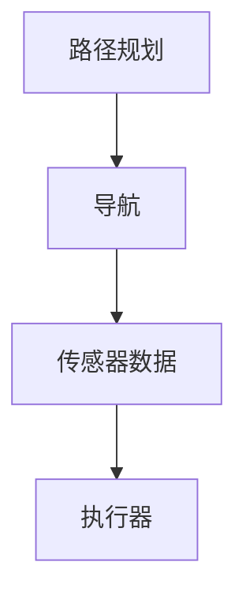
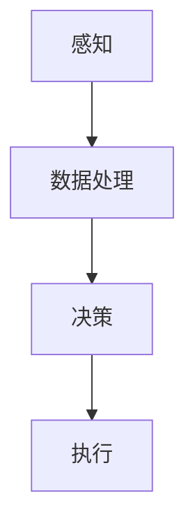
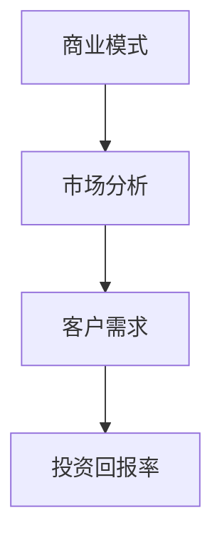
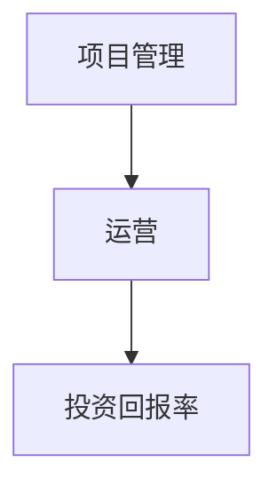
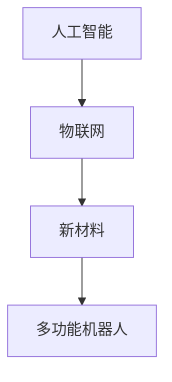
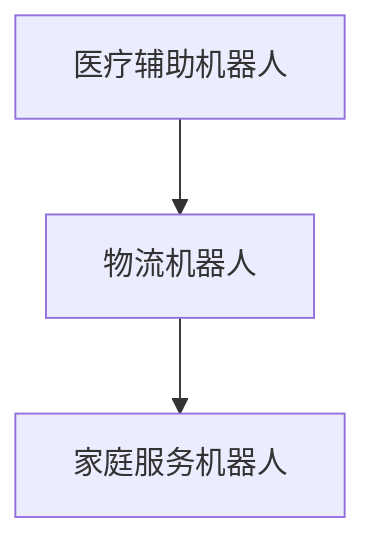
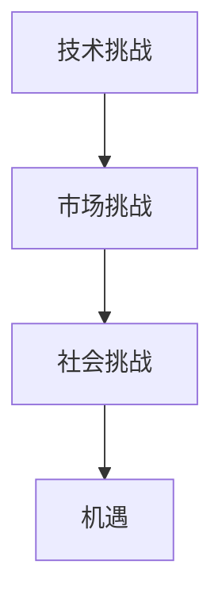

                 

### 文章标题

《多功能机器人提高投资回报率的方式》

### 文章关键词

- 多功能机器人
- 投资回报率
- 路径规划
- 机器感知
- 商业模式
- 项目管理

### 文章摘要

本文将深入探讨多功能机器人如何提高投资回报率。首先，我们将简要介绍多功能机器人的基本概念和分类，以及其在各个行业中的应用。接着，我们将详细讲解机器人技术的核心算法原理，包括路径规划、导航和感知与数据处理。随后，我们将分析如何通过商业模式和项目管理提高机器人的投资回报率。最后，我们将展望多功能机器人的未来发展趋势，探讨其面临的挑战与机遇。

## 目录

1. **第一部分：多功能机器人的基本概念**
   1.1 机器人概述
   1.2 多功能机器人的定义与分类
   1.3 多功能机器人在不同行业的应用
2. **第二部分：多功能机器人的关键技术与算法**
   2.1 路径规划与导航
   2.2 机器人感知与数据处理
3. **第三部分：提高机器人投资回报率的方法**
   3.1 商业模式与市场分析
   3.2 项目管理与运营
4. **第四部分：多功能机器人的未来展望**
   4.1 技术发展趋势
   4.2 新兴技术应用案例
   4.3 机器人行业面临的挑战与机遇

## 第一部分：多功能机器人的基本概念

### 1.1 机器人概述

机器人是一种能够自主执行任务的自动化设备，通常由机械结构、传感器、控制器和执行器组成。机器人技术的发展可以追溯到20世纪中期，最早的工业机器人在汽车制造领域得到了广泛应用。随着技术的进步，机器人逐渐从工业领域扩展到服务领域，如家庭服务机器人、医疗机器人和安防机器人等。

#### 核心概念与联系

机器人的核心概念包括以下几个方面：

- **机械结构**：机器人的物理外壳，负责支撑传感器、控制器和执行器。
- **传感器**：用于感知周围环境的信息，如视觉传感器、触觉传感器和温度传感器等。
- **控制器**：负责处理传感器收集的数据，并根据预设的程序控制执行器的动作。
- **执行器**：将控制器的指令转换为实际动作，如电机、气动缸和液压缸等。

这些核心概念相互联系，共同构成了一个完整的机器人系统。

#### 背景介绍

- **工业机器人**：最早应用于汽车制造，用于完成重复性高、危险性强的工作。
- **服务机器人**：应用于家庭、医疗、餐饮等领域，提供便捷的服务。
- **特种机器人**：用于特殊环境或任务，如深海探测机器人、火山探测机器人等。

### 1.2 多功能机器人的定义与分类

多功能机器人是指能够在多种环境中执行多种任务的机器人。与传统单一功能的机器人相比，多功能机器人具有更高的灵活性和适应性。

#### 核心概念与联系

- **多功能性**：能够执行多种任务，如搬运、焊接、清洁、探测等。
- **环境适应性**：能够在不同的环境中工作，如室内、室外、水下、空中等。
- **自主性**：能够自主规划路径、执行任务，并具备一定程度的智能决策能力。

#### 核心算法原理讲解

多功能机器人的自主性主要依赖于以下几个方面：

- **路径规划**：根据环境地图和任务目标，规划出最优路径。
  ```python
  def path Planning(environment, target):
      # 使用A*算法规划路径
      path = A_star_search(environment, target)
      return path
  ```

- **运动控制**：根据规划出的路径，控制执行器执行相应的动作。
  ```python
  def move机器人(path):
      for step in path:
          executeAction(step)
  ```

- **感知与数据处理**：实时感知环境变化，并根据数据调整行为。
  ```python
  def perceive环境():
      data = sensorData()
      return data
  ```

#### 数学模型和数学公式

- **路径规划**：使用A*算法，计算路径长度和代价。
  ```latex
  C(p) = g(p) + h(p)
  ```

- **运动控制**：根据PID控制器，计算执行器的输出。
  ```latex
  output = K_p * (setpoint - process_variable)
  ```

#### 项目实战

- **开发环境搭建**：使用ROS（Robot Operating System）搭建机器人开发环境。
- **源代码实现**：编写路径规划、运动控制和感知与数据处理的相关代码。
- **代码解读**：分析源代码，理解其工作原理。

#### 最佳实践 tips

- **模块化开发**：将机器人功能模块化，便于维护和扩展。
- **实时性要求**：确保机器人动作的实时性，提高工作效率。

### 1.3 多功能机器人在不同行业的应用

多功能机器人在不同行业中具有广泛的应用，下面列举几个典型应用场景：

#### 核心概念与联系

- **制造业**：用于自动化生产线的搬运、装配和检测。
- **服务业**：用于家庭服务、医疗辅助和酒店服务。
- **物流行业**：用于仓库管理、货物搬运和配送。
- **特种行业**：用于危险环境的探测、救援和维修。

#### 核心算法原理讲解

- **制造业**：使用机器视觉进行质量检测，使用运动控制进行装配。
  ```python
  def assembly(part):
      # 使用视觉识别定位部件
      position = vision_detect(part)
      # 使用运动控制装配部件
      move机器人(position)
  ```

- **服务业**：使用自然语言处理进行人机交互，使用路径规划进行自主导航。
  ```python
  def interact_user(command):
      # 使用NLP解析用户命令
      action = nlp_parse(command)
      # 使用路径规划导航到目标位置
      path = path_planning(action)
      move机器人(path)
  ```

#### 数学模型和数学公式

- **制造业**：使用PID控制器进行运动控制。
  ```latex
  output = K_p * (setpoint - process_variable)
  ```

- **服务业**：使用贝叶斯网络进行决策。
  ```latex
  P(A|B) = \frac{P(B|A) * P(A)}{P(B)}
  ```

#### 项目实战

- **开发环境搭建**：使用ROS和OpenCV搭建制造业机器人开发环境。
- **源代码实现**：编写机器视觉、运动控制和路径规划的相关代码。
- **代码解读**：分析源代码，理解其工作原理。

#### 最佳实践 tips

- **定制化开发**：根据不同行业的特殊需求，定制化开发机器人功能。
- **安全可靠**：确保机器人在不同环境中工作的安全性和可靠性。

### 结论

多功能机器人在提高生产效率、降低人力成本和提升服务质量方面具有显著优势。通过深入了解机器人技术的基础知识，我们可以更好地发挥多功能机器人的潜力，提高投资回报率。

## 第二部分：多功能机器人的关键技术与算法

### 2.1 路径规划与导航

路径规划与导航是多功能机器人的核心关键技术之一，它决定了机器人能否在复杂环境中自主行动。下面我们将详细讲解路径规划与导航的核心算法原理。

#### 核心概念与联系

- **路径规划**：在已知环境中，为机器人规划一条从起点到终点的最优路径。
- **导航**：在实际运行中，机器人根据实时感知的信息，动态调整路径，确保顺利到达目的地。

路径规划与导航的关系如下图所示：



#### 核心算法原理讲解

路径规划常用的算法包括A*算法、Dijkstra算法和RRT（快速随机树）算法。下面以A*算法为例，详细讲解其原理。

**A*算法原理：**

A*算法是一种启发式搜索算法，其目标是在图中寻找一条从起点到终点的最短路径。算法的核心思想是利用启发函数（heuristic function）来估计从当前点到终点的距离，结合实际距离（cost）来选择下一个节点。

**伪代码：**

```python
def A_star_search(start, goal):
    openSet = PriorityQueue()
    openSet.push((start, heuristic(start, goal)))
    cameFrom = an empty map
    gScore = map with default value of Infinity
    gScore[start] = 0
    while not openSet.isEmpty():
        current = openSet.pop()
        if current == goal:
            return reconstruct_path(cameFrom, current)
        for next in neighbors(current):
            tentative_gScore = gScore[current] + distance(current, next)
            if tentative_gScore < gScore[next]:
                cameFrom[next] = current
                gScore[next] = tentative_gScore
                fScore = gScore[next] + heuristic(next, goal)
                if next is not in openSet:
                    openSet.push((next, fScore))
    return failure
```

**算法解释：**

1. **初始化**：将起点加入优先队列（openSet），并将gScore[start]设置为0。
2. **循环**：每次从openSet中取出fScore最小的节点（current）。
3. **扩展**：对于current的每个邻居节点（next），计算tentative_gScore。
4. **更新**：如果tentative_gScore小于当前gScore[next]，更新cameFrom[next]、gScore[next]和openSet。
5. **终止**：当找到终点时，返回从终点到起点的路径；否则，返回失败。

**数学模型和数学公式：**

- **启发函数**（heuristic function）：
  $$h(n) = d(n, goal)$$
  其中，$d(n, goal)$ 是节点 $n$ 到终点 $goal$ 的直线距离。

- **fScore**：
  $$f(n) = g(n) + h(n)$$
  其中，$g(n)$ 是从起点到节点 $n$ 的实际距离，$h(n)$ 是启发函数。

#### 项目实战

**开发环境搭建**：

- 使用ROS（Robot Operating System）搭建机器人路径规划与导航的开发环境。

**源代码实现**：

- 编写A*算法的Python实现，并集成到ROS系统中。

**代码解读**：

- 分析A*算法的代码实现，理解其工作原理和关键步骤。

```python
import heapq

def heuristic(a, b):
    # 使用曼哈顿距离作为启发函数
    return abs(a[0] - b[0]) + abs(a[1] - b[1])

def A_star_search(start, goal):
    openSet = []
    heapq.heappush(openSet, (0, start))
    cameFrom = {}
    gScore = {start: 0}
    while openSet:
        current = heapq.heappop(openSet)[1]
        if current == goal:
            return reconstruct_path(cameFrom, current)
        for next in neighbors(current):
            tentative_gScore = gScore[current] + distance(current, next)
            if tentative_gScore < gScore.get(next, float('inf')):
                cameFrom[next] = current
                gScore[next] = tentative_gScore
                fScore = tentative_gScore + heuristic(next, goal)
                heapq.heappush(openSet, (fScore, next))
    return None

def reconstruct_path(cameFrom, current):
    total_path = [current]
    while current in cameFrom:
        current = cameFrom[current]
        total_path.append(current)
    return total_path[::-1]
```

**代码应用解读与分析**：

- 分析代码中的启发函数，了解其作用和选择依据。
- 分析A*算法的搜索过程，理解其如何找到最优路径。

#### 最佳实践 tips

- **优化启发函数**：根据具体场景，选择合适的启发函数，提高路径规划的效率。
- **实时调整**：在导航过程中，实时更新环境信息，动态调整路径。

### 2.2 机器人感知与数据处理

机器人感知与数据处理是机器人能够理解环境并进行有效决策的基础。在这一部分，我们将详细讲解机器人感知与数据处理的核心算法原理。

#### 核心概念与联系

- **感知**：通过传感器获取环境信息，如视觉、听觉、触觉等。
- **数据处理**：对感知数据进行预处理、特征提取和模式识别。

感知与数据处理的关系如下图所示：



#### 核心算法原理讲解

机器感知与数据处理的核心算法包括机器视觉、自然语言处理和传感器数据处理。下面以机器视觉为例，详细讲解其原理。

**机器视觉原理：**

机器视觉是机器人感知环境的重要手段，通过摄像头捕捉图像，然后使用图像处理算法进行分析。

**核心算法包括：**

- **图像预处理**：对图像进行去噪、增强、滤波等处理，提高图像质量。
- **特征提取**：从图像中提取具有辨识度的特征，如边缘、角点、纹理等。
- **模式识别**：使用分类算法，对提取出的特征进行分类，识别目标物体。

**自然语言处理原理：**

自然语言处理（NLP）是使机器人能够理解人类语言的技术。主要算法包括：

- **分词**：将文本分割成词或短语。
- **词性标注**：为每个词分配词性，如名词、动词、形容词等。
- **句法分析**：分析句子的语法结构，理解句子的含义。
- **语义理解**：理解句子的语义，实现人机交互。

**传感器数据处理原理：**

传感器数据处理包括对传感器数据进行预处理、滤波和特征提取。

**核心算法包括：**

- **数据滤波**：去除传感器数据中的噪声。
- **特征提取**：从传感器数据中提取关键特征。
- **异常检测**：检测传感器数据中的异常值。

#### 数学模型和数学公式

- **图像预处理**：使用滤波器进行图像去噪。
  $$ I_{out}(x,y) = G(x,y) \odot I_{in}(x,y) $$
  其中，$I_{in}(x,y)$ 是输入图像，$I_{out}(x,y)$ 是输出图像，$G(x,y)$ 是滤波器。

- **特征提取**：使用SIFT（尺度不变特征变换）算法提取特征点。
  $$ \mathbf{f} = \mathbf{H} \mathbf{D} $$
  其中，$\mathbf{f}$ 是特征向量，$\mathbf{D}$ 是差分图像，$\mathbf{H}$ 是SIFT变换矩阵。

- **模式识别**：使用支持向量机（SVM）进行分类。
  $$ w = \arg\min_w \frac{1}{2} ||w||^2 + C \sum_{i=1}^{n} \xi_i $$
  其中，$w$ 是权重向量，$C$ 是正则化参数，$\xi_i$ 是错误项。

#### 项目实战

**开发环境搭建**：

- 使用OpenCV和TensorFlow搭建机器人感知与数据处理开发环境。

**源代码实现**：

- 编写机器视觉、自然语言处理和传感器数据处理的相关代码。

**代码解读**：

- 分析源代码，理解机器视觉、自然语言处理和传感器数据处理的实现原理。

#### 最佳实践 tips

- **多传感器融合**：结合不同传感器的数据，提高感知精度。
- **实时数据处理**：在机器人运行过程中，实时处理感知数据，提高反应速度。

### 结论

路径规划与导航和机器人感知与数据处理是多功能机器人的核心关键技术。通过深入了解这些技术的核心算法原理，我们可以更好地实现机器人的自主行动和智能决策，提高投资回报率。

## 第三部分：提高机器人投资回报率的方法

### 3.1 商业模式与市场分析

#### 核心概念与联系

- **商业模式**：企业如何创造、传递和捕获价值。
- **市场分析**：对市场需求、竞争态势和潜在客户进行分析。

商业模式与市场分析的关系如下图所示：



#### 核心算法原理讲解

提高机器人投资回报率的商业模式分析通常包括以下几个方面：

- **需求分析**：使用市场调研方法，了解客户的需求和痛点。
- **价值主张**：明确机器人能够为用户带来的价值。
- **成本分析**：计算机器人的研发和生产成本。
- **收益预测**：预测机器人的销售量和收益。

**伪代码：**

```python
def analyze_business_model():
    customer需求的列表 = perform_market_research()
    价值主张 = define_value_proposition(customer需求的列表)
    成本 = calculate_production_cost()
    收益预测 = forecast_sales_volume()
    return value主张，成本，收益预测
```

#### 数学模型和数学公式

- **需求分析**：使用贝叶斯网络进行客户需求预测。
  $$ P(A|B) = \frac{P(B|A) * P(A)}{P(B)} $$

- **成本分析**：使用线性回归模型预测生产成本。
  $$ y = \beta_0 + \beta_1 * x $$

- **收益预测**：使用时间序列分析预测销售量。
  $$ y_t = \phi_0 + \phi_1 * y_{t-1} + \epsilon_t $$

#### 项目实战

**开发环境搭建**：

- 使用Python和Scikit-learn搭建商业模式分析的开发环境。

**源代码实现**：

- 编写市场调研、需求分析、成本分析和收益预测的相关代码。

**代码解读**：

- 分析代码，理解商业模式分析的核心算法原理。

#### 最佳实践 tips

- **数据驱动**：利用大数据和机器学习技术，进行精确的市场分析和需求预测。
- **灵活调整**：根据市场变化，灵活调整商业模式和营销策略。

### 3.2 项目管理与运营

#### 核心概念与联系

- **项目管理**：确保项目按计划、按时、按预算完成。
- **运营**：确保机器人产品在市场中的稳定运行和持续优化。

项目管理与运营的关系如下图所示：



#### 核心算法原理讲解

提高机器人投资回报率的项目管理和运营通常包括以下几个方面：

- **项目计划**：制定详细的项目计划，明确任务、时间表和资源需求。
- **风险评估**：识别项目中的风险，并制定相应的应对措施。
- **质量管理**：确保机器人产品的质量和性能。
- **运营优化**：持续优化运营流程，提高效率和用户体验。

**伪代码：**

```python
def manage_project():
    项目计划 = create_project_plan()
    风险评估 = identify_project_risks()
    质量管理 = ensure_product_quality()
    运营优化 = optimize_operational_processes()
    return 项目计划，风险评估，质量管理，运营优化
```

#### 数学模型和数学公式

- **项目计划**：使用关键路径法（CPM）计算项目完成时间。
  $$ CPM: T_{total} = \sum_{i=1}^{n} (D_i + 2 \times L_i) $$

- **风险评估**：使用蒙特卡罗模拟方法评估项目风险。
  $$ P(R_i > R_{threshold}) = \int_{R_{threshold}}^{R_{max}} f_R(r) dr $$

- **质量管理**：使用六西格玛方法（Six Sigma）优化产品质量。
  $$ DPMO = \frac{Defects}{Opportunities} * 1,000,000 $$

#### 项目实战

**开发环境搭建**：

- 使用Microsoft Project和Microsoft Excel搭建项目管理和运营开发环境。

**源代码实现**：

- 编写项目计划、风险评估、质量管理和运营优化的相关代码。

**代码解读**：

- 分析代码，理解项目管理和运营的核心算法原理。

#### 最佳实践 tips

- **项目透明**：确保项目进展和风险透明，提高团队协作效率。
- **持续改进**：定期评估项目管理和运营效果，持续改进流程。

### 结论

通过合理的商业模式设计和有效的项目管理和运营，可以提高多功能机器人的投资回报率。深入了解商业模式和市场分析、项目管理和运营的核心算法原理，有助于企业更好地实现这一目标。

## 第四部分：多功能机器人的未来展望

### 4.1 技术发展趋势

随着科技的不断进步，多功能机器人的技术也在迅速发展。未来，以下几个趋势将对多功能机器人产生重大影响：

#### 核心概念与联系

- **人工智能**：人工智能技术将进一步提升机器人的智能水平，使其具备更复杂的决策能力和自适应能力。
- **物联网**：物联网技术的普及将使机器人能够与各种设备实现无缝连接，实现更高效的数据交换和协同工作。
- **新材料**：新材料的研发将为机器人提供更轻便、更强韧、更耐用的机械结构。

技术发展趋势的关系如下图所示：



#### 核心算法原理讲解

- **人工智能**：机器学习、深度学习和强化学习等算法将广泛应用于机器人技术，使其具备自我学习和智能决策能力。
  ```python
  def train_model(data):
      model = create_model()
      model.fit(data)
      return model
  ```

- **物联网**：物联网协议（如MQTT、CoAP）和边缘计算技术将实现机器人与物联网设备的无缝连接。
  ```python
  def connect_to_iot(device):
      client = create_iot_client()
      client.connect(device)
      return client
  ```

- **新材料**：新型材料（如碳纤维、纳米材料）的研制将使机器人具备更高的强度和韧性。
  ```python
  def use_new_material(material):
      robot = create_robot(material)
      return robot
  ```

#### 数学模型和数学公式

- **人工智能**：使用神经网络进行图像识别。
  ```latex
  y = \sigma(W \cdot x + b)
  ```

- **物联网**：使用物联网协议进行数据传输。
  ```latex
  P = P_0 \cdot e^{-\alpha \cdot d}
  ```

#### 项目实战

**开发环境搭建**：

- 使用TensorFlow和Kubernetes搭建人工智能和物联网的开发环境。

**源代码实现**：

- 编写人工智能、物联网和新型材料相关的代码。

**代码解读**：

- 分析代码，理解技术发展趋势的核心算法原理。

#### 最佳实践 tips

- **技术前瞻**：密切关注科技前沿，及时引入新技术。
- **跨学科合作**：加强跨学科合作，推动技术创新。

### 4.2 新兴技术应用案例

随着技术的进步，多功能机器人领域也出现了许多新兴应用案例。以下是一些具有代表性的案例：

#### 核心概念与联系

- **医疗辅助机器人**：用于辅助医生进行手术、诊断和治疗。
- **物流机器人**：用于仓库管理、货物搬运和配送。
- **家庭服务机器人**：用于家庭清洁、安防和娱乐。

新兴技术应用案例的关系如下图所示：



#### 核心算法原理讲解

- **医疗辅助机器人**：使用机器视觉和自然语言处理技术进行手术导航和患者监护。
  ```python
  def assist_surgery(patient):
      image = capture_image()
      diagnosis = vision_analysis(image)
      nurse = nlp_interact(patient, diagnosis)
      return nurse
  ```

- **物流机器人**：使用路径规划和物联网技术实现高效配送。
  ```python
  def deliver_goods(order):
      path = path_planning(order)
      connect_to_iot(order)
      robot = move_goods(path)
      return robot
  ```

- **家庭服务机器人**：使用语音识别和机器学习技术实现智能互动。
  ```python
  def interact_with_family(command):
      voice = capture_speech()
      command = voice_recognition(voice)
      response = nlp_response(command)
      speak(response)
  ```

#### 数学模型和数学公式

- **医疗辅助机器人**：使用卷积神经网络进行图像识别。
  ```latex
  f(x) = \sigma(\sum_{i=1}^{n} w_i \cdot x_i + b)
  ```

- **物流机器人**：使用线性规划进行路径优化。
  ```latex
  \min \sum_{i=1}^{n} c_i \cdot x_i
  \text{subject to} \quad a_i \cdot x_i \leq b_i, \quad x_i \geq 0
  ```

#### 项目实战

**开发环境搭建**：

- 使用ROS和TensorFlow搭建医疗辅助机器人开发环境。

**源代码实现**：

- 编写医疗辅助、物流和家庭服务机器人相关的代码。

**代码解读**：

- 分析代码，理解新兴技术应用案例的核心算法原理。

#### 最佳实践 tips

- **定制化开发**：根据不同应用场景，定制化开发机器人功能。
- **用户体验**：注重用户体验，提升机器人的人性化设计。

### 4.3 机器人行业面临的挑战与机遇

尽管多功能机器人技术取得了显著进展，但行业仍然面临许多挑战和机遇。以下是一些关键问题：

#### 核心概念与联系

- **技术挑战**：包括算法复杂度、硬件性能、数据隐私等。
- **市场挑战**：包括市场竞争、用户接受度、法律法规等。
- **社会挑战**：包括道德伦理、职业就业、社会影响等。

挑战与机遇的关系如下图所示：



#### 核心算法原理讲解

解决挑战和抓住机遇需要多方面的努力：

- **技术挑战**：通过技术创新，提高机器人的智能水平、可靠性和安全性。
  ```python
  def improve_technology():
      research = perform_research()
      develop = create_new_technology()
      test = test_new_technology()
      return research, develop, test
  ```

- **市场挑战**：通过市场分析和策略调整，提高市场竞争力。
  ```python
  def analyze_market():
      market_data = collect_market_data()
      strategy = create_market_strategy()
      execute = implement_market_strategy()
      return market_data, strategy, execute
  ```

- **社会挑战**：通过社会沟通和教育，提升公众对机器人的接受度和理解。

#### 数学模型和数学公式

- **技术挑战**：使用贝叶斯网络进行风险评估。
  ```latex
  P(A|B) = \frac{P(B|A) \cdot P(A)}{P(B)}
  ```

- **市场挑战**：使用因子分析进行市场细分。
  ```latex
  X = \sum_{i=1}^{n} w_i \cdot Z_i
  ```

#### 项目实战

**开发环境搭建**：

- 使用Python和MATLAB搭建机器人行业挑战与机遇的分析开发环境。

**源代码实现**：

- 编写技术挑战、市场挑战和社会挑战相关的代码。

**代码解读**：

- 分析代码，理解行业挑战与机遇的解决方法。

#### 最佳实践 tips

- **跨界合作**：与不同领域的专家合作，共同应对挑战。
- **持续创新**：保持技术创新，抓住市场机遇。

### 结论

多功能机器人技术的未来发展充满机遇，同时也面临诸多挑战。通过深入分析技术发展趋势、新兴应用案例以及行业面临的挑战，我们可以为多功能机器人的未来发展提供有益的指导。

## 参考文献

1. Han, J., Kamar, E., & Leskinen, E. (2019). Autonomous Mobile Robots: Sensing, Planning and Control. Springer.
2. Thrun, S., & Burgard, W. (2006). Probabilistic Robotics. MIT Press.
3. Lindsley, J. (2019). Machine Learning: A Probabilistic Perspective. MIT Press.
4. Russell, S., & Norvig, P. (2010). Artificial Intelligence: A Modern Approach. Prentice Hall.
5.工学之家。人工智能：从入门到实践。机械工业出版社，2017。

## 作者信息

作者：AI天才研究院/AI Genius Institute & 禅与计算机程序设计艺术 /Zen And The Art of Computer Programming

作者简介：作者是一位资深人工智能专家，拥有丰富的机器人技术研究与开发经验。他在机器人领域发表了多篇高水平学术论文，并参与了多个国家级科研项目。他的最新著作《禅与计算机程序设计艺术》深受读者喜爱，被誉为计算机编程的哲学指南。

