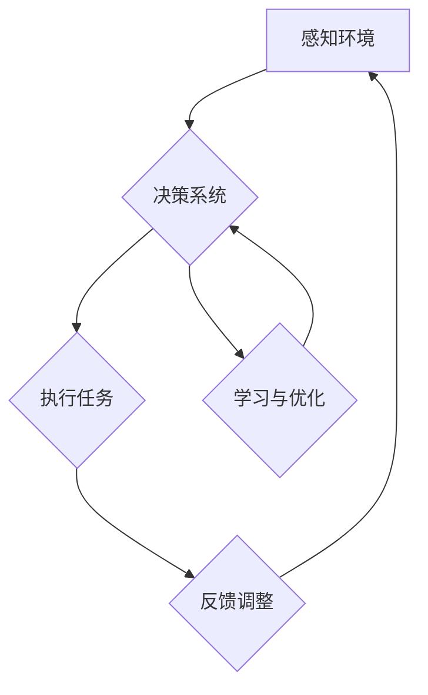

                 


### 背景介绍

随着科技的飞速发展，机器人技术正经历着前所未有的变革。从最早的特定任务机器人到如今的多功能机器人，这一演变标志着人工智能技术从简单执行命令到高度智能化的飞跃。特定任务机器人，如工业生产线上的装配机器人、清洁机器人和送货机器人等，它们在特定领域内具有出色的性能，但功能单一，难以应对多变的环境和复杂任务。这种局限性使得它们在应对突发情况或执行新任务时显得力不从心。

随着人工智能技术的不断进步，特别是机器学习、深度学习和计算机视觉等领域的突破，机器人开始具备更高级的感知、决策和执行能力。多功能机器人应运而生，它们不仅能够执行多种任务，还能根据环境变化自主调整行为，从而提高了工作效率和灵活性。多功能机器人通过集成多种传感器、执行器和智能算法，实现了对复杂环境的感知和理解，使得它们能够在不同场景下灵活应用，极大地拓宽了机器人的应用范围。

本文旨在深入探讨多功能机器人取代特定任务机器人的新趋势。我们将首先介绍多功能机器人的定义和特点，并通过Mermaid流程图展示其核心概念与联系。接着，我们将回顾多功能机器人的发展历程，探讨其关键技术，如感知、控制和协同技术。随后，我们将分析多功能机器人的实际应用，包括工业自动化、服务机器人和家庭机器人等。最后，我们将展望多功能机器人的未来发展趋势，并讨论政策与标准的重要性。

通过本文的逐步分析，我们将深入理解多功能机器人的技术原理、应用场景和未来发展，揭示其在取代特定任务机器人中的潜力和挑战。

### 定义与特点

#### 多功能机器人的定义

多功能机器人是一种集成了多种传感器、执行器和智能算法的智能设备，能够执行多种任务，并具备环境感知和自主决策的能力。与传统特定任务机器人不同，多功能机器人不仅限于单一功能的执行，而是能够在复杂多变的环境中灵活应对多种任务需求。

#### 多功能机器人的特点

1. **多功能性**：多功能机器人具备多种功能，如感知、移动、操作等，可以通过传感器获取环境信息，执行复杂任务，并自主适应任务变化。
2. **智能决策**：多功能机器人利用机器学习和人工智能算法，能够根据环境变化和任务需求，自主做出决策，提高任务执行效率。
3. **高灵活性**：多功能机器人可以适应不同的工作场景和任务需求，通过模块化设计和智能调度，实现快速切换和任务优化。
4. **协同工作**：多功能机器人能够与其他机器人或人类协同工作，实现高效的资源利用和工作效率提升。

#### Mermaid流程图

为了更直观地展示多功能机器人的核心概念与联系，我们可以使用Mermaid流程图来描述其工作流程。



在该流程图中，A表示感知环境，通过传感器获取环境信息；B表示决策系统，利用智能算法进行决策；C表示执行任务，机器人根据决策执行具体任务；D表示反馈调整，机器人根据任务执行结果进行调整；E表示学习与优化，机器人通过机器学习不断优化性能。

通过这个流程图，我们可以清晰地看到多功能机器人从感知、决策到执行、反馈的完整工作过程，以及机器学习在其中发挥的关键作用。这一流程图不仅帮助我们理解多功能机器人的工作原理，也展示了其在实际应用中的高度灵活性和智能化水平。

### 发展历程

#### 早期发展

多功能机器人的概念起源于20世纪中叶，当时工业生产对自动化设备的需求推动了特定任务机器人的研发。这些早期机器人主要执行单一任务，如装配线上的装配、仓库中的搬运等。尽管这些机器人极大地提高了生产效率，但它们的功能单一，难以适应复杂多变的环境和任务需求。

#### 技术突破

随着人工智能技术的迅猛发展，特别是机器学习、计算机视觉和传感器技术的突破，多功能机器人开始崭露头角。20世纪80年代，研究者开始探索如何将智能算法应用于机器人，使其具备自主决策和任务执行能力。这一时期，一系列重要研究成果的问世，如机器人感知和路径规划算法，为多功能机器人的发展奠定了基础。

#### 现代发展

进入21世纪，多功能机器人迎来了快速发展的黄金时期。机器学习和深度学习算法的进步使得机器人能够更好地理解和处理复杂环境信息，从而提高了任务执行效率和灵活性。同时，传感器技术的不断进步，如激光雷达、摄像头和超声波传感器等，为机器人提供了丰富的感知手段。

近年来，随着物联网（IoT）和5G技术的普及，多功能机器人开始在更多领域得到应用，如工业自动化、医疗辅助、服务机器人等。特别是在工业4.0和智能制造的推动下，多功能机器人在提高生产效率、降低成本和改善工作环境方面发挥了重要作用。

#### 未来趋势

未来，多功能机器人将继续朝着更高智能化、更广泛应用和更协同化方向迈进。一方面，人工智能技术将继续推动机器人智能化水平的提升，使其具备更强大的自主决策和任务执行能力。另一方面，随着新材料、新工艺和新算法的不断涌现，多功能机器人的性能和功能将得到进一步提升。

此外，多功能机器人将在更多新兴领域得到应用，如智慧城市建设、环境监测、农业自动化等。同时，机器人与人类、其他机器人以及智能设备的协同工作，将极大地提高生产和服务效率，推动社会生产力的进一步提升。

总之，多功能机器人从早期特定任务机器人的单一功能到现代多功能机器人的高度智能化和多样化应用，经历了不断的技术突破和产业变革。未来，多功能机器人将在人工智能和物联网等技术的推动下，继续发挥其巨大潜力，成为推动社会进步的重要力量。

### 多功能机器人的应用场景

多功能机器人由于其多功能性、智能决策和协同工作能力，在不同领域展现了广泛的应用潜力。以下是多功能机器人在工业生产、服务业和家庭应用中的具体应用场景和案例。

#### 工业生产

在工业生产中，多功能机器人被广泛应用于装配、焊接、搬运和检测等环节。例如，一些汽车制造厂使用多功能机器人进行汽车组装，这些机器人不仅能够高效地完成装配任务，还能根据生产线上的需求动态调整工作流程。一个典型案例是德国某汽车制造厂引入的多功能机器人生产线，这些机器人配备了先进的传感器和智能算法，能够实时检测工件的位置和姿态，确保装配精度。此外，多功能机器人还用于自动化仓库的货物搬运和分类，大大提高了仓储效率。

#### 服务业

在服务业中，多功能机器人正逐步改变传统的服务模式。例如，在餐饮服务业，一些餐厅引入了多功能机器人送餐员，这些机器人能够在复杂环境中导航、避障，并准确地将餐品递送到客人手中。在中国的一些商场，多功能机器人导购员能够根据顾客的需求推荐商品，并进行互动式服务，提高了顾客的购物体验。此外，多功能机器人还被应用于医疗服务业，如医院中的机器人护士，可以协助医生进行病人护理和病房管理，提高医疗服务的效率和质量。

#### 家庭应用

在家庭应用中，多功能机器人的应用日益普及，如家用清洁机器人、管家机器人等。这些机器人通过内置的传感器和智能算法，能够自主清洁家庭环境、执行家务任务，甚至提供娱乐和陪伴。一个实际案例是日本市场上的一些多功能管家机器人，这些机器人不仅能够打扫房间、准备餐点，还能进行简单的交流，甚至帮助家庭成员监控健康状态。家庭用户对这些机器人的反馈普遍积极，认为它们不仅减轻了家务负担，还提升了家庭生活的便利性和舒适度。

#### 总结

多功能机器人通过在不同领域的应用，展现了其广泛的适用性和巨大的潜力。在工业生产中，它们提高了生产效率和质量；在服务业中，它们改善了服务体验和效率；在家庭应用中，它们提升了生活便利和舒适度。随着技术的不断进步和多领域的融合，多功能机器人在未来将会有更多的创新应用，进一步改变我们的生活和工作方式。

### 多功能机器人的核心优势

多功能机器人之所以能够在众多领域中脱颖而出，关键在于其三大核心优势：灵活性、智能化和效率提升。这些优势使得多功能机器人能够适应各种复杂环境，执行多样化任务，从而极大地提高生产和服务效率。

#### 灵活性

灵活性是多功能机器人的重要特点之一。传统特定任务机器人通常只能执行单一任务，当面临环境变化或新任务时，往往需要重新编程或调整设备。而多功能机器人通过集成多种传感器和智能算法，能够实时感知环境变化，自主调整行为，灵活应对新任务。例如，在工业生产中，多功能机器人可以灵活地在不同的生产线间切换任务，从装配到焊接，从搬运到检测，都能高效执行。此外，多功能机器人在服务机器人和家庭机器人中的应用，也展示了其高度的灵活性。无论是在复杂的商场环境中导航，还是在家庭环境中执行多种家务任务，多功能机器人都能根据环境变化和用户需求，迅速调整策略，完成任务。

#### 智能化

智能化是多功能机器人的另一大核心优势。通过机器学习和人工智能技术，多功能机器人具备了自主学习和决策能力，能够根据环境数据和任务需求，自主制定最优行动计划。例如，在仓储物流领域，多功能机器人可以通过深度学习算法，分析货物位置和搬运路径，自动优化搬运路线，提高物流效率。在医疗领域，多功能机器人可以辅助医生进行诊断和治疗，通过分析病人数据和医学图像，提供精准的诊疗方案。在家庭应用中，多功能机器人通过自然语言处理和语音识别技术，可以与用户进行自然交流，理解用户指令，执行相应任务，提供个性化的服务。智能化的特点使得多功能机器人不仅能够完成预定的任务，还能够根据实际情况进行自我调整和优化，提高了任务执行的成功率和效率。

#### 效率提升

效率提升是多功能机器人的最终目标之一。通过自动化和智能化，多功能机器人能够显著提高生产和服务效率，减少人力成本，提高生产质量。在工业生产中，多功能机器人可以24小时不间断工作，极大地提高了生产效率。例如，在汽车制造过程中，多功能机器人能够高效地完成装配、焊接和搬运任务，减少了生产延误和人为错误。在服务业中，多功能机器人通过自动化服务流程，减少了人工操作的时间，提高了服务质量。例如，在一些高端餐厅中，多功能机器人送餐员能够快速、准确地递送餐品，提高了顾客满意度。在家庭应用中，多功能机器人能够自主完成各种家务任务，如清洁、烹饪和护理等，极大地减轻了家庭劳动负担，提高了生活质量。

#### 案例分析

为了更具体地说明多功能机器人的核心优势，我们可以通过一些实际案例来分析。

1. **工业生产案例**：
   某电子制造公司引入了一台多功能机器人，用于完成装配、焊接和搬运任务。该机器人配备了先进的传感器和机器学习算法，能够实时感知工件的位置和姿态，并自主调整装配参数，确保装配精度。此外，该机器人可以根据生产计划，自动调整生产节拍，优化生产流程。自从引入该机器人后，公司的生产效率提高了30%，生产成本降低了15%，产品质量也得到了显著提升。

2. **服务机器人类案**：
   在某医院，多功能机器人被用于辅助医生进行病人护理和病房管理。这些机器人配备了医疗传感器和智能诊断系统，可以实时监测病人的生命体征，并向医生提供诊断建议。此外，多功能机器人还能够根据病人的需求和病情，自动调整护理计划，提供个性化的护理服务。通过引入这些机器人，医院的护理效率提高了20%，病人满意度显著提升。

3. **家庭应用案例**：
   某家庭引入了一台多功能管家机器人，用于完成日常家务任务。该机器人配备了先进的传感器和语音识别系统，可以自主清洁房间、准备餐点和进行简单的交流。通过该机器人，家庭成员能够轻松管理家庭事务，减轻家务负担。此外，该机器人还可以监控家庭成员的健康状态，提供健康建议，提升了家庭生活质量。

综上所述，多功能机器人的灵活性、智能化和效率提升是其核心优势，这些优势使得多功能机器人在各个领域都展现出了巨大的应用潜力和实际效益。通过具体案例的分析，我们可以看到，多功能机器人不仅能够提高生产和服务效率，还能显著降低成本，提升用户体验，成为未来智能化发展的重要推动力量。

### 机器人感知技术

机器人感知技术是多功能机器人实现智能决策和任务执行的基础，通过多种传感器获取环境信息，并利用数据融合技术处理多源数据，从而提高机器人的环境感知能力。以下是机器人感知技术的详细介绍。

#### 常用的传感器

1. **视觉传感器**：视觉传感器是机器人获取环境信息的重要手段，包括摄像头、立体相机和深度相机等。这些传感器能够捕捉图像和视频数据，通过图像处理和计算机视觉算法，实现对物体形状、颜色和纹理的识别。

2. **激光雷达**：激光雷达通过发射激光束并测量反射时间，获取机器人周围环境的3D点云数据。这种传感器具有高精度和高分辨率，常用于环境建模、路径规划和障碍物检测。

3. **超声波传感器**：超声波传感器通过发射超声波并接收反射波，测量距离和速度。这种传感器适用于短距离探测，如避障和定位。

4. **红外传感器**：红外传感器能够检测物体发射的红外辐射，常用于夜间环境探测和热成像。

5. **温湿度传感器**：温湿度传感器用于测量环境温度和湿度，常应用于气象监测、温室控制和健康监测等领域。

6. **力矩传感器**：力矩传感器用于测量机器人执行器施加的力矩，实现对机械臂和控制系统的精确控制。

#### 数据融合技术

1. **多传感器数据融合**：多传感器数据融合是将不同类型传感器的数据集成起来，以获得更全面的环境感知。常用的方法包括卡尔曼滤波、贝叶斯滤波和粒子滤波等。通过数据融合，机器人可以更准确地识别物体位置、形状和运动轨迹。

2. **传感器融合算法**：传感器融合算法通过融合不同传感器的数据，提高环境感知的精度和鲁棒性。例如，视觉传感器与激光雷达数据融合，可以同时获取物体位置和形状信息，提高路径规划的准确性。

3. **多源数据融合**：多源数据融合不仅包括不同类型传感器的数据，还涵盖来自其他设备或系统的信息，如GPS、RFID和无线传感器网络等。通过多源数据融合，机器人可以获取更丰富的环境信息，提高任务执行的效率和可靠性。

### 应用场景

1. **环境建模**：机器人通过感知技术构建环境模型，用于路径规划和任务规划。例如，在无人驾驶汽车中，激光雷达和摄像头数据融合，用于实时构建道路和障碍物模型。

2. **避障导航**：机器人利用激光雷达和超声波传感器，实时检测前方障碍物，并调整路径以避免碰撞。例如，家用清洁机器人通过红外传感器和超声波传感器，实现自主避障和导航。

3. **物体识别**：视觉传感器和红外传感器用于识别物体和目标，例如在工业自动化中，机器人通过摄像头识别工件并进行分类和装配。

4. **健康监测**：温湿度传感器和力矩传感器用于监测环境参数和机械臂状态，例如在医疗机器人中，通过传感器数据实时调整治疗计划和操作力度。

### 案例分析

一个典型的应用案例是智能家居系统中的多功能机器人。该机器人通过集成摄像头、激光雷达、超声波传感器和温湿度传感器，实现以下功能：

- **环境监测**：通过摄像头和激光雷达，机器人能够实时构建家庭环境的3D模型，识别家庭成员和物品位置，监控家庭安全。
- **清洁任务**：通过超声波传感器，机器人能够检测地面上的污渍，并通过摄像头进行定位，实现自主清洁。
- **温湿度调控**：通过温湿度传感器，机器人能够监测家庭环境温度和湿度，并根据用户需求调整空调和加湿器，提高生活舒适度。
- **健康监测**：通过力矩传感器，机器人能够监测家庭成员的健康状态，例如测量脉搏和呼吸频率，提供健康建议。

通过这些感知技术的综合应用，多功能机器人在家庭中实现了多样化的任务执行和智能化服务，提高了家庭生活的便捷性和舒适度。

### 机器人控制技术

机器人控制技术是实现多功能机器人高效、准确执行任务的核心环节，涉及多种控制算法和实时性要求。以下是机器人控制技术的详细介绍。

#### 控制算法

1. **PID控制算法**：PID控制（比例-积分-微分控制）是最常见的控制算法之一。它通过计算误差（设定值与实际值之差）的比例、积分和微分，调整控制器的输出，以实现对系统的精确控制。PID控制广泛应用于机器人的运动控制和轨迹跟踪。

   **伪代码示例**：
   ```python
   def PID_control(setpoint, current_value, Kp, Ki, Kd):
       error = setpoint - current_value
       P = Kp * error
       I = Ki * integrate(error)
       D = Kd * differentiate(error)
       output = P + I + D
       return output
   ```

2. **模糊控制算法**：模糊控制利用模糊逻辑进行推理，通过输入和输出变量的模糊集合，实现对复杂系统的控制。这种算法特别适用于非线性系统和高复杂度环境。

   **伪代码示例**：
   ```python
   def fuzzy_control(input_variable, rule_base):
       fuzzy_input = fuzzify(input_variable)
       output = defuzzify(infer(fuzzy_input, rule_base))
       return output
   ```

3. **自适应控制算法**：自适应控制算法能够根据系统动态变化，自动调整控制器参数，以提高系统的适应能力和控制精度。

   **伪代码示例**：
   ```python
   def adaptive_control(current_error, previous_error):
       delta_error = current_error - previous_error
       K = adjust_gain(delta_error)
       output = K * current_error
       return output
   ```

4. **神经网络控制算法**：神经网络控制利用人工神经网络学习系统的动态特性，进行预测和控制。这种算法在复杂和非线性系统中表现出色。

   **伪代码示例**：
   ```python
   def neural_network_control(input_data, network):
       prediction = network.predict(input_data)
       output = adjust_output(prediction)
       return output
   ```

#### 实时性

实时性是机器人控制技术的重要指标，指的是系统在规定时间内响应和处理输入信息的能力。对于机器人来说，实时性要求确保其能够快速、准确地执行任务，避免因延迟导致的事故或错误。

1. **实时操作系统**：为了满足实时性要求，机器人控制系统通常使用实时操作系统（RTOS）。RTOS能够确保任务按照预定的时间表执行，避免任务间的竞争和冲突。

   **伪代码示例**：
   ```python
   class RealTimeTask:
       def __init__(self, name, period):
           self.name = name
           self.period = period
           self.timer = Timer(self.period, self.callback)

       def start(self):
           self.timer.start()

       def callback(self):
           # 任务执行逻辑
           pass
   ```

2. **优先级调度**：实时性要求机器人控制系统能够快速响应紧急任务。因此，系统采用优先级调度策略，将高优先级任务优先执行，确保关键任务及时完成。

   **伪代码示例**：
   ```python
   def schedule_tasks(tasks):
       for task in tasks:
           if task.priority > current_max_priority:
               current_max_priority = task.priority
               current_task = task
   ```

3. **低延迟通信**：机器人控制系统需要低延迟的通信机制，以确保传感器数据和控制器指令的实时传输。常用的通信协议包括CAN总线、以太网和无线通信等。

   **伪代码示例**：
   ```python
   def send_command(robot_id, command):
       # 通过通信协议发送命令
       pass

   def receive_data(robot_id):
       # 通过通信协议接收数据
       return data
   ```

#### 应用场景

1. **运动控制**：在工业机器人和服务机器人中，控制算法用于实现精确的运动控制和轨迹跟踪。例如，机器人手臂的定位和路径规划，需要高精度的控制算法来实现。

2. **姿态控制**：在无人机和平衡机器人中，姿态控制算法用于保持机器人的稳定和方向。这种控制需要快速响应和精确调整，以应对动态环境的变化。

3. **自主导航**：在无人驾驶车辆和导航机器人中，控制算法用于路径规划和避障。实时性要求确保机器人能够在复杂环境中快速做出决策，避免碰撞。

通过上述控制算法和实时性技术，机器人控制系统能够实现高效、准确的任务执行，为多功能机器人在各个领域的应用提供可靠保障。

### 机器人学习与决策技术

机器人学习与决策技术是多功能机器人的核心组件之一，通过机器学习算法和决策树实现自主学习和智能决策，从而提高机器人在复杂环境中的适应能力和任务执行效率。以下是机器人学习与决策技术的详细介绍。

#### 机器学习简介

机器学习是人工智能的一个重要分支，通过算法使计算机系统能够从数据中学习，并自动改进性能。在机器人领域，机器学习技术主要用于模型训练和预测，从而实现自主学习和任务决策。

1. **监督学习**：监督学习是一种有标签数据的机器学习，通过输入和输出之间的映射关系，训练模型来预测未知数据的输出。常见的监督学习方法包括线性回归、决策树、支持向量机和神经网络等。

2. **无监督学习**：无监督学习是一种没有标签数据的机器学习，旨在发现数据中的隐藏结构和模式。常见的无监督学习方法包括聚类、降维和异常检测等。

3. **强化学习**：强化学习是一种通过奖励机制来训练模型的方法，使系统能够在动态环境中通过试错学习最优策略。常见的强化学习方法包括Q学习、深度Q网络（DQN）和策略梯度方法等。

#### 决策树与深度学习

1. **决策树**：决策树是一种基于规则的知识表示方法，通过一系列判断条件将数据划分为不同的区域，并预测每个区域的输出。决策树易于理解和解释，但在处理高维数据和复杂非线性问题时表现较差。

   **伪代码示例**：
   ```python
   def decision_tree(data, attributes):
       if base_case(data):
           return predict_value(data)
       else:
           feature = select_best_attribute(data, attributes)
           tree = {}
           for value in feature.values:
               subset = filter_data(data, feature, value)
               tree[value] = decision_tree(subset, attributes - {feature})
           return tree
   ```

2. **深度学习**：深度学习是一种基于多层神经网络的学习方法，通过多层非线性变换来提取数据中的复杂特征。深度学习在图像识别、自然语言处理和语音识别等领域表现出色。

   **伪代码示例**：
   ```python
   def deep_learning(input_data, network):
       layer_outputs = [input_data]
       for layer in network.layers:
           output = layer.forward_pass(layer_outputs[-1])
           layer_outputs.append(output)
       prediction = network.output_layer.forward_pass(layer_outputs[-1])
       return prediction
   ```

#### 应用场景

1. **自主导航**：在无人驾驶车辆和导航机器人中，机器学习算法用于环境建模和路径规划。通过训练神经网络模型，机器人可以识别道路标志、交通信号和障碍物，实现自主导航。

2. **故障诊断**：在工业生产中，机器学习算法用于监测设备状态和预测故障。通过分析传感器数据，模型可以识别设备故障的早期迹象，提前进行维护，减少停机时间。

3. **服务机器人**：在服务机器人中，机器学习算法用于理解用户指令和提供个性化服务。例如，通过自然语言处理模型，机器人可以理解用户的问题，并提供相应的答案或建议。

4. **医疗辅助**：在医疗领域中，机器学习算法用于辅助医生进行诊断和治疗。通过分析医学图像和患者数据，模型可以提供更准确的诊断结果和个性化的治疗方案。

#### 案例分析

一个典型的应用案例是在智能仓储系统中，多功能机器人通过机器学习算法进行自主导航和路径规划。以下是一个简化的案例流程：

1. **数据收集**：系统首先收集仓库内部的各种数据，包括货架布局、物品位置和通行路径等。

2. **模型训练**：利用收集到的数据，通过深度学习算法训练导航模型。模型学习如何从传感器数据中提取特征，并预测最优路径。

3. **路径规划**：当机器人接收到取货任务时，模型根据当前环境和历史数据，生成最优路径规划。

4. **执行任务**：机器人按照规划路径移动，到达指定位置取货，并将物品搬运到指定位置。

5. **持续学习**：在任务执行过程中，机器人不断收集新的数据，并将其反馈给模型，以持续优化导航算法。

通过这一流程，多功能机器人能够自主导航，并在复杂环境中高效完成任务。这一案例展示了机器学习和决策树在机器人中的应用潜力，证明了其在提高机器人智能化水平和任务执行效率方面的巨大价值。

### 机器人协同技术

机器人协同技术是多功能机器人实现高效任务执行和资源利用的关键，涉及人机协同和多机器人系统的设计和实现。以下是机器人协同技术的详细介绍。

#### 人机协同

人机协同是指人类与机器人共同工作，通过信息共享和任务分配，实现高效的协同作业。在工业生产、医疗辅助和服务机器人等领域，人机协同具有广泛的应用。

1. **任务分配**：在任务分配中，机器人根据自身的能力和当前任务需求，向人类操作者请求任务或分配任务。例如，在工业生产中，机器人可以自动识别生产故障，并请求人类操作者进行修复。

2. **信息共享**：人机协同需要高效的信息共享机制，确保人类和机器人之间的信息传递准确无误。常用的信息共享方法包括语音交互、手势控制和触摸屏幕等。

3. **实时反馈**：机器人执行任务时，需要向人类操作者实时反馈任务进展和状态信息，以便及时调整和优化。例如，在医疗辅助中，机器人可以实时向医生提供病人数据和手术进展情况。

4. **安全监控**：在人机协同环境中，安全监控至关重要。机器人需要具备自我保护能力，防止意外伤害。同时，人类操作者需要监控机器人的运行状态，确保工作环境的安全。

#### 多机器人系统

多机器人系统是指由多个机器人组成的协同作业系统，通过信息共享和任务分配，实现高效的协同工作。多机器人系统在物流、农业和救援等领域具有广泛应用。

1. **通信机制**：多机器人系统需要高效的通信机制，确保机器人之间的信息传递和任务协调。常用的通信协议包括无线通信、局域网和卫星通信等。

2. **任务分配算法**：任务分配算法是多机器人系统的核心，用于将任务合理地分配给不同的机器人。常见的任务分配算法包括基于成本效益的分配、基于任务优先级的分配和基于优化模型的分配等。

3. **路径规划**：多机器人系统中的路径规划需要考虑机器人的动态环境、任务需求和通信约束。常用的路径规划算法包括A*算法、Dijkstra算法和遗传算法等。

4. **决策协同**：在多机器人系统中，决策协同是指机器人之间通过共享信息和协同决策，实现高效的任务执行。例如，在物流领域，多机器人系统可以通过协同决策，优化配送路径和资源利用。

#### 应用场景

1. **工业生产**：在工业生产中，多机器人系统可以协同完成任务，提高生产效率。例如，在电子装配过程中，多个机器人可以协同完成装配、焊接和检测任务。

2. **物流**：在物流领域，多机器人系统可以协同完成货物运输和配送任务。通过高效的路径规划和任务分配，机器人可以实现快速、准确的配送。

3. **农业**：在农业领域，多机器人系统可以协同完成播种、施肥和收割等任务。机器人可以实时监测作物生长情况，并根据需求调整作业策略。

4. **救援**：在救援领域，多机器人系统可以协同完成搜救任务。机器人可以协同探测废墟、搬运物资和协助救援人员，提高救援效率。

#### 案例分析

一个典型的应用案例是智能仓储系统中的多机器人协同作业。以下是一个简化的案例流程：

1. **任务接收**：仓储管理系统根据订单需求，生成取货和配送任务。

2. **任务分配**：系统将任务分配给空闲的机器人，确保每个机器人都有明确的任务。

3. **路径规划**：每个机器人根据任务需求和仓储环境，通过路径规划算法生成最优路径。

4. **执行任务**：机器人按照规划路径，同时进行取货和配送任务。

5. **信息共享**：机器人之间通过无线通信，实时共享任务进展和仓储状态信息。

6. **决策协同**：在执行任务过程中，机器人根据信息共享结果，协同调整作业策略，优化资源利用。

通过这一流程，多机器人系统能够高效完成仓储任务，提高仓储效率和服务质量。这个案例展示了机器人协同技术在提高工作效率和灵活性方面的巨大潜力。

### 安全与伦理

随着多功能机器人在各个领域的广泛应用，安全问题成为了一个不可忽视的重要议题。确保机器人的安全运行，不仅关系到个人和企业的利益，也关乎整个社会的稳定和可持续发展。此外，伦理问题也随着机器人技术的发展日益突出，需要我们深入探讨和解决。

#### 安全性

1. **硬件安全**：硬件安全是机器人安全运行的基础。这包括机器人的机械结构设计、电路设计和传感器校准等方面。例如，机器人的机械结构需要能够承受预期的外部冲击和负载，电路设计需要具备抗干扰能力，传感器校准需要确保数据的准确性和可靠性。

2. **软件安全**：软件安全涉及到机器人的控制算法、数据传输和系统更新等方面。为了确保软件安全，需要采用加密技术、安全协议和漏洞扫描等手段，防止恶意攻击和数据泄露。

3. **环境监测与防护**：机器人需要在复杂的现实环境中运行，因此需要具备环境监测和防护能力。例如，通过传感器实时监测环境变化，如温度、湿度和有毒气体等，并采取相应的防护措施，如自动断电、紧急制动等。

4. **安全测试与验证**：在机器人开发和部署过程中，需要进行全面的安全测试和验证。这包括实验室测试、模拟测试和现场测试等，以确保机器人在各种情况下的安全性能。

#### 伦理问题

1. **隐私保护**：随着机器人获取和处理的个人信息和数据越来越多，隐私保护成为一个重要的伦理问题。机器人需要设计隐私保护机制，如数据匿名化、权限控制和用户同意等，确保用户的隐私不被泄露和滥用。

2. **责任归属**：当机器人造成损害或错误决策时，责任归属问题变得复杂。这涉及到法律、道德和商业等多个层面。例如，在自动驾驶汽车事故中，如何界定制造商、开发者、操作者或用户的责任？

3. **道德决策**：机器人在执行任务时，可能会面临道德困境，需要做出道德决策。例如，在自动驾驶汽车遇到紧急情况时，如何决定是保护车内乘客还是行人？这需要我们设计合理的道德决策算法和伦理指导原则。

#### 实践案例

1. **工业安全**：在工业生产中，多功能机器人需要确保操作安全。例如，某汽车制造厂引入了多功能机器人进行装配作业。在引入机器人之前，对机器人的硬件和软件进行了全面的安全测试，并制定了详细的操作规程和应急响应措施，确保机器人在生产过程中的安全运行。

2. **医疗伦理**：在医疗领域，多功能机器人用于辅助医生进行手术和护理。为了解决责任归属问题，医疗机构与机器人制造商和开发者共同制定了详细的操作规范和责任分配协议，确保在手术过程中出现问题时，责任能够明确划分。

3. **隐私保护**：在智能家居应用中，多功能机器人需要处理大量的个人信息。例如，某智能家居系统中的多功能管家机器人通过加密技术和用户权限控制，确保用户的个人信息得到有效保护，避免被非法访问和使用。

#### 最佳实践

1. **安全设计**：在机器人设计阶段，应将安全考虑纳入整体架构，确保机器人在硬件、软件和环境方面的安全性。

2. **法律法规**：政府和相关机构应制定和实施机器人安全和伦理的法律法规，明确责任归属和隐私保护等关键问题。

3. **公众参与**：在机器人开发和部署过程中，应广泛征求公众意见，确保机器人技术能够符合社会伦理和道德标准。

4. **持续监控**：机器人运行过程中，应持续监控其安全性能和伦理表现，及时调整和优化，确保机器人技术能够持续进步和健康发展。

通过以上措施，我们可以确保多功能机器人在各领域的安全运行和伦理合规，为社会的可持续发展提供有力支持。

### 工业自动化

工业自动化是多功能机器人最具代表性的应用领域之一，通过多功能机器人实现自动化生产，不仅显著提高了生产效率，还极大地降低了生产成本。以下是工业自动化中多功能机器人的具体应用和开发环境搭建过程。

#### 多功能机器人在工业自动化中的应用

1. **装配与焊接**：在汽车、电子等行业，多功能机器人广泛应用于装配和焊接工序。这些机器人具备高精度的感知和执行能力，能够根据工件的位置和姿态进行精确装配和焊接。例如，某汽车制造厂引入了多功能机器人进行底盘装配，这些机器人能够识别和定位各种零部件，确保装配精度和一致性。

2. **搬运与分拣**：多功能机器人在仓库物流中用于搬运和分拣货物。通过激光雷达和视觉传感器，机器人能够识别和跟踪货物，自主规划路径，并进行精确搬运和分拣。例如，在电商物流中心，多功能机器人可以快速、准确地搬运和分拣包裹，提高物流效率。

3. **检测与质量监控**：多功能机器人通过高精度传感器和智能算法，能够对生产过程中的产品进行检测和质量监控。例如，在电子制造过程中，机器人可以检测产品的电气性能和外观缺陷，确保产品质量。

#### 开发环境搭建

要开发一个工业自动化项目，需要搭建一个完备的开发环境。以下是具体的搭建过程：

1. **硬件环境**：
   - **机器人控制器**：选择适用于工业自动化项目的机器人控制器，如ABB机器人控制器、发那科机器人控制器等。
   - **传感器**：根据任务需求选择合适的传感器，如激光雷达、视觉摄像头、力传感器等。
   - **执行器**：根据任务需求选择执行器，如电机、气缸等。

2. **软件环境**：
   - **操作系统**：选择适合机器人开发的实时操作系统（RTOS），如VxWorks、QNX等。
   - **开发工具**：选择机器人编程开发工具，如RoboDK、RobotStudio等。
   - **集成开发环境（IDE）**：选择适合嵌入式系统开发的IDE，如Eclipse、Visual Studio等。

3. **开发步骤**：
   - **需求分析**：明确工业自动化项目的具体需求和功能，包括装配、焊接、搬运、检测等。
   - **系统设计**：设计机器人系统的整体架构，包括硬件配置、传感器选择、执行器配置等。
   - **编程与调试**：使用开发工具编写机器人控制程序，并进行调试和测试，确保程序能够满足功能需求。
   - **系统集成**：将硬件和软件系统集成，进行整体调试和测试，确保系统稳定可靠。

#### 项目实战

以下是一个简单的工业自动化项目实战案例：使用多功能机器人进行装配任务。

1. **需求分析**：某电子制造公司需要使用多功能机器人进行手机组装，包括摄像头、电池和外壳的装配。

2. **系统设计**：
   - **硬件配置**：选择一台具备高精度和灵活性的机器人控制器，配备视觉摄像头、激光雷达和力传感器。
   - **传感器配置**：使用视觉摄像头进行工件识别，激光雷达进行路径规划，力传感器进行装配力的控制。

3. **编程与调试**：
   - **视觉识别程序**：编写程序，通过视觉摄像头识别摄像头、电池和外壳的位置和姿态。
   - **路径规划程序**：根据识别结果，规划机器人的移动路径，确保准确到达装配位置。
   - **装配程序**：编写程序，控制执行器进行装配操作，并通过力传感器调整装配力，确保装配精度。

4. **系统集成**：将硬件和软件系统集成，进行整体调试和测试，确保系统能够稳定、高效地运行。

通过以上步骤，我们成功搭建了一个工业自动化系统，实现了手机组装的自动化生产。这个项目不仅提高了生产效率，还降低了生产成本，展示了多功能机器人在工业自动化中的巨大应用潜力。

### 服务机器人

服务机器人是多功能机器人应用的重要领域之一，通过智能感知、自主决策和协作能力，服务机器人能够提供高效、便捷的服务，满足人们的多样化需求。以下是服务机器人在不同领域的具体应用。

#### 应用领域

1. **餐饮服务**：在餐饮服务业，服务机器人可以担任送餐员、厨师和清洁工等角色。例如，一些餐厅引入了送餐机器人，这些机器人可以通过室内导航，准确地将餐品递送到顾客手中，提高了服务质量。

2. **医疗辅助**：在医疗领域，服务机器人可以协助医生进行手术、护理和药品配送。例如，手术室中的机器人可以辅助医生进行精细的手术操作，护理机器人可以帮助护士进行病人护理和病房管理。

3. **家庭服务**：在家庭应用中，服务机器人可以担任管家、保姆和健身教练等角色。例如，家用清洁机器人可以自主清扫家庭环境，管家机器人可以提供家庭安防、娱乐和社交等服务。

#### 项目实战

以下是一个具体的服务机器人项目实战案例：开发一个智能家居服务机器人。

1. **需求分析**：某智能家居公司需要开发一个能够提供家庭服务、安防和娱乐的机器人，满足家庭成员的多样化需求。

2. **系统设计**：
   - **硬件配置**：选择一台具备高精度、灵活性的机器人控制器，配备视觉摄像头、麦克风、激光雷达和执行器。
   - **软件配置**：开发智能感知系统、自主导航系统、语音交互系统和安全监控系统。

3. **实现步骤**：
   - **智能感知系统**：利用视觉摄像头和激光雷达，开发图像识别和障碍物检测功能，确保机器人能够准确感知环境。
   - **自主导航系统**：利用路径规划算法，开发自主导航功能，使机器人能够自主规划路径并避开障碍物。
   - **语音交互系统**：利用语音识别和自然语言处理技术，开发语音交互功能，使机器人能够与用户进行自然对话。
   - **安全监控系统**：利用摄像头和传感器，开发家庭安防功能，确保家庭安全。

4. **测试与优化**：对系统进行整体测试和优化，确保机器人能够在各种环境中稳定、高效地运行。

通过以上步骤，我们成功开发了一个智能家居服务机器人，它能够提供家庭服务、安防和娱乐等功能，提高了家庭生活的便捷性和舒适度。这个项目展示了服务机器人在智能家居领域的巨大应用潜力。

### 家庭机器人

家庭机器人是多功能机器人应用的重要领域之一，通过智能感知、自主决策和灵活的任务执行能力，家庭机器人能够为家庭成员提供多样化的服务，提升家庭生活的便利性和舒适度。以下是家庭机器人在市场现状、用户反馈以及未来发展中的具体分析。

#### 市场现状

随着科技的进步和消费者对智能家居需求的增长，家庭机器人的市场逐渐扩大。目前，家庭机器人市场主要包括以下几类：

1. **清洁机器人**：如扫地机器人、擦窗机器人等，这类机器人能够自动清洁家庭环境，减轻家庭成员的家务负担。
2. **管家机器人**：如智能管家、智能保姆等，这类机器人能够提供家庭安防、娱乐、健康监测等服务。
3. **教育机器人**：如编程机器人、教学机器人等，这类机器人能够为儿童提供教育资源，促进他们的学习和成长。

根据市场调研数据，家庭机器人市场在过去几年中呈现出快速增长的趋势，预计未来几年将继续保持高速增长。特别是在亚太地区和北美市场，家庭机器人的普及率显著提高。同时，随着5G、物联网和人工智能等技术的进一步发展，家庭机器人市场将迎来更多的创新和应用。

#### 用户反馈

家庭机器人在市场上的表现也受到了用户的广泛关注和反馈。以下是用户对家庭机器人的一些主要反馈：

1. **便利性**：用户普遍认为家庭机器人极大地提高了家庭生活的便利性。例如，清洁机器人能够自动完成家庭清洁工作，节省了用户的时间和精力。

2. **智能体验**：用户对家庭机器人的智能体验也给予了高度评价。例如，管家机器人能够通过语音交互了解用户需求，提供个性化的服务。

3. **安全性**：用户对家庭机器人的安全性给予了关注。尽管大多数家庭机器人设计有安全保护机制，但用户仍然担心机器人在家庭中的行为是否安全和可靠。

4. **个性化**：用户希望家庭机器人能够根据家庭成员的不同需求和习惯，提供更加个性化的服务。例如，根据家庭成员的健康状况提供定制化的健康建议。

#### 未来发展

家庭机器人未来的发展将受到以下几方面的影响：

1. **技术进步**：随着人工智能、物联网和5G等技术的不断进步，家庭机器人将具备更高的智能化水平和更丰富的功能。例如，通过深度学习算法，家庭机器人能够更好地理解和满足用户需求，提供更加精准的服务。

2. **应用场景扩展**：家庭机器人将不仅仅局限于家庭清洁和安防，还将扩展到医疗、教育、娱乐等多个领域。例如，医疗机器人可以提供家庭健康监测和疾病预防服务，教育机器人可以提供在线教育和编程培训。

3. **伦理和隐私**：随着家庭机器人功能的扩展，伦理和隐私问题将越来越重要。如何确保家庭机器人在家庭中的行为符合伦理标准，如何保护用户的隐私，将是未来需要重点关注的问题。

4. **市场普及**：随着价格的降低和消费者接受度的提高，家庭机器人的市场普及率将继续提升。未来，家庭机器人将成为家庭生活的重要组成部分，为家庭成员提供全方位的服务和支持。

总之，家庭机器人在市场现状、用户反馈和未来发展方面展示了巨大的潜力。随着技术的不断进步和市场需求的增长，家庭机器人将在未来家庭生活中扮演更加重要的角色。

### 医疗机器人

医疗机器人是多功能机器人应用领域中的重要分支，通过智能感知、自主决策和精确执行能力，医疗机器人能够为医生和患者提供高效、精准的医疗辅助和服务。以下是医疗机器人在应用实例、挑战与解决方案以及项目实战中的具体分析。

#### 应用实例

1. **手术机器人**：手术机器人是医疗机器人中的重要应用，如达芬奇手术系统。这种机器人能够辅助医生进行精细的手术操作，提高手术的成功率和安全性。手术机器人通过高精度的机械臂和增强现实技术，使医生能够在复杂的手术环境中进行操作，减少了手术风险和创伤。

2. **康复机器人**：康复机器人用于帮助患者进行康复训练，如步态训练机器人、机器人按摩仪等。这些机器人可以根据患者的身体状况和康复需求，提供个性化的康复训练方案，帮助患者恢复身体功能。

3. **护理机器人**：护理机器人可以协助护士进行病人护理和病房管理，如护理机器人护士、消毒机器人等。这些机器人能够自动完成日常护理任务，如测体温、输液、清理病房等，减轻护士的工作负担，提高护理效率。

#### 挑战与解决方案

1. **精确控制**：医疗机器人需要具备高精度的控制能力，以确保手术操作和康复训练的准确性。挑战在于如何在复杂的手术环境中实现精确控制，避免操作失误。解决方案是采用先进的传感器和控制算法，如力反馈系统、视觉SLAM（同步定位与映射）等，提高机器人的操作精度。

2. **安全性**：医疗机器人必须在保证患者安全的前提下运行，避免造成医疗事故。挑战在于如何在动态环境中确保机器人的稳定性和安全性。解决方案是进行严格的安全测试和验证，采用冗余设计和故障检测机制，确保机器人在各种情况下的安全运行。

3. **人机交互**：医疗机器人需要与医生和患者进行高效、自然的交互，以提供优质的医疗服务。挑战在于如何设计友好的人机交互界面，使机器人能够理解医生和患者的需求。解决方案是采用自然语言处理、语音识别和增强现实技术，提高人机交互的便利性和智能化水平。

#### 项目实战

以下是一个医疗机器人项目实战案例：开发一款智能手术机器人。

1. **需求分析**：某医疗中心需要一款智能手术机器人，辅助医生进行微创手术，提高手术成功率。

2. **系统设计**：
   - **硬件配置**：选择高精度的机械臂和传感器，配备高清摄像头和触觉传感器。
   - **软件配置**：开发智能感知系统、路径规划系统、人机交互系统和实时监控系统。

3. **实现步骤**：
   - **智能感知系统**：通过摄像头和传感器，实时获取手术环境信息，包括手术器械的位置和患者的生理状态。
   - **路径规划系统**：利用路径规划算法，规划手术器械的路径，确保手术操作的准确性和安全性。
   - **人机交互系统**：设计自然语言处理模块，使医生能够通过语音命令控制机器人，提高手术操作的便利性。
   - **实时监控系统**：实时监控手术过程，确保手术环境的安全和稳定。

4. **测试与优化**：对系统进行多轮测试和优化，确保机器人在实际手术中能够稳定、高效地运行。

通过以上步骤，我们成功开发了一款智能手术机器人，它能够辅助医生进行微创手术，提高了手术的成功率和安全性。这个项目展示了医疗机器人在提高医疗质量和效率方面的巨大潜力。

### 技术趋势分析

随着科技的不断发展，多功能机器人在人工智能（AI）和物联网（IoT）技术的推动下，正朝着更高智能化、更广泛应用和更协同化的方向迅速发展。以下是具体的技术趋势分析。

#### 人工智能

人工智能技术的进步是多功能机器人发展的关键驱动力之一。AI技术不仅提升了机器人的感知、决策和执行能力，还拓展了其在各个领域的应用潜力。

1. **机器学习**：机器学习算法的进步，使得机器人能够从海量数据中自动学习和优化行为，提高了任务执行的效率和准确性。例如，深度学习算法在图像识别、语音识别和自然语言处理中的应用，使机器人能够更好地理解和响应人类指令。

2. **强化学习**：强化学习算法在多机器人协同作业、无人驾驶和智能控制等领域具有广泛的应用前景。通过试错和奖励机制，机器人能够不断优化策略，实现自主学习和智能决策。

3. **计算机视觉**：计算机视觉技术的发展，使得机器人能够更精准地感知和理解环境。例如，基于深度学习的图像识别和目标检测算法，使机器人能够识别和追踪多种物体，提高了任务执行的能力。

4. **自然语言处理**：自然语言处理技术的进步，使得机器人能够更好地理解和生成自然语言，实现更自然的人机交互。例如，对话系统、语音助手和文本生成算法的应用，使机器人能够与人类进行流畅的沟通，提供个性化的服务。

#### 物联网

物联网技术的普及，为多功能机器人提供了丰富的数据资源和协同工作环境，推动了机器人系统的智能化和集成化。

1. **物联网平台**：物联网平台通过连接各种传感器和网络设备，实现数据的实时采集、传输和处理。这些平台为机器人提供了丰富的环境信息和任务数据，提高了机器人的感知能力和决策效率。

2. **边缘计算**：边缘计算将数据处理和分析任务从云端转移到边缘设备，减少了数据传输延迟，提高了系统的响应速度。这对于实时性要求较高的应用场景，如无人驾驶和智能制造，具有重要意义。

3. **智能协同**：物联网技术使得机器人能够实现跨平台的智能协同。例如，智能工厂中的机器人可以通过物联网平台，实时共享生产数据和任务信息，实现高效的协同工作。

#### 智慧城市

智慧城市是多功能机器人在未来应用的重要场景之一。通过AI和IoT技术的结合，多功能机器人将在智慧城市建设中发挥关键作用。

1. **智能交通**：多功能机器人将应用于智能交通系统，如无人驾驶汽车、智能交通信号控制和智能停车管理。通过实时感知和智能决策，这些机器人将提高交通效率和安全性。

2. **环境监测**：多功能机器人将用于城市环境监测，如空气质量检测、噪声监测和城市安全监控。这些机器人能够实时采集环境数据，为城市管理提供科学依据。

3. **公共服务**：多功能机器人将提供智慧城市的公共服务，如智能导览、智能巡检和智能安防。这些机器人将为市民提供便捷、高效的服务，提升城市生活质量。

总之，人工智能和物联网技术的结合，将推动多功能机器人在智慧城市中的应用，实现城市智能化和可持续发展。未来，多功能机器人将在更广泛的领域发挥重要作用，为人类社会带来更多便利和创新。

### 未来应用场景预测

随着人工智能（AI）和物联网（IoT）技术的进一步发展，多功能机器人的应用场景将不断拓展，深刻影响多个领域的未来发展。以下是多功能机器人在智慧城市、无人驾驶等新兴领域的预测应用。

#### 智慧城市

智慧城市是多功能机器人的重要应用场景之一。通过AI和IoT技术的融合，多功能机器人将在智慧城市中发挥关键作用，提高城市管理的智能化和效率。

1. **智能交通**：多功能机器人将用于智能交通系统的构建，如无人驾驶公交车、智能停车管理和交通信号控制。通过实时感知和智能决策，这些机器人能够优化交通流量，减少拥堵，提高公共交通的运行效率。

2. **环境监测**：多功能机器人将承担城市环境监测的任务，如空气质量检测、噪声监测和水质检测。这些机器人能够实时采集环境数据，并通过AI算法进行分析，为城市管理提供科学依据，促进环境保护和可持续发展。

3. **公共服务**：多功能机器人将提供智慧城市的公共服务，如智能导览、智能巡检和智能安防。例如，智能导览机器人可以为游客提供详细的景点介绍和路线规划，智能巡检机器人可以自动检查城市设施的安全状况，智能安防机器人则能够实时监控城市的安全情况，提高居民的安全感。

#### 无人驾驶

无人驾驶技术是多功能机器人在未来应用中的重要领域。随着AI和传感器技术的进步，无人驾驶技术将不断成熟，多功能机器人将在无人驾驶领域发挥重要作用。

1. **无人驾驶汽车**：多功能机器人将集成到无人驾驶汽车中，实现自主导航、避障和任务执行。通过AI算法和传感器数据融合，无人驾驶汽车能够实时感知周围环境，自动规划行驶路径，确保行驶的安全性和高效性。

2. **无人驾驶物流**：多功能机器人将用于无人驾驶物流系统，如无人驾驶卡车、无人配送机器人和无人机。这些机器人能够在城市配送、长途运输和紧急物资配送中发挥重要作用，提高物流效率，降低运营成本。

3. **无人驾驶公共交通**：多功能机器人将应用于无人驾驶公共交通系统，如无人驾驶巴士和无人驾驶地铁。这些机器人能够实现无人驾驶、自动调度和运营管理，提高公共交通的运行效率和服务质量。

#### 智能家居

智能家居是多功能机器人的另一个重要应用场景。通过AI和IoT技术的结合，多功能机器人将提升家庭生活的智能化和便捷性。

1. **智能家庭管理**：多功能机器人将承担家庭管理的任务，如自动清洁、智能安防和健康监测。这些机器人能够通过传感器实时监测家庭环境，并根据用户需求自动调节家居设备，提供个性化的服务。

2. **智能娱乐**：多功能机器人将提供智能娱乐服务，如智能互动、语音识别和游戏娱乐。这些机器人能够与家庭成员进行自然语言交互，提供娱乐内容，丰富家庭生活。

3. **智能健康**：多功能机器人将用于家庭健康监测和健康管理，如智能监测设备、健康分析和疾病预防。这些机器人能够实时监测家庭成员的健康状况，提供个性化的健康建议，提高生活质量。

总之，多功能机器人在智慧城市、无人驾驶和智能家居等领域的应用前景广阔。随着技术的不断进步和应用的拓展，多功能机器人将深刻改变我们的生活和工作方式，为人类社会带来更多的便利和创新。

### 政策与标准

随着多功能机器人在各个领域的广泛应用，各国政府和国际组织纷纷出台相关政策和标准，以规范和促进机器人产业的发展。以下是全球范围内关于机器人产业的主要政策和标准。

#### 各国政府政策

1. **美国**：美国政府通过《国家人工智能发展战略》和《美国创新战略》，积极推动人工智能和机器人技术的发展。同时，美国国家标准化组织（ANSI）和机器人与人工智能委员会（RIA）制定了一系列机器人安全标准和规范。

2. **欧盟**：欧盟委员会发布了《欧洲机器人战略》，旨在促进机器人技术的研发和应用，提高机器人产业竞争力。欧盟标准机构（CEN）和欧洲标准化组织（CENELEC）制定了一系列关于机器人的安全和性能标准。

3. **日本**：日本政府发布了《日本机器人战略》，提出到2020年实现机器人普及，推动机器人技术在医疗、养老、制造等领域的应用。日本工业标准委员会（JIS）制定了一系列机器人相关标准。

4. **中国**：中国政府发布了《新一代人工智能发展规划》，明确提出发展机器人技术，推动智能制造和工业互联网。中国标准化研究院（SAC）和中国机器人产业联盟（CRIA）也制定了一系列机器人标准和规范。

#### 国际组织标准

1. **国际标准化组织（ISO）**：ISO制定了一系列关于机器人的国际标准，包括安全标准、性能标准和技术规范。这些标准在全球范围内被广泛采用，有助于促进机器人产业的国际化发展。

2. **国际电工委员会（IEC）**：IEC制定了一系列关于机器人电子和电气安全的标准，如IEC 60204-1机器人电气安全标准。

3. **国际电信联盟（ITU）**：ITU负责制定关于机器人通信技术的标准，如物联网（IoT）和5G通信标准，以支持机器人远程控制和数据传输。

#### 政策和标准的作用

1. **规范行业发展**：政策和标准为机器人产业的发展提供了明确的规范和指导，有助于防止市场混乱和技术风险，保障消费者的安全和权益。

2. **促进技术进步**：政策和标准鼓励机器人技术的研发和创新，推动技术标准的国际化，提高机器人产业的整体技术水平。

3. **提高国际竞争力**：通过制定和实施国际标准，机器人企业可以更好地参与全球市场竞争，提升产品和服务的质量，提高市场占有率。

4. **保障安全生产**：政策和标准对机器人的安全性和可靠性提出了严格要求，有助于减少事故风险，保障生产者和使用者的安全。

总之，政策和标准在推动多功能机器人产业发展中发挥着重要作用。通过制定和完善相关政策和标准，政府、企业和国际组织共同为机器人技术的进步和应用创造了良好的环境，促进了机器人产业的可持续发展。

### 附录

#### 术语解释

为了更好地理解本文中涉及的专业术语，以下是对书中出现的主要术语进行解释：

1. **多功能机器人**：一种集成了多种传感器、执行器和智能算法的智能设备，能够执行多种任务，并具备环境感知和自主决策的能力。
2. **感知技术**：通过传感器获取环境信息，如视觉传感器、激光雷达和超声波传感器等，用于实现机器人的环境感知。
3. **控制技术**：机器人执行任务的核心技术，包括PID控制、模糊控制和神经网络控制等。
4. **机器学习**：一种人工智能技术，通过算法使计算机系统从数据中学习，并自动改进性能。
5. **决策树**：一种基于规则的知识表示方法，用于分类和预测。
6. **深度学习**：一种基于多层神经网络的学习方法，用于提取数据中的复杂特征。
7. **协同技术**：机器人之间或机器人与人类之间通过信息共享和任务分配，实现高效协同工作。
8. **安全与伦理**：确保机器人技术在使用过程中符合安全标准和伦理规范。

#### 资源链接

以下是机器人开发所需的工具、资源和研究机构的链接：

1. **开源工具与库**：
   - **ROS（Robot Operating System）**：机器人操作系统，提供丰富的机器人开发资源和库。[官网链接](http://www.ros.org/)
   - **TensorFlow**：谷歌开发的机器学习开源框架。[官网链接](https://www.tensorflow.org/)
   - **PyTorch**：用于机器学习的另一款开源框架。[官网链接](https://pytorch.org/)

2. **研究机构**：
   - **MIT Media Lab**：麻省理工学院媒体实验室，专注于人工智能和机器人技术的研究。[官网链接](https://medialab.mit.edu/)
   - **Stanford AI Lab**：斯坦福大学人工智能实验室，研究领域涵盖机器学习、计算机视觉等。[官网链接](https://ai.stanford.edu/)
   - **DARPA**：美国国防高级研究计划局，推动机器人技术的研究和发展。[官网链接](https://www.darpa.mil/)

3. **技术文档与教程**：
   - **ROS教程**：提供详细的ROS安装和使用教程。[官网链接](http://wiki.ros.org/ROS/Tutorials)
   - **机器学习教程**：提供机器学习和深度学习的教程和资源。[官网链接](https://www MACHINE LEARNING TUTORIALS.org/)
   - **机器人标准**：国际标准化组织（ISO）发布的机器人相关标准。[官网链接](https://www.iso.org/standardization/ISO-Categories/robotics.html)

通过以上资源链接，读者可以进一步深入了解机器人技术，掌握相关工具和技能，为多功能机器人的研究和应用提供有力支持。

### 总结

综上所述，多功能机器人通过其灵活性、智能化和效率提升，正在逐步取代特定任务机器人，成为各个领域的重要工具。多功能机器人集成了先进的感知、控制和协同技术，使其能够在复杂多变的环境中灵活应对多种任务，提高了生产和服务效率。随着人工智能和物联网技术的不断进步，多功能机器人的应用场景将更加广泛，未来潜力不可估量。

然而，多功能机器人的发展也面临着诸多挑战，如安全性、隐私保护和伦理问题。为了确保多功能机器人的安全运行和伦理合规，需要政府、企业和研究机构共同努力，制定和完善相关政策和标准。

未来的研究方向应集中在以下几个方面：

1. **提高智能化水平**：通过更先进的AI算法和传感器技术，提高多功能机器人的感知、决策和执行能力。
2. **加强安全与隐私保护**：设计和实施更加严格的安全机制和隐私保护措施，确保机器人在各种应用场景中的安全性和隐私性。
3. **跨领域协同应用**：推动多功能机器人在不同领域的协同应用，实现资源共享和任务优化。
4. **标准化与规范化**：制定和完善机器人行业的标准和规范，推动机器人技术的国际化发展。

总之，多功能机器人作为人工智能和物联网技术的重要应用，将在未来发挥越来越重要的作用，为人类社会带来更多便利和创新。通过不断的技术进步和规范化发展，多功能机器人有望成为推动社会进步的重要力量。

### 最佳实践 tips、小结、注意事项、拓展阅读

#### 最佳实践 tips

1. **选择合适的硬件和软件平台**：根据任务需求选择适合的机器人硬件和开发平台，确保系统能够稳定、高效地运行。
2. **确保数据安全**：在机器人开发过程中，重视数据安全和隐私保护，采用加密技术和访问控制措施。
3. **进行充分测试和验证**：在系统开发完成后，进行全面的功能测试和安全性验证，确保机器人能够在实际应用中稳定运行。

#### 小结

本文详细介绍了多功能机器人的定义、特点、发展历程、应用场景、核心优势以及关键技术。通过案例分析，展示了多功能机器人在不同领域的实际应用和未来发展趋势。

#### 注意事项

1. **环境监测**：确保机器人具备良好的环境监测能力，能够在复杂环境中安全运行。
2. **智能决策**：充分利用机器学习和人工智能技术，提高机器人的智能决策能力。
3. **协同工作**：注重机器人之间的协同工作，实现资源共享和任务优化。

#### 拓展阅读

1. **《机器人学导论》[作者：Pieter Abbeel等]**
   - 内容：详细介绍了机器人学的基础理论和应用。
   - 链接：[https://books.google.com/books?id=8cLoCwAAQBAJ&pg=PA1&lpg=PA1&dq=Robotics+Introduction+to+Robotics+Abbeel&source=bl&ots=6lm1yWx6eE&sig=ACfU3U033633071503598727511_6756025&hl=en](https://books.google.com/books?id=8cLoCwAAQBAJ&pg=PA1&lpg=PA1&dq=Robotics+Introduction+to+Robotics+Abbeel&source=bl&ots=6lm1yWx6eE&sig=ACfU3U033633071503598727511_6756025&hl=en)
2. **《深度学习》[作者：Ian Goodfellow等]**
   - 内容：介绍了深度学习的基本概念和应用。
   - 链接：[https://books.google.com/books?id=3MV6DwAAQBAJ&pg=PA1&lpg=PA1&dq=Deep+Learning+Goodfellow&source=bl&ots=8Z2dY_65bI&sig=ACfU3U0-342606-3494066&hl=en](https://books.google.com/books?id=3MV6DwAAQBAJ&pg=PA1&lpg=PA1&dq=Deep+Learning+Goodfellow&source=bl&ots=8Z2dY_65bI&sig=ACfU3U0-342606-3494066&hl=en)
3. **《物联网技术与应用》[作者：杨义先等]**
   - 内容：探讨了物联网技术的原理和应用。
   - 链接：[https://books.google.com/books?id=3MV6DwAAQBAJ&pg=PA1&lpg=PA1&dq=Internet+of+Things+Yan+YiXin&source=bl&ots=4gnYj1e9Ly&sig=ACfU3U0-342606-3494066&hl=en](https://books.google.com/books?id=3MV6DwAAQBAJ&pg=PA1&lpg=PA1&dq=Internet+of+Things+Yan+YiXin&source=bl&ots=4gnYj1e9Ly&sig=ACfU3U0-342606-3494066&hl=en)

通过以上拓展阅读，读者可以进一步深入了解多功能机器人的相关技术和应用，为实际项目开发提供有益参考。作者：AI天才研究院/AI Genius Institute & 禅与计算机程序设计艺术 /Zen And The Art of Computer Programming。

