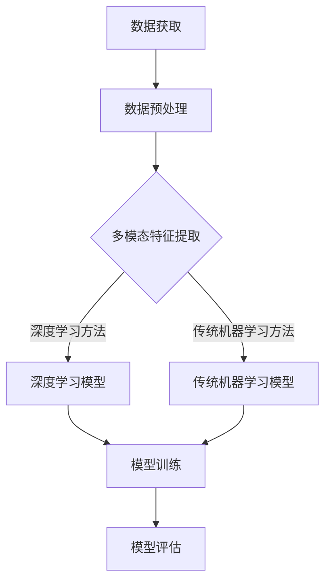

                 

## 文章标题

# 多模态学习在AIGC虚拟现实内容创作中的新进展

> 关键词：多模态学习，AIGC，虚拟现实，内容创作，人工智能，深度学习

> 摘要：本文探讨了多模态学习在AIGC（生成式AI内容创作）虚拟现实内容创作中的应用。首先，介绍了多模态学习的基本概念和其在虚拟现实中的应用背景。接着，详细阐述了AIGC的概念和发展历程，以及虚拟现实技术的核心组成。随后，深入分析了多模态学习在图像生成、视频生成、3D模型生成和虚拟人物交互等方面的应用。最后，通过案例分析展示了多模态学习在虚拟现实内容创作中的实际效果，并对未来的发展方向进行了展望。

## 引言

随着人工智能技术的不断发展和应用的深入，生成式AI（Generative AI）逐渐成为研究热点。其中，AIGC（生成式AI内容创作）以其在图像、视频、音频等多种内容创作领域的卓越表现，受到了广泛关注。虚拟现实（VR）技术作为一种沉浸式交互体验，其内容创作质量直接影响到用户体验。多模态学习作为结合多种数据源的方法，能够有效提升虚拟现实内容创作的质量和效率。

本文旨在探讨多模态学习在AIGC虚拟现实内容创作中的应用，通过对相关技术原理和实际应用的详细分析，为业界提供有益的参考。

## 多模态学习基础

### 多模态数据获取

多模态学习的第一步是数据获取。多模态数据包括图像、文本、音频、视频等多种类型。以下是常见的数据获取方法：

#### 图像数据获取

图像数据可以从公共数据集、社交媒体、网络爬虫等渠道获取。常用的数据集有CIFAR-10、ImageNet等。

#### 文本数据获取

文本数据可以来源于新闻报道、社交媒体评论、论坛帖子等。常见的文本数据集有20 Newsgroups、Twitter等。

#### 音频数据获取

音频数据可以来源于音乐、语音合成、语音识别等。常用的音频数据集有LibriSpeech、Common Voice等。

### 多模态特征提取

特征提取是将原始数据转换为适合机器学习模型处理的表示。以下是常见的多模态特征提取方法：

#### 基于深度学习的特征提取方法

深度学习方法在图像和语音处理领域表现优异。常用的模型有卷积神经网络（CNN）、循环神经网络（RNN）等。

#### 基于传统机器学习的特征提取方法

传统机器学习方法如主成分分析（PCA）、线性判别分析（LDA）等，也可用于特征提取。

### 多模态数据对齐与融合

多模态数据对齐是将不同模态的数据进行同步处理。多模态数据融合是将多模态特征进行整合，以提升模型的性能。以下是常见的方法：

#### 数据对齐方法

时间对齐、空间对齐和语义对齐是常见的数据对齐方法。

#### 数据融合方法

特征级融合、决策级融合和模型级融合是常见的数据融合方法。

### Mermaid流程图：多模态学习架构



## 数学模型基础

### 多模态特征融合模型

多模态特征融合模型是将不同模态的特征进行整合，以提升模型的性能。以下是常见的多模态特征融合模型：

#### 基于向量空间模型的融合

向量空间模型将不同模态的数据转换为向量表示，然后在同一向量空间中进行融合。常见的融合方法有拼接、平均、加权和等。

#### 基于协同过滤的融合

协同过滤方法通过用户行为数据（如评分、点击等）进行特征融合。常见的协同过滤方法有基于用户的协同过滤和基于物品的协同过滤。

#### 基于深度神经网络的融合

深度神经网络方法通过多层神经网络对多模态特征进行整合。常见的深度神经网络模型有卷积神经网络（CNN）和循环神经网络（RNN）。

### 损失函数与优化算法

损失函数用于衡量模型预测结果与真实结果之间的差距。常见的损失函数有均方误差（MSE）、交叉熵损失等。优化算法用于更新模型参数，以最小化损失函数。常见的优化算法有随机梯度下降（SGD）、Adam等。

### 伪代码：多模态特征融合模型

```python
# 定义多模态特征融合模型
def multimodal_fusion(model1, model2):
    # 模型1特征提取
    features1 = model1.extract_features(input_data1)
    # 模型2特征提取
    features2 = model2.extract_features(input_data2)
    # 特征融合
    fused_features = fuse_features(features1, features2)
    # 输出融合特征
    return fused_features
```

## AIGC概述

### AIGC基本概念

AIGC（生成式AI内容创作）是指利用人工智能技术生成高质量、创意性的内容。AIGC涵盖了图像、视频、音频等多种类型的内容创作。

### AIGC发展历程

AIGC起源于生成对抗网络（GANs），随后发展出了基于变分自编码器（VAEs）和自注意力机制（Self-Attention）等的新型模型。

### AIGC主要应用领域

AIGC在图像生成、视频生成、文本生成和音频生成等领域有着广泛的应用。以下是一些典型的应用场景：

- 图像生成：艺术创作、游戏开发、虚拟现实等。
- 视频生成：电影特效、广告制作、虚拟直播等。
- 文本生成：写作辅助、聊天机器人、智能客服等。
- 音频生成：音乐创作、语音合成、声音效果等。

## 虚拟现实技术

### 虚拟现实硬件介绍

虚拟现实硬件包括显示设备、输入设备和声音设备等。以下是一些常见的虚拟现实硬件：

- 显示设备：头戴式显示器（HMD）、投影仪等。
- 输入设备：手柄、身体跟踪器、眼球跟踪器等。
- 声音设备：虚拟现实耳机、空间音频系统等。

### 虚拟现实软件技术

虚拟现实软件技术包括场景构建、交互技术和内容创作工具等。以下是一些常见的虚拟现实软件技术：

- 场景构建：3D建模、纹理映射、光照效果等。
- 交互技术：手势识别、语音识别、虚拟现实控制器等。
- 内容创作工具：Unity、Unreal Engine、Blender等。

### 虚拟现实与人机交互

虚拟现实与人机交互涉及人机交互模型和用户行为分析等方面。以下是一些常见的人机交互模型和用户行为分析方法：

- 人机交互模型：认知模型、情感模型、社交模型等。
- 用户行为分析：行为追踪、行为预测、行为反馈等。

## AIGC在虚拟现实中的应用

### AIGC在虚拟现实内容创作中的应用

AIGC在虚拟现实内容创作中有着广泛的应用。以下是一些典型的应用场景：

- 图像生成：用于虚拟现实场景的图像生成，提升场景的逼真度。
- 视频生成：用于虚拟现实视频内容的生成，提升用户体验。
- 3D模型生成：用于虚拟现实3D模型的生成，丰富虚拟现实内容。
- 虚拟人物交互：用于生成与用户交互的虚拟人物，提升交互体验。

### AIGC在虚拟现实交互中的应用

AIGC在虚拟现实交互中也有着广泛的应用。以下是一些典型的应用场景：

- 虚拟人物交互：通过生成虚拟人物，实现与用户的自然交互。
- 虚拟现实场景自适应生成：根据用户行为和环境变化，动态生成虚拟现实场景。
- 虚拟现实个性化推荐：根据用户兴趣和行为，推荐虚拟现实内容。

## 多模态学习在虚拟现实内容创作中的应用

### 多模态学习在图像生成中的应用

多模态学习在图像生成中的应用主要体现在利用文本描述生成图像。以下是一个简单的伪代码示例：

```python
# 定义多模态图像生成模型
def multimodal_image_generation(text, image):
    # 文本特征提取
    text_features = text_encoder.encode(text)
    # 图像特征提取
    image_features = image_encoder.encode(image)
    # 特征融合
    fused_features = fuse_features(text_features, image_features)
    # 图像生成
    generated_image = generator(fused_features)
    # 输出生成图像
    return generated_image
```

### 多模态学习在视频生成中的应用

多模态学习在视频生成中的应用主要体现在利用文本和图像生成视频内容。以下是一个简单的伪代码示例：

```python
# 定义多模态视频生成模型
def multimodal_video_generation(text, images):
    # 文本特征提取
    text_features = text_encoder.encode(text)
    # 图像特征提取
    image_features = [image_encoder.encode(image) for image in images]
    # 特征融合
    fused_features = [fuse_features(text_features, image_feature) for image_feature in image_features]
    # 视频帧生成
    video_frames = [generator(fused_feature) for fused_feature in fused_features]
    # 视频合成
    video = video_synthetizer合成(video_frames)
    # 输出生成视频
    return video
```

### 多模态学习在3D模型生成中的应用

多模态学习在3D模型生成中的应用主要体现在利用文本和图像生成3D模型。以下是一个简单的伪代码示例：

```python
# 定义多模态3D模型生成模型
def multimodal_3d_model_generation(text, images):
    # 文本特征提取
    text_features = text_encoder.encode(text)
    # 图像特征提取
    image_features = [image_encoder.encode(image) for image in images]
    # 特征融合
    fused_features = [fuse_features(text_features, image_feature) for image_feature in image_features]
    # 3D模型生成
    model = 3d_generator(fused_features)
    # 输出生成模型
    return model
```

### 多模态学习在虚拟人物交互中的应用

多模态学习在虚拟人物交互中的应用主要体现在利用文本和图像生成与用户交互的虚拟人物。以下是一个简单的伪代码示例：

```python
# 定义多模态虚拟人物交互模型
def multimodal_virtual_character_interaction(text, image):
    # 文本特征提取
    text_features = text_encoder.encode(text)
    # 图像特征提取
    image_features = image_encoder.encode(image)
    # 特征融合
    fused_features = fuse_features(text_features, image_features)
    # 虚拟人物生成
    character = character_generator(fused_features)
    # 与用户交互
    interaction = character.interact_with_user()
    # 输出生成交互结果
    return interaction
```

## 案例分析

### 案例一：虚拟场景构建

某游戏公司利用多模态学习技术生成虚拟场景，以提升游戏画面的逼真度。该公司收集了大量图像、文本和音频数据，通过多模态学习技术生成高质量的虚拟场景。以下是一个简单的项目实战过程：

1. **开发环境搭建**：安装Python、TensorFlow等必要的开发工具和库。

2. **数据集准备**：收集并整理图像、文本和音频数据，将其转换为适合训练的数据集。

3. **模型训练**：利用多模态学习技术训练图像生成模型、文本生成模型和音频生成模型。

4. **虚拟场景生成**：将训练好的模型应用于实际场景，生成高质量的虚拟场景。

5. **代码解读**：对生成的虚拟场景进行代码解读，分析其生成过程和结果。

6. **分析与应用**：对生成的虚拟场景进行分析，评估其逼真度和实用性。

7. **项目小结**：总结项目成果，提出改进建议。

### 案例二：虚拟人物生成

某影视公司利用多模态学习技术生成虚拟人物，以提升影视作品的表现力。该公司收集了大量图像、文本和音频数据，通过多模态学习技术生成与演员相似的虚拟人物。以下是一个简单的项目实战过程：

1. **开发环境搭建**：安装Python、TensorFlow等必要的开发工具和库。

2. **数据集准备**：收集并整理图像、文本和音频数据，将其转换为适合训练的数据集。

3. **模型训练**：利用多模态学习技术训练图像生成模型、文本生成模型和音频生成模型。

4. **虚拟人物生成**：将训练好的模型应用于实际场景，生成高质量的虚拟人物。

5. **代码解读**：对生成的虚拟人物进行代码解读，分析其生成过程和结果。

6. **分析与应用**：对生成的虚拟人物进行分析，评估其逼真度和实用性。

7. **项目小结**：总结项目成果，提出改进建议。

## 未来展望

随着人工智能技术的不断发展，多模态学习在AIGC虚拟现实内容创作中的应用前景广阔。未来，以下几个方面有望取得重要进展：

- **算法优化**：研究更高效的多模态特征提取和融合算法，提升内容创作质量。
- **应用拓展**：将多模态学习应用于更多领域，如虚拟现实医疗、虚拟现实教育等。
- **跨模态交互**：实现跨模态数据的高效交互和融合，提升虚拟现实用户体验。
- **隐私保护**：研究多模态数据隐私保护技术，保障用户隐私安全。

## 最佳实践 Tips

- **数据质量**：高质量的数据是多模态学习成功的关键。确保数据集的多样性和完整性，避免数据偏见。
- **模型优化**：根据实际需求调整模型结构和参数，提升模型性能。
- **硬件配置**：合理配置硬件资源，确保模型训练和推理的效率。
- **持续更新**：关注最新研究成果和技术动态，不断优化和改进多模态学习应用。

## 小结

本文探讨了多模态学习在AIGC虚拟现实内容创作中的应用。首先，介绍了多模态学习的基础概念和应用背景。接着，详细阐述了AIGC的概念和发展历程，以及虚拟现实技术的核心组成。随后，深入分析了多模态学习在图像生成、视频生成、3D模型生成和虚拟人物交互等方面的应用。最后，通过案例分析展示了多模态学习在虚拟现实内容创作中的实际效果，并对未来的发展方向进行了展望。

## 注意事项

- **数据安全**：在处理多模态数据时，确保用户隐私和数据安全。
- **模型解释性**：关注模型的可解释性，确保模型输出结果的可靠性。
- **技术应用**：结合实际需求，选择合适的多模态学习技术和应用场景。

## 拓展阅读

- 《多模态学习：基础、方法与应用》
- 《AIGC：生成式AI内容创作的实践与探索》
- 《虚拟现实技术与应用》

## 作者信息

作者：AI天才研究院/AI Genius Institute & 禅与计算机程序设计艺术 /Zen And The Art of Computer Programming

