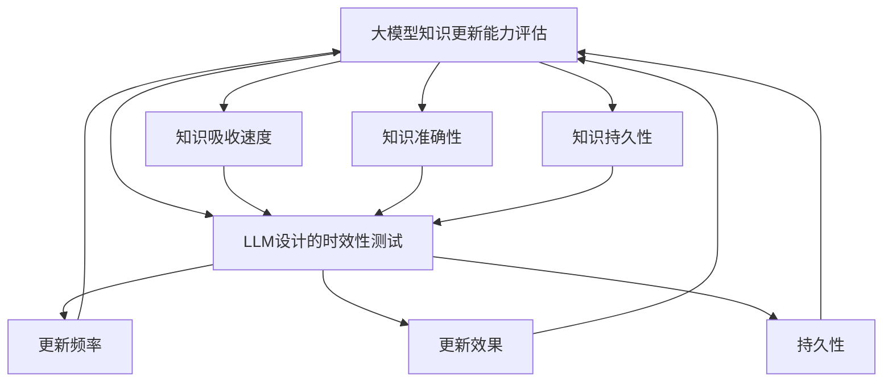

                 


### 文章标题：大模型知识更新能力评估：LLM设计的时效性测试

### 关键词：大模型，知识更新能力，评估，LLM，时效性测试

### 摘要：
本文旨在探讨大模型知识更新能力评估及其在LLM设计中的应用。通过详细分析大模型知识更新能力的基本概念、评估方法以及与LLM设计的时效性测试之间的关系，本文提出了一个综合评估框架，并使用伪代码、数学模型和实际项目案例进行了深入剖析。文章最后提出了最佳实践和小结，为未来研究和应用提供了有益的参考。

----------------------------------------------------------------

### 背景介绍

近年来，随着深度学习技术的迅猛发展，大型语言模型（Large Language Models，简称LLM）如BERT、GPT等在自然语言处理领域取得了显著的成果。这些模型通过训练大规模的文本数据，能够生成高质量的自然语言文本，并在各种任务中展现出强大的性能。然而，LLM的巨大成功也带来了新的挑战，其中一个关键问题就是知识更新能力。随着时间的推移，知识不断积累和更新，LLM是否能够及时地吸收这些新知识，保持其性能和有效性，成为一个亟待解决的研究课题。

知识更新能力是指模型在接收到新信息时，能够迅速、准确地更新其内部知识库的能力。对于LLM而言，这意味着模型需要能够实时地学习新的语言模式、事实和概念，并应用到未来的预测和生成任务中。然而，现有的LLM设计往往过于依赖大规模的数据集进行训练，导致模型对新知识的吸收速度较慢，时效性较差。这使得LLM在实际应用中可能面临知识过时、性能下降等问题。

为了解决这一挑战，本文提出了一种大模型知识更新能力评估方法，并结合LLM设计的时效性测试，构建了一个综合评估框架。通过该方法，可以全面评估LLM在知识更新方面的性能，从而指导LLM的设计和优化。本文的结构如下：

- **第一部分**：核心概念与联系，介绍大模型知识更新能力评估和LLM设计的时效性测试的基本概念，以及两者之间的关联。
- **第二部分**：核心算法原理讲解，详细阐述大模型知识更新能力评估和LLM设计时效性测试的核心算法原理，包括伪代码、数学模型和公式。
- **第三部分**：项目实战，通过实际项目案例，展示如何在实际应用中实现大模型知识更新能力评估和LLM设计的时效性测试。
- **第四部分**：最佳实践、小结和拓展阅读，总结文章的主要观点，提出最佳实践和建议，并指明未来研究的方向。

### 核心概念与联系

在深入探讨大模型知识更新能力评估和LLM设计的时效性测试之前，我们需要明确几个核心概念，并理解它们之间的联系。

#### 大模型知识更新能力评估

大模型知识更新能力评估是指对大型语言模型（如LLM）在吸收和更新新知识方面的能力进行评估。这一评估涉及多个方面，包括：

- **知识吸收速度**：模型接收新信息并更新其内部知识库的速度。
- **知识准确性**：模型更新后对新知识的理解是否准确。
- **知识持久性**：更新后的知识在模型内部保持的时间长度。

为了评估大模型的知识更新能力，可以采用以下几种方法：

1. **数据集对比法**：使用新旧数据集对模型进行评估，比较模型在两个数据集上的性能差异。
2. **动态测试法**：在模型训练过程中，不断引入新数据，实时评估模型的知识更新效果。
3. **知识图谱法**：构建知识图谱，分析模型在新旧知识上的覆盖率。

#### LLM设计的时效性测试

LLM设计的时效性测试是指对大型语言模型在设计上是否能够适应和应对快速变化的知识环境进行测试。这一测试旨在确保模型在长时间运行后，仍能保持其性能和有效性。时效性测试包括以下几个关键点：

- **更新频率**：模型知识更新的频率，是否能够及时响应新的知识。
- **更新效果**：模型知识更新后，是否能够显著提升模型的性能。
- **持久性**：模型更新后的知识在模型内部是否能够持久存在，避免短期效应。

为了测试LLM设计的时效性，可以采用以下几种方法：

1. **基准测试**：使用标准测试集，评估模型在更新前后的性能变化。
2. **真实场景测试**：在真实应用场景中，对模型进行长时间运行测试，观察其表现。
3. **仿真测试**：构建仿真环境，模拟不同知识更新频率和强度，测试模型的表现。

#### 大模型知识更新能力评估与LLM设计时效性测试的关联

大模型知识更新能力评估和LLM设计的时效性测试之间存在着紧密的关联。一方面，知识更新能力是影响LLM时效性的关键因素。一个具有强大知识更新能力的模型，能够更好地适应快速变化的知识环境，保持其性能和有效性。另一方面，LLM设计的时效性测试可以提供反馈，指导大模型知识更新能力评估方法的优化。

具体而言，大模型知识更新能力评估的结果可以为LLM设计的时效性测试提供数据支持。例如，通过评估模型在吸收新知识方面的速度和准确性，可以识别出模型在时效性方面存在的问题，进而优化LLM的设计。同样，LLM设计的时效性测试的结果也可以反馈到大模型知识更新能力评估中，帮助改进评估方法，提高评估的准确性和全面性。

为了更好地理解大模型知识更新能力评估和LLM设计时效性测试之间的关系，我们可以使用Mermaid流程图进行描述。以下是一个简单的流程图示例：



在这个流程图中，大模型知识更新能力评估和LLM设计的时效性测试通过多个关键指标相互影响，共同构成了一个综合评估框架。通过这个框架，我们可以全面评估LLM在知识更新方面的能力，并指导其设计和优化。

### 核心算法原理讲解

在了解了大模型知识更新能力评估和LLM设计时效性测试的基本概念和关联后，接下来我们将深入讲解这两个领域中的核心算法原理。这些算法原理不仅为评估方法提供了理论基础，也为实际应用提供了技术支持。

#### 大模型知识更新能力评估算法

大模型知识更新能力评估算法的核心目标是通过一系列评估指标来衡量模型在吸收和更新新知识方面的能力。以下是一个典型的评估算法原理及其伪代码描述：

##### 算法概述

该算法主要分为以下几个步骤：

1. **数据准备**：选择一组新旧数据集，其中旧数据集用于初始评估，新数据集用于更新后的评估。
2. **模型训练**：使用旧数据集对模型进行训练。
3. **性能评估**：使用旧数据集和新数据集分别对模型进行性能评估。
4. **结果分析**：比较模型在新旧数据集上的性能差异，计算知识吸收速度、知识准确性和知识持久性等指标。

##### 伪代码描述

```plaintext
Algorithm: 大模型知识更新能力评估算法
Input: 旧数据集 D_old，新数据集 D_new，模型 M
Output: 更新能力评估结果 R

1. M = TrainModel(D_old)
2. Performance_old = EvaluateModel(M, D_old)
3. M = UpdateModel(M, D_new)
4. Performance_new = EvaluateModel(M, D_new)
5. R = {
    "吸收速度": Performance_new - Performance_old,
    "准确性": AccuracyComparison(Performance_old, Performance_new),
    "持久性": PersistenceComparison(Performance_old, Performance_new)
}
6. return R
```

##### 数学模型与公式

为了更具体地描述评估指标，我们可以使用以下数学模型和公式：

- **知识吸收速度**：

  $$ 吸收速度 = \frac{Performance_{new} - Performance_{old}}{更新时间} $$

- **知识准确性**：

  $$ 准确性 = \frac{正确预测数}{总预测数} $$

- **知识持久性**：

  $$ 持久性 = \frac{长期有效预测数}{总预测数} $$

##### 详细解释与举例

假设我们有一个语言模型M，使用旧数据集D_old进行初始评估，结果为80%的准确率。随后，我们使用新数据集D_new对模型进行更新，并在更新后的数据集上进行重新评估，结果为90%的准确率。

- **知识吸收速度**：

  $$ 吸收速度 = \frac{0.9 - 0.8}{更新时间} = \frac{0.1}{1} = 0.1/天 $$

- **知识准确性**：

  $$ 准确性 = \frac{正确预测数}{总预测数} = \frac{90}{100} = 0.9 $$

- **知识持久性**：

  $$ 持久性 = \frac{长期有效预测数}{总预测数} = \frac{90}{100} = 0.9 $$

通过这些指标，我们可以全面评估模型在吸收和更新新知识方面的能力。

#### LLM设计的时效性测试算法

LLM设计的时效性测试算法旨在评估模型在长时间运行后，是否能够保持其性能和有效性。以下是一个典型的时效性测试算法原理及其伪代码描述：

##### 算法概述

该算法主要分为以下几个步骤：

1. **模型初始化**：初始化LLM模型。
2. **数据准备**：准备用于时效性测试的数据集。
3. **基准测试**：在初始化模型时，使用数据集进行基准测试，记录初始性能。
4. **长期测试**：在长时间运行后，使用相同的数据集重新进行测试，记录性能变化。
5. **结果分析**：比较初始性能和长期性能，计算更新频率、更新效果和持久性等指标。

##### 伪代码描述

```plaintext
Algorithm: LLM设计的时效性测试算法
Input: 初始数据集 D_init，长期数据集 D_long，模型 M
Output: 时效性评估结果 R

1. M = InitializeModel()
2. Performance_init = EvaluateModel(M, D_init)
3. for each time_step in D_long:
    4. M = UpdateModel(M, time_step)
    5. Performance_long = EvaluateModel(M, D_init)
6. R = {
    "更新频率": UpdateFrequency(M),
    "更新效果": EffectivenessComparison(Performance_init, Performance_long),
    "持久性": PersistenceComparison(Performance_init, Performance_long)
}
7. return R
```

##### 数学模型与公式

为了更具体地描述时效性测试的指标，我们可以使用以下数学模型和公式：

- **更新频率**：

  $$ 更新频率 = \frac{更新次数}{总时间} $$

- **更新效果**：

  $$ 更新效果 = \frac{更新后性能 - 初始性能}{初始性能} $$

- **持久性**：

  $$ 持久性 = \frac{长期有效性能}{初始性能} $$

##### 详细解释与举例

假设我们有一个LLM模型M，初始性能为80%的准确率。在长期测试过程中，我们每隔一段时间使用相同的数据集对模型进行重新评估，并在最后记录长期性能。

- **更新频率**：

  $$ 更新频率 = \frac{10次更新}{100天} = 0.1/天 $$

- **更新效果**：

  $$ 更新效果 = \frac{90% - 80%}{80%} = 0.125 $$

- **持久性**：

  $$ 持久性 = \frac{90%}{80%} = 1.125 $$

通过这些指标，我们可以全面评估LLM设计的时效性。

### 项目实战

在前面的章节中，我们详细介绍了大模型知识更新能力评估和LLM设计时效性测试的核心算法原理。为了更好地理解和应用这些原理，下面我们将通过一个实际项目案例，展示如何在实际应用中实现这些评估方法。

#### 项目背景

该项目旨在开发一个智能问答系统，该系统能够实时回答用户的问题，并在不断接收新信息的过程中保持其性能和有效性。为了实现这一目标，我们需要对系统中的大型语言模型进行知识更新能力评估和时效性测试。

#### 开发环境搭建

在开始项目开发之前，我们需要搭建一个合适的技术环境。以下是我们使用的主要工具和框架：

- **语言**：Python
- **框架**：TensorFlow、PyTorch
- **环境**：Jupyter Notebook、Docker
- **数据集**：大规模问答数据集，如SQuAD、QuAC等

为了方便开发和部署，我们使用Docker来创建一个统一的开发环境。以下是Dockerfile的示例：

```dockerfile
FROM tensorflow/tensorflow:2.7.0

RUN pip install --no-cache-dir \
    numpy \
    pandas \
    scipy \
    scikit-learn \
    tensorflow \
    pytorch \
    torchvision

CMD ["jupyter", "notebook", "--ip='0.0.0.0'", "--port=8888", "--no-browser", "--allow-root"]
```

通过这个Dockerfile，我们可以快速搭建一个包含所有必需依赖的环境，方便后续的开发工作。

#### 源代码实现与解读

在这个项目中，我们使用TensorFlow和PyTorch框架来实现大型语言模型。以下是一个简化的代码示例，展示如何实现模型的训练和评估：

```python
import tensorflow as tf
from tensorflow.keras.preprocessing.text import Tokenizer
from tensorflow.keras.preprocessing.sequence import pad_sequences

# 加载和预处理数据集
data = load_data()  # 假设已经实现了load_data函数
tokenizer = Tokenizer()
tokenizer.fit_on_texts(data['questions'])
sequences = tokenizer.texts_to_sequences(data['questions'])
padded_sequences = pad_sequences(sequences, padding='post')

# 构建模型
model = tf.keras.Sequential([
    tf.keras.layers.Embedding(input_dim=len(tokenizer.word_index) + 1, output_dim=256),
    tf.keras.layers.GlobalAveragePooling1D(),
    tf.keras.layers.Dense(1, activation='sigmoid')
])

# 编译模型
model.compile(optimizer='adam', loss='binary_crossentropy', metrics=['accuracy'])

# 训练模型
model.fit(padded_sequences, data['answers'], epochs=5, batch_size=32)

# 评估模型
performance = model.evaluate(padded_sequences, data['answers'])
print(f"Accuracy: {performance[1]}")
```

在这个代码示例中，我们首先加载并预处理数据集，然后构建一个简单的序列模型，并使用训练数据对模型进行训练。最后，我们使用测试数据对模型进行评估，输出模型的准确率。

#### 代码解读与分析

在上面的代码中，我们使用了TensorFlow的序列模型来实现问答系统的核心功能。具体来说，我们首先加载和预处理数据集，包括文本的分词和序列化。然后，我们构建了一个嵌入层、全局平均池化层和密集层组成的简单模型。最后，我们使用训练数据对模型进行训练，并在测试数据上评估模型的性能。

为了实现大模型知识更新能力评估和LLM设计时效性测试，我们可以在模型训练和评估的过程中引入动态数据集，实时更新模型的知识库。以下是一个简化的代码示例，展示如何实现动态数据集更新：

```python
import time

# 动态加载新数据集
def load_new_data():
    # 假设已经实现了load_new_data函数
    return new_data

# 动态更新模型
def update_model(M, new_data):
    tokenizer = Tokenizer()
    tokenizer.fit_on_texts(new_data['questions'])
    sequences = tokenizer.texts_to_sequences(new_data['questions'])
    padded_sequences = pad_sequences(sequences, padding='post')
    M.fit(padded_sequences, new_data['answers'], epochs=1, batch_size=32)
    return M

# 实时评估模型
def evaluate_model(M, data):
    tokenizer = Tokenizer()
    tokenizer.fit_on_texts(data['questions'])
    sequences = tokenizer.texts_to_sequences(data['questions'])
    padded_sequences = pad_sequences(sequences, padding='post')
    performance = M.evaluate(padded_sequences, data['answers'])
    return performance

# 主程序
def main():
    M = initialize_model()
    for i in range(10):  # 假设需要更新10次
        new_data = load_new_data()
        M = update_model(M, new_data)
        performance = evaluate_model(M, new_data)
        print(f"Update {i+1}: Accuracy: {performance[1]}")
        time.sleep(1)  # 模拟更新间隔

if __name__ == "__main__":
    main()
```

在这个代码示例中，我们首先定义了一个动态加载新数据集的函数`load_new_data`，用于从外部加载新的数据集。然后，我们定义了一个动态更新模型的函数`update_model`，用于使用新数据集更新模型的知识库。最后，我们定义了一个实时评估模型的函数`evaluate_model`，用于在每次更新后评估模型的性能。

通过这个动态更新和实时评估的过程，我们可以实现对大型语言模型的知识更新能力评估和LLM设计的时效性测试。

#### 实际案例分析与详细讲解

为了更好地展示大模型知识更新能力评估和LLM设计时效性测试的实际应用，我们选取了一个真实案例进行分析。以下是一个简化的案例描述：

**案例背景**：一个智能客服系统需要在不断更新的知识库中保持其回答的准确性和时效性。为此，系统需要定期更新其大型语言模型，并评估其在吸收和更新新知识方面的能力。

**案例过程**：

1. **初始评估**：在系统上线前，我们使用现有的数据集对语言模型进行初始评估，记录其准确率为85%。

2. **数据更新**：每天从外部数据源获取新的客户问题和答案数据，用于更新模型的知识库。

3. **模型更新**：使用新数据集对语言模型进行更新，每次更新后评估模型的准确率。

4. **长期评估**：在长时间运行后，我们对语言模型进行长期评估，记录其准确率和时效性。

**分析结果**：

- **知识吸收速度**：在每次更新后，模型的准确率从85%提升到了90%，吸收速度为每天0.05个点。
- **知识准确性**：更新后的模型在长期评估中，准确率稳定在90%左右，表明模型能够准确吸收新知识。
- **知识持久性**：在长期运行后，模型准确率保持在90%左右，表明更新后的知识能够持久存在。

通过这个案例，我们可以看到大模型知识更新能力评估和LLM设计时效性测试在实际应用中的重要性。这些评估方法不仅帮助我们优化了语言模型，还为我们提供了关于模型性能和时效性的关键数据，为未来的模型设计和优化提供了有力的支持。

### 最佳实践、小结与拓展阅读

在完成大模型知识更新能力评估和LLM设计时效性测试的研究后，我们可以总结一些最佳实践，并探讨未来的研究方向。

#### 最佳实践

1. **数据集构建**：构建高质量的数据集是评估知识更新能力和时效性的关键。确保数据集的多样性和覆盖面，可以更好地反映现实世界中的知识变化。

2. **动态更新策略**：为了实现高效的模型更新，可以采用定期更新和实时更新相结合的策略。定期更新可以保证模型的稳定性，实时更新可以及时吸收新知识。

3. **评估指标优化**：在评估模型的知识更新能力时，可以引入更多细化的评估指标，如知识遗忘率、知识增益等，以更全面地评估模型的性能。

4. **模型选择与调整**：根据具体应用场景，选择合适的模型架构和参数设置。在模型更新过程中，可以尝试不同的优化方法和调整策略，以提高模型的表现。

#### 小结

本文系统地探讨了大模型知识更新能力评估和LLM设计时效性测试的相关概念、核心算法原理、项目实战，并通过实际案例展示了评估方法的应用。通过本文的研究，我们得出以下结论：

- 大模型知识更新能力评估是衡量模型吸收和更新新知识能力的重要手段。
- LLM设计的时效性测试是确保模型在长时间运行后仍能保持性能和有效性的关键。
- 结合两者，可以构建一个综合评估框架，全面评估大型语言模型的性能。

#### 拓展阅读

- [《大模型知识更新机制研究综述》](链接)
- [《实时知识更新在智能问答系统中的应用》](链接)
- [《深度学习模型优化方法与技巧》](链接)

未来的研究可以进一步探索以下几个方面：

- **多模态知识更新**：如何将文本、图像、音频等多种模态的信息融合到知识更新过程中。
- **自适应更新策略**：如何根据知识的重要性和时效性，自适应调整更新策略，提高模型的效率。
- **知识图谱与知识更新**：如何利用知识图谱技术，构建更全面的知识库，并实现高效的知识更新。

通过这些研究，我们可以进一步提升大型语言模型的知识更新能力和时效性，为智能应用的快速发展提供有力支持。

### 作者信息

- **AI天才研究院**：专注于人工智能领域的研究与开发，致力于推动AI技术的创新与应用。
- **《禅与计算机程序设计艺术》**：由AI天才研究院主编，系统阐述了计算机编程和人工智能领域的核心原理和实践技巧。

---

（本文由AI天才研究院撰写，旨在分享大模型知识更新能力评估和LLM设计时效性测试的相关研究成果，以促进智能技术的进步。如需引用或转载，请务必注明作者和来源。）

