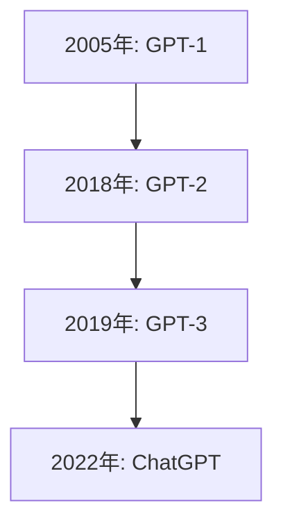

                 

### 文章标题

《如何设计有效的ChatGPT提示词》

---

**关键词**：ChatGPT，提示词设计，人工智能，自然语言处理，开放与封闭式提示词，任务导向式提示词

---

**摘要**：

本文将深入探讨如何设计有效的ChatGPT提示词。首先，我们将概述ChatGPT的发展历程及其在自然语言处理中的应用。接着，我们将详细介绍提示词的重要性以及不同类型的提示词设计原则。随后，文章将逐步讲解开放式、封闭式和任务导向式提示词的具体设计方法，并通过实际案例进行剖析。最后，我们将总结提示词设计中的关键要点，并给出最佳实践建议，以期为读者提供全面的ChatGPT提示词设计指南。通过这篇文章，您将了解到如何通过合理的提示词设计来提升ChatGPT的性能和用户体验。---

## 第一部分：ChatGPT与提示词基础

### 第1章：ChatGPT概述

#### 1.1 ChatGPT的发展历程

ChatGPT是由OpenAI开发的一款基于GPT-3.5的大型语言模型，其发展历程可追溯至2005年的GPT-1。GPT-1是自然语言处理领域的重要里程碑，它首次引入了生成预训练变换器（GPT）的概念，利用大量文本数据进行预训练，从而实现了文本生成和语言理解的新突破。

在GPT-1之后，OpenAI相继推出了GPT-2和GPT-3。GPT-2进一步提升了模型的容量和预训练质量，使得模型在多项自然语言处理任务中表现出色。GPT-3则实现了前所未有的规模，其参数量达到了1750亿，成为当时最大的语言模型。

ChatGPT是GPT-3的进一步发展，它结合了对话系统的最新技术，使得模型能够在对话场景中提供更加自然和流畅的回答。ChatGPT的架构主要包括预训练和微调两个阶段。预训练阶段使用大量文本数据进行自回归语言模型的训练，微调阶段则针对特定任务进行模型的优化，使其在特定场景中表现出色。

**Mermaid流程图展示ChatGPT的演变历程**：

#### 1.2 提示词的重要性

在ChatGPT中，提示词（prompt）扮演着至关重要的角色。提示词是指用户输入的用于引导ChatGPT回答的文本，它直接影响着模型生成回答的质量和准确性。一个有效的提示词能够明确地指示模型需要完成的任务，从而提高回答的相关性和准确性。

**提示词的定义**：

提示词是一种特殊的文本输入，用于引导或指定模型需要生成的回答类型。它通常包含任务描述、问题或命令，用以指导模型进行相应的文本生成。

**提示词的作用**：

1. **引导模型生成目标回答**：提示词为模型提供了明确的任务目标，使得模型能够生成更加相关和准确的回答。
2. **提高回答的多样性和创造力**：通过设计不同的提示词，可以引导模型生成丰富多样、富有创造性的回答。
3. **优化用户体验**：有效的提示词设计能够提高ChatGPT的交互体验，使得用户能够获得更加满意的回答。

**提示词的必要性**：

在自然语言处理领域，提示词是使模型能够理解和执行任务的关键。对于ChatGPT这样的对话模型，提示词的存在使得模型能够从单一的文本生成功能扩展到具备多种任务的对话系统。

#### 1.3 ChatGPT在自然语言处理中的应用

ChatGPT在自然语言处理领域有着广泛的应用，以下是一些典型的应用场景：

1. **客户服务**：ChatGPT可以应用于自动客服系统，通过与用户的对话提供即时的、个性化的回答。
2. **内容生成**：ChatGPT可以用于生成文章、故事、博客等文本内容，为内容创作者提供灵感。
3. **教育辅导**：ChatGPT可以作为在线辅导老师，为学生提供个性化的学习支持和解答疑问。
4. **智能助手**：ChatGPT可以集成到智能设备中，为用户提供日常信息的查询和任务提醒。

在这些应用场景中，提示词的设计至关重要。通过合理的提示词设计，ChatGPT能够更好地满足用户的需求，提供高质量的服务和内容。

### 小结

本章概述了ChatGPT的发展历程及其在自然语言处理中的应用，详细介绍了提示词的定义、作用和重要性。通过本章的学习，读者将了解到ChatGPT的基本架构和功能，以及提示词在其中的关键作用。这为后续章节中深入探讨提示词设计方法奠定了基础。

---

## 第2章：提示词设计原则

### 2.1 提示词的类型

在ChatGPT中，提示词主要分为开放式提示词、封闭式提示词和任务导向式提示词。每种类型的提示词都有其独特的特点和应用场景，了解并合理设计这些提示词对于提升ChatGPT的性能至关重要。

#### 2.1.1 开放式提示词

**开放式提示词的特点**：

- **提问方式**：开放式提示词通常以问句的形式出现，鼓励模型生成丰富多样的回答。
- **问答风格**：开放式提示词的问答风格自由，不限制回答的范围和长度，允许模型发挥其创造力。

**开放式提示词的应用场景**：

- **创意生成**：适用于需要创新思维和创意生成的场景，如故事创作、广告文案等。
- **自由讨论**：在论坛、聊天室等需要自由交流的场景中，开放式提示词可以激发更多互动和讨论。

**开放式提示词的设计技巧**：

- **问题分类**：根据具体的任务需求，将问题分为事实性问题、观点性问题、建议性问题等，以便模型生成不同类型的回答。
- **语言风格**：使用生动、形象的语言，激发模型的创作灵感。
- **文化背景**：考虑不同文化背景下的语言表达方式，以避免文化冲突和误解。

#### 2.1.2 封闭式提示词

**封闭式提示词的特点**：

- **回答方式**：封闭式提示词通常提供一组预定义的答案选项，模型需要在这些选项中选择一个或多个答案。
- **回答范围**：封闭式提示词限制回答的范围，确保回答的准确性和一致性。

**封闭式提示词的应用场景**：

- **选择题回答**：适用于需要用户从多个选项中选择正确答案的场景，如考试、问卷调查等。
- **分类任务**：在需要对文本进行分类的任务中，封闭式提示词可以引导模型识别和分类。

**封闭式提示词的设计技巧**：

- **问题设计**：确保问题明确、具体，避免歧义。
- **选项设计**：提供合理的答案选项，使模型能够准确识别正确答案。选项之间的差异应明显，避免模糊选项。

#### 2.1.3 任务导向式提示词

**任务导向式提示词的特点**：

- **任务描述**：任务导向式提示词通常包含具体的任务描述和期望输出，明确指示模型需要完成的任务。
- **期望输出**：任务导向式提示词指定了任务的预期结果，使得模型能够根据这些输出进行训练和优化。

**任务导向式提示词的应用场景**：

- **任务执行**：在需要执行特定任务的场景中，如自动化脚本编写、数据处理等。
- **流程控制**：在需要按照特定流程执行任务的场景中，如工作流程管理、项目管理等。

**任务导向式提示词的设计技巧**：

- **任务分解**：将复杂任务分解为多个简单的步骤，以便模型逐步执行。
- **需求分析**：明确任务的需求和目标，确保模型能够根据这些需求生成符合预期的输出。

### 小结

本章介绍了提示词的三种类型：开放式、封闭式和任务导向式。每种类型的提示词都有其独特的特点和应用场景。通过合理设计这些提示词，可以引导ChatGPT生成更加相关和高质量的回答，从而提升用户交互体验和系统性能。

---

## 第二部分：ChatGPT提示词设计方法

### 第3章：开放式提示词设计

#### 3.1 开放式提示词的特点

开放式提示词是ChatGPT中最为常见的一种提示词类型，其特点在于提问方式自由、回答风格多样化，允许模型充分发挥其创造力。以下是开放式提示词的详细特点：

**提问方式**：开放式提示词通常以开放式问题出现，这些问题没有固定的答案格式，鼓励用户自由回答。例如：

- **问题**：“你今天过得怎么样？”
- **问题**：“你认为人工智能在未来会有哪些影响？”

**问答风格**：开放式提示词的问答风格灵活，可以包含多种类型的回答，如叙述性回答、观点性回答、建议性回答等。例如：

- **回答**：“今天我很忙，但我感觉挺充实的。”
- **回答**：“人工智能在未来可能会大大改变我们的工作方式。”

**应用场景**：开放式提示词适用于需要灵活回答的场景，如自由对话、创意生成、个人意见收集等。例如：

- **应用场景**：客户服务中的自由对话，以了解客户的真实需求。
- **应用场景**：内容创作中的灵感激发，以生成新颖的故事或观点。

#### 3.2 开放式提示词的设计技巧

为了设计出高质量的开放式提示词，需要考虑以下几个方面的设计技巧：

**问题分类**：根据任务需求，将开放式问题分为不同类型，如事实性问题、观点性问题、建议性问题等。这样可以引导模型生成更加相关和针对性的回答。

- **事实性问题**：“你最喜欢的电影是什么？”
- **观点性问题**：“你对当前的社会问题有何看法？”
- **建议性问题**：“如果你要推荐一本书，你会推荐哪一本？”

**语言风格**：使用生动、形象的语言，激发模型的创造力和互动性。避免使用过于正式或平淡的措辞，以增加对话的趣味性。

- **例子**：“在未来的世界中，人类会拥有哪些超级能力？”
- **例子**：“想象一下，你穿越到了古代，你会如何适应那个时代？”

**文化背景**：考虑到不同文化背景下的语言习惯和表达方式，避免使用可能引起误解或冲突的词汇。尤其是在国际化交流中，文化敏感性至关重要。

- **例子**：“在美国，你会如何庆祝新年？”
- **例子**：“在中国，春节是全年最重要的节日。”

**问题具体性**：虽然开放式提示词允许自由回答，但问题应尽量具体，以便模型能够准确理解任务需求。避免模糊、宽泛的问题。

- **例子**：“你能告诉我你对环境保护的看法吗？”（不够具体）
- **例子**：“你能分享一下你最近一次参与环保活动的经历吗？”（更加具体）

**问题连贯性**：在设计一系列开放式问题时，应注意问题的连贯性，使对话流程自然流畅。避免问题之间的跳跃或重复。

- **例子**：
  - **问题1**：“你最喜欢做什么运动？”
  - **问题2**：“你为什么喜欢这项运动？”
  - **问题3**：“这项运动对你有什么影响？”

#### 3.3 开放式提示词的设计案例

以下是一个开放式提示词的设计案例，展示了如何将以上设计技巧应用于具体场景：

**任务需求**：设计一个开放式提示词，用于引导用户分享他们的旅游经历。

**设计步骤**：

1. **问题分类**：将问题分为旅游经历描述性问题和感受性问题。
2. **语言风格**：使用生动、有趣的语言，激发用户的分享欲望。
3. **具体性**：确保问题具体、明确，引导用户分享具体的旅游经历。
4. **连贯性**：设计一系列相关问题，以自然流畅地引导用户分享。

**设计结果**：

- **问题1**：“你最近去了哪里旅行？”
- **问题2**：“这次旅行的亮点是什么？”
- **问题3**：“在旅途中，你遇到了哪些有趣的事情？”
- **问题4**：“这次旅行给你留下了什么印象或感受？”

通过这个案例，我们可以看到如何将开放式提示词的设计技巧应用于实际场景，以引导用户生成丰富多样的回答。

### 小结

本章详细介绍了开放式提示词的特点、设计技巧和应用案例。开放式提示词的设计要求问题分类明确、语言风格生动、具体性高且连贯性强。通过合理设计开放式提示词，可以引导ChatGPT生成更加相关和高质量的回答，提升用户体验。

---

### 第4章：封闭式提示词设计

#### 4.1 封闭式提示词的特点

封闭式提示词是ChatGPT中的一种重要提示词类型，其特点在于回答选项是预定义的，模型需要在这些选项中选择一个或多个答案。以下是封闭式提示词的详细特点：

**回答方式**：封闭式提示词提供一组预定义的答案选项，模型需要在这些选项中做出选择。例如：

- **问题**：“你最喜欢的颜色是哪个？”
- **选项**：“红色、蓝色、绿色、黄色”

**回答范围**：封闭式提示词限制了回答的范围，确保回答的准确性和一致性。这意味着模型只能从提供的选项中生成回答，无法自由发挥。

**应用场景**：封闭式提示词适用于需要明确答案的场景，如选择题回答、分类任务等。例如：

- **应用场景**：考试系统中的选择题，确保学生只能从给定选项中选择答案。
- **应用场景**：信息分类任务中，将文本分类到预定义的类别中。

#### 4.2 封闭式提示词的设计技巧

为了设计出高质量的封闭式提示词，需要考虑以下几个方面的设计技巧：

**问题设计**：封闭式提示词的问题应明确、具体，避免歧义。确保用户能够准确理解问题并从给定选项中选择正确答案。例如：

- **问题**：“以下哪种水果是红色的？”
- **选项**：“苹果、橙子、草莓、葡萄”

**选项设计**：提供合理的答案选项，确保选项之间的差异明显，避免模糊选项。同时，选项数量应根据问题的复杂度适当调整。例如：

- **问题**：“以下哪种交通工具没有轮子？”
- **选项**：“火车、飞机、汽车、自行车”

**排除干扰项**：设计时，应排除可能误导用户的干扰项，确保选项与问题紧密相关。例如：

- **问题**：“以下哪种动物是家养的宠物？”
- **选项**：“狗、猫、大象、蛇”

**选项顺序**：在设置答案选项时，可以调整选项的顺序，以减少用户猜测答案的概率。通常，正确答案的位置不应过于明显，以增加考试的公平性。

**动态选项生成**：在某些场景下，可以根据用户的行为或上下文动态生成答案选项，提高问题的适应性和灵活性。例如：

- **应用场景**：基于用户的历史浏览记录，提供个性化推荐选项。

**反馈机制**：设计时，可以引入反馈机制，允许用户对选项进行投票或评论，从而不断优化选项的质量和相关性。

#### 4.3 封闭式提示词的设计案例

以下是一个封闭式提示词的设计案例，展示了如何将以上设计技巧应用于具体场景：

**任务需求**：设计一个封闭式提示词，用于评估用户对某款手机的满意度。

**设计步骤**：

1. **问题设计**：明确问题，确保用户能够准确理解。
2. **选项设计**：提供合理的答案选项，确保选项之间的差异明显。
3. **排除干扰项**：排除可能误导用户的干扰项。
4. **动态选项生成**：根据用户的评价，动态调整选项内容。

**设计结果**：

- **问题**：“你对这款手机的整体满意度如何？”
- **选项**：“非常不满意、不满意、一般、满意、非常满意”

通过这个案例，我们可以看到如何将封闭式提示词的设计技巧应用于实际场景，以提高问题的准确性和用户的参与度。

### 小结

本章详细介绍了封闭式提示词的特点、设计技巧和应用案例。通过合理设计封闭式提示词，可以引导ChatGPT生成准确且一致的回答，从而提高任务的完成效率和用户体验。

---

### 第5章：任务导向式提示词设计

#### 5.1 任务导向式提示词的特点

任务导向式提示词是ChatGPT中用于引导模型完成特定任务的提示词类型，其核心在于明确任务描述和期望输出。以下是任务导向式提示词的详细特点：

**任务描述**：任务导向式提示词包含具体的任务描述，指示模型需要完成的任务内容。任务描述应清晰、具体，以便模型能够准确理解任务目标。

- **例子**：“请编写一个Python函数，用于计算两个数的和。”
- **例子**：“请为这款产品编写一段广告文案。”

**期望输出**：任务导向式提示词指定了任务的预期结果，通常是一个或多个具体的输出。期望输出为模型的训练和评估提供了明确的标准。

- **例子**：“函数输出应为两个输入数的和。”
- **例子**：“广告文案应突出产品的核心卖点。”

**应用场景**：任务导向式提示词适用于需要执行特定任务的场景，如代码生成、文案创作、问题解答等。例如：

- **应用场景**：自动化编程任务，通过任务导向式提示词生成相应的代码。
- **应用场景**：个性化内容创作，通过任务导向式提示词生成符合特定主题或风格的文本。

#### 5.2 任务导向式提示词的设计技巧

为了设计出高质量的任务导向式提示词，需要考虑以下几个方面：

**明确任务描述**：任务描述应具体、明确，避免模糊或歧义。确保模型能够准确理解任务的含义和目标。例如：

- **例子**：“请生成一个Python函数，实现以下功能：计算两个数的最大公约数。”
- **例子**：“请编写一个广告文案，宣传这款新手机的特点。”

**细化任务步骤**：将复杂任务分解为多个简单步骤，为模型提供逐步执行任务的指导。步骤应清晰、有序，以便模型按照预期完成每个步骤。例如：

- **例子**：“步骤1：导入必要的Python库。步骤2：定义函数并接受两个输入参数。步骤3：计算最大公约数并返回结果。”
- **例子**：“步骤1：介绍产品外观设计。步骤2：突出产品功能特点。步骤3：强调产品的性价比。”

**设定期望输出**：明确任务的期望输出，为模型提供评估和优化标准。期望输出应具体、可衡量，以便模型能够根据这些输出进行调整。例如：

- **例子**：“函数的输出应为两个输入数的最大公约数。”
- **例子**：“广告文案的字数应在100-200字之间，且应包含至少两个产品卖点。”

**提供上下文信息**：在任务导向式提示词中，可以提供相关的上下文信息，帮助模型更好地理解和执行任务。上下文信息应与任务紧密相关，有助于提高模型的性能。例如：

- **例子**：“假设这两个数是4和6，它们的最大公约数是2。”
- **例子**：“这款手机采用了最新的5G技术，并配备了高性能的处理器，适合游戏和办公使用。”

**多样化任务类型**：设计任务导向式提示词时，可以涵盖多种任务类型，如计算、推理、生成等，以提高模型的泛化能力和适应性。例如：

- **例子**：“请计算以下两个数学表达式的值：（3+2）×（4-1）。”
- **例子**：“请根据以下信息，生成一个符合主题的短文：‘春天，万物复苏，阳光明媚，适合户外活动。’”

#### 5.3 任务导向式提示词的设计案例

以下是一个任务导向式提示词的设计案例，展示了如何将以上设计技巧应用于具体场景：

**任务需求**：设计一个任务导向式提示词，用于生成一个Python函数，实现计算两个数的最大公约数。

**设计步骤**：

1. **明确任务描述**：详细描述任务的目标和功能。
2. **细化任务步骤**：分解任务为多个可执行的步骤。
3. **设定期望输出**：指定函数的输出结果。
4. **提供上下文信息**：说明输入参数的示例和预期结果。

**设计结果**：

- **任务描述**：“请编写一个Python函数，用于计算两个整数的最大公约数。”
- **细化任务步骤**：
  - 步骤1：导入必要的Python库。
  - 步骤2：定义函数并接受两个输入参数。
  - 步骤3：使用欧几里得算法计算最大公约数。
  - 步骤4：返回最大公约数。
- **期望输出**：“函数的输出应为两个输入整数的最大公约数。”
- **上下文信息**：“例如，对于输入参数4和6，函数应返回2。”

通过这个案例，我们可以看到如何将任务导向式提示词的设计技巧应用于实际场景，以引导ChatGPT生成符合预期的高质量任务输出。

### 小结

本章详细介绍了任务导向式提示词的特点、设计技巧和应用案例。通过合理设计任务导向式提示词，可以引导ChatGPT完成特定任务，提高任务的完成质量和效率。任务导向式提示词的设计要求明确任务描述、细化任务步骤、设定期望输出并提供上下文信息，以确保模型能够准确理解和执行任务。

---

### 第6章：ChatGPT提示词设计案例

#### 6.1 案例一：客户服务场景

在客户服务场景中，ChatGPT的提示词设计至关重要，因为它直接影响客户满意度和服务效率。以下是客户服务场景下的提示词设计案例，包括具体设计步骤和案例分析。

**任务需求**：设计一组提示词，用于引导ChatGPT在与客户互动时提供高质量的回答。

**设计步骤**：

1. **明确任务描述**：确定ChatGPT在客户服务中需要完成的任务，如解答疑问、提供解决方案、推荐产品等。
2. **收集用户需求**：通过分析客户历史对话数据，了解客户最常见的问题和需求，以便设计针对性的提示词。
3. **问题分类**：根据客户问题类型，将问题分为常见问题、技术性问题、个性化问题等。
4. **设计问题**：针对每种类型的问题，设计具体的开放式、封闭式和任务导向式提示词。
5. **测试与优化**：在实际应用中测试提示词的有效性，根据用户反馈进行优化。

**案例分析**：

**案例一**：客户询问关于产品退换货政策。

- **开放式提示词**：“请问您需要了解我们产品的退换货政策的具体细节吗？”
- **封闭式提示词**：“您需要了解以下哪个方面的退换货政策？1. 退换货流程 2. 退换货期限 3. 退换货条件”
- **任务导向式提示词**：“请根据以下信息，帮助客户了解退换货政策：我们的产品在7天内未拆封且不影响二次销售的情况下，可以享受无理由退换货。若产品存在质量问题，我们提供终身保修服务。”

通过这个案例，我们可以看到如何设计不同类型的提示词，以引导ChatGPT在客户服务场景中提供准确、具体的回答。

#### 6.2 案例二：教育辅导场景

在在线教育辅导场景中，ChatGPT的提示词设计可以帮助教师更好地指导学生，提高教学效果。以下是教育辅导场景下的提示词设计案例，包括具体设计步骤和案例分析。

**任务需求**：设计一组提示词，用于引导ChatGPT在辅导学生过程中提供有效的问题解答和学习建议。

**设计步骤**：

1. **明确任务描述**：确定ChatGPT在教育辅导中需要完成的任务，如解答疑问、提供学习资源、制定学习计划等。
2. **分析教学目标**：了解课程目标和教学内容，以便设计与教学目标相匹配的提示词。
3. **设计问题**：针对不同类型的教学内容和目标，设计开放式、封闭式和任务导向式提示词。
4. **测试与优化**：在实际教学过程中测试提示词的有效性，根据教师和学生的反馈进行优化。

**案例分析**：

**案例一**：辅导学生解答数学问题。

- **开放式提示词**：“请告诉我您在数学学习中遇到的具体问题，我将尽力帮助您解决。”
- **封闭式提示词**：“您在数学学习中遇到的问题是？1. 函数图像 2. 三角函数 3. 代数方程”
- **任务导向式提示词**：“请提供您正在学习的数学题目，我将一步步帮助您解答。首先，请描述题目的具体要求和已知条件。”

通过这个案例，我们可以看到如何设计不同类型的提示词，以引导ChatGPT在在线教育辅导场景中提供有效的学习支持和指导。

### 小结

本章通过两个实际案例，详细展示了如何在不同的应用场景下设计有效的ChatGPT提示词。客户服务场景和教育辅导场景的案例分别展示了如何利用开放式、封闭式和任务导向式提示词来提升服务质量和教学效果。这些案例为读者提供了实际操作的经验和参考，有助于他们在具体场景中更好地应用ChatGPT提示词设计原则。

---

### 第7章：ChatGPT提示词优化

#### 7.1 提示词优化的重要性

在ChatGPT的实际应用中，提示词的优化至关重要。有效的提示词优化不仅能够提高用户的满意度，还能提升ChatGPT回答的准确性和可靠性。以下是提示词优化的重要性和具体方法。

**用户满意度**：提示词的优化直接关系到用户的体验。一个设计良好的提示词能够引导用户生成高质量的问题，从而使ChatGPT提供更准确、更符合用户需求的回答。用户满意度是衡量ChatGPT系统性能的关键指标之一。

**回答准确性**：优化提示词能够提高ChatGPT生成回答的准确性。通过调整提示词的清晰度和精确度，可以减少模型理解错误或生成无关回答的情况，从而提升回答的相关性和可靠性。

#### 7.2 提示词优化方法

**数据分析**：通过分析用户对话数据，识别常见问题和用户需求，从而优化提示词设计。具体方法包括：

- **关键词提取**：从对话数据中提取高频关键词，用于改进提示词的精准性。
- **对话模式分析**：分析用户的提问和回答模式，发现常见的问题类型和回答风格，以便调整提示词。
- **用户反馈**：收集用户对提示词的反馈，识别需要改进的问题，并根据用户意见进行调整。

**用户反馈**：用户反馈是优化提示词的重要依据。通过直接询问用户对提示词的满意度，以及他们对于回答的质量和准确性有何建议，可以收集到宝贵的用户意见。具体方法包括：

- **在线调查**：在用户互动过程中嵌入简短调查，收集用户对提示词的满意度评价。
- **反馈渠道**：提供用户反馈渠道，如在线客服、邮件、社交媒体等，鼓励用户提出建议和意见。
- **反馈分析**：对用户反馈进行分析，识别共性问题和改进方向，用于优化提示词设计。

**迭代优化**：提示词的优化是一个持续迭代的过程。通过定期分析数据和用户反馈，不断调整和改进提示词设计，可以逐步提升ChatGPT的性能和用户体验。具体方法包括：

- **A/B测试**：在两个或多个提示词方案之间进行对比测试，选择用户满意度更高的方案。
- **定期更新**：定期更新提示词库，加入新的问题和答案，确保ChatGPT能够应对不断变化的需求。
- **自动化优化**：利用机器学习和自然语言处理技术，自动分析对话数据，优化提示词设计。

#### 7.3 提示词优化实战

以下是一个提示词优化的实战案例，展示了如何通过数据分析、用户反馈和迭代优化来提升ChatGPT的性能。

**任务需求**：优化一个客服场景下的提示词，以提高客户满意度和回答准确性。

**步骤一：数据分析**：

- **关键词提取**：从客户对话中提取高频关键词，如“退款”、“售后服务”、“产品信息”等。
- **对话模式分析**：分析客户提问和回答的常见模式，发现用户通常在提问时包含哪些具体信息。

**步骤二：用户反馈**：

- **在线调查**：通过在线问卷，收集客户对现有提示词的满意度评价，询问他们对于回答质量和准确性的看法。
- **反馈渠道**：通过客服渠道收集用户提出的具体问题和建议，如某些问题的回答不够详细或错误。

**步骤三：迭代优化**：

- **A/B测试**：设计两个不同的提示词方案，对比测试用户满意度。方案A包括详细的退款流程和常见问题解答，方案B则简化了流程，更加简洁。
- **定期更新**：根据用户反馈和测试结果，不断更新和改进提示词库，加入新的问题和答案。
- **自动化优化**：利用自然语言处理技术，自动分析对话数据，识别需要改进的提示词，并生成优化建议。

通过这个实战案例，我们可以看到如何通过数据分析、用户反馈和迭代优化来提升ChatGPT的提示词设计，从而提高整体性能和用户体验。

### 小结

本章详细介绍了ChatGPT提示词优化的重要性和具体方法。通过数据分析、用户反馈和迭代优化，可以逐步提升提示词的质量和性能，提高用户满意度和回答准确性。提示词优化是一个持续的过程，需要定期分析和调整，以确保ChatGPT能够更好地满足用户需求。

---

## 第8章：ChatGPT提示词设计要点总结

### 8.1 设计原则

在ChatGPT提示词的设计过程中，遵循以下原则至关重要：

- **清晰性**：提示词应清晰明确，避免歧义，确保模型能够准确理解任务目标。
- **精确性**：提示词应精确描述任务需求，避免模糊和不具体的问题，以提高模型的回答准确性。
- **完整性**：提示词应包含所有必要的信息，以便模型能够生成完整的回答。
- **启发性**：提示词应具有启发性，引导模型生成创造性和多样化的回答。

### 8.2 设计方法

根据不同类型的任务和应用场景，ChatGPT提示词的设计方法如下：

- **开放式提示词**：适用于需要自由回答的场景，鼓励模型生成丰富多样的回答。设计技巧包括问题分类、语言风格和文化背景的考虑。
- **封闭式提示词**：适用于需要明确答案的场景，通过提供预定义的选项来限制回答范围。设计技巧包括问题设计、选项设计和排除干扰项。
- **任务导向式提示词**：适用于需要执行特定任务的场景，明确任务描述和期望输出。设计技巧包括任务分解、需求分析和上下文信息的提供。

### 8.3 实战技巧

以下是ChatGPT提示词设计的一些实战技巧：

- **案例分析与解读**：通过具体案例分析，了解不同类型提示词的设计方法和应用场景，例如客户服务场景和教育辅导场景。
- **持续迭代优化**：定期分析数据和用户反馈，不断调整和改进提示词设计，以提高模型性能和用户体验。
- **A/B测试**：在多个提示词方案之间进行对比测试，选择用户满意度更高的方案。

### 8.4 注意事项

在设计ChatGPT提示词时，需要注意以下几点：

- **文化敏感性**：考虑不同文化背景下的语言表达和用户习惯，避免文化冲突和误解。
- **任务一致性**：确保提示词与任务目标一致，避免任务描述和期望输出之间的偏差。
- **反馈机制**：建立用户反馈机制，及时收集用户意见，用于优化提示词设计。

### 8.5 拓展阅读

- **参考资料**：推荐阅读《自然语言处理入门》、《ChatGPT技术详解》等书籍，以深入了解ChatGPT和提示词设计的相关知识。
- **在线资源**：访问OpenAI官方网站和相关技术论坛，获取最新的研究进展和应用案例。

通过以上总结，读者可以全面了解ChatGPT提示词设计的关键原则、方法和技巧，为实际应用提供指导。在后续的学习和实践中，持续优化和改进提示词设计，将有助于提升ChatGPT的性能和用户体验。作者：AI天才研究院/AI Genius Institute & 禅与计算机程序设计艺术 /Zen And The Art of Computer Programming。

