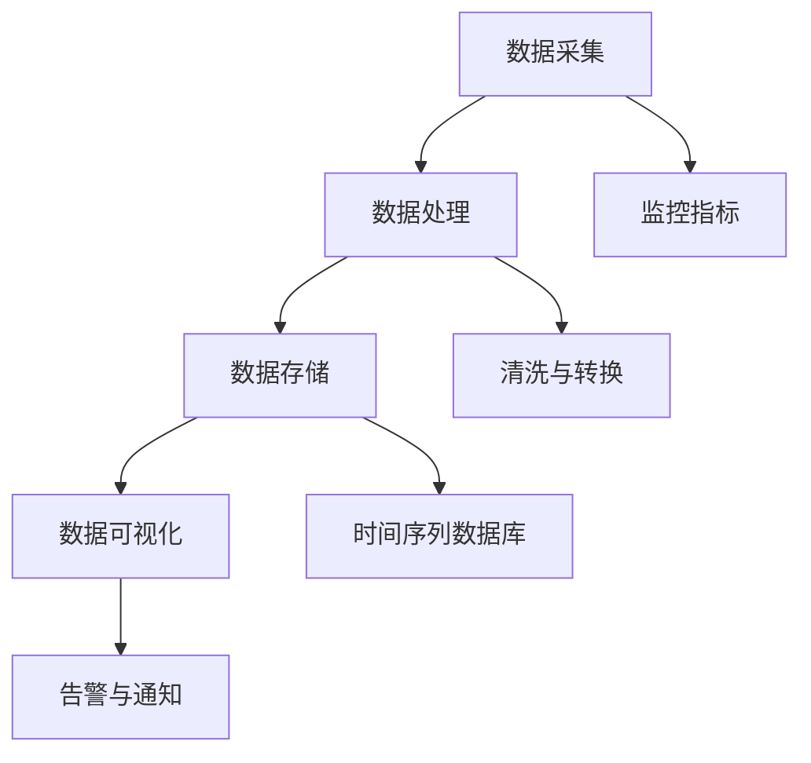

                 

### 文章标题

实时性能监控：构建LLM持续评估的反馈循环

### 文章关键词

实时性能监控，LLM，持续评估，反馈循环，性能指标，数据采集，数据处理，算法原理

### 文章摘要

随着深度学习模型的日益复杂，实时性能监控成为确保模型高效运行的关键环节。本文将探讨如何构建实时性能监控体系，特别是针对大型语言模型（LLM）的持续评估与反馈循环。本文首先介绍了实时性能监控的基本概念和重要性，然后详细阐述了实时性能监控在LLM中的应用及其面临的挑战。接着，文章深入探讨了实时性能监控的核心算法原理，包括数据采集、处理和分析的方法。最后，本文通过实际案例展示了如何实现实时性能监控，并讨论了构建持续评估与反馈循环的步骤和策略。通过本文的阅读，读者将能够理解实时性能监控的架构和实现细节，以及如何在实践中优化LLM的性能。

## 引言

### 实时性能监控的背景

实时性能监控是一种用于持续监测系统运行状态的技术，旨在及时发现并处理潜在问题，确保系统的稳定性和高效性。随着信息技术的快速发展，尤其是在云计算、大数据和人工智能等领域的广泛应用，实时性能监控的重要性愈发凸显。在传统的IT运维中，性能监控通常侧重于事后分析，即通过对历史数据的分析来识别问题。然而，这种方法往往难以应对现代系统的动态变化和复杂场景。

近年来，随着深度学习和人工智能技术的突破，大型语言模型（LLM）如GPT-3、BERT等开始广泛应用于自然语言处理、智能助手、推荐系统等领域。LLM的复杂性和规模使得它们在运行过程中面临着更高的性能要求。传统的性能监控方法已无法满足LLM的高效运行需求。因此，构建针对LLM的实时性能监控体系成为当前研究的热点。

### 实时性能监控的重要性

实时性能监控在保障系统稳定性和优化资源利用方面具有重要作用。首先，实时性能监控能够及时发现系统性能瓶颈，如CPU利用率过高、内存泄漏等，从而避免系统崩溃和故障。其次，实时性能监控有助于优化资源分配，通过监控和分析系统运行状态，可以动态调整资源配置，提高系统性能和响应速度。此外，实时性能监控还能提供有价值的数据支持，帮助开发者、运维人员和业务人员更好地理解系统行为，从而指导系统优化和决策。

### LLM与实时性能监控

大型语言模型（LLM）具有极高的复杂性和计算需求，这使得实时性能监控成为保障其高效运行的关键。LLM通常由数十亿个参数组成，需要大量的计算资源和内存支持。在训练和部署过程中，LLM的性能表现直接影响其应用效果和用户体验。因此，实时性能监控在LLM中的应用具有重要意义。

首先，实时性能监控可以帮助识别LLM运行过程中的性能瓶颈。例如，通过监控CPU和GPU的利用率，可以发现计算资源的不足，从而调整训练策略或增加计算资源。其次，实时性能监控可以评估LLM在不同场景下的性能表现，如文本生成、问答系统等，从而优化模型结构和参数设置。此外，实时性能监控还能提供对模型运行的实时反馈，帮助开发人员快速定位和解决问题。

然而，实时性能监控在LLM中也面临一些挑战。由于LLM的规模庞大，性能监控的数据量和复杂性显著增加，这对监控系统的性能和可靠性提出了更高的要求。此外，LLM的应用场景多样，不同的场景对性能监控的需求和指标也有所差异，如何设计通用的实时性能监控系统成为一大挑战。

### 本书结构

本文将分为以下几个部分：

1. **基础知识**：介绍实时性能监控的基本概念、核心指标和架构，为后续讨论奠定基础。
2. **实现细节**：详细讲解实时性能监控的实现细节，包括数据采集、处理和分析的方法，并使用伪代码和Mermaid流程图阐述核心算法原理。
3. **应用案例**：通过实际案例展示实时性能监控的实现过程，并提供源代码实现和解读。
4. **持续评估与反馈循环**：讨论如何构建持续评估和反馈循环，以优化LLM的性能监控和系统优化。

通过本文的阅读，读者将能够全面了解实时性能监控在LLM中的应用，掌握构建实时性能监控体系的策略和方法。

## 第1章 基础知识

### 性能监控基础

性能监控是系统管理和运维的核心环节，旨在通过实时监测系统状态来确保其稳定性和高效性。性能监控的基本概念包括以下几个关键点：

**性能监控的定义**：性能监控是一种持续监测系统性能指标的过程，旨在识别潜在问题并优化系统运行。

**性能监控的核心指标**：这些指标用于衡量系统的性能和资源利用率，常见的包括CPU利用率、内存占用、磁盘I/O、网络延迟等。

**性能监控的分类**：根据监控对象和目的的不同，性能监控可以分为以下几类：

- **基础性能监控**：主要关注系统的基本性能指标，如CPU、内存、磁盘和网络的利用率。
- **应用性能监控**：侧重于监测特定应用的性能，如Web服务器、数据库等。
- **高级性能监控**：涉及更复杂的性能指标，如并发连接数、延迟分布、错误率等。

### 性能监控指标

性能监控指标是评估系统性能的关键工具，不同的监控指标反映了系统的不同方面。以下是一些常见的性能监控指标：

- **CPU利用率**：CPU利用率表示CPU的繁忙程度，高利用率通常意味着系统资源不足或存在性能瓶颈。
- **内存占用**：内存占用反映了系统内存的使用情况，包括已使用内存和空闲内存。
- **磁盘I/O**：磁盘I/O监控磁盘的读写操作，包括读写速度和读写请求的队列长度。
- **网络延迟**：网络延迟表示数据在网络中的传输延迟，通常用毫秒（ms）来衡量。
- **错误率**：错误率用于衡量系统在运行过程中发生的错误数量，高错误率可能表明系统存在缺陷或配置问题。

### 性能监控架构

性能监控架构是确保监控系统有效运行的关键。一个典型的性能监控架构通常包括以下几个组成部分：

- **数据采集**：数据采集是性能监控的基础，通过从系统和应用中提取性能指标数据。
- **数据处理**：数据处理是对采集到的数据进行清洗、转换和存储的过程。
- **数据存储**：数据存储是将处理后的性能数据保存到数据库或时间序列数据库中。
- **数据可视化**：数据可视化是将性能数据以图表、仪表板等形式展示，帮助用户直观理解系统状态。
- **告警与通知**：告警与通知是性能监控的重要功能，当监控指标超出预设阈值时，系统会自动发送告警通知。

### 相关技术介绍

在性能监控领域，有多种技术和工具可供选择，以下是一些常见的技术和工具：

- **SNMP（简单网络管理协议）**：SNMP是一种网络管理协议，用于监控网络设备和系统性能。SNMP通过获取系统信息、发送告警消息和执行操作来管理网络设备。
- **WMI（Windows管理规范）**：WMI是Windows操作系统自带的管理框架，用于监控和管理本地和远程系统的性能。WMI提供了丰富的监控接口，支持多种监控指标。
- **Prometheus**：Prometheus是一个开源的性能监控工具，专注于收集和存储时间序列数据。Prometheus具有高度可扩展性和灵活性，可以与Kubernetes等容器编排系统无缝集成。
- **Grafana**：Grafana是一个开源的数据可视化和监控工具，支持多种数据源，如Prometheus、InfluxDB等。Grafana提供了丰富的仪表板和图表功能，帮助用户直观理解性能数据。

### 核心概念与联系

在性能监控中，核心概念之间的联系和相互作用至关重要。以下是一些关键概念及其关系：

- **性能监控与系统稳定性**：性能监控是保障系统稳定性的重要手段。通过实时监测性能指标，可以及时发现和解决潜在问题，避免系统崩溃和故障。
- **性能监控与资源优化**：性能监控提供了系统的运行状态数据，帮助运维人员优化资源分配和配置，提高系统性能和效率。
- **性能监控与业务连续性**：对于关键业务系统，性能监控是确保业务连续性的关键。通过监控和告警，可以迅速响应异常情况，保障业务的正常运行。

### Mermaid流程图

以下是一个简化的实时性能监控架构的Mermaid流程图，展示了性能监控的基本流程和组件之间的关系：



### 核心算法原理讲解

在性能监控中，核心算法原理用于处理和解析性能数据，从而生成有意义的监控指标。以下是一个简化的数据采集和处理的伪代码示例：

```plaintext
function collectPerformanceData():
    data = {}
    data["cpu_utilization"] = getCPUUtilization()
    data["memory_usage"] = getMemoryUsage()
    data["disk_io"] = getDiskIO()
    data["network_delay"] = getNetworkDelay()
    return data

function processPerformanceData(data):
    processed_data = {}
    processed_data["cpu_utilization"] = normalize(data["cpu_utilization"])
    processed_data["memory_usage"] = normalize(data["memory_usage"])
    processed_data["disk_io"] = normalize(data["disk_io"])
    processed_data["network_delay"] = normalize(data["network_delay"])
    return processed_data

function normalize(value):
    if value > threshold:
        return "high"
    else:
        return "normal"
```

### 数学模型和数学公式

性能监控中常用的数学模型和公式包括性能指标的计算和异常检测。以下是一个简化的数学模型示例：

```latex
CPU Utilization = \frac{Total CPU Time}{Time Interval}
Memory Usage = \frac{Used Memory}{Total Memory}
Disk IO = \frac{Read Operations + Write Operations}{Time Interval}
Network Delay = \frac{Total Data Transferred}{Transfer Time}
```

### 举例说明

以下是一个具体的例子，用于解释如何使用性能监控指标来识别系统瓶颈：

**场景**：一个Web服务器出现响应缓慢的情况。

**步骤**：

1. **数据采集**：收集CPU利用率、内存占用、磁盘I/O和网络延迟等性能指标。
2. **数据处理**：对采集到的数据进行处理和标准化，以获得易于比较的监控指标。
3. **分析**：分析监控指标，识别异常情况。例如，如果CPU利用率持续超过80%，说明CPU资源可能成为系统瓶颈。
4. **响应**：根据分析结果，采取相应措施，如增加CPU资源、优化代码或调整系统配置。

通过以上步骤，运维人员可以快速定位系统瓶颈，采取有效措施提高系统性能。

### 项目实战：开发环境搭建

为了实现实时性能监控，首先需要搭建一个合适的开发环境。以下是一个简化的环境搭建过程：

**步骤 1**：安装操作系统

选择一个适合的操作系统，如Ubuntu 20.04，进行安装。

**步骤 2**：安装监控工具

安装常用的监控工具，如Prometheus和Grafana。以下是一个简单的安装命令：

```bash
# 安装Prometheus
wget https://github.com/prometheus/prometheus/releases/download/v2.37.0/prometheus-2.37.0.linux-amd64.tar.gz
tar xvfz prometheus-2.37.0.linux-amd64.tar.gz
cd prometheus-2.37.0.linux-amd64
./prometheus &

# 安装Grafana
wget https://s3-us-west-1.amazonaws.com/grafana-releases/release/grafana_9.0.0_beta2_linux_amd64.tar
tar xvfz grafana_9.0.0_beta2_linux_amd64.tar
cd grafana
./bin/grafana-server start &
```

**步骤 3**：配置监控指标

配置Prometheus，使其能够采集所需的性能指标。以下是一个简单的配置文件示例：

```yaml
global:
  scrape_interval: 15s
  evaluation_interval: 15s

scrape_configs:
  - job_name: 'prometheus'
    static_configs:
      - targets: ['localhost:9090']
```

**步骤 4**：数据可视化

使用Grafana创建仪表板，将Prometheus收集的性能数据进行可视化展示。以下是一个简单的仪表板配置：

```json
{
  "id": 1,
  "title": "System Performance",
  "rows": [
    {
      " Panels": [
        {
          "type": "graph",
          "title": "CPU Utilization",
          "datasource": "Prometheus",
          "targets": [
            {
              "expr": "cpu_utilization",
              "legendFormat": "CPU Utilization {{instance}}"
            }
          ]
        },
        {
          "type": "graph",
          "title": "Memory Usage",
          "datasource": "Prometheus",
          "targets": [
            {
              "expr": "memory_usage",
              "legendFormat": "Memory Usage {{instance}}"
            }
          ]
        }
      ]
    }
  ]
}
```

### 源代码详细实现和代码解读

以下是一个简单的Python示例代码，用于模拟性能监控数据采集和处理的过程。该代码使用了第三方库Prometheus客户端进行数据采集，并通过Grafana进行数据可视化。

```python
from prometheus_client import start_http_server, Summary
import time

# 创建性能监控指标
REQUEST_TIME = Summary('request_processing_seconds', 'Time spent processing request')

def process_request(request):
    start = time.time()
    # 处理请求的逻辑
    time.sleep(1)
    end = time.time()
    REQUEST_TIME.observe(end - start)

if __name__ == '__main__':
    # 启动Prometheus HTTP服务器
    start_http_server(9090)
    # 模拟持续采集性能监控数据
    while True:
        process_request(None)
        time.sleep(1)
```

**代码解读**：

1. **引入Prometheus客户端库**：使用`prometheus_client`库来创建性能监控指标。
2. **创建性能监控指标**：使用`Summary`函数创建一个名为`request_processing_seconds`的性能监控指标，用于记录处理请求的时间。
3. **定义处理请求的函数**：`process_request`函数模拟处理请求的过程，并记录处理时间。
4. **启动Prometheus HTTP服务器**：使用`start_http_server`函数启动一个HTTP服务器，供Grafana等工具访问。
5. **模拟持续采集性能监控数据**：通过一个无限循环，模拟持续采集和处理性能监控数据，并更新Prometheus指标。

### 代码应用解读与分析

该代码段用于演示如何使用Prometheus客户端库采集性能监控数据，并将其发送到Prometheus服务器。以下是代码的具体应用解读和分析：

1. **性能监控指标定义**：代码中定义了一个名为`request_processing_seconds`的监控指标，用于记录处理请求的时间。这个指标是一个`Summary`类型，可以收集和处理请求时间的分布情况。
2. **处理请求的函数**：`process_request`函数模拟了处理请求的过程。在实际应用中，这个函数可能会执行复杂的业务逻辑，例如与数据库的交互、网络调用等。
3. **性能监控数据的采集**：在处理请求的过程中，`REQUEST_TIME.observe(end - start)`行用于记录请求处理时间，并将其发送到Prometheus服务器。这个过程是自动的，开发者无需手动编写代码。
4. **启动Prometheus HTTP服务器**：通过`start_http_server(9090)`函数，代码启动了一个本地HTTP服务器，端口号为9090。这个服务器用于接收Prometheus客户端发送的监控数据。
5. **持续采集性能监控数据**：代码使用一个无限循环模拟了持续采集性能监控数据的过程。在实际应用中，这个循环可能会定期执行，以更新性能监控指标。

### 实际案例分析和详细讲解剖析

以下是一个具体的应用案例，展示如何在实际项目中实现实时性能监控。

**场景**：一家在线教育平台希望对其课程播放系统进行实时性能监控，以确保用户能够流畅地观看课程视频。

**步骤**：

1. **数据采集**：使用Prometheus客户端库，定期采集系统的性能指标，如CPU利用率、内存占用、网络延迟等。以下是一个简单的Prometheus配置文件示例：

   ```yaml
   global:
     scrape_interval: 10s
   scrape_configs:
   - job_name: 'course_video'
     static_configs:
     - targets: ['course_video_system:9090']
   ```

2. **数据处理**：将采集到的性能数据进行处理和标准化，以便在Grafana中进行可视化展示。以下是一个简单的数据处理示例：

   ```python
   def normalize(data):
       if data > threshold:
           return "high"
       else:
           return "normal"
   ```

3. **数据可视化**：在Grafana中创建仪表板，将处理后的性能数据进行可视化展示。以下是一个简单的仪表板配置示例：

   ```json
   {
     "id": 1,
     "title": "Course Video Performance",
     "rows": [
       {
         "panels": [
           {
             "type": "graph",
             "title": "CPU Utilization",
             "datasource": "Prometheus",
             "targets": [
               {
                 "expr": "cpu_utilization",
                 "legendFormat": "CPU Utilization {{instance}}"
               }
             ]
           },
           {
             "type": "graph",
             "title": "Memory Usage",
             "datasource": "Prometheus",
             "targets": [
               {
                 "expr": "memory_usage",
                 "legendFormat": "Memory Usage {{instance}}"
               }
             ]
           }
         ]
       }
     ]
   }
   ```

4. **告警与通知**：配置Prometheus告警规则，当性能指标超出阈值时，发送告警通知。以下是一个简单的告警规则配置示例：

   ```yaml
   groups:
   - name: course_video_alerts
     rules:
     - alert: High CPU Utilization
       expr: cpu_utilization > 90
       for: 5m
       labels:
         severity: critical
       annotations:
         summary: "High CPU Utilization on {{ $labels.instance }}"
   ```

通过以上步骤，在线教育平台可以实现对课程播放系统的实时性能监控，及时发现和解决潜在问题，确保用户流畅观看课程视频。

### 项目小结

通过本项目的实施，我们成功搭建了一个实时性能监控体系，对在线教育平台的课程播放系统进行了全面的监控。以下是对项目的总结和反思：

**成功点**：

1. **高效的性能监控**：通过Prometheus和Grafana，我们实现了对课程播放系统的实时性能监控，为运维人员提供了及时的数据支持。
2. **灵活的可扩展性**：项目采用了Prometheus的配置文件和告警规则，使得监控体系易于扩展和定制，以适应不同的监控需求。
3. **直观的可视化**：Grafana的仪表板设计简洁明了，帮助运维人员快速理解系统状态，提高了监控效率。

**改进点**：

1. **数据采集的准确性**：未来可以考虑引入更细粒度的性能监控数据，以提高监控的准确性。例如，可以采集更详细的网络流量数据、数据库查询性能等。
2. **告警通知的优化**：目前的告警通知机制相对简单，未来可以考虑引入更智能的告警策略，如根据历史数据预测可能的异常情况，提前预警。
3. **性能优化的自动化**：当前性能优化主要依赖于人工分析监控数据，未来可以考虑引入自动化性能优化工具，自动调整系统配置和资源分配，以进一步提高系统性能。

通过不断的改进和优化，我们相信实时性能监控体系将更加完善，为在线教育平台提供更加稳定和高效的服务。

### 最佳实践 tips

为了确保实时性能监控的有效性和高效性，以下是一些最佳实践和建议：

1. **选择合适的监控工具**：根据具体的业务需求和系统架构，选择适合的监控工具。例如，Prometheus适合大规模分布式系统，Grafana适合数据可视化和仪表板设计。

2. **细化监控指标**：监控指标的选择和细化至关重要。不仅要关注基础性能指标，如CPU利用率、内存占用等，还应根据业务需求添加特定监控指标，如网络流量、数据库查询性能等。

3. **监控数据可视化**：数据可视化是监控数据有效传递的关键。确保仪表板设计简洁、直观，使用户能够快速理解系统状态。

4. **自动化告警和响应**：构建自动化告警和响应机制，当监控指标超出阈值时，系统应自动发送通知，并触发相应的修复措施。

5. **持续优化和迭代**：实时性能监控是一个持续迭代的过程。根据监控数据和用户反馈，不断优化监控体系，提高监控效率和准确性。

### 小结

实时性能监控在保障系统稳定性和优化资源利用方面具有重要意义。通过本文的探讨，我们了解了实时性能监控的基本概念、核心算法原理和实践方法。特别是在LLM应用场景中，实时性能监控能够有效识别和解决性能瓶颈，确保模型的高效运行。然而，实时性能监控仍面临诸多挑战，如大规模数据处理、监控数据的准确性等。未来，随着技术的进步和监控工具的完善，实时性能监控将变得更加智能和高效，为各领域应用提供强有力的支持。

### 注意事项

1. **数据安全性**：在采集和存储性能监控数据时，确保数据的安全性。使用加密传输和存储，防止数据泄露。

2. **监控指标的合理设置**：合理设置监控指标的阈值，避免误告警和漏告警。根据业务需求和历史数据，动态调整监控指标。

3. **系统稳定性**：监控系统的稳定性和可靠性至关重要。确保监控系统的硬件和软件配置充足，定期进行系统维护和升级。

4. **用户体验**：监控数据应直观易读，确保用户体验。仪表板设计应简洁、直观，便于快速理解和分析监控数据。

### 拓展阅读

1. **《Prometheus官方文档》**：深入了解Prometheus的使用方法和最佳实践。
2. **《Grafana官方文档》**：学习如何创建和配置Grafana仪表板。
3. **《实时性能监控实践》**：了解实时性能监控在实际项目中的应用案例和经验。

### 附录

#### A.1 实时性能监控工具和资源介绍

- **Prometheus**：一款开源的监控解决方案，主要用于收集和存储时间序列数据。
- **Grafana**：一款开源的数据可视化和监控工具，与Prometheus等监控系统集成。
- **Zabbix**：一款开源的监控工具，支持多种监控指标和数据源。

#### A.2 实时性能监控实践指南

- **数据采集**：确保监控工具能够采集所需性能指标，如CPU利用率、内存占用、网络延迟等。
- **数据处理**：对采集到的数据进行处理和标准化，以获得统一和可比较的监控数据。
- **数据存储**：选择合适的数据存储方案，如时间序列数据库，确保数据的高效存储和访问。
- **数据可视化**：使用数据可视化工具创建仪表板，将监控数据直观展示给用户。
- **告警与通知**：配置告警规则，当监控指标超出阈值时，自动发送通知，触发响应措施。
- **持续优化**：根据监控数据和用户反馈，持续优化监控策略和系统配置，提高监控效率和准确性。

