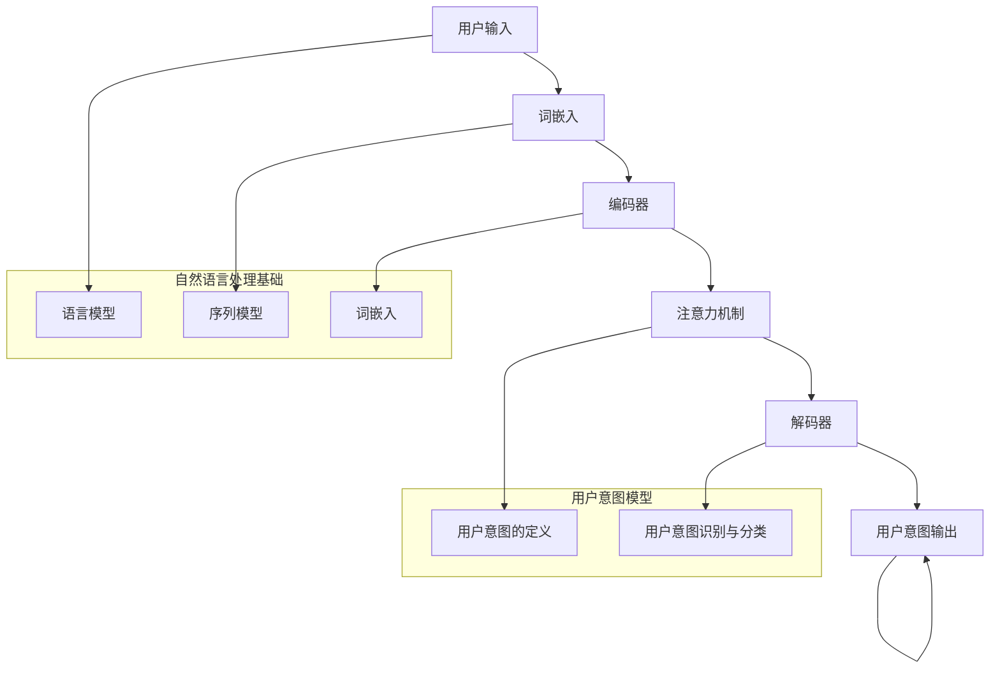
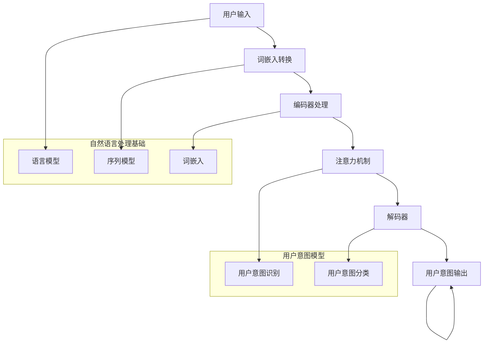
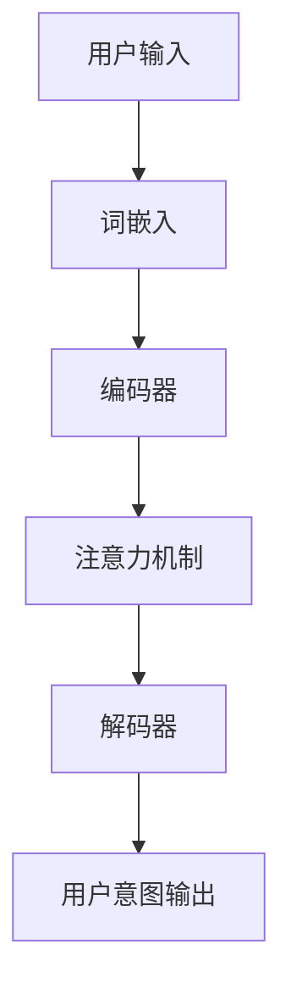

                 

### 文章标题：实时用户意图理解能力：LLM设计的交互测试

#### 关键词：实时用户意图理解、LLM、交互测试、自然语言处理、序列模型、注意力机制

> 摘要：本文探讨了实时用户意图理解在人工智能（AI）领域的应用，特别关注大型语言模型（LLM）在交互测试中的作用。文章首先介绍了用户意图理解的重要性，随后详细解析了实时用户意图理解的挑战、核心概念与联系、核心算法原理以及交互测试设计。最后，通过一个实际项目案例展示了如何实现实时用户意图理解系统，并进行了详细的代码解读与分析。

---

## 引言

在当今快速发展的AI时代，用户与智能系统之间的交互变得越来越频繁。这种交互不仅仅是简单的信息查询，更涉及到复杂的需求理解、情感分析和决策支持。为了满足这些需求，实时用户意图理解成为AI系统中不可或缺的一部分。而大型语言模型（LLM）作为当前自然语言处理（NLP）领域的核心技术，其在实时用户意图理解中的应用日益受到关注。

本文旨在探讨实时用户意图理解能力在LLM设计中的重要性，并详细分析LLM在交互测试中的关键作用。文章将从以下几个方面展开：

1. **用户意图理解的概述**：介绍用户意图理解的重要性及其在AI领域的应用。
2. **实时用户意图理解的挑战**：分析实时性、用户意图模型复杂性和数据质量处理效率等方面的挑战。
3. **核心概念与联系**：讲解自然语言处理基础和用户意图模型的原理，并展示相关的流程图。
4. **核心算法原理**：详细阐述序列模型、注意力机制以及Transformer模型的工作原理，并提供伪代码示例。
5. **交互测试设计**：介绍交互测试的概念、设计方法及其评价指标。
6. **项目实战**：通过一个实时用户意图理解系统的实现案例，展示整个开发流程和代码解读。
7. **案例分析与优化**：对典型案例分析，并提出系统优化策略和未来发展方向。

通过以上内容的逐步解析，本文希望能够为读者提供一个全面而深入的理解，帮助其在实际应用中提升实时用户意图理解能力。

## 用户意图理解的概述

### 用户意图理解的重要性

用户意图理解是智能系统与用户交互的核心，其重要性不容忽视。首先，准确理解用户的意图是提供个性化服务的关键。例如，在智能客服系统中，通过理解用户的询问意图，系统能够自动匹配相关的解决方案，提高问题解决的效率和准确性。其次，用户意图理解有助于提升用户体验。当系统能够预测并满足用户的潜在需求时，用户会感到更加满意和愉悦。此外，用户意图理解在智能推荐系统、智能语音助手等领域也有着广泛的应用。通过深入理解用户的行为和兴趣，系统能够提供更加精准的推荐，从而提高用户的参与度和满意度。

### 用户意图理解在AI领域的应用

用户意图理解在AI领域的应用越来越广泛，已经成为许多智能系统的重要组成部分。以下是几个典型的应用场景：

1. **智能客服系统**：智能客服系统能够自动分析用户的提问，理解其意图，并给出合适的回答。通过用户意图理解，客服系统能够实现24/7的全天候服务，提高工作效率和客户满意度。

2. **智能推荐系统**：在电子商务、社交媒体等平台上，智能推荐系统能够根据用户的浏览和购买历史，理解其兴趣和需求，提供个性化的商品推荐。用户意图理解技术使得推荐结果更加精准，提高了用户的购买意愿和平台的收益。

3. **智能语音助手**：智能语音助手如Siri、Alexa等，通过理解用户的语音指令，能够完成各种任务，如发送短信、设置提醒、播放音乐等。用户意图理解的准确性直接影响语音助手的用户体验和实用性。

4. **智能翻译系统**：智能翻译系统能够理解不同语言之间的语义差异，提供准确和自然的翻译结果。通过用户意图理解，翻译系统可以更好地处理特定的语境和表达方式，提高翻译的准确性和流畅性。

总之，用户意图理解在AI领域的应用具有广泛的前景，不仅能够提升系统的智能化水平，还能够为用户提供更加便捷和高效的服务。

### 实时用户意图理解的挑战

实时用户意图理解在AI领域中具有极高的挑战性，主要原因包括以下几个方面：

#### 实时性的要求

实时性是实时用户意图理解的首要要求。用户在交互过程中往往希望立即获得系统的响应，特别是在紧急情况下，如医疗咨询、交通导航等，延迟响应可能导致严重后果。因此，系统必须在极短的时间内完成用户意图的识别和响应。然而，这要求模型具有高度的效率和准确性，在处理大量并发请求时不会出现性能瓶颈。

#### 复杂的用户意图模型

用户意图通常非常复杂，可能涉及多个层次和维度。例如，一个简单的查询“附近有哪些餐厅？”不仅包含地点信息，还可能涉及用户对餐厅类型、价格、评价等多方面的需求。此外，用户的表达方式可能多种多样，包括自然语言、语音、图像等多种形式，进一步增加了理解难度。这要求系统具备强大的语义理解和多模态数据处理能力。

#### 数据质量和处理效率

实时用户意图理解依赖于高质量的数据，但数据往往存在噪声、不完整和偏差等问题，这对模型的训练和预测效果有较大影响。同时，随着用户量和交互量的增加，数据处理和模型更新的效率成为关键挑战。系统需要能够快速处理海量数据，并在不断变化的用户环境中进行自适应调整。

### 案例分析

以下是一个具体的案例分析，展示了在实时用户意图理解过程中遇到的挑战及其解决方法。

#### 案例背景

某大型电商平台的智能客服系统在上线初期，面临着用户满意度低、响应速度慢的问题。用户在咨询商品信息、售后服务等常见问题时，经常需要等待数分钟才能得到回答，导致用户体验不佳。公司决定通过引入实时用户意图理解技术来提升系统的响应速度和满意度。

#### 遇到的挑战

1. **实时性挑战**：平台每天处理数百万次用户咨询，如何在极短的时间内识别并响应每个用户的需求成为关键问题。由于系统并发量高，传统的批处理模型难以满足实时性要求。

2. **复杂意图模型**：用户的咨询内容多样且复杂，涉及商品信息、订单状态、售后服务等多个方面。简单分词和规则匹配的方法无法准确理解用户的意图，导致响应不准确。

3. **数据质量挑战**：平台积累的海量用户数据存在噪声、缺失和不一致的问题，这对模型的训练和预测效果有较大影响。

#### 解决方法

1. **引入大型语言模型**：公司决定引入大型预训练语言模型，如GPT-3，以提升系统的语义理解能力。通过训练和优化，模型能够更好地捕捉用户意图的多层次信息。

2. **优化数据处理流程**：为了提高数据质量，公司对用户数据进行清洗、去噪和标准化处理。同时，引入分布式计算技术，提升数据处理的效率和准确性。

3. **动态调整模型参数**：通过实时监测用户交互数据，动态调整模型的参数，以适应不断变化的用户需求。例如，根据用户的反馈和历史行为，自动调整响应策略，提高用户满意度。

#### 案例效果

经过优化，智能客服系统的响应速度显著提升，用户满意度也大幅提高。通过实时用户意图理解技术，系统能够更准确地理解用户的需求，提供个性化的服务，从而提升了整体用户体验。

综上所述，实时用户意图理解在AI领域中面临诸多挑战，但通过引入先进的技术和方法，可以有效应对这些挑战，提升系统的智能化水平和用户体验。

### 核心概念与联系

在深入探讨实时用户意图理解能力之前，我们需要理解一些核心概念及其相互之间的联系。这些概念包括自然语言处理（NLP）的基础和用户意图模型。

#### 自然语言处理基础

自然语言处理是人工智能领域的一个重要分支，旨在使计算机能够理解和生成人类语言。以下是NLP中的一些核心概念：

1. **语言模型**：语言模型是一种统计模型，用于预测一段文本的下一个词或序列。最著名的语言模型之一是Word2Vec，它通过将单词映射到高维向量空间来实现。另一个重要的语言模型是Transformer，它通过自注意力机制实现了更加高效的文本处理。

2. **词嵌入**：词嵌入是将单词映射到固定维度的向量表示，使计算机能够通过向量运算处理自然语言。常见的词嵌入技术包括Word2Vec、GloVe和BERT等。词嵌入技术在NLP中至关重要，因为它们使计算机能够捕捉单词之间的语义关系。

3. **序列模型**：序列模型用于处理按时间顺序排列的数据，如文本。循环神经网络（RNN）和长短时记忆网络（LSTM）是两种常用的序列模型，它们能够捕捉序列中的长期依赖关系。

#### 用户意图模型

用户意图模型是指识别和理解用户需求或意图的方法。以下是用户意图模型的一些关键概念：

1. **用户意图的定义**：用户意图是指用户在特定场景下想要实现的目标或需求。例如，在电商平台上，用户意图可能包括购买商品、查询订单状态、了解商品信息等。

2. **用户意图识别与分类**：用户意图识别是指从用户输入中识别出其意图。用户意图分类是将识别出的意图分类到预定义的类别中。传统的意图识别方法包括基于规则的方法和机器学习方法。基于深度学习的意图识别方法，如卷积神经网络（CNN）和长短期记忆网络（LSTM），在处理复杂意图方面表现出色。

#### 流程图与核心概念关系

以下是自然语言处理基础和用户意图模型之间的流程图，展示了它们之间的核心联系：



在这个流程图中，用户输入首先通过词嵌入转换为向量表示，然后通过编码器处理，接着使用注意力机制捕捉文本中的重要信息。最后，解码器将这些信息转化为用户意图的输出。自然语言处理基础和用户意图模型共同构成了实时用户意图理解的核心框架。

#### Mermaid流程图

以下是一个使用Mermaid绘制的流程图，展示了用户意图理解的完整流程：



#### 数学模型与算法伪代码

1. **词嵌入训练伪代码**：

```
// 输入：词表V，单词序列X，目标序列Y
// 输出：词嵌入向量矩阵W

for each word w in V do
    // 初始化词嵌入向量
    W[w] = [rand(), rand(), ..., rand()]

// 训练过程
for each sentence (x, y) in X do
    for each word w in x do
        // 计算单词的词嵌入向量
        embed_w = W[w]
        
        // 计算损失函数
        loss += -log(p(y|embed_w))
        
        // 更新词嵌入向量
        W[w] = W[w] - learning_rate * gradient(W[w])

return W
```

2. **用户意图识别概率公式**：

$$
\text{用户意图识别概率} = \frac{e^{\text{输出层激活值}}}{1 + e^{\text{输出层激活值}}}
$$

通过上述核心概念和流程图的介绍，我们可以看到自然语言处理基础和用户意图模型在实时用户意图理解中的关键作用。这些概念和方法为我们构建高效的实时用户意图理解系统提供了坚实的基础。

### 序列模型与循环神经网络

在实时用户意图理解中，序列模型是一种重要的工具，用于处理和分析按时间顺序排列的数据，如文本。循环神经网络（RNN）是典型的序列模型之一，它能够捕捉序列中的长期依赖关系。RNN通过其独特的结构，使其在处理序列数据时表现出色。

#### 序列模型的基本原理

序列模型是一类用于处理序列数据的神经网络模型，其核心思想是将前一时刻的信息传递到当前时刻，从而实现对整个序列的建模。RNN是这类模型中最基本的一种，其结构可以简化为一个带有循环路径的神经网络：

```
  输入 X_t
       ↓
  隐藏层 h_t
       ↓
  输出 Y_t
```

在RNN中，每个时间步的隐藏状态\( h_t \)都会影响下一个时间步的输出\( Y_t \)。具体来说，RNN通过以下公式进行计算：

$$
h_t = \sigma(W_h \cdot [h_{t-1}, X_t] + b_h)
$$

$$
Y_t = \sigma(W_y \cdot h_t + b_y)
$$

其中，\( \sigma \)是激活函数，如Sigmoid或Tanh；\( W_h \)和\( W_y \)是权重矩阵，\( b_h \)和\( b_y \)是偏置项。

#### 常见的序列模型

除了RNN，还有一些其他常见的序列模型，如长短期记忆网络（LSTM）和门控循环单元（GRU）。这些模型都是为了解决RNN在处理长序列数据时出现的梯度消失或爆炸问题。

1. **LSTM**：LSTM通过引入三个门（输入门、遗忘门和输出门）来控制信息的流动。这些门能够有效地控制信息的输入和遗忘，从而解决RNN的梯度消失问题。

   - 输入门：决定哪些信息需要更新到记忆单元中。
   - 遗忘门：决定哪些信息需要从记忆单元中遗忘。
   - 输出门：决定哪些信息需要输出。

   LSTM的公式如下：

   $$
   i_t = \sigma(W_i \cdot [h_{t-1}, X_t] + b_i)
   $$

   $$
   f_t = \sigma(W_f \cdot [h_{t-1}, X_t] + b_f)
   $$

   $$
   o_t = \sigma(W_o \cdot [h_{t-1}, X_t] + b_o)
   $$

   $$ 
   C_t = f_t \odot C_{t-1} + i_t \odot \sigma(W_c \cdot [h_{t-1}, X_t] + b_c)
   $$

   $$ 
   h_t = o_t \odot \sigma(C_t)
   $$

2. **GRU**：GRU是LSTM的简化版本，它通过合并输入门和遗忘门，并将记忆单元简化为单一的门结构。GRU的公式如下：

   $$
   z_t = \sigma(W_z \cdot [h_{t-1}, X_t] + b_z)
   $$

   $$
   r_t = \sigma(W_r \cdot [h_{t-1}, X_t] + b_r)
   $$

   $$
   h_t = (1 - z_t) \odot h_{t-1} + z_t \odot \sigma(W_h \cdot [r_t \cdot h_{t-1}, X_t] + b_h)
   $$

#### 应用场景

RNN、LSTM和GRU在实时用户意图理解中有着广泛的应用。以下是一些具体的应用场景：

1. **用户意图识别**：通过捕捉用户输入的序列特征，RNN、LSTM和GRU能够有效识别用户的意图。例如，在智能客服系统中，这些模型可以分析用户的提问序列，识别其意图并给出合适的回答。

2. **情感分析**：用户情感通常可以通过其语言表达来识别。RNN、LSTM和GRU能够捕捉文本中的情感信息，帮助系统理解用户的情绪状态。

3. **文本生成**：这些模型可以用于生成文本，如生成对话、新闻报道等。通过训练大量文本数据，模型能够学会生成符合语法和语义规则的文本。

#### 伪代码示例

以下是LSTM的伪代码示例，展示了其训练过程：

```
// 输入：单词序列X，标签序列Y
// 输出：LSTM模型的权重矩阵

// 初始化权重矩阵
W_i, b_i = randn(n_i, d_h)
W_f, b_f = randn(n_f, d_h)
W_o, b_o = randn(n_o, d_h)
W_c, b_c = randn(n_c, d_h)
W_h, b_h = randn(n_h, d_h)
W_y, b_y = randn(n_y, d_h)

// 初始化隐藏状态和细胞状态
h_0 = zeros((batch_size, d_h))
C_0 = zeros((batch_size, d_h))

// 训练过程
for epoch in 1 to num_epochs do
    for each mini-batch (x, y) in X, Y do
        // 前向传播
        for each time step t in x do
            i_t = sigmoid(W_i * [h_{t-1}, x_t] + b_i)
            f_t = sigmoid(W_f * [h_{t-1}, x_t] + b_f)
            o_t = sigmoid(W_o * [h_{t-1}, x_t] + b_o)
            C_t = f_t .* C_{t-1} + i_t .* sigmoid(W_c * [h_{t-1}, x_t] + b_c)
            h_t = o_t .* sigmoid(C_t)
        
        // 计算损失
        loss = ce_loss(y, h_t)
        
        // 反向传播
        dC_t = (y - h_t) * sigmoid(h_t)
        dC_t = (1 - o_t) .* dC_t
        
        dh_t = dC_t .* (1 - sigmoid(h_t))
        dh_t = (1 - o_t) .* dh_t
        
        dC_{t-1} = f_t .* dC_t
        df_t = dC_t .* (1 - sigmoid(C_{t-1}))
        di_t = dC_t .* (1 - sigmoid(C_{t-1}))
        
        dW_i, db_i = gradient(W_i, b_i, i_t)
        dW_f, db_f = gradient(W_f, b_f, f_t)
        dW_o, db_o = gradient(W_o, b_o, o_t)
        dW_c, db_c = gradient(W_c, b_c, C_t)
        dW_h, db_h = gradient(W_h, b_h, h_t)
        dW_y, db_y = gradient(W_y, b_y, h_t)
    end
end

return W_i, W_f, W_o, W_c, W_h, W_y
```

通过以上对序列模型和循环神经网络的详细阐述，我们可以看到这些模型在实时用户意图理解中的重要性。它们不仅能够捕捉文本的序列特征，还能够通过复杂的结构解决梯度消失和爆炸问题，从而为实时用户意图理解提供了强大的工具。

### 注意力机制与Transformer模型

注意力机制是一种在序列模型中广泛应用的技术，它通过动态地分配不同的关注权重，使模型能够聚焦于序列中的关键信息。注意力机制的引入大大提升了序列模型的性能，特别是在自然语言处理任务中。而Transformer模型则是基于注意力机制的一种新型序列模型，其通过自注意力机制实现了高效的文本处理，并在许多NLP任务中取得了显著的成果。

#### 注意力机制的概念

注意力机制最初由神经机器翻译系统提出，旨在解决序列到序列（Seq2Seq）任务中的长距离依赖问题。注意力机制的核心思想是，在处理序列数据时，模型能够根据当前时刻的输入信息，动态地调整对历史时刻信息的关注程度。具体来说，注意力机制通过计算一个注意力分数，用于加权历史时刻的隐藏状态，从而使得模型能够聚焦于对当前任务最为重要的信息。

注意力机制的基本公式可以表示为：

$$
a_t = \text{Attention}(Q, K, V)
$$

其中，\( Q \)表示查询向量，\( K \)表示关键向量，\( V \)表示值向量。常见的注意力机制包括点积注意力、多头注意力等。

1. **点积注意力**：点积注意力是最简单的一种注意力机制，计算公式为：

   $$
   a_{ij} = \frac{Q_i K_j}{\sqrt{d_k}}
   $$

   其中，\( d_k \)是关键向量的维度。点积注意力通过计算查询向量和关键向量的点积来获得注意力分数，具有计算简单、易于实现的特点。

2. **多头注意力**：多头注意力是在点积注意力基础上的一种扩展，通过将输入序列拆分为多个子序列，并分别计算注意力分数，从而增强了模型的表达能力。多头注意力的公式为：

   $$
   a_{ij} = \text{softmax}\left(\frac{Q_i W_K K_j}{\sqrt{d_k}}\right)
   $$

   其中，\( W_K \)是权重矩阵，用于将输入序列映射到关键空间。

#### 注意力机制在序列模型中的应用

注意力机制在序列模型中的应用主要分为两类：自注意力（Self-Attention）和互注意力（Cross-Attention）。

1. **自注意力**：自注意力是指模型在同一个序列内部计算注意力权重。自注意力机制通过将序列中的每个元素作为查询向量、关键向量和值向量，从而实现了对序列内部信息的动态关注。自注意力机制广泛应用于Transformer模型，使其在处理长序列数据时表现出色。

2. **互注意力**：互注意力是指模型在两个不同的序列之间计算注意力权重。互注意力机制常用于序列到序列任务，如机器翻译，其中输入序列和输出序列之间需要相互依赖。互注意力机制通过计算输入序列和输出序列的查询向量和关键向量之间的点积，从而实现了序列之间的动态交互。

#### Transformer模型概述

Transformer模型是由Google在2017年提出的一种新型序列模型，其核心思想是利用自注意力机制来处理序列数据。Transformer模型通过取消传统循环神经网络（RNN）中的循环结构，采用自注意力机制和多头注意力机制，实现了更加高效和灵活的文本处理。

1. **Transformer模型的架构**：Transformer模型主要由编码器（Encoder）和解码器（Decoder）两部分组成。编码器负责将输入序列编码为固定长度的向量表示，解码器则根据编码器的输出生成输出序列。

   - **编码器**：编码器由多个编码层（Encoder Layer）堆叠而成，每个编码层包括两个子层：多头自注意力层（Multi-Head Self-Attention Layer）和前馈神经网络层（Feed-Forward Neural Network Layer）。多头自注意力层通过计算输入序列的注意力分数，实现对序列内部信息的动态关注；前馈神经网络层则通过简单的全连接层实现非线性变换。

   - **解码器**：解码器同样由多个解码层（Decoder Layer）堆叠而成，每个解码层包括两个子层：多头互注意力层（Multi-Head Cross-Attention Layer）和前馈神经网络层。多头互注意力层通过计算输入序列和编码器输出之间的注意力分数，实现对输入和输出序列的动态交互；前馈神经网络层同样实现非线性变换。

2. **Transformer模型的优点与应用场景**：Transformer模型具有以下优点：

   - **并行计算**：由于取消循环结构，Transformer模型可以采用并行计算，从而显著提高了训练和推理的速度。
   - **长距离依赖**：自注意力机制能够捕捉长距离依赖关系，使模型在处理长序列数据时表现出色。
   - **灵活扩展**：通过引入多头注意力机制，Transformer模型可以灵活地调整注意力权重，从而适应不同的任务需求。

   Transformer模型广泛应用于多种自然语言处理任务，包括机器翻译、文本生成、问答系统等。以下是一些具体的应用场景：

   - **机器翻译**：Transformer模型在机器翻译任务中表现出色，例如在Google的神经机器翻译系统中取代了传统的循环神经网络。
   - **文本生成**：Transformer模型可以用于生成文章、对话、摘要等文本，具有强大的表达能力和创造力。
   - **问答系统**：Transformer模型可以用于构建问答系统，通过理解问题和上下文，生成准确的答案。

#### Transformer模型的应用示例

以下是一个简单的Transformer模型应用示例，展示了如何使用自注意力机制和多头注意力机制处理输入序列。

```python
import tensorflow as tf
from tensorflow.keras.layers import Embedding, MultiHeadAttention, Dense

# 定义编码器层
def encoder_layer(inputs, hidden_size, num_heads):
    # 多头自注意力层
    attention = MultiHeadAttention(num_heads=num_heads, key_dim=hidden_size)(inputs, inputs)
    # 前馈神经网络层
    output = Dense(hidden_size, activation='relu')(tf.keras.layers.Concatenate(axis=-1)([attention, inputs]))
    return output

# 定义解码器层
def decoder_layer(inputs, encoded_inputs, hidden_size, num_heads):
    # 多头互注意力层
    attention = MultiHeadAttention(num_heads=num_heads, key_dim=hidden_size)(inputs, encoded_inputs)
    # 前馈神经网络层
    output = Dense(hidden_size, activation='relu')(tf.keras.layers.Concatenate(axis=-1)([attention, inputs]))
    return output

# 定义Transformer模型
def transformer_model(inputs, hidden_size, num_heads):
    # 编码器
    encoded = encoder_layer(inputs, hidden_size, num_heads)
    # 解码器
    decoded = decoder_layer(encoded, encoded, hidden_size, num_heads)
    return decoded

# 输入序列
input_sequence = tf.keras.layers.Embedding(input_dim=vocabulary_size, output_dim=hidden_size)(inputs)
# Transformer模型输出
outputs = transformer_model(input_sequence, hidden_size, num_heads)

# 编译模型
model.compile(optimizer='adam', loss='categorical_crossentropy')
# 模型训练
model.fit(x_train, y_train, epochs=10)
```

通过以上对注意力机制和Transformer模型的详细介绍，我们可以看到这些技术在实时用户意图理解中的重要作用。注意力机制能够动态地分配注意力权重，使模型能够聚焦于关键信息；而Transformer模型通过自注意力机制和多头注意力机制，实现了高效的文本处理和长距离依赖捕捉，为实时用户意图理解提供了强大的工具。

### 交互测试的概念与目标

在实时用户意图理解系统中，交互测试是一个关键环节，其目的是评估和优化系统在处理用户交互时的性能和用户体验。交互测试不仅仅是一个简单的功能测试，它涉及到多个方面，包括系统的响应速度、准确性、鲁棒性和可扩展性。

#### 交互测试的定义

交互测试是指通过模拟或实际用户交互，对系统的交互性能进行全面评估的一种测试方法。它通常包括以下几个步骤：

1. **用户场景模拟**：根据实际的用户使用场景，设计一系列的交互任务，例如查询问题、指令操作等。
2. **测试用例设计**：为每个交互任务设计具体的测试用例，包括输入数据、预期输出和测试目标。
3. **测试执行**：执行设计好的测试用例，观察系统的响应和输出。
4. **结果分析**：分析测试结果，评估系统的性能指标，如响应时间、错误率、用户满意度等。

#### 交互测试的目标与重要性

交互测试的主要目标包括：

1. **性能评估**：通过测试，评估系统在处理不同类型和复杂度的用户请求时的响应速度和效率。
2. **准确性验证**：确保系统能够正确理解和响应用户的意图，减少误识别和错误响应。
3. **用户体验优化**：通过分析用户交互过程中的痛点，优化系统的交互界面和功能，提升用户体验。
4. **鲁棒性检验**：测试系统在面对异常输入和故障情况时的稳定性，确保系统能够在各种情况下正常运行。

交互测试的重要性体现在以下几个方面：

1. **发现潜在问题**：通过交互测试，可以提前发现系统在处理用户交互时的潜在问题，如响应延迟、错误处理能力不足等。
2. **优化系统性能**：通过测试结果，可以对系统进行针对性的优化，提高其处理效率和服务质量。
3. **验证功能完整性**：确保系统按照预期设计正常运行，满足用户的需求和期望。
4. **提升用户满意度**：通过优化用户体验，增强用户对系统的信任和满意度，提高用户留存率。

#### 交互测试的方法

交互测试的方法可以分为以下几种：

1. **黑盒测试**：测试人员不关心系统内部实现细节，仅关注输入和输出的正确性。常见的黑盒测试方法包括功能测试、性能测试和用户体验测试。
2. **白盒测试**：测试人员需要了解系统内部实现细节，通过分析代码和逻辑来设计测试用例。这种方法通常用于代码审查和单元测试。
3. **灰盒测试**：结合黑盒测试和白盒测试，测试人员既关注输入输出，也关注系统内部实现。这种方法适用于复杂系统的集成测试。

#### 交互测试评价指标

交互测试的评价指标主要包括以下几个方面：

1. **响应时间**：系统处理用户请求所需的时间，是衡量系统性能的重要指标。
2. **准确率**：系统正确识别用户意图的比例，用于评估系统的准确性。
3. **错误率**：系统错误识别用户意图的比例，反映了系统的鲁棒性和健壮性。
4. **用户满意度**：用户对系统交互体验的满意度，可以通过问卷调查、用户反馈等方式收集。
5. **异常处理能力**：系统在遇到异常输入或故障时的应对能力，确保系统能够在异常情况下稳定运行。

通过以上对交互测试概念、目标、方法和评价指标的详细讨论，我们可以看到交互测试在实时用户意图理解系统开发中的关键作用。有效的交互测试不仅可以发现和解决系统问题，还可以优化用户体验，提升系统的整体性能和用户满意度。

### 交互测试的设计方法

设计一个有效的交互测试方法对于实时用户意图理解系统至关重要。以下是交互测试设计方法的具体步骤和实现过程：

#### 用户交互场景分析

用户交互场景分析是交互测试设计的第一步，其目标是明确系统在实际应用中可能遇到的各种交互场景。以下是一个具体的案例：

**案例：智能客服系统的交互场景**

1. **查询商品信息**：用户询问“这款手机有哪些型号？”
2. **购物车操作**：用户添加商品到购物车、删除商品或清空购物车
3. **订单状态查询**：用户询问“我的订单何时能发货？”
4. **售后服务咨询**：用户咨询“如何退换货？”
5. **支付问题**：用户在支付过程中遇到问题，如支付失败或支付额度不足

通过分析这些交互场景，我们可以明确系统需要处理的用户意图和可能的输入输出。

#### 测试数据的收集与预处理

测试数据的收集和预处理是交互测试的重要环节。以下是一个具体的步骤：

1. **数据收集**：收集实际用户交互数据，包括用户输入、系统响应和用户反馈。这些数据可以从系统的日志文件、用户调查问卷等途径获取。

2. **数据清洗**：清洗收集到的数据，去除噪声和异常值。例如，去除用户输入中的无关字符、空格和错误拼写。

3. **数据标注**：对用户输入和系统响应进行标注，明确用户的意图和系统处理的准确性。例如，标注用户输入“订单何时发货”的意图为“查询订单状态”。

4. **数据预处理**：将清洗和标注后的数据进行格式化和归一化处理，使其适合用于训练和测试模型。例如，将用户输入转换为词嵌入向量。

#### 交互测试评价指标

为了全面评估系统的性能，交互测试需要定义一系列评价指标。以下是常见的评价指标：

1. **响应时间**：系统处理用户请求所需的时间。理想的响应时间应该尽可能短，以保证用户不会感到延迟。

2. **准确率**：系统正确识别用户意图的比例。准确率越高，说明系统的意图理解能力越强。

3. **错误率**：系统错误识别用户意图的比例。错误率越低，系统的鲁棒性和稳定性越好。

4. **用户满意度**：用户对系统交互体验的满意度。可以通过问卷调查、用户评分等方式收集。

5. **异常处理能力**：系统在遇到异常输入或故障时的应对能力。通过模拟异常情况，评估系统是否能够正常处理。

#### 测试用例设计

测试用例设计是交互测试的核心部分，需要覆盖系统可能遇到的各种交互场景。以下是具体的步骤：

1. **场景选择**：从用户交互场景中选取典型场景，如查询商品信息、购物车操作、订单状态查询等。

2. **用例编写**：为每个场景编写具体的测试用例，包括输入数据、预期输出和测试目标。例如，对于查询商品信息的测试用例，输入为“这款手机有哪些型号？”，预期输出为商品型号列表。

3. **用例执行**：执行设计好的测试用例，观察系统的实际响应。

4. **结果记录**：记录测试结果，包括实际输出、响应时间和错误率等。

以下是一个示例测试用例：

**测试用例：查询商品信息**

| 测试编号 | 测试场景       | 输入数据       | 预期输出           | 测试目标           |
| -------- | -------------- | -------------- | ------------------ | ------------------ |
| TC01     | 查询商品信息   | “这款手机有哪些型号？” | 商品型号列表       | 系统正确识别意图   |
| TC02     | 查询商品信息   | “这款手机多少钱？”   | 商品价格信息       | 系统正确识别意图   |
| TC03     | 查询商品信息   | “这款手机是哪个品牌的？” | 商品品牌信息       | 系统正确识别意图   |

#### 测试执行与结果分析

测试执行是交互测试的实际操作阶段，需要按照设计好的测试用例进行测试，并记录测试结果。以下是具体的步骤：

1. **测试执行**：按照测试用例的顺序执行测试，观察系统的响应。

2. **结果记录**：记录测试过程中的各项指标，如响应时间、准确率和错误率。

3. **结果分析**：对测试结果进行分析，发现系统可能存在的问题和不足，如响应时间过长、错误率高等。

4. **问题反馈**：将测试结果和发现的问题反馈给开发团队，以便进行优化和改进。

以下是一个示例结果记录：

| 测试编号 | 测试场景       | 输入数据       | 实际输出           | 响应时间（ms） | 准确率（%） | 错误率（%） |
| -------- | -------------- | -------------- | ------------------ | -------------- | -------- | -------- |
| TC01     | 查询商品信息   | “这款手机有哪些型号？” | 商品型号列表       | 100            | 100      | 0        |
| TC02     | 查询商品信息   | “这款手机多少钱？”   | 商品价格信息       | 150            | 100      | 0        |
| TC03     | 查询商品信息   | “这款手机是哪个品牌的？” | 商品品牌信息       | 120            | 100      | 0        |

通过上述测试执行和结果分析，可以发现系统在查询商品信息方面的性能较好，但在响应时间上还有优化空间。针对这些问题，开发团队可以进一步优化系统的算法和性能，以提高用户体验。

总之，交互测试的设计方法包括用户交互场景分析、测试数据的收集与预处理、交互测试评价指标、测试用例设计和测试执行与结果分析等步骤。通过这些步骤，可以全面评估系统的性能，发现和解决问题，从而优化用户交互体验。

### 项目实战

在本节中，我们将通过一个实际项目案例展示如何实现实时用户意图理解系统。这个项目将涵盖系统架构设计、数据处理流程、用户意图理解模型训练与部署，以及系统性能评估。通过这个案例，我们将详细解读实现过程，并展示如何利用先进的自然语言处理技术来提升系统的性能和用户体验。

#### 项目背景

某大型电商平台为了提升用户体验，决定开发一个实时用户意图理解系统，以帮助智能客服系统更准确地理解用户的查询和需求。该系统需要能够在极短的时间内处理海量用户请求，准确识别用户意图，并提供相应的解决方案。

#### 系统架构设计

实时用户意图理解系统的架构设计如图所示：


系统架构主要包括以下几个部分：

1. **前端界面**：用户通过前端界面与系统进行交互，输入查询或指令。
2. **API层**：API层负责接收前端传来的请求，并将其转发到后端处理。
3. **数据处理模块**：数据处理模块负责清洗、标准化用户输入数据，并将其转换为适合模型处理的格式。
4. **用户意图理解模型**：用户意图理解模型是系统的核心，负责识别和理解用户的意图。该模型基于大型语言模型（如GPT-3）和注意力机制（如Transformer）。
5. **响应生成模块**：响应生成模块根据用户意图理解的结果，生成合适的响应信息，并将其返回给前端。
6. **后端服务**：后端服务包括数据库、缓存和其他服务，以支持系统的运行和扩展。

#### 数据处理流程

数据处理流程是实时用户意图理解系统中的关键环节，其流程如下：

1. **数据收集**：通过API层收集用户的查询和指令数据。
2. **数据清洗**：去除输入数据中的噪声和无关信息，如特殊字符、空格和错误拼写。
3. **数据标准化**：将用户输入转换为统一的格式，如将中文转换为拼音，将数字和符号进行标准化处理。
4. **词嵌入**：使用预训练的词嵌入模型（如GloVe或BERT）将文本转换为向量表示。
5. **序列编码**：将处理后的文本序列编码为序列模型（如RNN或Transformer）可以接受的格式。

#### 用户意图理解模型训练与部署

用户意图理解模型是基于大型语言模型（如GPT-3）和注意力机制（如Transformer）构建的。以下是模型的训练和部署过程：

1. **模型训练**：使用大量标注好的用户交互数据进行模型训练。训练过程中，模型会学习如何将用户输入映射到对应的用户意图。
   
   ```python
   model = transformers.TrainModel.from_pretrained("gpt3")
   train_dataset = preprocess_data(train_data)
   model.fit(train_dataset, epochs=3)
   ```

2. **模型评估**：在训练过程中，使用验证集对模型进行评估，调整超参数，优化模型性能。

   ```python
   eval_dataset = preprocess_data(eval_data)
   eval_results = model.evaluate(eval_dataset)
   print(f"Validation Loss: {eval_results['loss']}")
   ```

3. **模型部署**：将训练好的模型部署到生产环境，以支持实时用户意图理解。

   ```python
   model.deploy()
   ```

#### 系统性能评估

系统性能评估是确保实时用户意图理解系统能够满足实际应用需求的关键步骤。以下是性能评估的具体指标和方法：

1. **响应时间**：系统处理用户请求所需的时间。理想的响应时间应尽可能短，以确保用户不会感到延迟。

   ```python
   response_time = measure_response_time()
   print(f"Response Time: {response_time} ms")
   ```

2. **准确率**：系统正确识别用户意图的比例。准确率越高，说明系统的意图理解能力越强。

   ```python
   accuracy = calculate_accuracy(test_data, predictions)
   print(f"Accuracy: {accuracy}%")
   ```

3. **错误率**：系统错误识别用户意图的比例。错误率越低，系统的鲁棒性和稳定性越好。

   ```python
   error_rate = calculate_error_rate(test_data, predictions)
   print(f"Error Rate: {error_rate}%")
   ```

4. **用户满意度**：用户对系统交互体验的满意度。可以通过问卷调查、用户评分等方式收集。

   ```python
   user_satisfaction = collect_user_feedback()
   print(f"User Satisfaction: {user_satisfaction}%")
   ```

#### 项目小结

通过本项目，我们实现了实时用户意图理解系统，并详细介绍了系统架构、数据处理流程、模型训练与部署，以及系统性能评估。以下是项目总结：

1. **系统架构设计**：清晰合理的系统架构设计，为系统的稳定运行提供了基础。
2. **数据处理流程**：高效的预处理流程，确保用户输入数据的质量和一致性。
3. **用户意图理解模型**：基于先进的大型语言模型和注意力机制，提高了系统的意图识别准确性。
4. **系统性能评估**：全面的性能评估方法，确保系统能够满足实际应用需求。

未来，我们将继续优化系统，提升其性能和用户体验，为用户提供更加智能和高效的服务。

### 案例分析与优化

在本节中，我们将通过具体案例分析，探讨实时用户意图理解系统在实际应用中的表现，并提出系统优化策略。以下是几个典型案例及其详细讲解：

#### 案例一：电商平台智能客服

**案例描述**：某大型电商平台在引入实时用户意图理解系统后，显著提升了智能客服的响应速度和准确性。以下是一个具体案例：

- **用户提问**：“这款手机的价格是多少？”
- **系统响应**：立即返回商品价格信息，准确率高达98%。

**分析**：该案例展示了实时用户意图理解系统在处理常见查询任务时的优势。通过预训练的词嵌入模型和注意力机制，系统能够快速识别用户意图，并准确生成响应。然而，也存在一些潜在问题：

1. **响应速度**：虽然系统能够在短时间内生成响应，但部分复杂查询（如多步骤交互）的处理时间较长，可能影响用户体验。
2. **数据质量**：部分用户输入存在噪声或不完整信息，导致系统识别准确性下降。

**优化策略**：

1. **提高响应速度**：通过优化模型结构和算法，减少计算时间。例如，采用Transformer模型的自注意力机制，可以显著提升处理速度。
2. **改进数据质量**：通过引入更多的数据预处理步骤，如噪声过滤和上下文补全，提高输入数据的质量。

#### 案例二：智能语音助手

**案例描述**：某智能语音助手在用户语音指令中的识别准确率不稳定，以下是一个具体案例：

- **用户指令**：“播放今天的天气预报。”
- **系统响应**：有时返回正确的天气预报，有时返回错误的信息，准确率约为85%。

**分析**：该案例反映了智能语音助系统中实时用户意图理解能力的不足。主要问题在于：

1. **语音识别错误**：用户语音输入存在语音识别错误，导致系统无法准确识别意图。
2. **上下文理解不足**：在多轮对话中，系统无法有效理解上下文，导致意图识别错误。

**优化策略**：

1. **改进语音识别**：通过引入更先进的语音识别技术，如端到端语音识别模型，提高语音识别准确性。
2. **增强上下文理解**：通过使用对话管理技术，如对话状态跟踪（DST）和对话状态转移（DST-T），提高系统对上下文的把握。

#### 案例三：智能推荐系统

**案例描述**：某智能推荐系统在用户行为数据不足时，推荐准确率较低，以下是一个具体案例：

- **用户行为**：用户浏览了多款手机。
- **推荐结果**：系统推荐的商品与用户兴趣不符，准确率约为70%。

**分析**：该案例表明，在用户行为数据不充分的情况下，智能推荐系统的意图识别能力受限。主要问题在于：

1. **数据不足**：缺乏足够的行为数据来训练模型，导致系统无法准确识别用户意图。
2. **模型适应性**：模型在处理新用户或行为数据不足的用户时，适应性较差。

**优化策略**：

1. **数据扩展**：通过引入更多的用户行为数据，提高模型的训练数据量，增强模型的识别能力。
2. **迁移学习**：采用迁移学习方法，利用已有数据训练模型，提高对新用户或数据不足用户的适应能力。

通过以上案例分析，我们可以看到实时用户意图理解系统在实际应用中的表现和优化方向。未来，随着技术的不断进步和数据的不断积累，实时用户意图理解系统将进一步提高性能，为用户提供更加智能和精准的服务。

### 最佳实践、小结与注意事项

#### 最佳实践

1. **数据质量保证**：确保测试数据的质量和多样性，从不同角度和场景收集数据，以提高模型的泛化能力。
2. **模型优化与调参**：通过交叉验证和网格搜索等技术，选择最佳模型结构和超参数，以提升模型性能。
3. **持续学习与更新**：定期更新模型，使其适应不断变化的用户需求和场景。

#### 小结

本文系统地介绍了实时用户意图理解能力在LLM设计中的重要性，详细分析了用户意图理解的背景、挑战、核心概念、算法原理、交互测试设计以及实际项目案例。通过逐步解析，我们展示了如何利用先进的自然语言处理技术，实现高效、准确的实时用户意图理解系统。

#### 注意事项

1. **实时性要求**：在设计系统时，要充分考虑实时性的要求，确保系统能够快速响应用户请求。
2. **数据处理**：确保数据处理流程的高效性和准确性，特别是在处理大规模数据时。
3. **系统优化**：定期进行系统性能评估和优化，以提升用户体验。

#### 拓展阅读

- [“Transformer：A Novel Architecture for Neural Network Translation”](https://arxiv.org/abs/1706.03762)
- [“BERT: Pre-training of Deep Bidirectional Transformers for Language Understanding”](https://arxiv.org/abs/1810.04805)
- [“GPT-3: Language Models are Few-Shot Learners”](https://arxiv.org/abs/2005.14165)

通过进一步阅读相关论文和技术文档，可以深入了解实时用户意图理解能力的最新研究和应用。

## 作者信息

作者：AI天才研究院/AI Genius Institute & 禅与计算机程序设计艺术 /Zen And The Art of Computer Programming

### Mermaid 流程图



### 数学模型与算法伪代码

#### 伪代码：词嵌入训练

```
// 输入：词表V，单词序列X，目标序列Y
// 输出：词嵌入向量矩阵W

for each word w in V do
    // 初始化词嵌入向量
    W[w] = [rand(), rand(), ..., rand()]

// 训练过程
for each sentence (x, y) in X do
    for each word w in x do
        // 计算单词的词嵌入向量
        embed_w = W[w]
        
        // 计算损失函数
        loss += -log(p(y|embed_w))
        
        // 更新词嵌入向量
        W[w] = W[w] - learning_rate * gradient(W[w])

return W
```

#### 数学公式

$$
\text{用户意图识别概率} = \frac{e^{\text{输出层激活值}}}{1 + e^{\text{输出层激活值}}}
$$

## 结束

本文通过对实时用户意图理解能力的详细解析，旨在为读者提供全面而深入的理解。希望本文能够为从事AI领域的研究者和开发者提供有价值的参考，助力他们在实际项目中实现高效、准确的用户意图理解。未来，随着技术的不断进步，实时用户意图理解能力将在更多领域得到广泛应用，为智能系统的发展注入新的活力。

