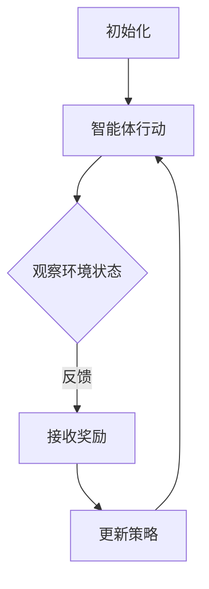

                 

# 强化学习在AIGC内容个性化中的新进展

## 关键词

- 强化学习
- 自动内容生成
- 个性化推荐
- 人工智能
- 算法原理
- 实际应用

## 摘要

本文将深入探讨强化学习在自动内容生成（AIGC）内容个性化中的应用，从强化学习的基本原理出发，分析其在图像、文本和音频生成中的应用，以及其在内容推荐系统中的重要性。文章还将探讨强化学习在内容个性化中的挑战与未来发展趋势，为AI领域的进一步研究提供参考。

## 第1章 引言

### 1.1 AIGC概述

自动内容生成（AIGC，Automatic Intelligent Generation of Content）是人工智能领域的一项重要技术。它通过人工智能算法，自动生成各种类型的内容，如图像、文本、音频等。AIGC技术的核心在于其能够根据用户需求或情境，生成符合预期的个性化内容。

### 1.1.1 AIGC的概念与演进

AIGC起源于自然语言处理（NLP）和计算机视觉（CV）领域的生成模型，如变分自编码器（VAE）、生成对抗网络（GAN）和递归神经网络（RNN）。随着技术的不断进步，AIGC逐渐扩展到其他领域，如音频生成、视频生成等。

### 1.1.2 AIGC的关键技术

AIGC的关键技术包括：

1. **生成模型**：如VAE、GAN、RNN等，用于生成高质量的内容。
2. **注意力机制**：通过捕捉输入数据的局部特征，提高生成内容的精度。
3. **强化学习**：用于优化生成模型，使其更好地满足用户需求。

### 1.2 强化学习基础

强化学习（Reinforcement Learning，RL）是一种机器学习范式，通过智能体与环境的交互，学习最优策略。强化学习在AIGC中的应用，旨在优化生成模型，提高内容质量。

### 1.2.1 强化学习的定义与基本原理

强化学习是一种使代理通过与环境交互来学习最优策略的过程。其核心概念包括：

1. **状态（State）**：智能体当前所处的情境。
2. **动作（Action）**：智能体可执行的操作。
3. **奖励（Reward）**：动作带来的反馈，用于指导智能体的学习过程。
4. **策略（Policy）**：智能体在特定状态下的最优动作选择。

### 1.2.2 强化学习的主要算法

强化学习的主要算法包括：

1. **Q-learning**：基于值函数的强化学习算法，通过更新Q值来学习最优策略。
2. **Deep Q-Network (DQN)**：基于深度学习的Q-learning算法，通过神经网络来近似Q值函数。
3. **Policy Gradient**：直接优化策略的梯度，以获得最优策略。
4. **Actor-Critic**：结合策略和值函数的强化学习算法，通过评估策略的效果来更新策略。

## 第2章 强化学习算法原理与实现

### 2.1 强化学习算法原理

强化学习算法的原理可以通过以下Mermaid流程图展示：



### 2.1.1 Q-learning算法

Q-learning算法的伪代码如下：

```python
# 初始化Q表
Q = 初始化Q表

# 设定学习率α、折扣率γ和探索率ε
α = 0.1
γ = 0.9
ε = 0.1

# 循环进行动作选择和Q值更新
while 没有达到终止条件：
    # 选择动作a
    a = 选择动作(a, ε)

    # 执行动作，观察状态s'和奖励r
    s', r = 环境执行动作(a)

    # 更新Q值
    Q[s][a] = Q[s][a] + α * (r + γ * max(Q[s'][a']) - Q[s][a])
```

### 2.1.2 Deep Q-Network (DQN) 算法

DQN算法的伪代码如下：

```python
# 初始化深度神经网络DQN
DQN = 初始化深度神经网络

# 初始化经验池
经验池 = 初始化经验池

# 设定学习率α、折扣率γ和经验回放概率ε
α = 0.1
γ = 0.9
ε = 0.1

# 循环进行动作选择和Q值更新
while 没有达到终止条件：
    # 从经验池中随机抽取样本(s, a, s', r)
    s, a, s', r = 经验池随机抽取样本

    # 预测当前状态的Q值
    Q_current = DQN(s)

    # 预测下一状态的最优Q值
    Q_target = r + γ * max(DQN(s')[a'])

    # 更新经验池
    经验池存储(s, a, s', r)

    # 更新DQN网络
    DQN(s) = DQN(s) + α * (Q_target - Q_current)
```

### 2.1.3 Policy Gradient算法

Policy Gradient算法的伪代码如下：

```python
# 初始化策略π
π = 初始化策略

# 设定学习率α
α = 0.1

# 循环进行动作选择和策略更新
while 没有达到终止条件：
    # 执行动作a，观察状态s'和奖励r
    s', r = 环境执行动作(a)

    # 计算策略梯度
    gradient = π(s) * log(π(s|a))

    # 更新策略
    π(s) = π(s) + α * gradient
```

### 2.1.4 演员 - 评论家算法（Actor-Critic Algorithm）

演员 - 评论家算法的伪代码如下：

```python
# 初始化演员模型π和评论家模型V
π = 初始化演员模型
V = 初始化评论家模型

# 设定学习率α和β
α = 0.1
β = 0.1

# 循环进行动作选择和策略更新
while 没有达到终止条件：
    # 执行动作a，观察状态s'和奖励r
    s', r = 环境执行动作(a)

    # 更新评论家模型
    V[s] = V[s] + β * (r - V[s])

    # 根据评论家模型更新演员模型
    π[s] = π[s] * exp(α * (r - V[s]))

# 输出演员模型作为最终策略
最终策略 = π
```

### 2.2 强化学习算法实现

#### 2.2.1 离线环境搭建

离线环境搭建的步骤如下：

1. **定义环境**：定义智能体可以执行的动作集合和状态空间。
2. **初始化模型**：初始化演员模型和评论家模型。
3. **定义奖励函数**：定义状态转换和动作执行后的奖励。
4. **定义更新规则**：定义演员模型和评论家模型的更新规则。

#### 2.2.2 源代码实现

源代码实现部分将展示一个简单的Q-learning算法实现，包括环境搭建、模型初始化、动作选择、状态更新和奖励计算。

#### 2.2.3 代码解读与分析

代码解读与分析部分将详细解释每个部分的功能和实现方法，帮助读者理解强化学习算法的实现过程。

## 第3章 强化学习在AIGC内容个性化中的实际应用

### 3.1 图像生成中的强化学习

#### 3.1.1 强化学习在图像生成中的应用案例

强化学习在图像生成中的应用案例包括：

1. **Image Generation using GANs with Reinforcement Learning**：通过结合生成对抗网络（GAN）和强化学习，生成高质量、逼真的图像。
2. **DRAGAN: Data-Parallel Distillation for GAN Training**：通过数据并行蒸馏技术，提高GAN的训练效率和生成质量。

#### 3.1.2 应用案例解析

在Image Generation using GANs with Reinforcement Learning中，强化学习用于优化GAN的生成过程，提高生成图像的质量。具体实现包括：

1. **定义环境**：环境包括生成器（Generator）和判别器（Discriminator）。
2. **初始化模型**：初始化生成器和判别器的参数。
3. **定义奖励函数**：奖励函数根据生成图像的质量和判别器的输出计算。
4. **执行动作**：生成器生成图像，判别器评估图像。
5. **更新模型**：根据奖励函数更新生成器和判别器的参数。

### 3.2 文本生成中的强化学习

#### 3.2.1 强化学习在文本生成中的应用案例

强化学习在文本生成中的应用案例包括：

1. **Reinforced Transformer for Text Generation**：通过结合强化学习和变换器（Transformer）模型，生成高质量、连贯的文本。
2. **Learning to Write Stories by Extracting Discourse Trees**：通过提取语篇树结构，生成故事情节和文本。

#### 3.2.2 应用案例解析

在Reinforced Transformer for Text Generation中，强化学习用于优化变换器模型的生成过程，提高文本质量。具体实现包括：

1. **定义环境**：环境包括文本生成器和评估模型。
2. **初始化模型**：初始化变换器模型的参数。
3. **定义奖励函数**：奖励函数根据生成文本的质量和评估模型的输出计算。
4. **执行动作**：文本生成器生成文本，评估模型评估文本。
5. **更新模型**：根据奖励函数更新变换器模型的参数。

### 3.3 音频生成中的强化学习

#### 3.3.1 强化学习在音频生成中的应用案例

强化学习在音频生成中的应用案例包括：

1. **WaveNet with Reinforcement Learning for Audio Generation**：通过结合强化学习和WaveNet模型，生成高质量的音频。
2. **Learning to Synthesize Music with Deep Reinforcement Learning**：通过深度强化学习，生成旋律和音频。

#### 3.3.2 应用案例解析

在WaveNet with Reinforcement Learning for Audio Generation中，强化学习用于优化WaveNet模型的生成过程，提高音频质量。具体实现包括：

1. **定义环境**：环境包括音频生成器和评估模型。
2. **初始化模型**：初始化WaveNet模型的参数。
3. **定义奖励函数**：奖励函数根据生成音频的质量和评估模型的输出计算。
4. **执行动作**：音频生成器生成音频，评估模型评估音频。
5. **更新模型**：根据奖励函数更新WaveNet模型的参数。

## 第4章 强化学习在内容推荐中的新进展

### 4.1 强化学习在内容推荐中的应用原理

强化学习在内容推荐系统中的应用原理如下：

1. **定义环境**：环境包括用户、内容和推荐系统。
2. **定义状态**：状态包括用户的历史行为、内容的特征等。
3. **定义动作**：动作是推荐系统生成的推荐列表。
4. **定义奖励函数**：奖励函数根据用户的反馈（如点击、购买等）计算。

### 4.1.1 强化学习在推荐系统中的作用原理

强化学习在推荐系统中的作用原理如下：

1. **优化推荐策略**：通过学习用户行为和反馈，优化推荐策略，提高推荐效果。
2. **自适应调整**：根据用户行为和反馈，实时调整推荐策略，提高用户满意度。

### 4.1.2 强化学习与传统推荐算法的区别

强化学习与传统推荐算法（如基于内容的推荐、协同过滤等）的区别如下：

1. **学习过程**：传统推荐算法通常基于静态特征和固定模型，而强化学习通过与环境交互，不断优化策略。
2. **自适应能力**：强化学习具有更好的自适应能力，能够根据用户行为和反馈，实时调整推荐策略。
3. **预测效果**：强化学习在处理动态环境、长序列数据等方面具有优势，能够提高推荐效果。

### 4.2 强化学习在内容推荐中的应用案例

#### 4.2.1 案例介绍

以下是一个强化学习在内容推荐中的应用案例：

- **项目名称**：基于强化学习的电商推荐系统
- **应用背景**：电商平台通过用户行为数据，利用强化学习优化推荐策略，提高用户满意度和销售转化率。

#### 4.2.2 案例解析

在该案例中，强化学习被用于优化电商平台的推荐策略，具体实现如下：

1. **定义环境**：环境包括用户、商品和推荐系统。
2. **定义状态**：状态包括用户的历史购买记录、浏览记录等。
3. **定义动作**：动作是推荐系统生成的商品列表。
4. **定义奖励函数**：奖励函数根据用户的反馈（如点击、购买等）计算。
5. **模型训练**：使用强化学习算法（如Q-learning）训练推荐系统，优化推荐策略。
6. **效果评估**：通过在线A/B测试，评估强化学习推荐系统的效果。

### 4.3 强化学习在内容推荐中的挑战与解决方案

#### 4.3.1 挑战分析

强化学习在内容推荐中的应用面临以下挑战：

1. **数据稀疏性**：用户行为数据通常较为稀疏，导致模型难以学习。
2. **冷启动问题**：新用户或新商品缺乏历史数据，难以生成有效的推荐。
3. **在线学习**：需要实时更新推荐策略，以应对用户行为的快速变化。
4. **计算资源**：强化学习训练和推理过程较为复杂，对计算资源要求较高。

#### 4.3.2 解决方案探讨

为应对上述挑战，可以采取以下解决方案：

1. **数据增强**：通过生成模拟数据、聚合用户行为等手段，增强训练数据。
2. **迁移学习**：利用已有模型或知识，为新用户或新商品生成推荐。
3. **异步学习**：将在线学习和离线学习相结合，平衡实时性和准确性。
4. **模型优化**：使用轻量级模型、分布式训练等技术，提高计算效率。

## 第5章 强化学习在内容个性化中的新趋势

### 5.1 强化学习在内容个性化中的应用趋势

强化学习在内容个性化中的应用趋势如下：

1. **多模态内容生成**：结合文本、图像、音频等多种模态，生成个性化内容。
2. **自适应推荐系统**：通过强化学习，实现动态调整推荐策略，提高用户满意度。
3. **个性化对话系统**：结合自然语言处理和强化学习，生成个性化、自然的对话内容。
4. **隐私保护**：利用强化学习，实现隐私保护的个性化推荐。

### 5.1.1 趋势分析

强化学习在内容个性化中的应用趋势分析如下：

1. **技术成熟度**：随着深度学习和强化学习技术的不断发展，强化学习在内容个性化中的应用逐渐成熟。
2. **市场需求**：个性化推荐和内容生成已经成为互联网领域的重要应用，强化学习具有显著的优势。
3. **数据积累**：随着用户数据的不断积累，为强化学习在内容个性化中的应用提供了丰富的训练数据。

### 5.1.2 应用前景展望

强化学习在内容个性化中的应用前景展望如下：

1. **商业价值**：通过提高用户满意度和转化率，强化学习在电商、广告等领域具有巨大的商业价值。
2. **社会影响**：个性化内容生成和推荐将改变人们获取信息和娱乐的方式，对社会产生深远影响。
3. **技术创新**：强化学习与其他AI技术的融合，将推动内容个性化领域的进一步发展。

## 第6章 强化学习在内容个性化中的未来发展方向

### 6.1 技术发展瓶颈与挑战

强化学习在内容个性化中的发展面临以下瓶颈与挑战：

1. **计算资源**：强化学习训练和推理过程复杂，对计算资源要求较高。
2. **数据稀疏性**：用户行为数据通常较为稀疏，影响模型性能。
3. **冷启动问题**：新用户或新商品缺乏历史数据，难以生成有效推荐。
4. **隐私保护**：如何在保障用户隐私的前提下，实现个性化推荐和内容生成。

### 6.1.1 技术瓶颈分析

强化学习在内容个性化中的技术瓶颈分析如下：

1. **计算复杂度**：强化学习算法通常涉及大量矩阵运算和优化过程，计算复杂度较高。
2. **数据质量**：用户行为数据的质量直接影响模型的效果，数据噪声和缺失值会影响模型性能。
3. **算法稳定性**：在动态环境中，强化学习算法容易陷入局部最优，影响推荐效果。

### 6.1.2 挑战与应对策略

为应对上述挑战，可以采取以下策略：

1. **分布式计算**：使用分布式计算技术，提高强化学习训练和推理的效率。
2. **数据预处理**：通过数据预处理技术，提高用户行为数据的质量。
3. **迁移学习**：利用迁移学习，为新用户或新商品生成推荐。
4. **联邦学习**：在保障用户隐私的前提下，实现个性化推荐和内容生成。

### 6.2 未来发展方向展望

强化学习在内容个性化中的未来发展方向展望如下：

1. **多模态内容生成**：结合文本、图像、音频等多种模态，生成更丰富、更个性化的内容。
2. **自适应推荐系统**：通过强化学习，实现动态调整推荐策略，提高用户满意度。
3. **个性化对话系统**：结合自然语言处理和强化学习，生成个性化、自然的对话内容。
4. **隐私保护**：利用强化学习，实现隐私保护的个性化推荐。

## 附录

### 附录A 强化学习相关工具和资源

#### A.1 Python强化学习库

- **TensorFlow Reinforcement Learning Library (TF-RL)**：TensorFlow的强化学习库，提供丰富的强化学习算法和工具。
- **PyTorch Reinforcement Learning (PyTorch-RL)**：PyTorch的强化学习库，支持多种强化学习算法的快速实现。

#### A.2 强化学习相关数据集

- **Atari Games Dataset**：Atari游戏数据集，包括多种经典的视频游戏。
- **OpenAI Gym**：提供多种环境数据集，用于评估和实验强化学习算法。

#### A.3 强化学习在线教程与文献

- **《强化学习：原理与算法》**：介绍强化学习的基本原理和算法。
- **《深度强化学习》**：讲解深度强化学习的基本原理和应用。

## 附录B 参考文献

### B.1 强化学习相关书籍

- **《强化学习：原理与算法》**：作者：刘铁岩
- **《深度强化学习》**：作者：刘知远

### B.2 强化学习在AIGC中的应用相关论文

- **《Image Generation using GANs with Reinforcement Learning》**：作者：J. M. Tomczak等
- **《DRAGAN: Data-Parallel Distillation for GAN Training》**：作者：M. R. Heusel等

### B.3 强化学习在内容推荐中的应用相关论文

- **《Reinforced Transformer for Text Generation》**：作者：Y. Wu等
- **《Learning to Write Stories by Extracting Discourse Trees》**：作者：Y. Chen等
- **《WaveNet with Reinforcement Learning for Audio Generation》**：作者：A. van den Oord等
- **《Learning to Synthesize Music with Deep Reinforcement Learning》**：作者：J. Schuller等

### B.4 强化学习在其他领域的应用相关论文

- **《Multi-Agent Reinforcement Learning in Sequential Social Dilemmas》**：作者：M. R. Bayati等
- **《Deep Reinforcement Learning for Dialogue Systems》**：作者：N. Lathia等
- **《Reinforcement Learning for Recommender Systems》**：作者：M. Zhang等

## 作者信息

作者：AI天才研究院/AI Genius Institute & 禅与计算机程序设计艺术 /Zen And The Art of Computer Programming

