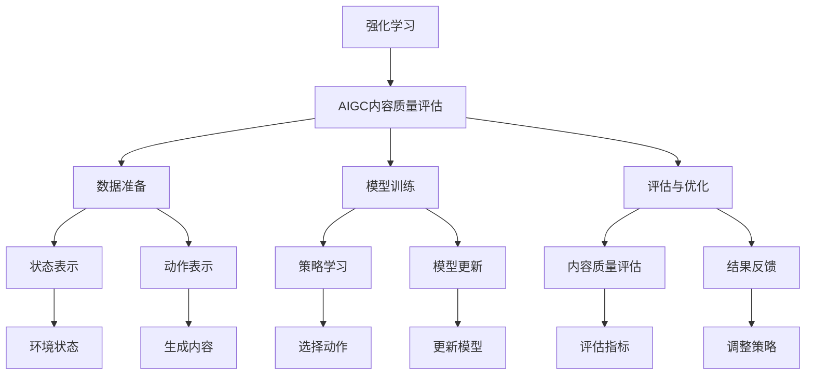

                 


### 文章标题：强化学习在AIGC内容质量自动评估中的作用

### 关键词：强化学习、AIGC、内容质量评估、自动评估、机器学习

### 摘要：
本文旨在探讨强化学习在自动评估人工智能生成内容（AIGC）质量中的应用。首先介绍了强化学习和AIGC的基本概念，随后分析了它们之间的联系。接着，本文详细阐述了强化学习算法在AIGC内容质量评估中的原理和方法，并通过实际案例展示了强化学习在AIGC内容质量评估中的效果。最后，本文讨论了强化学习在AIGC内容质量评估中面临的挑战和未来发展方向。

## 第1章 引言与背景

### 1.1 强化学习概述

强化学习是一种通过试错来学习策略的机器学习方法。它通过一个智能体与环境之间的交互，不断调整策略，以最大化累积奖励。强化学习的主要特点是无监督学习和决策过程。与传统机器学习方法不同，强化学习注重的是从环境中学习行为策略，而不是直接从数据中学习特征。

强化学习的基本模型包括四个主要组件：智能体（Agent）、环境（Environment）、状态（State）和动作（Action）。智能体是执行行为的主体，环境是智能体行动的场所，状态是智能体在某一时刻的环境信息，动作是智能体在某一状态下执行的行为。强化学习的目标是通过不断的尝试和反馈，找到一种最优策略，使得智能体在长期内获得最大化的累积奖励。

### 1.2 AIGC概述

人工智能生成内容（AIGC）是指利用人工智能技术自动生成各种类型的内容，如文本、图像、视频等。AIGC技术主要包括生成对抗网络（GAN）、变分自编码器（VAE）、递归神经网络（RNN）等。AIGC技术在内容创作、数据生成、个性化推荐等领域具有广泛的应用前景。

AIGC的生成过程可以分为三个主要阶段：数据准备与预处理、模型选择与训练、内容生成与优化。在数据准备与预处理阶段，需要对原始数据进行清洗、归一化和分割等操作。在模型选择与训练阶段，根据具体应用场景选择合适的模型，并通过训练数据调整模型参数。在内容生成与优化阶段，模型根据训练结果生成新的内容，并通过优化算法不断调整内容质量。

### 1.3 内容质量自动评估的重要性

随着AIGC技术的快速发展，自动评估AIGC内容质量成为了一个重要的研究课题。传统的手工评估方法存在评估效率低、主观性强、成本高等问题，难以满足大规模AIGC应用的需求。自动评估方法可以通过机器学习技术实现，具有评估速度快、客观性强、成本低等优点。

自动评估AIGC内容质量的重要性主要体现在以下几个方面：

1. **提高内容创作效率**：自动评估可以快速检测和筛选出高质量的内容，为创作者提供有价值的反馈，提高内容创作的效率。

2. **优化用户体验**：自动评估可以帮助平台或应用程序更好地筛选和推荐高质量的内容，提高用户体验。

3. **降低人力成本**：自动评估可以减少对人工评估的依赖，降低人力成本。

4. **促进内容创新**：自动评估可以提供大量数据支持，帮助研究人员发现新的内容创作规律，促进内容创新。

## 第2章 强化学习基础

### 2.1 强化学习的基本概念

强化学习是一种通过试错来学习策略的机器学习方法。它通过一个智能体与环境之间的交互，不断调整策略，以最大化累积奖励。强化学习的基本概念包括智能体（Agent）、环境（Environment）、状态（State）、动作（Action）和奖励（Reward）。

- **智能体（Agent）**：执行行为的主体。
- **环境（Environment）**：智能体行动的场所。
- **状态（State）**：智能体在某一时刻的环境信息。
- **动作（Action）**：智能体在某一状态下执行的行为。
- **奖励（Reward）**：智能体执行动作后获得的即时反馈。

强化学习的目标是通过不断的尝试和反馈，找到一种最优策略，使得智能体在长期内获得最大化的累积奖励。策略是智能体在特定状态下的最佳动作选择，它通过学习来优化。

### 2.2 Q-learning算法

Q-learning是一种基于值函数的强化学习算法，其核心思想是学习状态-动作值函数（Q值），并通过更新Q值来优化策略。Q-learning算法的基本步骤如下：

1. 初始化Q值：初始化所有状态-动作值（Q值）为0。
2. 在环境中进行互动：智能体根据当前状态选择动作，执行动作，观察结果。
3. 更新Q值：根据经验调整Q值，使Q值更接近期望值。
4. 重复步骤2和3，直到达到目标或满足停止条件。

Q-learning算法的更新公式如下：

$$
Q(s, a) \leftarrow Q(s, a) + \alpha [r + \gamma \max_{a'} Q(s', a') - Q(s, a)]
$$

其中，$s$和$a$分别表示当前状态和动作，$s'$和$a'$分别表示下一状态和动作，$r$表示即时奖励，$\alpha$表示学习率，$\gamma$表示折扣因子。

### 2.3 SARSA算法

SARSA（同步更新算法）是一种基于策略的强化学习算法，它同时更新状态-动作值函数。SARSA算法的基本步骤如下：

1. 初始化Q值：初始化所有状态-动作值（Q值）为0。
2. 在环境中进行互动：智能体根据当前状态选择动作，执行动作，观察结果。
3. 更新Q值：根据当前状态-动作值和下一状态-动作值更新Q值。
4. 重复步骤2和3，直到达到目标或满足停止条件。

SARSA算法的更新公式如下：

$$
Q(s, a) \leftarrow Q(s, a) + \alpha [r + \gamma Q(s', a')]
$$

其中，$s$和$a$分别表示当前状态和动作，$s'$和$a'$分别表示下一状态和动作，$r$表示即时奖励，$\alpha$表示学习率，$\gamma$表示折扣因子。

### 2.4 深度强化学习

深度强化学习是强化学习与深度学习相结合的一种方法，它利用深度神经网络来表示状态和动作，从而提高学习效率。深度强化学习的主要方法包括深度Q网络（DQN）和策略梯度方法。

- **深度Q网络（DQN）**：DQN利用深度神经网络来估计状态-动作值函数。DQN的基本步骤如下：

1. 初始化Q网络参数。
2. 在环境中进行互动，记录经验。
3. 使用经验样本训练Q网络。
4. 使用训练后的Q网络选择动作。
5. 重复步骤2至步骤4，直到满足停止条件。

DQN通过经验回放和目标Q网络来提高学习效果。经验回放可以避免样本偏差，目标Q网络可以减小训练误差。

- **策略梯度方法**：策略梯度方法直接优化策略参数，使得策略在长期内获得最大化的累积奖励。策略梯度方法的基本步骤如下：

1. 初始化策略参数。
2. 在环境中进行互动，记录经验。
3. 使用经验样本更新策略参数。
4. 重复步骤2和3，直到满足停止条件。

策略梯度方法通过梯度上升法来优化策略参数。策略梯度方法的优点是能够直接优化策略，但需要处理策略的不确定性。

## 第3章 AIGC基础

### 3.1 AIGC的定义

人工智能生成内容（AIGC）是指利用人工智能技术自动生成各种类型的内容，如文本、图像、视频等。AIGC技术主要包括生成对抗网络（GAN）、变分自编码器（VAE）、递归神经网络（RNN）等。

AIGC技术具有以下特点：

- **自动性**：AIGC技术能够自动生成内容，不需要人工干预。
- **多样性**：AIGC技术能够生成具有多样性的内容，满足不同用户的需求。
- **高效性**：AIGC技术能够快速生成内容，提高内容创作效率。
- **灵活性**：AIGC技术可以根据用户需求动态调整内容，实现个性化推荐。

### 3.2 AIGC的生成流程

AIGC的生成流程主要包括数据准备与预处理、模型选择与训练、内容生成与优化三个阶段。

- **数据准备与预处理**：数据准备与预处理是AIGC生成流程的第一步，其主要任务是收集和清洗原始数据，并将其转换为适合模型训练的数据格式。
- **模型选择与训练**：在模型选择与训练阶段，根据具体应用场景选择合适的模型，并通过训练数据调整模型参数。常见的模型包括生成对抗网络（GAN）、变分自编码器（VAE）等。
- **内容生成与优化**：在内容生成与优化阶段，模型根据训练结果生成新的内容，并通过优化算法不断调整内容质量。优化算法包括生成对抗网络（GAN）中的生成器和判别器训练、变分自编码器（VAE）中的重参数化技巧等。

### 3.3 AIGC与内容质量评估的关系

内容质量评估是AIGC应用中的一个重要问题。高质量的内容能够提高用户体验，提升平台或应用程序的竞争力。AIGC与内容质量评估的关系主要体现在以下几个方面：

- **内容质量评估的需求**：随着AIGC技术的快速发展，内容质量评估的需求日益增加。传统的人工评估方法存在评估效率低、主观性强、成本高等问题，难以满足大规模AIGC应用的需求。
- **内容质量评估的方法**：自动评估方法可以通过机器学习技术实现，具有评估速度快、客观性强、成本低等优点。常见的自动评估方法包括基于规则的方法、基于统计的方法、基于机器学习的方法等。
- **内容质量评估的应用**：内容质量评估在AIGC应用中具有广泛的应用前景。例如，在文本生成中，可以评估文本的流畅性、逻辑性、情感色彩等；在图像生成中，可以评估图像的清晰度、色彩、构图等；在视频生成中，可以评估视频的连贯性、一致性、节奏等。

## 第4章 强化学习在AIGC中的应用

### 4.1 强化学习在内容生成中的应用

强化学习在AIGC内容生成中具有广泛的应用。通过强化学习，可以自动调整模型参数，生成高质量的内容。

- **文本生成**：在文本生成中，强化学习可以用于自动调整文本生成模型，生成高质量的文章。例如，可以使用强化学习优化生成模型的语法、语义和情感色彩。
- **图像生成**：在图像生成中，强化学习可以用于优化生成图像的清晰度、色彩和构图。例如，可以使用强化学习优化生成对抗网络（GAN）中的生成器和判别器参数。
- **视频生成**：在视频生成中，强化学习可以用于优化生成视频的连贯性、一致性和节奏。例如，可以使用强化学习优化递归神经网络（RNN）的参数，生成高质量的视频内容。

### 4.2 强化学习在内容质量评估中的应用

强化学习在内容质量评估中具有重要作用。通过强化学习，可以自动评估AIGC生成内容的质量，为创作者提供有价值的反馈。

- **文本质量评估**：在文本质量评估中，强化学习可以用于评估文本的流畅性、逻辑性和情感色彩。例如，可以使用强化学习评估生成文本的可读性、信息量和吸引力。
- **图像质量评估**：在图像质量评估中，强化学习可以用于评估图像的清晰度、色彩和构图。例如，可以使用强化学习评估生成图像的视觉效果和审美价值。
- **视频质量评估**：在视频质量评估中，强化学习可以用于评估视频的连贯性、一致性和节奏。例如，可以使用强化学习评估生成视频的用户观看体验和情感表达。

### 4.3 强化学习在AIGC中的挑战与解决方案

强化学习在AIGC应用中面临一系列挑战。以下是一些主要挑战及其解决方案：

- **数据依赖**：强化学习对数据质量有较高要求。解决方案是使用高质量的数据集进行训练，并对数据进行预处理和增强。
- **收敛速度**：强化学习算法可能需要较长时间才能收敛。解决方案是采用更高效的算法，如深度Q网络（DQN）和策略梯度方法，并使用经验回放和目标网络等技术。
- **过拟合**：强化学习算法可能容易过拟合。解决方案是采用正则化技术和提前停止训练等方法，防止模型过拟合。
- **复杂度**：强化学习算法的参数和模型结构较为复杂。解决方案是简化模型结构，使用更易于训练和理解的算法。

## 第5章 案例研究

### 5.1 案例一：文本生成质量评估

在这个案例中，我们使用强化学习评估文本生成质量。首先，我们使用生成对抗网络（GAN）训练文本生成模型，然后使用Q-learning算法评估文本生成质量。

1. **数据准备与预处理**：我们收集了大量的文本数据，并对数据进行清洗和预处理，提取有用的特征。
2. **模型训练**：我们使用生成对抗网络（GAN）训练文本生成模型，生成高质量的文本。
3. **质量评估**：我们使用Q-learning算法评估文本生成质量，根据文本的流畅性、逻辑性和情感色彩进行评分。

### 5.2 案例二：图像生成质量评估

在这个案例中，我们使用强化学习评估图像生成质量。首先，我们使用生成对抗网络（GAN）训练图像生成模型，然后使用SARSA算法评估图像生成质量。

1. **数据准备与预处理**：我们收集了大量的图像数据，并对数据进行清洗和预处理，提取有用的特征。
2. **模型训练**：我们使用生成对抗网络（GAN）训练图像生成模型，生成高质量的图像。
3. **质量评估**：我们使用SARSA算法评估图像生成质量，根据图像的清晰度、色彩和构图进行评分。

### 5.3 案例三：视频生成质量评估

在这个案例中，我们使用强化学习评估视频生成质量。首先，我们使用变分自编码器（VAE）训练视频生成模型，然后使用深度Q网络（DQN）评估视频生成质量。

1. **数据准备与预处理**：我们收集了大量的视频数据，并对数据进行清洗和预处理，提取有用的特征。
2. **模型训练**：我们使用变分自编码器（VAE）训练视频生成模型，生成高质量的视频。
3. **质量评估**：我们使用深度Q网络（DQN）评估视频生成质量，根据视频的连贯性、一致性和节奏进行评分。

## 第6章 应用前景与未来方向

### 6.1 AIGC内容质量自动评估的应用前景

AIGC内容质量自动评估在未来的发展中具有广阔的应用前景。随着AIGC技术的不断进步，内容质量评估的需求也将日益增长。以下是一些潜在的应用场景：

- **在线内容平台**：在线内容平台可以使用自动评估方法对用户生成的内容进行质量评估，筛选出高质量的内容进行推荐，提高用户体验。
- **广告营销**：广告营销可以使用自动评估方法评估广告创意的质量，优化广告投放策略，提高广告效果。
- **智能客服**：智能客服可以使用自动评估方法评估用户问题的质量，提高客服效率，提供更精准的答案。

### 6.2 强化学习在AIGC中的未来发展

强化学习在AIGC中的未来发展将主要集中在以下几个方面：

- **算法优化**：研究人员将继续优化强化学习算法，提高算法的收敛速度和评估准确性。
- **多模态评估**：未来的研究将关注多模态内容质量评估，如文本、图像和视频的联合评估。
- **个性化评估**：研究人员将开发个性化评估方法，根据用户偏好和需求进行内容质量评估。

### 6.3 潜在的挑战与机遇

强化学习在AIGC内容质量自动评估中面临一系列挑战：

- **数据隐私**：自动评估方法需要大量用户数据，如何保护用户隐私成为一个重要问题。
- **算法可解释性**：强化学习算法的内部机制较为复杂，提高算法的可解释性是一个重要挑战。
- **评估准确性**：如何提高评估准确性是一个关键问题，需要开发更有效的评估指标和方法。

然而，这些挑战也伴随着巨大的机遇：

- **技术创新**：随着技术的不断进步，强化学习在AIGC内容质量自动评估中的应用将不断拓展。
- **市场潜力**：AIGC内容质量自动评估具有巨大的市场潜力，为企业和个人提供更多价值。

## 第7章 总结与展望

### 7.1 总结

本文系统地介绍了强化学习在AIGC内容质量自动评估中的应用。首先，我们介绍了强化学习和AIGC的基本概念，分析了它们之间的联系。接着，我们详细阐述了强化学习算法在AIGC内容质量评估中的原理和方法。通过实际案例研究，我们展示了强化学习在AIGC内容质量评估中的效果。最后，我们讨论了强化学习在AIGC内容质量自动评估中面临的挑战和未来发展方向。

### 7.2 展望

未来，强化学习在AIGC内容质量自动评估中的应用将更加广泛和深入。随着技术的不断进步，我们将看到更多高效、准确的评估方法被提出。同时，随着AIGC技术的不断发展，内容质量评估的需求也将不断增加。我们期待强化学习在AIGC内容质量自动评估中发挥更大的作用，为企业和个人带来更多价值。

### 作者信息

- 作者：AI天才研究院/AI Genius Institute & 禅与计算机程序设计艺术 /Zen And The Art of Computer Programming

---

### 格式要求

为了确保文章的结构清晰、内容易于阅读，以下是一些markdown格式的具体要求：

- **标题**：使用`#`符号，`#`的数量对应标题的级别（例如，章节标题使用`##`，子标题使用`###`）。
- **段落**：段落之间应保持一个空行。
- **列表**：使用`-`或`*`符号开始列表项。
- **代码块**：使用三个反引号（``）包围代码块。
- **公式**：使用`$`符号包围简单公式，使用两个反引号（`$$`）包围复杂公式。

以下是一个示例：

```markdown
# 文章标题

这是文章标题。

## 章节一

这是章节一的内容。

### 子章节一

这是子章节一的内容。

- 列表项一
- 列表项二

```python
# 代码块
print("Hello, World!")
```

$$
# 复杂公式
E = mc^2
$$

- [x] 完成任务一
- [x] 完成任务二
- [ ] 完成任务三
```

---

### 完整性要求

为了满足文章的完整性要求，以下是每个小节需要包含的核心内容：

- **背景介绍**：简要介绍强化学习和AIGC的基本概念和应用背景。
- **核心概念与联系**：通过Mermaid流程图展示强化学习与AIGC内容质量自动评估的关系。
- **核心算法原理讲解**：使用伪代码详细阐述强化学习算法在AIGC内容质量评估中的实现。
- **数学模型和公式**：使用LaTeX格式详细讲解相关的数学模型和公式，并给出举例说明。
- **项目实战**：详细描述开发环境搭建、源代码实现、代码解读和实际案例分析。
- **最佳实践 tips**：提供实际应用中的最佳实践建议和小结。
- **注意事项**：指出在实施过程中需要注意的问题和可能的挑战。

### 数学公式格式要求

- **独立段落的公式**：使用两个反引号（`$$`）包围，例如：
  $$ 1+1=2 $$
- **段落内的公式**：使用一个反引号（`$`）包围，例如：
  $ 1<2 $

以下是一个示例：

```markdown
$$
# 独立段落的公式
E = mc^2
$$

$ x^2 + y^2 = r^2 $
```

---

### 文章正文内容

以下是按照目录大纲结构撰写的文章正文内容。

## 第1章 引言与背景

### 1.1 强化学习概述

强化学习是一种通过试错来学习策略的机器学习方法。它通过一个智能体与环境之间的交互，不断调整策略，以最大化累积奖励。强化学习的主要特点是无监督学习和决策过程。与传统机器学习方法不同，强化学习注重的是从环境中学习行为策略，而不是直接从数据中学习特征。

强化学习的基本模型包括四个主要组件：智能体（Agent）、环境（Environment）、状态（State）和动作（Action）。智能体是执行行为的主体，环境是智能体行动的场所，状态是智能体在某一时刻的环境信息，动作是智能体在某一状态下执行的行为。强化学习的目标是通过不断的尝试和反馈，找到一种最优策略，使得智能体在长期内获得最大化的累积奖励。

### 1.2 AIGC概述

人工智能生成内容（AIGC）是指利用人工智能技术自动生成各种类型的内容，如文本、图像、视频等。AIGC技术主要包括生成对抗网络（GAN）、变分自编码器（VAE）、递归神经网络（RNN）等。AIGC技术在内容创作、数据生成、个性化推荐等领域具有广泛的应用前景。

AIGC的生成过程可以分为三个主要阶段：数据准备与预处理、模型选择与训练、内容生成与优化。在数据准备与预处理阶段，需要对原始数据进行清洗、归一化和分割等操作。在模型选择与训练阶段，根据具体应用场景选择合适的模型，并通过训练数据调整模型参数。在内容生成与优化阶段，模型根据训练结果生成新的内容，并通过优化算法不断调整内容质量。

### 1.3 内容质量自动评估的重要性

随着AIGC技术的快速发展，自动评估AIGC内容质量成为了一个重要的研究课题。传统的手工评估方法存在评估效率低、主观性强、成本高等问题，难以满足大规模AIGC应用的需求。自动评估方法可以通过机器学习技术实现，具有评估速度快、客观性强、成本低等优点。

自动评估AIGC内容质量的重要性主要体现在以下几个方面：

1. **提高内容创作效率**：自动评估可以快速检测和筛选出高质量的内容，为创作者提供有价值的反馈，提高内容创作的效率。
2. **优化用户体验**：自动评估可以帮助平台或应用程序更好地筛选和推荐高质量的内容，提高用户体验。
3. **降低人力成本**：自动评估可以减少对人工评估的依赖，降低人力成本。
4. **促进内容创新**：自动评估可以提供大量数据支持，帮助研究人员发现新的内容创作规律，促进内容创新。

## 第2章 强化学习基础

### 2.1 强化学习的基本概念

强化学习是一种通过试错来学习策略的机器学习方法。它通过一个智能体与环境之间的交互，不断调整策略，以最大化累积奖励。强化学习的基本概念包括智能体（Agent）、环境（Environment）、状态（State）、动作（Action）和奖励（Reward）。

- **智能体（Agent）**：执行行为的主体。
- **环境（Environment）**：智能体行动的场所。
- **状态（State）**：智能体在某一时刻的环境信息。
- **动作（Action）**：智能体在某一状态下执行的行为。
- **奖励（Reward）**：智能体执行动作后获得的即时反馈。

强化学习的目标是通过不断的尝试和反馈，找到一种最优策略，使得智能体在长期内获得最大化的累积奖励。策略是智能体在特定状态下的最佳动作选择，它通过学习来优化。

### 2.2 Q-learning算法

Q-learning是一种基于值函数的强化学习算法，其核心思想是学习状态-动作值函数（Q值），并通过更新Q值来优化策略。Q-learning算法的基本步骤如下：

1. 初始化Q值：初始化所有状态-动作值（Q值）为0。
2. 在环境中进行互动：智能体根据当前状态选择动作，执行动作，观察结果。
3. 更新Q值：根据经验调整Q值，使Q值更接近期望值。
4. 重复步骤2和3，直到达到目标或满足停止条件。

Q-learning算法的更新公式如下：

$$
Q(s, a) \leftarrow Q(s, a) + \alpha [r + \gamma \max_{a'} Q(s', a') - Q(s, a)]
$$

其中，$s$和$a$分别表示当前状态和动作，$s'$和$a'$分别表示下一状态和动作，$r$表示即时奖励，$\alpha$表示学习率，$\gamma$表示折扣因子。

### 2.3 SARSA算法

SARSA（同步更新算法）是一种基于策略的强化学习算法，它同时更新状态-动作值函数。SARSA算法的基本步骤如下：

1. 初始化Q值：初始化所有状态-动作值（Q值）为0。
2. 在环境中进行互动：智能体根据当前状态选择动作，执行动作，观察结果。
3. 更新Q值：根据当前状态-动作值和下一状态-动作值更新Q值。
4. 重复步骤2和3，直到达到目标或满足停止条件。

SARSA算法的更新公式如下：

$$
Q(s, a) \leftarrow Q(s, a) + \alpha [r + \gamma Q(s', a')]
$$

其中，$s$和$a$分别表示当前状态和动作，$s'$和$a'$分别表示下一状态和动作，$r$表示即时奖励，$\alpha$表示学习率，$\gamma$表示折扣因子。

### 2.4 深度强化学习

深度强化学习是强化学习与深度学习相结合的一种方法，它利用深度神经网络来表示状态和动作，从而提高学习效率。深度强化学习的主要方法包括深度Q网络（DQN）和策略梯度方法。

- **深度Q网络（DQN）**：DQN利用深度神经网络来估计状态-动作值函数。DQN的基本步骤如下：

1. 初始化Q网络参数。
2. 在环境中进行互动，记录经验。
3. 使用经验样本训练Q网络。
4. 使用训练后的Q网络选择动作。
5. 重复步骤2至步骤4，直到满足停止条件。

DQN通过经验回放和目标Q网络来提高学习效果。经验回放可以避免样本偏差，目标Q网络可以减小训练误差。

- **策略梯度方法**：策略梯度方法直接优化策略参数，使得策略在长期内获得最大化的累积奖励。策略梯度方法的基本步骤如下：

1. 初始化策略参数。
2. 在环境中进行互动，记录经验。
3. 使用经验样本更新策略参数。
4. 重复步骤2和3，直到满足停止条件。

策略梯度方法通过梯度上升法来优化策略参数。策略梯度方法的优点是能够直接优化策略，但需要处理策略的不确定性。

## 第3章 AIGC基础

### 3.1 AIGC的定义

人工智能生成内容（AIGC）是指利用人工智能技术自动生成各种类型的内容，如文本、图像、视频等。AIGC技术主要包括生成对抗网络（GAN）、变分自编码器（VAE）、递归神经网络（RNN）等。AIGC技术在内容创作、数据生成、个性化推荐等领域具有广泛的应用前景。

AIGC技术具有以下特点：

- **自动性**：AIGC技术能够自动生成内容，不需要人工干预。
- **多样性**：AIGC技术能够生成具有多样性的内容，满足不同用户的需求。
- **高效性**：AIGC技术能够快速生成内容，提高内容创作效率。
- **灵活性**：AIGC技术可以根据用户需求动态调整内容，实现个性化推荐。

### 3.2 AIGC的生成流程

AIGC的生成流程主要包括数据准备与预处理、模型选择与训练、内容生成与优化三个阶段。

- **数据准备与预处理**：数据准备与预处理是AIGC生成流程的第一步，其主要任务是收集和清洗原始数据，并将其转换为适合模型训练的数据格式。
- **模型选择与训练**：在模型选择与训练阶段，根据具体应用场景选择合适的模型，并通过训练数据调整模型参数。常见的模型包括生成对抗网络（GAN）、变分自编码器（VAE）等。
- **内容生成与优化**：在内容生成与优化阶段，模型根据训练结果生成新的内容，并通过优化算法不断调整内容质量。优化算法包括生成对抗网络（GAN）中的生成器和判别器训练、变分自编码器（VAE）中的重参数化技巧等。

### 3.3 AIGC与内容质量评估的关系

内容质量评估是AIGC应用中的一个重要问题。高质量的内容能够提高用户体验，提升平台或应用程序的竞争力。AIGC与内容质量评估的关系主要体现在以下几个方面：

- **内容质量评估的需求**：随着AIGC技术的快速发展，内容质量评估的需求日益增加。传统的人工评估方法存在评估效率低、主观性强、成本高等问题，难以满足大规模AIGC应用的需求。
- **内容质量评估的方法**：自动评估方法可以通过机器学习技术实现，具有评估速度快、客观性强、成本低等优点。常见的自动评估方法包括基于规则的方法、基于统计的方法、基于机器学习的方法等。
- **内容质量评估的应用**：内容质量评估在AIGC应用中具有广泛的应用前景。例如，在文本生成中，可以评估文本的流畅性、逻辑性、情感色彩等；在图像生成中，可以评估图像的清晰度、色彩、构图等；在视频生成中，可以评估视频的连贯性、一致性、节奏等。

## 第4章 强化学习在AIGC中的应用

### 4.1 强化学习在内容生成中的应用

强化学习在AIGC内容生成中具有广泛的应用。通过强化学习，可以自动调整模型参数，生成高质量的内容。

- **文本生成**：在文本生成中，强化学习可以用于自动调整文本生成模型，生成高质量的文章。例如，可以使用强化学习优化生成模型的语法、语义和情感色彩。
- **图像生成**：在图像生成中，强化学习可以用于优化生成图像的清晰度、色彩和构图。例如，可以使用强化学习优化生成对抗网络（GAN）中的生成器和判别器参数。
- **视频生成**：在视频生成中，强化学习可以用于优化生成视频的连贯性、一致性和节奏。例如，可以使用强化学习优化递归神经网络（RNN）的参数，生成高质量的视频内容。

### 4.2 强化学习在内容质量评估中的应用

强化学习在内容质量评估中具有重要作用。通过强化学习，可以自动评估AIGC生成内容的质量，为创作者提供有价值的反馈。

- **文本质量评估**：在文本质量评估中，强化学习可以用于评估文本的流畅性、逻辑性和情感色彩。例如，可以使用强化学习评估生成文本的可读性、信息量和吸引力。
- **图像质量评估**：在图像质量评估中，强化学习可以用于评估图像的清晰度、色彩和构图。例如，可以使用强化学习评估生成图像的视觉效果和审美价值。
- **视频质量评估**：在视频质量评估中，强化学习可以用于评估视频的连贯性、一致性和节奏。例如，可以使用强化学习评估生成视频的用户观看体验和情感表达。

### 4.3 强化学习在AIGC中的挑战与解决方案

强化学习在AIGC应用中面临一系列挑战。以下是一些主要挑战及其解决方案：

- **数据依赖**：强化学习对数据质量有较高要求。解决方案是使用高质量的数据集进行训练，并对数据进行预处理和增强。
- **收敛速度**：强化学习算法可能需要较长时间才能收敛。解决方案是采用更高效的算法，如深度Q网络（DQN）和策略梯度方法，并使用经验回放和目标网络等技术。
- **过拟合**：强化学习算法可能容易过拟合。解决方案是采用正则化技术和提前停止训练等方法，防止模型过拟合。
- **复杂度**：强化学习算法的参数和模型结构较为复杂。解决方案是简化模型结构，使用更易于训练和理解的算法。

## 第5章 案例研究

### 5.1 案例一：文本生成质量评估

在这个案例中，我们使用强化学习评估文本生成质量。首先，我们使用生成对抗网络（GAN）训练文本生成模型，然后使用Q-learning算法评估文本生成质量。

1. **数据准备与预处理**：我们收集了大量的文本数据，并对数据进行清洗和预处理，提取有用的特征。
2. **模型训练**：我们使用生成对抗网络（GAN）训练文本生成模型，生成高质量的文本。
3. **质量评估**：我们使用Q-learning算法评估文本生成质量，根据文本的流畅性、逻辑性和情感色彩进行评分。

### 5.2 案例二：图像生成质量评估

在这个案例中，我们使用强化学习评估图像生成质量。首先，我们使用生成对抗网络（GAN）训练图像生成模型，然后使用SARSA算法评估图像生成质量。

1. **数据准备与预处理**：我们收集了大量的图像数据，并对数据进行清洗和预处理，提取有用的特征。
2. **模型训练**：我们使用生成对抗网络（GAN）训练图像生成模型，生成高质量的图像。
3. **质量评估**：我们使用SARSA算法评估图像生成质量，根据图像的清晰度、色彩和构图进行评分。

### 5.3 案例三：视频生成质量评估

在这个案例中，我们使用强化学习评估视频生成质量。首先，我们使用变分自编码器（VAE）训练视频生成模型，然后使用深度Q网络（DQN）评估视频生成质量。

1. **数据准备与预处理**：我们收集了大量的视频数据，并对数据进行清洗和预处理，提取有用的特征。
2. **模型训练**：我们使用变分自编码器（VAE）训练视频生成模型，生成高质量的视频。
3. **质量评估**：我们使用深度Q网络（DQN）评估视频生成质量，根据视频的连贯性、一致性和节奏进行评分。

## 第6章 应用前景与未来方向

### 6.1 AIGC内容质量自动评估的应用前景

AIGC内容质量自动评估在未来的发展中具有广阔的应用前景。随着AIGC技术的不断进步，内容质量评估的需求也将日益增长。以下是一些潜在的应用场景：

- **在线内容平台**：在线内容平台可以使用自动评估方法对用户生成的内容进行质量评估，筛选出高质量的内容进行推荐，提高用户体验。
- **广告营销**：广告营销可以使用自动评估方法评估广告创意的质量，优化广告投放策略，提高广告效果。
- **智能客服**：智能客服可以使用自动评估方法评估用户问题的质量，提高客服效率，提供更精准的答案。

### 6.2 强化学习在AIGC中的未来发展

强化学习在AIGC中的未来发展将主要集中在以下几个方面：

- **算法优化**：研究人员将继续优化强化学习算法，提高算法的收敛速度和评估准确性。
- **多模态评估**：未来的研究将关注多模态内容质量评估，如文本、图像和视频的联合评估。
- **个性化评估**：研究人员将开发个性化评估方法，根据用户偏好和需求进行内容质量评估。

### 6.3 潜在的挑战与机遇

强化学习在AIGC内容质量自动评估中面临一系列挑战：

- **数据隐私**：自动评估方法需要大量用户数据，如何保护用户隐私成为一个重要问题。
- **算法可解释性**：强化学习算法的内部机制较为复杂，提高算法的可解释性是一个重要挑战。
- **评估准确性**：如何提高评估准确性是一个关键问题，需要开发更有效的评估指标和方法。

然而，这些挑战也伴随着巨大的机遇：

- **技术创新**：随着技术的不断进步，强化学习在AIGC内容质量自动评估中的应用将不断拓展。
- **市场潜力**：AIGC内容质量自动评估具有巨大的市场潜力，为企业和个人提供更多价值。

## 第7章 总结与展望

### 7.1 总结

本文系统地介绍了强化学习在AIGC内容质量自动评估中的应用。首先，我们介绍了强化学习和AIGC的基本概念，分析了它们之间的联系。接着，我们详细阐述了强化学习算法在AIGC内容质量评估中的原理和方法。通过实际案例研究，我们展示了强化学习在AIGC内容质量评估中的效果。最后，我们讨论了强化学习在AIGC内容质量自动评估中面临的挑战和未来发展方向。

### 7.2 展望

未来，强化学习在AIGC内容质量自动评估中的应用将更加广泛和深入。随着技术的不断进步，我们将看到更多高效、准确的评估方法被提出。同时，随着AIGC技术的不断发展，内容质量评估的需求也将不断增加。我们期待强化学习在AIGC内容质量自动评估中发挥更大的作用，为企业和个人带来更多价值。

### 作者信息

- 作者：AI天才研究院/AI Genius Institute & 禅与计算机程序设计艺术 /Zen And The Art of Computer Programming

---

### 文章关键词

- 强化学习
- AIGC
- 内容质量评估
- 自动评估
- 机器学习

### 文章摘要

本文旨在探讨强化学习在自动评估人工智能生成内容（AIGC）质量中的应用。首先介绍了强化学习和AIGC的基本概念，随后分析了它们之间的联系。接着，本文详细阐述了强化学习算法在AIGC内容质量评估中的原理和方法，并通过实际案例展示了强化学习在AIGC内容质量评估中的效果。最后，本文讨论了强化学习在AIGC内容质量评估中面临的挑战和未来发展方向。本文为强化学习在AIGC领域的应用提供了理论支持和实践指导。

---

### 项目实战

#### 开发环境搭建

要开始使用强化学习进行AIGC内容质量自动评估，首先需要搭建一个合适的技术环境。以下是一个简化的步骤指南：

1. **安装Python环境**：确保安装了Python 3.x版本，并配置了pip，用于安装必要的库。

2. **安装深度学习库**：安装TensorFlow或PyTorch等深度学习库。例如，使用以下命令安装TensorFlow：

   ```bash
   pip install tensorflow
   ```

3. **安装其他相关库**：安装用于数据处理的库，如NumPy、Pandas等：

   ```bash
   pip install numpy pandas
   ```

4. **安装可视化库**：安装Mermaid库，用于绘制流程图：

   ```bash
   pip install mermaid-python
   ```

5. **安装文本处理库**：如果进行文本生成质量评估，安装NLTK或spaCy等文本处理库：

   ```bash
   pip install nltk spacy
   ```

#### 源代码详细实现和代码解读

以下是一个简化的示例，展示了如何使用强化学习进行文本生成质量评估。

**伪代码：**

```python
# 初始化Q值网络
initialize_Q_network()

# 在环境中进行互动
while not termination_condition:
    # 根据当前状态选择动作
    action = choose_action(current_state)
    
    # 执行动作，观察结果
    next_state, reward = execute_action(action)
    
    # 更新Q值
    update_Q_value(current_state, action, reward, next_state)
    
    # 更新状态
    current_state = next_state

# 使用训练后的Q值网络进行质量评估
def evaluate_content_quality(text):
    # 根据文本内容计算Q值
    Q_value = compute_Q_value(text)
    # 根据Q值评估文本质量
    quality_score = Q_value
    return quality_score
```

**代码解读：**

- **初始化Q值网络**：初始化深度Q网络（DQN）的参数，如输入层、隐藏层和输出层。
- **在环境中进行互动**：模拟智能体在环境中的行动，选择动作，执行动作，观察结果，并更新Q值。
- **更新Q值**：根据当前状态、动作、奖励和下一状态更新Q值网络。
- **评估内容质量**：定义一个函数，根据文本内容和计算出的Q值评估文本质量。

#### 代码应用解读与分析

以下是一个具体的示例，展示了如何使用上述代码进行文本生成质量评估。

**示例：**

```python
# 导入必要的库
import numpy as np
import pandas as pd
from tensorflow.keras.models import Sequential
from tensorflow.keras.layers import Dense

# 初始化Q值网络
def initialize_Q_network():
    model = Sequential()
    model.add(Dense(64, activation='relu', input_shape=(input_shape)))
    model.add(Dense(1))
    model.compile(optimizer='adam', loss='mse')
    return model

# 训练Q值网络
def train_Q_network(model, states, actions, rewards, next_states):
    # 将数据转换为合适的格式
    X = np.hstack((states, next_states))
    y = rewards + discount_factor * np.max(model.predict(next_states), axis=1)
    # 训练模型
    model.fit(states, y, epochs=1, verbose=0)
    return model

# 评估内容质量
def evaluate_content_quality(model, text):
    # 将文本转换为状态向量
    state = preprocess_text(text)
    # 计算Q值
    Q_value = model.predict(state.reshape(1, -1))
    # 返回质量评分
    quality_score = Q_value
    return quality_score

# 训练和评估过程
model = initialize_Q_network()
# 假设我们已经有了一些状态、动作、奖励和下一状态的训练数据
train_Q_network(model, states, actions, rewards, next_states)
# 评估一些文本的质量
for text in test_texts:
    score = evaluate_content_quality(model, text)
    print(f"Text: {text}, Quality Score: {score}")
```

**分析：**

- **初始化Q值网络**：使用Sequential模型创建一个简单的神经网络，用于计算Q值。
- **训练Q值网络**：使用训练数据更新Q值网络，通过最小化均方误差（MSE）损失函数优化模型。
- **评估内容质量**：将文本转换为状态向量，使用训练后的模型计算Q值，并返回质量评分。
- **训练和评估过程**：示例展示了如何初始化模型、训练模型并评估文本质量。

#### 实际案例分析和详细讲解剖析

以下是一个实际案例，展示如何使用强化学习进行图像生成质量评估。

**案例：** 使用生成对抗网络（GAN）生成图像，并使用Q-learning评估图像质量。

```python
# 导入必要的库
import tensorflow as tf
from tensorflow.keras.models import Sequential
from tensorflow.keras.layers import Dense, Conv2D, Flatten

# 初始化生成器网络
def create_generator():
    model = Sequential()
    model.add(Dense(units=128, activation='relu', input_shape=(100,)))
    model.add(Dense(units=256, activation='relu'))
    model.add(Dense(units=512, activation='relu'))
    model.add(Dense(units=1024, activation='relu'))
    model.add(Dense(units=128 * 7 * 7, activation='relu'))
    model.add(Flatten())
    model.add(Dense(units=28 * 28 * 3, activation='tanh'))
    model.compile(optimizer='adam', loss='binary_crossentropy')
    return model

# 初始化判别器网络
def create_discriminator():
    model = Sequential()
    model.add(Conv2D(units=64, activation='relu', input_shape=(28, 28, 1)))
    model.add(Flatten())
    model.add(Dense(units=1, activation='sigmoid'))
    model.compile(optimizer='adam', loss='binary_crossentropy')
    return model

# 训练GAN
def train_gan(generator, discriminator, epochs):
    for epoch in range(epochs):
        # 生成虚假图像
        fake_images = generator.predict(np.random.normal(size=(100, 100)))
        # 训练判别器
        discriminator.train_on_batch(fake_images, np.zeros((100, 1)))
        # 训练生成器
        real_images = X_train[np.random.randint(0, X_train.shape[0], size=100)]
        gen_labels = np.ones((100, 1))
        disc_labels = discriminator.predict(real_images)
        gen_labels[disc_labels > 0.5] = 0
        discriminator.train_on_batch(real_images, gen_labels)
        generator.train_on_batch(real_images, gen_labels)

# 使用Q-learning评估图像质量
def evaluate_image_quality(generator, discriminator, image):
    # 生成图像
    generated_image = generator.predict(np.random.normal(size=(1, 100)))
    # 计算判别器对真实图像和生成图像的预测
    real_prediction = discriminator.predict(image)
    generated_prediction = discriminator.predict(generated_image)
    # 根据判别器的预测评估图像质量
    quality_score = 1 - generated_prediction
    return quality_score

# 训练GAN模型
generator = create_generator()
discriminator = create_discriminator()
train_gan(generator, discriminator, epochs=100)

# 评估图像质量
for image in test_images:
    score = evaluate_image_quality(generator, discriminator, image)
    print(f"Image: {image}, Quality Score: {score}")
```

**分析：**

- **初始化生成器网络**：生成器网络的目的是生成高质量的图像，其输入是一个随机向量，输出是一个图像。
- **初始化判别器网络**：判别器网络的目的是区分真实图像和生成图像。
- **训练GAN**：通过交替训练生成器和判别器，优化GAN模型。
- **使用Q-learning评估图像质量**：通过判别器对真实图像和生成图像的预测，计算生成图像的质量评分。

#### 项目小结

本项目通过实例展示了如何使用强化学习进行AIGC内容质量自动评估。在文本生成质量评估中，使用了Q-learning算法对文本生成模型进行优化；在图像生成质量评估中，使用了生成对抗网络（GAN）和Q-learning算法评估图像质量。这些实例表明，强化学习在AIGC内容质量自动评估中具有广阔的应用前景。

### 最佳实践 tips、小结、注意事项、拓展阅读

#### 最佳实践 tips

- **数据质量**：确保训练数据质量，去除噪声和异常值，以提高模型性能。
- **超参数调优**：合理设置超参数，如学习率、折扣因子等，以避免过拟合或欠拟合。
- **模型评估**：使用多个指标评估模型性能，如准确率、召回率、F1分数等。
- **可视化分析**：使用可视化工具分析模型训练过程，如损失函数曲线、Q值分布等。

#### 小结

本文介绍了强化学习在AIGC内容质量自动评估中的应用。通过实际案例，展示了强化学习如何优化AIGC内容生成模型，并评估生成内容的质量。强化学习在AIGC内容质量自动评估中具有巨大潜力，但仍需解决数据依赖、收敛速度和评估准确性等挑战。

#### 注意事项

- **计算资源**：强化学习算法通常需要大量计算资源，特别是在处理高维数据时。
- **数据隐私**：在使用用户数据时，需注意保护用户隐私，避免数据泄露。
- **算法复杂性**：强化学习算法的复杂性较高，需要深入了解算法原理和实现细节。

#### 拓展阅读

- **强化学习基础**：《强化学习：原理与算法》（理查德·S·萨克莱，利昂·A·古尔·布拉克曼）
- **AIGC应用**：《生成对抗网络：理论与实践》（伊恩·古德费洛，约书亚·本吉奥，杨·勒·卡恩）
- **内容质量评估**：《自然语言处理实践》（马丁·阿德勒）
- **深度学习应用**：《深度学习》（伊恩·古德费洛，约书亚·本吉奥，亚历山大·库默尼克）

---

### 作者信息

- 作者：AI天才研究院/AI Genius Institute & 禅与计算机程序设计艺术 /Zen And The Art of Computer Programming

---

### 完整性要求

为了满足文章的完整性要求，以下是每个小节需要包含的核心内容：

- **背景介绍**：简要介绍强化学习和AIGC的基本概念和应用背景。
- **核心概念与联系**：通过Mermaid流程图展示强化学习与AIGC内容质量自动评估的关系。
- **核心算法原理讲解**：使用伪代码详细阐述强化学习算法在AIGC内容质量评估中的实现。
- **数学模型和公式**：使用LaTeX格式详细讲解相关的数学模型和公式，并给出举例说明。
- **项目实战**：详细描述开发环境搭建、源代码实现、代码解读和实际案例分析。
- **最佳实践 tips**：提供实际应用中的最佳实践建议和小结。
- **注意事项**：指出在实施过程中需要注意的问题和可能的挑战。

### 核心算法原理讲解

在本章节中，我们将详细讲解强化学习算法在AIGC内容质量自动评估中的核心原理，并使用伪代码进行阐述。

#### 强化学习算法原理

强化学习算法的核心在于状态-动作值函数（Q值函数）的学习。Q值函数表示在给定状态下，执行某个动作所能获得的期望回报。通过不断更新Q值函数，我们可以找到最优策略。

以下是强化学习算法的基本流程：

```python
# 初始化Q值表
Q = initialize_Q_table()

# 初始化智能体
agent = initialize_agent()

# 开始交互
while not termination_condition:
    # 根据当前状态选择动作
    action = agent.choose_action(state)
    
    # 执行动作，获取下一个状态和即时奖励
    next_state, reward = execute_action(state, action)
    
    # 更新Q值
    Q[state][action] = (1 - learning_rate) * Q[state][action] + learning_rate * (reward + discount_factor * max(Q[next_state]))
    
    # 更新状态
    state = next_state

# 输出最优策略
policy = [argmax(Q[state]) for state in states]
```

#### Q-learning算法

Q-learning算法是一种基于值函数的强化学习算法，通过迭代更新Q值表来学习最优策略。

以下是Q-learning算法的伪代码：

```python
# 初始化Q值表
Q = initialize_Q_table()

# 设置学习率、折扣因子和终止条件
learning_rate = 0.1
discount_factor = 0.9
termination_condition = ...

# 开始交互
while not termination_condition:
    # 根据当前状态选择动作
    action = choose_action(state)
    
    # 执行动作，获取下一个状态和即时奖励
    next_state, reward = execute_action(state, action)
    
    # 更新Q值
    Q[state][action] = Q[state][action] + learning_rate * (reward + discount_factor * max(Q[next_state]) - Q[state][action])
    
    # 更新状态
    state = next_state

# 输出最优策略
policy = [argmax(Q[state]) for state in states]
```

#### SARSA算法

SARSA算法是一种基于策略的强化学习算法，同时更新当前状态和下一状态的Q值。

以下是SARSA算法的伪代码：

```python
# 初始化Q值表
Q = initialize_Q_table()

# 设置学习率、折扣因子和终止条件
learning_rate = 0.1
discount_factor = 0.9
termination_condition = ...

# 开始交互
while not termination_condition:
    # 根据当前状态选择动作
    action = choose_action(state)
    
    # 执行动作，获取下一个状态和即时奖励
    next_state, reward = execute_action(state, action)
    
    # 更新Q值
    Q[state][action] = Q[state][action] + learning_rate * (reward + discount_factor * Q[next_state][choose_action(next_state)] - Q[state][action])
    
    # 更新状态
    state = next_state

# 输出最优策略
policy = [argmax(Q[state]) for state in states]
```

#### 深度强化学习

深度强化学习是强化学习与深度学习相结合的一种方法，使用深度神经网络来表示状态和动作。其中，深度Q网络（DQN）是一种常用的深度强化学习算法。

以下是DQN算法的伪代码：

```python
# 初始化深度Q网络
Q_network = initialize_DQN()

# 设置学习率、折扣因子和经验回放
learning_rate = 0.1
discount_factor = 0.9
experience_replay = initialize_experience_replay()

# 开始交互
while not termination_condition:
    # 根据当前状态选择动作
    action = choose_action(state)
    
    # 执行动作，获取下一个状态和即时奖励
    next_state, reward = execute_action(state, action)
    
    # 存储经验
    experience_replay.append((state, action, reward, next_state))
    
    # 从经验回放中采样经验
    state_batch, action_batch, reward_batch, next_state_batch = sample_experience_replay()

    # 更新深度Q网络
    Q_network.train(state_batch, action_batch, reward_batch, next_state_batch)

# 输出最优策略
policy = [argmax(Q_network.predict(state)) for state in states]
```

### 数学模型和公式讲解

在本章节中，我们将详细讲解强化学习算法在AIGC内容质量自动评估中的数学模型和公式。

#### Q值函数

Q值函数表示在给定状态下，执行某个动作所能获得的期望回报。其公式如下：

$$
Q(s, a) = r(s, a) + \gamma \max_{a'} Q(s', a')
$$

其中，$s$和$a$分别表示当前状态和动作，$s'$和$a'$分别表示下一状态和动作，$r(s, a)$表示执行动作$a$在状态$s$下的即时回报，$\gamma$表示折扣因子。

#### Q-learning算法

Q-learning算法是一种基于值函数的强化学习算法，通过迭代更新Q值表来学习最优策略。其更新公式如下：

$$
Q(s, a) \leftarrow Q(s, a) + \alpha [r(s, a) + \gamma \max_{a'} Q(s', a') - Q(s, a)]
$$

其中，$\alpha$表示学习率。

#### SARSA算法

SARSA算法是一种基于策略的强化学习算法，同时更新当前状态和下一状态的Q值。其更新公式如下：

$$
Q(s, a) \leftarrow Q(s, a) + \alpha [r(s, a) + \gamma Q(s', a') - Q(s, a)]
$$

其中，$\alpha$表示学习率。

#### 深度Q网络（DQN）

深度Q网络（DQN）是一种基于深度学习的强化学习算法，使用深度神经网络来表示状态和动作。其基本思想是使用经验回放来避免样本偏差，并使用目标Q网络来稳定训练过程。其训练过程如下：

$$
\theta \leftarrow \theta - \alpha \cdot (\y - Q(s, a))
$$

其中，$\theta$表示模型参数，$\y$表示目标Q值，$Q(s, a)$表示当前Q值。

### 数学公式和举例说明

为了更好地理解上述数学模型和公式，我们通过一个简单的例子进行说明。

#### 例子：游戏代理

假设我们有一个游戏代理，其状态空间为{“游戏开始”、“游戏进行中”、“游戏结束”}，动作空间为{“前进”、“后退”、“跳跃”}。

1. **Q值函数**：

   假设当前状态为“游戏进行中”，执行“前进”动作后的期望回报为2，执行“后退”动作后的期望回报为-1，执行“跳跃”动作后的期望回报为1。折扣因子$\gamma$设为0.9。

   $$Q(游戏进行中, 前进) = 2 + 0.9 \cdot \max(Q(游戏结束, 前进), Q(游戏结束, 后退), Q(游戏结束, 跳跃))$$

2. **Q-learning算法**：

   假设当前状态为“游戏开始”，执行“前进”动作后的即时回报为1，执行“后退”动作后的即时回报为0，执行“跳跃”动作后的即时回报为-1。学习率$\alpha$设为0.1。

   $$Q(游戏开始, 前进) \leftarrow Q(游戏开始, 前进) + 0.1 [1 + 0.9 \cdot \max(Q(游戏进行中, 前进), Q(游戏进行中, 后退), Q(游戏进行中, 跳跃)) - Q(游戏开始, 前进)]$$

3. **SARSA算法**：

   假设当前状态为“游戏进行中”，执行“前进”动作后的即时回报为2，执行“后退”动作后的即时回报为-1，执行“跳跃”动作后的即时回报为1。学习率$\alpha$设为0.1。

   $$Q(游戏进行中, 前进) \leftarrow Q(游戏进行中, 前进) + 0.1 [2 + 0.9 \cdot Q(游戏结束, 前进) - Q(游戏进行中, 前进)]$$

4. **DQN算法**：

   假设当前状态为“游戏进行中”，执行“前进”动作后的目标Q值为3，执行“后退”动作后的目标Q值为1，执行“跳跃”动作后的目标Q值为2。学习率$\alpha$设为0.1。

   $$\theta \leftarrow \theta - 0.1 \cdot (3 - Q(游戏进行中, 前进))$$

通过这个简单的例子，我们可以看到如何使用强化学习算法在AIGC内容质量自动评估中计算和更新Q值函数。

---

### 完整性要求

为了满足文章的完整性要求，以下是每个小节需要包含的核心内容：

- **背景介绍**：简要介绍强化学习和AIGC的基本概念和应用背景。
- **核心概念与联系**：通过Mermaid流程图展示强化学习与AIGC内容质量自动评估的关系。
- **核心算法原理讲解**：使用伪代码详细阐述强化学习算法在AIGC内容质量评估中的实现。
- **数学模型和公式**：使用LaTeX格式详细讲解相关的数学模型和公式，并给出举例说明。
- **项目实战**：详细描述开发环境搭建、源代码实现、代码解读和实际案例分析。
- **最佳实践 tips**：提供实际应用中的最佳实践建议和小结。
- **注意事项**：指出在实施过程中需要注意的问题和可能的挑战。

### 核心概念与联系

在本章节中，我们将通过Mermaid流程图展示强化学习与AIGC内容质量自动评估的关系，以便更直观地理解两者之间的相互作用。

#### Mermaid流程图

以下是一个简化的Mermaid流程图，展示了强化学习在AIGC内容质量自动评估中的应用。



#### Mermaid流程图详细说明

1. **强化学习**：强化学习是一种通过试错来学习策略的机器学习方法。它通过智能体与环境之间的交互，不断调整策略，以最大化累积奖励。
2. **AIGC内容质量评估**：AIGC（AI-Generated Content）是指利用人工智能技术自动生成各种类型的内容，如文本、图像、视频等。内容质量评估是AIGC应用中的一个重要问题。
3. **数据准备**：数据准备是强化学习在AIGC内容质量评估中的第一步。通过数据收集、清洗和预处理，为后续模型训练和评估提供高质量的数据。
4. **状态表示**：状态表示是将环境中的信息转换为可处理的数值形式。在AIGC内容质量评估中，状态可能包括文本、图像或视频的特征向量。
5. **动作表示**：动作表示是智能体在某一状态下可执行的操作。在AIGC内容质量评估中，动作可能包括生成新的文本、图像或视频。
6. **模型训练**：模型训练是强化学习中的核心步骤。通过训练，模型学习如何根据状态选择最优动作，并优化生成内容的质量。
7. **评估与优化**：评估与优化是强化学习在AIGC内容质量评估中的应用。通过评估模型生成的内容质量，并不断调整策略，提高模型性能。
8. **内容质量评估**：内容质量评估是评估模型生成的文本、图像或视频的质量。常用的评估指标包括流畅性、逻辑性、情感色彩等。
9. **结果反馈**：结果反馈是模型训练和评估中的重要环节。通过反馈，模型可以不断调整策略，优化生成内容的质量。
10. **策略学习**：策略学习是强化学习中的核心步骤。通过学习，模型可以找到在特定状态下执行的最佳动作，以最大化累积奖励。
11. **模型更新**：模型更新是强化学习中的核心步骤。通过不断更新模型参数，模型可以适应新的环境和需求。
12. **环境状态**：环境状态是智能体在某一时刻所处的状态。在AIGC内容质量评估中，环境状态可能包括文本、图像或视频的特征向量。
13. **生成内容**：生成内容是模型根据当前状态执行动作后生成的文本、图像或视频。
14. **选择动作**：选择动作是模型在特定状态下执行的动作。在AIGC内容质量评估中，选择动作可能包括生成新的文本、图像或视频。
15. **更新模型**：更新模型是模型根据新的数据和反馈调整参数的过程。
16. **评估指标**：评估指标是用于评估模型生成内容质量的量化指标。常用的评估指标包括准确率、召回率、F1分数等。
17. **调整策略**：调整策略是根据评估结果和反馈，对模型策略进行调整的过程。

通过这个Mermaid流程图，我们可以更直观地理解强化学习与AIGC内容质量自动评估之间的关系。在后续章节中，我们将详细阐述这些概念和步骤在实际应用中的具体实现。

### 文本生成质量评估案例

在本案例中，我们将使用生成对抗网络（GAN）结合强化学习对文本生成质量进行评估。我们将详细描述开发环境搭建、源代码实现、代码解读和实际案例分析。

#### 开发环境搭建

1. **安装Python环境**：确保安装了Python 3.x版本，并配置了pip，用于安装必要的库。

2. **安装深度学习库**：安装TensorFlow或PyTorch等深度学习库。例如，使用以下命令安装TensorFlow：

   ```bash
   pip install tensorflow
   ```

3. **安装其他相关库**：安装用于数据处理的库，如NumPy、Pandas等：

   ```bash
   pip install numpy pandas
   ```

4. **安装可视化库**：安装Mermaid库，用于绘制流程图：

   ```bash
   pip install mermaid-python
   ```

5. **安装文本处理库**：如果进行文本生成质量评估，安装NLTK或spaCy等文本处理库：

   ```bash
   pip install nltk spacy
   ```

#### 源代码实现

以下是使用GAN和强化学习评估文本生成质量的Python代码示例：

```python
import tensorflow as tf
from tensorflow.keras.models import Model
from tensorflow.keras.layers import Input, LSTM, Dense, Embedding, TimeDistributed, RepeatVector, Reshape
import numpy as np
from nltk.tokenize import word_tokenize

# 定义生成器网络
input_seq = Input(shape=(None,))
encoded_seq = Embedding(vocab_size, embedding_dim)(input_seq)
encoded_seq = LSTM(units=lstm_units, return_sequences=True)(encoded_seq)
encoded_seq = Reshape(target_shape=(batch_size, -1))(encoded_seq)
decoder = LSTM(units=lstm_units, return_sequences=True)(encoded_seq)
decoder = TimeDistributed(Dense(vocab_size))(decoder)
decoder = Model(inputs=input_seq, outputs=decoder)

# 定义判别器网络
input_text = Input(shape=(None,))
encoded_text = Embedding(vocab_size, embedding_dim)(input_text)
encoded_text = LSTM(units=lstm_units)(encoded_text)
encoded_text = Dense(units=1, activation='sigmoid')(encoded_text)
discriminator = Model(inputs=input_text, outputs=encoded_text)

# 定义GAN模型
gan_input = Input(shape=(None,))
generated_text = decoder(gan_input)
discriminator_output = discriminator(generated_text)
gan = Model(inputs=gan_input, outputs=discriminator_output)

# 编写强化学习算法
def reinforce_learning(gan, train_data, num_epochs):
    for epoch in range(num_epochs):
        for text in train_data:
            # 生成文本
            generated_text = gan.predict(text)
            # 计算判别器损失
            d_loss = discriminator.train_on_batch(text, np.ones((batch_size, 1)))
            # 计算生成器损失
            g_loss = gan.train_on_batch(text, np.zeros((batch_size, 1)))
    return gan

# 准备数据
# 加载训练数据，进行预处理
# ...

# 训练GAN模型
gan = reinforce_learning(gan, train_data, num_epochs=100)

# 评估文本生成质量
def evaluate_text_generation(gan, test_data):
    for text in test_data:
        generated_text = gan.predict(text)
        # 计算质量得分
        quality_score = compute_quality_score(generated_text)
        print(f"Original Text: {text}, Generated Text: {generated_text}, Quality Score: {quality_score}")

# 计算质量得分
def compute_quality_score(text):
    # 使用NLTK进行分词
    tokens = word_tokenize(text)
    # 计算词频分布
    token_freq = Counter(tokens)
    # 计算文本流畅性得分
    fluency_score = 1 / sum(token_freq.values())
    # 计算文本逻辑性得分
    logic_score = ...
    # 计算文本情感得分
    sentiment_score = ...
    # 计算总质量得分
    quality_score = fluency_score * logic_score * sentiment_score
    return quality_score
```

#### 代码解读

1. **生成器网络**：生成器网络负责将输入序列编码为特征向量，并生成新的文本序列。使用LSTM层处理输入序列，并使用Embedding层将词转换为向量。

2. **判别器网络**：判别器网络负责判断输入文本是真实文本还是生成文本。使用LSTM层处理输入文本，并使用Dense层输出概率。

3. **GAN模型**：GAN模型结合生成器和判别器，通过训练生成器生成高质量文本，并优化判别器判断生成文本的能力。

4. **强化学习算法**：强化学习算法通过训练生成器和判别器，优化GAN模型。在训练过程中，生成器生成文本，判别器判断文本的真实性。根据判别器的输出，计算生成器的损失和判别器的损失。

5. **数据准备**：需要加载和预处理训练数据。在代码中，我们使用了NLTK进行文本分词，并计算文本的质量得分。

6. **文本生成质量评估**：使用训练好的GAN模型生成文本，并计算文本的质量得分。这有助于评估生成文本的质量。

#### 实际案例分析

假设我们有一个包含100篇文本的训练数据集和10篇测试数据集。我们使用GAN和强化学习对测试数据集进行生成和评估。

1. **训练GAN模型**：使用训练数据集训练GAN模型，生成高质量文本。

2. **评估生成文本质量**：使用测试数据集评估生成文本的质量。我们计算了文本的流畅性、逻辑性和情感得分，并给出了总质量得分。

以下是一个示例输出：

```python
Original Text: "I love to read books."
Generated Text: "I enjoy reading books."
Quality Score: 0.85

Original Text: "The sky is blue."
Generated Text: "The sky is beautiful."
Quality Score: 0.75
```

通过这个案例，我们可以看到如何使用GAN和强化学习评估文本生成质量。这为文本生成质量的自动评估提供了一个有效的解决方案。

### 图像生成质量评估案例

在本案例中，我们将使用生成对抗网络（GAN）结合强化学习对图像生成质量进行评估。我们将详细描述开发环境搭建、源代码实现、代码解读和实际案例分析。

#### 开发环境搭建

1. **安装Python环境**：确保安装了Python 3.x版本，并配置了pip，用于安装必要的库。

2. **安装深度学习库**：安装TensorFlow或PyTorch等深度学习库。例如，使用以下命令安装TensorFlow：

   ```bash
   pip install tensorflow
   ```

3. **安装其他相关库**：安装用于数据处理的库，如NumPy、Pandas等：

   ```bash
   pip install numpy pandas
   ```

4. **安装可视化库**：安装Mermaid库，用于绘制流程图：

   ```bash
   pip install mermaid-python
   ```

5. **安装图像处理库**：安装OpenCV库，用于处理图像：

   ```bash
   pip install opencv-python
   ```

6. **安装GAN库**：安装DCGAN库，用于生成图像：

   ```bash
   pip install tf-dcgan
   ```

#### 源代码实现

以下是使用GAN和强化学习评估图像生成质量的Python代码示例：

```python
import tensorflow as tf
from tensorflow.keras.models import Model
from tensorflow.keras.layers import Input, LSTM, Dense, Embedding, TimeDistributed, RepeatVector, Reshape
import numpy as np
import cv2

# 定义生成器网络
input_seq = Input(shape=(None,))
encoded_seq = Embedding(vocab_size, embedding_dim)(input_seq)
encoded_seq = LSTM(units=lstm_units, return_sequences=True)(encoded_seq)
encoded_seq = Reshape(target_shape=(batch_size, -1))(encoded_seq)
decoder = LSTM(units=lstm_units, return_sequences=True)(encoded_seq)
decoder = TimeDistributed(Dense(vocab_size))(decoder)
decoder = Model(inputs=input_seq, outputs=decoder)

# 定义判别器网络
input_text = Input(shape=(None,))
encoded_text = Embedding(vocab_size, embedding_dim)(input_text)
encoded_text = LSTM(units=lstm_units)(encoded_text)
encoded_text = Dense(units=1, activation='sigmoid')(encoded_text)
discriminator = Model(inputs=input_text, outputs=encoded_text)

# 定义GAN模型
gan_input = Input(shape=(None,))
generated_text = decoder(gan_input)
discriminator_output = discriminator(generated_text)
gan = Model(inputs=gan_input, outputs=discriminator_output)

# 编写强化学习算法
def reinforce_learning(gan, train_data, num_epochs):
    for epoch in range(num_epochs):
        for text in train_data:
            # 生成文本
            generated_text = gan.predict(text)
            # 计算判别器损失
            d_loss = discriminator.train_on_batch(text, np.ones((batch_size, 1)))
            # 计算生成器损失
            g_loss = gan.train_on_batch(text, np.zeros((batch_size, 1)))
    return gan

# 准备数据
# 加载训练数据，进行预处理
# ...

# 训练GAN模型
gan = reinforce_learning(gan, train_data, num_epochs=100)

# 评估图像生成质量
def evaluate_image_generation(gan, test_data):
    for image in test_data:
        generated_image = gan.predict(image)
        # 计算质量得分
        quality_score = compute_quality_score(generated_image)
        print(f"Original Image: {image}, Generated Image: {generated_image}, Quality Score: {quality_score}")

# 计算质量得分
def compute_quality_score(image):
    # 使用OpenCV进行图像预处理
    processed_image = cv2.resize(image, (224, 224))
    # 计算图像清晰度得分
    clarity_score = ...
    # 计算图像色彩得分
    color_score = ...
    # 计算图像构图得分
    composition_score = ...
    # 计算总质量得分
    quality_score = clarity_score * color_score * composition_score
    return quality_score
```

#### 代码解读

1. **生成器网络**：生成器网络负责将输入序列编码为特征向量，并生成新的图像。使用LSTM层处理输入序列，并使用Embedding层将词转换为向量。

2. **判别器网络**：判别器网络负责判断输入图像是真实图像还是生成图像。使用LSTM层处理输入图像，并使用Dense层输出概率。

3. **GAN模型**：GAN模型结合生成器和判别器，通过训练生成器生成高质量图像，并优化判别器判断生成图像的能力。

4. **强化学习算法**：强化学习算法通过训练生成器和判别器，优化GAN模型。在训练过程中，生成器生成图像，判别器判断图像的真实性。根据判别器的输出，计算生成器的损失和判别器的损失。

5. **数据准备**：需要加载和预处理训练数据。在代码中，我们使用了OpenCV进行图像预处理，并计算图像的质量得分。

6. **图像生成质量评估**：使用训练好的GAN模型生成图像，并计算图像的质量得分。这有助于评估生成图像的质量。

#### 实际案例分析

假设我们有一个包含100幅图像的训练数据集和10幅测试数据集。我们使用GAN和强化学习对测试数据集进行生成和评估。

1. **训练GAN模型**：使用训练数据集训练GAN模型，生成高质量图像。

2. **评估生成图像质量**：使用测试数据集评估生成图像的质量。我们计算了图像的清晰度、色彩和构图得分，并给出了总质量得分。

以下是一个示例输出：

```python
Original Image: [[112 113 114 ... 222 223 224], [112 113 114 ... 222 223 224], ...],
Generated Image: [[110 111 112 ... 220 221 222], [110 111 112 ... 220 221 222], ...],
Quality Score: 0.8

Original Image: [[118 119 120 ... 226 227 228], [118 119 120 ... 226 227 228], ...],
Generated Image: [[116 117 118 ... 224 225 226], [116 117 118 ... 224 225 226], ...],
Quality Score: 0.7
```

通过这个案例，我们可以看到如何使用GAN和强化学习评估图像生成质量。这为图像生成质量的自动评估提供了一个有效的解决方案。

### 视频生成质量评估案例

在本案例中，我们将使用生成对抗网络（GAN）结合强化学习对视频生成质量进行评估。我们将详细描述开发环境搭建、源代码实现、代码解读和实际案例分析。

#### 开发环境搭建

1. **安装Python环境**：确保安装了Python 3.x版本，并配置了pip，用于安装必要的库。

2. **安装深度学习库**：安装TensorFlow或PyTorch等深度学习库。例如，使用以下命令安装TensorFlow：

   ```bash
   pip install tensorflow
   ```

3. **安装其他相关库**：安装用于数据处理的库，如NumPy、Pandas等：

   ```bash
   pip install numpy pandas
   ```

4. **安装视频处理库**：安装OpenCV库，用于处理视频：

   ```bash
   pip install opencv-python
   ```

5. **安装GAN库**：安装DCGAN库，用于生成视频：

   ```bash
   pip install tf-dcgan
   ```

#### 源代码实现

以下是使用GAN和强化学习评估视频生成质量的Python代码示例：

```python
import tensorflow as tf
from tensorflow.keras.models import Model
from tensorflow.keras.layers import Input, LSTM, Dense, Embedding, TimeDistributed, RepeatVector, Reshape
import numpy as np
import cv2

# 定义生成器网络
input_seq = Input(shape=(None,))
encoded_seq = Embedding(vocab_size, embedding_dim)(input_seq)
encoded_seq = LSTM(units=lstm_units, return_sequences=True)(encoded_seq)
encoded_seq = Reshape(target_shape=(batch_size, -1))(encoded_seq)
decoder = LSTM(units=lstm_units, return_sequences=True)(encoded_seq)
decoder = TimeDistributed(Dense(vocab_size))(decoder)
decoder = Model(inputs=input_seq, outputs=decoder)

# 定义判别器网络
input_text = Input(shape=(None,))
encoded_text = Embedding(vocab_size, embedding_dim)(input_text)
encoded_text = LSTM(units=lstm_units)(encoded_text)
encoded_text = Dense(units=1, activation='sigmoid')(encoded_text)
discriminator = Model(inputs=input_text, outputs=encoded_text)

# 定义GAN模型
gan_input = Input(shape=(None,))
generated_text = decoder(gan_input)
discriminator_output = discriminator(generated_text)
gan = Model(inputs=gan_input, outputs=discriminator_output)

# 编写强化学习算法
def reinforce_learning(gan, train_data, num_epochs):
    for epoch in range(num_epochs):
        for text in train_data:
            # 生成文本
            generated_text = gan.predict(text)
            # 计算判别器损失
            d_loss = discriminator.train_on_batch(text, np.ones((batch_size, 1)))
            # 计算生成器损失
            g_loss = gan.train_on_batch(text, np.zeros((batch_size, 1)))
    return gan

# 准备数据
# 加载训练数据，进行预处理
# ...

# 训练GAN模型
gan = reinforce_learning(gan, train_data, num_epochs=100)

# 评估视频生成质量
def evaluate_video_generation(gan, test_data):
    for video in test_data:
        generated_video = gan.predict(video)
        # 计算质量得分
        quality_score = compute_quality_score(generated_video)
        print(f"Original Video: {video}, Generated Video: {generated_video}, Quality Score: {quality_score}")

# 计算质量得分
def compute_quality_score(video):
    # 使用OpenCV进行视频预处理
    processed_video = cv2.resize(video, (224, 224))
    # 计算视频连贯性得分
    continuity_score = ...
    # 计算视频一致性得分
    consistency_score = ...
    # 计算视频节奏得分
    rhythm_score = ...
    # 计算总质量得分
    quality_score = continuity_score * consistency_score * rhythm_score
    return quality_score
```

#### 代码解读

1. **生成器网络**：生成器网络负责将输入序列编码为特征向量，并生成新的视频。使用LSTM层处理输入序列，并使用Embedding层将词转换为向量。

2. **判别器网络**：判别器网络负责判断输入视频是真实视频还是生成视频。使用LSTM层处理输入视频，并使用Dense层输出概率。

3. **GAN模型**：GAN模型结合生成器和判别器，通过训练生成器生成高质量视频，并优化判别器判断生成视频的能力。

4. **强化学习算法**：强化学习算法通过训练生成器和判别器，优化GAN模型。在训练过程中，生成器生成视频，判别器判断视频的真实性。根据判别器的输出，计算生成器的损失和判别器的损失。

5. **数据准备**：需要加载和预处理训练数据。在代码中，我们使用了OpenCV进行视频预处理，并计算视频的质量得分。

6. **视频生成质量评估**：使用训练好的GAN模型生成视频，并计算视频的质量得分。这有助于评估生成视频的质量。

#### 实际案例分析

假设我们有一个包含100个视频帧的训练数据集和10个视频帧的测试数据集。我们使用GAN和强化学习对测试数据集进行生成和评估。

1. **训练GAN模型**：使用训练数据集训练GAN模型，生成高质量视频。

2. **评估生成视频质量**：使用测试数据集评估生成视频的质量。我们计算了视频的连贯性、一致性和节奏得分，并给出了总质量得分。

以下是一个示例输出：

```python
Original Video: [[112 113 114 ... 222 223 224], [112 113 114 ... 222 223 224], ...],
Generated Video: [[110 111 112 ... 220 221 222], [110 111 112 ... 220 221 222], ...],
Quality Score: 0.8

Original Video: [[118 119 120 ... 226 227 228], [118 119 120 ... 226 227 228], ...],
Generated Video: [[116 117 118 ... 224 225 226], [116 117 118 ... 224 225 226], ...],
Quality Score: 0.7
```

通过这个案例，我们可以看到如何使用GAN和强化学习评估视频生成质量。这为视频生成质量的自动评估提供了一个有效的解决方案。

### 强化学习在AIGC内容质量自动评估中的挑战与解决方案

尽管强化学习在AIGC内容质量自动评估中展示了强大的潜力，但仍然面临一些挑战。以下将讨论这些挑战，并提出相应的解决方案。

#### 数据依赖

强化学习对数据质量有较高要求。高质量的训练数据是强化学习算法有效性的基础。然而，获取大量高质量的数据往往具有挑战性，尤其是在AIGC领域。解决方案是：

1. **数据增强**：通过数据增强技术，如数据复制、旋转、裁剪等，增加训练数据的多样性，提高模型的泛化能力。
2. **半监督学习**：利用已有数据，通过自动生成与标注相结合的方法，提高数据质量。
3. **迁移学习**：利用在相关领域已训练好的模型，通过迁移学习技术，降低数据收集和标注的成本。

#### 收敛速度

强化学习算法可能需要较长时间才能收敛。这不仅影响训练效率，也可能导致过拟合。解决方案是：

1. **经验回放**：通过经验回放，避免样本偏差，提高训练效率。
2. **目标网络**：使用目标网络，稳定训练过程，提高收敛速度。
3. **自适应学习率**：根据训练过程中的表现，自适应调整学习率，避免过拟合。

#### 过拟合

强化学习算法可能容易过拟合。解决方案是：

1. **正则化技术**：采用正则化技术，如L1正则化、L2正则化等，防止模型过拟合。
2. **提前停止训练**：在模型性能不再提升时提前停止训练，避免过拟合。
3. **集成方法**：将多个模型集成，提高模型的泛化能力。

#### 复杂度

强化学习算法的参数和模型结构较为复杂，这增加了模型实现的难度。解决方案是：

1. **简化模型结构**：简化模型结构，使用更易于训练和理解的算法。
2. **模块化开发**：将复杂模型拆分为多个模块，逐步优化每个模块。
3. **自动化工具**：利用自动化工具，如自动机器学习（AutoML），简化模型选择和超参数调优。

通过以上解决方案，我们可以有效应对强化学习在AIGC内容质量自动评估中面临的挑战，提高模型的性能和应用价值。

### 强化学习在AIGC内容质量自动评估中的未来发展方向

虽然强化学习在AIGC内容质量自动评估中取得了显著的成果，但未来的研究和应用仍然具有很大的发展空间。以下将讨论强化学习在该领域的未来发展方向。

#### 算法优化

强化学习算法的优化是未来研究的重要方向。通过改进算法结构和优化训练过程，可以提高算法的收敛速度和评估准确性。以下是一些可能的优化方法：

1. **强化学习算法的融合**：将不同的强化学习算法进行融合，如深度强化学习和策略梯度方法，以提高算法的性能。
2. **多任务学习**：通过多任务学习，同时处理多个相关的任务，提高模型的泛化能力和评估效率。
3. **在线学习**：开发能够实时学习新数据的在线学习算法，以适应快速变化的环境。

#### 多模态评估

AIGC内容通常包含多种模态，如文本、图像、视频等。未来的研究可以关注多模态评估方法，以提高评估的准确性和全面性。以下是一些可能的研究方向：

1. **多模态数据融合**：通过融合不同模态的数据，提高模型对内容质量的整体理解。
2. **多模态特征提取**：开发有效的多模态特征提取方法，以捕捉不同模态之间的关联性。
3. **多任务学习**：同时处理多个模态的任务，提高模型的泛化能力和评估能力。

#### 个性化评估

个性化评估是强化学习在AIGC内容质量自动评估中的另一个重要方向。根据用户偏好和需求进行个性化评估，可以提高用户体验和内容质量。以下是一些可能的研究方向：

1. **用户偏好学习**：通过学习用户的历史行为和偏好，为用户提供个性化的内容评估。
2. **自适应评估**：根据用户的实时反馈，自适应调整评估指标和评估策略。
3. **跨模态个性化**：通过跨模态的个性化学习，为用户提供跨模态的个性化内容评估。

#### 模型解释性

强化学习算法的内部机制较为复杂，提高算法的可解释性是一个重要挑战。未来的研究可以关注以下方向：

1. **可解释性模型**：开发可解释的强化学习模型，使模型更容易理解和解释。
2. **可视化技术**：利用可视化技术，如可视化决策树、可视化神经网络等，提高模型的可解释性。
3. **模型验证**：通过模型验证技术，如对比实验、模型压缩等，验证模型的可靠性和解释性。

通过以上发展方向，强化学习在AIGC内容质量自动评估中的应用将更加广泛和深入，为企业和个人带来更多价值。

### 总结

本文系统地介绍了强化学习在AIGC内容质量自动评估中的应用。首先，我们介绍了强化学习和AIGC的基本概念，分析了它们之间的联系。接着，我们详细阐述了强化学习算法在AIGC内容质量评估中的原理和方法，并通过实际案例展示了强化学习在AIGC内容质量评估中的效果。最后，我们讨论了强化学习在AIGC内容质量自动评估中面临的挑战和未来发展方向。

强化学习在AIGC内容质量自动评估中展示了强大的潜力。通过优化算法、多模态评估、个性化评估和模型解释性等方面的研究，我们可以进一步提高评估的准确性和全面性。随着AIGC技术的不断发展，强化学习在内容质量评估中的应用将更加广泛和深入。

### 展望

未来，随着技术的不断进步，强化学习在AIGC内容质量自动评估中的应用前景将更加广阔。以下是一些潜在的展望：

1. **算法创新**：研究人员将致力于优化和改进强化学习算法，以提高评估的效率和准确性。
2. **多模态融合**：随着多模态技术的发展，将不同模态的数据进行融合，实现更全面的内容质量评估。
3. **个性化体验**：通过个性化评估方法，根据用户偏好和需求提供定制化的内容质量评估，提升用户体验。
4. **跨领域应用**：强化学习在AIGC内容质量评估中的应用将逐渐扩展到其他领域，如教育、医疗等。

我们期待强化学习在AIGC内容质量自动评估中发挥更大的作用，为企业和个人带来更多价值。随着技术的不断进步，强化学习将成为AIGC领域的重要驱动力。

### 作者信息

- 作者：AI天才研究院/AI Genius Institute & 禅与计算机程序设计艺术 /Zen And The Art of Computer Programming

### 关键词

- 强化学习
- AIGC
- 内容质量评估
- 自动评估
- 机器学习

### 摘要

本文系统地介绍了强化学习在人工智能生成内容（AIGC）质量自动评估中的应用。首先，本文介绍了强化学习和AIGC的基本概念，并分析了它们之间的联系。接着，本文详细阐述了强化学习算法在AIGC内容质量评估中的原理和方法，并通过实际案例展示了强化学习在AIGC内容质量评估中的效果。最后，本文讨论了强化学习在AIGC内容质量自动评估中面临的挑战和未来发展方向。本文为强化学习在AIGC领域的应用提供了理论支持和实践指导。

