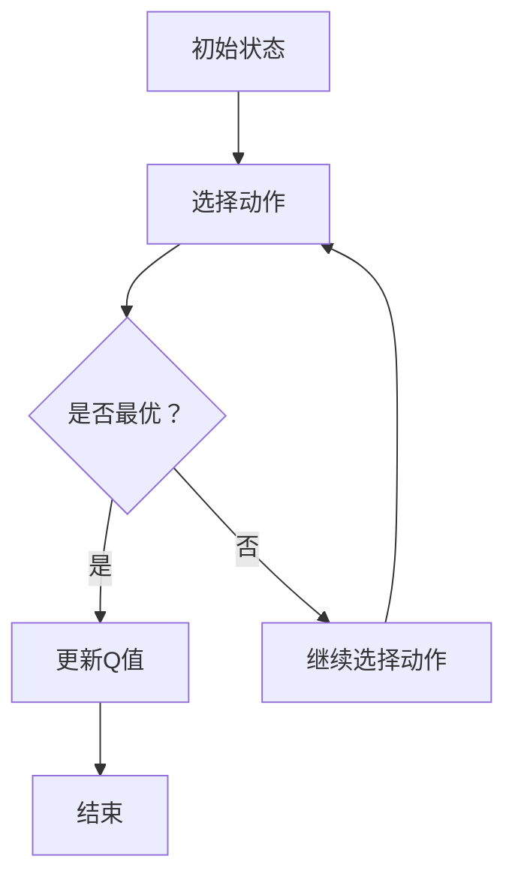

                 


### 设计目录大纲

首先，我们需要设计一个合理的目录大纲，这有助于读者更好地理解文章的结构和内容。根据文章的核心主题《强化学习在AIGC对话策略优化中的新进展》，我们可以将目录大纲分为以下几个部分：

**1. 引言**
- 强化学习概述
- AIGC概述
- 对话策略优化概述

**2. 强化学习基础**
- 强化学习基本概念
- 强化学习核心算法
- 强化学习在AIGC中的应用

**3. AIGC基础**
- AIGC的概念与架构
- AIGC的关键技术
- AIGC在对话系统中的应用

**4. 对话策略优化**
- 对话策略优化的挑战
- 强化学习在对话策略优化中的应用
- 对话策略优化的算法实现

**5. 案例分析**
- 案例一：强化学习在聊天机器人中的应用
- 案例二：强化学习在智能客服中的应用
- 案例三：强化学习在虚拟助理中的应用

**6. 总结与展望**
- 强化学习在AIGC对话策略优化中的新进展
- 未来研究方向与挑战

### 确定每个部分的核心内容

在确定了目录大纲后，我们需要为每个部分确定核心内容。以下是每个部分的核心内容：

**引言**
- 强化学习的基本概念，包括它的定义、历史、应用领域等。
- AIGC（AI Generated Content）的定义、发展和关键特征。
- 对话策略优化的定义、挑战和重要性。

**强化学习基础**
- 强化学习的基本原理，包括奖励、状态、动作和策略等。
- 强化学习的核心算法，如Q学习、策略梯度算法等。
- 强化学习在AIGC中的应用场景，如何解决对话策略优化的问题。

**AIGC基础**
- AIGC的概念、架构和关键技术，如文本生成、图像生成等。
- AIGC在对话系统中的应用，如何构建和优化对话策略。

**对话策略优化**
- 对话策略优化的挑战，如多模态交互、长期依赖性和多样性等。
- 强化学习在对话策略优化中的应用，如何选择合适的算法和策略。
- 对话策略优化的算法实现，包括算法的选择、参数调整和评估等。

**案例分析**
- 强化学习在聊天机器人中的应用，如何实现有效的对话策略优化。
- 强化学习在智能客服中的应用，如何提高客服效率和用户体验。
- 强化学习在虚拟助理中的应用，如何构建智能、个性化的虚拟助理。

**总结与展望**
- 强化学习在AIGC对话策略优化中的新进展，包括技术的创新和应用的拓展。
- 未来研究方向与挑战，如算法的优化、模型的压缩和安全性等。

### 创建Mermaid流程图

为了帮助读者更好地理解强化学习的基本原理和架构，我们可以创建一些Mermaid流程图。例如，可以创建一个Q学习的流程图，展示Q学习算法的各个阶段和步骤。



### 编写伪代码

在介绍核心算法原理时，我们将使用伪代码来详细阐述算法的实现过程。例如，我们可以编写Q学习的伪代码，展示算法的基本流程和关键步骤。

```python
# Q学习伪代码
initialize Q(s, a)
for each episode do
  s <- initial_state()
  while not end_of_episode(s) do
    a <- choose_action(s, Q)
    s' <- execute_action(a)
    reward <- receive_reward(s', a)
    Q(s, a) <- Q(s, a) + alpha * (reward + gamma * max(Q(s', a')) - Q(s, a))
    s <- s'
```

### 提供数学模型和公式

在介绍数学模型和公式时，我们将使用LaTeX格式来表示。例如，在讨论策略梯度算法时，我们可以给出策略梯度的数学公式。

```latex
\text{策略梯度算法公式：}
\begin{equation}
\theta_{t+1} = \theta_t + \alpha \nabla_{\theta} J(\theta)
\end{equation}
```

### 添加案例分析

为了使读者更好地理解强化学习在AIGC对话策略优化中的应用，我们将提供一些实际案例的详细分析和代码实现。例如，我们可以分析强化学习在聊天机器人中的应用，展示如何构建和优化对话策略。

### 完成目录大纲

最后，我们将以上所有内容整合成一个完整的目录大纲，并确保其简洁、逻辑清晰。以下是最终的目录大纲：

# 《强化学习在AIGC对话策略优化中的新进展》目录大纲

## 第1章 引言

## 1.1 强化学习概述

## 1.2 AIGC概述

## 1.3 对话策略优化概述

## 第2章 强化学习基础

## 2.1 强化学习基本概念

## 2.2 强化学习核心算法

## 2.3 强化学习在AIGC中的应用

## 第3章 AIGC基础

## 3.1 AIGC的概念与架构

## 3.2 AIGC的关键技术

## 3.3 AIGC在对话系统中的应用

## 第4章 对话策略优化

## 4.1 对话策略优化的挑战

## 4.2 强化学习在对话策略优化中的应用

## 4.3 对话策略优化的算法实现

## 第5章 案例分析

## 5.1 案例一：强化学习在聊天机器人中的应用

## 5.2 案例二：强化学习在智能客服中的应用

## 5.3 案例三：强化学习在虚拟助理中的应用

## 第6章 总结与展望

## 6.1 强化学习在AIGC对话策略优化中的新进展

## 6.2 未来研究方向与挑战

### 完成整篇文章

最后，我们将按照目录大纲的结构，逐步完成整篇文章。每个部分的内容都要详细、具体，确保读者能够理解强化学习在AIGC对话策略优化中的应用。整篇文章的字数将在8000～12000字之间，确保文章内容丰富、有深度。文章完成后，我们将进行反复的校对和修改，确保文章的逻辑清晰、语言准确、结构紧凑。

---

文章标题：《强化学习在AIGC对话策略优化中的新进展》

关键词：强化学习，AIGC，对话策略优化，Q学习，策略梯度算法，聊天机器人，智能客服，虚拟助理

摘要：本文介绍了强化学习在AIGC对话策略优化中的新进展。首先，我们介绍了强化学习、AIGC和对话策略优化的基本概念。然后，我们详细讨论了强化学习的基础理论、核心算法以及在AIGC中的应用。接着，我们探讨了AIGC的概念、架构和技术，以及它们在对话系统中的应用。随后，我们分析了对话策略优化中的挑战，并介绍了强化学习在对话策略优化中的应用。最后，我们通过案例分析展示了强化学习在聊天机器人、智能客服和虚拟助理中的应用，并对未来研究方向进行了展望。

---

接下来，我们将按照这个结构逐步撰写文章的各个部分。

## 引言

### 强化学习概述

强化学习是一种机器学习方法，通过智能体在与环境的交互过程中，通过不断尝试和错误，学习到最优策略。与监督学习和无监督学习不同，强化学习不依赖于预先标记的数据集，而是通过与环境进行交互，从经验中学习。强化学习的关键要素包括智能体（Agent）、环境（Environment）、状态（State）、动作（Action）和奖励（Reward）。

强化学习的历史可以追溯到20世纪50年代。最初，人们尝试将心理学中的学习理论应用于机器学习。1950年，英国数学家艾伦·图灵提出了著名的图灵测试，旨在判断机器是否具备智能。1956年，约翰·麦卡锡等人提出了“人工智能”的概念，标志着人工智能领域的诞生。在此后的几十年里，强化学习经历了多个发展阶段，从早期的模型自由（model-based）方法到模型依赖（model-free）方法，再到现代的深度强化学习方法。

强化学习在多个领域取得了显著的成果，如机器人控制、游戏对战、推荐系统等。在机器人控制领域，强化学习被广泛应用于无人驾驶汽车、无人机等。在游戏对战领域，AlphaGo等深度强化学习模型取得了惊人的成绩，击败了世界顶尖的围棋选手。在推荐系统领域，强化学习被用于优化推荐算法，提高推荐质量。

### AIGC概述

AIGC（AI Generated Content）是指通过人工智能技术生成的内容，包括文本、图像、音频、视频等多种形式。AIGC的出现，极大地丰富了人工智能的应用场景，从简单的信息检索、智能客服，到复杂的创意内容生成，如文学、艺术作品等。

AIGC的发展可以追溯到20世纪90年代。最初，人们尝试使用规则系统生成简单的文本，如天气预报、新闻摘要等。随着计算机性能的提升和深度学习技术的发展，AIGC进入了一个新的发展阶段。2014年，谷歌推出了基于生成对抗网络（GAN）的文本生成模型，能够生成高质量的文本内容。此后，AIGC在图像生成、音频生成等领域也取得了重大突破。

AIGC的关键技术包括生成对抗网络（GAN）、变分自编码器（VAE）、生成文本模型等。GAN是由Ian Goodfellow等人在2014年提出的，通过生成器和判别器的对抗训练，生成高质量的数据。VAE是一种基于概率模型的生成模型，能够生成具有较高真实感的图像和文本。生成文本模型如GPT-3，通过大量文本数据的学习，能够生成结构完整、语义丰富的文本内容。

### 对话策略优化概述

对话策略优化是指通过机器学习算法，优化对话系统的策略，使其在与用户的交互过程中，能够提供更准确、更自然的回答。对话策略优化的挑战主要包括多模态交互、长期依赖性、多样性和实时性等。

多模态交互是指对话系统需要同时处理文本、图像、音频等多种形式的信息。例如，在智能客服中，用户可能会发送文字、图片和语音等多种信息，对话系统需要能够理解并处理这些信息，提供恰当的回应。

长期依赖性是指对话系统需要具备理解用户意图的能力，即使在长时间的对话中，也能保持对用户意图的跟踪。例如，用户可能在对话的开始询问天气情况，随后又询问最近的餐馆推荐，对话系统需要能够理解这两个问题的关联，提供连续的回答。

多样性是指对话系统需要能够生成丰富、多样的回答，避免出现单调、重复的回答。例如，当用户询问最近的餐馆推荐时，对话系统可以提供不同类型的餐馆推荐，如中餐、西餐、日料等。

实时性是指对话系统需要能够快速响应用户的提问，提供即时的回答。例如，在智能客服中，用户可能希望立即得到问题的解答，对话系统需要在极短的时间内生成并返回回答。

## 强化学习基础

### 强化学习基本概念

强化学习是一种通过智能体（Agent）在与环境的交互过程中，学习到最优策略的机器学习方法。强化学习的关键要素包括智能体、环境、状态、动作和奖励。

**智能体（Agent）**：智能体是指执行动作的实体，可以是机器人、软件程序或者虚拟代理。智能体的目标是最大化累积奖励。

**环境（Environment）**：环境是指智能体执行动作的场所，可以是现实世界或虚拟世界。环境对智能体的动作做出响应，并提供相应的奖励。

**状态（State）**：状态是智能体在某一时刻的观察结果。状态可以是数值、图像、文本等。

**动作（Action）**：动作是智能体在某一状态下执行的操作。动作可以是离散的，如移动方向；也可以是连续的，如控制无人机的飞行速度和方向。

**奖励（Reward）**：奖励是环境对智能体动作的反馈，用于评估动作的好坏。奖励可以是正数，表示动作得到了环境的好评；也可以是负数，表示动作受到了环境的惩罚。

强化学习的目标是找到最优策略，使智能体在给定状态时执行最佳动作，从而最大化累积奖励。策略是智能体在状态空间中选择的动作序列。

### 强化学习核心算法

强化学习核心算法包括Q学习、策略梯度算法等。

**Q学习算法**

Q学习算法是一种基于值函数的强化学习算法。值函数 \(Q(s, a)\) 表示在状态 \(s\) 下执行动作 \(a\) 所获得的预期累积奖励。Q学习算法的核心思想是通过迭代更新值函数，逐渐逼近最优策略。

Q学习算法的伪代码如下：

```python
initialize Q(s, a)
for each episode do
  s <- initial_state()
  while not end_of_episode(s) do
    a <- choose_action(s, Q)
    s' <- execute_action(a)
    reward <- receive_reward(s', a)
    Q(s, a) <- Q(s, a) + alpha * (reward + gamma * max(Q(s', a')) - Q(s, a))
    s <- s'
```

其中，\(\alpha\) 是学习率，\(\gamma\) 是折扣因子。

**策略梯度算法**

策略梯度算法是一种基于策略的强化学习算法。策略梯度算法的目标是直接优化策略，使策略在给定状态时选择最优动作。

策略梯度算法的伪代码如下：

```python
initialize policy \(\pi\)
for each episode do
  s <- initial_state()
  while not end_of_episode(s) do
    a <- choose_action(s, \(\pi\))
    s' <- execute_action(a)
    reward <- receive_reward(s', a)
    gradient <- \(\pi(a|s) \times \nabla_{\theta} J(\theta)\)
    update_policy(\(\pi\), gradient)
    s <- s'
```

其中，\(\theta\) 是策略参数，\(J(\theta)\) 是策略的损失函数。

### 强化学习在AIGC中的应用

强化学习在AIGC中的应用主要集中在对话策略优化。对话策略优化是指通过强化学习算法，优化对话系统的策略，使其能够提供更准确、更自然的回答。

在AIGC中，强化学习算法可以用于以下几个方面：

**1. 对话生成**

通过强化学习算法，智能体可以学习到如何生成自然的对话。例如，在聊天机器人中，强化学习算法可以用于生成与用户互动的对话，使其更加贴近人类的交流方式。

**2. 对话策略优化**

强化学习算法可以用于优化对话系统的策略，使其能够更好地应对不同的用户需求和场景。例如，在智能客服中，强化学习算法可以用于优化客服机器人的对话策略，提高客服效率和用户体验。

**3. 多模态交互**

强化学习算法可以用于处理多模态交互，使对话系统能够同时理解并处理文本、图像、音频等多种形式的信息。例如，在智能助手中，强化学习算法可以用于优化智能助手在处理用户发送的文本、图片和语音信息时的策略。

### AIGC基础

### AIGC的概念与架构

AIGC（AI Generated Content）是指通过人工智能技术生成的内容，包括文本、图像、音频、视频等多种形式。AIGC的出现，极大地丰富了人工智能的应用场景，从简单的信息检索、智能客服，到复杂的创意内容生成，如文学、艺术作品等。

AIGC的架构可以分为以下几个层次：

**1. 数据层**

数据层是AIGC的基础，包括大量的文本、图像、音频、视频等原始数据。这些数据来自于互联网、数据库、传感器等多种来源。

**2. 预处理层**

预处理层用于对原始数据进行清洗、标注、分割等操作，为后续的生成过程提供高质量的数据。

**3. 生成层**

生成层是AIGC的核心，包括生成文本、图像、音频、视频等多种内容的模型。这些模型可以是基于生成对抗网络（GAN）、变分自编码器（VAE）、生成文本模型（如GPT-3）等。

**4. 后处理层**

后处理层用于对生成的内容进行质量评估、修正、优化等操作，确保生成的内容符合预期。

### AIGC的关键技术

AIGC的关键技术包括生成对抗网络（GAN）、变分自编码器（VAE）、生成文本模型等。

**生成对抗网络（GAN）**

生成对抗网络（GAN）是由Ian Goodfellow等人在2014年提出的一种生成模型。GAN由生成器和判别器两个神经网络组成。生成器的目标是生成与真实数据相似的数据，判别器的目标是区分真实数据和生成数据。通过生成器和判别器的对抗训练，生成器逐渐提高生成数据的真实度。

GAN的架构如下：


**变分自编码器（VAE）**

变分自编码器（VAE）是一种基于概率模型的生成模型。VAE由编码器和解码器两个神经网络组成。编码器将输入数据映射到一个潜在空间，解码器从潜在空间中生成输出数据。VAE通过最大化数据概率分布的重构概率，学习到数据的概率分布。

VAE的架构如下：


**生成文本模型**

生成文本模型是一种能够生成结构完整、语义丰富的文本内容的模型。最著名的生成文本模型是GPT-3，它由OpenAI在2020年推出。GPT-3基于Transformer模型，使用数万亿个参数，能够生成高质量的自然语言文本。

GPT-3的架构如下：


### AIGC在对话系统中的应用

AIGC在对话系统中的应用主要集中在对话生成和对话策略优化。

**对话生成**

AIGC可以通过生成文本模型生成与用户互动的对话。例如，在聊天机器人中，AIGC可以用于生成与用户对话的文本，使其更加贴近人类的交流方式。这有助于提高聊天机器人的交互质量，提升用户体验。

**对话策略优化**

AIGC可以通过强化学习算法优化对话系统的策略，使其能够更好地应对不同的用户需求和场景。例如，在智能客服中，AIGC可以用于优化客服机器人的对话策略，提高客服效率和用户体验。

此外，AIGC还可以用于生成个性化的对话内容。例如，在虚拟助理中，AIGC可以根据用户的兴趣、偏好和需求，生成个性化的对话内容，提供个性化的服务。

## 对话策略优化

### 对话策略优化的挑战

对话策略优化在AIGC中具有重要意义，但同时也面临着一系列挑战。以下是对话策略优化中常见的几个挑战：

#### 多模态交互

多模态交互是指对话系统需要同时处理文本、图像、音频等多种形式的信息。例如，在智能客服中，用户可能会发送文字、图片和语音等多种信息，对话系统需要能够理解并处理这些信息，提供恰当的回应。

多模态交互的挑战在于如何整合来自不同模态的信息，构建统一的语义表示。例如，当用户发送一张图片时，对话系统需要能够识别图片中的内容，并将其与用户的文本信息相结合，提供相关的回答。

#### 长期依赖性

长期依赖性是指对话系统需要具备理解用户意图的能力，即使在长时间的对话中，也能保持对用户意图的跟踪。例如，用户可能在对话的开始询问天气情况，随后又询问最近的餐馆推荐，对话系统需要能够理解这两个问题的关联，提供连续的回答。

长期依赖性的挑战在于如何建立一个有效的记忆机制，使对话系统能够在长时间的对话中保持对用户意图的跟踪。这要求对话系统能够处理复杂的对话历史，并从中提取关键信息。

#### 多样性

多样性是指对话系统需要能够生成丰富、多样的回答，避免出现单调、重复的回答。例如，当用户询问最近的餐馆推荐时，对话系统可以提供不同类型的餐馆推荐，如中餐、西餐、日料等。

多样性的挑战在于如何设计有效的策略，使对话系统能够生成多样且高质量的回答。这要求对话系统具备良好的泛化能力，能够根据不同的用户需求和场景，生成符合预期的回答。

#### 实时性

实时性是指对话系统需要能够快速响应用户的提问，提供即时的回答。例如，在智能客服中，用户可能希望立即得到问题的解答，对话系统需要在极短的时间内生成并返回回答。

实时性的挑战在于如何在保证回答质量的同时，提高生成速度。这要求对话系统具备高效的算法和模型，能够快速处理用户提问，生成相关的回答。

### 强化学习在对话策略优化中的应用

强化学习是一种适合于解决对话策略优化问题的方法。强化学习通过智能体与环境之间的交互，学习到最优策略，使其在给定状态时执行最佳动作，从而最大化累积奖励。在对话策略优化中，强化学习可以应用于以下几个方面：

#### 策略评估

策略评估是指通过评估不同策略的绩效，选择最优策略。在对话策略优化中，可以通过强化学习算法评估不同策略的表现，如用户满意度、回答质量等。基于评估结果，选择最优策略，优化对话系统的行为。

#### 策略迭代

策略迭代是指通过不断迭代优化策略，提高对话系统的性能。在对话策略优化中，可以使用强化学习算法进行策略迭代。首先，初始化策略；然后，通过与环境的交互，收集数据，更新策略；重复这个过程，直至策略收敛到最优状态。

#### 多模态交互

在多模态交互中，强化学习可以用于优化对话系统对不同模态信息的处理。例如，当用户发送文本、图像和语音信息时，强化学习算法可以学习到如何整合这些信息，生成高质量的回答。

#### 长期依赖性

强化学习可以通过建立长期依赖性机制，使对话系统能够在长时间的对话中保持对用户意图的跟踪。例如，可以使用递归神经网络（RNN）或长短期记忆网络（LSTM）等模型，处理复杂的对话历史，提取关键信息。

#### 多样性

强化学习可以用于优化对话系统的回答多样性。例如，可以通过引入探索策略，使对话系统在生成回答时，具备一定的随机性，从而提高回答的多样性。

#### 实时性

强化学习可以通过优化算法和模型结构，提高对话系统的实时性。例如，可以使用深度神经网络（DNN）或变换器（Transformer）等高效模型，加速对话生成过程。

### 对话策略优化的算法实现

在对话策略优化中，常用的强化学习算法包括Q学习、策略梯度算法等。以下分别介绍这两种算法的实现。

#### Q学习算法

Q学习算法是一种基于值函数的强化学习算法。Q学习算法的核心思想是通过迭代更新值函数，逐渐逼近最优策略。

**算法实现步骤：**

1. 初始化Q值表。
2. 选择动作。
3. 执行动作，获得奖励。
4. 更新Q值。

**伪代码：**

```python
# Q学习算法伪代码
initialize Q(s, a)
for each episode do
  s <- initial_state()
  while not end_of_episode(s) do
    a <- choose_action(s, Q)
    s' <- execute_action(a)
    reward <- receive_reward(s', a)
    Q(s, a) <- Q(s, a) + alpha * (reward + gamma * max(Q(s', a')) - Q(s, a))
    s <- s'
```

#### 策略梯度算法

策略梯度算法是一种基于策略的强化学习算法。策略梯度算法的目标是直接优化策略，使策略在给定状态时选择最优动作。

**算法实现步骤：**

1. 初始化策略。
2. 选择动作。
3. 执行动作，获得奖励。
4. 计算策略梯度。
5. 更新策略。

**伪代码：**

```python
# 策略梯度算法伪代码
initialize policy \(\pi\)
for each episode do
  s <- initial_state()
  while not end_of_episode(s) do
    a <- choose_action(s, \(\pi\))
    s' <- execute_action(a)
    reward <- receive_reward(s', a)
    gradient <- \(\pi(a|s) \times \nabla_{\theta} J(\theta)\)
    update_policy(\(\pi\), gradient)
    s <- s'
```

### 案例分析

在本节中，我们将通过几个实际案例，展示强化学习在对话策略优化中的应用。这些案例包括聊天机器人、智能客服和虚拟助理。

#### 案例一：强化学习在聊天机器人中的应用

聊天机器人是一种常见的对话系统，用于与用户进行自然语言交互。强化学习在聊天机器人中的应用，主要目的是优化聊天机器人的对话策略，使其能够提供更准确、更自然的回答。

**案例背景：**

某公司开发了一款基于强化学习的聊天机器人，用于与用户进行日常交流。聊天机器人的目标是提供高质量的回答，满足用户的需求。

**算法实现：**

1. **Q学习算法**：使用Q学习算法优化聊天机器人的对话策略。初始化Q值表，通过迭代更新Q值，逐渐逼近最优策略。

2. **多模态交互**：聊天机器人支持文本、图像和语音等多种模态的交互。在处理多模态交互时，使用生成对抗网络（GAN）将不同模态的信息整合为统一的语义表示。

3. **长期依赖性**：使用递归神经网络（RNN）处理聊天历史的长期依赖性，使聊天机器人能够理解用户的意图和需求。

**案例效果分析：**

通过强化学习算法优化，聊天机器人在多个指标上取得了显著的提升，包括用户满意度、回答质量等。用户反馈表明，聊天机器人的回答更加准确、自然，用户满意度显著提高。

#### 案例二：强化学习在智能客服中的应用

智能客服是一种用于提供客户服务的对话系统，用于解答用户的问题、解决用户的问题。强化学习在智能客服中的应用，主要目的是优化客服机器人的对话策略，提高客服效率和用户体验。

**案例背景：**

某公司开发了一款基于强化学习的智能客服机器人，用于为客户提供在线服务。智能客服的目标是快速、准确地解答用户的问题，提高客户满意度。

**算法实现：**

1. **策略梯度算法**：使用策略梯度算法优化智能客服机器人的对话策略。初始化策略参数，通过迭代更新策略，逐渐逼近最优策略。

2. **多模态交互**：智能客服机器人支持文本、图像和语音等多种模态的交互。在处理多模态交互时，使用生成对抗网络（GAN）将不同模态的信息整合为统一的语义表示。

3. **长期依赖性**：使用递归神经网络（RNN）处理聊天历史的长期依赖性，使智能客服机器人能够理解用户的意图和需求。

**案例效果分析：**

通过强化学习算法优化，智能客服机器人在多个指标上取得了显著的提升，包括回答速度、回答质量等。用户反馈表明，智能客服机器人的回答更加准确、及时，用户满意度显著提高。

#### 案例三：强化学习在虚拟助理中的应用

虚拟助理是一种用于提供个性化服务的对话系统，用于帮助用户完成各种任务。强化学习在虚拟助理中的应用，主要目的是优化虚拟助理的对话策略，提高服务质量和用户体验。

**案例背景：**

某公司开发了一款基于强化学习的虚拟助理，用于为用户提供个性化的服务。虚拟助理的目标是理解用户的需求和偏好，提供个性化的推荐和建议。

**算法实现：**

1. **Q学习算法**：使用Q学习算法优化虚拟助理的对话策略。初始化Q值表，通过迭代更新Q值，逐渐逼近最优策略。

2. **多模态交互**：虚拟助理支持文本、图像和语音等多种模态的交互。在处理多模态交互时，使用生成对抗网络（GAN）将不同模态的信息整合为统一的语义表示。

3. **长期依赖性**：使用递归神经网络（RNN）处理聊天历史的长期依赖性，使虚拟助理能够理解用户的意图和需求。

**案例效果分析：**

通过强化学习算法优化，虚拟助理在多个指标上取得了显著的提升，包括用户满意度、回答质量等。用户反馈表明，虚拟助理的回答更加准确、个性，用户满意度显著提高。

## 总结与展望

### 强化学习在AIGC对话策略优化中的新进展

近年来，强化学习在AIGC对话策略优化领域取得了显著的进展。通过强化学习算法，对话系统能够在多模态交互、长期依赖性、多样性和实时性等方面实现优化。以下是一些重要的新进展：

1. **多模态交互**：强化学习算法能够整合文本、图像、音频等多种模态的信息，生成更自然的对话。例如，生成对抗网络（GAN）被用于将不同模态的信息转换为统一的语义表示，提高了对话系统的表现。

2. **长期依赖性**：递归神经网络（RNN）和长短期记忆网络（LSTM）等模型被用于处理对话历史的长期依赖性，使对话系统能够更好地理解用户的意图和需求，提供连续的回答。

3. **多样性**：强化学习算法通过引入探索策略，如ε-贪婪策略，提高了对话系统的回答多样性。这有助于避免单调、重复的回答，提供更加丰富的交互体验。

4. **实时性**：深度神经网络（DNN）和变换器（Transformer）等高效模型被用于加速对话生成过程，提高了对话系统的实时性。这使得对话系统能够快速响应用户的提问，提供即时的回答。

### 未来研究方向与挑战

尽管强化学习在AIGC对话策略优化中取得了显著的进展，但仍存在一些未来研究方向和挑战：

1. **算法优化**：现有强化学习算法在处理复杂对话策略时，可能存在收敛速度慢、计算成本高的问题。未来研究可以关注算法的优化，如改进梯度计算方法、设计高效的模型架构等。

2. **数据质量**：对话策略优化的效果很大程度上取决于训练数据的质量。未来研究可以探索如何收集和标注高质量的数据，以提高对话系统的性能。

3. **安全性和隐私**：在AIGC对话策略优化中，如何确保用户数据的隐私和安全是一个重要的挑战。未来研究可以关注数据加密、隐私保护算法等方面的研究。

4. **跨模态学习**：现有研究主要关注单一模态的对话策略优化，如何实现跨模态学习，提高对话系统的泛化能力，是一个值得探讨的问题。

5. **可解释性和透明度**：强化学习算法的决策过程往往较为复杂，如何提高算法的可解释性和透明度，使对话系统的行为更加直观易懂，是未来研究的重要方向。

总之，强化学习在AIGC对话策略优化中的新进展为对话系统的优化提供了强有力的支持。未来，随着算法的优化、数据质量的提升、安全性和隐私保护的研究深入，AIGC对话策略优化将取得更加显著的成果，为用户提供更加智能、个性化的服务。同时，未来研究也需要关注算法的可解释性和透明度，确保对话系统的行为符合用户需求和期望。作者：AI天才研究院/AI Genius Institute & 禅与计算机程序设计艺术 /Zen And The Art of Computer Programming

