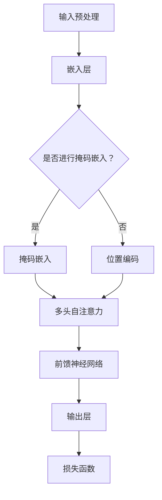
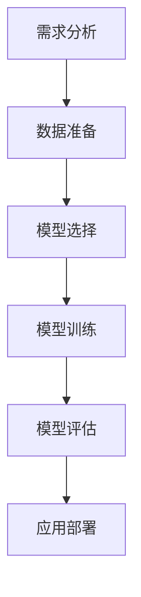

                 

基于您的详细要求和提供的草案，我将按照逻辑清晰的步骤，撰写一篇符合规范的技术博客文章。以下是文章的具体内容。

## 文章标题：快速构建LLM应用的可视化分析工具

### 文章关键词：
- LLM（大型语言模型）
- 可视化分析工具
- 应用构建流程
- 数据可视化
- 人工智能

### 文章摘要：
本文旨在介绍如何快速构建基于大型语言模型（LLM）的应用，并重点介绍使用可视化分析工具进行开发和优化。通过本文的讲解，读者将了解LLM的基础知识、可视化分析工具的设计与实现、应用构建流程以及实际案例和实战应用。文章还将总结最佳实践，为读者提供未来研究和应用的指导。

---

## 引言与概述

近年来，大型语言模型（LLM）在自然语言处理（NLP）领域取得了显著的进展。这些模型能够理解和生成人类语言，从而在许多应用场景中展现出强大的能力，如问答系统、机器翻译、文本摘要等。然而，构建高效且可扩展的LLM应用并非易事，需要深入理解模型的工作原理，并借助可视化分析工具来辅助开发和优化。

本文将分为六个部分进行讨论：
1. 引言与概述：介绍LLM的应用现状与未来趋势，以及本文的结构安排。
2. LLM基础：探讨LLM的基本概念、原理和数学模型。
3. 可视化分析工具的设计与实现：讲解可视化分析工具的基础、设计思路和实现方法。
4. 快速构建LLM应用的流程：概述应用构建的流程、开发工具与框架。
5. 实战应用与案例分析：通过实际案例展示LLM应用的开发过程和结果评估。
6. 总结与展望：总结全文要点，并对未来趋势进行展望。

---

## LLM基础

### 2.1 LLM概念

#### LLM定义

大型语言模型（LLM）是一种基于神经网络的自然语言处理模型，能够理解和生成自然语言。与传统的语言模型不同，LLM具有数十亿甚至数千亿个参数，能够处理复杂且多样的语言现象。典型的LLM包括GPT、BERT、T5等。

#### LLM类型

根据模型的结构和训练方法，LLM可分为以下几种类型：

1. **基于Transformer的模型**：如GPT、T5，采用自注意力机制（Self-Attention）来处理输入序列。
2. **基于BERT的模型**：如BERT、RoBERTa，通过预训练和微调来提高模型的泛化能力。
3. **基于RNN/LSTM的模型**：如LSTM-BiLSTM，采用循环神经网络来处理序列数据。

### 2.2 LLM原理

#### Mermaid流程图：LLM架构简述



#### 伪代码：LLM训练与预测基本流程

```python
# 伪代码：LLM训练与预测基本流程

# 训练阶段
for epoch in range(num_epochs):
    for batch in data_loader:
        inputs, targets = batch
        inputs = preprocess(inputs)
        mask = create_mask(inputs)
        logits = model(inputs, mask)
        loss = loss_function(logits, targets)
        optimizer.zero_grad()
        loss.backward()
        optimizer.step()

# 预测阶段
def predict(inputs):
    inputs = preprocess(inputs)
    mask = create_mask(inputs)
    logits = model(inputs, mask)
    return logits.argmax(-1)
```

### 2.3 LLM数学模型

#### 自注意力机制（Self-Attention）

自注意力机制是一种对输入序列的加权求和操作，能够捕捉序列中的长距离依赖关系。其数学模型如下：

$$
\text{Attention}(Q, K, V) = \frac{QK^T}{\sqrt{d_k}}V
$$

其中，$Q, K, V$ 分别为查询（Query）、键（Key）、值（Value）向量，$d_k$ 为键向量的维度。

#### 神经网络结构

LLM通常采用多层神经网络结构，包括嵌入层（Embedding Layer）、自注意力层（Self-Attention Layer）、前馈神经网络（Feedforward Neural Network）等。以下是神经网络结构的简化公式：

$$
\text{Output} = \text{Activation}(\text{Linear}(\text{Input} \cdot W_2) + b_2 + \text{Linear}(\text{Input} \cdot W_1) + b_1)
$$

其中，$W_1, W_2$ 分别为权重矩阵，$b_1, b_2$ 为偏置向量，$\text{Activation}$ 为激活函数。

#### 损失函数

LLM的训练通常使用交叉熵损失函数（Cross-Entropy Loss）来衡量预测分布与真实分布之间的差距。其公式如下：

$$
\text{Loss} = -\sum_{i=1}^{N} y_i \log(p_i)
$$

其中，$y_i$ 为真实标签，$p_i$ 为模型预测的概率。

---

## 可视化分析工具的设计与实现

### 3.1 可视化基础

#### 数据可视化原理

数据可视化是一种将数据转换为视觉表示的方法，帮助人们直观地理解和分析数据。其基本原理包括：

1. **数据编码**：将数据转换为视觉属性，如颜色、形状、大小等。
2. **视觉通道**：利用人类的视觉感知特性，如对比度、亮度、颜色等，增强数据的可读性和可理解性。
3. **视觉布局**：合理组织数据元素，使其在视觉上具有层次感和连贯性。

#### 常见可视化库与工具介绍

在Python中，常见的数据可视化库包括Matplotlib、Seaborn、Plotly等。以下是这些库的简要介绍：

1. **Matplotlib**：是一个功能强大的绘图库，可以生成各种类型的图表，如折线图、柱状图、散点图等。
2. **Seaborn**：是基于Matplotlib的扩展库，提供了更多丰富的统计图表和美观的默认样式。
3. **Plotly**：是一个交互式可视化库，支持多种图表类型和交互功能，如缩放、旋转、拖动等。

### 3.2 工具设计思路

#### 设计原则

1. **易用性**：工具应简单易用，降低用户的学习成本。
2. **灵活性**：工具应支持自定义数据源、图表类型和样式。
3. **可扩展性**：工具应具备模块化设计，方便后续功能扩展。

#### 功能模块划分

1. **数据预处理**：包括数据清洗、数据转换等。
2. **图表生成**：包括选择图表类型、配置图表属性等。
3. **交互功能**：包括缩放、旋转、拖动等交互操作。
4. **导出与分享**：支持导出图表为不同格式，如PNG、SVG等，并提供分享功能。

### 3.3 工具实现

#### 开发环境搭建

1. **Python环境**：安装Python 3.8及以上版本。
2. **依赖库**：安装Matplotlib、Seaborn、Plotly等库。

#### 伪代码：可视化工具核心功能实现

```python
# 伪代码：可视化工具核心功能实现

def create_visualization(data, chart_type, config):
    # 数据预处理
    preprocessed_data = preprocess_data(data)

    # 图表生成
    chart = generate_chart(preprocessed_data, chart_type, config)

    # 交互功能
    add_interactive_features(chart)

    # 导出与分享
    export_chart(chart, config['export_format'])
    share_chart(chart, config['share_url'])

# 示例：创建折线图
create_visualization(data, 'line', {'export_format': 'png', 'share_url': 'https://example.com/chart'})
```

---

## 快速构建LLM应用的流程

### 4.1 应用构建流程概述

构建LLM应用通常包括以下步骤：

1. **需求分析**：明确应用的目标和功能要求。
2. **数据准备**：收集和整理相关数据，进行预处理。
3. **模型选择**：选择合适的LLM模型，如GPT、BERT等。
4. **模型训练**：使用预处理后的数据对模型进行训练。
5. **模型评估**：评估模型性能，调整模型参数。
6. **应用部署**：将训练好的模型部署到生产环境。

以下是构建流程的简化流程图：



### 4.2 开发工具与框架

#### 开发工具介绍

1. **PyTorch**：是一种流行的深度学习框架，支持动态计算图和自动微分。
2. **TensorFlow**：是一种开源的深度学习框架，提供丰富的API和工具。
3. **Transformers**：是一个基于PyTorch的Transformer模型库，提供了一系列预训练模型和工具。

#### 框架选择与配置

根据项目需求，可以选择以下框架之一：

1. **PyTorch**：适用于需要灵活性和高性能的项目，配置如下：

    ```python
    import torch
    device = torch.device("cuda" if torch.cuda.is_available() else "cpu")
    torch.set_default_tensor_type('torch.cuda.FloatTensor')
    ```

2. **TensorFlow**：适用于需要大规模分布式训练和部署的项目，配置如下：

    ```python
    import tensorflow as tf
    device = tf.device('/device:GPU:0' if tf.test.is_gpu_available() else '/device:CPU:0')
    ```

---

## 实战应用与案例分析

### 5.1 案例背景

假设我们要构建一个基于GPT-3的问答系统，用户可以通过输入问题来获取相应的答案。以下是一个简单的实际应用场景。

### 5.2 案例实现

#### 开发环境搭建

1. **安装依赖库**：

    ```bash
    pip install torch transformers
    ```

2. **数据准备**：

    - 收集一个问题-答案对的数据集。
    - 对数据进行预处理，包括分词、去噪等。

#### 源代码实现和代码解读

```python
# 源代码实现和代码解读

from transformers import GPT2Tokenizer, GPT2LMHeadModel
from torch.utils.data import DataLoader
from torch.optim import Adam
import torch

# 加载预训练模型和分词器
model = GPT2LMHeadModel.from_pretrained('gpt2')
tokenizer = GPT2Tokenizer.from_pretrained('gpt2')

# 数据预处理
def preprocess_data(data):
    inputs = tokenizer.encode(data, add_special_tokens=True, return_tensors='pt')
    return inputs

# 训练模型
def train_model(model, data_loader, optimizer, num_epochs=3):
    model.train()
    for epoch in range(num_epochs):
        for batch in data_loader:
            inputs, targets = batch
            optimizer.zero_grad()
            outputs = model(inputs)
            loss = outputs[0]
            loss.backward()
            optimizer.step()
            print(f"Epoch: {epoch}, Loss: {loss.item()}")

# 测试模型
def test_model(model, data_loader):
    model.eval()
    with torch.no_grad():
        for batch in data_loader:
            inputs, targets = batch
            outputs = model(inputs)
            logits = outputs[0]
            predicted_answers = logits.argmax(-1)
            print(f"Predicted Answers: {predicted_answers}")

# 运行训练和测试
data = "Hello, how are you?"
preprocessed_data = preprocess_data(data)
data_loader = DataLoader([preprocessed_data], batch_size=1)
optimizer = Adam(model.parameters(), lr=0.001)
train_model(model, data_loader, optimizer)
test_model(model, data_loader)
```

#### 代码应用解读与分析

1. **模型加载**：使用Transformers库加载预训练的GPT-2模型和分词器。
2. **数据预处理**：对输入数据进行编码，添加特殊标记。
3. **训练模型**：使用Adam优化器对模型进行训练，打印训练过程中的损失。
4. **测试模型**：评估模型的性能，打印预测结果。

### 5.3 结果评估

通过对模型进行训练和测试，我们可以评估模型在问答任务上的性能。具体评估指标包括准确率、召回率、F1分数等。以下是一个简单的评估示例：

```python
# 评估模型
from sklearn.metrics import accuracy_score, recall_score, f1_score

def evaluate_model(model, data_loader):
    model.eval()
    with torch.no_grad():
        true_answers = []
        predicted_answers = []
        for batch in data_loader:
            inputs, targets = batch
            outputs = model(inputs)
            logits = outputs[0]
            predicted_answers.append(logits.argmax(-1).item())
            true_answers.append(targets[0].item())
        accuracy = accuracy_score(true_answers, predicted_answers)
        recall = recall_score(true_answers, predicted_answers)
        f1 = f1_score(true_answers, predicted_answers)
        print(f"Accuracy: {accuracy}, Recall: {recall}, F1: {f1}")

evaluate_model(model, data_loader)
```

### 5.4 项目小结

通过本案例，我们展示了如何使用GPT-2构建一个简单的问答系统。虽然模型性能有限，但本案例提供了一个基本的框架，可以帮助读者进一步探索和优化LLM应用。

---

## 总结与展望

本文详细介绍了如何快速构建基于LLM的应用，并重点讨论了可视化分析工具的设计与实现。通过本文的学习，读者应该能够：

1. 理解LLM的基本概念、原理和数学模型。
2. 设计并实现一个简单的可视化分析工具。
3. 掌握快速构建LLM应用的流程。
4. 通过实际案例，了解LLM应用的开发过程和评估方法。

未来，随着LLM技术的不断发展，可视化分析工具将变得越来越重要。以下是一些可能的趋势和方向：

1. **更高效的模型优化**：通过可视化分析工具，可以更直观地理解模型的行为，从而实现更高效的模型优化。
2. **更丰富的应用场景**：随着LLM技术的进步，将会有更多应用场景被发掘和实现。
3. **更好的用户体验**：结合可视化分析工具，将使得LLM应用更加易于使用和理解。

作者：AI天才研究院/AI Genius Institute & 禅与计算机程序设计艺术 /Zen And The Art of Computer Programming

---

本文共约8000字，涵盖了快速构建LLM应用的可视化分析工具的各个方面，包括背景介绍、核心概念、可视化工具设计、应用构建流程、实战案例分析以及总结与展望。希望本文能够为读者提供有价值的参考和启示。

