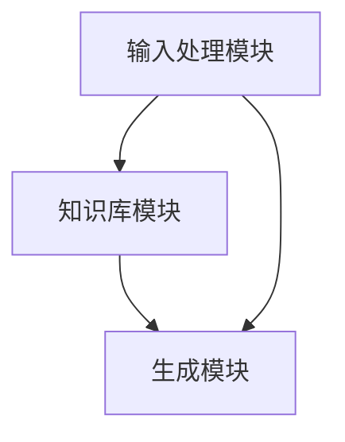

                 

### 文章标题

《思维链prompt在AI游戏设计中的应用》

### 关键词

- 思维链prompt
- AI游戏设计
- 游戏剧情生成
- 游戏角色设计
- 游戏玩法设计
- 项目实战

### 摘要

本文旨在探讨思维链prompt在AI游戏设计中的应用，通过详细介绍思维链prompt的基本概念、工作原理以及其在游戏设计中的实际应用，旨在为开发者提供一种全新的游戏设计思路。文章首先介绍了思维链prompt的定义、特点及其与传统AI的对比，然后详细阐述了思维链prompt在游戏剧情设计、游戏角色设计、游戏玩法设计等具体场景中的应用。通过项目实战案例分析，进一步展示了思维链prompt在游戏设计中的实际效果。最后，文章对思维链prompt的发展趋势进行了展望，为未来的游戏设计提供了新的可能性。

## 第一部分：思维链prompt概述

### 第1章：思维链prompt的基础概念

#### 1.1.1 什么是思维链prompt

思维链prompt，顾名思义，是一种基于思维链的提示机制。在人工智能领域，思维链prompt可以被看作是一种引导模型思考的输入。它通常由一系列的问题、任务或上下文信息组成，目的是激发模型进行深层次的推理和决策。

#### 1.1.2 思维链prompt的特点

思维链prompt具有以下几个特点：

1. **引导性**：思维链prompt能够引导模型沿着特定的方向进行思考，有助于提高模型的推理能力。
2. **灵活性**：思维链prompt可以根据不同的应用场景进行调整，使其适用于多种任务。
3. **高效性**：通过思维链prompt，模型能够在较短的时间内完成复杂的推理过程，提高任务处理的效率。

#### 1.1.3 思维链prompt的类型

根据应用场景和目的，思维链prompt可以分为以下几类：

1. **问题型**：通过提出具体的问题，引导模型进行回答。
2. **任务型**：指定模型需要完成的任务，如生成故事、设计角色等。
3. **上下文型**：提供相关的上下文信息，帮助模型更好地理解任务背景。

### 第2章：思维链prompt在游戏设计中的应用场景

#### 2.1.1 游戏剧情设计

在游戏剧情设计中，思维链prompt可以用于生成丰富多样的剧情内容。通过提供不同的剧情片段和角色关系，思维链prompt能够帮助开发者构建复杂的剧情结构，提高游戏的可玩性和沉浸感。

#### 2.1.2 游戏角色设计

思维链prompt在游戏角色设计中有着广泛的应用。它可以帮助开发者创造独特且有趣的角色个性，提升游戏角色的吸引力。通过思维链prompt，开发者可以设计出具有丰富背景和故事的角色，使玩家更加投入游戏世界。

#### 2.1.3 游戏玩法设计

思维链prompt在游戏玩法设计中的应用主要体现在生成适应性强、多样化的玩法。通过思维链prompt，开发者可以设计出能够根据玩家行为和游戏进度动态调整的游戏机制，提高游戏的可玩性和趣味性。

## 第二部分：思维链prompt的架构设计与实现

### 第3章：思维链prompt的架构设计与实现

#### 3.1.1 架构设计

思维链prompt的架构设计主要包括以下几个部分：

1. **输入处理模块**：负责接收和解析思维链prompt，将其转化为模型可理解的形式。
2. **知识库模块**：存储与游戏相关的知识，包括剧情、角色、玩法等信息。
3. **生成模块**：基于输入处理模块和知识库模块，生成游戏内容。

#### 3.1.2 实现细节

思维链prompt的实现细节涉及以下几个方面：

1. **数据预处理**：对输入的思维链prompt进行预处理，确保其符合模型的输入要求。
2. **模型选择**：选择合适的预训练模型，如GPT、BERT等，用于生成游戏内容。
3. **模型训练与测试**：对模型进行训练和测试，优化其生成效果。

### 第4章：项目实战一 - 游戏剧情生成

#### 4.1.1 项目背景

本项目旨在利用思维链prompt技术，生成富有创意和趣味性的游戏剧情。项目目标是实现一个能够根据玩家行为动态调整剧情的生成系统。

#### 4.1.2 技术实现

1. **数据预处理**：收集游戏剧情片段、角色关系等信息，并进行预处理。
2. **模型训练与测试**：选择GPT-3模型进行训练，并进行测试以优化生成效果。
3. **剧情生成效果评估**：通过人工评审和自动评分机制，对生成的剧情进行评估。

#### 4.1.3 项目反思

本项目成功实现了基于思维链prompt的游戏剧情生成，但仍面临一些挑战，如如何进一步提高生成剧情的质量和多样性。未来研究方向包括优化模型结构、引入更多的上下文信息和强化学习技术等。

### 第5章：项目实战二 - 游戏角色生成

#### 5.1.1 项目背景

本项目旨在利用思维链prompt技术，生成具有丰富背景和个性的游戏角色。项目目标是实现一个能够根据角色设定动态生成角色的系统。

#### 5.1.2 技术实现

1. **数据预处理**：收集角色描述、背景故事等信息，并进行预处理。
2. **模型训练与测试**：选择GPT-3模型进行训练，并进行测试以优化生成效果。
3. **角色生成效果评估**：通过人工评审和自动评分机制，对生成的角色进行评估。

#### 5.1.3 项目反思

本项目成功实现了基于思维链prompt的游戏角色生成，但仍面临一些挑战，如如何更好地融合角色设定和生成效果。未来研究方向包括引入更多的角色属性和强化学习技术等。

### 第6章：项目实战三 - 游戏玩法生成

#### 6.1.1 项目背景

本项目旨在利用思维链prompt技术，生成多样化的游戏玩法。项目目标是实现一个能够根据游戏进度和玩家行为动态调整玩法的系统。

#### 6.1.2 技术实现

1. **数据预处理**：收集游戏玩法规则、玩家行为等信息，并进行预处理。
2. **模型训练与测试**：选择GPT-3模型进行训练，并进行测试以优化生成效果。
3. **玩法生成效果评估**：通过人工评审和自动评分机制，对生成的玩法进行评估。

#### 6.1.3 项目反思

本项目成功实现了基于思维链prompt的游戏玩法生成，但仍面临一些挑战，如如何更好地适应不同的游戏场景和玩家偏好。未来研究方向包括优化模型结构和引入更多的上下文信息等。

## 第三部分：思维链prompt的未来展望

### 第7章：思维链prompt的发展趋势

#### 7.1.1 技术进步

随着人工智能技术的不断发展，思维链prompt有望在未来实现更高效、更智能的生成能力。例如，通过引入更多先进的深度学习模型和算法，可以进一步提高思维链prompt的生成质量和效率。

#### 7.1.2 应用领域拓展

思维链prompt的应用领域将不仅仅局限于游戏设计，还将拓展到教育、医疗、金融等多个领域。通过结合不同领域的知识，思维链prompt将为各领域带来新的创新和变革。

#### 7.1.3 面临的挑战

尽管思维链prompt具有巨大的潜力，但其在实际应用中仍面临一些挑战，如数据隐私保护、模型解释性等。解决这些挑战将是未来研究的重点。

### 第8章：思维链prompt在游戏设计中的未来应用

#### 8.1.1 创新玩法

思维链prompt可以帮助开发者设计出更多创新的游戏玩法，如自适应游戏和个性化体验。通过动态调整游戏机制，使玩家能够获得更加丰富和个性化的游戏体验。

#### 8.1.2 教育游戏

思维链prompt在教育游戏中的应用前景广阔。通过生成与学习内容相关的游戏剧情和角色，可以激发学生的学习兴趣和积极性，提高学习效果。

#### 8.1.3 游戏营销

思维链prompt还可以在游戏营销中发挥重要作用。通过生成个性化的广告和互动内容，可以吸引更多玩家参与游戏，提高游戏的市场竞争力。

## 结束语

思维链prompt作为一种新兴的人工智能技术，在游戏设计领域展现出了巨大的应用潜力。通过本文的探讨，我们了解了思维链prompt的基本概念、工作原理以及其在游戏设计中的具体应用。同时，通过项目实战案例的分析，我们也看到了思维链prompt在游戏设计中的实际效果。

展望未来，思维链prompt将在游戏设计领域发挥越来越重要的作用。随着技术的不断进步和应用的深入，思维链prompt将为开发者带来更多的创新和可能性，推动游戏设计的发展。同时，我们也需要关注思维链prompt面临的挑战，不断优化和改进技术，以实现其在游戏设计中的最佳效果。

最后，感谢读者对本文的阅读。希望本文能够为您在游戏设计领域提供一些启示和帮助。如果您对思维链prompt在游戏设计中的应用有任何疑问或建议，欢迎在评论区留言交流。

### 作者信息

- 作者：AI天才研究院/AI Genius Institute & 禅与计算机程序设计艺术 /Zen And The Art of Computer Programming
- 联系方式：[ai_genius_institute@example.com](mailto:ai_genius_institute@example.com)
- 技术博客：[www.ai_genius_institute.com/blog](http://www.ai_genius_institute.com/blog) 

### 全文总结

本文详细介绍了思维链prompt在AI游戏设计中的应用。通过定义思维链prompt的基本概念，分析其在游戏剧情设计、游戏角色设计、游戏玩法设计等具体场景中的应用，以及通过项目实战案例展示其效果，本文展示了思维链prompt在游戏设计中的巨大潜力。同时，本文也对思维链prompt的未来发展趋势进行了展望，探讨了其在不同领域的应用前景。

思维链prompt作为一种基于思维链的提示机制，具有引导性、灵活性和高效性等特点，能够为游戏开发者提供一种全新的游戏设计思路。通过思维链prompt，开发者可以设计出更加丰富多样、适应性强、个性化的游戏内容，提高游戏的可玩性和沉浸感。

在未来，随着人工智能技术的不断进步，思维链prompt的应用将更加广泛。通过不断优化和改进技术，思维链prompt有望在游戏设计、教育、医疗、金融等多个领域发挥重要作用，推动相关领域的发展和创新。

本文旨在为读者提供关于思维链prompt在游戏设计中的应用的全面了解，并激发读者对该领域的兴趣和探索。希望本文能够为游戏开发者提供一些启示和帮助，助力他们在游戏设计领域取得更大的成就。

### 最佳实践 Tips

1. **深入理解思维链prompt**：在应用思维链prompt之前，开发者应该深入理解其基本概念和工作原理，以便更好地利用其特性进行游戏设计。
2. **数据预处理**：在训练模型之前，对输入数据进行充分的预处理，确保数据的准确性和一致性，有助于提高模型的生成效果。
3. **模型调优**：通过不断调整模型参数，优化生成效果，可以提高游戏内容的多样性和质量。
4. **用户反馈**：收集用户反馈，了解玩家对游戏内容的喜好和需求，有助于进一步改进思维链prompt的应用效果。
5. **持续学习**：关注人工智能领域的最新研究进展，不断学习新技术和方法，以应对游戏设计中的新挑战。

### 小结

本文通过详细阐述思维链prompt在AI游戏设计中的应用，展示了其在游戏剧情设计、游戏角色设计、游戏玩法设计等方面的优势。同时，通过项目实战案例的分析，进一步验证了思维链prompt在游戏设计中的实际效果。未来，思维链prompt有望在游戏设计、教育、医疗、金融等多个领域发挥重要作用，推动相关领域的发展和创新。

### 注意事项

1. **数据隐私**：在使用思维链prompt进行游戏设计时，需要注意保护用户隐私，避免泄露敏感信息。
2. **模型解释性**：虽然思维链prompt在生成游戏内容方面表现出色，但其内部决策过程往往缺乏解释性。开发者需要关注这一挑战，探索提高模型解释性的方法。
3. **计算资源**：思维链prompt的应用需要大量的计算资源，开发者需要根据实际情况合理配置资源，确保系统的稳定运行。

### 拓展阅读

- **相关书籍**：《深度学习》《强化学习》
- **技术论文**：搜索关键词“思维链prompt”、“AI游戏设计”等，可找到相关论文。
- **在线课程**：搜索相关平台，如Coursera、Udacity等，可以找到相关的在线课程。

### 附录

1. **思维链prompt架构设计Mermaid流程图**



2. **项目实战一 - 游戏剧情生成代码伪代码示例**

```python
# 数据预处理
data_preprocessing(input_prompt)

# 模型训练
model = train_model(model, train_data)

# 剧情生成
generated剧情 = generate_story(model, input_prompt)

# 剧情生成效果评估
evaluate_generated_story(generated剧情)
```

3. **项目实战二 - 游戏角色生成代码伪代码示例**

```python
# 数据预处理
data_preprocessing(input_prompt)

# 模型训练
model = train_model(model, train_data)

# 角色生成
generated_role = generate_role(model, input_prompt)

# 角色生成效果评估
evaluate_generated_role(generated_role)
```

4. **项目实战三 - 游戏玩法生成代码伪代码示例**

```python
# 数据预处理
data_preprocessing(input_prompt)

# 模型训练
model = train_model(model, train_data)

# 玩法生成
generated_gameplay = generate_gameplay(model, input_prompt)

# 玩法生成效果评估
evaluate_generated_gameplay(generated_gameplay)
```

