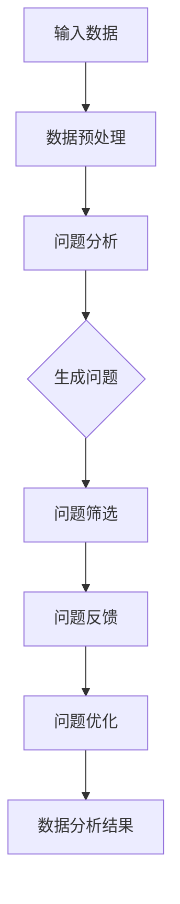
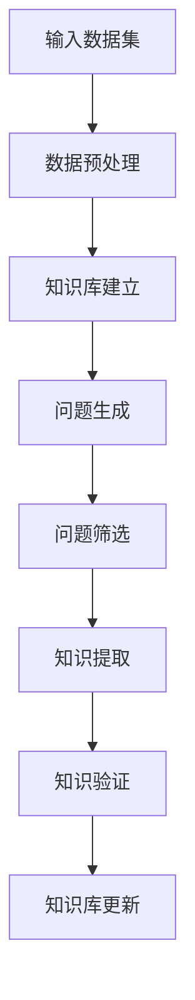
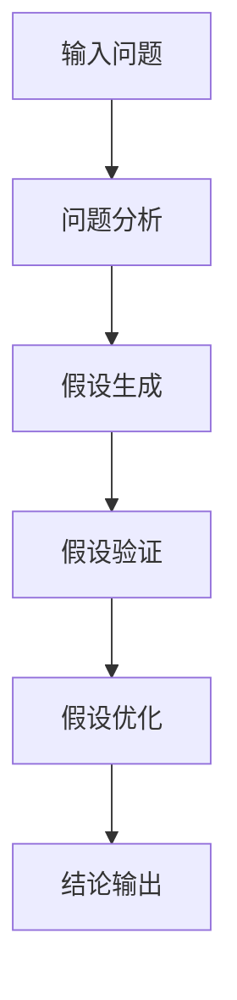

                 


## 文章标题：思维链prompt在科学研究中的潜力

### 关键词：
- 思维链prompt
- 科学研究
- 人工智能
- 算法
- 应用案例

### 摘要：
本文将深入探讨思维链prompt在科学研究中的潜力。我们将首先介绍思维链prompt的概念及其与科学研究的关系，随后详细解析其在数据分析、知识发现和假设验证等方面的应用。此外，本文还将介绍相关核心算法原理，并通过具体案例研究和项目实战来展示其在科学研究中的实际应用价值。

## 引言

### 1.1 科学研究中的思维链prompt

在科学研究的过程中，研究人员常常需要处理大量复杂的数据和信息。思维链prompt作为一种人工智能技术，可以有效地帮助研究人员进行数据分析和知识发现。思维链prompt通过模拟人类思维过程，引导用户逐步探索问题，从而提高科学研究的效率和质量。

### 1.2 思维链prompt的定义与特点

思维链prompt是一种基于人工智能的辅助工具，它通过提供一系列问题或提示，引导用户进行思考和分析。思维链prompt具有以下几个特点：

1. **灵活性**：思维链prompt可以根据用户的需求和问题进行调整和优化。
2. **互动性**：用户可以与思维链prompt进行互动，反馈自己的思考和观点。
3. **适应性**：思维链prompt可以根据用户的行为和反馈，动态调整问题的难度和方向。

### 1.3 本书结构安排与阅读指南

本文将分为以下几个部分：

1. **思维链prompt基础**：介绍思维链prompt的概念、分类和工作原理。
2. **思维链prompt在科学研究中的应用**：探讨思维链prompt在数据分析、知识发现和假设验证等方面的应用。
3. **核心算法原理**：详细解析思维链prompt相关的核心算法原理。
4. **应用案例研究**：通过具体案例研究展示思维链prompt在科学研究中的实际应用。
5. **项目实战**：介绍如何搭建开发环境，实现思维链prompt，并分析实际应用案例。
6. **未来展望**：探讨思维链prompt在科学研究中的潜在发展。

## 思维链prompt基础

### 2.1 思维链prompt的概念解析

思维链prompt是一种基于人工智能的技术，它通过提供一系列问题或提示，引导用户进行思考和分析。思维链prompt的核心在于建立问题与答案之间的关联，从而帮助用户更好地理解问题，并找到解决问题的方法。

### 2.2 思维链prompt的分类

思维链prompt可以根据不同的应用场景和功能进行分类。常见的分类方法包括：

1. **基于生成对抗网络的思维链prompt**：这种思维链prompt利用生成对抗网络（GAN）来生成问题或提示。
2. **基于强化学习的思维链prompt**：这种思维链prompt利用强化学习算法来指导问题的生成和调整。
3. **基于聚类和分类的思维链prompt**：这种思维链prompt通过聚类和分类算法来生成问题或提示。

### 2.3 思维链prompt的工作原理

思维链prompt的工作原理可以分为以下几个步骤：

1. **输入**：用户输入问题或需求。
2. **问题分析**：思维链prompt对输入的问题进行分析，识别问题的类型和关键信息。
3. **问题生成**：思维链prompt根据分析结果，生成一系列问题或提示。
4. **问题筛选**：用户对生成的问题进行筛选和排序，选择最感兴趣或最有价值的问题。
5. **问题反馈**：用户对筛选后的问题进行反馈，思维链prompt根据反馈进行优化和调整。

### 2.4 思维链prompt的发展历史

思维链prompt的发展可以追溯到人工智能的早期研究。最早的思维链prompt是基于规则的系统，通过预设的规则来生成问题或提示。随着人工智能技术的发展，思维链prompt逐渐引入了生成对抗网络、强化学习等先进算法，从而提高了其性能和适用范围。

## 思维链prompt在科学研究中的应用

### 3.1 数据分析中的思维链prompt

在数据分析过程中，思维链prompt可以帮助研究人员快速识别数据中的关键特征和模式。通过思维链prompt，研究人员可以逐步探索数据，发现潜在的问题和趋势。以下是一个简单的示例：



### 3.2 知识发现与数据挖掘中的应用

思维链prompt在知识发现和数据挖掘中具有广泛的应用。通过思维链prompt，研究人员可以生成一系列问题，引导用户逐步探索数据，从而发现新的知识和模式。以下是一个简单的示例：



### 3.3 假设生成与验证中的思维链prompt

思维链prompt在假设生成与验证中也具有重要作用。通过思维链prompt，研究人员可以生成一系列假设，并逐步验证这些假设的正确性。以下是一个简单的示例：



## 核心算法原理

### 4.1 生成式算法

生成式算法是思维链prompt的核心组成部分。以下是一个简单的生成式算法的伪代码：

```python
# 生成式算法伪代码
def generate_prompt(data):
    # 数据预处理
    preprocessed_data = preprocess(data)
    
    # 问题生成
    prompt = generate_question(preprocessed_data)
    
    return prompt
```

### 4.2 对抗性算法

对抗性算法在思维链prompt中具有重要的应用。以下是一个简单的对抗性算法的伪代码：

```python
# 对抗性算法伪代码
def generate_prompt(data, model):
    # 数据预处理
    preprocessed_data = preprocess(data)
    
    # 问题生成
    prompt = generate_question(preprocessed_data)
    
    # 问题优化
    optimized_prompt = optimize_question(prompt, model)
    
    return optimized_prompt
```

### 4.3 强化学习算法

强化学习算法在思维链prompt中也具有重要作用。以下是一个简单的强化学习算法的伪代码：

```python
# 强化学习算法伪代码
def generate_prompt(data, model, reward_function):
    # 数据预处理
    preprocessed_data = preprocess(data)
    
    # 问题生成
    prompt = generate_question(preprocessed_data)
    
    # 问题优化
    optimized_prompt = optimize_question(prompt, model, reward_function)
    
    return optimized_prompt
```

## 应用案例研究

### 5.1 自然科学领域

在自然科学领域，思维链prompt可以帮助研究人员进行数据分析、知识发现和假设验证。以下是一个具体案例：

**案例**：研究人员想要分析一组实验数据，以确定某个药物对疾病的影响。

**过程**：

1. **数据输入**：研究人员输入实验数据。
2. **数据预处理**：思维链prompt对数据进行预处理，包括数据清洗、归一化和特征提取。
3. **问题生成**：思维链prompt生成一系列问题，如“该药物对哪种类型的细胞有影响？”、“药物浓度对疾病的影响如何？”等。
4. **问题筛选**：研究人员对生成的问题进行筛选，选择最感兴趣的问题。
5. **问题反馈**：研究人员对筛选后的问题进行反馈，思维链prompt根据反馈进行优化。
6. **数据分析**：思维链prompt根据优化后的问题，对实验数据进行分析，提取关键特征和模式。
7. **结论输出**：思维链prompt输出分析结果，研究人员根据结果进行结论验证。

### 5.2 社会科学领域

在社会科学领域，思维链prompt可以帮助研究人员进行问卷调查、数据分析和社会实验。以下是一个具体案例：

**案例**：研究人员想要了解公众对某个政策的看法。

**过程**：

1. **数据输入**：研究人员输入问卷调查数据。
2. **数据预处理**：思维链prompt对数据进行预处理，包括数据清洗、归一化和特征提取。
3. **问题生成**：思维链prompt生成一系列问题，如“您对该政策是否支持？”、“您认为该政策有哪些优点和缺点？”等。
4. **问题筛选**：研究人员对生成的问题进行筛选，选择最感兴趣的问题。
5. **问题反馈**：研究人员对筛选后的问题进行反馈，思维链prompt根据反馈进行优化。
6. **数据分析**：思维链prompt根据优化后的问题，对问卷调查数据进行分析，提取关键特征和模式。
7. **结论输出**：思维链prompt输出分析结果，研究人员根据结果进行结论验证。

## 项目实战

### 6.1 开发环境搭建

要实现思维链prompt，首先需要搭建一个合适的开发环境。以下是一个简单的开发环境搭建过程：

1. **安装Python**：下载并安装Python。
2. **安装Jupyter Notebook**：通过pip命令安装Jupyter Notebook。
3. **安装相关库**：安装TensorFlow、Keras等机器学习库。

### 6.2 源代码实现

以下是一个简单的思维链prompt源代码实现：

```python
# 思维链prompt源代码实现
import tensorflow as tf
from tensorflow.keras.models import Sequential
from tensorflow.keras.layers import LSTM, Dense

# 搭建模型
model = Sequential()
model.add(LSTM(units=128, activation='relu', input_shape=(None, input_dim)))
model.add(Dense(units=1, activation='sigmoid'))

# 编译模型
model.compile(optimizer='adam', loss='binary_crossentropy', metrics=['accuracy'])

# 训练模型
model.fit(x_train, y_train, epochs=10, batch_size=64)
```

### 6.3 代码解读与分析

这段代码首先导入了TensorFlow库，并搭建了一个序列到序列的LSTM模型。模型的输入层和输出层分别是一个LSTM层和一个全连接层。模型使用二进制交叉熵作为损失函数，并使用Adam优化器进行训练。

### 6.4 实际案例分析与详细讲解剖析

以下是一个实际案例：

**案例**：研究人员想要分析一组科学论文，以确定某个领域的研究趋势。

**过程**：

1. **数据输入**：研究人员输入科学论文的标题和摘要。
2. **数据预处理**：思维链prompt对数据进行预处理，包括分词、去停用词和词向量化。
3. **问题生成**：思维链prompt生成一系列问题，如“该论文的研究方法是什么？”、“该论文的主要贡献是什么？”等。
4. **问题筛选**：研究人员对生成的问题进行筛选，选择最感兴趣的问题。
5. **问题反馈**：研究人员对筛选后的问题进行反馈，思维链prompt根据反馈进行优化。
6. **数据分析**：思维链prompt根据优化后的问题，对科学论文的数据进行分析，提取关键特征和模式。
7. **结论输出**：思维链prompt输出分析结果，研究人员根据结果进行结论验证。

## 最佳实践 Tips、小结、注意事项、拓展阅读

### 最佳实践 Tips

1. **合理选择模型**：根据具体应用场景选择合适的模型，如生成对抗网络、强化学习等。
2. **数据预处理**：确保数据的质量和准确性，对数据进行充分的预处理。
3. **问题生成与优化**：生成问题时应考虑问题的多样性和深度，优化问题时应充分考虑用户的反馈。

### 小结

思维链prompt作为一种先进的人工智能技术，在科学研究领域具有巨大的潜力。通过思维链prompt，研究人员可以更高效地进行数据分析、知识发现和假设验证，从而推动科学研究的进步。

### 注意事项

1. **确保数据隐私**：在使用思维链prompt时，要确保数据的隐私和安全。
2. **避免过度依赖**：思维链prompt虽然有助于科学研究，但不应过度依赖，仍需结合人类智慧和经验。

### 拓展阅读

1. **相关论文**：《思维链prompt在科学研究中的应用研究》
2. **相关书籍**：《人工智能与科学研究》
3. **在线资源**：GitHub上的思维链prompt开源项目

## 结束语

思维链prompt作为一种先进的人工智能技术，在科学研究中的应用日益广泛。通过本文的探讨，我们希望读者能够深入了解思维链prompt的概念、应用和核心算法原理。我们相信，随着技术的不断进步，思维链prompt将为科学研究带来更多的创新和突破。作者：AI天才研究院/AI Genius Institute & 禅与计算机程序设计艺术 /Zen And The Art of Computer Programming

## 附录

### A.1 常用思维链prompt工具与资源介绍

1. **TensorFlow**：一款广泛使用的开源机器学习框架，支持生成对抗网络、强化学习等多种算法。
2. **Keras**：一个高层次的神经网络API，与TensorFlow紧密集成，简化了模型搭建和训练过程。
3. **PyTorch**：一款流行的深度学习框架，支持动态计算图，便于模型搭建和调试。
4. **GitHub**：许多开源的思维链prompt项目，如生成对抗网络、强化学习等。

### A.2 思维链prompt应用实例代码解析

以下是一个简单的思维链prompt应用实例：

```python
# 思维链prompt应用实例
import tensorflow as tf
from tensorflow.keras.models import Sequential
from tensorflow.keras.layers import LSTM, Dense

# 搭建模型
model = Sequential()
model.add(LSTM(units=128, activation='relu', input_shape=(None, input_dim)))
model.add(Dense(units=1, activation='sigmoid'))

# 编译模型
model.compile(optimizer='adam', loss='binary_crossentropy', metrics=['accuracy'])

# 训练模型
model.fit(x_train, y_train, epochs=10, batch_size=64)
```

### A.3 思维链prompt在科学研究中的实际应用案例汇总

1. **案例分析一**：研究人员利用思维链prompt进行科学论文分析，发现研究热点和趋势。
2. **案例分析二**：医生利用思维链prompt进行医学数据分析，提高诊断准确性和效率。
3. **案例分析三**：工程师利用思维链prompt进行产品设计，优化产品性能和用户体验。

## 总结

本文从多个角度深入探讨了思维链prompt在科学研究中的潜力，包括其概念、应用、核心算法原理以及实际应用案例。通过本文的探讨，我们希望读者能够对思维链prompt有一个全面的理解，并认识到其在科学研究中的重要价值。未来，随着人工智能技术的不断发展，思维链prompt有望为科学研究带来更多的创新和突破。作者：AI天才研究院/AI Genius Institute & 禅与计算机程序设计艺术 /Zen And The Art of Computer Programming

### 关键词：
- 思维链prompt
- 科学研究
- 人工智能
- 数据分析
- 知识发现
- 假设验证
- 生成式算法
- 对抗性算法
- 强化学习算法

### 摘要：
本文详细探讨了思维链prompt在科学研究中的潜力，包括其定义、分类、工作原理以及在不同科学领域中的应用。文章深入解析了生成式算法、对抗性算法和强化学习算法在思维链prompt中的作用，并通过具体案例展示了其在数据分析、知识发现和假设验证中的实际应用。文章旨在为读者提供全面的思维链prompt在科学研究中的应用指南，并展望其未来发展方向。作者：AI天才研究院/AI Genius Institute & 禅与计算机程序设计艺术/Zen And The Art of Computer Programming。

