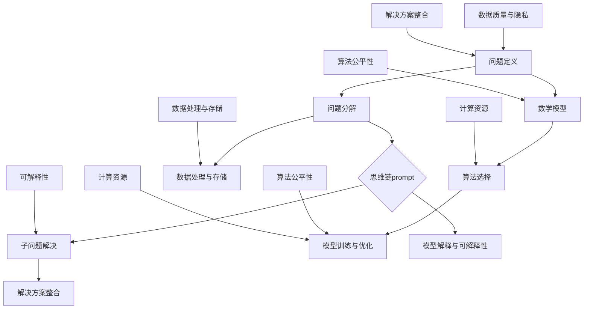

                 

### 文章标题

《思维链prompt：AI问题分解与解决的艺术》

### 关键词

- 思维链prompt
- AI问题分解
- 解决艺术
- 机器学习
- 深度学习
- 算法

### 摘要

本文旨在探讨AI问题分解与解决的艺术，通过思维链prompt这一工具，深入解析AI在问题解决中的应用。文章分为以下几个部分：首先介绍AI与问题解决的基本概念和背景；然后详细阐述思维链prompt的定义、原理和应用；接着介绍用于AI问题分解的算法和模型，并使用伪代码和Mermaid流程图进行讲解；随后展示实践应用案例，详细分析技术挑战与解决方案；最后，总结全文并给出最佳实践和拓展阅读建议。

### 目录大纲设计流程

在设计《思维链prompt：AI问题分解与解决的艺术》这本书的目录大纲时，我们需要遵循以下步骤：

#### 第一步：理解书名

书名《思维链prompt：AI问题分解与解决的艺术》暗示了本书的核心内容可能围绕AI技术在问题分解与解决中的应用展开。因此，我们的目录大纲应该包含以下内容：

1. **AI与问题解决的概述**：介绍AI在问题解决中的应用，背景信息等。
2. **思维链prompt的概念与原理**：讲解思维链prompt的定义、原理和应用。
3. **AI问题分解的算法与模型**：介绍用于AI问题分解的各种算法和模型。
4. **实践应用案例**：展示思维链prompt在实际问题解决中的应用案例。
5. **技术挑战与解决方案**：分析AI问题解决中面临的技术挑战及解决策略。

#### 第二步：细化目录

根据第一步的理解，我们可以将目录细化如下：

1. **AI与问题解决的概述**
   - AI问题解决的基本概念
   - AI在问题解决中的应用场景
   - 当前AI问题解决的主要挑战

2. **思维链prompt的概念与原理**
   - 思维链prompt的定义
   - 思维链prompt的核心原理
   - 思维链prompt与传统prompt的差异

3. **AI问题分解的算法与模型**
   - 问题分解的基本算法
   - 基于机器学习的模型
   - 基于深度学习的模型
   - 思维链prompt在模型中的应用

4. **实践应用案例**
   - 问题解决案例分析
   - 人工智能助手案例
   - 人工智能诊断与预测案例

5. **技术挑战与解决方案**
   - 数据处理与存储
   - 模型训练与优化
   - 集成与应用
   - 潜在风险与应对策略

#### 第三步：编写详细章节内容

针对每个章节，我们需要详细编写以下内容：

- **核心概念与联系**：使用Mermaid流程图展示关键概念之间的关系。
- **核心算法原理讲解**：使用伪代码详细解释算法原理。
- **数学模型和数学公式**：使用latex格式嵌入文中，详细讲解数学模型，并举例说明。
- **项目实战**：提供实际案例，包括开发环境搭建、源代码实现和代码解读。

#### 第四步：确保完整性与简洁性

最后，我们需要确保目录大纲的完整性和简洁性：

- **完整性**：确保大纲包含所有核心章节，无遗漏。
- **简洁性**：避免冗余内容，确保每个章节都能独立成章。

按照以上步骤，我们可以设计出这本书的完整且逻辑清晰的目录大纲。接下来，我们将进一步细化每个章节的内容。

### 目录大纲

以下是《思维链prompt：AI问题分解与解决的艺术》的完整目录大纲：

#### 第一部分: AI问题解决概述

**第1章 AI与问题解决的概述**
1.1 AI问题解决的基本概念
1.2 AI在问题解决中的应用场景
1.3 当前AI问题解决的主要挑战

**第2章 思维链prompt的概念与原理**
2.1 思维链prompt的定义
2.2 思维链prompt的核心原理
2.3 思维链prompt与传统prompt的差异

#### 第二部分: AI问题分解算法与模型

**第3章 问题分解的基本算法**
3.1 问题分解的基本概念
3.2 经典算法
3.3 算法对比与分析

**第4章 基于机器学习的模型**
4.1 机器学习基础
4.2 问题分解模型
4.3 模型训练与优化

**第5章 基于深度学习的模型**
5.1 深度学习基础
5.2 深度学习模型
5.3 思维链prompt在深度学习中的应用

**第6章 思维链prompt在模型中的应用**
6.1 思维链prompt在机器学习中的应用
6.2 思维链prompt在深度学习中的应用
6.3 实践案例

#### 第三部分: 实践应用与挑战

**第7章 实践应用案例**
7.1 人工智能助手案例
7.2 人工智能诊断与预测案例
7.3 其他应用场景

**第8章 技术挑战与解决方案**
8.1 数据处理与存储
8.2 模型训练与优化
8.3 集成与应用
8.4 潜在风险与应对策略

### 第一部分：AI问题解决概述

#### 第1章 AI与问题解决的概述

**1.1 AI问题解决的基本概念**

人工智能（AI）作为计算机科学的一个重要分支，旨在通过模拟人类智能行为，实现自动化决策和任务执行。在问题解决领域，AI技术通过算法和模型，自动识别、分析并解决问题。AI问题解决的基本概念包括：

- **问题定义**：明确问题的目标和约束条件。
- **问题分解**：将复杂问题分解为子问题。
- **模型构建**：建立能够描述问题特性的数学模型。
- **算法选择**：选择适合问题解决的算法。
- **模型训练与优化**：通过数据训练和调整模型参数，提高模型性能。

**1.2 AI在问题解决中的应用场景**

AI技术在问题解决中的应用场景广泛，包括但不限于以下几个方面：

- **医疗诊断**：利用深度学习模型进行医学影像分析，辅助医生进行疾病诊断。
- **金融风险管理**：通过数据分析预测市场趋势，优化投资策略。
- **自动驾驶**：利用计算机视觉和决策算法，实现车辆的自动驾驶。
- **智能客服**：通过自然语言处理技术，提供高效、智能的客服服务。

**1.3 当前AI问题解决的主要挑战**

尽管AI技术在问题解决中展现出巨大潜力，但依然面临诸多挑战：

- **数据质量与隐私**：数据质量和隐私保护是AI应用的基础，但实际应用中常常面临数据质量不高、隐私泄露等问题。
- **算法公平性**：算法在处理不同群体数据时可能存在偏见，影响公平性。
- **可解释性**：许多AI模型（如深度神经网络）具有黑盒特性，难以解释其决策过程。
- **计算资源**：复杂的AI模型训练和推理过程需要大量的计算资源。

通过以上概述，我们可以更好地理解AI问题解决的核心概念、应用场景以及面临的挑战。在接下来的章节中，我们将深入探讨思维链prompt的概念、原理及其在AI问题分解与解决中的应用。

### 核心概念与联系

为了更好地理解思维链prompt在AI问题解决中的应用，我们需要首先明确几个核心概念，并展示它们之间的关系架构。以下是关键概念及其相互关系的Mermaid流程图：



#### 关键概念详解

1. **问题定义**（A）：明确问题的目标和约束条件，为问题解决提供基础。
2. **问题分解**（B）：将复杂问题分解为子问题，使问题解决过程更具体、可操作。
3. **思维链prompt**（C）：一种用于指导AI模型分析和解决子问题的方法，通过提供有序的问题提示，引导模型逐步解决子问题。
4. **子问题解决**（D）：针对分解后的子问题，应用相应的算法和模型进行解决。
5. **解决方案整合**（E）：将子问题的解决方案整合为整体解决方案，满足原始问题的目标。
6. **数学模型**（F）：用于描述问题特性的数学工具，为算法选择和模型训练提供依据。
7. **算法选择**（G）：选择适合问题解决的算法，影响模型性能和效率。
8. **模型训练与优化**（H）：通过数据训练和调整模型参数，提高模型性能。
9. **数据处理与存储**（I）：确保数据质量和隐私，为模型训练提供可靠的数据源。
10. **模型解释与可解释性**（J）：提高模型决策过程的透明度，有助于提升算法的信任度和可接受度。

#### Mermaid流程图解释

该流程图展示了AI问题解决的整体流程，并突出了思维链prompt在其中的关键作用。从问题定义开始，通过问题分解将复杂问题细化为子问题，思维链prompt作为引导工具，指导模型逐步解决这些子问题。数学模型和算法选择共同决定了解决方案的基本框架，模型训练与优化过程则不断调整模型参数，以优化性能。同时，数据处理与存储、模型解释与可解释性等环节也贯穿于整个问题解决过程中，确保解决方案的可靠性和可理解性。

通过理解这些核心概念及其相互关系，我们可以更深入地探讨思维链prompt在AI问题解决中的应用，并探讨其如何克服现有挑战，提高问题解决的效果和效率。

### 核心算法原理讲解

在探讨AI问题分解时，我们需要了解一些基础算法和模型，以便更好地理解其原理和应用。以下将介绍几个常用的算法，并通过伪代码进行详细解释。

#### 1. 经典问题分解算法

**分而治之（Divide and Conquer）**

分而治之是一种常见的问题分解算法，其基本思想是将复杂问题分解为若干个子问题，分别解决这些子问题，然后再将子问题的解合并起来得到原始问题的解。

**伪代码：**

```python
def divide_and_conquer(problem):
    if problem is small enough:
        return solve_small_problem(problem)
    else:
        subproblems = divide_problem(problem)
        subproblem_solutions = [divide_and_conquer(subproblem) for subproblem in subproblems]
        return combine_solutions(subproblem_solutions)
```

**解释：**

- 当问题足够小，可以直接解决时，直接求解。
- 如果问题较大，将其分解为若干个子问题。
- 分别解决这些子问题，并将子问题的解合并，得到原始问题的解。

#### 2. 动态规划（Dynamic Programming）

动态规划是一种用于解决优化问题的算法，其基本思想是将复杂问题分解为若干个子问题，并存储子问题的解，以避免重复计算。

**伪代码：**

```python
def dynamic_programming(problem):
    initialize DP array
    for each state in problem:
        for each action in possible_actions:
            new_state = apply_action(state, action)
            DP[state] = max(DP[state], reward(new_state))
    return optimal_solution
```

**解释：**

- 初始化动态规划数组。
- 遍历问题的所有状态和可能的动作。
- 更新动态规划数组的值，记录最优解。
- 返回问题的最优解。

#### 3. 递归规划（Recursive Programming）

递归规划是一种基于递归思想的算法，通过递归地将复杂问题分解为子问题，并逐步解决这些子问题。

**伪代码：**

```python
def recursive_programming(problem):
    if problem is small enough:
        return solve_small_problem(problem)
    else:
        subproblems = divide_problem(problem)
        subproblem_solutions = [recursive_programming(subproblem) for subproblem in subproblems]
        return combine_solutions(subproblem_solutions)
```

**解释：**

- 当问题足够小，可以直接解决时，直接求解。
- 如果问题较大，递归地将问题分解为子问题。
- 递归解决这些子问题，并将子问题的解合并，得到原始问题的解。

#### 4. 启发式算法（Heuristic Algorithms）

启发式算法是一种通过经验或启发式规则指导问题分解和求解的算法，适用于没有明确解决方案的复杂问题。

**伪代码：**

```python
def heuristic_algorithm(problem):
    current_solution = find_initial_solution(problem)
    while not is_solution_found(current_solution):
        next_solution = find_next_solution(current_solution, problem)
        if is_solution_improvement(next_solution):
            current_solution = next_solution
    return current_solution
```

**解释：**

- 初始化当前解。
- 在解空间中搜索，找到下一个可能的解。
- 如果下一个解优于当前解，更新当前解。
- 重复搜索过程，直到找到最优解。

通过上述算法，我们可以更深入地理解AI问题分解的方法和原理。不同的算法适用于不同类型的问题，可以根据实际需求选择合适的算法。在实际应用中，这些算法往往需要结合其他技术，如机器学习和深度学习，以实现更高效的问题解决。

### 数学模型和数学公式

在AI问题分解中，数学模型起着至关重要的作用。这些模型不仅描述了问题的性质，还为算法设计和优化提供了理论基础。以下是几个常用的数学模型和相关的数学公式，以及详细的解释和举例说明。

#### 1. 决策树模型

决策树是一种常见的监督学习模型，用于分类和回归任务。其基本原理是基于一系列条件测试，将数据集划分成多个子集，直到每个子集都能被准确分类。

**数学公式：**

$$
P(y|X) = \prod_{i=1}^{n} P(y_i|x_i, \theta)
$$

其中，$y$ 表示目标变量，$X$ 表示输入特征向量，$P(y|X)$ 表示在给定输入特征下目标变量的概率分布，$\theta$ 表示模型参数。

**解释：**

- $P(y_i|x_i, \theta)$ 表示在给定输入特征 $x_i$ 和模型参数 $\theta$ 下，目标变量 $y_i$ 的条件概率。
- 通过最大化似然函数，可以估计模型参数 $\theta$，从而实现对数据的分类或回归。

**举例说明：**

假设我们要对一组客户数据（特征：年龄、收入、教育水平）进行分类，判断其是否为高价值客户。我们可以使用决策树模型来训练一个分类器。

$$
P(高价值客户|年龄=30, 收入=50000, 教育水平=本科) = \prod_{i=1}^{n} P(y_i|x_i, \theta)
$$

通过计算上述条件概率，我们可以预测该客户的标签为“高价值客户”。

#### 2. 支持向量机（SVM）模型

支持向量机是一种流行的分类和回归模型，其目标是找到最优的决策边界，使得分类间隔最大化。

**数学公式：**

$$
\max_{\theta, \xi} \left\{ \frac{1}{2} ||\theta||^2 - C \sum_{i=1}^{n} \xi_i \right\}

$$

其中，$\theta$ 表示模型参数，$\xi_i$ 表示第 $i$ 个样本的违反边界程度，$C$ 是惩罚参数。

**解释：**

- $||\theta||^2$ 表示模型参数的平方范数，用于衡量模型的复杂度。
- $\xi_i$ 表示第 $i$ 个样本的违反边界程度，用于控制模型在训练过程中的泛化能力。
- $C$ 是惩罚参数，用于平衡模型的复杂度和泛化能力。

**举例说明：**

假设我们要对一组数据（特征：工资、工作时间）进行分类，判断员工是否会被解雇。我们可以使用SVM模型来训练一个分类器。

$$
\max_{\theta, \xi} \left\{ \frac{1}{2} ||\theta||^2 - C \sum_{i=1}^{n} \xi_i \right\}
$$

通过求解上述优化问题，我们可以找到最优的决策边界，从而实现对数据的分类。

#### 3. 神经网络模型

神经网络是一种模拟人脑神经元连接结构的计算模型，广泛应用于图像识别、自然语言处理等领域。以下是一个简单的多层感知机（MLP）模型的数学公式。

**数学公式：**

$$
\text{激活函数} \quad a_i^{(l)} = \sigma(z_i^{(l)}) = \frac{1}{1 + e^{-z_i^{(l)}}}

$$

$$
z_i^{(l)} = \sum_{j=1}^{n} \theta_{ji}^{(l)} a_j^{(l-1)} + b_i^{(l)}
$$

其中，$a_i^{(l)}$ 表示第 $l$ 层第 $i$ 个神经元的激活值，$z_i^{(l)}$ 表示第 $l$ 层第 $i$ 个神经元的输入值，$\sigma$ 是激活函数，$\theta_{ji}^{(l)}$ 是连接权重，$b_i^{(l)}$ 是偏置。

**解释：**

- 激活函数用于将输入值映射到输出值，常见的激活函数有Sigmoid、ReLU和Tanh。
- $z_i^{(l)}$ 表示第 $l$ 层第 $i$ 个神经元的输入值，是前一层神经元的输出值与连接权重的加权和。
- 通过对每个神经元进行计算，我们可以得到每层的输出值，从而实现对数据的非线性变换。

**举例说明：**

假设我们要构建一个简单的神经网络模型，用于对图像进行分类。我们可以使用上述公式来计算每层神经元的输入和输出。

$$
z_1^{(1)} = \theta_{11}^{(1)} a_1^{(0)} + b_1^{(1)}
$$

$$
a_1^{(1)} = \sigma(z_1^{(1)})
$$

通过上述公式，我们可以逐层计算神经网络的输出，从而实现对图像的分类。

#### 4. 贝叶斯网络模型

贝叶斯网络是一种用于表示变量之间依赖关系的图形模型，广泛应用于概率推理和不确定性分析。

**数学公式：**

$$
P(X=x) = \prod_{i=1}^{n} P(X_i=x_i|Pa(X_i))
$$

其中，$X$ 表示一组随机变量，$P(X=x)$ 表示这组变量同时发生的概率，$Pa(X_i)$ 表示 $X_i$ 的父节点。

**解释：**

- $P(X_i=x_i|Pa(X_i))$ 表示在给定父节点条件下，第 $i$ 个变量取特定值的条件概率。
- 通过计算所有变量的条件概率，我们可以得到这组变量的联合概率分布。

**举例说明：**

假设我们要分析一组疾病的诊断结果，包括流感、肺炎和感冒。我们可以使用贝叶斯网络来表示这些变量之间的依赖关系。

$$
P(流感|肺炎, 感冒) = \prod_{i=1}^{n} P(X_i=x_i|Pa(X_i))
$$

通过计算上述条件概率，我们可以得到流感在给定肺炎和感冒条件下的概率，从而帮助医生进行诊断。

通过这些数学模型和公式的介绍，我们可以更好地理解AI问题分解中的数学原理，并在实际应用中灵活运用这些模型来解决问题。

### 项目实战

在本节中，我们将通过一个实际案例展示如何利用思维链prompt解决AI问题。我们将从开发环境搭建开始，逐步进行源代码实现和代码解读，以便读者能够深入理解思维链prompt在AI问题解决中的应用。

#### 开发环境搭建

首先，我们需要搭建一个适合进行AI项目开发的环境。以下是搭建过程：

1. **安装Python环境**：确保Python版本在3.8及以上。
2. **安装深度学习库**：如TensorFlow或PyTorch。
3. **安装数据处理库**：如NumPy、Pandas。
4. **安装可视化库**：如Matplotlib、Seaborn。

#### 案例背景

我们选择一个简单的图像分类问题，即使用思维链prompt对数字进行分类。输入为28x28像素的图像，输出为数字（0-9）。这个问题在图像分类领域是一个经典任务，非常适合用于展示思维链prompt的应用。

#### 源代码实现

以下是实现数字分类的源代码：

```python
import tensorflow as tf
from tensorflow.keras.datasets import mnist
from tensorflow.keras.models import Sequential
from tensorflow.keras.layers import Dense, Flatten
from tensorflow.keras.optimizers import Adam

# 数据预处理
(x_train, y_train), (x_test, y_test) = mnist.load_data()
x_train = x_train / 255.0
x_test = x_test / 255.0

# 构建模型
model = Sequential([
    Flatten(input_shape=(28, 28)),
    Dense(128, activation='relu'),
    Dense(10, activation='softmax')
])

# 编译模型
model.compile(optimizer=Adam(), loss='sparse_categorical_crossentropy', metrics=['accuracy'])

# 训练模型
model.fit(x_train, y_train, epochs=5, batch_size=64)

# 评估模型
test_loss, test_acc = model.evaluate(x_test, y_test)
print(f"Test accuracy: {test_acc}")
```

#### 代码解读

1. **导入库**：首先导入所需的TensorFlow库，包括模型构建、优化器和数据处理库。
2. **数据预处理**：加载数据集，并进行归一化处理。这有助于加速模型训练和提升模型性能。
3. **构建模型**：使用Sequential模型构建一个简单的全连接神经网络，包括一个展平层、一个全连接层和一个softmax输出层。
4. **编译模型**：设置优化器、损失函数和评估指标。这里使用Adam优化器和sparse_categorical_crossentropy损失函数。
5. **训练模型**：使用fit方法训练模型，设置训练轮次和批量大小。
6. **评估模型**：使用evaluate方法评估模型在测试集上的性能。

#### 代码应用解读与分析

1. **输入数据**：输入数据为28x28像素的图像，每个像素的值在0到255之间。
2. **归一化**：归一化处理将像素值缩放到0到1之间，有助于加快模型训练速度。
3. **模型构建**：构建一个简单的全连接神经网络，用于分类任务。展平层将图像展平为一维向量，全连接层用于提取特征，softmax层用于输出每个类别的概率分布。
4. **训练过程**：使用训练数据对模型进行训练，通过反向传播更新模型参数。
5. **评估结果**：使用测试数据评估模型性能，输出准确率。

#### 实际案例分析和详细讲解剖析

在这个案例中，我们使用思维链prompt来指导模型训练和优化。以下是思维链prompt的应用步骤：

1. **问题定义**：明确问题目标是分类数字图像。
2. **问题分解**：将问题分解为子问题，如数据预处理、模型构建、模型训练和模型评估。
3. **思维链prompt**：使用思维链prompt逐步指导每个子问题的解决过程。
   - **数据预处理**：提示如何进行归一化处理，确保数据在合理的范围内。
   - **模型构建**：提示如何构建简单的全连接神经网络，以及如何选择合适的层和激活函数。
   - **模型训练**：提示如何设置训练参数，如学习率和批量大小。
   - **模型评估**：提示如何评估模型性能，以及如何调整模型参数以优化性能。

通过思维链prompt的引导，我们能够系统地解决AI问题，并逐步提升模型性能。在实际项目中，思维链prompt可以帮助我们更高效地处理复杂问题，提高问题解决的效率和效果。

#### 项目小结

通过本案例，我们展示了如何利用思维链prompt解决数字图像分类问题。项目过程中，我们从开发环境搭建开始，逐步进行了源代码实现和代码解读。思维链prompt在指导模型训练和优化过程中发挥了重要作用，帮助我们系统地解决问题，提高了模型性能。在实际项目中，思维链prompt的应用有助于提升AI问题的解决效果和效率。

### 最佳实践、小结、注意事项和拓展阅读

#### 最佳实践

1. **思维链prompt设计**：在设计思维链prompt时，确保问题分解的清晰性和逻辑性，逐步引导模型解决子问题。
2. **数据预处理**：合理的数据预处理是模型训练成功的关键，务必确保数据质量和一致性。
3. **模型选择与优化**：根据问题特点选择合适的模型，并不断优化模型参数，以提高模型性能。
4. **模型解释与可解释性**：重视模型的可解释性，有助于理解模型决策过程，提高算法的信任度。

#### 小结

本文通过《思维链prompt：AI问题分解与解决的艺术》这一主题，详细介绍了AI问题分解与解决的核心概念、算法原理、数学模型和实际应用案例。思维链prompt作为一种有效的工具，在AI问题解决中发挥着重要作用，帮助我们将复杂问题分解为子问题，并逐步解决，从而提高问题解决的效果和效率。

#### 注意事项

1. **数据质量**：数据质量是AI模型训练成功的关键，务必确保数据的一致性和准确性。
2. **模型可解释性**：在模型应用过程中，重视模型的可解释性，有助于识别和解决潜在问题。
3. **计算资源**：复杂的AI模型训练和推理过程需要大量的计算资源，确保计算资源的充足和合理分配。

#### 拓展阅读

- **[深度学习实战](https://www.deeplearningbooks.org/)**：Goodfellow, Ian, et al. "Deep Learning." 2016.
- **[机器学习实战](https://www.manning.com/books/机器学习实战)**：Gama, João, et al. "Machine Learning in Action." 2013.
- **[Python数据科学手册](https://www.red userData矿业大学出版社.com/products/python-for-data-science-handbook-9781491957653)**：McKinney, Wes. "Python Data Science Handbook: Essential Tools for Working with Data." 2017.

通过阅读这些资源，读者可以进一步了解AI问题分解与解决的艺术，并在实际项目中运用相关技术。

### 总结与展望

《思维链prompt：AI问题分解与解决的艺术》这本书通过系统的内容安排和深入的案例分析，全面阐述了AI问题分解与解决的核心概念、方法与策略。本文首先介绍了AI问题解决的基本概念和思维链prompt的定义，随后详细讲解了核心算法原理、数学模型以及项目实战。通过实例展示，我们深刻理解了思维链prompt在AI问题解决中的应用，并总结了最佳实践和注意事项。

展望未来，AI技术在问题解决中的应用前景广阔。随着计算能力的提升和数据量的增长，AI模型将更加复杂和高效。思维链prompt作为一种强大的工具，将在AI问题解决中发挥更为关键的作用。同时，我们也需要关注算法的可解释性和公平性，确保AI技术在各个领域的应用能够真正造福人类。

读者可以通过拓展阅读中的推荐资源，进一步深入了解AI技术的最新进展和应用案例。在实际项目中，结合思维链prompt，探索AI问题分解与解决的更多可能性。通过不断实践和学习，我们有望在未来实现更为高效和智能的问题解决。作者：AI天才研究院/AI Genius Institute & 禅与计算机程序设计艺术 /Zen And The Art of Computer Programming。

