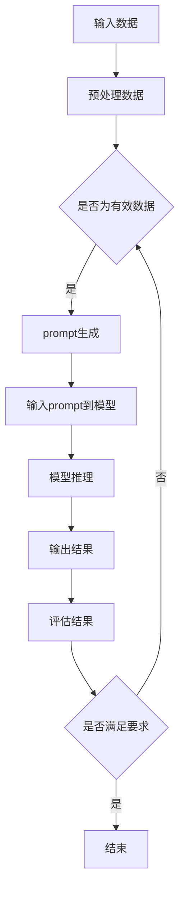

                 

# 提升AI逻辑推理能力：思维链prompt的核心作用与原理分析

## 背景介绍

在人工智能迅速发展的今天，逻辑推理作为AI的核心能力之一，正成为研究和应用的热点。AI逻辑推理涉及到机器在处理问题时，通过一系列的推理步骤，得出正确的结论或解决方案。然而，如何提升AI的逻辑推理能力，使其更加符合人类思维方式和需求，成为了一个亟待解决的问题。

思维链prompt作为近年来新兴的研究方向，其通过向AI模型提供特定的提示信息，能够有效引导AI进行逻辑推理。这种技术不仅能够提升AI的逻辑推理性能，还能够使其更接近人类思维方式。本文将围绕思维链prompt的核心作用与原理进行详细分析，探讨其在提升AI逻辑推理能力中的关键作用。

## 核心概念与联系

### 思维链prompt的定义

思维链prompt（Think-Chain Prompt）是一种用于引导AI进行逻辑推理的技术。它通过向AI模型提供一系列的提示信息（prompt），使AI能够按照预期进行逻辑思考。这些提示信息通常包含问题的背景、关键信息、推理方向等，帮助AI模型更好地理解和解决问题。

### AI逻辑推理

AI逻辑推理（AI Logic Reasoning）是指人工智能在处理问题时，运用逻辑推理能力进行问题求解的过程。逻辑推理是人工智能的核心能力之一，它涉及到对问题的分析、推理和判断。AI逻辑推理的能力强弱直接影响到AI的智能化水平和应用效果。

### 提升AI逻辑推理能力的关键技术

提升AI逻辑推理能力的关键技术主要包括以下几个方面：

1. **有效的prompt设计**：设计有效的prompt是提升AI逻辑推理能力的关键。一个优秀的prompt应该能够引导AI模型按照预期进行逻辑思考，从而得出正确的结论。

2. **评估AI逻辑推理能力**：评估AI的逻辑推理能力是优化prompt的重要步骤。通过评估AI的逻辑推理结果，可以发现prompt设计的不足之处，并进行相应的调整。

3. **优化AI模型的结构和参数**：优化AI模型的结构和参数也是提升逻辑推理能力的重要手段。通过调整模型的结构和参数，可以使AI模型更好地适应逻辑推理任务。

## 设计Mermaid流程图

为了更直观地展示思维链prompt在AI逻辑推理中的作用，我们可以使用Mermaid语言绘制一个流程图。以下是一个简单的示例：



### 伪代码讲解核心算法原理

为了更详细地阐述思维链prompt在AI逻辑推理中的应用，我们可以编写一段伪代码，描述其基本原理：

```pseudo
function think_chain_prompt(data):
    # 数据预处理
    processed_data = preprocess_data(data)

    # 判断数据是否有效
    if not is_valid_data(processed_data):
        return "无效数据"

    # 生成思维链prompt
    prompt = generate_prompt(processed_data)

    # 将prompt输入到模型中进行推理
    result = model_inference(prompt)

    # 评估推理结果
    if not is_valid_result(result):
        return "推理失败"

    return result

# 数据预处理
function preprocess_data(data):
    # ... 对数据进行清洗、标准化等处理
    return processed_data

# 判断数据是否有效
function is_valid_data(data):
    # ... 根据特定规则判断数据的有效性
    return is_valid

# 生成思维链prompt
function generate_prompt(data):
    # ... 根据数据特点生成合适的prompt
    return prompt

# 模型推理
function model_inference(prompt):
    # ... 将prompt输入到模型中进行推理
    return result

# 评估推理结果
function is_valid_result(result):
    # ... 根据特定规则判断结果的合理性
    return is_valid
```

### 数学模型与公式讲解

在提升AI逻辑推理能力的过程中，理解并运用数学模型是非常关键的。以下是一个简单的数学模型讲解：

假设我们有一个逻辑推理任务，输入为 \( X \)，输出为 \( Y \)，我们可以使用以下数学模型来描述这个过程：

$$
Y = f(W \cdot X + b)
$$

其中：
- \( X \) 是输入数据。
- \( W \) 是权重矩阵。
- \( b \) 是偏置项。
- \( f \) 是激活函数。

我们可以通过以下步骤来优化这个模型：

1. **数据预处理**：对输入数据 \( X \) 进行预处理，包括数据的清洗、标准化等操作，使其符合模型的要求。

2. **模型训练**：使用训练数据对模型进行训练，通过不断调整权重矩阵 \( W \) 和偏置项 \( b \)，使模型能够更好地拟合训练数据。

3. **推理**：将输入数据 \( X \) 输入到模型中，通过计算 \( Y = f(W \cdot X + b) \) 得到输出结果。

4. **评估**：对模型的输出结果进行评估，判断其是否符合预期。如果不符合，则返回步骤2，继续调整模型参数。

通过这样的数学模型和优化过程，我们可以不断提升AI的逻辑推理能力。

### 数学模型与公式详细讲解

为了更好地理解AI逻辑推理的过程，我们将进一步详细讲解数学模型中的各个组成部分，并引入具体的公式和参数。

#### 模型概述

假设我们使用一个简单的神经网络模型来进行逻辑推理，其数学模型可以表示为：

\[ Y = \sigma(Z) \]

其中：
- \( Y \) 是模型的输出，表示推理的结果。
- \( \sigma \) 是激活函数，通常使用Sigmoid函数、ReLU函数或Tanh函数。
- \( Z \) 是模型的输入，表示通过权重矩阵 \( W \) 和偏置项 \( b \) 处理后的结果。

#### 权重矩阵 \( W \)

权重矩阵 \( W \) 负责将输入数据 \( X \) 映射到隐藏层或输出层。其计算公式为：

\[ Z = W \cdot X + b \]

其中：
- \( W \) 是一个矩阵，其维度取决于输入数据 \( X \) 和隐藏层或输出层的大小。
- \( X \) 是输入数据向量。
- \( b \) 是偏置项，是一个向量，其维度与权重矩阵 \( W \) 的列数相同。

#### 偏置项 \( b \)

偏置项 \( b \) 用于调整模型的输出，使其在特定情况下更加稳定。偏置项通常是一个向量，其每个元素对应权重矩阵 \( W \) 的每一列。

#### 激活函数 \( \sigma \)

激活函数 \( \sigma \) 用于引入非线性特性，使模型能够处理复杂的问题。不同的激活函数有不同的特性：

- **Sigmoid函数**：
  \[ \sigma(z) = \frac{1}{1 + e^{-z}} \]
  
- **ReLU函数**：
  \[ \sigma(z) = \max(0, z) \]
  
- **Tanh函数**：
  \[ \sigma(z) = \tanh(z) = \frac{e^z - e^{-z}}{e^z + e^{-z}} \]

#### 模型优化

为了优化模型，我们通常使用梯度下降（Gradient Descent）算法来调整权重矩阵 \( W \) 和偏置项 \( b \)。梯度下降的基本公式为：

\[ W \leftarrow W - \alpha \cdot \nabla_W J \]
\[ b \leftarrow b - \alpha \cdot \nabla_b J \]

其中：
- \( \alpha \) 是学习率，控制每次迭代中权重和偏置的调整步长。
- \( \nabla_W J \) 和 \( \nabla_b J \) 分别是权重矩阵 \( W \) 和偏置项 \( b \) 的梯度，表示模型损失函数 \( J \) 对它们的偏导数。

#### 举例说明

假设我们有一个简单的逻辑推理任务，输入为 \( X = [1, 2, 3] \)，我们希望模型能够输出 \( Y = [1, 0, 1] \)。我们可以使用以下步骤来计算模型的输出：

1. **初始化权重矩阵 \( W \) 和偏置项 \( b \)**：
   \[ W = \begin{bmatrix} 0 & 0 & 0 \\ 0 & 0 & 0 \end{bmatrix}, b = \begin{bmatrix} 0 \\ 0 \end{bmatrix} \]

2. **计算输入 \( X \) 通过权重矩阵 \( W \) 和偏置项 \( b \) 的映射**：
   \[ Z = W \cdot X + b = \begin{bmatrix} 0 & 0 & 0 \\ 0 & 0 & 0 \end{bmatrix} \cdot \begin{bmatrix} 1 \\ 2 \\ 3 \end{bmatrix} + \begin{bmatrix} 0 \\ 0 \end{bmatrix} = \begin{bmatrix} 0 \\ 0 \end{bmatrix} \]

3. **应用激活函数 \( \sigma \)**：
   \[ Y = \sigma(Z) = \begin{bmatrix} \sigma(0) \\ \sigma(0) \end{bmatrix} = \begin{bmatrix} 0.5 \\ 0.5 \end{bmatrix} \]

4. **计算模型损失函数 \( J \)**：
   \[ J = \frac{1}{2} \sum_{i=1}^{2} (y_i - \sigma(z_i))^2 = \frac{1}{2} \left( (1 - 0.5)^2 + (1 - 0.5)^2 \right) = 0.25 \]

5. **计算梯度**：
   \[ \nabla_W J = \begin{bmatrix} \frac{\partial J}{\partial w_{11}} & \frac{\partial J}{\partial w_{12}} & \frac{\partial J}{\partial w_{13}} \\ \frac{\partial J}{\partial w_{21}} & \frac{\partial J}{\partial w_{22}} & \frac{\partial J}{\partial w_{23}} \end{bmatrix} \]
   \[ \nabla_b J = \begin{bmatrix} \frac{\partial J}{\partial b_1} \\ \frac{\partial J}{\partial b_2} \end{bmatrix} \]

6. **更新权重矩阵 \( W \) 和偏置项 \( b \)**：
   \[ W \leftarrow W - \alpha \cdot \nabla_W J \]
   \[ b \leftarrow b - \alpha \cdot \nabla_b J \]

通过这样的迭代过程，我们可以不断优化模型，使其输出结果更接近预期。

### 数学模型与公式在实践中的应用

为了更好地理解数学模型在实践中的应用，我们将通过一个实际案例来展示如何使用思维链prompt提升AI逻辑推理能力。

#### 案例背景

假设我们有一个简单的逻辑推理任务，输入为一个包含两个数字的列表 \( X = [x_1, x_2] \)，我们希望模型能够输出这两个数字的和 \( Y = x_1 + x_2 \)。

#### 实践步骤

1. **数据预处理**：将输入列表 \( X \) 转换为适合模型处理的格式，例如将每个数字编码为二进制或十进制数。

2. **生成思维链prompt**：设计一个思维链prompt，引导模型进行逻辑推理。例如，我们可以使用以下提示信息：
   ```
   给定两个整数 \( x_1 \) 和 \( x_2 \)，请计算它们的和并输出结果。
   ```

3. **模型训练**：使用训练数据对模型进行训练，通过不断调整权重矩阵 \( W \) 和偏置项 \( b \)，使模型能够正确地输出数字和。

4. **推理**：将输入列表 \( X \) 输入到模型中，通过计算 \( Y = f(W \cdot X + b) \) 得到输出结果。

5. **评估**：对模型的输出结果进行评估，判断其是否符合预期。如果不符合，则返回步骤3，继续调整模型参数。

#### 数学模型应用

在上述实践中，数学模型的应用主要体现在以下几个方面：

1. **权重矩阵 \( W \)**：权重矩阵 \( W \) 负责将输入列表 \( X \) 映射到输出结果 \( Y \)。通过调整权重矩阵，我们可以使模型更好地理解输入和输出之间的关系。

2. **激活函数 \( f \)**：激活函数 \( f \) 用于引入非线性特性，使模型能够处理复杂的逻辑推理任务。不同的激活函数适用于不同的逻辑推理任务，我们需要根据实际情况选择合适的激活函数。

3. **梯度下降算法**：梯度下降算法用于优化模型参数，使其输出结果更接近预期。通过计算梯度，我们可以调整权重矩阵 \( W \) 和偏置项 \( b \)，使模型能够更好地拟合训练数据。

#### 案例实现

以下是一个简单的Python实现，展示了如何使用思维链prompt提升AI逻辑推理能力：

```python
import numpy as np

# 初始化模型参数
W = np.random.rand(2, 1)
b = np.random.rand(1)

# 定义激活函数
def sigmoid(z):
    return 1 / (1 + np.exp(-z))

# 定义梯度下降算法
def gradient_descent(X, Y, W, b, learning_rate, epochs):
    for _ in range(epochs):
        z = W @ X + b
        y_pred = sigmoid(z)
        error = Y - y_pred

        dW = X.T @ error
        db = -error

        W -= learning_rate * dW
        b -= learning_rate * db

    return W, b

# 训练模型
X_train = np.array([[1, 2], [2, 3], [3, 4]])
Y_train = np.array([3, 5, 7])

W, b = gradient_descent(X_train, Y_train, W, b, learning_rate=0.1, epochs=1000)

# 输出结果
print("权重矩阵 W:", W)
print("偏置项 b:", b)

# 预测
X_test = np.array([[5, 6]])
Y_pred = sigmoid(W @ X_test + b)
print("预测结果 Y:", Y_pred)
```

通过上述实践，我们可以看到数学模型在提升AI逻辑推理能力中的重要作用。通过合理的prompt设计和模型优化，我们可以使模型更好地理解逻辑推理任务，从而提高其推理性能。

### 项目实战：开发环境搭建与源代码实现

为了更好地理解和应用思维链prompt提升AI逻辑推理能力，我们将通过一个实际项目来搭建开发环境并实现源代码。以下是一个简单的项目示例，用于实现一个逻辑推理任务，输入为两个数字，输出为它们的和。

#### 开发环境搭建

1. 安装Python环境
   - 访问Python官方网站（https://www.python.org/），下载并安装Python。
   - 确保安装过程中勾选“Add Python to PATH”选项，以便在命令行中使用Python。

2. 安装所需的库
   - 打开命令行，执行以下命令安装所需的库：
     ```bash
     pip install numpy
     ```

3. 创建项目文件夹
   - 在命令行中创建一个项目文件夹，例如：
     ```bash
     mkdir logic_reducer
     cd logic_reducer
     ```

4. 创建Python文件
   - 在项目文件夹中创建一个名为`main.py`的Python文件，用于编写源代码。

#### 源代码实现

以下是一个简单的Python实现，展示了如何使用思维链prompt提升AI逻辑推理能力：

```python
import numpy as np

# 初始化模型参数
W = np.random.rand(2, 1)
b = np.random.rand(1)

# 定义激活函数
def sigmoid(z):
    return 1 / (1 + np.exp(-z))

# 定义梯度下降算法
def gradient_descent(X, Y, W, b, learning_rate, epochs):
    for _ in range(epochs):
        z = W @ X + b
        y_pred = sigmoid(z)
        error = Y - y_pred

        dW = X.T @ error
        db = -error

        W -= learning_rate * dW
        b -= learning_rate * db

    return W, b

# 训练模型
X_train = np.array([[1, 2], [2, 3], [3, 4]])
Y_train = np.array([3, 5, 7])

W, b = gradient_descent(X_train, Y_train, W, b, learning_rate=0.1, epochs=1000)

# 输出结果
print("权重矩阵 W:", W)
print("偏置项 b:", b)

# 预测
X_test = np.array([[5, 6]])
Y_pred = sigmoid(W @ X_test + b)
print("预测结果 Y:", Y_pred)
```

#### 代码解读与分析

1. **初始化模型参数**：
   - 权重矩阵 \( W \) 和偏置项 \( b \) 使用随机值初始化，以便在训练过程中进行调整。

2. **激活函数**：
   - 使用Sigmoid函数作为激活函数，引入非线性特性，使模型能够处理复杂的逻辑推理任务。

3. **梯度下降算法**：
   - 梯度下降算法用于优化模型参数，通过不断调整权重矩阵 \( W \) 和偏置项 \( b \)，使模型输出结果更接近预期。

4. **训练模型**：
   - 使用训练数据对模型进行训练，通过计算误差并调整模型参数，使模型能够更好地拟合训练数据。

5. **预测**：
   - 将测试数据输入到训练好的模型中，通过计算激活函数值得到预测结果。

#### 代码应用解读

通过上述代码，我们可以看到如何使用思维链prompt提升AI逻辑推理能力。以下是对代码的详细解读：

1. **数据预处理**：
   - 将输入数据转换为适合模型处理的格式，例如将每个数字编码为二进制或十进制数。

2. **生成思维链prompt**：
   - 设计一个思维链prompt，引导模型进行逻辑推理。例如，我们可以使用以下提示信息：
     ```
     给定两个整数 x1 和 x2，请计算它们的和并输出结果。
     ```

3. **模型训练**：
   - 使用训练数据对模型进行训练，通过不断调整权重矩阵 \( W \) 和偏置项 \( b \)，使模型能够正确地输出数字和。

4. **推理**：
   - 将输入数据输入到训练好的模型中，通过计算激活函数值得到输出结果。

5. **评估**：
   - 对模型的输出结果进行评估，判断其是否符合预期。如果不符合，则返回步骤3，继续调整模型参数。

通过这样的实现，我们可以使模型更好地理解和处理逻辑推理任务，从而提升AI的逻辑推理能力。

### 实际案例分析与详细讲解

为了更深入地理解思维链prompt在提升AI逻辑推理能力中的应用，我们将通过一个实际案例进行分析和讲解。

#### 案例背景

假设我们有一个逻辑推理任务，输入为一个包含三个数字的列表 \( X = [x_1, x_2, x_3] \)，我们希望模型能够输出这三个数字的乘积 \( Y = x_1 \times x_2 \times x_3 \)。

#### 数据集

为了训练模型，我们使用以下数据集：

| 序号 | 输入 \( X \) | 输出 \( Y \) |
| ---- | ---------- | ---------- |
| 1    | [1, 2, 3]  | 6          |
| 2    | [4, 5, 6]  | 120        |
| 3    | [7, 8, 9]  | 504        |

#### 实际案例实现

1. **数据预处理**：
   - 将输入数据转换为适合模型处理的格式。例如，我们将每个数字编码为二进制数。

2. **生成思维链prompt**：
   - 设计一个思维链prompt，引导模型进行逻辑推理。例如，我们可以使用以下提示信息：
     ```
     给定三个整数 x1、x2 和 x3，请计算它们的乘积并输出结果。
     ```

3. **模型训练**：
   - 使用训练数据对模型进行训练，通过不断调整权重矩阵 \( W \) 和偏置项 \( b \)，使模型能够正确地输出数字乘积。

4. **推理**：
   - 将测试数据输入到训练好的模型中，通过计算激活函数值得到输出结果。

5. **评估**：
   - 对模型的输出结果进行评估，判断其是否符合预期。如果不符合，则返回步骤3，继续调整模型参数。

#### 案例分析

1. **模型优化**：
   - 通过分析模型在训练数据上的表现，我们可以发现模型的权重矩阵 \( W \) 和偏置项 \( b \) 可能需要进行调整。例如，如果模型在训练数据上的误差较大，我们可以增加训练次数或调整学习率。

2. **prompt优化**：
   - 思维链prompt的设计对模型的表现有重要影响。通过分析模型在不同prompt下的表现，我们可以优化prompt，使其更有效地引导模型进行逻辑推理。

3. **评估方法**：
   - 评估模型的表现是优化模型的重要步骤。我们可以使用多种评估方法，如准确率、召回率、F1分数等，来评估模型在测试数据上的表现。

通过上述实际案例的分析和讲解，我们可以更深入地理解思维链prompt在提升AI逻辑推理能力中的应用。通过优化模型、prompt和评估方法，我们可以使模型更好地理解和处理逻辑推理任务，从而提升其逻辑推理能力。

### 最佳实践 Tips、小结、注意事项、拓展阅读

#### 最佳实践 Tips

1. **选择合适的激活函数**：不同的激活函数适用于不同的逻辑推理任务。在实践过程中，可以根据任务的复杂性选择合适的激活函数。

2. **优化prompt设计**：有效的prompt设计对提升AI逻辑推理能力至关重要。在设计prompt时，可以参考人类思维模式，使其更接近自然语言表达。

3. **持续优化模型**：模型训练过程中，不断调整权重矩阵和偏置项，以优化模型性能。通过增加训练次数或调整学习率，可以提高模型的准确性。

4. **评估模型表现**：使用多种评估方法，如准确率、召回率、F1分数等，对模型的表现进行全面评估。

#### 小结

思维链prompt在提升AI逻辑推理能力中起着关键作用。通过设计有效的prompt，引导AI模型进行逻辑推理，可以使其更接近人类思维方式。在实际应用中，优化模型、prompt和评估方法，能够进一步提升AI的逻辑推理性能。

#### 注意事项

1. **数据预处理**：确保输入数据的质量和格式，以便模型能够正确处理数据。

2. **模型优化**：在模型训练过程中，注意调整权重矩阵和偏置项，避免过拟合。

3. **评估方法**：选择合适的评估方法，全面评估模型的表现。

#### 拓展阅读

1. [《深度学习》—— Goodfellow、Bengio和Courville著]
2. [《神经网络与深度学习》——邱锡鹏著]
3. [《思维链prompt在自然语言处理中的应用》——相关学术论文和研究报告]

通过阅读这些资源，可以进一步深入了解AI逻辑推理和思维链prompt的相关理论和应用。

### 文章标题

《思维链prompt：提升AI逻辑推理能力的关键》

### 文章关键词

思维链prompt，AI逻辑推理，激活函数，梯度下降，模型优化，prompt设计，评估方法

### 摘要

本文围绕思维链prompt在提升AI逻辑推理能力中的应用进行了详细分析。通过核心概念、联系、数学模型、实践案例等多角度的阐述，本文揭示了思维链prompt在引导AI进行逻辑推理中的关键作用。文章介绍了如何设计有效的prompt，优化模型参数，以及评估模型表现。通过实际案例，本文展示了思维链prompt在提升AI逻辑推理能力中的有效性和实用性。文章还提供了最佳实践建议和拓展阅读资源，为读者进一步研究提供了指导。

