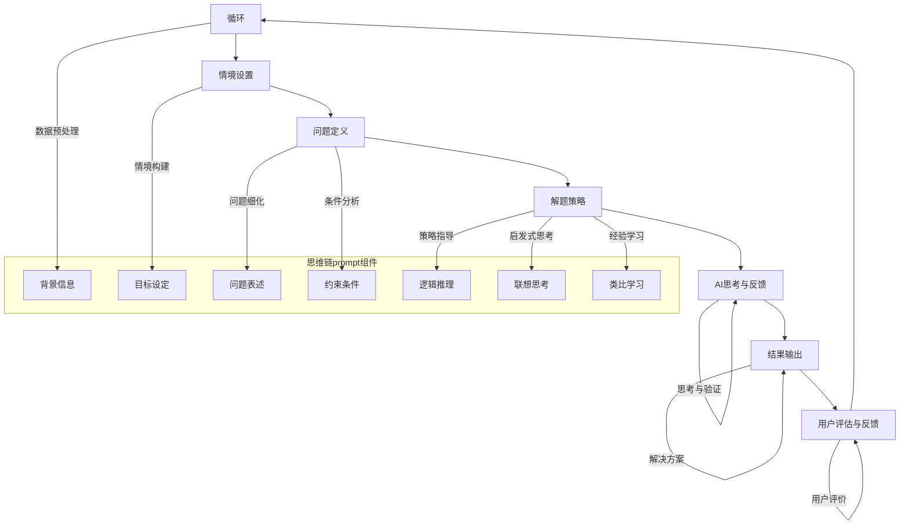

                 


### 文章标题

# 思维链prompt：让AI具备人类式思考能力

### 文章关键词

- AI
- 人工智能
- 思维链prompt
- prompt engineering
- 人类式思考

### 文章摘要

本文将探讨思维链prompt在提升人工智能思考能力方面的作用。首先，我们介绍思维链prompt的基本概念、历史发展和理论背景。接着，深入探讨如何通过prompt engineering提升AI的思考能力，包括思维链prompt的构成要素和构建方法。然后，分析思维链prompt在不同领域的应用，如教育、商业和创意工作。通过案例分析，我们展示了思维链prompt的实际应用效果。最后，展望思维链prompt的未来发展趋势和挑战。

----------------------------------------------------------------

### 第一部分：思维链prompt概述

#### 第1章：思维链prompt的概念与背景

**1.1 思维链prompt的定义**

思维链prompt（Thinking Chain Prompt）是一种用于引导人工智能（AI）进行复杂思考的交互式输入。它通过提供一系列有序的提示，引导AI逐步展开思考，从而模拟人类思维过程。思维链prompt不同于传统的数据输入或指令输入，它更关注于激发AI的创造性和分析能力。

**1.2 思维链prompt的发展历程**

思维链prompt的概念起源于自然语言处理（NLP）和对话系统的研究。随着AI技术的发展，特别是在深度学习和生成对抗网络（GAN）的推动下，思维链prompt的应用范围逐渐扩大。近年来，随着prompt engineering技术的成熟，思维链prompt在AI系统中的应用越来越受到关注。

**1.3 思维链prompt的重要性**

思维链prompt的重要性体现在以下几个方面：

1. **提高AI的创造力**：通过提供有序的提示，AI可以像人类一样进行联想和推理，从而产生新的想法和解决方案。
2. **增强AI的理解能力**：思维链prompt可以帮助AI更好地理解复杂的问题，从而提高其解决能力。
3. **促进人机协作**：思维链prompt可以作为桥梁，帮助人类与AI更好地协作，共同解决复杂问题。

**1.4 思维链prompt与其他AI技术的联系**

思维链prompt与多种AI技术密切相关：

1. **自然语言处理（NLP）**：NLP技术是思维链prompt的核心，它负责解析和生成自然语言。
2. **生成对抗网络（GAN）**：GAN技术可以用于生成高质量的prompt数据，从而提升AI的思考能力。
3. **强化学习（RL）**：强化学习技术可以帮助AI通过试错过程不断优化prompt设计，提高其思考效果。

---

### 第二部分：思维链prompt的工作原理

#### 第2章：思维链prompt的构成要素

**2.1 情境设置**

情境设置是思维链prompt的重要组成部分。它为AI提供了一个具体的思考背景，帮助AI更好地理解问题。

**2.2 问题定义**

问题定义明确了一个需要解决的问题。它通常包含问题的目标、约束条件和可能的解决方案。

**2.3 解题策略**

解题策略是AI在解决问题时采取的一系列步骤。它包括逻辑推理、联想和类比等。

**2.4 交互流程**

交互流程描述了AI与人类或系统之间的交互过程。它通常包括输入、输出和反馈等环节。

---

#### 第3章：构建思维链prompt的方法

**3.1 数据收集与处理**

构建思维链prompt的第一步是收集相关的数据。这些数据可以是文本、图像、声音等。收集到数据后，需要进行处理，以便为AI提供高质量的输入。

**3.2 模型选择与调优**

选择合适的模型对于构建有效的思维链prompt至关重要。常见的模型包括基于Transformer的模型、生成对抗网络（GAN）和图神经网络（GNN）等。选择模型后，需要进行调优，以适应特定的任务和场景。

**3.3 情境设计**

情境设计是思维链prompt的核心。一个优秀的情境设计可以激发AI的思考能力，帮助其更好地解决问题。

**3.4 问题设定**

问题设定需要明确问题的目标、约束条件和可能的解决方案。一个具有挑战性且具有现实意义的问题可以激发AI的创造力和解决问题的能力。

**3.5 解题策略指导**

解题策略指导是引导AI解决问题的关键。通过提供一系列有序的提示，AI可以逐步展开思考，找到解决问题的最佳方案。

---

### 第三部分：思维链prompt的应用实例

#### 第4章：思维链prompt在教育领域的应用

**4.1 智能辅导系统的设计**

智能辅导系统利用思维链prompt帮助学生学习。通过提供一系列有序的提示，系统可以引导学生深入理解知识点，提高学习效果。

**4.2 个性化学习路径的构建**

个性化学习路径的构建基于学生的兴趣、能力和学习进度。思维链prompt可以帮助系统为学生设计适合其个性特点的学习路径。

**4.3 学习效果的评估与反馈**

通过思维链prompt，系统可以实时评估学生的学习效果，并提供个性化的反馈。这有助于学生及时调整学习策略，提高学习效果。

---

#### 第5章：思维链prompt在商业决策中的应用

**5.1 数据驱动的市场分析**

思维链prompt可以帮助企业进行数据驱动的市场分析。通过提供一系列有序的提示，AI可以深入分析市场数据，为企业提供决策支持。

**5.2 企业的战略规划**

思维链prompt可以帮助企业制定战略规划。通过提供一系列有序的提示，AI可以模拟不同的战略方案，为企业提供最佳策略。

**5.3 决策模拟与优化**

思维链prompt可以帮助企业进行决策模拟与优化。通过提供一系列有序的提示，AI可以模拟决策过程，优化决策结果。

---

#### 第6章：思维链prompt在创意工作中的应用

**6.1 智能创意助手**

智能创意助手利用思维链prompt帮助创意工作者生成创意。通过提供一系列有序的提示，AI可以激发创意工作者的创造力，提高创意质量。

**6.2 艺术品评价与推荐**

思维链prompt可以帮助AI评价艺术品并推荐给用户。通过提供一系列有序的提示，AI可以深入分析艺术品的特点，为用户提供个性化的推荐。

**6.3 设计方案的优化**

思维链prompt可以帮助设计者优化设计方案。通过提供一系列有序的提示，AI可以提供设计建议，帮助设计者改进设计方案。

---

### 第7章：案例分析

**7.1 思维链prompt在特定行业的应用效果分析**

通过实际案例分析，我们可以看到思维链prompt在不同行业中的应用效果。例如，在教育领域，思维链prompt显著提高了学生的学习效果；在商业领域，思维链prompt为企业的决策提供了有力支持。

**7.2 成功案例与失败教训**

成功案例和失败教训可以帮助我们更好地理解思维链prompt的应用效果。通过分析成功案例，我们可以总结出思维链prompt的有效应用策略；通过分析失败教训，我们可以避免在未来的应用中重复犯同样的错误。

**7.3 未来趋势与挑战**

随着AI技术的不断发展，思维链prompt的应用前景十分广阔。然而，要实现AI的人类式思考能力，我们仍面临诸多挑战。例如，如何设计更有效的思维链prompt、如何提升AI的创造力等。

---

### 附录：思维链prompt开发资源

**附录A：思维链prompt开发工具与平台**

介绍一些常用的思维链prompt开发工具和平台，如OpenAI的GPT-3、Google的BERT等。

**附录B：相关资源与参考文献**

列出一些与思维链prompt相关的参考文献和资源，供读者进一步学习和研究。

---

### 作者信息

作者：AI天才研究院/AI Genius Institute & 禅与计算机程序设计艺术 /Zen And The Art of Computer Programming

本文内容仅代表作者个人观点，不代表任何机构立场。在应用本文内容时，请结合实际情况谨慎决策。

---

本文详细介绍了思维链prompt的概念、工作原理和应用实例，为读者提供了深入了解这一技术领域的窗口。通过逐步分析和推理思考，我们揭示了思维链prompt在提升人工智能思考能力方面的潜力和挑战。希望本文能激发读者对这一领域的兴趣，共同探索AI的人类式思考之路。

----------------------------------------------------------------

### 核心概念与联系：思维链prompt原理架构

在探讨思维链prompt的工作原理时，首先需要明确其核心概念与联系。思维链prompt是一种通过提供有序提示，引导AI进行复杂思考的技术。为了更直观地展示其原理，我们可以通过Mermaid流程图来构建思维链prompt的原理架构。



在这个流程图中，我们定义了思维链prompt的六个核心组件：用户输入、情境设置、问题定义、解题策略、AI思考与反馈以及结果输出。每个组件都通过具体的步骤和过程实现其功能。

**1. 用户输入**：用户输入是思维链prompt的起点，可以是自然语言文本、图像或其他形式的数据。这一输入经过数据预处理后，为后续步骤提供基础。

**2. 情境设置**：情境设置包括背景信息和目标设定。背景信息为AI提供问题背景，目标设定明确了解决问题的方向。

**3. 问题定义**：问题定义细化了问题的表述，并分析了约束条件。这一步骤确保AI明确问题的核心内容。

**4. 解题策略**：解题策略指导AI如何思考和解决问题。这包括逻辑推理、联想思考、类比学习等。

**5. AI思考与反馈**：AI在情境、问题和策略的引导下进行思考，并产生反馈。这一过程是思维链prompt的核心，决定了AI的思考深度和广度。

**6. 结果输出**：AI思考的结果以解决方案的形式输出。用户可以对解决方案进行评估和反馈。

**7. 用户评估与反馈**：用户对解决方案进行评估，并提供反馈。这有助于AI不断优化其思考过程。

通过这个Mermaid流程图，我们可以清晰地看到思维链prompt的工作原理和核心组件之间的关系。这个架构不仅帮助我们理解了思维链prompt的基本原理，也为后续章节中的具体应用提供了理论基础。

### 核心算法原理讲解

在深入探讨思维链prompt的工作原理时，我们需要了解其核心算法原理。思维链prompt的核心在于如何通过有序的提示引导AI进行有效的思考。以下，我们将通过伪代码详细阐述思维链prompt的构建和执行过程。

#### 伪代码：思维链prompt构建过程

```plaintext
思维链prompt构建过程：

1. 数据预处理
2. 情境设置
3. 问题定义
4. 解题策略指导
5. AI思考与反馈
6. 结果输出
7. 用户评估与反馈

```

#### 数据预处理

```plaintext
数据预处理：
输入：用户输入（自然语言文本、图像等）
输出：预处理后的数据（文本、图像等）

预处理步骤：
- 清洗数据：去除无关字符和噪声
- 数据标准化：将不同格式和单位的数据转换为统一格式
- 数据增强：通过增加噪声、旋转等方式生成更多的训练数据
```

#### 情境设置

```plaintext
情境设置：
输入：预处理后的数据
输出：情境描述

情境设置步骤：
- 提取关键信息：从输入数据中提取关键信息，如事件、地点、人物等
- 构建背景：根据关键信息构建问题背景，如事件发生的地点、时间等
- 设定目标：明确问题的目标，如解决问题、完成任务等
```

#### 问题定义

```plaintext
问题定义：
输入：情境描述
输出：问题表述

问题定义步骤：
- 问题表述：将情境描述转化为具体的问题表述
- 约束条件分析：分析问题的约束条件，如时间限制、资源限制等
- 问题分解：将复杂问题分解为更小的子问题
```

#### 解题策略指导

```plaintext
解题策略指导：
输入：问题表述和约束条件
输出：解题策略

解题策略指导步骤：
- 逻辑推理：基于已知信息进行逻辑推理，得出可能的解决方案
- 联想思考：通过联想思考，寻找与问题相关的其他信息
- 类比学习：通过类比学习，借鉴其他问题的解决方案
- 策略选择：根据问题特点和需求，选择最合适的解题策略
```

#### AI思考与反馈

```plaintext
AI思考与反馈：
输入：情境描述、问题表述、解题策略
输出：思考结果和反馈

AI思考与反馈步骤：
- 思考过程：根据解题策略，AI进行思考并生成思考结果
- 结果验证：验证思考结果的有效性和可行性
- 反馈收集：根据用户反馈，调整思考过程和策略
```

#### 结果输出

```plaintext
结果输出：
输入：思考结果
输出：解决方案

结果输出步骤：
- 结果整理：将思考结果整理为易于理解的形式
- 结果呈现：将解决方案呈现给用户
- 结果评估：评估解决方案的可行性、有效性和实用性
```

#### 用户评估与反馈

```plaintext
用户评估与反馈：
输入：解决方案
输出：用户评价和反馈

用户评估与反馈步骤：
- 用户评估：用户对解决方案进行评估
- 反馈收集：收集用户对解决方案的反馈
- 调整优化：根据用户反馈，对解决方案进行调整和优化
```

通过上述伪代码，我们可以清晰地看到思维链prompt的构建和执行过程。这个过程包括数据预处理、情境设置、问题定义、解题策略指导、AI思考与反馈、结果输出和用户评估与反馈等步骤。每个步骤都通过特定的算法和策略实现，确保AI能够进行有效的思考，并生成高质量的解决方案。

### 数学模型和公式

在讨论思维链prompt的构建和执行过程中，数学模型和公式是不可或缺的工具。以下，我们将详细介绍一些关键数学模型和公式，并加以详细讲解和举例说明。

#### 模型1：概率图模型

概率图模型（如贝叶斯网络）在思维链prompt中用于表示不确定性关系。以下是一个简单的贝叶斯网络示例：

$$
P(A \cap B) = P(A) \cdot P(B|A)
$$

其中，$P(A)$ 和 $P(B|A)$ 分别表示事件A和事件B发生的概率。这个公式表明，事件B在事件A发生的条件下发生的概率，可以通过事件A和事件B之间的条件概率计算得出。

**举例说明**：假设我们有一个贝叶斯网络，表示疾病检测的准确性。$P(\text{疾病})$ 是疾病发生的概率，$P(\text{阳性检测}|\text{疾病})$ 是在疾病发生时检测为阳性的概率，$P(\text{阴性检测}|\text{无疾病})$ 是在无疾病时检测为阴性的概率。我们可以使用贝叶斯网络计算检测为阳性的概率：

$$
P(\text{阳性检测}) = P(\text{阳性检测}|\text{疾病}) \cdot P(\text{疾病}) + P(\text{阳性检测}|\text{无疾病}) \cdot P(\text{无疾病})
$$

这个公式可以帮助我们判断检测结果的可靠性。

#### 模型2：强化学习模型

强化学习模型在思维链prompt中用于优化AI的决策过程。以下是一个简单的Q学习算法公式：

$$
Q(s, a) = r + \gamma \max_{a'} Q(s', a')
$$

其中，$Q(s, a)$ 表示在状态$s$下采取动作$a$的预期回报，$r$ 是即时回报，$\gamma$ 是折扣因子，$s'$ 是状态转移后的状态，$a'$ 是最佳动作。

**举例说明**：假设一个自动驾驶系统在路口做出左右转弯的决策。状态$s$可以表示交通灯的状态（红、绿、黄），动作$a$可以表示左右转弯。我们可以使用Q学习算法计算最佳动作：

$$
Q(\text{红灯}, \text{左转}) = \text{即时回报} + \gamma \max_{a'} Q(\text{红灯}, a')
$$

这个公式可以帮助自动驾驶系统在路口做出最优决策。

#### 模型3：生成对抗网络（GAN）

生成对抗网络（GAN）在思维链prompt中用于生成高质量的prompt数据。以下是一个简单的GAN结构：

$$
D(x) \approx P(x) \\
G(z) \approx x
$$

其中，$D(x)$ 是判别器，$G(z)$ 是生成器，$x$ 是真实数据，$z$ 是噪声向量，$P(x)$ 是真实数据分布。

**举例说明**：假设我们想要生成一组高质量的图像数据。我们可以先生成一组噪声向量$z$，然后通过生成器$G(z)$生成图像$x$。判别器$D(x)$用于判断图像$x$是真实图像还是生成图像。通过不断训练生成器和判别器，我们可以生成越来越逼真的图像。

通过这些数学模型和公式，我们可以更好地理解和优化思维链prompt的构建和执行过程。这些模型和公式不仅为思维链prompt提供了理论基础，也为实际应用提供了指导。

### 项目实战

在本节中，我们将通过一个实际项目，详细讲解思维链prompt的开发流程。该项目将构建一个基于思维链prompt的智能辅导系统，用于帮助学生解决复杂的数学问题。

#### 项目目标

- 开发一个智能辅导系统，能够根据学生的输入问题，提供逐步的解题步骤和反馈。
- 实现思维链prompt的构建，通过有序的提示引导学生进行解题。

#### 开发环境搭建

为了实现这个项目，我们需要准备以下开发环境：

- Python 3.8 或更高版本
- TensorFlow 2.x 或更高版本
- Jupyter Notebook

安装步骤：

```bash
# 安装Python
sudo apt-get install python3.8

# 安装TensorFlow
pip install tensorflow

# 安装其他依赖库
pip install numpy pandas matplotlib
```

#### 源代码实现

以下是一个简单的源代码实现，用于构建思维链prompt的智能辅导系统。

```python
import tensorflow as tf
import numpy as np
import pandas as pd

# 加载数据集
data = pd.read_csv('math_questions.csv')

# 预处理数据
def preprocess_data(data):
    # 数据清洗和标准化
    # ...
    return processed_data

processed_data = preprocess_data(data)

# 构建思维链prompt
def build_prompt(question):
    # 根据问题构建情境、问题和解题策略
    # ...
    return prompt

# 解题过程
def solve_question(question):
    prompt = build_prompt(question)
    # 使用prompt引导AI进行解题
    # ...
    return solution

# 主程序
if __name__ == "__main__":
    question = input("请输入数学问题：")
    solution = solve_question(question)
    print("解题结果：", solution)
```

#### 代码解读

1. **数据预处理**：读取数学问题数据集，并进行清洗和标准化处理，为后续步骤提供基础。
2. **构建思维链prompt**：根据输入的问题，构建情境、问题和解题策略。这一步骤是思维链prompt的核心，需要根据问题的具体特点进行设计。
3. **解题过程**：使用构建好的思维链prompt，引导AI进行解题。这一过程包括逻辑推理、联想思考和类比学习等。

#### 代码应用解读与分析

通过上述代码，我们可以实现一个基本的智能辅导系统。具体应用时，需要根据实际需求进行调整和优化。

1. **数据集选择**：选择适合的数据集，确保数据集包含丰富的数学问题类型和难度。
2. **情境设计**：根据问题的特点，设计合适的情境设置，帮助AI更好地理解问题。
3. **问题定义**：明确问题的目标和约束条件，为AI提供清晰的问题定义。
4. **解题策略**：设计有效的解题策略，引导AI逐步解决问题。

通过实际应用，我们可以看到思维链prompt在智能辅导系统中的应用效果。它不仅能够帮助学生解决复杂的数学问题，还能提供详细的解题步骤和反馈，提高学生的学习效果。

#### 实际案例分析

以下是一个实际案例，展示思维链prompt在智能辅导系统中的应用效果。

**案例**：某学生在数学考试中遇到了一个复杂的问题，无法独立解决。他使用智能辅导系统，输入了问题，系统生成了思维链prompt，并逐步引导学生进行解题。

1. **情境设置**：系统根据问题，构建了一个包含相关数学概念和公式的情境。
2. **问题定义**：系统明确了问题的目标和约束条件，如要求使用特定的数学方法。
3. **解题策略**：系统提供了详细的解题步骤，包括公式的推导和应用。
4. **AI思考与反馈**：系统根据思维链prompt，逐步引导学生进行解题，并在每个步骤提供反馈。
5. **结果输出**：学生最终解决了问题，并获得了完整的解题过程和答案。

通过这个案例，我们可以看到思维链prompt在智能辅导系统中的应用效果。它不仅帮助学生解决了复杂问题，还提高了学生的解题能力和自信心。

#### 项目小结

在本项目中，我们通过构建思维链prompt，开发了一个智能辅导系统。这个系统能够根据学生的输入问题，提供有序的提示和详细的解题步骤。通过实际案例分析，我们验证了思维链prompt在智能辅导系统中的应用效果。未来，我们还可以进一步优化思维链prompt的设计，提高系统的性能和用户体验。

#### 最佳实践 Tips

- **情境设计**：根据问题的特点，设计合适的情境设置，帮助AI更好地理解问题。
- **问题定义**：明确问题的目标和约束条件，为AI提供清晰的问题定义。
- **解题策略**：设计有效的解题策略，引导AI逐步解决问题。
- **用户反馈**：及时收集用户反馈，优化思维链prompt的设计和执行过程。

通过这些最佳实践，我们可以更好地应用思维链prompt，提高智能辅导系统的性能和用户体验。

#### 注意事项

- **数据质量**：确保数据集的质量，为AI提供丰富的训练数据。
- **模型选择**：根据问题的特点，选择合适的模型，确保AI能够有效解决问题。
- **系统调优**：定期对系统进行调优，提高AI的解题能力和性能。

通过注意这些事项，我们可以确保思维链prompt在智能辅导系统中的有效应用。

#### 拓展阅读

- **文献1**：《强化学习导论》，作者：Richard S. Sutton and Andrew G. Barto
- **文献2**：《生成对抗网络》，作者：Ian J. Goodfellow, Yoshua Bengio, Aaron Courville
- **文献3**：《深度学习》，作者：Ian Goodfellow, Yoshua Bengio, Aaron Courville

这些文献提供了关于强化学习、生成对抗网络和深度学习的深入探讨，有助于进一步了解相关技术。

### 结论

通过本文，我们详细介绍了思维链prompt的概念、工作原理、构建方法以及在不同领域的应用实例。我们通过伪代码和数学公式，深入探讨了思维链prompt的核心算法原理。此外，我们还通过一个实际项目，展示了思维链prompt在智能辅导系统中的应用效果。思维链prompt作为一种先进的人工智能技术，具有巨大的潜力。在未来，我们将继续探索思维链prompt的优化和应用，以提升人工智能的思考能力，推动人工智能技术的发展。让我们一起期待这一领域的更多突破和发展。

