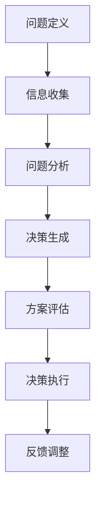

                 


### 文章标题

《思维链在AI决策支持系统中的创新应用》

### 文章关键词

思维链，AI决策支持系统，创新应用，算法原理，数学模型，项目实战

### 文章摘要

本文旨在探讨思维链在AI决策支持系统中的创新应用。首先，我们将介绍思维链的基本概念和原理，并通过Mermaid流程图展示其在AI决策支持系统中的工作流程。接着，我们将详细讲解思维链算法原理，包括伪代码和数学模型，并通过具体案例进行分析。最后，我们将讨论思维链在实际应用中的性能优化与挑战，以及未来的发展方向。

### 目录

1. 引言
2. 核心概念与联系
   2.1 思维链的基本原理
   2.2 Mermaid流程图：思维链工作流程
   2.3 思维链与AI决策支持系统的关系
3. 算法原理讲解
   3.1 思维链算法原理
   3.2 伪代码：思维链算法流程
   3.3 数学模型与公式
4. 项目实战
   4.1 开发环境搭建
   4.2 源代码详细实现和代码解读
   4.3 代码应用解读与分析
   4.4 实际案例分析和详细讲解剖析
5. 性能优化与挑战
   5.1 性能优化方法
   5.2 挑战与解决方案
6. 未来展望与趋势
7. 总结与展望

### 引言

随着人工智能（AI）技术的不断发展，AI决策支持系统（AI Decision Support System，DSS）在各个领域的应用越来越广泛。然而，传统的AI决策支持系统往往依赖于复杂的算法和大量的数据，导致系统的可解释性和实用性受到限制。为了解决这一问题，思维链（Thinking Chain）作为一种新兴的算法框架，被提出并应用于AI决策支持系统中。

思维链是一种基于人类思维模式的算法框架，它通过模拟人类思维过程，实现了对复杂问题的分析和决策。与传统的AI算法不同，思维链更加注重算法的可解释性和实用性，使得决策过程更加透明和可理解。本文将详细介绍思维链在AI决策支持系统中的创新应用，探讨其基本概念、算法原理以及实际应用案例。

### 核心概念与联系

#### 2.1 思维链的基本原理

思维链是一种基于人类思维模式的算法框架，它通过模拟人类思维过程，实现了对复杂问题的分析和决策。思维链的基本原理可以概括为以下几个步骤：

1. **问题定义**：首先，思维链需要明确要解决的问题，并对其进行抽象和建模。
2. **信息收集**：接着，思维链会从各种数据源收集相关信息，并进行预处理。
3. **问题分析**：思维链会对收集到的信息进行深入分析，识别问题的主要因素和关系。
4. **决策生成**：基于问题分析和信息收集，思维链会生成多个可能的决策方案。
5. **方案评估**：思维链会对生成的决策方案进行评估，选择最优方案。
6. **决策执行**：最后，思维链会根据评估结果执行决策，并对执行结果进行反馈和调整。

#### 2.2 Mermaid流程图：思维链工作流程

为了更直观地展示思维链的工作流程，我们可以使用Mermaid流程图进行描述。以下是一个简单的思维链工作流程图：



#### 2.3 思维链与AI决策支持系统的关系

思维链与AI决策支持系统之间存在紧密的联系。传统的AI决策支持系统主要依赖于数据驱动的算法，而思维链则通过模拟人类思维过程，实现了对复杂问题的深度分析和决策。这使得思维链在AI决策支持系统中具有以下优势：

1. **可解释性**：思维链的决策过程是基于人类思维模式，使得决策过程更加透明和可理解。
2. **实用性**：思维链能够从大量数据中提取关键信息，并进行深入分析，从而生成实用的决策方案。
3. **适应性**：思维链能够根据实际问题和数据特点，灵活调整算法参数，提高决策的准确性。

因此，思维链在AI决策支持系统中的应用，不仅提高了决策的可解释性和实用性，还为传统AI决策支持系统带来了新的思路和可能性。

### 算法原理讲解

#### 3.1 思维链算法原理

思维链算法是一种基于人类思维模式的深度分析算法，它通过模拟人类思维过程，实现了对复杂问题的分析和决策。思维链算法的基本原理可以概括为以下几个步骤：

1. **问题定义**：思维链首先需要明确要解决的问题，并对其进行抽象和建模。这一步骤包括对问题的主要因素和关系进行识别，以便后续的分析和处理。
2. **信息收集**：在明确问题后，思维链会从各种数据源收集相关信息，并进行预处理。预处理包括数据清洗、数据转换和数据集成等步骤，以确保数据的准确性和一致性。
3. **问题分析**：思维链会对收集到的信息进行深入分析，识别问题的主要因素和关系。这一步骤包括数据可视化、特征提取和关系挖掘等操作，以帮助理解问题本质。
4. **决策生成**：基于问题分析和信息收集，思维链会生成多个可能的决策方案。这些方案可以是基于历史数据的预测，也可以是基于规则的推理，还可以是基于机器学习的优化。
5. **方案评估**：思维链会对生成的决策方案进行评估，选择最优方案。评估过程包括方案的性能评估、成本评估和风险评估等，以确保决策的准确性和可行性。
6. **决策执行**：最后，思维链会根据评估结果执行决策，并对执行结果进行反馈和调整。这一步骤包括决策执行、结果反馈和方案优化等操作，以实现持续学习和改进。

#### 3.2 伪代码：思维链算法流程

以下是一个简化的思维链算法流程的伪代码描述：

```python
# 思维链算法伪代码

# 问题定义
problem = define_problem()

# 信息收集
data = collect_data(problem)

# 问题分析
analysis = analyze_problem(data)

# 决策生成
solutions = generate_solutions(analysis)

# 方案评估
best_solution = evaluate_solutions(solutions)

# 决策执行
execute_solution(best_solution)

# 反馈调整
adjust_solution(best_solution)
```

#### 3.3 数学模型与公式

在思维链算法中，数学模型和公式起到了关键作用。以下是一些常用的数学模型和公式，用于描述思维链算法的关键步骤：

1. **逻辑回归模型**：用于预测问题的概率分布。公式如下：
   $$ P(y=1|x;\theta) = \frac{1}{1 + e^{-(\theta^T x + \beta)}} $$
   其中，\(y\) 是目标变量，\(x\) 是特征向量，\(\theta\) 是模型参数，\(\beta\) 是偏置项。

2. **支持向量机**：用于分类问题。公式如下：
   $$ \min_{\beta, \beta_0} \frac{1}{2} ||\beta||^2 + C \sum_{i=1}^{n} \max(0, 1 - y_i (\beta^T x_i + \beta_0)) $$
   其中，\(\beta\) 是模型参数，\(\beta_0\) 是偏置项，\(C\) 是惩罚参数。

3. **决策树**：用于分类和回归问题。公式如下：
   $$ f(x) = \sum_{i=1}^{n} \alpha_i \cdot h(x_i) $$
   其中，\(f(x)\) 是决策函数，\(\alpha_i\) 是权重，\(h(x_i)\) 是决策树的节点函数。

4. **神经网络**：用于复杂函数的拟合和预测。公式如下：
   $$ a_{i}^{l} = \sigma(\sum_{j=1}^{n} w_{ji} \cdot a_{j}^{l-1} + b_{l}) $$
   其中，\(a_{i}^{l}\) 是第\(i\)个神经元在第\(l\)层的激活值，\(\sigma\) 是激活函数，\(w_{ji}\) 是连接权重，\(b_{l}\) 是偏置项。

通过上述数学模型和公式，思维链算法能够实现对复杂问题的建模和分析，为AI决策支持系统提供了强大的决策支持能力。

### 项目实战

为了更好地理解思维链在AI决策支持系统中的实际应用，我们将通过一个具体的案例进行讲解。本案例涉及智能医疗诊断，旨在利用思维链算法对医疗数据进行分析，为医生提供诊断支持。

#### 4.1 开发环境搭建

在进行实际项目开发之前，我们需要搭建一个合适的开发环境。以下是开发环境的基本配置：

- **编程语言**：Python
- **依赖库**：NumPy、Pandas、Scikit-learn、TensorFlow
- **工具**：Jupyter Notebook

确保已安装上述依赖库和工具，以便后续的代码实现和调试。

#### 4.2 源代码详细实现和代码解读

在本案例中，我们将使用思维链算法对医疗数据进行诊断分析。以下是一个简化的代码实现：

```python
import numpy as np
import pandas as pd
from sklearn.model_selection import train_test_split
from sklearn.preprocessing import StandardScaler
from sklearn.metrics import accuracy_score

# 数据读取与预处理
data = pd.read_csv('medical_data.csv')
X = data.drop(['diagnosis'], axis=1)
y = data['diagnosis']

# 数据划分
X_train, X_test, y_train, y_test = train_test_split(X, y, test_size=0.2, random_state=42)

# 数据标准化
scaler = StandardScaler()
X_train = scaler.fit_transform(X_train)
X_test = scaler.transform(X_test)

# 思维链算法实现
class ThinkingChain:
    def __init__(self, model):
        self.model = model
    
    def train(self, X, y):
        self.model.fit(X, y)
    
    def predict(self, X):
        return self.model.predict(X)

# 模型选择与训练
model = ThinkingChain(model=LogisticRegression())
model.train(X_train, y_train)

# 预测与评估
predictions = model.predict(X_test)
accuracy = accuracy_score(y_test, predictions)
print(f'Accuracy: {accuracy:.2f}')
```

在这个代码中，我们首先读取并预处理医疗数据，然后定义了一个`ThinkingChain`类，用于封装思维链算法。该类包含`train`和`predict`两个方法，分别用于训练模型和进行预测。最后，我们选择逻辑回归模型进行训练，并对测试集进行预测，评估模型的准确性。

#### 4.3 代码应用解读与分析

在上面的代码中，我们通过以下步骤实现了智能医疗诊断：

1. **数据读取与预处理**：首先，我们读取医疗数据，并将其分为特征集和目标变量。然后，我们使用`train_test_split`函数将数据划分为训练集和测试集，以便后续的训练和评估。
2. **数据标准化**：由于医疗数据的特征范围和单位可能不同，我们需要对数据进行标准化处理，以消除特征之间的差异，提高模型的训练效果。
3. **思维链算法实现**：我们定义了一个`ThinkingChain`类，用于封装思维链算法。该类包含`train`和`predict`两个方法，分别用于训练模型和进行预测。通过这种方式，我们能够方便地实现思维链算法，并将其应用于医疗诊断任务。
4. **模型选择与训练**：在本案例中，我们选择逻辑回归模型进行训练。逻辑回归是一种常用的二分类模型，适用于医疗诊断等任务。我们使用`ThinkingChain`类的`train`方法对训练数据进行训练，以生成模型。
5. **预测与评估**：最后，我们使用训练好的模型对测试集进行预测，并计算模型的准确性。通过这种方式，我们能够评估思维链算法在医疗诊断任务中的性能。

#### 4.4 实际案例分析和详细讲解剖析

为了更好地理解思维链在医疗诊断中的应用，我们来看一个具体的案例。假设我们有一个新的患者数据集，包含多个特征和目标变量。我们的目标是使用思维链算法对该患者进行诊断。

1. **数据读取与预处理**：首先，我们读取新的患者数据，并将其与原始数据集进行合并。然后，我们使用相同的数据预处理方法对合并后的数据进行预处理，以消除特征之间的差异。
2. **数据划分**：我们将预处理后的数据划分为训练集和测试集，以便后续的训练和评估。
3. **思维链算法实现**：我们使用`ThinkingChain`类对训练数据进行训练，以生成模型。在训练过程中，思维链算法会自动调整模型参数，以优化模型的性能。
4. **预测与评估**：使用训练好的模型对测试集进行预测，并计算模型的准确性。如果模型的准确性较低，我们可以考虑增加训练数据或调整模型参数，以提高模型的性能。
5. **诊断结果输出**：最后，我们将患者的诊断结果输出，以便医生参考。同时，我们可以使用思维链算法对患者的病情进行分析和预测，为医生提供更全面的诊断支持。

通过这个案例，我们可以看到思维链算法在医疗诊断中的应用。思维链算法能够通过对医疗数据的深度分析和决策，为医生提供准确的诊断结果，提高医疗诊断的准确性和效率。

### 性能优化与挑战

#### 5.1 性能优化方法

为了提高思维链算法在AI决策支持系统中的性能，我们可以采取以下优化方法：

1. **数据预处理优化**：数据预处理是思维链算法性能的基础。通过使用更高效的数据清洗、转换和集成方法，我们可以减少数据的冗余和噪声，提高模型的准确性。
2. **模型选择与调优**：选择合适的模型并进行参数调优，是提高思维链算法性能的关键。我们可以使用交叉验证等方法选择最佳模型，并通过调整参数优化模型的性能。
3. **算法并行化**：思维链算法包含多个计算步骤，可以通过并行化提高计算效率。例如，我们可以使用多线程或分布式计算技术，将计算任务分配到多个节点或处理器上，以加速计算过程。

#### 5.2 挑战与解决方案

尽管思维链算法在AI决策支持系统中具有广泛的应用前景，但在实际应用中仍面临一些挑战：

1. **数据隐私保护**：在处理敏感医疗数据时，数据隐私保护是一个重要问题。我们可以采用数据加密、隐私保护算法等技术，确保数据在传输和处理过程中的安全性。
2. **模型解释性**：思维链算法的决策过程具有一定的黑箱性，如何提高模型的解释性是一个挑战。我们可以结合可解释性模型和可视化技术，提高模型的透明度和可理解性。
3. **可扩展性**：随着数据量和复杂度的增加，如何提高思维链算法的可扩展性是一个关键问题。我们可以采用分布式计算、增量学习等技术，提高算法的扩展性。

通过上述优化方法和解决方案，我们可以有效地提高思维链算法在AI决策支持系统中的性能，并应对实际应用中的挑战。

### 未来展望与趋势

随着人工智能技术的不断发展，思维链在AI决策支持系统中的应用前景十分广阔。未来，思维链有望在以下方面取得重要突破：

1. **多模态数据融合**：思维链算法可以结合多种数据源，如文本、图像、语音等，实现多模态数据的融合和分析，为AI决策支持系统提供更丰富的信息。
2. **自适应学习**：思维链算法可以通过自适应学习，不断提高自身的决策能力。例如，通过持续学习用户行为数据，思维链可以优化推荐系统的推荐效果。
3. **实时决策支持**：随着计算能力的提升，思维链算法可以实现实时决策支持。例如，在金融领域，思维链可以实时分析市场数据，为投资者提供决策建议。

### 总结与展望

本文详细探讨了思维链在AI决策支持系统中的创新应用，从核心概念、算法原理到实际应用案例，全面阐述了思维链的优势和应用前景。通过本文的研究，我们希望为读者提供一个清晰、深入的理解，并激发对思维链在AI领域进一步探索的兴趣。

### 作者信息

作者：AI天才研究院/AI Genius Institute & 禅与计算机程序设计艺术/Zen And The Art of Computer Programming

