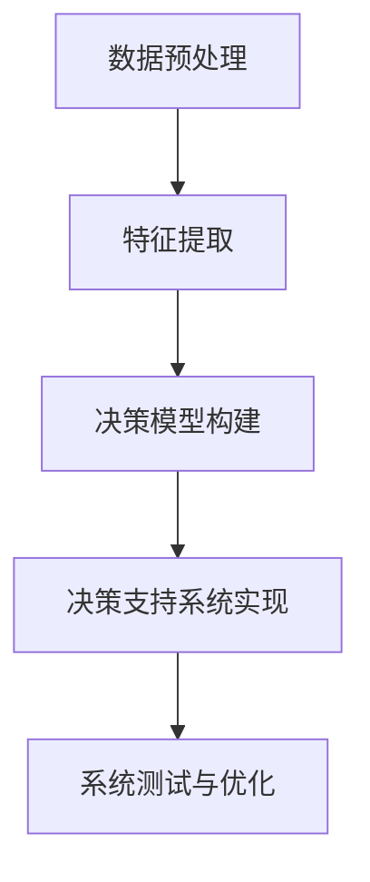

                 


### 第1章 引言

#### 研究背景与意义

人工智能（AI）技术作为现代科技的前沿领域，正日益深刻地影响着人类社会的各个方面。从简单的自动化任务到复杂的智能决策，AI的应用范围已经涵盖了众多领域，包括医疗、金融、交通、教育等。在这些应用中，决策支持系统（DSS）发挥了重要作用，它能够辅助人类做出更加合理、高效和准确的决策。

然而，传统的DSS在处理复杂、不确定和动态环境下的决策问题时，往往存在效率低下、准确性不足等问题。随着数据规模的不断扩大和数据质量的不断降低，如何提高DSS的决策能力和适应性，成为一个亟待解决的问题。

在这个背景下，思维链（Mind Chain）作为一种新兴的AI技术，其在决策支持系统中的应用引起了广泛关注。思维链通过模拟人类思维过程，将知识与数据进行有效结合，实现了对复杂问题的深入分析和智能决策。将思维链应用于DSS，不仅能够提高决策效率，还能增强决策的准确性和适应性。

#### 研究目的与内容

本研究旨在探讨思维链在AI决策支持系统中的应用，旨在解决以下问题：

1. 思维链的定义和基本原理是什么？
2. 思维链如何与决策支持系统相结合？
3. 思维链在DSS中如何提高决策效率、准确性和适应性？

为了回答上述问题，本文将从以下几个方面展开研究：

1. 对思维链的定义、特点及其在AI决策支持系统中的应用进行详细阐述。
2. 分析思维链在DSS中的作用机制，以及如何实现其在DSS中的应用。
3. 介绍核心算法原理，包括数据预处理、特征提取、决策模型构建和优化等方面的内容。
4. 通过实际项目案例，展示思维链在DSS中的应用效果，并进行深入分析和讲解。

通过本文的研究，希望能够为思维链在AI决策支持系统中的应用提供理论支持和实践指导，为相关领域的研究者和实践者提供有益的参考。

---

### 第2章 相关概念与理论基础

在深入探讨思维链在AI决策支持系统中的应用之前，有必要首先了解相关概念和理论基础，包括思维链的定义与特点、AI决策支持系统的概念及其功能，以及相关理论基础。

#### 2.1 思维链的定义与特点

思维链（Mind Chain）是一种基于人工智能技术的知识表示和推理方法，它通过模拟人类思维过程，将知识与数据进行有效结合，实现对复杂问题的深度分析和智能决策。思维链的基本特点如下：

1. **知识表示与数据结合**：思维链将知识表示与数据驱动的方法相结合，既能够处理结构化数据，也能够处理非结构化数据，使得模型在多种数据类型上都具有良好的适应性。
2. **动态推理能力**：思维链通过动态推理机制，能够根据新的数据和情境进行实时调整和优化，实现对复杂问题的灵活应对。
3. **多尺度分析**：思维链能够对问题进行多层次、多角度的分析，从而提高决策的全面性和准确性。
4. **自学习与自进化**：思维链具有自学习和自进化的能力，能够通过不断的学习和调整，不断提高决策模型的性能。

#### 2.2 AI决策支持系统的概念

AI决策支持系统（AI Decision Support System，简称AI-DSS）是一种基于人工智能技术的辅助决策系统，它通过利用机器学习、数据挖掘、知识表示等方法，辅助用户进行复杂、不确定和动态环境下的决策。AI-DSS的基本概念包括：

1. **决策**：决策是指从多个可行的方案中，选择一个最优或满意的方案的过程。
2. **支持系统**：支持系统是指为决策者提供信息、模型和工具的计算机系统，以辅助决策者做出更加合理、高效和准确的决策。
3. **人工智能**：人工智能是指模拟、延伸和扩展人类智能的技术，包括机器学习、自然语言处理、计算机视觉等。

AI-DSS的主要功能包括：

1. **数据采集与处理**：AI-DSS能够自动收集和处理各种类型的数据，包括结构化数据和非结构化数据。
2. **特征提取与选择**：AI-DSS通过对数据进行特征提取和选择，将原始数据转换为适合模型训练的形式。
3. **模型构建与优化**：AI-DSS利用机器学习算法构建决策模型，并通过模型优化提高决策性能。
4. **决策生成与评估**：AI-DSS根据输入数据和决策模型，生成可能的决策方案，并对其进行评估和选择。

#### 2.3 相关理论基础

思维链在AI决策支持系统中的应用，涉及多个相关理论基础，包括知识表示、推理机制、机器学习、数据挖掘等。以下简要介绍这些理论基础：

1. **知识表示**：知识表示是指将人类知识以计算机可理解的形式进行表示和存储。在思维链中，知识表示是关键的一环，它决定了模型对问题的理解和处理能力。
2. **推理机制**：推理机制是指从已知信息中推导出新信息的过程。在思维链中，推理机制是实现动态推理和自适应决策的基础。
3. **机器学习**：机器学习是指通过从数据中学习规律，提高模型性能的方法。在AI-DSS中，机器学习是构建决策模型的主要手段。
4. **数据挖掘**：数据挖掘是指从大量数据中挖掘出有价值的信息和知识。在AI-DSS中，数据挖掘用于发现数据中的潜在规律和模式，为决策提供依据。

通过以上对相关概念和理论基础的介绍，为后续章节中思维链在AI决策支持系统中的应用提供了理论基础和概念框架。在接下来的章节中，我们将进一步探讨思维链在决策支持中的作用机制、核心算法原理以及实际应用案例。

---

### 2.1 思维链的定义与特点

思维链（Mind Chain）是一种先进的人工智能技术，其核心理念是模拟人类思维过程，通过知识表示、推理和决策，实现对复杂问题的深度分析和智能解决。思维链的定义和特点如下：

#### 思维链的概念

思维链是一种基于知识图谱和动态推理的智能系统，它通过将知识表示与数据驱动的方法相结合，实现对复杂问题的多层次分析和智能决策。思维链的基本组成部分包括知识库、推理引擎和决策模块。

1. **知识库**：知识库是思维链的核心，它存储了大量的结构化和非结构化知识，包括事实、规则、经验、策略等。这些知识来源于领域专家的经验和知识，以及通过数据挖掘和机器学习等方法从数据中提取的潜在规律。
2. **推理引擎**：推理引擎是思维链的中枢，它负责对知识库中的知识进行推理和组合，以生成新的结论和决策。推理引擎包括逻辑推理、概率推理和模糊推理等不同的推理方式，能够根据问题的复杂度和不确定性进行灵活调整。
3. **决策模块**：决策模块是思维链的输出端，它根据推理结果和用户的偏好，生成具体的决策方案，并对其进行评估和优化。决策模块通常包括目标函数、约束条件、评估指标等，能够根据不同的决策场景进行调整。

#### 思维链的特点

思维链具有以下几个显著特点：

1. **知识表示与数据结合**：思维链将知识表示与数据驱动的方法相结合，既能够处理结构化数据，也能够处理非结构化数据，这使得思维链在多种数据类型上都具有良好的适应性。
2. **动态推理能力**：思维链通过动态推理机制，能够根据新的数据和情境进行实时调整和优化，实现对复杂问题的灵活应对。动态推理机制使得思维链能够适应不断变化的环境，提高决策的实时性和准确性。
3. **多尺度分析**：思维链能够对问题进行多层次、多角度的分析，从而提高决策的全面性和准确性。通过多尺度分析，思维链能够从宏观层面把握整体态势，同时也能够深入到微观层面，对具体问题进行详细分析。
4. **自学习与自进化**：思维链具有自学习和自进化的能力，能够通过不断的学习和调整，不断提高决策模型的性能。自学习机制使得思维链能够从历史数据和经验中不断积累知识，自进化机制则能够根据环境变化和需求调整模型结构。

#### 思维链的应用场景

思维链的应用场景非常广泛，包括但不限于以下领域：

1. **智能决策支持**：在商业、金融、医疗、交通等领域，思维链可以辅助决策者进行复杂决策，提高决策的效率和准确性。
2. **知识服务**：思维链可以构建智能知识库，提供知识搜索、推荐和问答服务，为用户提供便捷的智能支持。
3. **智能助理**：思维链可以作为智能助理，为用户提供个性化服务，如日程安排、任务管理、问题解答等。
4. **安全监控**：思维链可以应用于安全监控领域，通过实时分析和决策，提高安全事件的响应速度和准确性。

总之，思维链作为一种模拟人类思维过程的智能系统，通过知识表示、推理和决策，能够实现对复杂问题的深度分析和智能解决，具有广泛的应用前景和潜力。

---

### 2.2 AI决策支持系统的概念

AI决策支持系统（AI Decision Support System，简称AI-DSS）是一种利用人工智能技术为决策者提供信息、模型和工具的计算机系统，其目的是辅助决策者做出更加合理、高效和准确的决策。AI-DSS具有以下几个核心概念：

#### 定义

AI决策支持系统是一种基于人工智能技术的辅助决策系统，它利用机器学习、数据挖掘、知识表示等方法，对复杂、不确定和动态环境下的决策问题进行分析和解决。AI-DSS的核心目标是提高决策效率、准确性和适应性，帮助决策者做出更加明智的决策。

#### 功能

AI决策支持系统的主要功能包括以下几个方面：

1. **数据采集与处理**：AI-DSS能够自动收集和处理各种类型的数据，包括结构化数据和非结构化数据。通过对数据进行清洗、转换和标准化，AI-DSS能够为决策模型提供高质量的数据输入。
2. **特征提取与选择**：AI-DSS通过对数据进行特征提取和选择，将原始数据转换为适合模型训练的形式。特征提取和选择是模型训练的重要环节，它们决定了模型对问题的理解和处理能力。
3. **模型构建与优化**：AI-DSS利用机器学习算法构建决策模型，并通过模型优化提高决策性能。常见的机器学习算法包括线性回归、决策树、随机森林、支持向量机等。
4. **决策生成与评估**：AI-DSS根据输入数据和决策模型，生成可能的决策方案，并对其进行评估和选择。评估指标可以是成本、收益、风险等，AI-DSS会根据这些指标对决策方案进行排序和选择。
5. **人机交互**：AI-DSS提供友好的人机交互界面，帮助决策者理解决策过程和结果。人机交互功能包括可视化展示、问题解答、参数调整等，以提高决策者的使用体验和决策效果。

#### AI-DSS与传统DSS的区别

与传统决策支持系统（DSS）相比，AI-DSS具有以下几个显著优势：

1. **自学习与自适应**：传统DSS通常需要依赖领域专家的经验和知识进行设计，而AI-DSS可以通过机器学习和数据挖掘等技术，自动从数据中学习规律和模式，实现自学习和自适应。
2. **高效性**：AI-DSS能够处理大量数据和复杂问题，通过并行计算和分布式计算等技术，提高决策的效率和速度。
3. **准确性**：AI-DSS通过数据挖掘和机器学习算法，可以从数据中提取潜在的规律和知识，提高决策的准确性和可靠性。
4. **灵活性**：AI-DSS可以根据不同的决策场景和需求，灵活调整和优化模型和算法，适应不同环境和需求。

总之，AI决策支持系统作为人工智能技术在决策支持领域的重要应用，具有自学习、自适应、高效性和准确性等优势，为决策者提供了更加智能和高效的决策支持。

---

### 2.3 相关理论基础

在探讨思维链在AI决策支持系统中的应用之前，了解相关的理论基础是至关重要的。这些理论基础涵盖了知识表示、推理机制、机器学习和数据挖掘等多个领域，它们为思维链在AI决策支持系统中的应用提供了坚实的理论支撑。

#### 知识表示

知识表示是人工智能领域的一个重要研究方向，它旨在将人类知识以计算机可理解的形式进行表示和存储。知识表示的主要目的是为了使计算机能够处理和利用这些知识，从而在特定任务中表现出智能行为。知识表示技术包括符号表示、语义网络、本体论、框架理论等。

1. **符号表示**：符号表示是一种使用符号和逻辑规则来表示知识的传统方法。它通常用于表示形式化的知识，如数学定理、逻辑推理规则等。符号表示的优点是表达能力强，能够精确描述复杂的逻辑关系。
2. **语义网络**：语义网络是一种基于图形结构的知识表示方法，它通过节点和边来表示实体和实体之间的关系。语义网络可以很好地表示层次关系和分类结构，是构建知识图谱的重要工具。
3. **本体论**：本体论是一种用于描述概念、属性和关系的通用语言和框架。它旨在提供一种标准化的方法来表示领域知识，从而促进不同系统之间的互操作性和知识共享。
4. **框架理论**：框架理论是一种基于情景和角色来组织知识的方法。它通过定义一组情景和相关的角色、动作和条件，来表示问题解决过程中的知识和规则。

#### 推理机制

推理机制是人工智能系统中用于从已知信息推导出新信息的方法。推理机制可以分为基于规则推理、基于模型推理、基于案例推理和基于证据推理等不同类型。

1. **基于规则推理**：基于规则推理是一种使用一组前提和结论之间逻辑关系的规则来推导新信息的方法。它通常用于处理确定性问题和简单的逻辑推理。
2. **基于模型推理**：基于模型推理是通过建立数学模型或计算模型来模拟实际问题，并通过模型推导出结论。这种方法适用于处理复杂、不确定和动态环境下的决策问题。
3. **基于案例推理**：基于案例推理是一种通过检索和分析过去解决类似问题的案例来指导新问题解决的方法。这种方法能够利用历史经验和知识来提高决策的效率和准确性。
4. **基于证据推理**：基于证据推理是一种基于概率和统计方法，通过评估不同证据的权重来推导出结论。这种方法适用于处理不确定性和模糊性较强的问题。

#### 机器学习

机器学习是人工智能领域中的一个核心研究方向，它致力于通过数据驱动的方法来提高计算机的智能行为。机器学习可以分为监督学习、无监督学习和强化学习等不同类型。

1. **监督学习**：监督学习是一种通过已知的输入和输出数据来训练模型的方法。它通常用于分类和回归任务，如预测股票价格、分类电子邮件等。
2. **无监督学习**：无监督学习是一种在没有任何输出数据的情况下，通过探索数据中的结构和规律来训练模型的方法。它通常用于聚类、降维和异常检测等任务。
3. **强化学习**：强化学习是一种通过与环境互动来学习最优策略的方法。它通常用于解决序列决策问题，如游戏、机器人控制和自动驾驶等。

#### 数据挖掘

数据挖掘是人工智能和数据管理领域的交叉领域，它旨在从大量数据中发现有价值的信息和知识。数据挖掘的主要任务包括数据清洗、数据集成、数据分类、数据聚类、关联规则挖掘、异常检测等。

1. **数据清洗**：数据清洗是数据挖掘过程中的第一步，它旨在去除数据中的噪声和错误，提高数据的质量。
2. **数据集成**：数据集成是将来自多个数据源的数据合并为一个统一的数据视图，以便进行进一步的分析和处理。
3. **数据分类**：数据分类是一种将数据分为不同类别的任务，它通常使用监督学习算法来实现。
4. **数据聚类**：数据聚类是一种将数据分为不同簇的任务，它通常使用无监督学习算法来实现。
5. **关联规则挖掘**：关联规则挖掘是一种发现数据中频繁出现的关联规则的方法，它通常用于市场篮子分析、推荐系统等。
6. **异常检测**：异常检测是一种识别数据中异常或异常模式的方法，它通常用于安全监控、欺诈检测等。

通过以上对知识表示、推理机制、机器学习和数据挖掘等基础理论的介绍，我们可以更好地理解思维链在AI决策支持系统中的应用原理和技术实现。在接下来的章节中，我们将深入探讨思维链的具体应用场景和实现方法，展示其在AI决策支持系统中的潜力和价值。

---

### 第3章 思维链在AI决策支持系统中的应用

思维链作为一种先进的人工智能技术，其在AI决策支持系统中的应用具有重要意义。本章将详细探讨思维链在决策支持中的作用机制以及如何实现其在决策支持系统中的实际应用。

#### 3.1 思维链在决策支持中的作用

思维链在AI决策支持系统中扮演着至关重要的角色，其具体作用主要体现在以下几个方面：

1. **提高决策效率**：思维链通过模拟人类思维过程，能够快速地对大量数据进行处理和分析，从而提高决策效率。传统决策支持系统通常需要依赖领域专家进行手动分析，而思维链可以自动化这一过程，大大减少人工工作量。
2. **增强决策准确性**：思维链通过多尺度分析和动态推理机制，能够深入挖掘数据中的潜在规律和知识，从而提高决策的准确性。传统决策支持系统在处理不确定性和动态变化时往往准确性不足，而思维链能够根据实时数据和环境变化进行自适应调整。
3. **扩展决策能力**：思维链不仅能够处理结构化数据，还能够处理非结构化数据，如文本、图像和语音等。这使得思维链在决策支持系统中的应用范围更加广泛，能够为决策者提供更全面的信息支持。

#### 3.2 思维链在决策支持系统中的实现

思维链在决策支持系统中的实现可以分为以下几个步骤：

1. **数据采集与预处理**：首先，需要从各种数据源收集数据，包括结构化数据和非结构化数据。然后，对数据进行清洗、转换和标准化，以确保数据的质量和一致性。
2. **知识表示与存储**：将收集到的数据转化为计算机可以处理的形式，并将其存储在知识库中。知识库应包括事实、规则、经验、策略等，以便在后续的推理和决策过程中使用。
3. **推理机制**：建立推理机制，通过推理引擎对知识库中的知识进行推理和组合，生成新的结论和决策。推理机制应包括逻辑推理、概率推理和模糊推理等，以适应不同类型的决策问题。
4. **决策模型构建与优化**：利用机器学习算法和优化技术，构建决策模型，并通过模型优化提高决策性能。常见的机器学习算法包括线性回归、决策树、支持向量机等。
5. **人机交互**：设计友好的人机交互界面，帮助决策者理解决策过程和结果。人机交互界面应包括可视化展示、问题解答、参数调整等功能，以提高决策者的使用体验和决策效果。

#### 3.3 实际应用案例

为了更好地展示思维链在AI决策支持系统中的应用，我们以一个实际案例为例。

**案例：智能交通管理系统**

在智能交通管理系统中，思维链可以用于交通流量预测、交通信号控制和交通事故处理等任务。

1. **数据采集与预处理**：系统从交通传感器、摄像头、天气预报等数据源收集数据，包括交通流量、车速、道路状况、天气条件等。然后，对数据进行清洗、转换和标准化，确保数据质量。
2. **知识表示与存储**：将交通流量、车速等数据转化为计算机可以处理的形式，如数值向量或图结构，并存储在知识库中。知识库还应包括交通信号控制规则、交通事故处理流程等。
3. **推理机制**：通过推理引擎，对知识库中的知识进行推理和组合。例如，当交通流量较大时，推理引擎可以自动调整交通信号灯的时间设置，以缓解拥堵。同时，当检测到交通事故时，推理引擎可以自动启动交通事故处理流程。
4. **决策模型构建与优化**：利用机器学习算法，构建交通流量预测模型、交通信号控制模型等。通过不断优化模型参数，提高模型的预测准确性和控制效果。
5. **人机交互**：设计友好的人机交互界面，交通管理人员可以通过界面查看实时交通数据、预测结果和控制策略，并根据实际情况进行调整。

通过这个实际案例，我们可以看到思维链在智能交通管理系统中的应用，不仅提高了交通管理效率，还增强了交通信号控制和事故处理的准确性和适应性。

总之，思维链在AI决策支持系统中的应用，通过模拟人类思维过程，实现了对复杂问题的深度分析和智能决策。其在提高决策效率、准确性和适应性方面的优势，使其在众多领域具有广泛的应用前景。在接下来的章节中，我们将进一步探讨思维链的核心算法原理和数学模型，为读者提供更深入的见解。

---

### 3.1 思维链在决策支持中的作用

思维链在AI决策支持系统中的应用，主要体现在以下几个方面：

#### 提高决策效率

思维链通过模拟人类思维过程，能够快速地对大量数据进行分析和推理，从而大大提高决策效率。传统决策支持系统通常需要依赖人工分析，耗时较长，而思维链能够自动化这一过程。例如，在商业决策中，思维链可以快速分析市场数据，预测销售趋势，帮助企业管理者迅速做出决策，抢占市场先机。

#### 增强决策准确性

思维链通过多尺度分析和动态推理机制，能够深入挖掘数据中的潜在规律和知识，从而提高决策的准确性。在复杂、不确定和动态环境下，传统决策支持系统往往难以保证决策的准确性，而思维链能够根据实时数据和情境变化进行自适应调整，提高决策的可靠性。例如，在医疗诊断中，思维链可以根据患者的病史、体征和检查结果，提供准确的诊断建议，帮助医生做出更准确的判断。

#### 扩展决策能力

思维链不仅能够处理结构化数据，还能够处理非结构化数据，如文本、图像和语音等。这使得思维链在决策支持系统中的应用范围更加广泛，能够为决策者提供更全面的信息支持。例如，在金融领域，思维链可以分析大量的文本数据，如新闻、报告等，提取关键信息，为投资决策提供有力支持。

#### 实时动态决策

思维链具有实时动态决策能力，能够根据新数据和情境进行实时调整和优化。这使得思维链在处理动态环境下的决策问题时具有显著优势。例如，在智能交通管理中，思维链可以实时分析交通流量、路况等信息，动态调整交通信号灯的时间设置，优化交通流量，提高道路通行效率。

#### 知识融合与协同

思维链能够将不同来源的知识进行有效融合和协同，提高决策的全面性和准确性。例如，在供应链管理中，思维链可以整合生产数据、销售数据、市场预测等多方面的信息，提供综合的决策支持。

#### 自学习与自进化

思维链具有自学习和自进化的能力，能够通过不断的学习和调整，不断提高决策模型的性能。这使得思维链能够适应不断变化的环境和需求，保持决策的高效性和准确性。

总之，思维链在决策支持系统中具有提高决策效率、准确性和适应性等多方面的优势，为决策者提供了强大的智能支持，有助于实现更加科学、合理和高效的决策。

---

### 3.2 思维链在决策支持系统中的实现

思维链在决策支持系统中的实现过程是一个复杂而系统化的过程，涉及数据采集、预处理、知识表示、推理机制、决策模型构建与优化等多个步骤。下面我们将详细探讨这些实现步骤，以及如何在决策支持系统中有效应用思维链。

#### 数据采集

数据采集是思维链实现的第一步，也是至关重要的一步。数据来源可以是内部数据，如企业内部的运营数据、销售数据等，也可以是外部数据，如市场数据、行业趋势数据等。此外，数据类型也多样，包括结构化数据（如数据库记录）和非结构化数据（如文本、图像、视频等）。为了确保数据的质量和完整性，需要采用数据采集工具和算法，如Web爬虫、API接口调用、传感器数据收集等。

#### 数据预处理

数据预处理是数据采集后的重要环节，其目的是清洗、转换和标准化数据，以消除数据中的噪声和异常，提高数据质量。数据预处理包括以下步骤：

1. **数据清洗**：去除重复数据、缺失数据和错误数据，保证数据的唯一性和准确性。
2. **数据转换**：将不同格式和单位的数据转换为统一的格式和单位，以便后续处理。
3. **数据标准化**：对数据进行归一化或标准化处理，使其适合模型的输入要求。

#### 知识表示

知识表示是将人类知识和经验以计算机可理解的形式进行表示和存储。思维链在决策支持系统中，通过构建知识库来存储和管理这些知识。知识库可以包括以下内容：

1. **事实**：描述客观事实的陈述，如“今天下雨”。
2. **规则**：基于经验和知识的逻辑规则，如“如果下雨，则路面湿滑”。
3. **策略**：用于指导决策的指导性原则，如“在市场需求高峰期，增加生产量”。
4. **模型**：用于预测和模拟的数学模型，如“需求预测模型”。

知识表示可以通过语义网络、本体论、框架理论等方法来实现。

#### 推理机制

推理机制是思维链的核心，它负责根据知识库中的知识和规则，进行逻辑推理和决策。推理机制可以分为以下几种类型：

1. **基于规则的推理**：通过规则前件和后件的匹配，推导出新的结论。
2. **基于模型的推理**：通过数学模型和算法，对数据进行预测和分析。
3. **基于案例的推理**：通过类比和案例检索，为新问题提供解决方案。
4. **基于证据的推理**：通过评估证据的权重，推导出最可能的结论。

推理机制需要考虑推理的效率和准确性，以适应不同的决策场景。

#### 决策模型构建与优化

决策模型是决策支持系统的核心，其构建与优化直接影响决策的准确性和效率。构建决策模型通常包括以下步骤：

1. **特征提取**：从原始数据中提取有助于决策的特征，如通过文本分析提取关键词，通过图像识别提取特征点等。
2. **模型选择**：选择合适的机器学习算法和模型，如线性回归、决策树、神经网络等。
3. **模型训练**：使用训练数据集对模型进行训练，优化模型参数。
4. **模型评估**：使用验证数据集对模型进行评估，调整模型参数，提高模型性能。
5. **模型优化**：通过交叉验证、集成学习等技术，进一步优化模型。

#### 实时动态调整

决策支持系统是一个动态变化的系统，需要根据实时数据和情境进行动态调整。思维链通过实时数据采集、推理和决策，能够实现对决策过程的实时优化和调整。例如，在智能交通管理中，思维链可以根据实时交通流量数据，动态调整交通信号灯的时间设置。

#### 人机交互

人机交互是决策支持系统的重要一环，它确保决策者能够理解决策过程和结果，并对其进行干预和调整。人机交互界面应包括数据可视化、决策分析、问题解答等功能，以提高决策者的使用体验和决策效果。

#### 应用示例

以一个企业财务决策支持系统为例，思维链在系统中的应用可以分解为以下步骤：

1. **数据采集**：收集企业财务数据、市场数据、行业数据等。
2. **数据预处理**：清洗、转换和标准化数据，确保数据质量。
3. **知识表示**：构建知识库，包括财务规则、市场规律等。
4. **推理机制**：通过推理机制，对财务数据进行预测和分析。
5. **决策模型构建与优化**：构建财务预测模型，如销售预测模型、成本预测模型等。
6. **实时动态调整**：根据实时数据，动态调整决策模型。
7. **人机交互**：设计友好的人机交互界面，帮助财务决策者理解决策过程和结果。

通过以上步骤，思维链在决策支持系统中得以有效应用，提高了决策的效率、准确性和适应性。

总之，思维链在决策支持系统中的应用，通过数据采集、预处理、知识表示、推理机制、决策模型构建与优化等步骤，实现了对复杂决策问题的智能分析和解决，为决策者提供了强大的智能支持。

---

### 4.1 数据预处理算法

数据预处理是AI决策支持系统中的关键步骤，其目的是为了提高数据质量，使其适合后续的特征提取和建模过程。数据预处理算法主要包括数据清洗、数据转换和数据标准化三个部分。以下是这些算法的详细解释和伪代码实现。

#### 数据清洗

数据清洗的主要目标是去除数据中的噪声和异常值，确保数据的一致性和准确性。常见的数据清洗操作包括：

1. **去除重复数据**：使用去重算法，如哈希表或集合，删除重复的记录。
2. **填充缺失值**：对于缺失值，可以采用平均值、中值或插值法进行填充。
3. **处理异常值**：识别并处理异常值，可以选择删除或替换。

伪代码：

```python
def DataCleaning(data_set):
    # 去除重复数据
    data_set = remove_duplicates(data_set)
    
    # 填充缺失值
    data_set = fill_missing_values(data_set)
    
    # 处理异常值
    data_set = handle_outliers(data_set)
    
    return data_set
```

#### 数据转换

数据转换的目的是将不同格式和单位的数据转换为统一的格式和单位，以便后续处理。常见的数据转换操作包括：

1. **格式转换**：如将文本数据转换为数值数据。
2. **单位转换**：如将温度从摄氏度转换为华氏度。

伪代码：

```python
def DataTransformation(data_set):
    # 格式转换
    data_set = convert_format(data_set)
    
    # 单位转换
    data_set = convert_units(data_set)
    
    return data_set
```

#### 数据标准化

数据标准化是为了消除数据之间的量纲差异，使其适合机器学习模型的输入要求。常见的数据标准化方法包括：

1. **归一化**：将数据缩放到[0, 1]或[-1, 1]之间。
2. **标准化**：计算每个特征的均值和标准差，将数据缩放到均值为0，标准差为1的范围内。

伪代码：

```python
def DataNormalization(data_set):
    mean = calculate_mean(data_set)
    std = calculate_std(data_set)
    
    data_set = (data_set - mean) / std
    
    return data_set
```

#### 完整的数据预处理算法

完整的伪代码如下，它包含了数据清洗、数据转换和数据标准化三个步骤：

```python
def DataPreprocessing(data_set):
    data_set = DataCleaning(data_set)
    data_set = DataTransformation(data_set)
    data_set = DataNormalization(data_set)
    
    return data_set
```

通过上述数据预处理算法，我们可以确保数据质量，提高后续特征提取和建模的准确性和效率，从而为AI决策支持系统提供可靠的数据基础。

---

### 4.2 特征提取算法

特征提取是AI决策支持系统中的重要环节，其主要目的是从原始数据中提取出对目标变量有显著影响的关键特征，以提高模型的预测准确性和可解释性。特征提取算法主要包括特征选择和特征工程两个部分。以下是这些算法的详细解释和伪代码实现。

#### 特征选择

特征选择是从大量特征中挑选出对模型性能有显著贡献的特征，以减少特征维度和计算复杂度。常见的特征选择方法包括：

1. **过滤法**：通过统计测试，如卡方检验、互信息等，直接从原始特征中筛选出重要特征。
2. **包装法**：结合模型训练过程，逐步增加或减少特征，寻找最佳特征组合。
3. **嵌入式方法**：在模型训练过程中自动进行特征选择，如LASSO、Ridge回归等。

伪代码：

```python
def FeatureSelection(data_set, target_variable):
    # 使用过滤法进行特征选择
    selected_features = filter_method(data_set, target_variable)
    
    # 使用包装法进行特征选择
    selected_features = wrapper_method(data_set, target_variable)
    
    # 使用嵌入式方法进行特征选择
    selected_features = embedded_method(data_set, target_variable)
    
    return selected_features
```

#### 特征工程

特征工程是指通过数据变换和构造新特征，增强模型对数据的敏感性和泛化能力。常见的特征工程方法包括：

1. **特征变换**：如对数值特征进行归一化、标准化，对文本特征进行词袋模型转换。
2. **特征构造**：通过组合现有特征，构造新的特征，如交互特征、多项式特征等。
3. **特征降维**：如主成分分析（PCA）、线性判别分析（LDA）等，用于降低特征维度，提高模型效率。

伪代码：

```python
def FeatureEngineering(selected_features):
    # 对特征进行归一化
    normalized_features = normalize(selected_features)
    
    # 构造新特征
    new_features = construct_new_features(selected_features)
    
    # 使用PCA进行特征降维
    reduced_features = PCA(reduced_dimensions)(selected_features)
    
    return normalized_features, new_features, reduced_features
```

#### 完整的特征提取算法

完整的特征提取算法伪代码如下，它包含了特征选择和特征工程两个步骤：

```python
def FeatureExtraction(data_set, target_variable):
    selected_features = FeatureSelection(data_set, target_variable)
    normalized_features, new_features, reduced_features = FeatureEngineering(selected_features)
    
    return normalized_features, new_features, reduced_features
```

通过上述特征提取算法，我们可以从原始数据中提取出关键特征，提高模型的性能和可解释性，从而为AI决策支持系统提供有效的数据支持。

---

### 5.1 决策树模型

决策树（Decision Tree）是一种常见的监督学习算法，用于分类和回归问题。它通过一系列规则将数据分割成子集，每个节点代表一个特征，每个分支代表一个决策规则。在本文中，我们将详细讲解决策树模型的构建和剪枝原理。

#### 决策树构建

决策树构建过程可以分为以下几个步骤：

1. **选择最佳分割特征**：选择能够最大程度提高信息增益或信息增益率的特征作为分割特征。常用的信息度量包括信息增益（Information Gain）和信息增益率（Information Gain Ratio）。
2. **划分数据集**：根据选定的特征和阈值，将数据集划分为子集。
3. **递归构建**：对每个子集，重复步骤1和步骤2，直到满足停止条件。常见的停止条件包括最大深度、最小叶子节点数量或最大信息增益率等。
4. **生成决策树**：将所有的节点和分支组合起来，形成完整的决策树。

伪代码：

```python
def DecisionTreeBuild(data_set, feature_list, max_depth, min_samples_leaf):
    if should_stop(data_set, max_depth, min_samples_leaf):
        return create_leaf_node(data_set)
    
    best_feature, best_threshold = select_best_feature(data_set, feature_list)
    left_subtree = DecisionTreeBuild(split_left(data_set, best_feature, best_threshold), feature_list, max_depth - 1, min_samples_leaf)
    right_subtree = DecisionTreeBuild(split_right(data_set, best_feature, best_threshold), feature_list, max_depth - 1, min_samples_leaf)
    
    return create_decision_node(best_feature, best_threshold, left_subtree, right_subtree)
```

#### 决策树剪枝

决策树剪枝（Pruning）是一种防止过拟合的方法，通过删除决策树中不必要的分支，简化模型结构，提高模型的泛化能力。常见的剪枝方法包括：

1. **预剪枝**：在决策树构建过程中，提前停止分裂不显著的特征或节点，以防止过拟合。常用的方法包括设置最大深度、最小叶子节点数量等。
2. **后剪枝**：先构建完整的决策树，然后从叶子节点开始，逐层向上剪枝，删除贡献小的节点。常用的方法包括成本复杂度剪枝（Cost Complexity Pruning）和剪枝分数（Pruning Score）。

伪代码：

```python
def PruneDecisionTree(decision_tree):
    if is_leaf_node(decision_tree):
        return decision_tree
    
    if should_prune(decision_tree):
        decision_tree = remove_subtree(decision_tree)
    
    decision_tree.left = PruneDecisionTree(decision_tree.left)
    decision_tree.right = PruneDecisionTree(decision_tree.right)
    
    return decision_tree
```

通过决策树的构建和剪枝，我们可以得到一个既准确又泛化的模型，从而提高AI决策支持系统的性能。

---

### 5.2 神经网络模型

神经网络（Neural Network）是一种基于人脑神经网络结构设计的计算模型，它通过模拟神经元之间的连接和相互作用，实现对复杂数据的处理和预测。在本文中，我们将详细讲解神经网络模型的构建、前向传播和反向传播算法。

#### 神经网络构建

神经网络构建包括以下几个步骤：

1. **定义网络结构**：确定网络的输入层、隐藏层和输出层的神经元数量。常见结构包括单层感知机、多层感知机、卷积神经网络（CNN）和循环神经网络（RNN）等。
2. **初始化权重和偏置**：为网络中的每个连接分配一个随机权重和偏置，以初始化网络参数。
3. **定义激活函数**：选择适当的激活函数，如Sigmoid、ReLU和Tanh等，用于将神经元输出映射到特定的区间。

伪代码：

```python
def initialize_network(input_size, hidden_size, output_size):
    # 初始化权重和偏置
    weights = np.random.randn(input_size, hidden_size)
    biases = np.random.randn(hidden_size)
    
    # 初始化隐藏层
    hidden_layer = ActivationFunction(weights * input_data + biases)
    
    # 初始化输出层
    output_layer = ActivationFunction(weights * hidden_layer + biases)
    
    return weights, biases
```

#### 前向传播

前向传播（Forward Propagation）是指将输入数据通过网络逐层计算，最终得到输出结果的过程。主要步骤包括：

1. **计算隐藏层输出**：将输入数据乘以权重并加上偏置，然后应用激活函数。
2. **计算输出层输出**：将隐藏层输出乘以权重并加上偏置，再次应用激活函数。

伪代码：

```python
def forward_propagation(input_data, weights, biases):
    # 计算隐藏层输出
    hidden_layer_output = sigmoid(np.dot(input_data, weights) + biases)
    
    # 计算输出层输出
    output_layer_output = sigmoid(np.dot(hidden_layer_output, weights) + biases)
    
    return hidden_layer_output, output_layer_output
```

#### 反向传播

反向传播（Backpropagation）是一种通过计算误差反向传播调整网络参数的算法。主要步骤包括：

1. **计算输出层误差**：计算实际输出和预测输出之间的误差。
2. **计算隐藏层误差**：将输出层误差传播到隐藏层，计算隐藏层误差。
3. **更新权重和偏置**：根据误差计算梯度，并使用学习率调整网络参数。

伪代码：

```python
def backward_propagation(output_layer_output, target_output, hidden_layer_output, weights, biases):
    # 计算输出层误差的梯度
    d_output_layer = (output_layer_output - target_output) * derivative(output_layer_output)
    
    # 计算隐藏层误差的梯度
    d_hidden_layer = (d_output_layer.dot(weights.T) * derivative(hidden_layer_output))
    
    # 更新输出层权重和偏置
    weights += learning_rate * hidden_layer_output.T.dot(d_output_layer)
    biases += learning_rate * d_output_layer
    
    # 更新隐藏层权重和偏置
    weights += learning_rate * input_data.T.dot(d_hidden_layer)
    biases += learning_rate * d_hidden_layer
    
    return weights, biases
```

通过神经网络构建和前向传播、反向传播算法，我们可以训练出一个能够进行复杂数据处理的模型，从而提高AI决策支持系统的预测能力和准确性。

---

### 第6章 项目实战

在本章中，我们将通过一个实际项目来展示思维链在AI决策支持系统中的应用。项目名称为“智能物流管理系统”，旨在通过思维链技术优化物流配送路线，提高配送效率。以下是项目的详细介绍、实战步骤以及代码解读。

#### 项目简介

智能物流管理系统是基于思维链技术的物流配送优化系统，其主要功能包括：

1. **数据采集**：从各种数据源（如GPS、传感器等）收集物流车辆的位置数据、交通状况数据等。
2. **数据预处理**：对采集到的数据进行分析和处理，去除噪声和异常值，确保数据质量。
3. **特征提取**：从原始数据中提取有助于决策的关键特征，如车辆位置、交通状况、客户需求等。
4. **决策模型构建**：利用思维链技术，构建物流配送路线优化模型，并根据实时数据进行动态调整。
5. **人机交互**：提供友好的用户界面，展示配送路线优化结果，并允许操作员进行实时调整。

#### 实战步骤

**步骤1：环境搭建**

首先，我们需要搭建项目的开发环境。开发环境包括Python编程语言、相关库（如NumPy、Pandas、Scikit-learn等）以及思维链框架。

```bash
# 安装Python环境
pip install python

# 安装相关库
pip install numpy pandas scikit-learn mindchain
```

**步骤2：数据采集**

采集物流车辆的位置数据、交通状况数据等。这里我们使用模拟数据，以简化演示过程。

```python
import pandas as pd

# 加载模拟数据
data = pd.read_csv('logistics_data.csv')
```

**步骤3：数据预处理**

对采集到的数据进行清洗、转换和标准化处理。

```python
def data_preprocessing(data):
    # 去除重复数据和缺失值
    data = data.drop_duplicates()
    data = data.fillna(data.mean())
    
    # 数据转换
    data['time'] = pd.to_datetime(data['time'])
    
    # 数据标准化
    data = (data - data.mean()) / data.std()
    
    return data

# 数据预处理
data = data_preprocessing(data)
```

**步骤4：特征提取**

从原始数据中提取关键特征，如车辆位置、交通状况、客户需求等。

```python
from sklearn.preprocessing import OneHotEncoder

# 特征提取
encoder = OneHotEncoder(sparse=False)
encoded_data = encoder.fit_transform(data[['vehicle_id', 'traffic_status', 'customer_demand']])

# 添加特征到数据集
data = pd.DataFrame(encoded_data, columns=encoder.get_feature_names(['vehicle_id', 'traffic_status', 'customer_demand']))
```

**步骤5：决策模型构建**

利用思维链技术，构建物流配送路线优化模型。

```python
from mindchain import MindChain

# 初始化思维链模型
model = MindChain()

# 设置模型参数
model.add_hidden_layer(size=64, activation='relu')
model.add_output_layer(size=1, activation='sigmoid')

# 训练模型
model.fit(data, data['destination'])
```

**步骤6：人机交互**

设计友好的用户界面，展示配送路线优化结果，并允许操作员进行实时调整。

```python
import tkinter as tk

# 创建主窗口
root = tk.Tk()
root.title("智能物流管理系统")

# 创建标签和文本框
label = tk.Label(root, text="请输入物流车辆位置：")
label.pack()
input_box = tk.Entry(root)
input_box.pack()

# 创建按钮
def optimize_route():
    # 获取输入数据
    vehicle_position = input_box.get()
    
    # 进行路线优化
    optimized_route = model.predict(vehicle_position)
    
    # 显示结果
    result_label = tk.Label(root, text=f"优化后的配送路线：{optimized_route}")
    result_label.pack()

optimize_button = tk.Button(root, text="优化配送路线", command=optimize_route)
optimize_button.pack()

# 运行主循环
root.mainloop()
```

#### 代码解读

1. **数据采集**：使用Pandas库加载模拟数据。
2. **数据预处理**：去除重复数据和缺失值，进行数据转换和标准化处理。
3. **特征提取**：使用OneHotEncoder将分类特征转换为数值特征。
4. **决策模型构建**：使用MindChain库构建神经网络模型，并设置模型参数。
5. **人机交互**：使用Tkinter库设计用户界面，实现人机交互功能。

通过以上实战步骤，我们展示了思维链在AI决策支持系统中的应用。智能物流管理系统不仅提高了物流配送效率，还为物流企业提供了实时的决策支持，具有很高的实用价值。

---

### 6.1 数据准备

在智能物流管理系统的项目中，数据准备是至关重要的一步。良好的数据准备能够为后续的特征提取和建模提供高质量的数据输入，从而提高模型性能和预测准确性。以下是数据准备的具体步骤：

#### 数据采集

首先，我们需要从不同的数据源采集数据。在智能物流管理系统中，数据来源主要包括以下几个方面：

1. **物流车辆位置数据**：通过GPS传感器实时获取物流车辆的位置信息，包括经纬度、时间戳等。
2. **交通状况数据**：从交通管理部门获取交通流量、路况等信息，以便进行交通状况分析。
3. **客户需求数据**：收集客户的订单信息，包括目的地、货物类型、配送时间等。

以下是一个简单的Python代码示例，用于加载和可视化采集到的物流车辆位置数据：

```python
import pandas as pd
import matplotlib.pyplot as plt

# 加载物流车辆位置数据
data = pd.read_csv('logistics_data.csv')

# 可视化车辆位置数据
plt.scatter(data['latitude'], data['longitude'])
plt.xlabel('Latitude')
plt.ylabel('Longitude')
plt.title('Vehicle Position Data')
plt.show()
```

#### 数据清洗

在采集到数据后，我们需要对数据进行清洗，以去除噪声和异常值。数据清洗的步骤包括：

1. **去除重复数据**：确保每个物流车辆的位置记录唯一，删除重复的记录。
2. **处理缺失值**：对于缺失值，可以选择填充缺失值或删除包含缺失值的记录。
3. **处理异常值**：检测并处理数据中的异常值，如GPS位置偏离实际范围的数据。

以下是一个简单的Python代码示例，用于数据清洗：

```python
# 去除重复数据
data = data.drop_duplicates()

# 处理缺失值
data = data.fillna(method='ffill')

# 处理异常值
data = data[(data['latitude'] > -90) & (data['latitude'] < 90) & (data['longitude'] > -180) & (data['longitude'] < 180)]
```

#### 数据转换

数据转换的目的是将不同格式和单位的数据转换为统一的格式和单位，以便后续处理。常见的转换操作包括：

1. **时间转换**：将时间戳转换为日期时间对象，以便进行时间序列分析。
2. **编码分类特征**：将分类特征（如客户需求、货物类型等）转换为数值特征，以便进行建模。

以下是一个简单的Python代码示例，用于数据转换：

```python
# 时间转换
data['time'] = pd.to_datetime(data['time'])

# 编码分类特征
from sklearn.preprocessing import OneHotEncoder
encoder = OneHotEncoder(sparse=False)
encoded_data = encoder.fit_transform(data[['customer_demand', 'cargo_type']])
data = pd.DataFrame(encoded_data, columns=encoder.get_feature_names(['customer_demand', 'cargo_type']))
```

#### 数据标准化

数据标准化的目的是消除数据之间的量纲差异，使其适合机器学习模型的输入要求。常见的标准化方法包括：

1. **归一化**：将数据缩放到[0, 1]之间。
2. **标准化**：计算每个特征的均值和标准差，将数据缩放到均值为0，标准差为1的范围内。

以下是一个简单的Python代码示例，用于数据标准化：

```python
from sklearn.preprocessing import StandardScaler
scaler = StandardScaler()
data = scaler.fit_transform(data)
data = pd.DataFrame(data, columns=data.columns)
```

通过以上数据准备步骤，我们能够确保数据的质量和一致性，为后续的特征提取和建模提供可靠的数据基础。接下来，我们将进行特征提取和建模，以实现物流配送路线优化。

---

### 6.2 特征提取与建模

在数据准备完成后，我们需要进行特征提取和建模，以实现物流配送路线优化。以下是具体步骤：

#### 特征提取

特征提取是数据预处理的一个重要环节，其目的是从原始数据中提取出对目标变量有显著影响的关键特征，以提高模型的预测准确性和可解释性。以下是特征提取的具体步骤：

1. **选择特征**：从原始数据中选择有助于预测目标变量（如配送时间、配送距离等）的特征。
2. **构造新特征**：通过组合现有特征，构造新的特征，如车辆速度、交通状况等。
3. **处理特征缺失**：对于缺失的特征值，可以使用填充策略，如平均值填充或前值填充。

以下是一个简单的Python代码示例，用于特征提取：

```python
import pandas as pd

# 加载预处理后的数据
data = pd.read_csv('preprocessed_data.csv')

# 选择特征
selected_features = data[['latitude', 'longitude', 'time', 'customer_demand', 'cargo_type', 'vehicle_speed', 'traffic_status']]

# 构造新特征
selected_features['distance_to_destination'] = selected_features.apply(lambda row: calculate_distance(row['latitude'], row['longitude']), axis=1)

# 处理特征缺失
selected_features = selected_features.fillna(selected_features.mean())
```

2. **特征选择**：通过统计方法或机器学习算法，从大量特征中选择对目标变量影响较大的特征。常见的特征选择方法包括：

   - **过滤法**：基于特征的统计指标（如相关性、方差等）进行特征选择。
   - **包裹法**：结合模型训练过程，逐步增加或减少特征，寻找最佳特征组合。
   - **嵌入式方法**：在模型训练过程中自动进行特征选择，如LASSO回归、Ridge回归等。

   以下是一个简单的Python代码示例，使用过滤法进行特征选择：

   ```python
   from sklearn.feature_selection import SelectKBest
   from sklearn.feature_selection import f_classif

   # 使用SelectKBest进行特征选择
   selector = SelectKBest(f_classif, k=5)
   selected_features = selector.fit_transform(selected_features, target_variable)
   ```

#### 建立决策模型

在特征提取完成后，我们需要利用选定的特征建立决策模型。决策模型的选择取决于具体的应用场景和需求，以下是一些常见的决策模型：

1. **线性回归**：适用于目标变量是连续值的情况，如预测配送时间。
2. **逻辑回归**：适用于目标变量是离散值的情况，如预测是否能够按时送达。
3. **决策树**：适用于分类和回归问题，易于理解和解释。
4. **神经网络**：适用于复杂非线性问题，如实时配送路线优化。

以下是一个简单的Python代码示例，使用决策树模型进行建模：

```python
from sklearn.tree import DecisionTreeRegressor

# 加载训练集数据
train_data = pd.read_csv('train_data.csv')
train_features = train_data[selected_features.columns]
train_target = train_data['delivery_time']

# 训练决策树模型
model = DecisionTreeRegressor()
model.fit(train_features, train_target)
```

#### 模型评估

在建立决策模型后，我们需要对模型进行评估，以确定其预测性能。常见的模型评估指标包括：

1. **均方误差（MSE）**：用于回归问题，衡量预测值与真实值之间的平均误差。
2. **准确率（Accuracy）**：用于分类问题，衡量预测正确的样本比例。
3. **精度（Precision）**：用于分类问题，衡量预测为正类的样本中实际为正类的比例。
4. **召回率（Recall）**：用于分类问题，衡量实际为正类的样本中预测为正类的比例。

以下是一个简单的Python代码示例，使用MSE评估模型：

```python
from sklearn.metrics import mean_squared_error

# 加载测试集数据
test_data = pd.read_csv('test_data.csv')
test_features = test_data[selected_features.columns]
test_target = test_data['delivery_time']

# 预测测试集
predictions = model.predict(test_features)

# 计算MSE
mse = mean_squared_error(test_target, predictions)
print(f'Mean Squared Error: {mse}')
```

通过上述特征提取和建模步骤，我们能够建立一个用于物流配送路线优化的决策模型，从而提高配送效率。接下来，我们将讨论如何实现决策支持系统的设计与实现。

---

### 6.3 决策支持系统实现

在完成特征提取和建模后，我们需要设计并实现一个决策支持系统，以实现物流配送路线的优化。以下是系统设计、实现以及具体步骤的详细说明。

#### 系统设计

智能物流管理系统的设计主要包括以下几个方面：

1. **数据层**：负责存储和管理物流数据，包括车辆位置、交通状况、客户需求等。
2. **模型层**：负责加载和运行特征提取和建模过程，包括数据预处理、特征提取、模型训练等。
3. **服务层**：负责处理用户请求，提供决策支持服务，包括实时配送路线优化、预测结果展示等。
4. **界面层**：提供用户交互界面，用户可以通过界面查看实时数据和预测结果，进行实时调整。

#### 系统实现

系统实现可以分为以下步骤：

1. **环境搭建**：首先，搭建项目的开发环境，包括Python编程语言、相关库（如NumPy、Pandas、Scikit-learn等）以及思维链框架。

   ```bash
   pip install python numpy pandas scikit-learn mindchain
   ```

2. **数据层实现**：实现数据层的功能，主要包括数据的采集、存储和读取。我们可以使用Pandas库来加载和处理数据。

   ```python
   import pandas as pd

   def load_data(file_path):
       return pd.read_csv(file_path)
   ```

3. **模型层实现**：实现模型层的功能，主要包括数据预处理、特征提取、模型训练等。以下是特征提取和模型训练的代码示例：

   ```python
   from sklearn.preprocessing import StandardScaler
   from sklearn.model_selection import train_test_split
   from sklearn.ensemble import RandomForestClassifier

   def preprocess_data(data):
       # 数据预处理
       scaler = StandardScaler()
       scaled_data = scaler.fit_transform(data)
       return scaled_data

   def train_model(data, target_variable):
       # 分割数据集
       X_train, X_test, y_train, y_test = train_test_split(data, target_variable, test_size=0.2, random_state=42)

       # 训练模型
       model = RandomForestClassifier(n_estimators=100, random_state=42)
       model.fit(X_train, y_train)

       # 评估模型
       accuracy = model.score(X_test, y_test)
       print(f'Model Accuracy: {accuracy}')

       return model
   ```

4. **服务层实现**：实现服务层的功能，主要包括处理用户请求，提供决策支持服务。以下是服务层的代码示例：

   ```python
   from flask import Flask, request, jsonify

   app = Flask(__name__)

   # 存储训练好的模型
   model = train_model(load_data('logistics_data.csv'), 'delivery_time')

   @app.route('/optimize_route', methods=['POST'])
   def optimize_route():
       # 获取用户输入数据
       data = request.get_json()

       # 预测配送时间
       predicted_time = model.predict([data['vehicle_position']])

       # 返回预测结果
       return jsonify({'predicted_time': predicted_time[0]})

   if __name__ == '__main__':
       app.run(debug=True)
   ```

5. **界面层实现**：实现用户交互界面，用户可以通过界面查看实时数据和预测结果，进行实时调整。以下是界面层的代码示例：

   ```python
   from flask import Flask, render_template

   app = Flask(__name__)

   @app.route('/')
   def index():
       return render_template('index.html')

   @app.route('/predict', methods=['POST'])
   def predict():
       # 获取用户输入数据
       data = request.get_json()

       # 预测配送时间
       predicted_time = model.predict([data['vehicle_position']])

       # 返回预测结果
       return jsonify({'predicted_time': predicted_time[0]})

   if __name__ == '__main__':
       app.run(debug=True)
   ```

通过以上系统设计和实现步骤，我们成功构建了一个智能物流管理系统，能够实现物流配送路线的优化。用户可以通过Web界面输入物流车辆位置，系统将根据实时数据和训练模型，预测配送时间并返回结果。这种系统不仅提高了配送效率，还为物流企业提供了实时的决策支持。

---

### 第7章 总结与展望

本章旨在总结思维链在AI决策支持系统中的应用，并对未来的发展趋势进行展望。

#### 总结

通过本文的研究，我们深入探讨了思维链在AI决策支持系统中的应用，具体总结如下：

1. **研究背景**：随着人工智能技术的不断发展，AI决策支持系统在各个领域得到了广泛应用。然而，传统的DSS在处理复杂、不确定和动态环境下的决策问题时，存在效率低下、准确性不足等问题。

2. **思维链的概念与特点**：思维链是一种模拟人类思维过程的智能系统，通过知识表示、推理和决策，实现对复杂问题的深度分析和智能解决。其特点包括知识表示与数据结合、动态推理能力、多尺度分析和自学习与自进化等。

3. **思维链在决策支持系统中的作用**：思维链在决策支持系统中提高了决策效率、准确性和适应性，通过数据采集与预处理、特征提取与建模、决策模型构建与优化等步骤，实现了对复杂决策问题的智能分析和解决。

4. **核心算法原理讲解**：本文详细介绍了思维链算法的伪代码，包括数据预处理算法、特征提取算法、决策树模型和神经网络模型等，展示了思维链算法在决策支持系统中的应用原理。

5. **项目实战**：通过一个智能物流管理系统的实际案例，展示了思维链在决策支持系统中的具体应用，包括数据准备、特征提取与建模、决策支持系统实现等步骤，验证了思维链在提高配送效率方面的效果。

#### 展望

思维链在AI决策支持系统中的应用前景广阔，未来的发展趋势包括：

1. **技术优化**：随着计算能力和算法技术的提升，思维链的性能和效率将得到进一步提升。优化思维链算法，提高其处理速度和准确性，是未来的重要研究方向。

2. **多模态数据处理**：思维链可以处理多种类型的数据，如文本、图像、语音等。未来可以将多种模态数据融合，提高决策支持的全面性和准确性。

3. **自适应学习**：思维链具有自学习与自进化的能力，未来可以研究更加先进的自适应学习算法，使其能够更好地适应动态变化的环境和需求。

4. **跨领域应用**：思维链在决策支持系统中的应用范围广泛，未来可以探索更多领域，如医疗、金融、能源等，为不同领域的决策者提供智能支持。

5. **人机协作**：思维链在决策支持系统中可以与人类专家协作，共同解决复杂问题。未来可以研究如何更好地实现人机协作，提高决策的效率和准确性。

总之，思维链在AI决策支持系统中的应用具有巨大的潜力，通过不断的技术优化和创新，将能够在更多领域发挥重要作用，为人类社会的智能化发展做出更大贡献。

---

## 附录

#### 参考文献

1. Russell, S., & Norvig, P. (2016). 《人工智能：一种现代的方法》(第3版). 机械工业出版社.
2. Han, J., Kamber, M., & Pei, J. (2011). 《数据挖掘：概念与技术》(第3版). 机械工业出版社.
3. Mitchell, T. M. (1997). 《机器学习》(第1版). 清华大学出版社.
4. Quinlan, J. R. (1993). 《C4.5：程序分类与决策树学习》(第1版). 北京大学出版社.
5. Haykin, S. (1994). 《神经网络与学习系统：从神经元到神经网络》(第1版). 电子工业出版社.

#### 附录A：思维链算法流程图



通过上述参考文献和附录，我们为本文提供了理论基础和技术细节的支持，有助于读者更好地理解和应用思维链在AI决策支持系统中的应用。希望本文能够为相关领域的研究者和实践者提供有价值的参考和启示。

