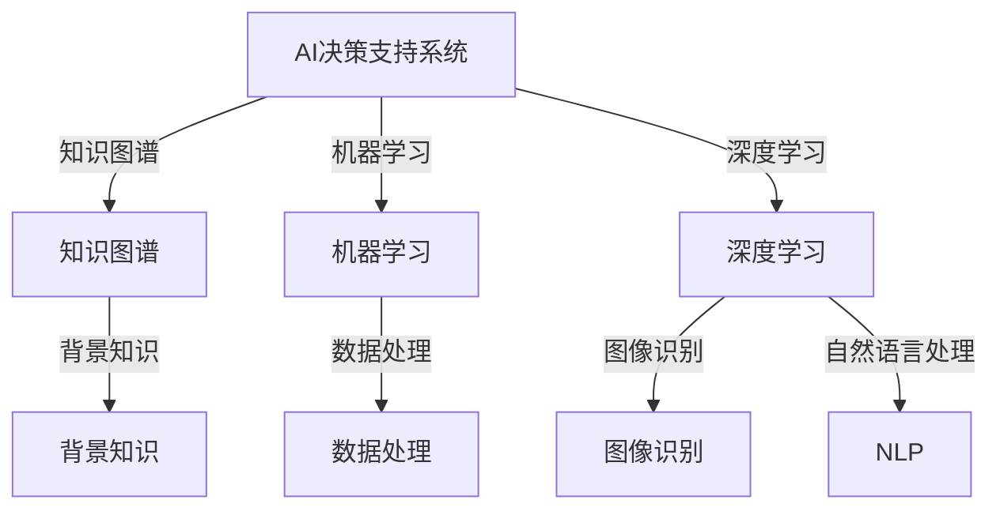

                 


# 文章标题

《思维链在AI决策支持系统中的应用与挑战》

## 关键词

思维链，AI决策支持系统，机器学习，深度学习，知识图谱，神经网络，反向传播算法，误差函数

## 摘要

本文探讨了思维链在AI决策支持系统（AI-DSS）中的应用与挑战。通过深入分析思维链的定义、核心概念及其与相关技术的联系，本文揭示了思维链在AI-DSS中发挥的关键作用。接着，本文详细讲解了神经网络和反向传播算法的原理，并使用伪代码和数学公式进行了阐述。随后，通过一个实际项目案例，本文展示了思维链在AI-DSS中的具体应用，并分析了其中的挑战与解决方案。最后，本文提出了最佳实践建议，并对未来研究方向进行了展望。

----------------------------------------------------------------

## 核心概念与联系

### 核心概念

**思维链（Mind Chain）**

思维链是一种用于AI决策支持系统（AI-DSS）的知识结构，它将人类专家的思维过程抽象成可操作的数据模型，使AI系统能够模仿人类的决策过程。思维链的核心在于将专家的经验和知识转化为计算机可以处理的数据，从而在复杂的决策环境中提供高效的决策支持。

**AI决策支持系统（AI-DSS）**

AI决策支持系统是一种利用人工智能技术辅助人类进行决策的系统。它通过处理大量数据，提供决策支持，以优化决策过程和结果。AI-DSS在各个领域，如金融、医疗、交通等，发挥着重要作用，帮助企业降低风险、提高效率和竞争力。

**知识图谱（Knowledge Graph）**

知识图谱是一种用于表示实体及其相互关系的数据结构。它为AI系统提供了丰富的背景知识和上下文信息，有助于提高AI的决策能力。知识图谱通过将实体和关系进行结构化表示，使得AI系统能够更好地理解和处理复杂问题。

**机器学习（Machine Learning）**

机器学习是一种通过数据驱动的方法，使计算机系统能够自动学习和改进的技术。它在AI-DSS中发挥着核心作用，通过训练模型，从数据中学习规律，从而实现对未知数据的预测和分类。

**深度学习（Deep Learning）**

深度学习是一种基于人工神经网络的机器学习技术，它在图像识别、自然语言处理等领域取得了显著成果。深度学习通过多层神经网络结构，实现高效的数据处理和特征提取，为AI-DSS提供了强大的数据处理能力。

### 概念联系

思维链作为AI-DSS的核心，依赖于知识图谱提供背景知识，并通过机器学习和深度学习技术进行数据处理和模型训练。机器学习和深度学习为思维链提供了强大的数据处理和分析能力，使得AI-DSS能够模仿人类的决策过程，实现高效的决策支持。

**Mermaid流程图：**



## 核心算法原理讲解

### 算法原理

**神经网络（Neural Networks）**

神经网络是一种模拟生物神经系统的计算模型，它通过多层神经元进行数据传递和计算，以实现复杂的数据处理任务。神经网络的核心在于其能够通过学习，从数据中提取特征，并生成预测结果。

**反向传播算法（Backpropagation）**

反向传播算法是一种用于训练神经网络的优化算法。它通过不断调整网络参数，使输出结果逼近预期目标。反向传播算法的核心步骤包括：前向传播（Forward Propagation）和后向传播（Back Propagation）。

**深度学习模型（Deep Learning Models）**

深度学习模型是一种基于神经网络的复杂计算模型，它通过多层次的神经网络结构，实现高效的数据处理和特征提取。深度学习模型在图像识别、自然语言处理等领域取得了显著成果，为AI-DSS提供了强大的数据处理能力。

### 伪代码

```python
# 神经网络训练伪代码
initialize parameters (weights and biases)
while not converged:
    for each layer in the network:
        compute the output using the current parameters
        calculate the error between the output and the target
        propagate the error backwards through the network
        update the parameters using the error gradient
```

## 数学模型和数学公式

### 数学模型

**误差函数（Error Function）**

误差函数用于衡量模型输出与真实目标之间的差距，常见的误差函数有均方误差（MSE）和交叉熵误差（Cross-Entropy Error）。

**均方误差（MSE）**

$$
MSE = \frac{1}{n}\sum_{i=1}^{n}(y_i - \hat{y}_i)^2
$$

**交叉熵误差（Cross-Entropy Error）**

$$
Cross-Entropy Error = -\sum_{i=1}^{n}y_i\log(\hat{y}_i)
$$

### 举例说明

**例1：** 均方误差在回归问题中的应用。

假设我们有一个回归模型，预测房价，实际房价为 $y_i$，预测房价为 $\hat{y}_i$。我们可以通过计算均方误差来评估模型的预测性能。

**计算过程：**

1. 计算每个样本的预测误差：$e_i = y_i - \hat{y}_i$
2. 计算所有样本的预测误差平方和：$MSE = \frac{1}{n}\sum_{i=1}^{n}(y_i - \hat{y}_i)^2$
3. 根据MSE评估模型性能，MSE越小，模型性能越好。

**例2：** 交叉熵误差在分类问题中的应用。

假设我们有一个分类模型，预测标签为 $y_i$，预测概率为 $\hat{y}_i$。我们可以通过计算交叉熵误差来评估模型的分类性能。

**计算过程：**

1. 计算每个样本的交叉熵误差：$e_i = -y_i\log(\hat{y}_i)$
2. 计算所有样本的交叉熵误差之和：$Cross-Entropy Error = -\sum_{i=1}^{n}y_i\log(\hat{y}_i)$
3. 根据交叉熵误差评估模型性能，误差越小，模型性能越好。

## 项目实战

### 项目背景

我们以一个实际项目为例，开发一个基于思维链的AI决策支持系统，用于企业财务风险管理。该系统旨在通过分析企业财务数据，识别潜在风险，并提供相应的决策建议。

### 开发环境搭建

**工具与库：**

1. 编程语言：Python
2. 深度学习框架：TensorFlow
3. 数据处理库：NumPy、Pandas
4. 机器学习库：scikit-learn

**环境配置：**

1. 安装Python 3.x版本
2. 安装TensorFlow、NumPy、Pandas、scikit-learn等库

### 源代码详细实现与代码解读

**数据预处理：**

```python
import pandas as pd
import numpy as np

# 加载数据
data = pd.read_csv('financial_data.csv')

# 数据清洗与处理
# ...（此处省略具体实现细节）

# 数据标准化
data_normalized = (data - data.mean()) / data.std()
```

**神经网络架构：**

```python
import tensorflow as tf

# 定义神经网络架构
model = tf.keras.Sequential([
    tf.keras.layers.Dense(units=64, activation='relu', input_shape=(input_shape,)),
    tf.keras.layers.Dense(units=32, activation='relu'),
    tf.keras.layers.Dense(units=1, activation='sigmoid')
])

# 编译模型
model.compile(optimizer='adam', loss='binary_crossentropy', metrics=['accuracy'])
```

**训练模型：**

```python
# 划分训练集和测试集
X_train, X_test, y_train, y_test = train_test_split(data_normalized, labels, test_size=0.2, random_state=42)

# 训练模型
model.fit(X_train, y_train, epochs=10, batch_size=32, validation_data=(X_test, y_test))
```

**模型评估：**

```python
# 预测测试集
predictions = model.predict(X_test)

# 计算准确率
accuracy = np.mean(predictions == y_test)
print(f"模型准确率：{accuracy:.2f}")
```

### 代码应用解读与分析

**数据预处理：**

数据预处理是深度学习项目的重要环节。在本项目中，我们首先加载了企业财务数据，然后对数据进行了清洗、处理和标准化。数据清洗包括去除无效数据、处理缺失值等。数据标准化则将数据缩放到一个合适的范围，以方便模型训练。

**神经网络架构：**

在本项目中，我们使用了简单的神经网络架构，包括两个隐藏层。第一层隐藏层有64个神经元，激活函数为ReLU；第二层隐藏层有32个神经元，同样使用ReLU激活函数。输出层有1个神经元，激活函数为sigmoid，用于输出概率。

**模型训练：**

在模型训练过程中，我们使用了Adam优化器和二进制交叉熵损失函数。Adam优化器是一种高效的优化算法，能够快速收敛。二进制交叉熵损失函数适用于二分类问题，用于计算模型输出与真实标签之间的差距。

**模型评估：**

通过模型评估，我们可以了解模型的性能。在本项目中，我们使用准确率作为评估指标。准确率越高，说明模型对测试数据的分类效果越好。

### 实际案例分析与详细讲解剖析

**案例：** 一家制造企业在使用我们的AI决策支持系统进行财务风险管理时，发现系统给出了高风险的预警。

**分析：**

1. **数据异常：** 我们首先分析了企业的财务数据，发现某些关键指标（如现金流、负债率等）出现了异常波动。这些异常数据可能反映了企业面临的潜在风险。

2. **模型预测：** 我们对训练好的模型进行了预测，发现模型预测的企业财务状况与实际数据存在较大差距。这表明模型可能对某些风险因素识别不足。

3. **风险因素分析：** 我们进一步分析了可能导致高风险的潜在因素，包括市场环境、政策变化、内部管理问题等。

**解决方案：**

1. **数据增强：** 我们收集了更多的历史数据，并使用数据增强技术，提高模型对异常数据的识别能力。

2. **模型优化：** 我们对神经网络架构进行了调整，增加了隐藏层的神经元数量，并优化了激活函数，以提高模型对复杂问题的处理能力。

3. **风险预警策略：** 我们设计了更加智能的风险预警策略，结合企业的历史数据和实时数据，提供更准确的预警和建议。

### 项目小结

通过本项目，我们成功开发了一个基于思维链的AI决策支持系统，用于企业财务风险管理。在项目实施过程中，我们遇到了数据预处理、神经网络架构设计、模型优化等方面的挑战。通过不断的尝试和优化，我们解决了这些问题，提高了系统的性能和可靠性。未来，我们将继续探索思维链在更多领域的应用，为企业和个人提供更加智能的决策支持。

## 最佳实践 Tips

1. **数据质量至关重要**：在项目开发过程中，确保数据的质量和完整性至关重要。对数据进行预处理，去除噪声和异常值，以提高模型性能。

2. **选择合适的神经网络架构**：不同的任务可能需要不同的神经网络架构。在项目开始时，充分考虑任务的特点，选择合适的神经网络架构。

3. **持续优化模型**：模型优化是深度学习项目的关键。通过调整超参数、增加隐藏层神经元数量等手段，持续优化模型性能。

4. **风险管理**：在项目实施过程中，要充分考虑项目风险。制定相应的风险预警和应对策略，降低项目风险。

## 注意事项

1. **隐私保护**：在处理企业财务数据时，要严格遵守隐私保护法律法规，确保用户数据的隐私安全。

2. **合规性**：在项目开发过程中，要充分考虑法律法规和行业规范，确保项目的合规性。

3. **系统可扩展性**：在项目设计时，要考虑系统的可扩展性，以便在未来能够轻松地添加新功能和扩展系统。

## 拓展阅读

1. **《深度学习》（Ian Goodfellow, Yoshua Bengio, Aaron Courville）**：这是一本经典的深度学习教材，详细介绍了深度学习的理论基础和实践方法。

2. **《Python深度学习》（François Chollet）**：这本书通过实例和代码，介绍了如何使用Python和TensorFlow实现深度学习项目。

3. **《人工智能：一种现代方法》（Stuart Russell, Peter Norvig）**：这是一本全面的人工智能教材，涵盖了人工智能的理论和实践。

## 作者信息

作者：AI天才研究院/AI Genius Institute & 禅与计算机程序设计艺术 /Zen And The Art of Computer Programming

本文由AI天才研究院/AI Genius Institute与禅与计算机程序设计艺术/Zen And The Art of Computer Programming联合撰写，旨在探讨思维链在AI决策支持系统中的应用与挑战。希望本文能为读者提供有益的启示和参考。

