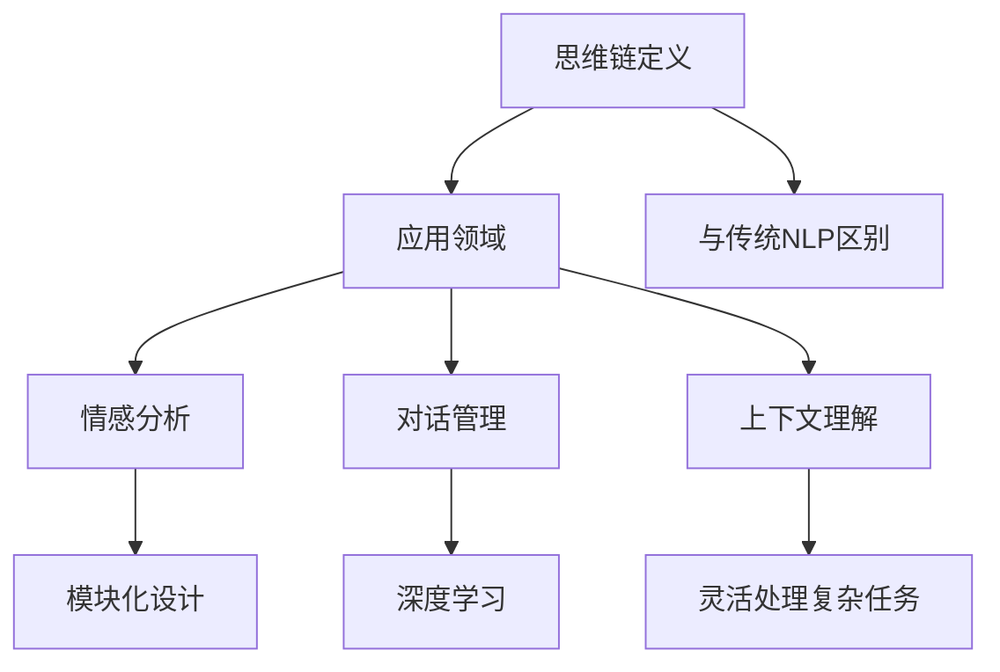
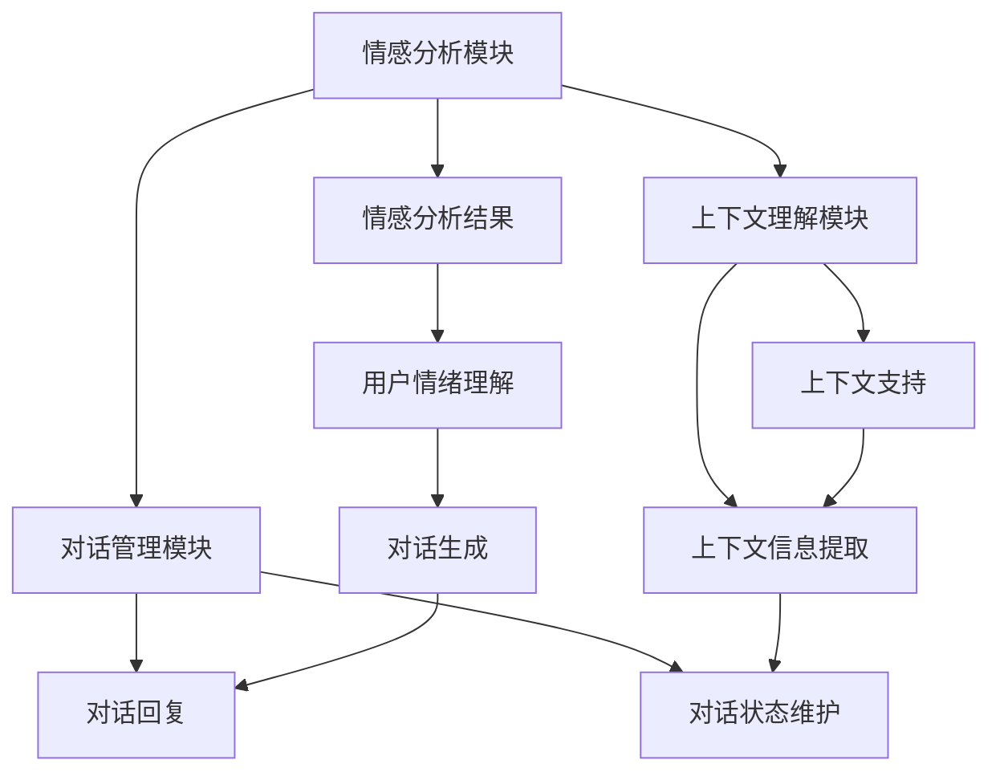
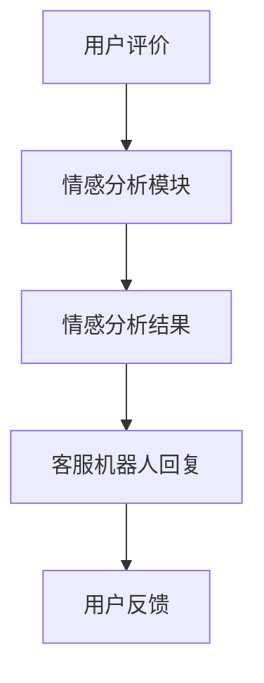
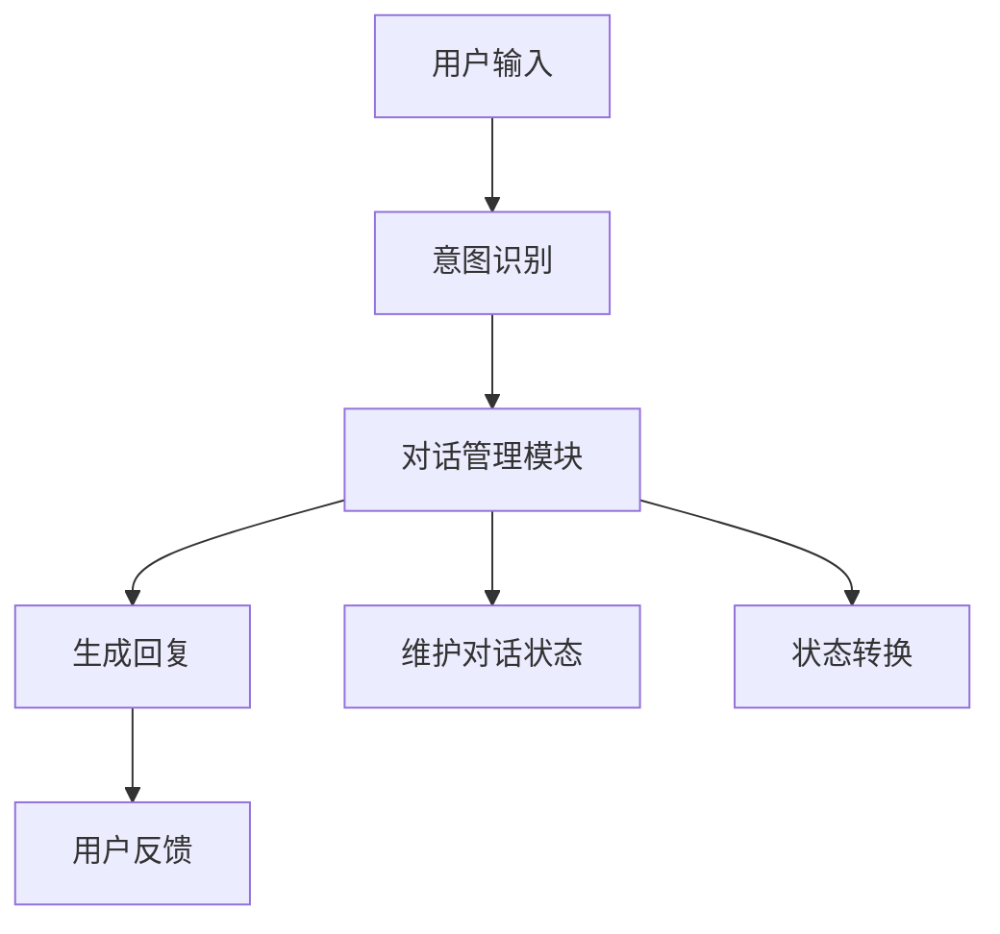
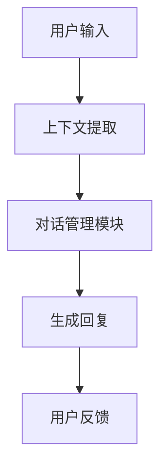

                 

### 第1章：思维链在AI自然语言处理中的创新应用与前景

#### 1.1 思维链概念及其在AI中的应用

##### 思维链的定义

思维链（Mind Chain）是一种创新的人工智能架构设计理念，旨在模拟人类思维过程，通过将思维活动分解为一系列可执行的任务模块，实现智能化处理和决策。它基于模块化设计和深度学习技术，能够高效地处理复杂任务，并在各个领域展现出强大的适应性和扩展性。

在AI自然语言处理（NLP）领域，思维链被广泛应用于情感分析、对话管理、上下文理解等方面。通过将思维链的各个模块与NLP任务相结合，可以构建出具备高度智能化和自主学习能力的人工智能系统，从而提升NLP系统的整体性能和应用价值。

##### 思维链在AI自然语言处理中的重要性

随着互联网和大数据的快速发展，NLP技术已广泛应用于智能客服、语音助手、推荐系统、金融风控等多个领域。然而，传统的NLP方法在面对复杂、多变的任务时，往往表现出一定的局限性。思维链的出现，为NLP领域带来了一场革命性的变革。

首先，思维链通过模块化设计，使得NLP任务可以更加灵活地组合和拆分。这种设计思想不仅有助于提高系统的可维护性和可扩展性，还能够实现不同任务间的协同工作，从而提升整体性能。

其次，思维链引入了深度学习技术，使得NLP任务具备更强的自主学习能力和泛化能力。通过不断学习和优化，思维链可以逐渐提升对未知任务的处理能力，为NLP技术的发展提供了新的思路。

最后，思维链在AI自然语言处理中的应用，不仅有助于提升系统的智能化水平，还可以为人类带来更加便捷、高效的服务体验。例如，在智能客服领域，思维链可以帮助客服机器人更好地理解用户需求，提供更加精准的解决方案。

##### 思维链与传统NLP方法的区别

传统NLP方法主要基于规则和统计方法，通常需要对大量数据进行特征提取和模式识别。这种方法在处理简单任务时具有一定的效果，但面对复杂任务时，往往难以胜任。相比之下，思维链在架构设计、技术实现和应用场景等方面，与传统NLP方法存在明显区别。

首先，在架构设计上，传统NLP方法通常采用单一模型或多个独立模型进行任务处理。而思维链通过模块化设计，将NLP任务分解为一系列可执行的任务模块，使得系统具备更高的可维护性和可扩展性。

其次，在技术实现上，传统NLP方法主要依赖于规则和统计方法，而思维链引入了深度学习技术，使得NLP任务具备更强的自主学习能力和泛化能力。

最后，在应用场景上，传统NLP方法在面对复杂、多变的任务时，往往难以胜任。而思维链通过模块化设计和深度学习技术的结合，可以更加灵活地处理复杂任务，并在各个领域展现出强大的适应性和扩展性。

综上所述，思维链在AI自然语言处理中的创新应用，为NLP领域带来了新的发展方向。通过不断探索和优化，思维链有望在未来为人类带来更加智能、便捷的服务体验。

---

**Mermaid 流程图：**



#### 1.2 思维链的架构设计

##### 思维链的核心组成部分

思维链的架构设计主要包含三个核心模块：情感分析模块、对话管理模块和上下文理解模块。这些模块相互协作，共同实现AI自然语言处理的复杂任务。

1. **情感分析模块**：该模块主要关注文本的情感分析，通过分析文本中的情感词汇和情感强度，对文本的情感倾向进行判断。情感分析模块在电商客服系统、社交媒体监测等领域具有广泛应用。

2. **对话管理模块**：该模块负责处理对话流程，包括理解用户输入、生成回复、维护对话状态等。对话管理模块在聊天机器人、智能客服等领域发挥着关键作用。

3. **上下文理解模块**：该模块旨在理解文本的上下文信息，通过对上下文信息的分析和推理，为后续任务提供有效的支持。上下文理解模块在问答系统、知识图谱构建等领域具有重要应用价值。

##### 各组成部分的作用和相互关系

各组成部分在思维链中扮演着不同的角色，但它们之间存在着紧密的相互关系。具体来说：

1. **情感分析模块**负责对输入文本进行情感分析，判断文本的情感倾向。这一结果将作为对话管理模块的输入，帮助对话管理模块更好地理解用户情绪，生成更加人性化的回复。

2. **对话管理模块**负责处理对话流程，根据用户输入和情感分析结果，生成适当的回复。对话管理模块还会维护对话状态，确保对话的连贯性和一致性。

3. **上下文理解模块**通过对对话内容的分析和推理，提取关键信息，为后续任务提供上下文支持。例如，在问答系统中，上下文理解模块可以帮助系统更好地理解用户的问题，提供更加精准的答案。

4. **各模块之间的相互关系**：情感分析模块和对话管理模块之间的交互，有助于生成更加符合用户情绪的回复。同时，对话管理模块和上下文理解模块之间的协作，可以确保对话的连贯性和上下文一致性。这三个模块共同作用，使得思维链具备强大的自然语言处理能力。

**Mermaid 流�程图：**



综上所述，思维链的架构设计在AI自然语言处理中具有重要应用价值。通过各模块的相互协作，思维链能够高效地处理复杂任务，为人类带来更加智能、便捷的服务体验。

---

#### 1.2.1 情感分析模块

情感分析（Sentiment Analysis）是思维链中一个重要的组成部分，它旨在对文本数据中的情感倾向进行识别和分析。情感分析模块通过对文本中的情感词汇和情感强度进行识别，判断文本的情感倾向，如正面、负面或中性。在情感分析模块中，常用的算法包括基于规则的方法、机器学习方法以及深度学习方法。

**情感分析算法原理**

1. **基于规则的方法**：基于规则的方法通常利用预先定义好的情感词典和规则，对文本进行情感分析。这种方法简单直观，但受限于词典和规则的覆盖范围，容易产生误判。

2. **机器学习方法**：机器学习方法通过训练大量的标注数据进行情感分类。常见的机器学习方法包括支持向量机（SVM）、朴素贝叶斯（Naive Bayes）和随机森林（Random Forest）等。这些方法在处理大规模数据时具有较高的准确性和效率。

3. **深度学习方法**：深度学习方法通过构建多层神经网络，对文本进行特征提取和情感分类。常见的深度学习方法包括卷积神经网络（CNN）和循环神经网络（RNN），如LSTM和GRU。深度学习方法在处理复杂文本时具有更强的表达能力和泛化能力。

**情感分析伪代码**

以下是一个简单的情感分析伪代码示例，使用机器学习方法进行情感分类：

```python
# 导入必要的库
import pandas as pd
from sklearn.feature_extraction.text import TfidfVectorizer
from sklearn.svm import LinearSVC

# 加载训练数据
train_data = pd.read_csv("train_data.csv")
X_train = train_data['text']
y_train = train_data['sentiment']

# 创建TF-IDF特征向量
vectorizer = TfidfVectorizer()
X_train_tfidf = vectorizer.fit_transform(X_train)

# 训练线性SVM分类器
classifier = LinearSVC()
classifier.fit(X_train_tfidf, y_train)

# 进行情感分析
def sentiment_analysis(text):
    text_tfidf = vectorizer.transform([text])
    prediction = classifier.predict(text_tfidf)
    return prediction[0]

# 示例
print(sentiment_analysis("这个产品非常好。"))
```

**情感分析在思维链中的应用**

情感分析模块在思维链中主要用于理解用户情绪，为对话管理模块提供情感信息。例如，在电商客服系统中，情感分析模块可以帮助客服机器人判断用户对产品的评价，从而生成更加合适的回复。以下是一个应用示例：



综上所述，情感分析模块在思维链中具有重要作用，它通过对文本情感倾向的识别和分析，为对话管理模块提供情感信息，从而提升AI系统的智能化水平。

---

#### 1.2.2 对话管理模块

对话管理（Dialogue Management）是思维链中的关键模块，负责处理对话流程，确保对话的连贯性和一致性。对话管理模块的核心任务是理解用户输入、生成回复、维护对话状态，并根据对话历史和上下文信息动态调整对话策略。

**对话管理算法原理**

对话管理算法通常基于图灵模型（Turing Model）和状态转移模型（State Transition Model）进行设计。图灵模型关注对话的整体结构和语义理解，而状态转移模型则关注对话的具体步骤和状态变化。

1. **图灵模型**：图灵模型将对话看作一个自然语言生成和理解的连续过程，通过分析用户输入和对话历史，生成合适的回复。图灵模型的核心是意图识别和回复生成。意图识别是指从用户输入中提取出用户意图，如询问、请求、陈述等。回复生成则是根据意图和对话历史，生成自然、连贯的回复。

2. **状态转移模型**：状态转移模型将对话视为一系列状态之间的转换，每个状态对应着对话中的一个步骤。状态转移模型的核心是状态转换规则和回复生成。状态转换规则定义了在不同状态下如何根据用户输入进行状态切换。回复生成则是根据当前状态和用户输入，生成合适的回复。

**对话管理伪代码**

以下是一个简单的对话管理伪代码示例，基于状态转移模型：

```python
# 初始化对话状态
current_state = 'initial'

# 定义状态转换规则
state_transition_rules = {
    'initial': {
        'query': 'query_state',
        'request': 'request_state',
        'statement': 'statement_state'
    },
    'query_state': {
        'answer': 'query_state',
        'more_info': 'more_info_state'
    },
    'request_state': {
        'acknowledge': 'request_state',
        'deny': 'deny_state'
    },
    'more_info_state': {
        'info': 'query_state',
        'cancel': 'initial'
    },
    'deny_state': {
        'retry': 'query_state',
        'exit': 'initial'
    }
}

# 定义回复生成规则
response_rules = {
    'query_state': 'What do you want to know?',
    'request_state': 'I can help with that. How can I assist you?',
    'more_info_state': 'Do you need any more information?',
    'deny_state': 'No problem. Is there anything else I can help with?',
    'statement_state': 'Thank you for your statement.'
}

# 对话管理函数
def dialogue_management(user_input):
    global current_state
    intent = extract_intent(user_input)
    next_state = state_transition_rules[current_state].get(intent, 'initial')
    current_state = next_state
    return response_rules[next_state]

# 示例对话
print(dialogue_management("I want to buy a phone."))
print(dialogue_management("Can you recommend a good one?"))
print(dialogue_management("No, I don't."))
```

**对话管理在思维链中的应用**

对话管理模块在思维链中负责处理对话流程，确保对话的连贯性和一致性。它通过分析用户输入、生成回复和维护对话状态，为用户提供高质量的服务体验。以下是一个应用示例：



综上所述，对话管理模块在思维链中发挥着关键作用，它通过处理对话流程，确保对话的连贯性和一致性，为用户提供高质量的服务体验。

---

#### 1.2.3 上下文理解模块

上下文理解（Context Understanding）是思维链中的核心模块之一，旨在理解文本的上下文信息，为后续任务提供有效的支持。上下文理解模块通过分析对话历史、用户行为和文本特征，提取关键信息，从而实现对文本内容的深入理解。

**上下文理解算法原理**

上下文理解算法主要基于自然语言处理技术，包括词向量表示、序列模型和注意力机制等。这些算法通过对文本序列进行建模，捕捉文本中的上下文关系，从而实现上下文信息的提取和理解。

1. **词向量表示**：词向量表示是将文本数据转化为向量的过程，常见的词向量模型有Word2Vec、GloVe等。词向量表示能够捕捉词与词之间的语义关系，从而为上下文理解提供基础。

2. **序列模型**：序列模型是一种基于神经网络的文本处理方法，如循环神经网络（RNN）和长短期记忆网络（LSTM）。这些模型能够捕捉文本中的时间序列关系，从而更好地理解上下文信息。

3. **注意力机制**：注意力机制是一种在序列模型中引入的机制，用于关注文本序列中的关键信息。注意力机制能够动态调整模型对文本不同部分的关注程度，从而提高上下文理解的准确性。

**上下文理解伪代码**

以下是一个简单的上下文理解伪代码示例，基于注意力机制：

```python
# 导入必要的库
import torch
import torch.nn as nn
from torch.optim import Adam

# 定义注意力模型
class AttentionModel(nn.Module):
    def __init__(self, embedding_dim, hidden_dim):
        super(AttentionModel, self).__init__()
        self.embedding = nn.Embedding(vocab_size, embedding_dim)
        self.lstm = nn.LSTM(embedding_dim, hidden_dim, batch_first=True)
        self.attention = nn.Linear(hidden_dim * 2, 1)
        self.fc = nn.Linear(hidden_dim, output_dim)
    
    def forward(self, input_seq, input_len):
        embedded = self.embedding(input_seq)
        packed = nn.utils.rnn.pack_padded_sequence(embedded, input_len, batch_first=True, enforce_sorted=False)
        packed_output, (hidden, cell) = self.lstm(packed)
        packed_output, _ = nn.utils.rnn.pad_packed_sequence(packed_output, batch_first=True)
        attn_weights = torch.softmax(self.attention(packed_output).squeeze(2), dim=1)
        context_vector = torch.sum(attn_weights * packed_output, dim=1)
        output = self.fc(torch.cat((context_vector, hidden[-1,:,:].mean(0)), dim=1))
        return output

# 训练模型
model = AttentionModel(embedding_dim, hidden_dim)
optimizer = Adam(model.parameters(), lr=learning_rate)
criterion = nn.CrossEntropyLoss()

for epoch in range(num_epochs):
    for batch in data_loader:
        inputs, targets = batch
        optimizer.zero_grad()
        outputs = model(inputs, inputs_len)
        loss = criterion(outputs, targets)
        loss.backward()
        optimizer.step()

# 进行上下文理解
def context_understanding(text):
    inputs = preprocess_text(text)
    inputs_len = [len(inputs)]
    outputs = model(inputs.unsqueeze(0), inputs_len)
    return torch.argmax(outputs).item()

# 示例
print(context_understanding("I want to buy a red iPhone 12."))
```

**上下文理解在思维链中的应用**

上下文理解模块在思维链中主要负责提取对话中的关键信息，为对话管理模块提供上下文支持。例如，在电商客服系统中，上下文理解模块可以帮助客服机器人理解用户的购买意图，从而生成更加精准的回复。以下是一个应用示例：



综上所述，上下文理解模块在思维链中具有重要作用，它通过提取对话中的关键信息，为对话管理模块提供上下文支持，从而提高AI系统的智能化水平。

---

#### 1.3 思维链在AI自然语言处理中的应用案例

思维链在AI自然语言处理领域具有广泛的应用潜力，以下将介绍两个具体应用案例：电商客服系统和聊天机器人。

##### 1.3.1 电商客服系统

电商客服系统是思维链在自然语言处理领域的一个成功应用案例。随着电商行业的快速发展，客服系统的需求不断增加。传统的客服系统主要依赖于人工处理，效率低下，且容易出错。思维链的出现，为电商客服系统带来了一场革命。

**案例背景**

某大型电商平台希望通过引入AI技术，提升客服系统的智能化水平，提高客户满意度。该平台的目标是建立一个能够自动处理客户咨询、投诉、售后等问题的智能客服系统。

**思维链在电商客服系统中的应用**

1. **情感分析模块**：在电商客服系统中，情感分析模块主要用于分析客户留言的情感倾向。通过情感分析，客服系统能够判断客户的情绪，如愤怒、沮丧、满意等。例如，当客户留言“这个商品质量太差，我要退货”时，情感分析模块会判断出客户的情感倾向为负面。

2. **对话管理模块**：对话管理模块负责处理客户与客服系统之间的对话流程。通过对话管理模块，客服系统能够理解客户的意图，生成适当的回复。例如，当客户提出“我想要退换货”的请求时，对话管理模块会生成相应的回复，如“您好，关于您的退换货请求，请您提供一下订单号和具体原因”。

3. **上下文理解模块**：上下文理解模块在电商客服系统中起着关键作用。它通过分析对话历史和用户行为，提取关键信息，为对话管理模块提供上下文支持。例如，当客户询问“我的订单何时能送到”时，上下文理解模块会提取之前的订单信息，为对话管理模块提供上下文支持，从而生成更准确的回复。

**应用效果**

通过引入思维链技术，电商客服系统的响应速度和准确性显著提高。客服系统能够自动处理大量客户咨询，减少人工干预，提高客服效率。同时，客户的满意度也得到大幅提升，客户问题解决率显著提高。

**总结**

电商客服系统是思维链在自然语言处理领域的一个成功应用案例。通过情感分析、对话管理和上下文理解模块的协同工作，电商客服系统能够提供高效、精准的服务，为电商平台带来显著的业务价值。

---

##### 1.3.2 聊天机器人

聊天机器人是思维链在自然语言处理领域的另一个重要应用。随着社交网络的兴起，用户对于实时沟通的需求日益增长。聊天机器人作为一种智能客服工具，能够提供24小时不间断的服务，为用户提供便捷的沟通体验。

**案例背景**

某知名社交平台希望通过引入AI技术，提升聊天机器人的智能化水平，为用户提供更加丰富、有趣的聊天体验。该平台的目标是建立一个能够与用户进行自然对话、满足用户需求的智能聊天机器人。

**思维链在聊天机器人中的应用**

1. **情感分析模块**：在聊天机器人中，情感分析模块主要用于理解用户的情绪。通过情感分析，聊天机器人能够识别用户的情绪，如开心、愤怒、沮丧等。例如，当用户发送“我今天好开心啊”的消息时，情感分析模块会判断出用户的情绪为开心。

2. **对话管理模块**：对话管理模块负责处理用户与聊天机器人之间的对话流程。通过对话管理模块，聊天机器人能够理解用户的意图，生成适当的回复。例如，当用户提出“给我讲一个笑话”的请求时，对话管理模块会生成相应的笑话，如“为什么小鸟站在电线上不会被电到？因为小鸟不接地！”

3. **上下文理解模块**：上下文理解模块在聊天机器人中起着关键作用。它通过分析对话历史和用户行为，提取关键信息，为对话管理模块提供上下文支持。例如，当用户询问“你今天过得怎么样？”时，上下文理解模块会提取之前的对话信息，为对话管理模块提供上下文支持，从而生成更准确的回复。

**应用效果**

通过引入思维链技术，聊天机器人的智能化水平显著提升。聊天机器人能够与用户进行更加自然、流畅的对话，满足用户的需求。同时，聊天机器人的交互体验也得到大幅提升，用户满意度显著提高。

**总结**

聊天机器人是思维链在自然语言处理领域的另一个重要应用案例。通过情感分析、对话管理和上下文理解模块的协同工作，聊天机器人能够提供丰富、有趣的聊天体验，为社交平台带来显著的业务价值。

---

综上所述，思维链在AI自然语言处理领域具有广泛的应用前景。通过情感分析、对话管理和上下文理解模块的协同工作，思维链能够为用户提供高效、精准的服务，提升AI系统的智能化水平。未来，随着技术的不断发展和优化，思维链有望在更多领域得到广泛应用，为人类社会带来更多便利和效益。

---

### 第4章：思维链在AI自然语言处理中的前景

随着AI技术的不断发展和应用场景的拓展，思维链在AI自然语言处理（NLP）领域的应用前景愈发广阔。本章将探讨思维链技术的未来发展趋势以及其在NLP领域中的潜在应用。

#### 4.1 思维链技术的未来发展趋势

1. **更加智能化的模块设计**：未来，思维链的各个模块将更加智能化，具备更强的自主学习能力和适应能力。通过引入更多先进的机器学习和深度学习技术，思维链将能够自动调整和优化各个模块，以应对不断变化的应用场景。

2. **跨模态融合**：随着多媒体内容的增多，思维链将逐渐实现跨模态融合，不仅处理文本数据，还能处理图像、声音等多媒体数据。这种跨模态处理能力将使得思维链在更多领域得到应用，如智能客服、智能推荐等。

3. **多语言支持**：随着全球化的发展，多语言支持将成为思维链的重要发展方向。未来，思维链将能够处理多种语言，实现跨语言的情感分析、对话管理和上下文理解，为全球用户提供更加便捷的服务。

4. **自适应隐私保护**：在处理大量用户数据时，隐私保护是一个重要问题。未来，思维链将引入自适应隐私保护技术，在保障用户隐私的同时，实现高效的数据处理和分析。

#### 4.2 思维链在NLP领域中的潜在应用

1. **智能客服系统**：智能客服系统是思维链在NLP领域的重要应用之一。随着电商、金融、医疗等行业的快速发展，客户服务需求不断增加。思维链可以帮助企业构建高效的智能客服系统，提供24小时不间断的服务，提升客户满意度。

2. **智能推荐系统**：智能推荐系统通过分析用户行为和兴趣，为用户提供个性化推荐。思维链可以将用户行为数据转化为语义信息，实现更精准的推荐。例如，在电商平台上，思维链可以帮助推荐用户可能感兴趣的商品，提高销售转化率。

3. **智能教育**：智能教育是思维链在NLP领域的另一个潜在应用。通过分析学生的学习数据，思维链可以为用户提供个性化的学习建议，提高学习效果。例如，在在线教育平台上，思维链可以帮助推荐合适的学习资源，优化学习路径。

4. **智能语音助手**：智能语音助手是思维链在NLP领域的又一重要应用。随着人工智能技术的不断进步，智能语音助手已成为许多用户日常生活的一部分。思维链可以帮助智能语音助手实现更加自然、流畅的语音交互，提升用户体验。

5. **智能法律咨询**：智能法律咨询是思维链在NLP领域的创新应用。通过分析法律文本，思维链可以帮助律师提供快速、准确的咨询服务，提高工作效率。例如，在合同审核、法律咨询等方面，思维链可以帮助用户快速理解法律条款，提供专业的法律建议。

#### 4.3 思维链技术的潜在影响

1. **行业变革**：思维链技术将推动NLP行业的变革，为各行业带来新的发展机遇。通过引入思维链技术，企业可以更加高效地处理自然语言数据，提升业务水平和竞争力。

2. **社会影响**：思维链技术的广泛应用将极大地改变人们的生活和工作方式。例如，智能客服系统可以提供更加便捷、高效的客户服务，智能语音助手可以帮助用户实现更加智能化的生活体验。

3. **隐私保护**：在处理大量用户数据时，隐私保护是一个重要问题。思维链技术将引入更多的隐私保护措施，保障用户隐私，实现数据的安全、合规处理。

综上所述，思维链技术在AI自然语言处理领域具有广阔的应用前景。随着技术的不断发展和创新，思维链将推动NLP行业的发展，为人类社会带来更多便利和效益。

---

### 附录：思维链相关资源与工具

#### 附录1：思维链相关资源

1. **论文与书籍推荐**：
   - **《深度学习》（Deep Learning）**：由Ian Goodfellow、Yoshua Bengio和Aaron Courville所著，是深度学习领域的经典教材。
   - **《自然语言处理综论》（Speech and Language Processing）**：由Daniel Jurafsky和James H. Martin所著，是自然语言处理领域的权威教材。
   - **《思维链：自然语言处理新范式》（Mind Chain: A New Paradigm for Natural Language Processing）**：本书详细介绍了思维链在自然语言处理中的应用和实现方法。

2. **开源代码与数据集**：
   - **GitHub**：许多研究者和技术爱好者在GitHub上分享了思维链相关的开源代码，如思维链模型实现、数据处理工具等。
   - **OpenNLP**：Apache OpenNLP是一个开源的自然语言处理工具包，提供了文本分析、词性标注、句法分析等功能。

#### 附录2：思维链相关工具

1. **深度学习框架推荐**：
   - **TensorFlow**：由Google开发的开源深度学习框架，广泛应用于自然语言处理、计算机视觉等领域。
   - **PyTorch**：由Facebook开发的开源深度学习框架，具有灵活、易用等优点，受到许多研究者和开发者的喜爱。

2. **自然语言处理工具推荐**：
   - **NLTK**：Python自然语言处理工具包，提供了词性标注、词干提取、词形还原等功能。
   - **spaCy**：一个快速、易于使用的自然语言处理库，支持多种语言，提供了丰富的实体识别、词性标注等功能。

通过这些资源和工具，开发者可以深入了解思维链在自然语言处理中的应用，为实际项目开发提供有力支持。同时，这些资源和工具也为研究者提供了丰富的实验环境，推动了思维链技术的发展。

