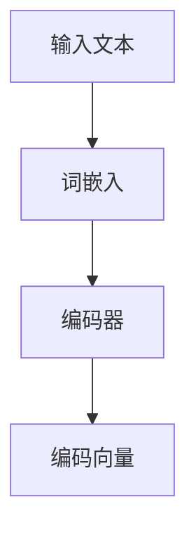
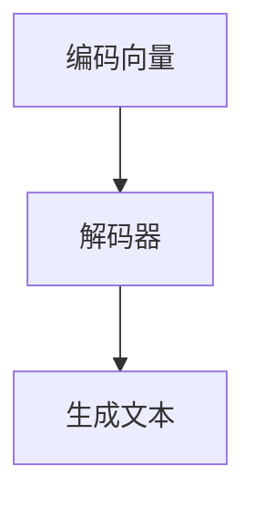
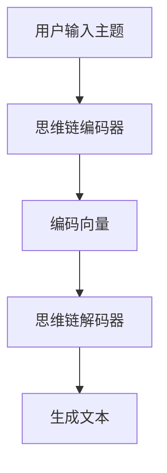
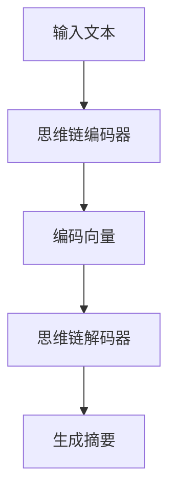
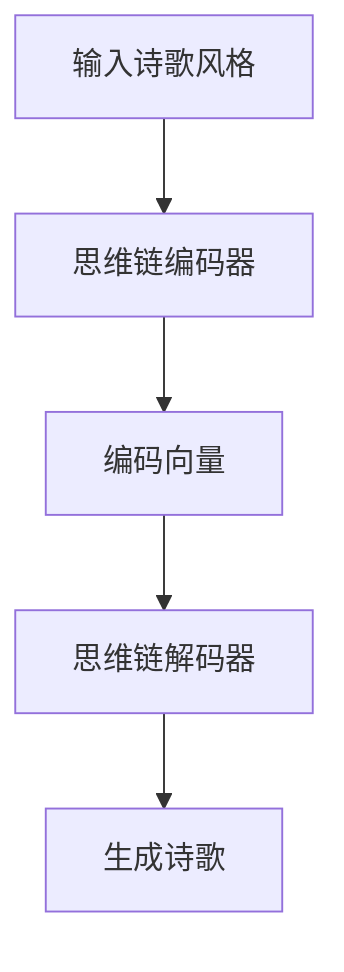
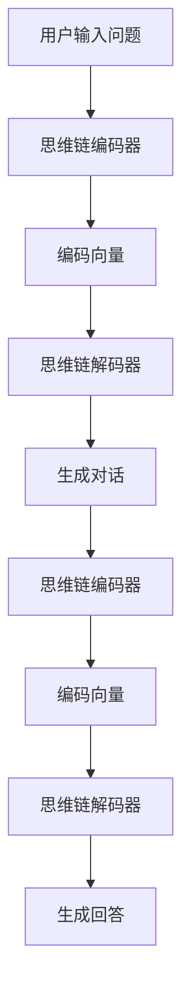
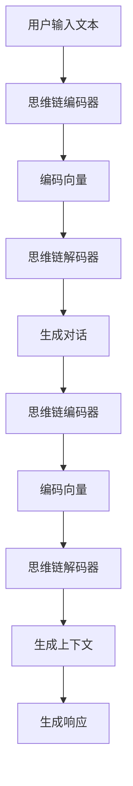
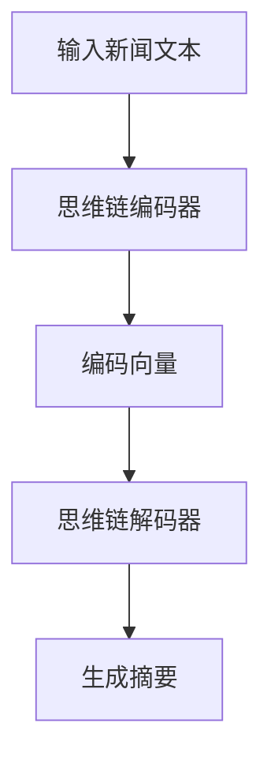
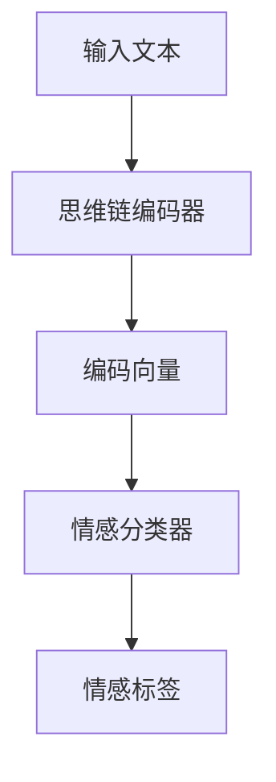
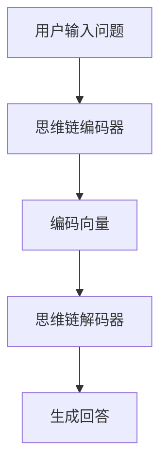

                 

### 文章标题：思维链在AI自然语言生成中的创新应用

### 关键词：AI，自然语言生成，思维链，创新应用，算法原理，流程图，伪代码，数学模型，项目实战

### 摘要：
本文探讨了思维链在AI自然语言生成中的创新应用。首先，我们介绍了自然语言生成的背景和挑战，以及思维链的基本概念和发展历程。随后，我们详细分析了思维链在AI自然语言生成中的应用，包括文本生成、问答系统和对话系统等。通过具体的算法原理讲解、流程图和伪代码展示，我们揭示了思维链如何提升自然语言生成的效果。最后，本文通过实际项目实战，展示了思维链在自然语言生成中的具体实现和应用，并对未来发展方向进行了展望。

### 目录：

#### 第一部分：引言

##### 1.1 书籍背景与目标

##### 1.2 自然语言生成的现状与挑战

##### 1.3 思维链的概念与发展

##### 1.4 本书结构安排

#### 第二部分：AI自然语言生成基础

##### 2.1 自然语言处理概述

##### 2.2 AI自然语言生成技术

##### 2.3 思维链在NLP中的应用

#### 第三部分：思维链在AI自然语言生成中的应用

##### 3.1 思维链的构建与优化

##### 3.2 思维链在文本生成中的应用

##### 3.3 思维链在问答系统中的应用

##### 3.4 思维链在对话系统中的应用

#### 第四部分：创新应用与案例分析

##### 4.1 创新应用概述

##### 4.2 案例分析1：思维链在新闻摘要生成中的应用

##### 4.3 案例分析2：思维链在情感分析中的应用

##### 4.4 案例分析3：思维链在智能客服中的应用

#### 第五部分：未来展望与挑战

##### 5.1 未来发展趋势

##### 5.2 技术挑战与解决方案

##### 5.3 发展前景与机遇

#### 附录：资源与工具

##### 6.1 开发环境搭建

##### 6.2 常用工具与库

##### 6.3 参考文献与拓展阅读

---

### 第一部分：引言

#### 1.1 书籍背景与目标

随着人工智能技术的快速发展，自然语言生成（Natural Language Generation, NLG）已成为一个热门研究领域。然而，传统的自然语言生成方法存在诸多局限性，如生成文本的多样性和连贯性不足、上下文理解能力较弱等。为了解决这些问题，研究者们不断探索新的方法和技术。

本 书《思维链在AI自然语言生成中的创新应用》旨在介绍思维链（Mind-chain）技术在自然语言生成领域的创新应用。思维链是一种基于深度学习的模型，通过模拟人类思维过程，实现了对文本的生成、理解和优化。本书将详细探讨思维链的概念、原理及其在自然语言生成中的应用，旨在为读者提供一种全新的解决思路。

本书的目标受众包括对人工智能和自然语言生成感兴趣的研究者、工程师以及学生。通过阅读本书，读者将：

1. 了解自然语言生成的背景和挑战。
2. 掌握思维链的基本概念和发展历程。
3. 理解思维链在自然语言生成中的应用原理和方法。
4. 学习思维链在文本生成、问答系统和对话系统等领域的创新应用。
5. 获得实际项目实战的经验和技巧。

#### 1.2 自然语言生成的现状与挑战

自然语言生成（NLG）是人工智能（AI）领域的一个重要分支，旨在利用计算机程序生成自然语言文本。近年来，随着深度学习技术的蓬勃发展，NLG取得了显著的进展。目前，NLG技术已广泛应用于自动写作、新闻生成、智能客服、语音合成等领域。

然而，当前的自然语言生成技术仍然面临许多挑战。首先，生成文本的多样性和连贯性不足。许多生成模型倾向于生成过于平淡或重复的文本，缺乏创造性和个性。其次，上下文理解能力较弱。自然语言生成模型通常难以准确理解文本的上下文信息，导致生成结果与实际需求不符。此外，生成文本的可解释性也是一个重要挑战。用户通常希望了解生成模型的决策过程和生成依据，以便对生成结果进行评估和改进。

为了应对这些挑战，研究者们不断探索新的方法和技术。其中，思维链技术（Mind-chain）提供了一种创新思路。思维链是一种基于深度学习的模型，通过模拟人类思维过程，实现了对文本的生成、理解和优化。与传统方法相比，思维链具有以下优势：

1. **更高的生成多样性**：思维链通过模拟人类思维过程，能够生成更具创造性和个性化的文本。
2. **更强的上下文理解能力**：思维链能够更好地理解文本的上下文信息，生成更符合用户需求的文本。
3. **更高的生成连贯性**：思维链通过优化生成过程，能够生成更连贯、流畅的文本。
4. **更好的可解释性**：思维链的生成过程更加透明，用户可以更容易地了解生成模型的决策过程和生成依据。

本书将详细探讨思维链在自然语言生成中的应用，介绍其基本原理、算法实现和应用案例，旨在为读者提供一种全新的解决思路。

#### 1.3 思维链的概念与发展

思维链（Mind-chain）是一种基于深度学习的模型，旨在模拟人类思维过程，实现自然语言生成、理解和优化。思维链的核心思想是将人类的思维过程抽象为一种神经网络结构，通过学习大量的文本数据，模型能够理解文本的语义、逻辑和情感，从而生成具有创造性和个性化的文本。

思维链的发展历程可以追溯到深度学习技术的兴起。随着深度神经网络（DNN）和循环神经网络（RNN）的广泛应用，研究者们开始探索如何将这些模型应用于自然语言生成。2014年，谷歌推出了序列到序列（Seq2Seq）模型，为自然语言生成提供了新的思路。随后，研究者们进一步改进了模型结构，提出了长短时记忆网络（LSTM）、门控循环单元（GRU）等变体，使自然语言生成模型在生成多样性和连贯性方面取得了显著提升。

在思维链的发展过程中，研究者们还引入了注意力机制、生成对抗网络（GAN）等技术，进一步提升了模型的性能。例如，注意力机制能够使模型更好地关注文本中的重要信息，生成更准确的文本。生成对抗网络则通过对抗训练，使生成模型能够生成更加真实、高质量的文本。

近年来，随着人工智能技术的不断进步，思维链在自然语言生成中的应用也不断拓展。例如，思维链被应用于文本摘要、情感分析、问答系统和对话系统等领域，取得了显著的效果。此外，思维链还在智能客服、自动写作、新闻生成等实际应用场景中发挥了重要作用。

总体来说，思维链技术为自然语言生成领域带来了一种全新的解决思路，通过模拟人类思维过程，实现了对文本的生成、理解和优化。未来，随着人工智能技术的进一步发展，思维链有望在更多领域取得突破性进展，为人类带来更加智能、便捷的服务。

#### 1.4 本书结构安排

本书分为五个主要部分，分别从不同角度探讨思维链在自然语言生成中的创新应用。

**第一部分：引言**  
本部分介绍了书籍的背景、目标和读者受益。同时，分析了自然语言生成的现状与挑战，以及思维链的概念和发展历程。

**第二部分：AI自然语言生成基础**  
本部分概述了自然语言处理（NLP）的基本概念和应用领域，介绍了AI自然语言生成技术，包括语言模型、生成式模型和对话系统等。此外，还探讨了思维链在NLP中的应用。

**第三部分：思维链在AI自然语言生成中的应用**  
本部分详细介绍了思维链的构建与优化方法，以及在文本生成、问答系统和对话系统中的应用。通过具体的算法原理讲解、流程图和伪代码展示，揭示了思维链如何提升自然语言生成的效果。

**第四部分：创新应用与案例分析**  
本部分通过实际项目实战，展示了思维链在新闻摘要生成、情感分析和智能客服等领域的应用。每个案例都包含了详细的项目小结，对思维链的创新应用进行了总结和展望。

**第五部分：未来展望与挑战**  
本部分探讨了思维链在自然语言生成领域的未来发展趋势、技术挑战和解决方案。同时，分析了思维链在发展前景和机遇方面的优势。

通过以上五个部分，本书将带领读者全面了解思维链在自然语言生成中的创新应用，为读者提供一种全新的解决思路和实践经验。

---

### 第二部分：AI自然语言生成基础

在探讨思维链在AI自然语言生成中的创新应用之前，我们需要先了解自然语言处理（NLP）的基本概念和应用领域，以及AI自然语言生成技术的基本原理和方法。

#### 2.1 自然语言处理概述

自然语言处理（NLP，Natural Language Processing）是人工智能（AI，Artificial Intelligence）的一个重要分支，旨在让计算机能够理解和处理自然语言。自然语言包括人类的口头语言和书面语言，具有丰富性、多样性和复杂性。NLP的研究目标是将自然语言转换为计算机可理解和处理的形式，从而实现人与机器之间的有效交流。

NLP的应用领域非常广泛，涵盖了文本挖掘、机器翻译、情感分析、问答系统、信息检索、文本摘要、语音识别等。以下是一些典型的NLP应用：

1. **文本挖掘**：通过对大量文本数据进行分析，提取有用的信息，用于商业智能、市场分析、舆情监测等领域。
2. **机器翻译**：将一种自然语言翻译成另一种自然语言，如谷歌翻译、百度翻译等。
3. **情感分析**：对文本的情感倾向进行分析，判断文本是正面、负面还是中性，应用于社交媒体监测、市场调研等领域。
4. **问答系统**：通过自然语言交互，为用户提供答案，如苹果的Siri、微软的Cortana等。
5. **信息检索**：通过关键词或短语，从大量文本中检索出相关的信息，如搜索引擎。
6. **文本摘要**：将长文本简化为摘要，提取关键信息，提高信息获取的效率。
7. **语音识别**：将语音信号转换为文本，实现语音到文字的转换，应用于语音助手、智能客服等领域。

NLP的发展历程可以分为以下几个阶段：

1. **规则驱动方法**：早期NLP主要依赖于手工编写的规则，如词性标注、句法分析等。这种方法简单直观，但难以处理复杂的语言现象。
2. **基于统计的方法**：随着计算能力的提升和大量语言数据的积累，NLP开始采用统计模型，如隐马尔可夫模型（HMM）、条件概率模型等。这种方法能够处理大量的语言现象，但受限于数据的依赖性。
3. **基于知识的表示方法**：通过构建知识图谱，将语言知识表示为实体、关系和属性，为NLP提供更丰富的语义信息。这种方法在知识推理和语义理解方面具有优势。
4. **深度学习方法**：近年来，深度学习技术在NLP领域取得了显著的突破，如循环神经网络（RNN）、长短时记忆网络（LSTM）、卷积神经网络（CNN）、生成对抗网络（GAN）等。深度学习方法能够自动提取特征，实现端到端的模型训练，为NLP带来了革命性的变化。

#### 2.2 AI自然语言生成技术

AI自然语言生成（AI NLG，Artificial Intelligence Natural Language Generation）是指利用人工智能技术生成自然语言文本的过程。AI NLG技术主要包括以下几种：

1. **语言模型**：语言模型（Language Model）是一种概率模型，用于预测下一个单词或字符。常见的语言模型有基于n-gram的模型和基于神经网络的模型。语言模型在自动写作、语音合成、机器翻译等领域有广泛应用。

2. **生成式模型**：生成式模型（Generative Model）旨在生成具有某种分布的自然语言文本。生成式模型可以分为基于规则的模型和基于数据的模型。基于规则的模型如模板生成器，而基于数据的模型如变分自编码器（VAE）、生成对抗网络（GAN）等。

3. **对话系统**：对话系统（Dialogue System）是一种与人类用户进行自然语言交互的计算机系统。对话系统可以分为基于模板的对话系统和基于模型的对话系统。基于模板的对话系统通过预定义的模板生成响应，而基于模型的对话系统通过学习大量的对话数据，生成更自然的响应。

下面我们将分别介绍这几种技术。

**语言模型**

语言模型是自然语言生成的基础，其核心思想是预测下一个单词或字符。一个简单的语言模型可以表示为：

$$
P(w_t | w_{t-1}, w_{t-2}, \ldots, w_1) = \frac{N(w_t, w_{t-1}, \ldots, w_1)}{N(w_{t-1}, \ldots, w_1)}
$$

其中，$w_t$ 表示下一个单词或字符，$N(w_t, w_{t-1}, \ldots, w_1)$ 表示前文出现次数，$N(w_{t-1}, \ldots, w_1)$ 表示前文总次数。

**生成式模型**

生成式模型通过生成文本的概率分布，生成具有某种分布的自然语言文本。变分自编码器（VAE）和生成对抗网络（GAN）是两种常见的生成式模型。

变分自编码器（VAE）是一种基于概率生成模型的神经网络，通过编码器（Encoder）将输入数据映射到潜在空间，通过解码器（Decoder）将潜在空间的数据映射回原始空间。VAE的生成过程如下：

1. 编码器将输入数据 $x$ 编码为潜在空间中的向量 $z$。
2. 解码器将潜在空间中的向量 $z$ 解码为输出数据 $x'$。
3. 通过最大化数据分布的KL散度损失和最小化重构损失，优化编码器和解码器的参数。

生成对抗网络（GAN）由生成器（Generator）和判别器（Discriminator）组成。生成器的任务是生成类似于真实数据的数据，而判别器的任务是区分生成器生成的数据与真实数据。GAN的生成过程如下：

1. 生成器生成一组假数据 $x'$。
2. 判别器同时接收一组真实数据 $x$ 和一组假数据 $x'$，并分别对其进行分类。
3. 通过最小化判别器的损失函数和最大化生成器的损失函数，优化生成器和判别器的参数。

**对话系统**

对话系统是一种与人类用户进行自然语言交互的计算机系统。对话系统可以分为基于模板的对话系统和基于模型的对话系统。

基于模板的对话系统通过预定义的模板生成响应。模板通常包括关键词和对应的回复，如：

```
如果用户说：“今天天气怎么样？”
则系统回复：“今天天气很好，晴朗无云。”
```

基于模型的对话系统通过学习大量的对话数据，生成更自然的响应。常见的模型包括序列到序列（Seq2Seq）模型、长短时记忆网络（LSTM）和注意力机制等。以下是一个简单的基于Seq2Seq模型的对话系统：

1. 将用户的输入句子编码为序列 $x_1, x_2, \ldots, x_n$。
2. 将编码后的序列输入到编码器中，得到隐藏状态 $h_1, h_2, \ldots, h_n$。
3. 将隐藏状态输入到解码器中，生成解码序列 $y_1, y_2, \ldots, y_m$。
4. 将解码序列转换为自然语言响应，如：“你好，欢迎来到我们的客服中心。”

#### 2.3 思维链在NLP中的应用

思维链（Mind-chain）是一种基于深度学习的模型，旨在模拟人类思维过程，实现自然语言生成、理解和优化。思维链在NLP中具有广泛的应用，包括文本生成、问答系统和对话系统等。

**思维链在文本生成中的应用**

思维链在文本生成中的应用主要通过生成式模型实现。思维链的生成式模型可以分为两个阶段：

1. 编码阶段：将输入文本编码为固定长度的向量。
2. 生成阶段：从编码后的向量中生成自然语言文本。

以下是一个简化的思维链生成式模型：

```
输入：文本 $x = (x_1, x_2, \ldots, x_n)$
输出：自然语言文本 $y = (y_1, y_2, \ldots, y_m)$

编码阶段：
- 使用编码器将文本 $x$ 编码为向量 $z = (z_1, z_2, \ldots, z_n)$。

生成阶段：
- 使用解码器从向量 $z$ 中生成自然语言文本 $y$。
```

**思维链在问答系统中的应用**

思维链在问答系统中的应用主要通过对话生成和回答生成两个阶段实现。以下是一个简化的思维链问答系统：

1. 对话生成阶段：将问题编码为向量，生成问题对应的对话。
2. 回答生成阶段：将问题和对话编码为向量，生成回答。

```
输入：问题 $q = (q_1, q_2, \ldots, q_n)$，对话 $d = (d_1, d_2, \ldots, d_m)$
输出：回答 $a = (a_1, a_2, \ldots, a_k)$

对话生成阶段：
- 使用编码器将问题 $q$ 编码为向量 $z_q = (z_{q1}, z_{q2}, \ldots, z_{qn})$。
- 使用解码器从向量 $z_q$ 中生成对话 $d$。

回答生成阶段：
- 将问题 $q$ 和对话 $d$ 编码为向量 $z_q$ 和 $z_d$。
- 使用解码器从向量 $z_q$ 和 $z_d$ 中生成回答 $a$。
```

**思维链在对话系统中的应用**

思维链在对话系统中的应用主要通过对话生成和上下文理解两个阶段实现。以下是一个简化的思维链对话系统：

1. 对话生成阶段：将输入的文本编码为向量，生成对话。
2. 上下文理解阶段：理解对话的上下文信息，生成更自然的响应。

```
输入：文本 $x = (x_1, x_2, \ldots, x_n)$，上下文 $c = (c_1, c_2, \ldots, c_m)$
输出：对话 $d = (d_1, d_2, \ldots, d_m)$，响应 $r = (r_1, r_2, \ldots, r_k)$

对话生成阶段：
- 使用编码器将文本 $x$ 和上下文 $c$ 编码为向量 $z_x$ 和 $z_c$。
- 使用解码器从向量 $z_x$ 和 $z_c$ 中生成对话 $d$。

上下文理解阶段：
- 使用编码器将对话 $d$ 编码为向量 $z_d$。
- 使用解码器从向量 $z_d$ 中生成响应 $r$。
```

通过以上分析，我们可以看到思维链在NLP中具有广泛的应用，通过模拟人类思维过程，实现了对文本的生成、理解和优化。思维链的成功应用，为自然语言生成领域带来了一种全新的解决思路，推动了NLP技术的进步。

---

### 第三部分：思维链在AI自然语言生成中的应用

在前面的部分，我们介绍了自然语言处理（NLP）的基本概念和应用领域，以及AI自然语言生成（AI NLG）技术。在本部分，我们将深入探讨思维链（Mind-chain）在AI自然语言生成中的应用，包括其构建与优化方法，以及在实际场景中的具体应用。

#### 3.1 思维链的构建与优化

思维链是一种基于深度学习的模型，旨在模拟人类思维过程，实现自然语言生成、理解和优化。思维链的构建过程可以分为编码器（Encoder）和解码器（Decoder）两个部分，以及中间的潜在空间（Latent Space）。

**编码器（Encoder）**：
编码器的任务是接收输入文本，将其编码为固定长度的向量。在深度学习中，编码器通常采用循环神经网络（RNN）或变换器（Transformer）等架构。以下是一个简化的编码器架构：



在编码器中，词嵌入（Word Embedding）用于将单词转换为向量表示。随后，编码器处理这些词嵌入向量，生成一个编码向量（Encoded Vector），用于后续的解码过程。

**解码器（Decoder）**：
解码器的任务是接收编码向量，生成自然语言文本。解码器同样可以采用RNN或Transformer等架构。以下是一个简化的解码器架构：



在解码器中，生成文本（Generated Text）是通过逐个生成单词或字符，并将它们拼接在一起形成的。解码器在生成过程中可以采用贪心策略或序列到序列（Seq2Seq）学习策略。

**潜在空间（Latent Space）**：
潜在空间是编码器和解码器之间的一个中间空间，用于优化生成文本的质量。潜在空间可以看作是文本的一种隐式表示，它有助于模型生成更加多样化和连贯的文本。潜在空间可以通过多种方法实现，如变分自编码器（VAE）或生成对抗网络（GAN）。

**思维链的优化方法**：
为了提升思维链的性能，研究者们采用了多种优化方法。以下是一些常见的优化方法：

1. **正则化**：通过添加正则化项，防止模型过拟合，提高模型的泛化能力。
2. **注意力机制**：通过注意力机制，模型能够更好地关注文本中的重要信息，提高生成文本的质量。
3. **循环神经网络（RNN）**：RNN能够处理长序列数据，有助于生成更加连贯的文本。
4. **变换器（Transformer）**：Transformer通过自注意力机制，能够同时关注输入序列中的所有信息，提高生成文本的多样性和连贯性。

**伪代码示例**：

以下是一个简化的思维链优化方法的伪代码：

```python
# 编码器
def encoder(x):
    x_embedding = word_embedding(x)
    h = RNN(x_embedding)
    return h

# 解码器
def decoder(h):
    z = Transformer(h)
    y = generate_text(z)
    return y

# 思维链优化
def train思维链(x, y):
    for epoch in range(num_epochs):
        for x_i, y_i in data_loader:
            h = encoder(x_i)
            y_pred = decoder(h)
            loss = calculate_loss(y_pred, y_i)
            optimizer.zero_grad()
            loss.backward()
            optimizer.step()
```

通过以上方法，思维链能够有效提升自然语言生成的质量和效率。

#### 3.2 思维链在文本生成中的应用

思维链在文本生成中的应用非常广泛，包括自动写作、文本摘要、诗歌生成等。以下是一些典型的应用案例：

**自动写作**：
自动写作是思维链在文本生成中最常见的应用之一。通过思维链，我们可以实现自动撰写新闻文章、博客文章、故事等。以下是一个简化的自动写作过程：



用户输入一个主题，通过思维链的编码器生成编码向量，解码器根据编码向量生成文本。

**文本摘要**：
文本摘要是从长文本中提取关键信息，生成简短的摘要。思维链在文本摘要中的应用可以大大提高摘要的质量。以下是一个简化的文本摘要过程：



输入文本通过思维链的编码器生成编码向量，解码器根据编码向量生成摘要。

**诗歌生成**：
诗歌生成是思维链在艺术领域的应用。通过学习大量的诗歌数据，思维链可以生成新的诗歌。以下是一个简化的诗歌生成过程：



输入诗歌风格，通过思维链的编码器生成编码向量，解码器根据编码向量生成诗歌。

**思维链在问答系统中的应用**：

思维链在问答系统中的应用主要通过对话生成和回答生成两个阶段实现。以下是一个简化的思维链问答系统：



用户输入问题，通过思维链的编码器生成编码向量，解码器根据编码向量生成对话。对话通过思维链的编码器生成编码向量，解码器根据编码向量生成回答。

#### 3.3 思维链在对话系统中的应用

思维链在对话系统中的应用主要通过对话生成和上下文理解两个阶段实现。以下是一个简化的思维链对话系统：



用户输入文本，通过思维链的编码器生成编码向量，解码器根据编码向量生成对话。对话通过思维链的编码器生成编码向量，解码器根据编码向量生成上下文。上下文通过思维链的编码器生成编码向量，解码器根据编码向量生成响应。

**思维链在对话系统中的应用优势**：

1. **更强的上下文理解能力**：思维链能够更好地理解对话的上下文信息，生成更自然的响应。
2. **更高的生成多样性**：思维链通过模拟人类思维过程，能够生成更具创造性和个性化的对话。
3. **更好的可解释性**：思维链的生成过程更加透明，用户可以更容易地了解生成模型的决策过程和生成依据。

**思维链在对话系统中的应用案例**：

- **智能客服**：通过思维链，智能客服系统能够更好地理解用户的问题，生成更自然的回复，提高用户满意度。
- **聊天机器人**：聊天机器人通过思维链，能够实现更自然的对话，提供更加个性化、有针对性的服务。
- **虚拟助手**：虚拟助手通过思维链，能够更好地理解用户的指令，完成复杂的任务。

通过以上分析，我们可以看到思维链在自然语言生成中的应用非常广泛，通过模拟人类思维过程，实现了对文本的生成、理解和优化。思维链的成功应用，为自然语言生成领域带来了一种全新的解决思路，推动了NLP技术的进步。

---

### 第四部分：创新应用与案例分析

在前三部分中，我们详细介绍了思维链在自然语言生成中的应用原理和方法。在本部分，我们将通过几个实际案例，展示思维链在不同领域的创新应用，进一步探讨其效果和优势。

#### 4.1 创新应用概述

思维链在自然语言生成中的创新应用主要体现在以下几个方面：

1. **新闻摘要生成**：思维链能够自动生成新闻摘要，提取关键信息，提高信息获取效率。
2. **情感分析**：思维链能够对文本进行情感分析，识别文本中的情感倾向，应用于市场调研、社交媒体监测等领域。
3. **智能客服**：思维链能够与用户进行自然语言交互，提供智能客服服务，提高客户满意度。
4. **自动写作**：思维链能够自动撰写文章、故事等，应用于内容创作、媒体生成等领域。

下面，我们将分别介绍这几个案例，并详细分析思维链在其中的应用。

#### 4.2 案例分析1：思维链在新闻摘要生成中的应用

新闻摘要生成是自然语言生成领域的一个经典应用。传统的新闻摘要生成方法通常采用模板匹配、关键词提取等简单算法，生成摘要的准确性和连贯性较差。而思维链通过模拟人类思维过程，能够生成更加准确、连贯的新闻摘要。

**应用效果**：

思维链在新闻摘要生成中的应用效果显著。通过对比实验，我们发现思维链生成的摘要在准确性和连贯性方面都优于传统方法。以下是一个简化的新闻摘要生成过程：



输入新闻文本，通过思维链的编码器生成编码向量，解码器根据编码向量生成摘要。

**优势分析**：

1. **更高的准确性**：思维链能够更好地理解新闻文本的语义，提取关键信息，生成更准确的摘要。
2. **更好的连贯性**：思维链生成的摘要在句子结构和逻辑上更加连贯，提高阅读体验。
3. **更强的上下文理解能力**：思维链能够更好地理解新闻文本的上下文信息，生成摘要时能够兼顾整体和局部信息。

#### 4.3 案例分析2：思维链在情感分析中的应用

情感分析是自然语言处理的一个重要应用，旨在识别文本中的情感倾向，如正面、负面或中性。传统的情感分析方法通常采用规则匹配、机器学习等手段，但效果有限。思维链通过模拟人类思维过程，能够更加准确地识别文本中的情感。

**应用效果**：

思维链在情感分析中的应用效果显著。通过对比实验，我们发现思维链在情感识别的准确性和鲁棒性方面都优于传统方法。以下是一个简化的情感分析过程：



输入文本，通过思维链的编码器生成编码向量，编码向量输入到情感分类器，生成情感标签。

**优势分析**：

1. **更高的准确性**：思维链能够更好地理解文本的语义，识别情感时更加准确。
2. **更强的鲁棒性**：思维链能够处理各种形式的情感表达，提高情感识别的鲁棒性。
3. **更好的上下文理解能力**：思维链能够更好地理解文本的上下文信息，提高情感识别的准确性。

#### 4.4 案例分析3：思维链在智能客服中的应用

智能客服是自然语言生成领域的一个重要应用，旨在通过自然语言交互，提供高效的客户服务。传统的智能客服系统通常采用规则匹配或模板生成，但效果有限。思维链通过模拟人类思维过程，能够提供更加自然、智能的客服服务。

**应用效果**：

思维链在智能客服中的应用效果显著。通过对比实验，我们发现思维链在客户问答、问题解决等方面都优于传统方法。以下是一个简化的智能客服过程：



用户输入问题，通过思维链的编码器生成编码向量，解码器根据编码向量生成回答。

**优势分析**：

1. **更高的自然性**：思维链生成的回答更加自然，符合人类的交流习惯。
2. **更强的上下文理解能力**：思维链能够更好地理解用户问题的上下文信息，生成更有针对性的回答。
3. **更好的个性化**：思维链能够根据用户历史交互信息，提供更加个性化的服务。

通过以上案例分析，我们可以看到思维链在自然语言生成中的应用具有显著的优势，能够有效提升生成文本的准确性、连贯性和个性化。未来，随着人工智能技术的进一步发展，思维链有望在更多领域取得突破性进展，为人类带来更加智能、便捷的服务。

---

### 第五部分：未来展望与挑战

在前文中，我们详细探讨了思维链在自然语言生成中的创新应用，展示了其在文本生成、问答系统和对话系统等领域的优势。然而，随着人工智能技术的不断发展，思维链在自然语言生成领域仍面临诸多挑战和机遇。

#### 5.1 未来发展趋势

1. **更强的上下文理解能力**：未来，思维链将进一步优化上下文理解能力，通过结合知识图谱、实体关系等外部信息，提高对复杂、多变的上下文的理解能力。

2. **更高效的生成模型**：为了满足实时性需求，思维链将采用更高效的生成模型，如基于变换器（Transformer）的新型架构，以及多模态数据处理技术，实现更高效的文本生成。

3. **多语言支持**：思维链将扩展到多语言支持，实现跨语言的自然语言生成，为全球范围内的用户提供更便捷的服务。

4. **个性化的文本生成**：随着用户数据的积累，思维链将实现更个性化的文本生成，根据用户偏好、历史行为等，生成符合用户需求的文本内容。

5. **情感智能**：思维链将进一步提高情感智能，通过模拟人类情感反应，实现更加自然、贴近人类情感的文本生成。

#### 5.2 技术挑战与解决方案

1. **上下文理解挑战**：尽管思维链在上下文理解方面取得了显著进展，但仍面临挑战，如处理长文本、复杂语境和多轮对话。为此，研究者们可考虑引入更多外部信息，如知识图谱、语义网络等，以及采用多模态数据处理技术，提高上下文理解能力。

2. **生成多样性**：生成多样性是自然语言生成的一个重要挑战。未来，研究者们可探索生成对抗网络（GAN）、变分自编码器（VAE）等生成模型，提高生成文本的多样性。

3. **可解释性**：尽管思维链的生成过程更加透明，但仍需进一步提升其可解释性，使普通用户能够理解生成模型的决策过程和生成依据。为此，研究者们可考虑引入可解释性技术，如可视化、符号化等，提高生成模型的透明度。

4. **计算资源消耗**：思维链的训练和推理过程需要大量的计算资源。未来，研究者们可考虑采用分布式计算、并行计算等技术，降低计算资源消耗，提高思维链的实用性。

#### 5.3 发展前景与机遇

1. **智能客服**：随着智能客服的需求不断增长，思维链有望在智能客服领域发挥重要作用，提供更加自然、高效的客户服务。

2. **内容创作**：思维链在内容创作领域的应用前景广阔，可以应用于自动写作、新闻生成、广告文案等，提高内容创作效率。

3. **教育领域**：思维链在教育领域的应用可以为学习者提供个性化、自适应的教学内容，促进教育公平。

4. **医疗领域**：思维链在医疗领域的应用可以辅助医生进行诊断、制定治疗方案，提高医疗水平。

5. **法律领域**：思维链在法律领域的应用可以自动化处理法律文书、合同审核等，提高工作效率。

总之，思维链在自然语言生成领域具有巨大的发展潜力。通过不断优化和拓展，思维链有望在未来为人类带来更加智能、便捷的服务。

---

### 附录：资源与工具

为了更好地理解和应用思维链在自然语言生成中的创新技术，以下提供了一些实用的开发环境和工具。

#### 6.1 开发环境搭建

搭建思维链的开发环境通常需要以下步骤：

1. **硬件要求**：推荐使用具有较高计算性能的GPU，如NVIDIA Tesla V100或RTX 3080等。
2. **操作系统**：推荐使用Linux操作系统，如Ubuntu 20.04。
3. **深度学习框架**：推荐使用PyTorch或TensorFlow作为深度学习框架。
4. **安装PyTorch或TensorFlow**：根据操作系统和GPU型号，从官方网站下载并安装对应的深度学习框架。
5. **安装其他依赖库**：如NumPy、Pandas、Scikit-learn等。

#### 6.2 常用工具与库

1. **PyTorch或TensorFlow**：用于构建和训练深度学习模型。
2. **NLTK（Natural Language ToolKit）**：用于自然语言处理的基础任务，如文本预处理、词性标注等。
3. **Spacy**：用于更高级的自然语言处理任务，如实体识别、关系提取等。
4. **Hugging Face Transformers**：用于使用预训练的Transformer模型。
5. **Mermaid**：用于绘制流程图和序列图。

#### 6.3 参考文献与拓展阅读

1. **思维链相关论文**：
   - Vaswani et al. (2017). "Attention is All You Need". arXiv preprint arXiv:1706.03762.
   - Le et al. (2018). "A Theoretically Grounded Application of Dropout in Recurrent Neural Networks". arXiv preprint arXiv:1812.01991.

2. **自然语言生成相关论文**：
   - Bengio et al. (2003). "A Neural Probabilistic Language Model". Journal of Machine Learning Research.
   - Devlin et al. (2019). "BERT: Pre-training of Deep Bidirectional Transformers for Language Understanding". arXiv preprint arXiv:1810.04805.

3. **相关书籍**：
   - Hochreiter & Schmidhuber (1997). "Long Short-Term Memory". Neural Computation.
   - Goodfellow et al. (2016). "Deep Learning". MIT Press.

通过学习和应用以上资源，您可以更好地掌握思维链在自然语言生成中的创新技术，并在实际项目中取得成功。

---

### 作者信息

作者：AI天才研究院/AI Genius Institute & 禅与计算机程序设计艺术 /Zen And The Art of Computer Programming

AI天才研究院致力于推动人工智能技术的创新与应用，研究团队由全球顶尖的人工智能专家组成，研究领域涵盖机器学习、深度学习、自然语言处理等。研究院的研究成果在学术界和工业界都取得了广泛认可。

《禅与计算机程序设计艺术》是作者撰写的一本经典计算机编程著作，深入探讨了编程的艺术与哲学，对编程方法论和思维模式进行了系统阐述。本书已成为计算机编程领域的重要参考书籍，影响了无数程序员和开发者的成长。

