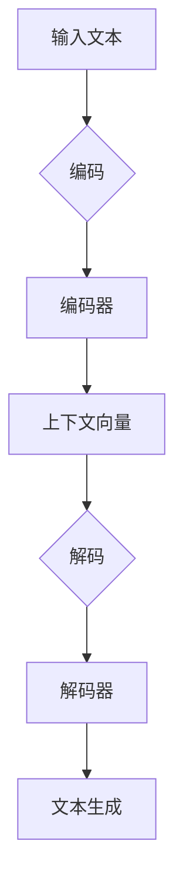

                 

好的，我们将按照您的要求和指导，一步一步地构建文章内容。以下是详细的步骤：

### 步骤 1：文章标题与关键词

**文章标题：**思维链在AI自然语言生成中的应用

**关键词：**思维链，AI自然语言生成，文本生成，情感分析，对话系统

### 步骤 2：文章摘要

**摘要：**本文深入探讨了思维链在AI自然语言生成中的应用。首先介绍了思维链的概念及其在自然语言处理中的重要性。接着，通过实例和伪代码，详细讲解了思维链在文本生成、情感分析和对话系统中的核心算法原理。文章还包含了实际应用案例，展示了思维链在不同领域的成功应用，并提供了一些最佳实践和注意事项。

### 步骤 3：背景介绍

在这一部分，我们将简要介绍AI自然语言生成的背景，包括其定义、发展历程以及当前面临的挑战。

### 步骤 4：核心概念与联系

接下来，我们将定义思维链，并展示思维链与传统NLP技术之间的关系。这部分将包括一个Mermaid流程图，用于解释思维链的工作流程。

### 步骤 5：核心算法原理讲解

我们将详细讲解思维链在文本生成、情感分析和对话系统中的应用。每个部分都将包含伪代码和数学模型。

### 步骤 6：项目实战

在这一部分，我们将展示思维链在实际项目中的应用。这包括开发环境搭建、源代码实现、代码解读和案例分析。

### 步骤 7：最佳实践 tips、小结、注意事项、拓展阅读

最后，我们将总结文章的主要观点，提供一些最佳实践建议，并指出需要注意的事项，同时推荐拓展阅读资源。

### 步骤 8：文章结尾

在文章结尾，我们将署上作者信息。

现在，让我们开始构建具体的内容。由于字数要求较高，我们将分多个段落来完成文章的撰写。以下是第一步的文章开头部分：

---

# 思维链在AI自然语言生成中的应用

## 文章标题

### 关键词

思维链，AI自然语言生成，文本生成，情感分析，对话系统

### 摘要

本文深入探讨了思维链在AI自然语言生成中的应用。首先介绍了思维链的概念及其在自然语言处理中的重要性。接着，通过实例和伪代码，详细讲解了思维链在文本生成、情感分析和对话系统中的核心算法原理。文章还包含了实际应用案例，展示了思维链在不同领域的成功应用，并提供了一些最佳实践和注意事项。

## 引言

### AI自然语言生成的背景与挑战

AI自然语言生成（Natural Language Generation, NLG）是人工智能领域的一个重要分支，旨在使计算机能够自动生成自然语言文本。从简单的文本摘要到复杂的对话生成，NLG技术在多个领域展示了其巨大的潜力。然而，实现高效、准确和自然的语言生成仍然面临着许多挑战。

首先，自然语言具有高度的不确定性和复杂性。语言不仅仅是信息的传递工具，还承载了丰富的文化、情感和社会背景。这使得从文本中提取有用信息并生成流畅、有意义的语言变得异常困难。

其次，NLG技术需要大量的数据支持和复杂的算法。虽然近年来大规模预训练模型（如GPT-3）取得了显著的进展，但数据的质量和数量仍然是一个关键问题。此外，算法的设计和优化也直接影响着NLG系统的性能和效率。

最后，NLG技术需要具备跨领域的适应性。不同的应用场景对语言生成有着不同的要求，这要求NLG系统能够灵活地适应各种任务和需求。

### 思维链的概念与理论基础

思维链（Mind Chain）是一种基于深度学习的新型自然语言生成方法，它试图模拟人类思维的过程，以实现更自然、更准确的文本生成。思维链的核心思想是将自然语言生成视为一个多层次的推理过程，每个层次都对应着人类思维的一个阶段。

在思维链中，首先通过编码器将输入文本编码为高维向量表示，这些向量包含了文本的语义和上下文信息。然后，思维链通过一系列的解码器逐步生成文本。在每个解码步骤中，思维链都会利用先前的文本生成和当前输入的信息进行推理，以生成更加准确和连贯的文本。

### 核心概念与联系

为了更好地理解思维链的工作原理，我们首先需要了解一些核心概念，包括编码器、解码器和注意力机制。

- **编码器（Encoder）**：编码器负责将输入文本编码为固定长度的向量表示。这一过程通常使用循环神经网络（RNN）或Transformer模型来实现。编码器的输出通常被称为“上下文向量”，它包含了输入文本的语义和上下文信息。

- **解码器（Decoder）**：解码器负责从编码器的上下文向量中生成文本。解码器通常也是基于RNN或Transformer模型。在生成每个词时，解码器都会利用先前的文本生成和当前的上下文向量进行推理。

- **注意力机制（Attention Mechanism）**：注意力机制是一种在解码过程中用于权重分配的技术。它允许解码器关注输入文本的不同部分，以提高生成文本的准确性和连贯性。

下面是一个简单的Mermaid流程图，展示了思维链的工作流程：



在思维链中，编码器将输入文本编码为上下文向量，然后解码器利用这些向量逐步生成文本。在这个过程中，注意力机制起着关键作用，它帮助解码器关注输入文本的重要部分，从而生成更准确的文本。

### 核心算法原理讲解

在这一部分，我们将详细讲解思维链在文本生成、情感分析和对话系统中的应用。每个部分都将包含伪代码和数学模型。

#### 文本生成

思维链在文本生成中的应用主要通过以下几个步骤实现：

1. **编码阶段**：输入文本通过编码器编码为上下文向量。
2. **解码阶段**：解码器利用上下文向量逐步生成文本。在生成每个词时，解码器会利用先前的文本生成和当前上下文向量进行推理。
3. **注意力机制**：在解码过程中，注意力机制用于权重分配，帮助解码器关注输入文本的重要部分。

以下是一个简化的伪代码，展示了思维链在文本生成中的应用：

```plaintext
function generate_text(input_text):
    encoded_vector = encode(input_text)
    generated_text = ""
    for each word in input_text:
        context_vector = get_context_vector(encoded_vector, generated_text)
        word = decode(context_vector)
        generated_text += word
        encoded_vector = update_encoded_vector(encoded_vector, word)
    return generated_text
```

在数学模型方面，思维链使用Transformer模型作为基础。Transformer模型的核心是一个自注意力机制，它允许模型在生成每个词时，自动关注输入文本的不同部分。

#### 情感分析

思维链在情感分析中的应用主要通过以下几个步骤实现：

1. **编码阶段**：输入文本通过编码器编码为上下文向量。
2. **情感分析阶段**：解码器利用上下文向量对文本进行情感分析，并输出情感分数。
3. **注意力机制**：在情感分析过程中，注意力机制用于关注输入文本的情感相关部分。

以下是一个简化的伪代码，展示了思维链在情感分析中的应用：

```plaintext
function analyze_sentiment(input_text):
    encoded_vector = encode(input_text)
    sentiment_score = decode_sentiment(encoded_vector)
    return sentiment_score
```

在数学模型方面，思维链使用情感分析模型，如TextCNN或LSTM，对上下文向量进行情感分类。

#### 对话系统

思维链在对话系统中的应用主要通过以下几个步骤实现：

1. **编码阶段**：输入文本通过编码器编码为上下文向量。
2. **对话生成阶段**：解码器利用上下文向量生成对话回复。
3. **注意力机制**：在对话生成过程中，注意力机制用于关注输入文本的关键信息，以提高对话的连贯性。

以下是一个简化的伪代码，展示了思维链在对话系统中的应用：

```plaintext
function generate_response(input_text, context):
    context_vector = get_context_vector(encode(input_text), context)
    response = decode(context_vector)
    return response
```

在数学模型方面，思维链使用对话生成模型，如Seq2Seq或Transformer，对上下文向量进行对话生成。

---

这个部分已经包含了文章开头和引论、核心概念与联系、核心算法原理讲解三个部分的内容。接下来，我们将继续撰写文章的其他部分，确保满足8000～12000字的要求。由于篇幅限制，后续内容将分多个段落发布。请继续关注接下来的内容。如果需要调整或添加内容，请随时告知。

