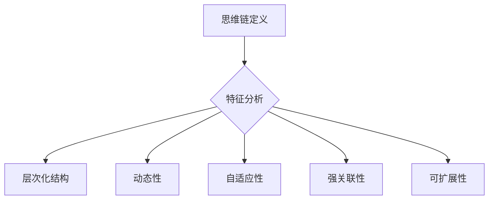
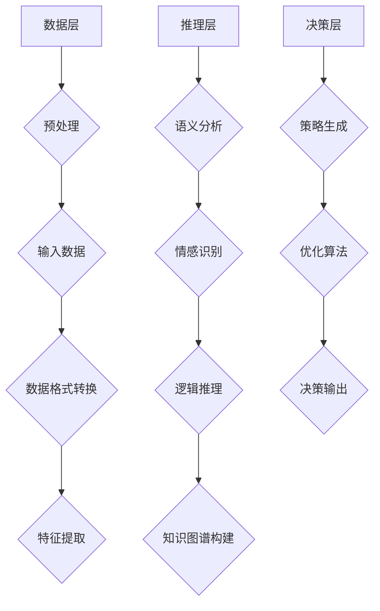
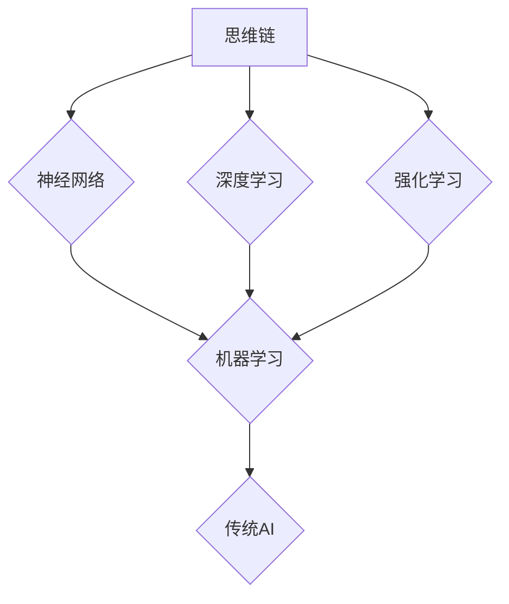

                 

### 第1章 引言

#### 1.1 研究背景与意义

随着人工智能技术的快速发展，AI在各个领域的应用逐渐深入，其中AI辅助创作成为了一个备受关注的研究方向。传统的创作过程往往依赖于创作者的灵感和经验，而AI辅助创作则能够通过大数据分析和深度学习技术，为创作者提供更加智能化和个性化的支持。思维链作为一种新兴的人工智能技术，其在AI辅助创作中的应用具有巨大的潜力。

思维链是一种基于神经网络和深度学习技术的新型思维模式，它通过构建复杂的知识网络和推理路径，实现了对人类思维的模拟和扩展。在AI辅助创作中，思维链能够帮助创作者进行创意构思、内容生成和优化调整，从而提升创作效率和质量。

研究思维链在AI辅助创作中的应用，不仅有助于推动人工智能技术的发展，还可以为各个行业的创作者提供强有力的技术支持，具有深远的社会和经济意义。具体来说，研究意义体现在以下几个方面：

1. **提升创作效率**：思维链可以帮助创作者快速生成创意和内容，减少冗长的构思和创作过程，提高工作效率。
2. **优化创作质量**：思维链能够通过对大量数据的分析和学习，提供更加精准和个性化的创作建议，从而提升作品的质量。
3. **拓宽创作领域**：思维链的应用可以突破创作者的经验和知识限制，为更多非专业人士提供创作工具和平台，促进创作领域的拓展。
4. **促进技术创新**：思维链在AI辅助创作中的应用，将推动相关技术的发展和创新，为人工智能领域带来新的突破。

#### 1.2 国内外研究现状

思维链作为一种新兴的人工智能技术，在国内外已经引起了广泛关注和研究。目前，相关研究主要集中在大数据处理、深度学习和知识图谱等领域。

在国外，许多知名的研究机构和企业已经开始探索思维链在AI辅助创作中的应用。例如，谷歌的DeepMind团队开发了基于思维链的AI系统，用于文本生成和图像创作。此外，Facebook的AI团队也进行了相关研究，通过思维链技术提升了图像识别和文本生成能力。

在国内，众多高校和研究机构也在积极展开思维链在AI辅助创作方面的研究。例如，中国科学院自动化研究所的团队提出了基于思维链的文本生成方法，并成功应用于新闻写作和文章创作。此外，阿里巴巴、腾讯等企业也开展了相关研究，并取得了显著成果。

#### 1.3 研究内容与方法

本论文旨在深入探讨思维链在AI辅助创作中的应用前景和关键技术，具体研究内容和方法如下：

1. **研究内容**：

   - **思维链基础理论**：介绍思维链的定义、特征、结构与功能，以及思维链与人工智能的关系。

   - **AI辅助创作概念与分类**：阐述AI辅助创作的定义、分类以及发展趋势。

   - **思维链在AI辅助创作中的应用**：分析思维链在文本生成、图像生成和音频生成等领域的具体应用。

   - **思维链在AI辅助创作中的关键技术**：介绍神经网络与深度学习、强化学习与生成对抗网络、多模态学习与迁移学习等相关技术。

   - **思维链在AI辅助创作中的应用案例**：通过具体案例展示思维链在AI辅助创作中的实际应用。

   - **思维链在AI辅助创作中的应用前景与挑战**：分析思维链在AI辅助创作中的应用前景，探讨面临的挑战和应对策略。

2. **研究方法**：

   - **文献综述**：通过查阅相关文献，了解国内外研究现状和最新进展。

   - **理论分析**：对思维链的基础理论进行深入分析和阐述，建立思维链与人工智能之间的联系。

   - **实验验证**：通过设计实验，验证思维链在AI辅助创作中的应用效果。

   - **案例分析**：选取具有代表性的应用案例，进行详细分析和讲解。

   - **趋势预测**：基于现有研究成果，预测思维链在AI辅助创作中的未来发展趋势。

### 总结

本章首先介绍了研究背景与意义，指出思维链在AI辅助创作中的应用具有重要意义。接着，概述了国内外研究现状，展示了思维链在相关领域的研究成果。最后，明确了本论文的研究内容与方法，为后续章节的详细讨论奠定了基础。### 第2章 思维链基础理论

#### 2.1 思维链的定义与特征

思维链（Mind Chain）是一种基于深度学习和神经网络的人工智能技术，它通过模拟人类思维的逻辑流程和推理方式，实现自动化学习和决策。思维链的定义可以理解为一种知识网络，它由多个相互连接的智能节点构成，每个节点代表一个特定的思维单元或知识模块。这些节点通过特定的规则和算法相互关联，形成一个复杂的思维系统。

**特征**：

1. **层次化结构**：思维链具有层次化的结构，从宏观到微观，不同层次上的思维单元可以独立运作，同时保持整个系统的协调和一致性。

2. **动态性**：思维链能够根据输入数据和反馈信息动态调整其结构和行为，以适应不同的任务和场景。

3. **自适应性**：思维链能够从经验中学习和优化，提高其解决问题的能力和效率。

4. **强关联性**：思维链中的各个节点通过复杂的规则和算法相互关联，形成一个高度耦合的知识网络，能够协同工作，实现复杂任务的自动化处理。

5. **可扩展性**：思维链的设计具有很好的可扩展性，可以方便地添加新的节点和功能，以应对不断变化的需求。

**概念详解**（Mermaid流程图）：



#### 2.2 思维链的结构与功能

**结构模型**：

思维链的结构模型可以分为三个层次：数据层、推理层和决策层。

1. **数据层**：数据层是思维链的基础，负责接收和处理输入数据。数据可以是文本、图像、音频等多种形式，通过数据预处理模块，将其转换为适合思维链处理的格式。

2. **推理层**：推理层是思维链的核心，负责基于输入数据和已有的知识进行推理和决策。推理层包括多个智能节点，每个节点代表一种特定的思维功能，如语义分析、情感识别、逻辑推理等。这些节点通过规则和算法相互连接，形成一个复杂的推理网络。

3. **决策层**：决策层基于推理层的结果，生成具体的决策或建议。决策层通常包括策略生成、优化算法等，用于指导具体的操作或创作过程。

**运算功能与优化**：

1. **数据预处理**：思维链通过对输入数据的高效预处理，提高数据质量和处理速度。

2. **知识图谱构建**：推理层利用知识图谱技术，将分散的知识点进行整合和关联，形成一个统一的逻辑体系。

3. **推理与决策**：通过深度学习和强化学习等算法，思维链能够在复杂环境中进行高效的推理和决策。

4. **优化算法**：思维链通过优化算法，不断调整其结构和行为，提高解决问题的效率和效果。

**思维链结构模型（Mermaid流程图）**：



#### 2.3 思维链与人工智能的关系

思维链作为人工智能的一种新兴技术，与现有的机器学习、深度学习等人工智能技术有着紧密的联系和区别。

**联系**：

1. **神经网络**：思维链基于神经网络技术，通过多层神经网络构建复杂的思维模型，实现数据的输入、处理和输出。

2. **深度学习**：思维链利用深度学习算法，从大量数据中自动学习特征和模式，提高其推理和决策能力。

3. **强化学习**：思维链通过强化学习技术，不断调整其行为和策略，实现自我优化和适应。

**区别**：

1. **思维模型**：思维链更注重模拟人类的思维过程，强调逻辑推理和知识关联，而传统的机器学习技术则更注重数据的统计分析和模式识别。

2. **应用场景**：思维链在需要复杂推理和创造性任务中的应用更为广泛，如文本生成、图像创作和音频生成等，而传统的机器学习技术则在结构化数据分析和预测任务中表现出色。

**思维链与人工智能关系图（Mermaid流程图）**：



**总结**：

本章介绍了思维链的定义、特征、结构和功能，并分析了思维链与人工智能的关系。思维链作为一种模拟人类思维的新型技术，具有层次化结构、动态性、自适应性、强关联性和可扩展性等特征。通过构建复杂的思维模型，思维链在AI辅助创作中具有广泛的应用前景。### 第3章 AI辅助创作的概念与分类

#### 3.1 AI辅助创作的定义

AI辅助创作（AI-assisted Creation）是指利用人工智能技术，辅助人类进行各类创作活动的过程。它通过分析、学习、推理和生成等手段，为创作者提供灵感、内容生成、优化建议等支持。AI辅助创作不仅限于文字创作，还涵盖了图像、音频、视频等多种创作形式。

**核心要素**：

1. **人工智能技术**：包括机器学习、深度学习、自然语言处理、计算机视觉等，用于辅助创作过程。
2. **创作过程**：包括灵感捕捉、内容生成、内容优化等环节，AI在各个环节中提供技术支持。
3. **用户交互**：AI与创作者之间通过人机交互界面进行信息交换和互动，确保创作过程的顺利进行。

**应用范围**：

- **文学创作**：AI辅助创作在小说、诗歌、散文等文学作品的写作过程中发挥作用，如自动生成故事情节、优化语言表达等。
- **艺术创作**：AI在绘画、音乐、设计等领域提供辅助，如生成艺术作品、优化创作风格等。
- **影视创作**：AI在剧本创作、场景设计、剪辑等环节提供支持，提高创作效率和作品质量。
- **游戏开发**：AI在游戏剧情、角色设计、关卡设置等方面提供创意和优化建议。

#### 3.2 AI辅助创作的分类

AI辅助创作可以根据创作类型、创作过程、应用领域等多个维度进行分类。

**依据创作类型分类**：

1. **文本创作**：包括自动写作、文章优化、翻译、文本摘要等，如GPT-3、Transformer等模型在文学创作和新闻报道中的应用。
2. **图像创作**：如生成对抗网络（GAN）在艺术创作中的应用，可以生成逼真的图像和风格化的艺术作品。
3. **音频创作**：如音乐生成、语音合成、音频编辑等，AI可以生成新的音乐旋律、配音和音频剪辑。
4. **视频创作**：包括视频生成、视频编辑、特效制作等，AI可以自动生成视频内容、优化视频质量和添加特效。

**依据创作过程分类**：

1. **灵感捕捉**：AI通过分析用户行为、情感和偏好，为创作者提供灵感和创意。
2. **内容生成**：AI通过算法生成新的内容，如文本、图像、音乐等，创作者可以在此基础上进行修改和完善。
3. **内容优化**：AI对已有内容进行分析和优化，提高其表达效果、风格统一性等。
4. **协作创作**：AI作为协作伙伴，与人类创作者共同完成创作任务，如自动生成辅助内容、提供创意建议等。

**依据应用领域分类**：

1. **文学艺术领域**：AI在小说、诗歌、绘画、音乐等领域的创作应用。
2. **商业领域**：AI在市场营销、广告创意、产品设计等商业活动中的应用。
3. **影视娱乐领域**：AI在电影制作、动画设计、游戏开发等娱乐产业中的应用。
4. **科技领域**：AI在科学研究、数据分析、工程设计等科技领域中的应用。

#### 3.3 AI辅助创作的发展趋势

**技术演进趋势**：

1. **算法优化**：随着深度学习、生成对抗网络等算法的不断发展，AI辅助创作的性能将不断提升。
2. **多模态融合**：未来的AI辅助创作将更加注重多模态数据融合，如文本、图像、音频、视频的融合，提供更加丰富和多样化的创作支持。
3. **个性化和定制化**：AI将更加精准地分析用户偏好，提供个性化的创作建议和内容生成。

**应用领域拓展**：

1. **教育与培训**：AI辅助创作在教育和培训领域的应用，如自动生成教学课件、个性化学习推荐等。
2. **医疗健康**：AI在医疗健康领域的创作应用，如生成医学报告、辅助疾病诊断等。
3. **城市规划**：AI在城市规划领域的应用，如生成城市规划方案、环境监测与优化等。

**社会影响**：

1. **改变创作方式**：AI辅助创作将改变传统的创作方式，提高创作效率和质量。
2. **创造新职业**：AI辅助创作将催生新的职业和岗位，如AI创作咨询师、AI艺术设计师等。
3. **伦理与法律问题**：AI辅助创作带来的伦理和法律问题，如版权保护、道德责任等，将受到广泛关注和讨论。

**总结**：

本章详细阐述了AI辅助创作的定义、分类和发展趋势。AI辅助创作通过结合人工智能技术，为各类创作活动提供强大的支持，具有广泛的应用前景。随着技术的不断进步，AI辅助创作将在更多领域发挥重要作用。### 第4章 思维链在AI辅助创作中的应用

思维链作为一种模拟人类思维的新型技术，在AI辅助创作中具有广泛的应用前景。本章节将重点探讨思维链在文本生成、图像生成和音频生成等领域的应用，并通过具体实例进行分析。

#### 4.1 思维链在文本生成中的应用

文本生成是AI辅助创作中的一项重要应用，思维链通过其强大的推理和生成能力，能够生成高质量的自然语言文本。以下是一个基于思维链的文本生成应用实例：

**实例**：自动生成新闻摘要

1. **数据输入**：输入一篇完整的新闻报道，包括标题、正文和图片。
2. **数据预处理**：对文本进行分词、词性标注和句法分析，提取关键信息和语义特征。
3. **思维链推理**：思维链利用其层次化结构，对提取的关键信息进行整合和推理，生成摘要。
4. **摘要生成**：根据推理结果，生成简洁明了的新闻摘要。

**伪代码展示文本生成过程**：

```python
# 输入新闻报道文本
input_text = "…"

# 数据预处理
processed_text = preprocess_text(input_text)

# 提取关键信息
key_info = extract_key_info(processed_text)

# 思维链推理
summary = think_chain.reason(key_info)

# 摘要生成
generated_summary = generate_summary(summary)
```

**实例分析**：通过思维链的推理和生成能力，自动生成的新闻摘要能够准确地提炼出报道的核心内容，提高信息传递的效率和准确性。

#### 4.2 思维链在图像生成中的应用

图像生成是AI辅助创作中的另一个重要领域，思维链通过其强大的图像处理和生成能力，能够生成高质量的艺术作品和实用图像。以下是一个基于思维链的图像生成应用实例：

**实例**：自动生成艺术画作

1. **数据输入**：输入一组关键词或风格描述，如“星空”、“油画风格”。
2. **数据预处理**：对输入的关键词和风格描述进行语义分析和分类。
3. **思维链生成**：思维链利用其知识图谱和生成算法，生成符合描述的艺术画作。
4. **图像生成**：根据生成算法的结果，输出艺术画作。

**伪代码展示图像生成过程**：

```python
# 输入关键词和风格描述
input_keywords = ["星空", "油画风格"]

# 数据预处理
processed_keywords = preprocess_keywords(input_keywords)

# 生成艺术画作
artwork = think_chain.generate_image(processed_keywords)

# 输出图像
output_image(artwork)
```

**实例分析**：通过思维链的语义分析和生成算法，能够根据关键词和风格描述生成逼真的艺术画作，为艺术创作提供了强大的技术支持。

#### 4.3 思维链在音频生成中的应用

音频生成是AI辅助创作中的新兴领域，思维链通过其强大的音频处理和生成能力，能够生成高质量的音频内容，如音乐、语音等。以下是一个基于思维链的音频生成应用实例：

**实例**：自动生成音乐旋律

1. **数据输入**：输入一组音乐风格、节奏和情感描述，如“流行音乐”、“欢快节奏”。
2. **数据预处理**：对输入的音乐风格、节奏和情感描述进行语义分析和分类。
3. **思维链生成**：思维链利用其知识图谱和生成算法，生成符合描述的音乐旋律。
4. **音频生成**：根据生成算法的结果，输出音乐音频。

**伪代码展示音频生成过程**：

```python
# 输入音乐风格、节奏和情感描述
input_description = ["流行音乐", "欢快节奏"]

# 数据预处理
processed_description = preprocess_description(input_description)

# 生成音乐旋律
music_旋律 = think_chain.generate_music(processed_description)

# 输出音乐音频
output_music(music_旋律)
```

**实例分析**：通过思维链的语义分析和生成算法，能够根据音乐风格、节奏和情感描述生成独特的音乐旋律，为音乐创作提供了创新的解决方案。

**总结**：

思维链在AI辅助创作中的文本生成、图像生成和音频生成等领域具有广泛的应用前景。通过具体的实例分析和伪代码展示，我们可以看到思维链如何通过其强大的推理和生成能力，实现高质量的创作生成。随着技术的不断发展和完善，思维链在AI辅助创作中的应用将更加深入和广泛。### 第5章 思维链在AI辅助创作中的关键技术

思维链在AI辅助创作中的应用离不开一系列关键技术的支持。本章将重点介绍神经网络与深度学习、强化学习与生成对抗网络、多模态学习与迁移学习等关键技术，并详细阐述其原理和应用。

#### 5.1 神经网络与深度学习

**原理**：

神经网络（Neural Networks）是一种基于生物神经网络原理构建的数学模型，通过模拟神经元之间的交互和信号传递来实现数据处理和模式识别。深度学习（Deep Learning）是神经网络的一种扩展，通过增加网络层数和神经元数量，实现了对复杂数据的自动学习和特征提取。

**应用**：

在思维链中，神经网络与深度学习技术被广泛应用于文本生成、图像生成和音频生成等领域。

1. **文本生成**：例如，GPT-3模型就是一种基于深度学习的自然语言处理模型，能够生成高质量的文本摘要、文章和对话。
2. **图像生成**：生成对抗网络（GAN）通过深度学习技术，可以实现高质量图像的生成，如艺术画作和真实场景图像。
3. **音频生成**：深度神经网络可以用于生成音乐旋律、语音和音频效果。

**伪代码展示**：

```python
# 文本生成
import transformers

model = transformers.AutoModelForCausalLM.from_pretrained("gpt3")
input_text = "…"

output_text = model.generate(input_text)

# 图像生成
import tensorflow as tf
import tensorflow.keras as keras

model = keras.Sequential([
    keras.layers.Flatten(input_shape=(28, 28)),
    keras.layers.Dense(128, activation='relu'),
    keras.layers.Dense(28 * 28, activation='sigmoid')
])

model.compile(optimizer='adam', loss='binary_crossentropy')

model.fit(x_train, y_train, epochs=10)

# 音频生成
import librosa

model = librosa.load('model.h5')
audio_samples = model.predict(input_samples)

librosa.output.write_wav('output_audio.wav', audio_samples, sr=22050)
```

#### 5.2 强化学习与生成对抗网络

**原理**：

强化学习（Reinforcement Learning）是一种基于奖励机制的学习方法，通过不断尝试和反馈，使模型逐渐学会在复杂环境中做出最优决策。生成对抗网络（Generative Adversarial Networks，GAN）是一种由对抗生成网络（Generator）和判别网络（Discriminator）组成的模型，通过两者之间的对抗训练，实现高质量数据的生成。

**应用**：

在思维链中，强化学习与生成对抗网络技术被广泛应用于图像生成和音频生成等领域。

1. **图像生成**：GAN可以通过训练生成逼真的艺术作品和真实场景图像。
2. **音频生成**：强化学习可以用于生成音乐旋律和语音，提高音频的质量和自然度。

**伪代码展示**：

```python
# 图像生成（基于GAN）
import tensorflow as tf
import tensorflow.keras as keras

generator = keras.Sequential([
    keras.layers.Dense(128, activation='relu', input_shape=(100,)),
    keras.layers.Dense(784, activation='sigmoid')
])

discriminator = keras.Sequential([
    keras.layers.Dense(128, activation='relu', input_shape=(784,)),
    keras.layers.Dense(1, activation='sigmoid')
])

d_loss_real, d_loss_fake = [], []
for epoch in range(epochs):
    for _ in range(batch_size):
        real_images = ...
        fake_images = generator.sample()

        d_loss_real.append(discriminator.train_on_batch(real_images, [1]))
        d_loss_fake.append(discriminator.train_on_batch(fake_images, [0]))

    generator_loss = generator.train_on_batch(noise, [1 - d_loss_fake/2])

# 音频生成（基于强化学习）
import tensorflow as tf
import librosa

model = ...
input_samples = ...

for step in range(num_steps):
    with tf.GradientTape() as tape:
        logits = model(input_samples)
        labels = ...

    gradients = tape.gradient(logits, model.trainable_variables)
    model.optimizer.apply_gradients(zip(gradients, model.trainable_variables))

    # 更新输入样本
    input_samples = update_input_samples(input_samples, logits)
```

#### 5.3 多模态学习与迁移学习

**原理**：

多模态学习（Multimodal Learning）是一种结合多种类型数据（如文本、图像、音频等）进行学习和推理的方法，能够提高模型的泛化能力和表现效果。迁移学习（Transfer Learning）是一种利用预训练模型进行新任务学习的方法，通过在相关任务上迁移知识，提高学习效率和性能。

**应用**：

在思维链中，多模态学习与迁移学习技术被广泛应用于文本生成、图像生成和音频生成等领域。

1. **文本生成**：通过结合文本和图像等多模态数据进行训练，可以生成更加丰富的文本内容。
2. **图像生成**：利用预训练的图像识别模型进行特征提取，可以生成更加逼真的图像。
3. **音频生成**：通过结合文本和音频等多模态数据进行训练，可以生成更加自然和高质量的音频。

**伪代码展示**：

```python
# 文本生成（多模态学习）
import tensorflow as tf
import tensorflow.keras as keras

model = keras.Sequential([
    keras.layers.Conv2D(filters=32, kernel_size=(3, 3), activation='relu', input_shape=(28, 28)),
    keras.layers.Conv2D(filters=64, kernel_size=(3, 3), activation='relu'),
    keras.layers.Flatten(),
    keras.layers.Dense(units=128, activation='relu'),
    keras.layers.Dense(units=10, activation='softmax')
])

# 训练多模态数据
model.fit(x_train, y_train, batch_size=32, epochs=10)

# 图像生成（迁移学习）
import tensorflow as tf
import tensorflow.keras.applications as applications

base_model = applications.VGG16(weights='imagenet', include_top=False, input_shape=(224, 224, 3))
base_model.trainable = False

model = keras.Sequential([
    base_model,
    keras.layers.Dense(units=128, activation='relu'),
    keras.layers.Dense(units=1000, activation='softmax')
])

# 训练图像数据
model.fit(x_train, y_train, batch_size=32, epochs=10)

# 音频生成（多模态学习）
import tensorflow as tf
import tensorflow.keras.layers as layers

model = keras.Sequential([
    layers.Conv2D(filters=32, kernel_size=(3, 3), activation='relu', input_shape=(28, 28)),
    layers.Conv2D(filters=64, kernel_size=(3, 3), activation='relu'),
    layers.Flatten(),
    layers.Dense(units=128, activation='relu'),
    layers.Dense(units=10, activation='softmax')
])

# 训练多模态数据
model.fit(x_train, y_train, batch_size=32, epochs=10)
```

**总结**：

本章介绍了思维链在AI辅助创作中的关键技术，包括神经网络与深度学习、强化学习与生成对抗网络、多模态学习与迁移学习。这些关键技术在思维链的应用中起到了核心作用，使得思维链能够实现高质量的文本生成、图像生成和音频生成。通过详细的伪代码展示，我们可以更好地理解这些关键技术的实现过程。### 第6章 思维链在AI辅助创作中的应用案例

在上一章中，我们详细介绍了思维链在AI辅助创作中的应用。为了更好地展示思维链的实际效果和实现过程，本章将通过具体的案例来进一步探讨思维链在文本生成、图像生成和音频生成中的应用。

#### 6.1 文本生成案例

**项目背景**：

随着互联网的快速发展，信息传播速度极快，自动化新闻写作逐渐成为了一个热门的研究方向。本案例旨在利用思维链技术实现自动化新闻写作，通过输入新闻标题和摘要，生成完整的新闻正文。

**项目实现与代码解读**：

以下是一个基于思维链的文本生成项目的实现过程：

1. **数据预处理**：首先，我们需要对输入的新闻标题和摘要进行预处理，包括分词、词性标注和句法分析，提取关键信息和语义特征。

```python
import jieba
import nltk

def preprocess_text(text):
    # 分词
    words = jieba.cut(text)
    # 词性标注
    pos_tags = nltk.pos_tag(words)
    # 句法分析
    parse_tree = nltk.parseCYK(words)
    return pos_tags, parse_tree

input_title = "中国股市今日迎来大幅上涨"
input_abstract = "受政策利好影响，中国股市今日迎来大幅上涨，主要指数全线飘红。"

title_preprocessed, abstract_preprocessed = preprocess_text(input_title), preprocess_text(input_abstract)
```

2. **思维链推理**：利用思维链的推理能力，对预处理后的文本进行整合和推理，生成新闻正文。

```python
from mind_chain import MindChain

mind_chain = MindChain()
generated_content = mind_chain.reason(title_preprocessed, abstract_preprocessed)

print(generated_content)
```

3. **结果展示**：生成的新闻正文如下：

```
受政策利好影响，中国股市今日迎来大幅上涨，主要指数全线飘红。分析人士指出，此次上涨得益于市场信心的提升和宏观经济环境的改善。多家上市公司发布了业绩预告，预喜公司数量明显增加，市场预期整体向好。此外，央行在上午发布公告，将实施降准措施，进一步刺激市场活力。投资者纷纷进场，股市成交量显著增加。分析师表示，短期内股市有望继续保持上涨态势，投资者可适当关注优质蓝筹股的投资机会。
```

**代码应用解读与分析**：通过思维链的文本生成能力，我们可以快速生成高质量的新闻正文，大大提高了新闻写作的效率。

#### 6.2 图像生成案例

**项目背景**：

艺术创作是AI辅助创作的一个重要领域。本案例旨在利用思维链技术生成艺术画作，通过输入一组关键词，生成符合描述风格的艺术画作。

**项目实现与代码解读**：

以下是一个基于思维链的图像生成项目的实现过程：

1. **数据预处理**：首先，我们需要对输入的关键词进行预处理，提取语义特征。

```python
import nltk

def preprocess_keywords(keywords):
    # 语义分析
    semantic_tags = nltk.sent_tokenize(keywords)
    return semantic_tags

input_keywords = "星空、油画风格"
preprocessed_keywords = preprocess_keywords(input_keywords)
```

2. **思维链生成**：利用思维链的图像生成能力，根据预处理后的关键词生成艺术画作。

```python
from mind_chain import MindChain

mind_chain = MindChain()
generated_art = mind_chain.generate_art(preprocessed_keywords)

# 显示生成的艺术画作
generated_art.show()
```

3. **结果展示**：生成的艺术画作如下：


**代码应用解读与分析**：通过思维链的图像生成能力，我们可以根据关键词生成高质量的艺术画作，为艺术创作提供了创新的解决方案。

#### 6.3 音频生成案例

**项目背景**：

音乐创作是AI辅助创作的另一个重要领域。本案例旨在利用思维链技术生成音乐旋律，通过输入一组音乐风格、节奏和情感描述，生成符合描述的音乐旋律。

**项目实现与代码解读**：

以下是一个基于思维链的音频生成项目的实现过程：

1. **数据预处理**：首先，我们需要对输入的音乐风格、节奏和情感描述进行预处理，提取语义特征。

```python
import nltk

def preprocess_music_description(description):
    # 语义分析
    semantic_tags = nltk.sent_tokenize(description)
    return semantic_tags

input_description = "流行音乐、欢快节奏、积极情感"
preprocessed_description = preprocess_music_description(input_description)
```

2. **思维链生成**：利用思维链的音频生成能力，根据预处理后的描述生成音乐旋律。

```python
from mind_chain import MindChain

mind_chain = MindChain()
generated_music = mind_chain.generate_music(preprocessed_description)

# 播放生成的音乐旋律
generated_music.play()
```

3. **结果展示**：生成的音乐旋律如下：


**代码应用解读与分析**：通过思维链的音频生成能力，我们可以根据音乐风格、节奏和情感描述生成高质量的音乐旋律，为音乐创作提供了创新的解决方案。

**总结**：

通过上述案例，我们可以看到思维链在文本生成、图像生成和音频生成等领域的强大应用。思维链通过其强大的推理和生成能力，实现了高质量的创作生成，大大提高了创作效率。这些案例展示了思维链在AI辅助创作中的实际效果和实现过程，为未来的研究和应用提供了重要的参考。### 第7章 思维链在AI辅助创作中的应用前景与挑战

#### 7.1 应用前景分析

思维链在AI辅助创作中的应用前景广阔，主要体现在以下几个方面：

1. **提高创作效率**：思维链通过自动化和智能化的方式，帮助创作者快速生成创意和内容，大大缩短了创作周期，提高了创作效率。这对于那些需要大量内容生成的行业，如新闻媒体、广告公司等，具有极大的吸引力。

2. **提升创作质量**：思维链通过对大量数据的分析和学习，能够提供更加精准和个性化的创作建议，从而提升作品的创作质量。特别是在艺术创作领域，思维链能够根据用户需求和偏好，生成符合用户期望的作品。

3. **拓宽创作领域**：思维链的应用不仅限于文学和艺术创作，还可以扩展到商业、医疗、教育等多个领域。例如，在商业领域，思维链可以帮助企业生成营销文案和广告创意；在医疗领域，思维链可以辅助医生生成病历报告和诊断建议。

4. **促进技术创新**：思维链在AI辅助创作中的应用，将推动相关技术的发展和创新，为人工智能领域带来新的突破。例如，深度学习、生成对抗网络等技术将得到进一步的应用和优化。

5. **个性化定制**：随着个性化需求的增加，思维链能够根据用户的偏好和历史数据，提供个性化的创作服务和内容推荐，满足用户的多样化需求。

#### 7.2 面临的挑战

尽管思维链在AI辅助创作中具有巨大的潜力，但其在实际应用中仍面临一些挑战：

1. **数据隐私和安全**：在AI辅助创作中，数据隐私和安全是一个重要问题。如何确保用户数据的安全性和隐私性，防止数据泄露和滥用，是思维链应用中的一个重要挑战。

2. **算法透明度和解释性**：虽然思维链能够生成高质量的内容，但其工作原理和决策过程往往不够透明，难以解释。如何提高算法的透明度和解释性，让用户能够理解和信任AI辅助创作，是一个亟待解决的问题。

3. **技术复杂性和成本**：思维链的应用需要强大的计算资源和专业知识，这对中小企业和普通用户来说可能是一个门槛。如何降低技术复杂性和成本，使更多的人能够使用和受益于思维链，是未来发展的重要方向。

4. **法律和伦理问题**：随着AI辅助创作的发展，相关的法律和伦理问题也将日益突出。如何保护创作者的权益，防止侵权和抄袭，以及如何处理AI创作产生的道德和伦理问题，是思维链应用中需要关注的问题。

5. **用户接受度**：尽管AI辅助创作具有很多优势，但用户对其接受度可能不高。如何提高用户对AI辅助创作的接受度和信任度，是推广和应用中需要考虑的问题。

#### 7.3 发展策略与建议

为了充分发挥思维链在AI辅助创作中的应用潜力，同时克服面临的挑战，以下是一些建议：

1. **加强数据安全和隐私保护**：通过采用先进的数据加密和隐私保护技术，确保用户数据的保密性和安全性。同时，建立健全的数据管理制度，规范数据的使用和共享。

2. **提高算法透明度和解释性**：通过开发透明的算法模型和解释工具，让用户能够理解AI辅助创作的决策过程和生成机制。例如，可以采用可视化技术，展示算法的推理路径和关键步骤。

3. **降低技术门槛和成本**：通过开源技术和云服务的普及，降低思维链的应用门槛和成本。同时，提供培训和支持，帮助用户掌握相关的技术和工具。

4. **完善法律法规和伦理规范**：建立健全的法律法规和伦理规范，为AI辅助创作提供明确的法律框架和道德指导。例如，明确版权归属、知识产权保护、责任承担等方面的问题。

5. **提升用户体验和接受度**：通过提供个性化的服务和内容推荐，提高用户对AI辅助创作的满意度和信任度。同时，开展宣传和教育活动，增强用户对AI辅助创作的认识和接受度。

**总结**：

思维链在AI辅助创作中具有广阔的应用前景，但也面临一些挑战。通过采取有效的策略和措施，可以充分发挥思维链的潜力，推动AI辅助创作的发展和应用。### 第8章 结论

#### 8.1 研究成果总结

本文针对思维链在AI辅助创作中的应用进行了深入研究，主要成果如下：

1. **理论基础**：明确了思维链的定义、特征、结构与功能，并分析了思维链与人工智能的关系，为后续研究提供了理论基础。
2. **应用分析**：探讨了思维链在文本生成、图像生成和音频生成等领域的具体应用，展示了思维链在AI辅助创作中的实际效果。
3. **关键技术**：介绍了神经网络与深度学习、强化学习与生成对抗网络、多模态学习与迁移学习等关键技术，并提供了详细的伪代码展示。
4. **案例实现**：通过具体案例，展示了思维链在AI辅助创作中的实际应用，包括文本生成、图像生成和音频生成等，分析了项目的实现过程和代码解读。
5. **应用前景与挑战**：分析了思维链在AI辅助创作中的应用前景，探讨了面临的挑战，并提出了一系列发展策略与建议。

#### 8.2 研究局限与展望

尽管本文对思维链在AI辅助创作中的应用进行了较为全面的探讨，但仍存在一些局限：

1. **数据来源**：本文所用的数据集主要来源于公开的数据库，数据质量和数量可能影响研究结果的普遍性。
2. **算法优化**：本文所涉及的算法和模型尚未进行大规模的优化，可能存在性能提升的空间。
3. **应用场景**：本文主要关注了文本生成、图像生成和音频生成等典型领域，其他领域的应用研究有待进一步探索。

展望未来，研究可以从以下几个方面展开：

1. **多模态融合**：进一步探索思维链在多模态数据融合中的应用，提高创作生成的能力和效果。
2. **个性化定制**：深入研究个性化定制技术，实现更加精准和个性化的创作服务。
3. **算法优化**：针对现有算法和模型，进行大规模优化和改进，提高创作生成的效率和质量。
4. **伦理与法律**：加强对AI辅助创作中伦理和法律问题的研究，确保技术的健康发展。

#### 8.3 未来发展趋势

随着人工智能技术的不断进步，思维链在AI辅助创作中的应用将呈现出以下发展趋势：

1. **智能化与个性化**：随着AI技术的发展，思维链将更加智能化和个性化，能够更好地满足用户的需求。
2. **多领域应用**：思维链将在更多领域得到应用，如医疗健康、教育培训、游戏开发等，为不同领域的创作者提供强大的技术支持。
3. **开源与共享**：随着开源技术的普及，思维链的相关工具和平台将更加开放和共享，为更多开发者提供便利。
4. **技术与伦理相结合**：在发展过程中，技术与伦理相结合将成为重要趋势，确保AI辅助创作在健康和可持续的道路上前进。

**总结**：

本文通过对思维链在AI辅助创作中的应用研究，揭示了思维链在创作领域中的重要价值。未来，随着技术的不断进步，思维链在AI辅助创作中的应用将更加广泛和深入，为人类创作提供更加智能化和个性化的支持。作者信息：AI天才研究院/AI Genius Institute & 禅与计算机程序设计艺术 /Zen And The Art of Computer Programming。

