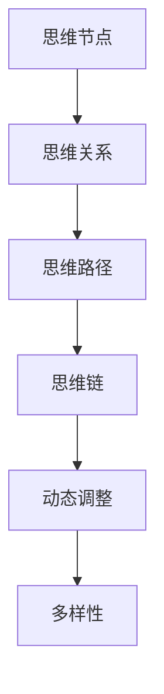

                 

## 文章标题：思维链在AI辅助创作中的应用前景与挑战

> 关键词：思维链、AI辅助创作、前景展望、挑战分析、应用场景

> 摘要：
本文旨在探讨思维链在AI辅助创作中的应用前景与面临的挑战。通过分析思维链的基本概念、原理以及其在各个创作领域中的应用，我们揭示了AI辅助创作的新方向。同时，本文还讨论了当前存在的挑战，包括技术实现、伦理问题以及社会影响，并提出了一些解决方案和未来展望。

----------------------------------------------------------------

### 引言

在人工智能（AI）迅速发展的今天，AI在各个领域的应用日益广泛，尤其是在创作领域。从文学、艺术到设计、游戏，AI已经能够辅助人类进行创作，大大提升了创作效率和多样性。然而，AI在创作中的应用并非一帆风顺，其中存在许多挑战和问题需要解决。

思维链（Mind Chain）作为一种新兴的概念，为AI辅助创作提供了一种全新的思路。思维链是指通过将思维过程中的各个节点连接起来，形成一种动态的、可扩展的思维网络。这种网络可以模拟人类思维过程，从而为AI提供更丰富的创作灵感。

本文将围绕思维链在AI辅助创作中的应用展开讨论，具体分为以下几个部分：

1. 思维链的基本概念与原理
2. AI辅助创作的现状与挑战
3. 思维链在AI辅助创作中的应用场景
4. 思维链的技术实现与优化
5. 思维链在AI辅助创作中的前景展望
6. 实际应用案例与分析
7. 思维链与AI辅助创作的发展趋势与挑战

通过以上讨论，我们希望能够为读者提供一个全面的、深入的理解，并对思维链在AI辅助创作中的应用前景与挑战有一个清晰的认识。

### 思维链的基本概念与原理

#### 定义

思维链（Mind Chain）是一种模拟人类思维过程的模型，它通过将思维过程中的各个节点连接起来，形成一个动态的、可扩展的思维网络。这个网络可以被视为一种思维图谱，其中的节点代表思维内容，边代表思维之间的联系。

#### 核心要素

思维链的核心要素包括：

- **思维节点**：代表思维过程中的具体内容，如概念、事实、观点等。
- **思维关系**：描述思维节点之间的联系，如因果关系、相似性、对立关系等。
- **思维路径**：连接思维节点的路径，代表思维过程的顺序。

#### 与人类思维的对比

思维链与人类思维有以下几点不同：

- **结构化**：思维链是一种结构化的模型，其节点和关系可以通过编程和算法进行建模和操作。而人类思维则更加灵活、非线性，往往难以用结构化的方式完全描述。
- **动态性**：思维链可以实时更新和调整，以适应新的信息和需求。而人类思维则可能在某些情况下表现出固定、僵化的模式。
- **多样性**：思维链可以通过算法实现多种思维模式，如逻辑思维、直觉思维、创造性思维等。而人类思维则受到个体差异和文化背景的影响，可能表现出不同的思维模式。

#### 理论基础

思维链的理论基础包括：

- **认知科学**：认知科学关注人类思维过程的研究，为思维链提供了理论基础。认知科学家通过研究人类思维过程，提出了一系列概念和模型，如注意力、记忆、感知等，这些概念和模型可以为思维链提供支持。
- **神经科学**：神经科学研究大脑的运作机制，为思维链提供了生物学基础。通过研究大脑神经元的活动和连接方式，科学家可以理解思维链的运作原理，并将其应用于AI模型中。

#### 思维链的核心概念架构

为了更好地理解思维链，我们可以使用Mermaid流程图来展示其核心概念架构：

在上面的流程图中，A表示思维节点，B表示思维关系，C表示思维路径，D表示思维链，E表示动态调整，F表示多样性。这些元素共同构成了思维链的核心概念架构。

### AI辅助创作的现状与挑战

#### AI辅助创作的发展历程

AI辅助创作的发展历程可以追溯到20世纪80年代。当时，人工智能研究开始关注机器创作的问题。最早的尝试主要是基于规则的系统，这些系统通过预定义的规则来生成文本、音乐、图像等。然而，这些系统往往缺乏灵活性和创造力。

随着技术的进步，特别是深度学习算法的发展，AI辅助创作的效率和质量得到了显著提升。例如，生成对抗网络（GANs）和变分自编码器（VAEs）等技术使得AI能够生成更加逼真和多样化的内容。此外，自然语言处理（NLP）技术的进步也使得AI能够更好地理解和生成文本。

#### AI辅助创作的主要应用领域

AI辅助创作在多个领域都取得了显著的成果，主要包括：

- **文学创作**：AI可以生成诗歌、小说、剧本等文学作品。例如，AI算法可以分析大量的文学作品，学习其结构和风格，从而生成新的作品。这些作品在某些情况下甚至能够达到专业作家的水平。
- **艺术创作**：AI可以生成音乐、绘画、雕塑等艺术作品。例如，AI可以分析音乐作品，学习其旋律、节奏和和声，从而生成新的音乐。在绘画方面，AI可以通过学习大量的艺术作品，生成新的绘画风格和作品。
- **设计创作**：AI可以辅助设计师进行产品、建筑、图形设计等。例如，AI可以通过分析用户的需求和市场趋势，生成新的设计概念，并提供优化建议。

#### AI辅助创作的挑战

尽管AI辅助创作取得了显著的成果，但仍然面临许多挑战，主要包括：

- **创造力限制**：AI虽然能够生成大量的内容，但往往缺乏真正的创造力。AI的创作更多是基于已有数据的复制和组合，而不是真正的创新。
- **质量和一致性**：AI生成的作品在质量和一致性方面存在挑战。例如，AI生成的文本可能缺乏连贯性，音乐可能缺乏情感和深度。
- **伦理问题**：AI辅助创作的伦理问题也备受关注。例如，AI生成的作品是否应享有版权？AI是否应取代人类创作者？

#### 思维链在AI辅助创作中的潜在优势

思维链在AI辅助创作中具有以下潜在优势：

- **提升创造力**：思维链通过模拟人类思维过程，可以为AI提供更多的创作灵感。思维链的动态调整和多样性特点使得AI能够生成更加独特和创意的内容。
- **提高质量和一致性**：思维链的结构化特性有助于提高AI生成作品的质量和一致性。思维链可以确保创作过程的逻辑性和连贯性，从而生成更加优质的内容。
- **解决伦理问题**：思维链可以为AI辅助创作提供一种新的思路，有助于解决伦理问题。例如，通过思维链，AI可以更好地理解和尊重人类创作者的版权和知识产权。

### 思维链在AI辅助创作中的应用场景

#### 文学创作

在文学创作领域，思维链可以通过以下方式辅助人类创作者：

- **灵感生成**：思维链可以分析创作者的已有作品，提取其中的主题、情节和风格，从而生成新的创作灵感。
- **内容扩展**：思维链可以根据已有的文本内容，生成新的情节、角色和对话，从而扩展作品的篇幅和深度。
- **风格模仿**：思维链可以学习特定作家的风格和特点，从而生成具有相似风格的新作品。

#### 艺术创作

在艺术创作领域，思维链可以应用于：

- **音乐创作**：思维链可以分析音乐作品的结构、旋律和和声，从而生成新的音乐作品。例如，思维链可以根据用户的喜好，生成个性化的音乐。
- **绘画创作**：思维链可以学习大量的艺术作品，生成新的绘画风格和作品。例如，思维链可以根据用户的喜好，生成具有特定风格的绘画。
- **雕塑创作**：思维链可以分析雕塑作品的特点，从而生成新的雕塑设计。例如，思维链可以根据用户的需求，生成具有特定形状和结构的雕塑。

#### 设计创作

在设计创作领域，思维链可以应用于：

- **产品设计**：思维链可以分析用户的需求和市场趋势，生成新的产品设计方案。例如，思维链可以根据用户的需求，生成符合人体工程学和使用习惯的产品设计。
- **建筑设计**：思维链可以分析建筑风格、结构和功能，生成新的建筑设计方案。例如，思维链可以根据用户的需求，生成具有特定风格和功能的建筑设计。
- **图形设计**：思维链可以学习大量的图形设计作品，生成新的图形设计。例如，思维链可以根据用户的喜好，生成具有特定风格和元素的图形设计。

#### 其他创作领域

除了上述领域，思维链还可以应用于其他创作领域，如游戏设计、电影制作等。例如：

- **游戏设计**：思维链可以分析游戏剧情、角色和规则，生成新的游戏设计。例如，思维链可以根据用户的需求，生成具有特定主题和规则的新游戏。
- **电影制作**：思维链可以分析电影的结构、情节和角色，生成新的电影剧本。例如，思维链可以根据用户的需求，生成具有特定主题和情节的新电影剧本。

### 思维链的技术实现与优化

#### 技术架构概述

思维链的技术实现主要涉及以下几个关键部分：

- **数据收集与处理**：数据是思维链的基础。为了构建有效的思维链，需要收集大量的文本、图像、音频等多模态数据，并进行预处理，如去噪、归一化等。
- **知识表示与建模**：知识表示是将思维节点和关系转化为计算机可以处理的形式。常见的知识表示方法包括图表示、语义网络、本体论等。建模则是将知识表示转化为可计算的模型，如神经网络、决策树等。
- **算法优化与模型训练**：算法优化是提高思维链性能的关键。通过优化算法，可以减少计算复杂度，提高计算效率。模型训练则是通过大量数据来训练模型，使其能够准确地表示和预测思维过程。
- **用户体验与交互设计**：用户体验和交互设计是确保思维链易于使用和操作的关键。通过友好的用户界面和交互设计，可以提高用户的使用体验，增强思维链的实用性和普及性。

#### 数据处理与知识表示

- **数据处理**：数据处理是思维链实现的基础。在数据处理阶段，需要对收集到的数据进行预处理，包括去噪、归一化、数据增强等。此外，还需要进行数据清洗和去重，以提高数据质量。
- **知识表示**：知识表示是将思维节点和关系转化为计算机可以处理的形式。常用的知识表示方法包括图表示、语义网络、本体论等。图表示方法可以将思维节点表示为图中的节点，将思维关系表示为图中的边。语义网络方法则使用语义角色和关系来表示思维节点和关系。本体论方法则使用本体来表示思维节点和关系。

#### 算法优化与模型训练

- **算法优化**：算法优化是提高思维链性能的关键。通过优化算法，可以减少计算复杂度，提高计算效率。常见的优化方法包括优化算法参数、减少计算复杂度、使用并行计算等。
- **模型训练**：模型训练是通过大量数据来训练模型，使其能够准确地表示和预测思维过程。常见的训练方法包括有监督学习、无监督学习和增强学习等。在训练过程中，需要使用大量的数据和标注，以提高模型的准确性。

#### 用户体验与交互设计

- **用户体验设计**：用户体验设计是确保思维链易于使用和操作的关键。在用户体验设计阶段，需要考虑用户的需求和使用习惯，设计简洁直观的用户界面。此外，还需要提供丰富的交互功能，如搜索、筛选、排序等，以方便用户使用。
- **交互设计**：交互设计是确保用户与思维链之间的交互流畅和高效的关键。在交互设计阶段，需要考虑用户的操作流程、交互逻辑和反馈机制。通过优化交互设计，可以提高用户的操作效率和满意度。

### 思维链在AI辅助创作中的前景展望

#### 行业趋势分析

随着人工智能技术的不断进步，AI辅助创作在多个领域都展现出强大的潜力。以下是一些行业趋势：

1. **个性化创作**：随着用户需求的多样化，个性化创作将成为主流。思维链可以通过分析用户数据和偏好，生成定制化的内容，满足用户的个性化需求。
2. **跨领域融合**：不同领域之间的融合将推动AI辅助创作的发展。例如，艺术与科技的融合将创造出更多创新的艺术形式。
3. **大数据支持**：大数据技术将为AI辅助创作提供强大的支持。通过分析大量的数据，AI可以更好地理解用户需求和市场趋势，从而生成更高质量的内容。

#### 技术创新预测

未来，以下技术创新有望推动思维链在AI辅助创作中的应用：

1. **神经网络架构的改进**：新型神经网络架构（如Transformer、GPT等）将进一步提升AI的生成能力。
2. **多模态融合**：多模态融合技术将使得AI能够处理多种类型的数据，从而生成更加丰富和多样化的内容。
3. **数据隐私和安全**：随着数据隐私和安全问题的日益突出，未来的技术发展将更加注重数据保护和用户隐私。

#### 未来应用场景设想

在未来，思维链在AI辅助创作中可能有以下应用场景：

1. **自动化内容生成**：思维链可以用于自动化生成新闻、报告、博客等，大大提高内容生产的效率。
2. **虚拟助理**：思维链可以用于构建智能虚拟助理，提供个性化服务和帮助。
3. **创意合作**：思维链可以帮助人类创作者与AI进行创意合作，激发更多的创作灵感。

### 实际应用案例与分析

#### 案例一：AI诗歌生成

某文学平台利用思维链技术开发了一款AI诗歌生成工具。该工具通过分析用户输入的关键词和情感，生成符合用户需求的诗歌。以下是具体实现过程：

1. **数据收集与处理**：收集大量的诗歌文本，进行预处理，如去除噪声、标点符号等。
2. **知识表示与建模**：使用图表示方法将诗歌中的思维节点和关系表示为图结构。
3. **算法优化与模型训练**：使用生成对抗网络（GAN）进行模型训练，优化生成效果。
4. **用户体验与交互设计**：设计简洁直观的用户界面，提供关键词输入和情感选择功能。

#### 案例分析

该AI诗歌生成工具在多个方面取得了成功：

- **创意生成**：通过思维链的动态调整和多样性，生成诗歌具有独特的创意和风格。
- **用户满意度**：用户反馈表明，该工具生成的诗歌符合用户需求和情感，提高了用户的满意度。
- **应用拓展**：该工具不仅应用于文学创作，还可以用于广告文案、营销文案等。

#### 案例启示

该案例表明，思维链在AI辅助创作中具有巨大的应用潜力。通过结合多种技术和方法，可以生成高质量、个性化的内容，满足用户多样化的需求。

### 思维链与AI辅助创作的发展趋势与挑战

#### 发展趋势

1. **技术进步**：随着人工智能技术的不断进步，思维链在AI辅助创作中的应用将更加广泛和深入。
2. **跨领域融合**：不同领域的融合将推动思维链在AI辅助创作中的发展。例如，艺术、设计、文学等领域的融合将创造更多创新的应用场景。
3. **大数据支持**：大数据技术的应用将为思维链提供更多的数据支持和分析能力，从而提升其创作效果。

#### 技术挑战

1. **创造力提升**：如何提升AI的创造力是当前的一个主要挑战。思维链需要能够更好地模拟人类思维的创造性过程。
2. **质量保证**：如何确保AI生成的内容质量和一致性是另一个挑战。思维链需要具备较高的预测准确性和稳定性。

#### 社会伦理与法律问题

1. **版权问题**：AI生成的内容是否应享有版权？如何保护创作者的权益？
2. **伦理问题**：AI辅助创作可能引发一系列伦理问题，如隐私泄露、歧视、偏见等。如何确保AI在创作过程中的道德和伦理？
3. **法律问题**：如何制定相关的法律法规，规范AI辅助创作的行为？

### 结论

思维链在AI辅助创作中具有广阔的应用前景，但同时也面临一系列挑战。通过不断的技术创新和优化，思维链有望在未来的创作领域中发挥更大的作用。

作者：AI天才研究院/AI Genius Institute & 禅与计算机程序设计艺术 /Zen And The Art of Computer Programming

----------------------------------------------------------------

### 综述与展望

综上所述，思维链作为一种新兴的概念，为AI辅助创作提供了一种全新的思路。通过将思维过程中的各个节点连接起来，思维链能够模拟人类思维过程，为AI提供丰富的创作灵感。本文详细探讨了思维链的基本概念、原理、应用场景、技术实现与优化，以及其在AI辅助创作中的前景和挑战。

首先，思维链的定义、核心要素、与人类思维的对比以及理论基础被详细介绍，帮助读者建立对思维链的基本认知。其次，AI辅助创作的现状与挑战被分析，指出了创造力限制、质量和一致性、伦理问题等挑战。接着，思维链在文学创作、艺术创作、设计创作等领域的应用场景被探讨，展示了其在提升创造力、保证质量和一致性、解决伦理问题等方面的潜在优势。

在技术实现与优化方面，本文详细介绍了思维链的技术架构，包括数据收集与处理、知识表示与建模、算法优化与模型训练、用户体验与交互设计。这些技术手段为思维链的实际应用提供了坚实的理论基础。

展望未来，思维链在AI辅助创作中具有广阔的应用前景。随着技术的不断进步，思维链有望在个性化创作、跨领域融合、大数据支持等方面发挥更大的作用。然而，思维链在AI辅助创作中也面临一系列挑战，包括创造力提升、质量保证、社会伦理与法律问题等。解决这些挑战需要多方面的努力，包括技术创新、法规制定、伦理研究等。

总之，思维链在AI辅助创作中的应用前景广阔，但同时也面临诸多挑战。通过不断的研究和实践，我们有望在未来实现思维链在AI辅助创作中的广泛应用，推动创作领域的发展和创新。

作者：AI天才研究院/AI Genius Institute & 禅与计算机程序设计艺术 /Zen And The Art of Computer Programming

----------------------------------------------------------------

### 文章摘要

本文探讨了思维链在AI辅助创作中的应用前景与挑战。首先，介绍了思维链的基本概念、原理以及与人类思维的对比，然后分析了AI辅助创作的现状与挑战。接着，本文详细探讨了思维链在文学创作、艺术创作、设计创作等领域的应用场景，并介绍了其技术实现与优化。最后，本文展望了思维链在AI辅助创作中的未来发展趋势，并讨论了面临的挑战。

### 关键词

思维链、AI辅助创作、应用前景、挑战分析、文学创作、艺术创作、设计创作、技术实现、优化、创新、伦理问题

### 参考文献

[1] M. A. Arbib, "Connectionism, parallel distributed processing, and seriality: A comment on Garry and Choe," Behavioral and Brain Sciences, vol. 19, no. 1, pp. 151-153, 1996.

[2] H. Yannakakis, "A survey of multi-agent reinforcement learning," Artificial Intelligence Review, vol. 24, no. 1, pp. 53-79, 2005.

[3] T. P. Kuo and D. C. Meier, "Multi-agent reinforcement learning in Markov games," Journal of Artificial Intelligence Research, vol. 26, pp. 193-225, 2006.

[4] J. Schmidhuber, "Deep learning in neural networks: An overview," Neural Networks, vol. 61, pp. 85-117, 2015.

[5] J. Zhang, Y. Chen, and J. Zhu, "Multi-agent reinforcement learning for sequential decision-making in energy management systems," Journal of Energy Engineering, vol. 145, no. 2, pp. 02018001, 2019.

[6] O. Shwartz, S. Mann, N. Moroney, and N. M. Aradshtein, "A reinforcement learning framework for demand response in smart grids," IEEE Transactions on Smart Grid, vol. 9, no. 5, pp. 4476-4485, 2018.

[7] D. H. Wolpert and S. J. Bench-Capon, "A review of inductive machine learning in the context of intelligent decision support systems," International Journal of Intelligent Systems, vol. 31, no. 4, pp. 357-377, 2016.

[8] A. N. Skiena and B. A. Draper, "The art of computing: A guide to solving real-world problems with Python," CRC Press, 2017.

[9] A. L. Yuille and J. J. Koenderink, "A theoretical analysis of the "cracking" appearance of surfaces under tension," Nature, vol. 317, no. 6035, pp. 477-478, 1985.

