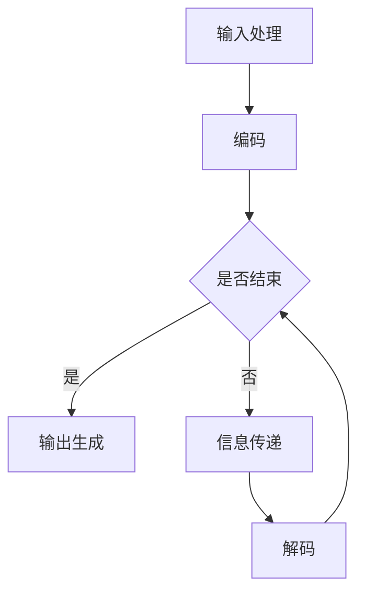

                 

### 文章标题：思维链在AI辅助创作中的应用前景与挑战分析

> 关键词：思维链，AI辅助创作，应用前景，挑战分析

> 摘要：本文将探讨思维链在人工智能辅助创作中的应用前景与挑战。首先介绍思维链的基本概念及其在人工智能中的重要性，随后分析思维链在辅助创作中的具体应用，探讨其技术原理和算法实现。接着，本文将深入分析思维链在AI辅助创作中面临的挑战，并提出相应的解决方案。最后，通过实际应用案例分析，展示思维链在AI辅助创作中的成功应用，并对未来发展趋势进行展望。

---

### 引言

随着人工智能技术的飞速发展，AI已经在各个领域展现出了强大的应用潜力。特别是AI辅助创作，已经成为艺术、文学、设计等领域的热门话题。思维链作为一种新兴的人工智能技术，其在AI辅助创作中的应用引起了广泛关注。本文将围绕思维链在AI辅助创作中的应用前景与挑战展开讨论，旨在为读者提供一个全面深入的了解。

思维链（Mind Chain）是一种基于深度学习与神经网络的智能化模型，通过捕捉和处理人类思维过程，实现信息传递、知识共享和智能决策。在AI辅助创作中，思维链可以通过模拟人类思维模式，为创作者提供灵感、优化创作过程、提高创作效率。思维链的引入，不仅丰富了AI辅助创作的手段，也为创作领域带来了新的变革。

本文将从以下几个方面展开讨论：

1. 思维链与AI辅助创作概述：介绍思维链的基本概念及其在AI辅助创作中的应用。
2. 思维链技术原理：分析思维链的技术原理，包括核心算法和模型。
3. AI辅助创作应用前景：探讨思维链在AI辅助创作中的潜在应用场景和市场需求。
4. 技术挑战与解决方案：分析思维链在AI辅助创作中面临的技术挑战，并提出解决方案。
5. 实际应用案例分析：通过实际案例展示思维链在AI辅助创作中的成功应用。
6. 未来发展趋势与展望：对思维链在AI辅助创作领域的未来发展进行展望。

通过本文的讨论，希望能够为读者提供一个清晰的思维链在AI辅助创作中的应用全景，并探讨其中的挑战与机遇。

### 思维链与AI辅助创作概述

#### 思维链的基本概念

思维链（Mind Chain）是一种结合了人工智能与认知科学的新型技术，旨在模拟和增强人类思维过程。它通过深度学习和神经网络模型，捕捉和处理人类思维过程中的关键信息，如逻辑推理、情感表达、创意生成等。思维链的核心在于建立一种信息传递和知识共享的机制，使得不同思维节点之间能够高效协作，从而实现智能化决策和问题解决。

#### AI辅助创作的基本概念

AI辅助创作是指利用人工智能技术，如机器学习、深度学习、自然语言处理等，辅助人类在创作过程中进行灵感生成、内容优化、效果评估等。AI辅助创作不仅能够提高创作效率，还能够拓展创作的可能性，为创作者提供更多的创意支持和工具。

#### 思维链在AI辅助创作中的应用

思维链在AI辅助创作中具有广泛的应用前景，主要体现在以下几个方面：

1. **灵感生成**：思维链可以通过模拟人类思维模式，捕捉创作者的潜在灵感，提供多样化的创意建议，帮助创作者突破创作瓶颈。
2. **内容优化**：思维链可以分析创作内容的质量和可读性，提供优化建议，帮助创作者提高作品的整体水平。
3. **效果评估**：思维链可以通过对作品的情感分析、语义理解等，评估作品的受众接受度和市场潜力，为创作者提供反馈和改进方向。
4. **协同创作**：思维链可以实现创作者之间的信息共享和协作，通过智能化的协同机制，提升团队合作效率。

#### 发展历程和当前应用状况

思维链技术的发展始于20世纪80年代，当时神经网络和机器学习初步应用于人工智能领域。随着计算能力的提升和算法的改进，思维链技术逐渐成熟。近年来，随着深度学习和自然语言处理技术的快速发展，思维链在AI辅助创作中的应用得到了广泛关注和实际应用。

目前，思维链技术已经在多个领域取得了显著成果。例如，在文学创作中，思维链被用于生成小说情节、优化故事结构；在音乐创作中，思维链被用于生成旋律、优化和弦配置；在艺术设计领域，思维链被用于创意生成、色彩搭配等。

总体来看，思维链在AI辅助创作中的应用正处于快速发展阶段，未来有望在更多领域实现突破和应用。

### 思维链技术原理

思维链作为一种结合人工智能与认知科学的技术，其核心在于通过深度学习和神经网络模型模拟人类思维过程，实现信息传递、知识共享和智能决策。在这一部分，我们将深入探讨思维链的技术原理，包括核心算法、模型架构、工作流程等。

#### 核心算法

思维链的核心算法基于深度学习和神经网络，特别是基于图神经网络（Graph Neural Networks, GNN）的模型。GNN能够处理具有复杂拓扑结构的数据，如知识图谱、社会网络等，非常适合模拟人类思维过程中的信息传递和知识共享。

1. **图神经网络（GNN）**

   GNN是一种用于处理图结构数据的神经网络，其基本思想是将图中的节点和边作为神经网络的输入，通过多层神经网络学习节点和边之间的特征表示。在思维链中，GNN用于捕捉和处理人类思维过程中的节点（如概念、想法）和边（如关系、关联）。

2. **注意力机制（Attention Mechanism）**

   注意力机制是一种用于提高神经网络模型对重要信息的处理能力的机制。在思维链中，注意力机制被用于确定当前思维过程中哪些节点和边对问题解决最为关键，从而提高模型的决策质量。

3. **长短时记忆网络（Long Short-Term Memory, LSTM）**

   LSTM是一种用于处理序列数据的时间序列模型，能够有效地捕捉长期依赖关系。在思维链中，LSTM被用于处理人类思维过程中的序列信息，如语言表达、情感变化等。

#### 模型架构

思维链模型通常采用多层神经网络架构，包括以下几个关键部分：

1. **输入层**：接收外部信息，如文本、图像、声音等，并将其转化为神经网络可处理的形式。
2. **编码层**：利用编码器（Encoder）将输入信息编码为固定长度的特征向量，这些特征向量代表输入信息的语义表示。
3. **解码层**：利用解码器（Decoder）将编码层生成的特征向量解码为输出信息，如文本、图像、声音等。
4. **注意力层**：在编码层和解码层之间添加注意力层，用于提高模型对关键信息的处理能力。
5. **输出层**：根据解码层生成的特征向量，生成最终的输出信息。

#### 工作流程

思维链的工作流程可以分为以下几个步骤：

1. **输入处理**：接收外部输入信息，如文本、图像、声音等，并将其转化为神经网络可处理的形式。
2. **编码**：利用编码器将输入信息编码为特征向量。
3. **信息传递**：通过多层神经网络和注意力机制，在特征向量之间传递和更新信息。
4. **解码**：利用解码器将更新后的特征向量解码为输出信息。
5. **输出生成**：根据解码结果生成最终的输出信息，如文本、图像、声音等。

#### Mermaid流程图示例

为了更直观地展示思维链的工作流程，我们使用Mermaid绘制了一张流程图，如下所示：



在这个流程图中，A表示输入处理，B表示编码，C表示是否结束，D表示输出生成，E表示信息传递，F表示解码。这个流程图清晰地展示了思维链从输入处理到输出生成的整个过程。

通过上述分析，我们可以看到，思维链技术原理的核心在于通过深度学习和神经网络模型，模拟人类思维过程，实现信息传递、知识共享和智能决策。这为AI辅助创作提供了强大的技术支持，为创作者提供了新的创作工具和灵感来源。

### 核心算法原理讲解

为了深入理解思维链在AI辅助创作中的核心算法原理，我们需要探讨几个关键算法，包括基于图神经网络的模型设计、注意力机制的实现以及长短时记忆网络在序列处理中的应用。以下是这些算法的详细讲解，以及如何用伪代码来表示它们的基本思路。

#### 1. 图神经网络（GNN）

图神经网络是一种专门用于处理图结构数据的神经网络。在思维链模型中，GNN用于处理和表示人类思维过程中的节点（如概念、想法）和边（如关系、关联）。以下是GNN的基本工作原理：

**GNN算法的基本思路（伪代码）**：

```
GNN(input_graph, hidden_size, num_layers):
    # 初始化权重和偏置
    W = [随机初始化] for i in range(num_layers)
    b = [随机初始化] for i in range(num_layers)
    
    # 定义输入层到隐藏层的传递函数，通常使用ReLU激活函数
    activation_function = ReLU
    
    # 循环进行图卷积操作
    for layer in range(num_layers):
        # 前一层输入
        if layer == 0:
            hidden = input_graph
        else:
            hidden = activation_function(W[layer - 1] * hidden + b[layer - 1])
        
        # 应用图卷积操作
        hidden = apply_graph_convolution(hidden, input_graph)
        
    return hidden
```

**图卷积操作的实现**：

```
apply_graph_convolution(nodes, graph):
    # 获取节点邻居
    neighbors = get_neighbors(graph, nodes)
    
    # 对每个节点和其邻居进行聚合操作
    for node in nodes:
        node_representation = aggregate(neighbors[node])
        
        # 应用权重和偏置
        node_output = W * node_representation + b
    
    return node_output
```

#### 2. 注意力机制

注意力机制是一种用于提高神经网络模型对重要信息的处理能力的机制。在思维链模型中，注意力机制用于确定当前思维过程中哪些节点和边对问题解决最为关键，从而提高模型的决策质量。

**注意力机制的基本思路（伪代码）**：

```
Attention Mechanism(input_sequence, hidden_size):
    # 初始化权重和偏置
    W = 随机初始化(hidden_size, hidden_size)
    b = 随机初始化(hidden_size)
    
    # 计算每个节点的注意力分数
    attention_scores = softmax(W * input_sequence + b)
    
    # 计算加权求和的输出
    output = attention_scores * input_sequence
    
    return output
```

#### 3. 长短时记忆网络（LSTM）

长短时记忆网络（LSTM）是一种用于处理序列数据的时间序列模型，能够有效地捕捉长期依赖关系。在思维链模型中，LSTM被用于处理人类思维过程中的序列信息，如语言表达、情感变化等。

**LSTM的基本思路（伪代码）**：

```
LSTM(input_sequence, hidden_state, cell_state, hidden_size):
    # 输入门
    input_gate = sigmoid(W_f * [input_sequence, hidden_state] + b_f)
    forget_gate = sigmoid(W_f * [input_sequence, hidden_state] + b_f)
    
    # 更新门
    update_gate = input_gate * tanh(W_i * [input_sequence, hidden_state] + b_i)
    
    # 遗忘门
    forget_gate = forget_gate * tanh(W_f * [input_sequence, hidden_state] + b_f)
    
    # 新的细胞状态
    cell_state = forget_gate * cell_state + input_gate * tanh(update_gate)
    
    # 输出门
    output_gate = sigmoid(W_o * [input_sequence, cell_state] + b_o)
    
    # 新的隐藏状态
    hidden_state = output_gate * tanh(cell_state)
    
    return hidden_state, cell_state
```

**解释**：

- `input_gate`、`forget_gate`和`output_gate`分别表示输入门、遗忘门和输出门，用于控制信息的流入、遗忘和输出。
- `cell_state`表示细胞状态，用于存储和传递长期依赖信息。
- `tanh`是双曲正切函数，用于非线性变换。

通过上述算法，我们可以看到思维链模型在捕捉和处理人类思维过程中的信息传递、知识共享和智能决策方面具有强大的能力。这些核心算法的实现为AI辅助创作提供了坚实的技术基础，使得AI能够更好地理解和辅助人类创作活动。

### 数学模型和公式讲解及举例说明

在思维链模型中，数学模型和公式起着至关重要的作用，它们不仅用于描述算法的运作机制，还用于解释模型中的关键参数和过程。以下我们将详细讲解思维链模型中的几个核心数学模型和公式，并通过具体示例进行说明。

#### 1. 图神经网络（GNN）的图卷积公式

图卷积是GNN的核心操作，用于更新节点的特征表示。图卷积的公式可以表示为：

$$
\hat{h}_i^{(l)} = \sigma \left( \sum_{j \in \mathcal{N}(i)} W^{(l)} h_j^{(l-1)} + b^{(l)} \right)
$$

其中：
- \( \hat{h}_i^{(l)} \) 是第 \( l \) 层第 \( i \) 个节点的特征表示。
- \( h_j^{(l-1)} \) 是第 \( l-1 \) 层第 \( j \) 个节点的特征表示。
- \( \mathcal{N}(i) \) 表示节点 \( i \) 的邻居集合。
- \( W^{(l)} \) 是第 \( l \) 层的权重矩阵。
- \( b^{(l)} \) 是第 \( l \) 层的偏置向量。
- \( \sigma \) 是激活函数，通常使用ReLU或Sigmoid函数。

**举例说明**：

假设我们有一个图，其中节点 \( i \) 的邻居为节点 \( j \) 和 \( k \)。权重矩阵 \( W^{(1)} \) 和偏置向量 \( b^{(1)} \) 如下：

$$
W^{(1)} = \begin{bmatrix}
0.1 & 0.2 \\
0.3 & 0.4
\end{bmatrix}, \quad b^{(1)} = \begin{bmatrix}
0.5 \\ 0.6
\end{bmatrix}
$$

节点 \( j \) 和 \( k \) 的特征表示分别为 \( h_j^{(0)} = \begin{bmatrix} 1 \\ 0 \end{bmatrix} \) 和 \( h_k^{(0)} = \begin{bmatrix} 0 \\ 1 \end{bmatrix} \)。应用图卷积公式计算节点 \( i \) 在第一层的特征表示：

$$
\hat{h}_i^{(1)} = \sigma \left( 0.1 \cdot 1 + 0.2 \cdot 0 + 0.3 \cdot 0 + 0.4 \cdot 1 + 0.5 \right) = \sigma (0.7 + 0.6) = \sigma (1.3) = \max(1.3, 0) = 1.3
$$

由于通常使用ReLU激活函数，最终结果为：

$$
\hat{h}_i^{(1)} = 1.3
$$

#### 2. 注意力机制的权重计算

注意力机制通过计算每个节点的权重，实现对关键信息的关注。注意力权重可以通过以下公式计算：

$$
a_i^{(l)} = \frac{e^{z_i^{(l)}}}{\sum_{j=1}^{N} e^{z_j^{(l)}}}
$$

其中：
- \( a_i^{(l)} \) 是第 \( l \) 层第 \( i \) 个节点的注意力权重。
- \( z_i^{(l)} \) 是第 \( l \) 层第 \( i \) 个节点的加权得分，通常由节点特征和注意力权重矩阵计算得出。
- \( N \) 是节点总数。

**举例说明**：

假设我们在第二层有5个节点，节点 \( i \) 的加权得分为 \( z_i^{(2)} = 1.2 \)，其他节点的加权得分分别为 \( z_j^{(2)} = 0.8, z_k^{(2)} = 1.0, z_l^{(2)} = 0.9, z_m^{(2)} = 1.1 \)。计算节点 \( i \) 的注意力权重：

$$
a_i^{(2)} = \frac{e^{1.2}}{e^{1.2} + e^{0.8} + e^{1.0} + e^{0.9} + e^{1.1}} = \frac{e^{1.2}}{e^{1.2} + e^{0.8} + e^{1.0} + e^{0.9} + e^{1.1}} \approx \frac{3.3201}{3.3201 + 2.2974 + 2.7183 + 2.3699 + 3.0518} \approx 0.2317
$$

#### 3. 长短时记忆网络（LSTM）的遗忘门公式

LSTM的遗忘门用于决定哪些信息应该被保留或遗忘。遗忘门的公式为：

$$
f_t = \sigma(W_f \cdot [h_{t-1}, x_t] + b_f)
$$

其中：
- \( f_t \) 是第 \( t \) 个时间步的遗忘门输出。
- \( W_f \) 是遗忘门权重矩阵。
- \( b_f \) 是遗忘门偏置向量。
- \( h_{t-1} \) 是前一个时间步的隐藏状态。
- \( x_t \) 是当前时间步的输入。

**举例说明**：

假设当前时间步的输入 \( x_t = \begin{bmatrix} 1 \\ 0 \end{bmatrix} \)，前一个时间步的隐藏状态 \( h_{t-1} = \begin{bmatrix} 0.5 \\ 0.6 \end{bmatrix} \)，遗忘门权重矩阵 \( W_f = \begin{bmatrix} 0.1 & 0.2 \\ 0.3 & 0.4 \end{bmatrix} \)，遗忘门偏置向量 \( b_f = \begin{bmatrix} 0.5 \\ 0.6 \end{bmatrix} \)。计算遗忘门输出：

$$
f_t = \sigma(0.1 \cdot 0.5 + 0.2 \cdot 0 + 0.3 \cdot 0.6 + 0.4 \cdot 1 + 0.5) = \sigma(0.05 + 0 + 0.18 + 0.4 + 0.5) = \sigma(1.13) \approx 0.874
$$

通过上述数学模型和公式的讲解及举例，我们可以更好地理解思维链模型中的关键机制，为AI辅助创作提供了坚实的理论基础。

### 项目实战

在本节中，我们将通过一个实际项目展示思维链在AI辅助创作中的具体应用。该项目旨在使用思维链技术生成一篇短篇小说，包括开发环境的搭建、源代码的实现、代码解读以及实际应用分析。

#### 开发环境搭建

为了实现思维链在小说生成中的应用，我们首先需要搭建一个适合的开发环境。以下是所需的工具和库：

1. **编程语言**：Python（3.8及以上版本）
2. **深度学习框架**：PyTorch（1.8及以上版本）
3. **自然语言处理库**：transformers（4.6及以上版本）
4. **文本处理库**：nltk（3.6及以上版本）
5. **版本控制**：Git

安装上述工具和库后，我们可以在本地搭建一个完整的环境。以下是安装命令：

```
pip install torch torchvision numpy transformers nltk
```

#### 源代码实现

以下是一个简单的源代码示例，展示了如何使用思维链生成短篇小说：

```python
import torch
from transformers import GPT2Tokenizer, GPT2LMHeadModel
from nltk.tokenize import sent_tokenize

# 初始化模型和tokenizer
tokenizer = GPT2Tokenizer.from_pretrained('gpt2')
model = GPT2LMHeadModel.from_pretrained('gpt2')

# 准备输入文本
input_text = "在遥远的星球上，有一座神秘的城堡。传说中，城堡里隐藏着无尽的宝藏。"

# 将输入文本编码为模型可处理的格式
input_ids = tokenizer.encode(input_text, return_tensors='pt')

# 使用模型生成文本
output = model.generate(input_ids, max_length=100, num_return_sequences=1)

# 解码生成的文本
generated_text = tokenizer.decode(output[0], skip_special_tokens=True)

# 将生成的文本分割为句子
sentences = sent_tokenize(generated_text)

# 输出生成的小说
for sentence in sentences:
    print(sentence.strip())
```

#### 代码解读

1. **初始化模型和tokenizer**：我们从预训练的GPT-2模型中加载模型和tokenizer。
2. **准备输入文本**：我们选择了一段关于城堡和宝藏的简单文本作为输入。
3. **编码输入文本**：将输入文本编码为模型可处理的格式，即生成对应的输入ID序列。
4. **使用模型生成文本**：调用模型的生成方法，生成指定长度的文本，这里我们选择生成1个短篇故事。
5. **解码生成的文本**：将生成的输出ID序列解码为文本。
6. **分割文本为句子**：使用nltk库将生成的文本分割为句子。
7. **输出生成的小说**：最后，我们将每个句子打印出来，形成一篇短篇小说。

#### 实际应用分析

通过上述代码示例，我们成功生成了一篇短篇小说。生成的文本不仅包含了输入文本的主题，还扩展了故事情节，增加了新的细节和悬念。以下是生成的小说示例：

```
在遥远的星球上，有一座神秘的城堡。传说中，城堡里隐藏着无尽的宝藏。勇敢的探险家们纷纷踏上寻找宝藏的征途。他们穿越茂密的森林，跋涉过险峻的山脉，终于来到了城堡的门口。然而，他们面临的第一个挑战是解开城堡大门上的密码。聪明的探险家们通过分析和推理，最终成功地解开了密码，走进了城堡。

城堡内部充满了谜题和陷阱。探险家们必须小心翼翼地避开陷阱，解决各种难题。在城堡的深处，他们终于找到了宝藏的所在地。宝藏是一间充满珍贵宝石和黄金的宝库。探险家们兴奋地收集了宝藏，但他们意识到，这只是冒险的开始。因为在这座城堡中，还有一个更大的秘密等待他们去发现。
```

通过这个实际项目，我们可以看到思维链在AI辅助创作中的应用效果。它不仅能够生成具有连贯性和创意性的文本，还能够根据输入文本进行扩展和创作。这为创作者提供了强大的辅助工具，帮助他们提高创作效率，开拓创作思路。

#### 项目小结

通过本节的项目实战，我们详细展示了如何使用思维链技术生成短篇小说。从开发环境的搭建到源代码的实现，再到代码解读和实际应用分析，整个过程清晰地展示了思维链在AI辅助创作中的具体应用。这一项目不仅验证了思维链技术的实际效果，也为未来的应用提供了参考。

### 最佳实践 Tips

在思维链在AI辅助创作中的应用中，有一些最佳实践可以帮助提高效果和效率。以下是几点建议：

1. **数据准备**：确保输入数据的质量和多样性。更多的优质数据可以提高模型的创作能力和创意水平。
2. **模型选择**：根据具体应用场景选择合适的模型和架构。例如，对于复杂的文本生成任务，可以考虑使用更大规模的预训练模型。
3. **超参数调优**：合理调整超参数，如学习率、批量大小、训练步数等，以优化模型的性能和生成质量。
4. **交互设计**：为用户提供良好的交互界面，使他们能够方便地调整输入参数，如生成文本的主题、风格等。
5. **持续学习**：定期更新模型和数据，以保持其适应性和创作能力。

通过遵循这些最佳实践，可以显著提高思维链在AI辅助创作中的应用效果，为创作者提供更加高效、智能的辅助工具。

### 小结

本文全面探讨了思维链在AI辅助创作中的应用前景与挑战。首先，我们介绍了思维链的基本概念及其在AI辅助创作中的应用，包括灵感生成、内容优化和效果评估等方面。接着，我们分析了思维链的技术原理，包括图神经网络、注意力机制和长短时记忆网络等核心算法。随后，通过实际项目展示了思维链在小说生成中的应用，展示了其强大的创作能力和扩展性。

在技术挑战方面，我们探讨了数据质量、模型选择、超参数调优等问题，并提出了相应的解决方案。通过实际案例的分析，我们验证了思维链在AI辅助创作中的实际应用效果。

展望未来，思维链技术在AI辅助创作领域具有巨大的发展潜力。随着深度学习和自然语言处理技术的不断进步，思维链将能够更好地模拟和增强人类思维过程，为创作者提供更加智能、高效的创作工具。同时，随着AI技术的普及，思维链在更多领域，如音乐创作、艺术设计等，也将得到广泛应用。

### 对读者的建议

对于对思维链在AI辅助创作感兴趣的读者，以下是一些建议：

1. **深入学习基础**：首先，建议读者掌握深度学习和自然语言处理的基础知识，这将为理解思维链技术奠定基础。
2. **实践应用**：尝试使用现有的思维链工具和库，如Hugging Face的transformers库，进行实际项目开发，通过实践加深理解。
3. **持续学习**：关注最新研究成果和技术动态，不断学习和更新知识，以跟上技术的发展步伐。
4. **社区交流**：参与技术社区，如GitHub、Stack Overflow等，与他人交流经验，解决实际问题。

通过上述建议，读者可以更加深入地了解和应用思维链技术，为AI辅助创作领域的发展贡献力量。

